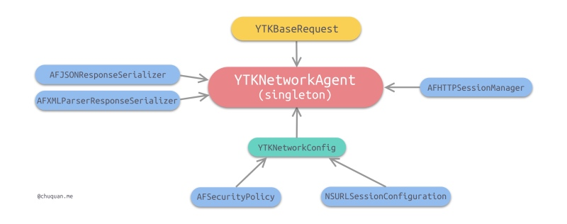
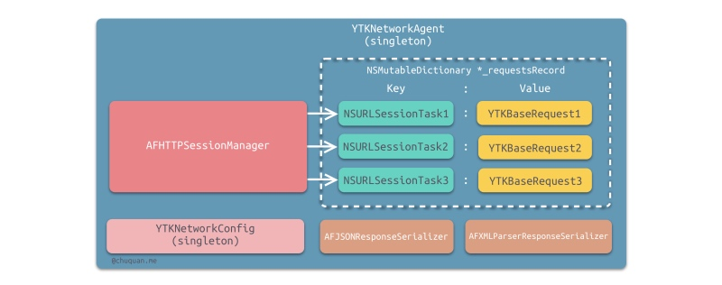
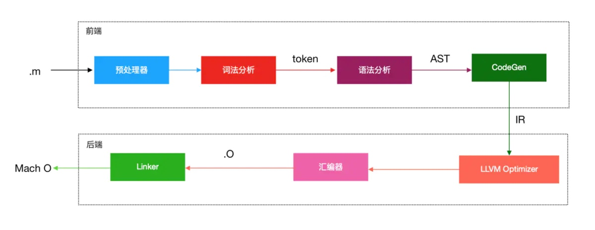

# iOS基础整理
-------

[TOC]


### plist

不能直接将自定义模型存进plist里，要先将模型转字典才能存进去，要想直接存自定义模型可以试一下用归档和解档

### 属性

https://www.jianshu.com/p/2e3bd492ec1b

### new 和 alloc init 的区别

- new 和 alloc init 在功能上没有什么区别，都是分配内存完成初始化

- 差别在于

  >  1.采用new的方式只能采用默认的init完成初始化，而如果采用alloc init的方式可以用其他自定义的初始化方法
  >
  >  2.类调用alloc方法返回一个实例对象并分配好内存，再由实例对象区调用init方法完成初始化
  >
  >  3.alloc使用了Zone分配的内存会和相关联的对象在内存地址中相靠近，这样的好处是：调用时消耗更少的代价，提升了程序处理速度
  >
  >  > NSZone 是 用于维护一块用于对象内存分配及释放的内存池 的描述信息，进程默认的NSZone在启动时创建并将对象均分配在这里，但经过大量的内存分配和释放之后，可能会产生很多的内存碎片，在做新的内存分配的时候NSZone会试图去填补这些碎片，这个查找过程是需要时间开销的

### 数据类型 - NSObject

- 在OC中，我们使用的框架叫`Cocoa`，对应的iOS版本叫做`Cocoa Touch`，这两个框架内部代码部分是相同的，比如最基础也是最重要的`Foundation`框架

- `Foudation`框架中几乎所有对象都是以`NS`开头
- 在所有的NS对象中，最基础的类就是`NSObject`类，是所有`Cocoa`框架中所有对象的基类

### instancetype id

- 返回类型为`instancetype`的函数 表示 返回值代表当前类的实例，比如在`NSObject`类中，`instacnetype`表示返`NSObject`的实例
- instancetype 和 id 相似，但是instancetype有类型检测功能，函数返回时instancetype会判定该对象是某特定类的实例，而id则只是表示一个未知的OC对象


### 野指针 空指针 僵尸对象

- 空指针是没有存储任何的内存地址
- 野指针指向一块内存地址，但这块内存地址不可用（野指针指向的对象已经被释放掉了），假如：指针A指向着对象B，B被释放之后，A仍然指向那块内存地址，但是指针A还是可以访问那块内存地址，但如果那块内存地址重新分配给了另一个指针，当指针A再次访问就是有`crash`
- 在OC中，如果对象被释放之后占用的内存没有被重写（重新分配给其他对象），那么该对象被称为僵尸对象


### nil Nil NULL NSNULL

- nil OC中对象的空指针
- Nil OC中类的空指针
- NULL C类型的空指针
- NSNULL 数值类的空对象


### Blocks

忘了重新看一下工作室多线程和内存管理的书

- Blocks是C语言的扩充功能，一句话来表示Blocks的扩充功能：带有自动变量（局部变量）的匿名函数
- 匿名函数就是不带名称的函数，C语言中是不允许这样的函数出现的
- Blocks的好处 不用另外去创建一个函数，简单明了，比如要给一个函数传递一个url，那么如果函数的最后一个参数是一个Blocks，我们就可以在Blocks里写明拿到url之后要去干嘛，这样就比较得直接。

#### Blocks语法

> Blocks的标记性符号：^插入记号

- ^`返回值类型` `参数列表` `表达式` 
- ^ `参数列表` `表达式` 
- ^ `表达式`

#### Blocks类型变量

```swift
   	//blocks是这个blocks块的变量名
		int (^blocks)(int) = ^(int count){
        return 1;
    };
```

#### 截取自动变量值

- blocks块里有变量num，那么Blocks就会保存该自动变量的瞬时值，当Blocks后面再去修改该自动变量的值是不会影响之前截取的值的

```swift
    int num = 10;
    void (^blocks)(void) = ^{
        NSLog(@"%d",num);
    };
    num = 20;
    blocks();
    //输出结果仍然为10
```

#### __block说明符

- 如果在Blocks里要修改自动变量的值，那么就需要借助__block，否则是会报错的

```swift
   __block int num = 10;
    void (^blocks)(void) = ^{
        num = 20;
        NSLog(@"%d",num);
    };
    blocks();
    //输出结果为20
```

#### 截获的自动变量

- 如果对Blocks截获的自动变量进行赋值就会产生编译错误（在没有使用__blocks修饰符的情况下）
- 但是如果截获的是OC对象，那么调用该对象的方法是不会报错的，赋值还是会报错

```swift
   	//array是一个NSMutableArray类的对象，而Blocks截获的变量值是一个NSMutableArray类的对象，那么用C语言描述，就是截获了NSMutableArray类对象的结构体实例指针，因此使用内部方法是不会产生编译错误的
		NSMutableArray *array = [[NSMutableArray alloc] init];
    void (^blocks)(void) = ^{
        [array addObject:@"s"];
    };
    blocks();
```

### Blocks的实现

- 将OC代码转换成C++之后（说是C++，其实也仅是使用了struct结构体，其本质是C语言源代码），发现Blocks在源代码里其实是一个结构体（OC对象本质是结构体，Blocks也是OC的对象）

> Blocks转换成C++之后，本质是一个impl_0结构体，内部包含了impl，desc_0结构体以及外部需要访问的变量
>
> 1.impl结构体存放的有
>
> ​	isa指针 isa保持该类的结构体实例指针（`对象`里的isa指针指向它的`类对象`，`类对象`里的isa指针指向它的`元类`，`元类`里保存的是怎么去创建一个`类对象`和`类方法`的信息，而`类对象`里的元数据保存的是如何去实例化一个`类的对象`）
>
> ​	Flags 标志
>
> ​	Reserved 今后版本升级所需的区域
>
> ​	FuncPtr Blocks块里执行代码的函数指针 —— 对应着func_0函数
>
> 2.desc_0结构体存放的有
>
> ​	reserved今后版本升级所需的区域
>
> ​	Block_size Block的大小
>
> 3.impl_0结构体存放的有
>
> ​	结构体impl的实例
>
> ​	结构体desc_0的实例
>
> ​    Impl_0的初始化方法 用于给impl，desc_0结构体的成员变量赋值
>
> 4.func_0函数存放的是
>
> ​	Blocks块里的执行代码块
>
> 实现
>
> ​	Blocks在初始化时，是调用impl_0函数的初始化，把函数指针func_0以及结构体实例指针desc_0_DATA作为函数的参数传进去（desc_0_DATA里存放的是impl_0结构体大小的数据）
>
> Blocks在调用时，实际上是使用函数指针调用函数（impl结构体里的FuncPtr）

#### 截获自动变量值

> - 初始化Blocks 就是对Blocks里的impl_0结构体进行初始化，而截获的自动变量会作为参数传进去 对 impl_0进行初始化
> - 而传进去的自动变量会作为impl_0结构体的成员变量，成员变量在赋值时只是把传进来的自动变量的值赋值过去——因为是无法在Block块修改值的
> - 自动变量在Blocks内外的数据类型都是一样的
> - 当在func_0函数中需要用到自动变量时 根据_cself->变量去获取成员变量 ——cself是C++的写法，可以理解为当前结构体实例


#### __block说明符

在Block里实现对自动变量重新赋值，有两种做法

做法1:

> 截获的自动变量是 全局变量 ，静态全局变量 或者 静态变量
>
> 如果截获的自动变量是 全局变量 或者 静态全局变量
>
> - 那么Blocks块里是可以直接访问自动变量的，没有做出任何的改变
>
> 如果截获的自动变量是静态变量
>
> - 在Blocks的结构体impl_0中会多出一个指向静态变量的指针，impl_0在初始化时会把静态变量的地址传进去，当需要对自动变量赋值时，是通过指针去访问静态变量的值，从而进行修改

做法2:

>利用__block修饰符修饰变量
>
>- Blocks里的impl_0结构体外会多出一个关于自动变量的结构体，该结构体里有一个isa指针，一个forwarding指针指向结构体自身，一个flags，一个size，还有一个值保存自动变量的值
>- 在Blocks初始化impl_0时会把自动变量的结构体指针以及指针的地址传进去
>- 当需要修改自动变量的值时，通过访问成员变量farwarding去访问结构体里的自动变量


#### Block存储域

- NSConcreteStackBlock -  Block对象存储在栈区

  - 没有直接指向Block的在栈区，比如下面的Block

  ```swift
   NSLog(@"%@",[ ^{NSLog(@"1");} class]);
  ```

  

- NSConcreteGlobalBlock- Block对象存储在程序的数据区域(.data区)

  > 1.在记述全局变量的地方有Block语法时
  >
  > 2.Block语法的表达式不使用应截获的自动变量

- NSConcreteMallocBlock- Block对象存储在堆区

  > 当变量作用域结束时，栈上的__block变量和Block也被废弃
  >
  > 而复制到堆上的__block变量和Block在变量作用域结束时不受影响

- 对Block调用copy方法

  > 1.栈上的Block会复制到堆上
  >
  > 2.堆上的Block复制，引用计数会增加
  >
  > 3.程序的数据区域上的Block复制后没有变化

- 在ARC模式下，大多数编译器会自动将Block从栈区拷贝到堆上

  - 但是如果向方法或者函数的参数里传递Block，编译器是不能进行
    - 向方法或者函数参数传里Block 有两个特例（Block已经被复制到堆区）
      - 1Cocoa框架的方法且方法名中含有usingBlock
      - GCD的API

- 手动对Block拷贝 调用copy方法

  - ARC模式下多次拷贝是没有问题的
  - 在不需要拷贝的情况将Block拷贝到堆会增加CPU的消耗

#### __block变量存储域

- 当Block从栈复制到堆上

  - 如果__block存储在栈上，Block复制之后,  _ _block会从栈复制到堆上并被Block持有
  - 如果__block存储在堆上，Block复制之后，_ _ _block无影响，还是被Block持有

- 当多个Block同时使用同一个__block，那么这么Block从栈复制到堆上时，也会同时持有_ _ _block变量

- 当堆上的Block被废弃，那么它使用的__block变量也会被释放

- 当堆上多个Block同时持有__block，那么当持有的这些Block都被废弃了，_ _ _block才会被销毁（这里相当于内存管理里的引用计数）

- __block变量从栈区复制到堆区后，变量的forwarding指针已经从指向栈区 的结构体转向指向堆区的结构体，那么无论是在Block块内还是外都可以访问到同一个_ _ _ block变量

  ```swift
      __block int val = 10;
      //从堆区访问val
      void (^blk)(void) = [^{++val;} copy];
      //从栈区访问val
      ++val;
  ```

  

#### 截获对象

> Block截获的对象实现超过它的变量作用域而存在

- Block虽然能够截获自动变量，但是如果变量超过它的变量作用范围就会被丢弃，那么调用Block程序就会崩溃

- 那么怎么做到尽管变量超过了它的作用范围，调用Block时仍然不会崩溃呢

- 利用Block的copy函数

  >1.对Block进行copy，那么Block就会从栈区复制到了堆区
  >
  >2.而Block内部：在impl_0结构体初始化时会生成一个id__strong对象的成员变量，有一个:_ _ _ strong修饰符修饰该对象（虽然说C语言结构体里不允许有_ _strong修饰符出现，但是OC运行时库能够准确把握Block的初始化和销毁时机，因此尽管带有strong修饰符，也可以恰当地初始化和丢弃）
  >
  >以及多出一个copy函数和dispose函数，copy函数用于捕获的对象的初始化，dispose函数用于对象的销毁，这两个函数都是自动调用的，在Block调用copy时会对捕获的对象进行初始化，在Block被丢弃时会自动调用dispose函数销毁对象


#### __block变量和对象

- __block说明符可指定任何类型的自动变量

  > 当__block修饰对象时
  >
  > - Block内部 会多出关于该对象的结构体，这结构体跟之前的自动变量不同的是，结构体内部会新增object_copy和object_dispose两个方法，而且结构体内部的对象会有__strong修饰
  > - 当Block被复制到堆时，会调用object_copy函数，让Block持有该对象，当堆上的Block被废弃时，会调用object_dispose函数，释放Block截获的对象
  > - 而如果该对象被__block修饰，Block从栈复制到堆时，____block也会从栈复制到堆，并使用object_copy(assign)函数去持有赋值给__block变量的对象，当堆上的_____block变量被废弃时，使用object_dispose函数，释放赋值给____block变量的对象

#### Block循环引用

- 在Block中使用附有__strong修饰符的对象类型自动变量，那么当Block从栈复制到堆时，该对象为Block持有，这样容易引起循环引用

  ```swift
  //这种就会造成循环引用 self持有对象blk，blk被copy之后从栈复制到堆上，blk捕获了由strong（默认是strong）修饰的对象self，并持有了self，因此就会造成循环引用
  @property (nonatomic, copy) void (^blk)(void);
  self.blk = ^{NSLog(@"%@",self);};
  self.blk = ^{NSLog(@"%@",self.view);};
  //上面两种都会造成循环引用
  ```

  

- 为了避免循环引用，可声明附有__weak修饰符的变量

  ```swift
  id __weak temp = self;
  self.blk = ^{NSLog(@"%@",temp);};
  ```

  

- 除了使用__weak来避免循环引用，还可以使用____block来避免循环引用

  图中的代码如果不执行Block是会造成循环引用的

  - 对象持有了Block
  - Block持有__block变量
  - __block变量持有对象，因此造成了循环引用

  但是执行了Block之后 是不会造成循环引用了，因为temp被置为nil

  

#### copy/release

- 一般@property声明Block时都是用copy修饰

- ARC无效时，一般需要手动复制Block，利用copy方法进行复制，用release方法来释放Block

- 另外ARC无效时，__block说明符用来避免Block中的循环引用。

  > 当Block从栈复制到堆
  >
  > 若Block使用的变量为附有__block说明符的id类型或者对象类型的自动变量，不会被retain（不会被Block持有）
  >
  > 若Block使用的变量为没有__block说明赋的id类型或者对象类型的自动变量，就会被retain（被Block持有）

- 在ARC有效时和无效时__block说明符的用途有很大的区别


### tableViewCell自适应高度

- 自定义cell，并且cell内部的控件做好约束

- 设置``tableView.estimatedRowHeight``的值，这个值要尽量跟实际的cell的高度相近或者相等，这样效率会更高

  > ```swift
  > tableView.rowHeight = UITableViewAutomaticDimension;//给cell高度一个预估的值
  > tableView.estimatedRowHeight = 140;
  > ```
  >
  > 1.```estimatedRowHeight```这个值要尽量跟cell的高度相近
  >
  > 当```tableView```要显示时，先会根据要创建的cell的个数给每一个cell返回一个```estimatedRowHeight```高度，然后根据```estimatedRowHeight*count```去得出```tableView```的```contentsize```（```tableView```继承于`scrollView`），contentsize被赋值之后，cell才能够显示
  >
  > 2.因此，如果没有设置`estimatedRowHeight`那么就要先把cell的真实高度都算出来才能得出`contentsize`，这样`cell`才能够显示，这也会消耗一点时间以及损耗性能
  >
  > 3.由于一开始tableView的`contensize`并不是最终的值，那么`tableView`在滑动过程中`contensize`会不断得被更新，这样就可能会出现页面抖动的情况
  >
  > 4.解决页面抖动的情况
  >
  > - `estimatedRowHeight`贴近真的cell高度值
  >
  > - `estimatedRowHeight`设置为0，但就是有性能的损耗
  >
  >   ```swift
  >     _tableView.estimatedSectionHeaderHeight = 0;
  >     _tableView.estimatedSectionFooterHeight = 0;
  >     _tableView.estimatedRowHeight = 0;
  >   ```

- 没使用estimatedRowHeight

  > ```undefined
  > 1.先调用numberOfRowsInSection
  > 2.再调用heightForRowAtIndexPath
  > 3.再调用cellForRowAtIndexPath
  > ```

- 使用了estimatedRowHeight

  ```
  1.numberOfRowsInSection
  2.estimatedHeightForRowAtIndexPath
  3.cellForRowAtIndexPath
  4.heightForRowAtIndexPath
  ```

  

### UDID

> 所谓UDID指的是设备的唯一设备识别符，移动广告商和游戏[网络运营商](https://baike.baidu.com/item/网络运营商/10725392)往往需要通过UDID用来识别玩家用户，并对用户活动进行跟踪。

### GCD

#### 队列

```swift
dispatch_queue_t queue = dispatch_queue_create("gcdTest", DISPATCH_QUEUE_SERIAL);
//这也是创建了一个串行队列
dispatch_queue_t queue = dispatch_queue_create("net.bujige.testQueue", NULL);
```

- gcdTest 是队列的名字

- DISPATCH_QUEUE_SERIAL 表示串行队列

- DISPATCH_QUEUE_CONCURRENT表示并行队列

- ```swift
  dispatch_queue_t queue = dispatch_get_main_queue();
  //获取主队列，主队列就是串行队列
  ```

- ```swift
  dispatch_queue_t queue = dispatch_get_global_queue(DISPATCH_QUEUE_PRIORITY_DEFAULT, 0);
  //获取全局队列，是一个并发队列,可以理解为开辟了全局线程
  //DISPATCH_QUEUE_PRIORITY_DEFAULT 表示该队列的优先级为默认 0
  //DISPATCH_QUEUE_PRIORITY_HIGH 表示为高优先级 2
  //DISPATCH_QUEUE_PRIORITY_LOW 表示为低优先级 -2
  //DISPATCH_QUEUE_PRIORITY_BACKGROUND 表示为后台 INT16_MIN
  //第二个参数默认为0，暂时没什么用
  ```

#### dispatch_set_target_queue

有两个作用，一个是变更指定队列queue的优先级，第二个是可以做成队列的执行阶层

- 变更队列queue的优先级

  > 由于创建SERIAL或者CONcurrent队列都使用与默认优先级Global Disoatch Queue相同执行优先级的线程

```swift
//一般变更优先级是用在异步中的，如果用在同步中，是有执行顺序，不管优先级的   
dispatch_queue_t serialDiapatchQueue=dispatch_queue_create("com.GCD_demo.www", DISPATCH_QUEUE_SERIAL);
    dispatch_queue_t dispatchgetglobalqueue=dispatch_get_global_queue(DISPATCH_QUEUE_PRIORITY_LOW, 0);
        
    //第一个参数为要设置优先级的queu
    //第二个参数是参照物，既将第一个queue的优先级和第二个queue的优先级设置一样。
    dispatch_set_target_queue(serialDiapatchQueue, dispatchgetglobalqueue);
        
        
    dispatch_async(serialDiapatchQueue, ^{
        NSLog(@"我优先级低，先让让");
    });
        
    dispatch_async(dispatch_get_global_queue(DISPATCH_QUEUE_PRIORITY_DEFAULT, 0), ^{
        NSLog(@"我优先级高,我先block");
    });
//打印出
//我优先级高,我先block
//我优先级低，先让让
```

- 可以做成队列的执行阶层

  可以理解为将三个队列加到了串行队列中，由原来的并发执行变成同步执行

  如果target queue是并发队列，那么三个队列加进去之后还是并发的

```swift
 //1.创建目标队列
        dispatch_queue_t targetQueue = dispatch_queue_create("test.target.queue", DISPATCH_QUEUE_SERIAL);
        
        //2.创建3个串行队列
        dispatch_queue_t queue1 = dispatch_queue_create("test.1", DISPATCH_QUEUE_SERIAL);
        dispatch_queue_t queue2 = dispatch_queue_create("test.2", DISPATCH_QUEUE_SERIAL);
        dispatch_queue_t queue3 = dispatch_queue_create("test.3", DISPATCH_QUEUE_SERIAL);
        
        //3.将3个串行队列分别添加到目标队列
        dispatch_set_target_queue(queue1, targetQueue);
        dispatch_set_target_queue(queue2, targetQueue);
        dispatch_set_target_queue(queue3, targetQueue);
        
        
        dispatch_async(queue1, ^{
            NSLog(@"1 in");
            [NSThread sleepForTimeInterval:3.f];
            NSLog(@"1 out");
        });
        
        dispatch_async(queue2, ^{
            NSLog(@"2 in");
            [NSThread sleepForTimeInterval:2.f];
            NSLog(@"2 out");
        });
        dispatch_async(queue3, ^{
            NSLog(@"3 in");
            [NSThread sleepForTimeInterval:1.f];
            NSLog(@"3 out");
        });
//打印结果
2021-04-15 10:50:09.942751+0800 basicLearn[4085:125000] 1 in
2021-04-15 10:50:12.946472+0800 basicLearn[4085:125000] 1 out
2021-04-15 10:50:12.946856+0800 basicLearn[4085:125000] 2 in
2021-04-15 10:50:14.948848+0800 basicLearn[4085:125000] 2 out
2021-04-15 10:50:14.949121+0800 basicLearn[4085:125000] 3 in
2021-04-15 10:50:15.949637+0800 basicLearn[4085:125000] 3 out
```

#### dispatch_after - GCD的延时方法

dispatch_after并不是在指定时间之后开始执行，而是在指定时间之后将任务添加到队列中

dispatch_after本身是一个异步函数，具有开辟新线程的能力

```swift
    //DISPATCH_TIME_NOW表示当前时间
		//ull 是C语言的数值字面量
		//NSEC_PER_SEC是以秒为单位 
		//NSEC_PER_MSEC是以毫秒为单位
    dispatch_time_t time = dispatch_time(DISPATCH_TIME_NOW, 1ull * NSEC_PER_SEC);
    dispatch_after(time,dispatch_get_main_queue(), ^{
        NSLog(@"1");
        NSLog(@"%@",[NSThread currentThread]);
    });
    NSLog(@"q");
//打印
//q
//1（经过了1秒）
//线程
```


#### Dispatch Group

- 实现追加到队列中的多个处理全部结束后想执行结束处理，那么这时可以使用Dispatch Group

  等到并行执行的线程执行完之后 有一个结束处理

  ```swift
  //将Block添加到队列queue1，并指定这个Block属于这个group
  //当属于该group的Block都执行完之后，group就会检测到执行结束，就会把结束处理添加到queue中
  dispatch_group_async(group, queue1, ^{
          NSLog(@"1");
      });
  ```

  

  ```swift
   NSLog(@"begin");
      NSLog(@"%@",[NSThread currentThread]);
      
      dispatch_group_t group = dispatch_group_create();
      
      dispatch_queue_t queue1 = dispatch_get_global_queue(DISPATCH_QUEUE_PRIORITY_DEFAULT, 0);
      
      dispatch_queue_t queue2 = dispatch_get_global_queue(DISPATCH_QUEUE_PRIORITY_DEFAULT, 0);
      
      dispatch_group_async(group, queue1, ^{
          NSLog(@"1");
      });
  
      dispatch_group_async(group, queue2, ^{
          NSLog(@"2");
      });
  
      dispatch_group_notify(group, queue1, ^{
          NSLog(@"3");
      });
      
      NSLog(@"end");
  
  //最后输出为
  begin
  线程
  end
  1
  2
  3
  ```

  

#### dispatch_group_wait

- 阻塞当前线程，等指定的group里的任务都执行完成之后，才会继续往下执行

  ```swift
  NSLog(@"begin");
      NSLog(@"%@",[NSThread currentThread]);
      
      dispatch_group_t group = dispatch_group_create();
      
      dispatch_queue_t queue1 = dispatch_get_global_queue(DISPATCH_QUEUE_PRIORITY_DEFAULT, 0);
      
      dispatch_queue_t queue2 = dispatch_get_global_queue(DISPATCH_QUEUE_PRIORITY_DEFAULT, 0);
      
      dispatch_group_async(group, queue1, ^{
          NSLog(@"1");
      });
  
      dispatch_group_async(group, queue2, ^{
          NSLog(@"2");
      });
  //阻塞了主线程，等group里的任务都执行完了之后再执行输出end的操作
      dispatch_group_wait(group, DISPATCH_TIME_FOREVER);
      
      NSLog(@"end");
  ```

  

#### dispatch_barrier_async

- GCD的栅栏方法：相当于将queue里的任务分成了前后部分，栅栏前的任务执行完之后，才可以去执行栅栏后的任务

  ```swift
  NSLog(@"begin");
      
      
      dispatch_queue_t queue = dispatch_queue_create("net.bujige.testQueue", DISPATCH_QUEUE_CONCURRENT);
          
          dispatch_async(queue, ^{
              // 模拟耗时操作
              NSLog(@"1---%@",[NSThread currentThread]);      // 打印当前线程
          });
          dispatch_async(queue, ^{
              // 模拟耗时操作
              NSLog(@"2---%@",[NSThread currentThread]);      // 打印当前线程
          });
          
          dispatch_barrier_async(queue, ^{
                  // 模拟耗时操作
              NSLog(@"barrier---%@",[NSThread currentThread]);// 打印当前线程
          });
          
          dispatch_async(queue, ^{
                           // 模拟耗时操作
              NSLog(@"3---%@",[NSThread currentThread]);      // 打印当前线程
          });
          dispatch_async(queue, ^{
                          // 模拟耗时操作
              NSLog(@"4---%@",[NSThread currentThread]);      // 打印当前线程
          });
      NSLog(@"end");
      //输出 
  //begin
  //end
  //12顺序不定
  //barrier
  //34顺序不定
  ```

  

#### dispath_async

- 意味着“非同步”，就是把指定的Block“非同步”地追加到指定的Dispatch Queue中，dispatch_async不做任何等待
- dispatch_sync意味着同步

#### dispatch_apply

该函数按指定的次数将Block追加到指定的Dispatch Queue中，并等待全部处理执行结束

```swift
dispatch_apply(10, queue, ^(size_t index) {
            NSLog(@"%zu",index);
        });
NSLog(@"q");
//第一次参数 是指明 要重复的次数
//第二个参数 是指明 要添加到的队列
//第三个参数 是指明 次数的下标
//如果queue是串行的，那么就会按照次序输出，如果是并行的，就是没有次序输出，有利于提高效率
//只有dispatch_apply里的Block都执行完之后 才会去输出q，可以将dispatch_apply理解为dispatch_sync，相当于是同步的，但还是有开辟新的线程的
```

```objective-c
    dispatch_queue_t queue = dispatch_get_global_queue(DISPATCH_QUEUE_PRIORITY_DEFAULT, 0);
    
    dispatch_async(queue, ^{
        dispatch_apply(10, queue, ^(size_t index) {
            NSLog(@"%zu",index);
        });
    });
    
    dispatch_async(dispatch_get_main_queue(), ^{
        NSLog(@"%@",[NSThread currentThread]);
    });
//输出
//先随机输出dispatch_apply函数的Block的index值
//才会去输出线程
```

#### dispatch_suspend/dispatch_resume

当追加了大量处理到Dispatch Queue时，在追加处理的过程中，有时希望不执行已追加的处理，这时可以对queue进行挂起，挂起后，追加到Queue里但还没执行的处理会停止执行，恢复之后，queue里的处理能够继续执行

```swift
    //挂起队列
    dispatch_suspend(queue);
    //恢复队列
    dispatch_resume(queue);
```

#### Dispatch Semaphore

Dispatch Semaphore是GCD的信号量，用来管理对资源的并发访问

当信号量为0时等待，当信号量大于等于1时不等待

```objective-c
//第一个参数为信号量semaphore，判断当前信号量是否>=1若是，那么该信号量➖1，不用等待，如果信号量为0，那么要阻塞当前线程。
//第二个参数DISPATCH_TIME_FOREVER是dispatch_time_t类型，这个表示一直等待，当这个参数设置了一定时间之后，经过时间也是会继续执行的
//当信号量大于等于1或者超过一定的时间限制，会继续执行不等待
dispatch_semaphore_wait(semaphore, DISPATCH_TIME_FOREVER);
```

```objective-c
//semaphore信号量会➕1
dispatch_semaphore_signal(semaphore);
```

- 信号量的使用有两大作用
- 保持线程同步 和 为线程加锁

##### 保持线程同步

```objc
dispatch_queue_t queue = dispatch_get_global_queue(DISPATCH_QUEUE_PRIORITY_DEFAULT, 0);
   dispatch_semaphore_t semaphore = dispatch_semaphore_create(0);

   __block int j = 0;
   dispatch_async(queue, ^{
        j = 100;
        dispatch_semaphore_signal(semaphore);
   });

   dispatch_semaphore_wait(semaphore, DISPATCH_TIME_FOREVER);
   NSLog(@"finish j = %zd", j);
//最后输入j = 100
//Block块异步添加到了全局并发队列中，所以程序在主线程会跳过Block块（同时开辟子线程异步执行Block块），执行Block块外的代码dispatch_semaphore_wait，因为semaphore信号量的值为0，而且时间为DISPATCH_TIME_FOREVER，所以会阻塞当前线程（主线程），当子线程里的Block块执行完之后，信号量semaphore➕1，那么被阻塞的线程（主线程）会恢复执行，这样就保证了线程之间的同步
```

##### 为线程加锁

```objc
//queue创建是一个默认优先级的全局并发队列
dispatch_queue_t queue = dispatch_get_global_queue(0, 0);
dispatch_semaphore_t semaphore = dispatch_semaphore_create(1);

for (int i = 0; i < 100; i++) {
     dispatch_async(queue, ^{
          // 相当于加锁
          dispatch_semaphore_wait(semaphore, DISPATCH_TIME_FOREVER);
          NSLog(@"i = %zd semaphore = %@", i, semaphore);
          // 相当于解锁
          dispatch_semaphore_signal(semaphore);
      });
}
//当线程1执行到dispatch_semaphore_wait这一行时，semaphore的信号量为1，继续执行后面的输出语句，此时semaphore信号量➖1，如果在线程1执行NSLog输出语句时，线程2来访问，由于semaphore信号量已经为0，这么线程2只能等待，无法继续执行，知道线程1执行完dispatch_semaphore_signal，semaphore信号量➕1，那么线程2才能解除阻塞继续往下执行，这样就可以保证只有一个线程在执行NSlog这一行代码，所以就相当于给线程加锁
```

#### dispatch_once

单例模式——使用dispatch_once方法能保证某段代码在程序运行过程中只执行1次，并且在多线程的环境下，dispatch_once也可以保证线程安全

```objc
//利用单例模式创建一个AccountManager的对象
//以后调用sharedManager方法就会返回它的对象，不用每一次都alloc init
//static 修饰变量，那么只占一份内存，就不用每次调用这个方法 又占一份内存
+ (AccountManager *)sharedManager {
    static AccountManager *sharedAccountManagerInstance = nil;

    static dispatch_once_t predicate; dispatch_once(&predicate, ^{      
          sharedAccountManagerInstance = [[self alloc] init];
    });

    return sharedAccountManagerInstance;

}
```

#### Dispatch I/O

- 实现多线程并列读取文件


## TintColor 与 BackgroundColor

- BackgroundColor是设置View的背景颜色
- TintColor是设置View里面的轮廓颜色

## UITableViewDiffableDataSource

UITableViewDiffableDataSource是iOS13新推出的，继承自NSObject，内部遵循了UITableViewDataSourceDelegate，是UITableView实现局部刷新的好方法。

之前UITableVIew刷新数据的方法有两种，一种是reloadData，这种是刷新页面上显示的全部cell，另一种是reloadRowsAtIndexPaths，这种是要根据算出的NSIndexPath，然后对对应的cell进行刷新，但是这种方法不好的是：刷新cell的过程是 先把这个cell删除，然后重新创建一个新的cell，从而实现对数据的刷新。前面两种方法，一旦刷新频率变快，很容易出现内存爆满或者引发了crash

UITableViewDiffableDataSource负责当前数据源配置，NSDiffableDataSourceSnapShot是负责变更后的数据处理，UITableViewDiffableDataSource通过调用自身的apply方法将NSDiffableDataSourceSnapShot变更后的数据更新到UITableView或UICollectioniew的UI

[文章入口1](https://xiaozhuanlan.com/topic/9158203647)

[文章入口2](https://www.jianshu.com/p/66e3694363b3)

## App Clips

App Clips 相当于 苹果🍎的小程序，用户可以在未安装主程序的情况下体验该应用的部分功能，当安装了应用之后，App Clips上的数据就会自动迁移到主程序

[文章入口🔗](https://xiaozhuanlan.com/topic/4063519872)


## Universal Links

Universal Links是 HTTP 或 HTTPS URL，他们可以使用户在App内而不是在Web浏览器上打开你要的内容，但是如果要打开的App还没安装， 那么也可以在Web浏览器上打开。

目前的Universal Links实际上是替代了之前的URL Scheme，相比于URL Scheme，Universal Links具有的优势是

1.通用。Universal LInks是标准的URL格式，而自定义URL Scheme很特殊，只有对应的App才能解析和处理

2.安全。当用户安装应用时，iOS会检查上传到网络服务器的文件配置，来确保网站允许应用去打开URL

3.灵活。即使未安装应用，也是可以在Web浏览器打开浏览，而URL Scheme由于是特殊的，一般不可以在Web浏览器打开

4.简单。一个URL对网站和App均适用

5.隐私。当其他应用与App通信时，无需知道你的App是否已经安装

[文章入口连接🔗](https://xiaozhuanlan.com/topic/1973850246)

## Core Text
Core Text是对文本进行绘制的api

## NSFileManager
NSFileManager类主要对文件和目录进行操作（删除，移除，查找，移动，复制等等）。如果要对文件内容进行更改，应该使用NSFileHandle。所以说NSFileManager是偏向于对文件的管理，而不是对文件内容的操作。

## NSURLSession
NSURLSession由三部分组成：
NSURLSession：请求会话对象，可以用系统提供的单例对象，也可以自己创建
NSURLSessionConfiguration：对Session会话进行配置，一般使用default
NSURLSessionTask：负责执行具体请求的task，由Session创建

值得注意的是⚠️
下面的代理方法是请求数据时执行的代理方法
```swift
/**  告诉delegate已经接受到服务器的初始应答, 准备接下来的数据任务的操作. 在这个方法里可以将task取消或者继续执行，如果要继续执行，那么就要调用completionHandler这个Block，并把allow参数传进去
*/
- (void)URLSession:(NSURLSession *)session dataTask:(NSURLSessionDataTask *)dataTask didReceiveResponse:(NSURLResponse *)response completionHandler:(void (^)(NSURLSessionResponseDisposition disposition))completionHandler 

/** 告诉delegate已经接收到部分数据. */
- (void)URLSession:(NSURLSession *)session dataTask:(NSURLSessionDataTask *)dataTask didReceiveData:(NSData *)data


/** 告诉delegate, data task 已经转变成download task. */
- (void)URLSession:(NSURLSession *)session dataTask:(NSURLSessionDataTask *)dataTask didBecomeDownloadTask:(NSURLSessionDownloadTask *)downloadTask
```
代理方法调用的前提是：NSURLSessionDataTask要创建对
```swift
        //这种创建的Task是会走代理方法的
        self.dataTask = self.session.dataTask(with: request as URLRequest)
        //这种创建的Task是不会走代理方法的，已经自带conpletionHandler，请求数据完成就会调用这个闭包
        self.dataTask =  self.session.dataTask(with: request as URLRequest, completionHandler: { (data, response, error) in
        })
```
[NSURLSession学习](http://chuquan.me/2019/07/21/ios-network-nsurlsession/)

## AFNetworking
AFFNetworking是一套适用于iOS、macOS、watchOS、tvOS的网络库，AFNetworking2.0之后的版本是构建基于NSURLSession的Foundation URL加载系统之上。AFNetworking扩展了Cocoa内置的强大的高级网络抽象，采用模块化设计，功能丰富，是最广泛使用的开源项目之一。

AGNetworking
[AFNetworking学习](http://chuquan.me/2019/08/06/ios-network-afnetworking/)

## YTKNetworking
YTKNetworkk是猿题库技术团队开源的一个网络请求框架，内部封装了AFNetworking。YTKNetwork实现了一套高级的API，提供更高层次的网络访问抽象。

虽然YTKNetwork是基于AFNetworking的进一步封装，而两者其实本质上都是对NSURLSession的进一步封装，但是两者的使用是大不相同的。AFNetworking是属于集约式API，而YTKNetwork是属于离散式API
> 集约式API：
> 项目中的每一个请求都会走统一的入口，对外暴露了请求的地址，参数，以及请求方式。这种方式简单便捷，但是不利于拓展。
> 离散式API：
> 项目中的每一个请求都是继承于YTKBaseRequest，一个请求就相当于一个对象，只需要传入参数就可以初始化一个请求。这种方法URL、请求方式和响应方式等都不暴露给外部，可以避免外部调用时出现配置出错。这样业务使用起来简单，业务使用者不需要关心内部是怎么实现的，而且可拓展性强，缺点就是增加了很大一部分的代码，包的体积会变大相对较多。

相对于AFNetworking，YTKNetwork提供了以下更加高级的功能。
    - 支持按时间缓存网络请求内容
    - 支持按版本号缓存网络请求内容
    - 支持统一设置服务器和CDN的地址
    - 支持检查返回的JSON内容的合法性
    - 支持网络的批量请求以及链式请求

    
YTKNetwork开源框架主要包含3个部分：
    - YTKNetwork核心功能
    - YTKNetwork链式请求
    - YTKNetwork批量请求

### YTKNetwork核心思想


YTKNetwork核心功能的基本思想是：
    - 把每一个网络请求都封装成一个对象，每个请求对象都继承于YTKBaseRequest
    - 使用YTKNetworkAgent单例对象持有一个AFHTTPSessionManager对象管理所有请求对象。

YTKNetwork核心功能主要涉及到三个类：
    - YTKBaseRequest
    - YTKNetworkConfig
    - YTKNetworkAgent

#### YTKBaseRequest
YTKBaseRequest类其实就是在NSURLSession的基础上的进一步封装。开发者通过复写YTKBaseRequest的方法来进行网络请求的配置，比如复写requestUrl、请求方式、响应方式等等。
当网络请求开始时，request就会被加入到YTKNetworkAgent的管理请求队列中。

#### YTKNetworkConfig
YTKNetworkConfig是用于YTKNetworkAgent初始化的配置对象，YTKNetworkConfig持有一个NSURLSessionConfiguration用于初始化YTKNetworkAgent持有的AFHttpSessionManager（其实本质上就是在初始化NSURLSession）；
而YTKNetworkConfig持有的baseUrl属性是请求的服务器的地址

#### YTKNetworkAgent
结构图大概如下：


YTKNetworkAgent初始化过程会使用到YTKNetworkConfig单例对象，再使用YTKNetworkConfig的持有对象sessionConfiguration去初始化AFHTTPSessionManager

#### 请求流程
执行Request请求的第一步都是会将当前的Request添加到YTKnetworkAgent管理的请求队列下（这里调用的是addRequest方法）。
1.在addRequest方法里主要是进行初始化dataTask，设置task的优先级，将task加入到记录表中，以及执行task。
2.在初始化datatask又调用另外一个方法（sessionTaskForRequest：）
3.在sessionTaskForRequest方法里其实是调用了AFHTTPSessionManager对请求的初始化方法，根据请求的method（GET、POST等）已经request的参数等调用NSURLSession的原生api去初始化dataTask
4.而对于请求的method为GET的情况，方法内部是会去判断是否有曾经下载过数据的记录（其实就是实现了一个断点续传的功能）

### YTKChainRequest链式请求
YTKChainRequest链式请求的两个核心类分别是：
    - YTKChainRequest
    - YTKChainRequestAgent

#### YTKChainRequestAgent
YTKChainRequestAgent的用法非常简单，它是作为一个单例，持有多个链式请求对象。YTKChainRequestAgent持有的方法如下：
```Objective-c
+ (YTKChainRequestAgent *)sharedAgent;

/// 添加链式请求
- (void)addChainRequest:(YTKChainRequest *)request;

/// 移除链式请求
- (void)removeChainRequest:(YTKChainRequest *)request;
```

#### YTKChainRequest
YTKChainRequest继承于NSObject，它的关键属性是requestArray（链式请求队列，数组元素是YTKBaseRequest类的对象）以及nextRequestIndex。
Request的启动方法是start：
1.在start方法里，先判断链式请求是否已经开始
2.若已经开始那就直接return
3.若还没开始，那就根据nextRequestIndex定位到requestArray中的YTKBaseRequest，并将YTKBaseRequest的delegate设置为YTKChainRequest，监听请求是否完成或者请求是否失败了
4.然后调用YTKBaseRequest的start方法开始请求
5.当YTKBaseRequest请求完成之后，调用代理的requestFinished方法，通过nextIndexRequest去获取下一个要请求的request，一直到链式请求队列请求完成。如果有一个请求失败，那么整个链式请求队列也是失败的。


### YTKNetwork批量请求
YTKNetwork批量请求的关键类是：
    - YTKBatchRequest
    - YTKBatchRequestAgent

YTKNetwork批量请求跟链式请求的实现原理是一样的，不同之处在于，YTKBatchRequest单个请求的对象是YTKRequest，是YTKBaseRequest的子类。

YTKRequest在YTKBaseRequest的基础上增添了不少的新功能，比如有
    - 是否忽略缓存
    - 判断请求的响应数据是否来自本地缓存
    - 请求不使用缓存
    - 将响应数据保存至缓存中
    - 设置缓存的保留时间
    - 设置缓存的版本
    - 缓存敏感数据，用于验证缓存是否失效
    - 是否异步写入缓存
    
[YTKNetworking学习](http://chuquan.me/2019/08/20/ios-network-ytknetwork/)


## NSOutputStream NSInputStream
NSOutputStream NSInputStream都是继承于NSStream，NSStream是一个抽象类。Stream翻译为流，作用在于把文件的内容，一部分一部分地读出 或 写入，这样做的好处是有利于降低内存峰值（可以联想一下计网中的运输层的字节流，字节流传输数据，那么设备的缓存就不用很大，有利于降低内存峰值）

## NSException
NSException是用于抛出异常的，当程序crash时，控制台打印的崩溃信息就是由NSException产生的

## host
host相当于我们本地的一个DNS服务，访问域名时，计算机会先到host文件夹里面查找有没有这个域名。如果存在，则直接访问这个域名对应的IP地址，加快了域名解析；如果没有，再去DNS服务器上去找。
### 修改host文件的好处
1.加快域名解析
2.方便本地测试
局域网中一般很少架设DNS服务器，访问的时候需要输入IP，我们可以给这些服务器取个容易记住的地址，在host与IP建立好映射，访问的时候我们输入地址就可以了
3.可以屏蔽特定的网站
我们可以将特定不想访问到的网站的域名映射到错误的IP或者自己计算机的IP地址上，这样就访问不了了

## import "" 与 <>
import "" 是引入本地工程文件，import <> 是引入系统库文件
import “” 会先查看本地工程目录下是否有这个文件，若查找不到，那么就会去查看系统库文件
import <> 是直接去查看系统库文件，如果找不到，是不会去查找本地工程目录的
而对于通过cocoaPods导入的库，是推荐使用import <> 的。因为通过cocoaPods导入的库也是属于系统库之一。

## popviewcontrolleranimated
nav的push方法是将控制器压入栈中，pop方法是将栈顶控制器pop出来，pop出控制器，只会调用其viewWillAppear跟viewDidAppear方法，由于控制器还在内存中，是不会调用viewDidLoad方法。

## 序列化
在iOS中一个自定义对象是无法直接存储到文件中的，必须要先转化成二进制流才行。从对象到二进制数据的转换称为序列化，也称为归档。同理，从二进制数据到对象的过程一般称为反序列化或反归档。

## JSON
jSON是一种轻量级的数据格式，一般用于数据交互。
服务器返回给客户端的数据，一般都是JSON格式或者XML格式（文件下载除外）

JSON解析方案
在iOS中，JSON的常见的解析方案有4种
- 第三方框架：JSONKit、SBJson、TouchJSON（性能从左到右逐渐变差）
- 苹果原生（自带）：NSJSONSerializatiom（性能最好的）

NSJSONSerialization的常见方法：
``` Objective - c
 // JSON数据 -> OC对象
 // 第一个参数：待转换的data数据
 // 第二个参数：告诉系统如果转换json数据
 // NSJSONReadingMutableContainers：转出来的对象是可变数据或可变字典
 // NSJSONReadingAllowFragments：允许解析出来的对象不是数组或者字典，比如直接是字符串或NSNumber
+ (id)JSONObjectWithData:(NSData*)data  options:(NSJSONReadingOptions)opt error:(NSError**)error;

// OC对象 -> JSON数据 
+ (NSData*)dataWithJSONObject:(id)obj options:(NSJSONWritingOptions)opt error:(NSError**)error;
```

## 进程和线程
一个运行着的程序就是一个进程或者叫做一个任务，一个进程至少包含一个线程，线程就是程序的执行流。程序启动时，就会创建一个主线程，主线程在程序中的地位和其他线程不同，界面UI的操作都必须在主线程中进行。

系统的每一个进程都有自己独立的虚拟内存空间，而同一个进程中的多个线程则共用进程的内存空间。每创建一个新的线程，都需要一些内存和消耗一定的CPU时间。

## RunLoop
RunLoop代表着运行循环。
运行循环的开始需要去检测是否有需要处理的事件，如果有则去处理，如果没有则进入睡眠状态以节省CPU时间。
一般创建的NSTimer都是默认加入到当前的事件循环当中的。

将需要做的事情注册到当前的事件循环后，每次事件循环开始，都会去检查这些事件源是否有需要处理的数据，有的话就去处理，没的话就进入睡眠状态。

每一个线程都有其对应的RunLoop，但是默认非主线程的RunLoop是不运行的，除非要在一个单独的线程中长期监测某个事件。

## iTunes文件共享
iTunes文件共享是一种向iOS设备传输文件或从iOS设备传输文件的功能。

## writeToFile atomically
atomically：若设为YES，那么就会先把数据写进一个辅助文件，在成功写入到辅助文件之后，将辅助文件复制到第一个参数指定位置的路径下。这是更安全的写入文件的方法，因为如果应用在保存期间崩溃了，则现有文件不会被破坏。尽管这增加了一点开销，但是多数情况下还是值得的。
atomically：若设为NO，那么会直接把数据写进第一个参数指定位置的路径下。

## 关于UIKit跟swiftUI
swiftUI是在2019的WWDC大会上才推出的全新的UI框架。swiftUI简单来说其实就是swift+UI，也就是说是要用swift语言编写的UI视图，苹果推出swiftUI的目的在于降低开发者的学习成本，增加全球开发者的数量。swiftUI的学习成本低在于：开发者开发时注重的是视图的创意，而不像Objective-c那样需要深纠很多的细节，比如在一个文本框附加加多一个按钮，那么在swiftUI中，开发者只需要将按钮放置在文本框附件，那么系统就会去适配黑暗模式，适配不同尺寸的设备（包括iOS，tvOS，macOS等），简单来说：swiftUI可以做到一套代码开发一套苹果产品，而在OC下，开发者不仅要注重开发的创意，还要去适配不同的环境。

swiftUI虽然是刚推出没多久，但已经是大势所趋，但目前swiftUI不像OC有很多知名的第三方库支持，它的组件库也不是很完善，因此为了解决这一个问题，苹果声明在swiftUI上也是可以使用到OC的UIKit库的，只需要遵守UIViewRepresentable协议。

## 简述SSL协议
SSL层是位于应用层跟运输层之间的，应用层的数据首先传到SSL层，然后在SSL层经过加密之后才会传去运输层。
SSL协议是一种安全套接层协议，是Web浏览器跟Web服务器之间安全交换信息的协议，提供两个基本的安全服务：保密和鉴别。

## 可变属性为什么不能用copy修饰
可变属性一旦用copy修饰之后就会变成不可变。比如NSMutableArray被copy修饰之后就会变成NSArray，我们知道：NSMutableArray是继承于NSArray的，当我们调用NSMutableArray的copy方法其实是调用了它的父类NSArray的copy方法，因此返回到的是一个不可变的NSArray对象，而不是NSMutableArray对象。
```Objective-c
//NSMutableArray并没有遵守NSCopying协议，因此可以看出调用的copy方法其实是调用父类NSArray的copy方法
@interface NSMutableArray<ObjectType> : NSArray<ObjectType>
@interface NSArray<__covariant ObjectType> : NSObject <NSCopying, NSMutableCopying, NSSecureCoding, NSFastEnumeration>
```
## 简述UIView的setNeedsLayout，layoutifNeeded
- setNeedsLayout方法：标记View为需要重新布局，异步调用layoutIfNeeded刷新布局，不会立即刷新
- layoutIfNeeded方法：如果有标记的View等待被刷新，立即调用layoutSubviews
- 所以如果要立即刷新View，那么就要先调用setNeedsLayout标记该View需要刷新，然后再调用layoutIfNeeded实现刷新布局

## layoutSubviews的调用时机
- init初始化方法不会触发layoutSubviews
- addSubview会触发layoutSubviews (子类和父类的layoutSubviews都会触发）
- 设置view的Frame会触发layoutSubviews，当然前提是frame的前后值发生改变
- 滚动一个UIScrollerView会触发layoutSubviews
- 旋转Screen会触发父UIView上的layoutSubviews事件
- 改变一个UIView的大小的时候也会触发父UIView上的layoutViews事件

## SDAutolayout深入学习🌟
### 首先讲解一下应该怎样去设计可以自动布局的库
要考虑的问题有
- 何时进行自动布局相关运算
- 如何实现自动布局算法
- 如何设计约束模型管理机制
- 如何设计一套简洁的链式语法API（这个非必须项）
- 如何实现自动计算cell高度

### 何时进行自动布局相关运算
我们知道当一个View的大小发生改变或者由于其他情况需要调整子View或者调用了addSubviews方法时都会触发layoutSubviews，因此在调用layoutSubviews方法之后其实就是进行自动布局相关运算的最佳时间。而以SDAutolayout库为例，它在内部是利用了runtime的黑魔法method Swizzling将layoutSubviews跟sd_button_layoutSubviews方法进行了交换。
```Objective-c
//当UIView+SDAutolayout这个拓展类第一次加载时就会layoutSubviews跟sd_layoutSubviews方法进行了交换
+ (void)load
{
    static dispatch_once_t onceToken;
    dispatch_once(&onceToken, ^{
        NSString *selString = @"layoutSubviews";
        NSString *mySelString = [@"sd_button_" stringByAppendingString:selString];
        
        Method originalMethod = class_getInstanceMethod(self, NSSelectorFromString(selString));
        Method myMethod = class_getInstanceMethod(self, NSSelectorFromString(mySelString));
        method_exchangeImplementations(originalMethod, myMethod);
    });
}
```
### 如何实现自动布局算法
在了解清楚何时进行自动布局算法的最佳时机之后，我们应该着力于如何实现自动布局算法。以SDAutolayout为例，它是基本控件的frame的一个自动布局库，而另一个自动布局库Masonry是基于NSLayoutConstraint的。
对于SDAutolayout自动布局库，内部的思想是先计算出绝对属性，再计算出相对属性。
- 绝对属性：就是不需要有参照物就可以确定的属性，比如控件的宽和高
- 相对属性：在参照物的情况下的距离，比如我在你的左边5米处

在SDAutolayout库中，是利用每一个View的SDAutolayoutModel去计算出该View的绝对属性以及相对属性

### 如何设计约束模型管理机制
理解为：每一个View的约束是由谁来管理，是view本身？还是view的superView？
由于是在父View执行layoutSubviews方法后进行自动布局算法，那么可想而知，应该是由父View去管理所有子View约束。
在SDAutolayout库中，每一个子View在调用sd_layout方法时，都会给该View初始化一个SDAutolayoutModel模型，该模型会标记当前View需要自动布局，然后将该模型加入到了superView的autoLayoutModelIsArray数组中方便父View的管理。

```Objective-c
- (SDAutoLayoutModel *)sd_layout
{
    
#ifdef SDDebugWithAssert
    /*
     卡在这里说明你的要自动布局的view在没有添加到父view的情况下就开始设置布局,你需要这样：
     1.  UIView *view = [UIView new];
     2.  [superView addSubview:view];
     3.  view.sd_layout
     .leftEqualToView()...
     */
    NSAssert(self.superview, @">>>>>>>>>在加入父view之后才可以做自动布局设置");
    
#endif
    
    SDAutoLayoutModel *model = [self ownLayoutModel];
    if (!model) {
        model = [SDAutoLayoutModel new];
        model.needsAutoResizeView = self;
        [self setOwnLayoutModel:model];
        [self.superview.autoLayoutModelsArray addObject:model];
    }
    
    return model;
}
```

### 如何设计一套简洁的链式语法API
```Objective-c
//textView调用sd_layout方法返回的是一个SDAutolayoutModel的对象
//而leftEqualToView是SDAutolayoutModel对象下的一个属性
//在leftEqualToView方法里传入一个View的参数，然后是调用了一个Block，Block的返回值也是一个SDAutolayoutModel的对象，因此就可以达到了链式调用的效果。
self.textView.sd_layout
.leftEqualToView(self.contentView)
.rightEqualToView(self.contentView)
.topEqualToView(self.contentView)
.heightIs(statusMattStrRect.size.height);
```

### 如何实现自动计算cell高度
SDAutoLayout为开发者提供了简洁高效的cell高度自动计算方法。
- 首先在自定义cell的内部做好各子控件的约束，值得注意的是cell对于上面一个View的底部约束要做好

```Objective-c
[yourCell setupAutoHeightWithBottomView:bottomView bottomMargin:bottomMargin]; 
```
- 其次，为了实现cell高度自适应的功能，SDAutoLayout库在内部建立了一个和自定义的cell一样的模型，然后将model数据赋值给模型cell，设置完成后，调用[self.modelCell.contentView layoutSubviews]方法计算cell的真实高度然后返回给tableViewCell，同时还会建立cell的高度缓存库以供tableView滚动时直接返回cell的高度而不用再次计算。

### 总结🌟
- View在调用sd_layout方法时，会初始化一个SDAutoLayoutModel，该model会标记该View需要实现自动化布局，然后将model加入到了该View的superView的autoLayoutModelsArray模型管理数组中
- sd_layout方法后返回的是一个SDAutolayoutModel的对象，该对象下有很多属性，日不leftEqualToView，rightEqualToView等等
- 在sd_layout下设置leftEqualToView(view1)，而leftEqualToView本身就是一个Block，这个Blcok要传入一个View的参数，返回的是SDAutoLayoutModel（为了链式调用），在Block里会初始化一个SDAutoLayoutModelItem，然后将Item添加到了Model里
- 最后会自动调用sd_button_layoutSubviews完成对子View控件frame的计算，实现自动布局。

### 注意的是⚠️
- 在自定义cell里面初始化子控件时，设置好约束之后，紧接着获取该子控件的宽高是获取不到的，因为此时cell的layoutViews方法还没触发，等到layoutSubviews触发之后完成了子控件的布局之后才可以拿到子控件真正计算好的宽高（在RunLoop的一次事件循环中，如果收集到了多个layoutSubviews也只会调用一次）
- 在自定义cell里面添加子控件时，尽管调用了addSubviews方法，但是也没有触发layoutSubviews方法的，可能内部做了特殊的处理⚠️
- 而UITableViewCell在什么时候调用layoutSubviews方法呢：是在返回了cellHeight的方法之后才会去调用cell的layoutSubviews方法的，也就是说，当cell的绝对属性（宽和高都获取好之后）才会去调用layoutSubviews（这里就是layoutSubviews的触发条件之一：View的大小变化时触发layoutSubviews方法）
- 如果想要在cell没调用layoutSubviews方法前也拿到子控件的宽高，那么就可以调用updateLayout方法，这个方法底层实现其实就是调用父View的layoutSubviews方法

### 常用的方法总结🌟
cell的高度自适应：
```Objective-c
//cell内部布局时的高度自适应
//如果要实现高度自适应，那么不要以cell的底部为参照去布局子View
[self setupAutoHeightWithBottomView:_lastView bottomMargin:15];

//获取自动计算出的cell高度
- (CGFloat)tableView:(UITableView *)tableView heightForRowAtIndexPath:(NSIndexPath *)indexPath {
    cellModel *model = self.dataArr[indexPath.row];
    return  [tableView cellHeightForIndexPath:indexPath model:model keyPath:@"model" cellClass:[YTableViewCell class] contentViewWidth:[UIScreen mainScreen].bounds.size.width];
}

//获取自动计算出cell高度的升级版（适用于cell的数量少于100的情况）
- (CGFloat)tableView:(UITableView *)tableView heightForRowAtIndexPath:(NSIndexPath *)indexPath {
    // 获取cell高度
    return [self cellHeightForIndexPath:indexPath cellContentViewWidth:[UIScreen mainScreen].bounds.size.width];
}
 
 //设置cell的高度缓存，使得tableView在滑动的时候会更加流程
 //PS：但是我设置了之后cell的UI布局出现了问题 - 还没找到原因⚠️   
[cell useCellFrameCacheWithIndexPath:indexPath tableView:tableView];

//设置view的宽度自适应
[self setupAutoWidthWithRightView:weakSelf.commentButton rightMargin:5];

//清除该View的宽度自适应设置
[self clearAutoWidthSettings];

//cell内部子View的更新布局，不用触发cell的layoutSubviews
[self updateLayoutWithCellContentView:weakSelf.superview];

//UILabel在布局时高度可以固定，但是宽度不知道设置多少时可以使用maxHeights
_nameLabel.sd_layout
.leftSpaceToView(_iconView, 10)
.topEqualToView(_iconView)
.heightIs(20)
.maxWidthIs(200);
```

[SDAutoLayout小demo](/Users/macbookpro/SDAutolayoutLRN)
[SDAuaoLayout学习](http://www.cocoachina.com/articles/15854)
[SDAuaoLayout学习](https://github.com/gsdios/SDAutoLayout)

## 对于懒加载一些个人的理解
- 懒加载-其实也称为延时加载，即在需要的时候才加载，懒加载其实就是在重写getter方法
好处是：
    1.不必将创建对象的代码全部写在一起，代码的可读性更强
    2.每个控件的getter方法中分别负责各自的实例化处理，代码彼此之前的独立性强
    3.只有当真正需要资源时，再去加载，节省了内存资源
    4.每个方法都是一个结构体struct_objc_method
        在该结构体里，有三个成员变量
            1.结构体的大小
            2.选择子
            3.方法的实现
      那说明当一个方法里有很多的控件在实例化，那就会导致这个方法的结构体大小变得很大，在调用此方法时，就很容易出现内存峰值，而如果使用了懒加载，那么这些控件的实例化在此代码里都是一个指针，指向控件的getter方法，内存峰值就会降下来。
      

## iOS编译过程
iOS编译和打包时，编译器直接将代码编译成机器码，然后直接在CPU上运行，而不用使用解释器运行代码。这样代码执行的效率更高，运行速度更快。C、C++、Objective-c都是使用编译器生成相关的可执行文件。

> **解释器** ：解释器会在运行时解释执行代码，获取一段代码后就会将其翻译成目标代码（字节码），然后一句一句地执行目标代码，也就是说在运行时才去解析代码，比直接运行编译好的可执行文件的效率低，但是跑起来之后可以不用重新编译，可以直接修改代码就可以看到改变的效果，可以帮助我们缩短整个程序的开发周期和功能更新周期。

> **编译器** ：把一种编程语言转换为目标语言（机器能直接识别的语言）的程序叫做编译器。

- 采用编译器生成机器码执行的好处就是效率高，缺点是调试周期长。
- 采用解释器执行的好处是编写调试方便，缺点就是执行效率低。

### 编译器
编译器分为前后端：
- 前端：负责词法分析、语法分析、生成中间代码。
- 后端：后端以中间代码作为输入，进行与架构无关的代码优化，接着对不同架构生成不同的机器码。

对于Apple来说，Objective-c/C/C++使用的编译器前端是Clang，后端是LLVM，LLVM是编译器工具链技术的一个集合。其中的lld项目，就是内置链接器。编译器会对每个文件进行编译，生成Mach-O（可执行文件），然后链接器会将项目中的多个Mach-O文件合并成一个。

### 编译过程
- 预处理：Clang会预先处理代码，比如将宏嵌入到对应的位置、删除注释、条件编译被处理等等
- 词法分析：：词法分析器会读入源文件的字符流，将它们组织成有意义的词素序列，对于每个词素，词法分析器产生词法单元（token）输出，并且会用Loc记录位置。（比如x + y，就会被分解成三个词法单元 x + y）
- 语法分析：将分解出的词法单元按照一定的规则组成一个抽象语法树（AST），树中的每个节点标记了其在源码中的位置
- 静态分析：把源码转化为抽象语法树之后，编译器就可以对这个树进行静态分析处理。静态分析会对代码进行错误检查，最后AST会生成IR，IR是一种更接近机器码的语言，区别在于和平台无关，通过IR可以生成多份适合不同平台的机器码（IR：我们这里称为中间代码）
- 中间代码生成和优化：在此阶段LLVM会对代码进行编译优化，比如对全局变量的优化、循环优化、尾递归优化等，最后输出汇编代码xx.ll文件
  生成汇编代码之后，汇编器会将汇编码转为机器码，转化后的代码就是.o文件，即二进制文件
- 链接：内置链接器把编译产生的.o文件和（dylid,a,tbd）文件，生成一个Mach-o文件。Mach-o文件为可执行文件
- 总结就是：编译过程结束之后，生成了一个可执行文件Mach-O文件
 

### 链接器
Mach-O文件里面的内容，主要是代码和数据：代码是函数的定义；数据是全局变量的定义，包括全部变量的初始值。不管是代码还是数据，它们的实例都需要由符号将其关联起来。为什么呢？因为Mach-O文件里的那些代码，比如if、for、while生成的机器指令序列，待操作的数据会存储在某个地方，变量符号就需要绑定到数据的存储地址。我们写的代码还会饮用其他的代码，饮用的函数符号也需要绑定到该函数的地址上。而链接器的作用，就是完成变量、函数符号和其他地址绑定这样的任务。而这里我们所说的符号，就可以理解为变量名和函数名。

### 链接器为什么还要把项目中的多个Mach-O文件合成一个
项目中文件之间的变量和接口函数都是相互依赖的，所以这时我们就需要通过链接器将项目中生成的多个Mach-O文件的符号和地址绑定起来。
没有这个绑定过程的话，单个文件生成的Mach-O文件是无法正常运行起来的。因为，如果在运行时碰到调用在其他文件中实现的函数的情况时，就会找不到这个调用函数的地址，从而无法继续执行。
链接器在链接多个目标文件的过程中，会创建一个符号表，用于记录所有已定义的和未定义的符号。链接时如果出现相同符号的情况，就会报错，如果找不到符号也会报错等。

### 链接器做了什么
- 扫描项目中的不同文件，将所有符号和引用的地址收集起来，并放到全局符号表中。
- 去除无用函数：链接器在整理函数的调用关系时，会以main函数为源头，跟随每个引用，并将其标记为live。跟随完成后，那些未被标记live的函数，就是无用函数。

### 动态库链接
在真实的iOS开发中，很多功能都是现成可用的，比如系统库、GUI框架、I/O等，链接这些共享库到Mach-O文件，也是通过链接器来实现的。
链接的共享库分为静态库和动态库：静态库是编译时链接的库，需要链接进Mach-O文件里；而动态库是运行时链接的库，要使用dyld进行动态加载。
Mach-O文件是编译后的产物，而动态库在运行时才会被链接，并没有参与Mach-O文件的编译和链接，所以这些动态库在符号表里会显示未定义，但是它们的名字，以及引用库的路径会被记录下来。
dylib这种格式，表示是动态链接的，编译的时候不会被编译到执行文件中，在程序执行的时候才link。
系统上的动态链接器会使用共享缓存，当加载Mach-O文件时，动态链接器会先检查是否有共享缓存。每个进程都会在自己的地址空间映射这些共享缓存，这样做可以起到优化App启动速度的作用。

[iOS编译过程详解](https://www.jianshu.com/p/d946961551b0)

## App的启动流程和生命周期
App的生命流程分为三大部分：
1.App的启动流程（pre-main）
2.App的初始化流程（main）
3.App的运行时生命周期

### App的启动流程
- iOS系统首先会加载解析该App的info.plist文件。info.plist文件中包含了支持App加载运行时所需要的众多的key、value配置信息，例如App的运行条件，是否全屏，App启动图信息等
- 创建沙盒
- 根据info.plist的配置检查相应权限状态
- 加载Mach-O文件读取dyld路径并运行dyld动态链接器（内核加载了主程序，dyld只负责动态库的加载）

> 1.首先dyld会寻找合适的CPU运行环境
> 2.然后加载程序运行所需的依赖库和我们自己写的.h.m文件编译成的.o可执行文件，并对这些库进行连接
> 3.加载所有方法（runtime就是在这个时候被初始化并完成OC的内存布局的）
> 4.加载C函数
> 5.加载category的扩展（此时runtime会对所有类结构进行初始化）
> 加载C++静态函数，加载OC +load方法
> 最后dyld返回main函数地址，main函数被调用

### Mach-O文件说明：
Mach-O文件格式是OS X与iOS系统上的可执行文件格式，像编译产生的.O文件、程序可执行文件和各种库等都是Mach-O文件。

Mach-O文件主要有三部分组成：
- 1.Header：保存了一些基本信息，包括了该文件运行的平台、文件类型、LoadCommands的个数等。Headers的主要作用就是帮助系统迅速地定位Mach-O文件的运行环境、文件类型。保存了一些dyld重要的加载参数。
- 2.Load Commands：可以理解为加载命令，在加载Mach-O文件时会使用这里的数据来确定内存的分布以及相关的加载命令。比如我们的main函数的加载地址，程序所需的dyld的文件路径，以及相关依赖库的文件路径。
- 3.Data：每一个segment的具体数据都保存在这里，这里包含了具体的代码、数据等。

### dyld说明
dyld叫做动态链接器，主要的职责是完成各种库的链接。dyld是苹果用C++写的一个开源库。

当运行程序时，系统会从内核态转换为用户态后，dyld首先初始化程序环境，将可执行文件以及相应的系统依赖库与我们自己加入的库加载进入内存中，生成对应的ImageLoader类对应的image对象（镜像文件），对这些image文件进行链接，调用各Image文件的初始化方法。而在这个过程中runtime就会被初始化。
 

### App启动的优化
1.减少系统依赖库
2.减少自己需要加入的各种第三方库（库越少，dyld加载的速度越快，就能越早地返回程序入口main函数的地址）
3.自己手动加入的库，能选择静态库就尽量选择静态库，少用动态库，因为动态库的加载方式会比静态库慢，如果必须依赖动态可，可以尝试把多个非系统的动态库整合成一个。
4.将不必须在+load方法中做的事延迟到+initialze中，尽量不要用C++虚函数（创建虚函数表有开销）
5.减少项目文件中Category，静态变量等的使用数量
6.内存上优化：类和方法名不要太长

### 冷启动 热启动
如果程序刚被运行过一次，那么程序的代码就会被dyld缓存起来，因此即使杀掉进程再次重启加载时间也会相对快一点，如果长时间没有启动或者当前dyld的缓存已经被其他应用占据，那么这次启动所花费的时间就要长一点，这就分别是热启动和冷启动的概念。

### App的初始化流程
1.执行main函数
2.执行UIApplicationMain函数
    2.1创建UIApplication对象
    2.2创建UIApplication的delegate对象
    2.3创建MainRunLoop
    2.4delegate对象开始处理监听系统事件
3.（有storyboard的话）根据info.plist获得主要storyboard的文件名
4.程序启动完毕，调用代理的application:didFinishLaunchingWithOptions:方法
在application:didFinishLaunchingWithOptions:中创建UIWindow
创建和设置UIWindow的rootViewController
5.最终显示第一个窗口

main.m文件说明
```Objective-c
#import <UIKit/UIKit.h>
#import "AppDelegate.h"

//main函数是整个程序的入口
int main(int argc, char * argv[]) {
    //参数argc说明:命令行总的参数个数。
    //参数argv说明:是参数的数组，argv中第一个参数为app的路径＋全名。
    printf("argc = %d\n", argc);
    char *argChar = argv[0];
    printf("index = %i ,argv = %s\n", 0, argChar);
    @autoreleasepool {
        //UIApplicationMain函数说明
        //第一个参数argc:参数是main函数C语言中传入的，保持与main函数相同。
        //第二个参数argv:同argc参数一样
        //第三个参数nil:该参数为principalClassName (主要类名) 
        //    如果principalClassName是nil，那么它的值将从Info.plist去获取，如果Info.plist没有，则默认为UIApplication。
        //    principalClass这个类除了管理整个程序的生命周期之外什么都不做，它只负责监听事件然后交给delegateClass去做。
        //第四个参数NSStringFromClass([AppDelegate class]):委托代理类的类名，UIApplication创建的delegate对象的类名
        return UIApplicationMain(argc, argv, nil, NSStringFromClass([AppDelegate class]));
    }
}
```

App初始化UIApplication的调用顺序为：
1.application:didFinishLaunchingWithOptions:
2.applicationDidBecomeActive:

App初始化流程的优化带你
1.尽量使用纯代码而不是xib或者storyboard来进行UI框架的搭建，因为xib和storyboard最终还是解析成代码来渲染页面
2.尽量减少在方法application:didFinishLaunchingWithOptions:中代码的执行事件。能多线程就多线程，能后台执行就后台执行。不要阻塞主线程从而造成启动事件加长。

### load、initialize
+load方法的调用时机：
1.当类被引用的时候就会调用类的+load方法，当程序启动时，会加载相关的Mach-O文件，这个时候就会查找项目中哪些文件被引用，这个时候就会调用+load方法
2.当父类和子类都实现了+load方法，父类+load方法的执行顺序要优先于子类的执行
3.类中的+load方法执行顺序要优先于类别的+load方法
4.当有多个类别(Category)都实现了+load方法时,这几个+load方法都会执行,其执行顺序与类别文件在Build Phases里的Compile Sources中出现顺序一样。

+initialize方法的调用时机：
1.不同于+load，类中的+initialize是在引用类被首次使用时被调用。也就是说也许你工程里import了一个类，但是你没有调用这个类的任何方法，那么这个类的+initialize方法就不会被调用。而+initialize方法也只会调用一次，那就是首次调用这个类的任意方法时。
2.父类的+initialize方法会比子类的先执行
3.当子类未实现+initialize方法时,会调用父类+initialize方法,子类实现+initialize方法时,想要父类也调用，需要在子类实现里 [super initialize]
4.当有多个Category都实现了initialize方法,会覆盖类中的方法,只执行一个(会执行Compile Sources 列表中最后一个Category 的initialize方法，因为覆盖的原因，所以最后一个覆盖了前面的)

[详细学习入口🔗](https://www.jianshu.com/p/229dd6190b95)

      