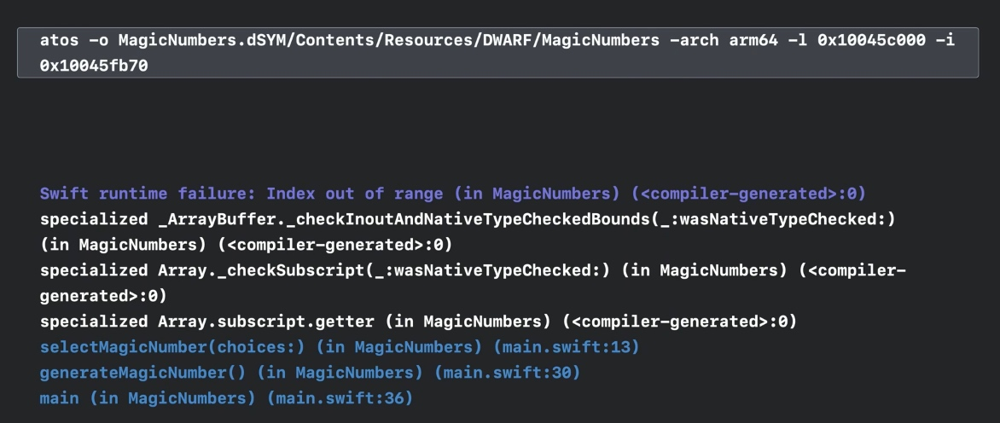
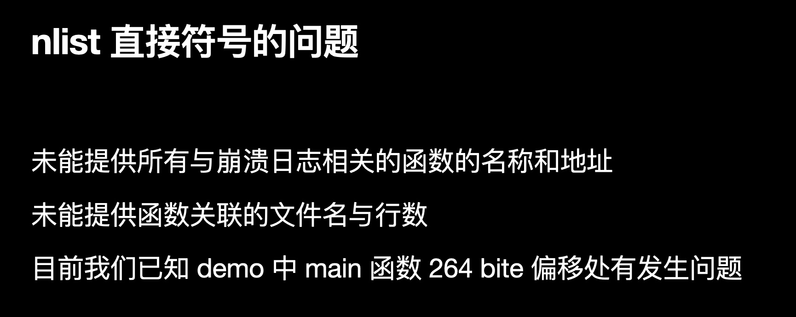
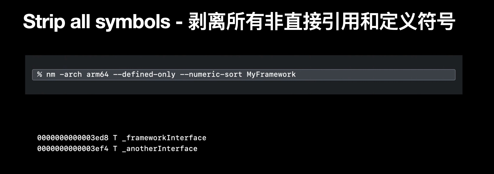
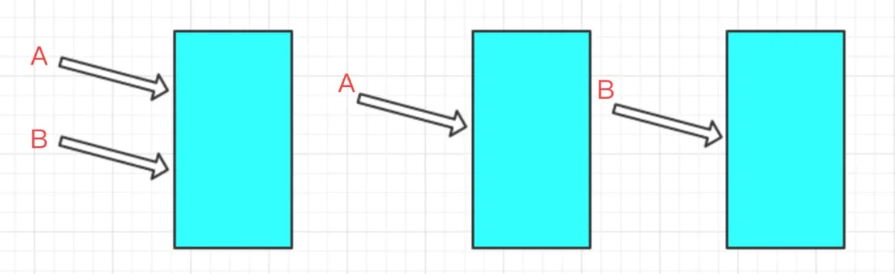

# iOS基础整理
-------

[TOC]


### plist

不能直接将自定义模型存进plist里，要先将模型转字典才能存进去，要想直接存自定义模型可以试一下用归档和解档

### 属性

https://www.jianshu.com/p/2e3bd492ec1b

### new 和 alloc init 的区别

- new 和 alloc init 在功能上没有什么区别，都是分配内存完成初始化

- 差别在于

  >  1.采用new的方式只能采用默认的init完成初始化，而如果采用alloc init的方式可以用其他自定义的初始化方法
  >
  >  2.类调用alloc方法返回一个实例对象并分配好内存，再由实例对象区调用init方法完成初始化
  >
  >  3.alloc使用了Zone分配的内存会和相关联的对象在内存地址中相靠近，这样的好处是：调用时消耗更少的代价，提升了程序处理速度
  >
  >  > NSZone 是 用于维护一块用于对象内存分配及释放的内存池 的描述信息，进程默认的NSZone在启动时创建并将对象均分配在这里，但经过大量的内存分配和释放之后，可能会产生很多的内存碎片，在做新的内存分配的时候NSZone会试图去填补这些碎片，这个查找过程是需要时间开销的

### 数据类型 - NSObject

- 在OC中，我们使用的框架叫`Cocoa`，对应的iOS版本叫做`Cocoa Touch`，这两个框架内部代码部分是相同的，比如最基础也是最重要的`Foundation`框架

- `Foudation`框架中几乎所有对象都是以`NS`开头
- 在所有的NS对象中，最基础的类就是`NSObject`类，是所有`Cocoa`框架中所有对象的基类

### instancetype id

- 返回类型为`instancetype`的函数 表示 返回值代表当前类的实例，比如在`NSObject`类中，`instacnetype`表示返`NSObject`的实例
- instancetype 和 id 相似，但是instancetype有类型检测功能，函数返回时instancetype会判定该对象是某特定类的实例，而id则只是表示一个未知的OC对象


### 野指针 空指针 僵尸对象

- 空指针是没有存储任何的内存地址
- 野指针指向一块内存地址，但这块内存地址不可用（野指针指向的对象已经被释放掉了），假如：指针A指向着对象B，B被释放之后，A仍然指向那块内存地址，但是指针A还是可以访问那块内存地址，但如果那块内存地址重新分配给了另一个指针，当指针A再次访问就是有`crash`
- 在OC中，如果对象被释放之后占用的内存没有被重写（重新分配给其他对象），那么该对象被称为僵尸对象


### nil Nil NULL NSNULL

- nil OC中对象的空指针
- Nil OC中类的空指针
- NULL C类型的空指针
- NSNULL 数值类的空对象


### Blocks

忘了重新看一下工作室多线程和内存管理的书

- Blocks是C语言的扩充功能，一句话来表示Blocks的扩充功能：带有自动变量（局部变量）的匿名函数
- 匿名函数就是不带名称的函数，C语言中是不允许这样的函数出现的
- Blocks的好处 不用另外去创建一个函数，简单明了，比如要给一个函数传递一个url，那么如果函数的最后一个参数是一个Blocks，我们就可以在Blocks里写明拿到url之后要去干嘛，这样就比较得直接。

#### Blocks语法

> Blocks的标记性符号：^插入记号

- ^`返回值类型` `参数列表` `表达式` 
- ^ `参数列表` `表达式` 
- ^ `表达式`

#### Blocks类型变量

```swift
   	//blocks是这个blocks块的变量名
		int (^blocks)(int) = ^(int count){
        return 1;
    };
```

#### 截取自动变量值

- blocks块里有变量num，那么Blocks就会保存该自动变量的瞬时值，当Blocks后面再去修改该自动变量的值是不会影响之前截取的值的

```swift
    int num = 10;
    void (^blocks)(void) = ^{
        NSLog(@"%d",num);
    };
    num = 20;
    blocks();
    //输出结果仍然为10
```

#### __block说明符

- 如果在Blocks里要修改自动变量的值，那么就需要借助__block，否则是会报错的

```swift
   __block int num = 10;
    void (^blocks)(void) = ^{
        num = 20;
        NSLog(@"%d",num);
    };
    blocks();
    //输出结果为20
```

#### 截获的自动变量

- 如果对Blocks截获的自动变量进行赋值就会产生编译错误（在没有使用__blocks修饰符的情况下）
- 但是如果截获的是OC对象，那么调用该对象的方法是不会报错的，赋值还是会报错

```swift
   	//array是一个NSMutableArray类的对象，而Blocks截获的变量值是一个NSMutableArray类的对象，那么用C语言描述，就是截获了NSMutableArray类对象的结构体实例指针，因此使用内部方法是不会产生编译错误的
		NSMutableArray *array = [[NSMutableArray alloc] init];
    void (^blocks)(void) = ^{
        [array addObject:@"s"];
    };
    blocks();
```

### Blocks的实现

- 将OC代码转换成C++之后（说是C++，其实也仅是使用了struct结构体，其本质是C语言源代码），发现Blocks在源代码里其实是一个结构体（OC对象本质是结构体，Blocks也是OC的对象）

> Blocks转换成C++之后，本质是一个impl_0结构体，内部包含了impl，desc_0结构体以及外部需要访问的变量
>
> 1.impl结构体存放的有
>
> ​	isa指针 isa保持该类的结构体实例指针（`对象`里的isa指针指向它的`类对象`，`类对象`里的isa指针指向它的`元类`，`元类`里保存的是怎么去创建一个`类对象`和`类方法`的信息，而`类对象`里的元数据保存的是如何去实例化一个`类的对象`）
>
> ​	Flags 标志
>
> ​	Reserved 今后版本升级所需的区域
>
> ​	FuncPtr Blocks块里执行代码的函数指针 —— 对应着func_0函数
>
> 2.desc_0结构体存放的有
>
> ​	reserved今后版本升级所需的区域
>
> ​	Block_size Block的大小
>
> 3.impl_0结构体存放的有
>
> ​	结构体impl的实例
>
> ​	结构体desc_0的实例
>
> ​    Impl_0的初始化方法 用于给impl，desc_0结构体的成员变量赋值
>
> 4.func_0函数存放的是
>
> ​	Blocks块里的执行代码块
>
> 实现
>
> ​	Blocks在初始化时，是调用impl_0函数的初始化，把函数指针func_0以及结构体实例指针desc_0_DATA作为函数的参数传进去（desc_0_DATA里存放的是impl_0结构体大小的数据）
>
> Blocks在调用时，实际上是使用函数指针调用函数（impl结构体里的FuncPtr）

#### 截获自动变量值

> - 初始化Blocks 就是对Blocks里的impl_0结构体进行初始化，而截获的自动变量会作为参数传进去 对 impl_0进行初始化
> - 而传进去的自动变量会作为impl_0结构体的成员变量，成员变量在赋值时只是把传进来的自动变量的值赋值过去——因为是无法在Block块修改值的
> - 自动变量在Blocks内外的数据类型都是一样的
> - 当在func_0函数中需要用到自动变量时 根据_cself->变量去获取成员变量 ——cself是C++的写法，可以理解为当前结构体实例


#### __block说明符

在Block里实现对自动变量重新赋值，有两种做法

做法1:

> 截获的自动变量是 全局变量 ，静态全局变量 或者 静态变量
>
> 如果截获的自动变量是 全局变量 或者 静态全局变量
>
> - 那么Blocks块里是可以直接访问自动变量的，没有做出任何的改变
>
> 如果截获的自动变量是静态变量
>
> - 在Blocks的结构体impl_0中会多出一个指向静态变量的指针，impl_0在初始化时会把静态变量的地址传进去，当需要对自动变量赋值时，是通过指针去访问静态变量的值，从而进行修改

做法2:

>利用__block修饰符修饰变量
>
>- Blocks里的impl_0结构体外会多出一个关于自动变量的结构体，该结构体里有一个isa指针，一个forwarding指针指向结构体自身，一个flags，一个size，还有一个值保存自动变量的值
>- 在Blocks初始化impl_0时会把自动变量的结构体指针以及指针的地址传进去
>- 当需要修改自动变量的值时，通过访问成员变量farwarding去访问结构体里的自动变量


#### Block存储域

- NSConcreteStackBlock -  Block对象存储在栈区

  - 没有直接指向Block的在栈区，比如下面的Block

  ```swift
   NSLog(@"%@",[ ^{NSLog(@"1");} class]);
  ```

  

- NSConcreteGlobalBlock- Block对象存储在程序的数据区域(.data区)

  > 1.在记述全局变量的地方有Block语法时
  >
  > 2.Block语法的表达式不使用应截获的自动变量

- NSConcreteMallocBlock- Block对象存储在堆区

  > 当变量作用域结束时，栈上的__block变量和Block也被废弃
  >
  > 而复制到堆上的__block变量和Block在变量作用域结束时不受影响

- 对Block调用copy方法

  > 1.栈上的Block会复制到堆上
  >
  > 2.堆上的Block复制，引用计数会增加
  >
  > 3.程序的数据区域上的Block复制后没有变化

- 在ARC模式下，大多数编译器会自动将Block从栈区拷贝到堆上

  - 但是如果向方法或者函数的参数里传递Block，编译器是不能进行
    - 向方法或者函数参数传里Block 有两个特例（Block已经被复制到堆区）
      - 1Cocoa框架的方法且方法名中含有usingBlock
      - GCD的API

- 手动对Block拷贝 调用copy方法

  - ARC模式下多次拷贝是没有问题的
  - 在不需要拷贝的情况将Block拷贝到堆会增加CPU的消耗

#### __block变量存储域

- 当Block从栈复制到堆上

  - 如果__block存储在栈上，Block复制之后,  _ _block会从栈复制到堆上并被Block持有
  - 如果__block存储在堆上，Block复制之后，_ _ _block无影响，还是被Block持有

- 当多个Block同时使用同一个__block，那么这么Block从栈复制到堆上时，也会同时持有_ _ _block变量

- 当堆上的Block被废弃，那么它使用的__block变量也会被释放

- 当堆上多个Block同时持有__block，那么当持有的这些Block都被废弃了，_ _ _block才会被销毁（这里相当于内存管理里的引用计数）

- __block变量从栈区复制到堆区后，变量的forwarding指针已经从指向栈区 的结构体转向指向堆区的结构体，那么无论是在Block块内还是外都可以访问到同一个_ _ _ block变量

  ```swift
      __block int val = 10;
      //从堆区访问val
      void (^blk)(void) = [^{++val;} copy];
      //从栈区访问val
      ++val;
  ```

  

#### 截获对象

> Block截获的对象实现超过它的变量作用域而存在

- Block虽然能够截获自动变量，但是如果变量超过它的变量作用范围就会被丢弃，那么调用Block程序就会崩溃

- 那么怎么做到尽管变量超过了它的作用范围，调用Block时仍然不会崩溃呢

- 利用Block的copy函数

  >1.对Block进行copy，那么Block就会从栈区复制到了堆区
  >
  >2.而Block内部：在impl_0结构体初始化时会生成一个id__strong对象的成员变量，有一个:_ _ _ strong修饰符修饰该对象（虽然说C语言结构体里不允许有_ _strong修饰符出现，但是OC运行时库能够准确把握Block的初始化和销毁时机，因此尽管带有strong修饰符，也可以恰当地初始化和丢弃）
  >
  >以及多出一个copy函数和dispose函数，copy函数用于捕获的对象的初始化，dispose函数用于对象的销毁，这两个函数都是自动调用的，在Block调用copy时会对捕获的对象进行初始化，在Block被丢弃时会自动调用dispose函数销毁对象


#### __block变量和对象

- __block说明符可指定任何类型的自动变量

  > 当__block修饰对象时
  >
  > - Block内部 会多出关于该对象的结构体，这结构体跟之前的自动变量不同的是，结构体内部会新增object_copy和object_dispose两个方法，而且结构体内部的对象会有__strong修饰
  > - 当Block被复制到堆时，会调用object_copy函数，让Block持有该对象，当堆上的Block被废弃时，会调用object_dispose函数，释放Block截获的对象
  > - 而如果该对象被__block修饰，Block从栈复制到堆时，____block也会从栈复制到堆，并使用object_copy(assign)函数去持有赋值给__block变量的对象，当堆上的_____block变量被废弃时，使用object_dispose函数，释放赋值给____block变量的对象

#### Block循环引用

- 在Block中使用附有__strong修饰符的对象类型自动变量，那么当Block从栈复制到堆时，该对象为Block持有，这样容易引起循环引用

  ```swift
  //这种就会造成循环引用 self持有对象blk，blk被copy之后从栈复制到堆上，blk捕获了由strong（默认是strong）修饰的对象self，并持有了self，因此就会造成循环引用
  @property (nonatomic, copy) void (^blk)(void);
  self.blk = ^{NSLog(@"%@",self);};
  self.blk = ^{NSLog(@"%@",self.view);};
  //上面两种都会造成循环引用
  ```

  

- 为了避免循环引用，可声明附有__weak修饰符的变量

  ```swift
  id __weak temp = self;
  self.blk = ^{NSLog(@"%@",temp);};
  ```

  

- 除了使用__weak来避免循环引用，还可以使用____block来避免循环引用

  图中的代码如果不执行Block是会造成循环引用的

  - 对象持有了Block
  - Block持有__block变量
  - __block变量持有对象，因此造成了循环引用

  但是执行了Block之后 是不会造成循环引用了，因为temp被置为nil

  

#### copy/release

- 一般@property声明Block时都是用copy修饰

- ARC无效时，一般需要手动复制Block，利用copy方法进行复制，用release方法来释放Block

- 另外ARC无效时，__block说明符用来避免Block中的循环引用。

  > 当Block从栈复制到堆
  >
  > 若Block使用的变量为附有__block说明符的id类型或者对象类型的自动变量，不会被retain（不会被Block持有）
  >
  > 若Block使用的变量为没有__block说明赋的id类型或者对象类型的自动变量，就会被retain（被Block持有）

- 在ARC有效时和无效时__block说明符的用途有很大的区别


### tableViewCell自适应高度

- 自定义cell，并且cell内部的控件做好约束

- 设置``tableView.estimatedRowHeight``的值，这个值要尽量跟实际的cell的高度相近或者相等，这样效率会更高

  > ```swift
  > tableView.rowHeight = UITableViewAutomaticDimension;//给cell高度一个预估的值
  > tableView.estimatedRowHeight = 140;
  > ```
  >
  > 1.```estimatedRowHeight```这个值要尽量跟cell的高度相近
  >
  > 当```tableView```要显示时，先会根据要创建的cell的个数给每一个cell返回一个```estimatedRowHeight```高度，然后根据```estimatedRowHeight*count```去得出```tableView```的```contentsize```（```tableView```继承于`scrollView`），contentsize被赋值之后，cell才能够显示
  >
  > 2.因此，如果没有设置`estimatedRowHeight`那么就要先把cell的真实高度都算出来才能得出`contentsize`，这样`cell`才能够显示，这也会消耗一点时间以及损耗性能
  >
  > 3.由于一开始tableView的`contensize`并不是最终的值，那么`tableView`在滑动过程中`contensize`会不断得被更新，这样就可能会出现页面抖动的情况
  >
  > 4.解决页面抖动的情况
  >
  > - `estimatedRowHeight`贴近真的cell高度值
  >
  > - `estimatedRowHeight`设置为0，但就是有性能的损耗
  >
  >   ```swift
  >     _tableView.estimatedSectionHeaderHeight = 0;
  >     _tableView.estimatedSectionFooterHeight = 0;
  >     _tableView.estimatedRowHeight = 0;
  >   ```

- 没使用estimatedRowHeight

  > ```undefined
  > 1.先调用numberOfRowsInSection
  > 2.再调用heightForRowAtIndexPath
  > 3.再调用cellForRowAtIndexPath
  > ```

- 使用了estimatedRowHeight

  ```
  1.numberOfRowsInSection
  2.estimatedHeightForRowAtIndexPath
  3.cellForRowAtIndexPath
  4.heightForRowAtIndexPath
  ```

  

### UDID

> 所谓UDID指的是设备的唯一设备识别符，移动广告商和游戏[网络运营商](https://baike.baidu.com/item/网络运营商/10725392)往往需要通过UDID用来识别玩家用户，并对用户活动进行跟踪。

### GCD

#### 队列

```swift
dispatch_queue_t queue = dispatch_queue_create("gcdTest", DISPATCH_QUEUE_SERIAL);
//这也是创建了一个串行队列
dispatch_queue_t queue = dispatch_queue_create("net.bujige.testQueue", NULL);
```

- gcdTest 是队列的名字

- DISPATCH_QUEUE_SERIAL 表示串行队列

- DISPATCH_QUEUE_CONCURRENT表示并行队列

- ```swift
  dispatch_queue_t queue = dispatch_get_main_queue();
  //获取主队列，主队列就是串行队列
  ```

- ```swift
  dispatch_queue_t queue = dispatch_get_global_queue(DISPATCH_QUEUE_PRIORITY_DEFAULT, 0);
  //获取全局队列，是一个并发队列,可以理解为开辟了全局线程
  //DISPATCH_QUEUE_PRIORITY_DEFAULT 表示该队列的优先级为默认 0
  //DISPATCH_QUEUE_PRIORITY_HIGH 表示为高优先级 2
  //DISPATCH_QUEUE_PRIORITY_LOW 表示为低优先级 -2
  //DISPATCH_QUEUE_PRIORITY_BACKGROUND 表示为后台 INT16_MIN
  //第二个参数默认为0，暂时没什么用
  ```
##### 全局队列的进一步解析
下图创建了四个全局并发队列，其中queue1和queue4都是默认优先级，而queue2是高优先级，queue3是低优先级；通过控制台的输出，我们可以发现，不同优先级的队列是有不同的标识符的，但是对于相同优先级的队列，比如queue1和queue4，它们的标识符是一样的，而且内存地址也是一样的。

上图的输出结果好像有点不符常理，因为调用了两次初始化全局队列的函数，为什么指向的内存地址是一样的呢？

我们通过在源码里搜索队列的标识符，发现_dispatch_root_queues是一个集合了多种类型队列的数组，当我们调用`dispatch_get_global_queue`初始化全局并发队列时，会根据传入的优先级返回对应的队列。这说明，系统会维护一个全局队列集合，根据不同的服务质量或优先级返回不同的队列。

``` C 
//dq_label - 队列的标识符
//dq_serialnum - 区分不同类型的队列；全局并发队列是4～15，自定义队列是17。
struct dispatch_queue_global_s _dispatch_root_queues[] = {
#define _DISPATCH_ROOT_QUEUE_IDX(n, flags) \
		((flags & DISPATCH_PRIORITY_FLAG_OVERCOMMIT) ? \
		DISPATCH_ROOT_QUEUE_IDX_##n##_QOS_OVERCOMMIT : \
		DISPATCH_ROOT_QUEUE_IDX_##n##_QOS)
#define _DISPATCH_ROOT_QUEUE_ENTRY(n, flags, ...) \
	[_DISPATCH_ROOT_QUEUE_IDX(n, flags)] = { \
		DISPATCH_GLOBAL_OBJECT_HEADER(queue_global), \
		.dq_state = DISPATCH_ROOT_QUEUE_STATE_INIT_VALUE, \
		.do_ctxt = _dispatch_root_queue_ctxt(_DISPATCH_ROOT_QUEUE_IDX(n, flags)), \
		.dq_atomic_flags = DQF_WIDTH(DISPATCH_QUEUE_WIDTH_POOL), \
		.dq_priority = flags | ((flags & DISPATCH_PRIORITY_FLAG_FALLBACK) ? \
				_dispatch_priority_make_fallback(DISPATCH_QOS_##n) : \
				_dispatch_priority_make(DISPATCH_QOS_##n, 0)), \
		__VA_ARGS__ \
	}
	_DISPATCH_ROOT_QUEUE_ENTRY(MAINTENANCE, 0,
		.dq_label = "com.apple.root.maintenance-qos",
		.dq_serialnum = 4,
	),
	_DISPATCH_ROOT_QUEUE_ENTRY(MAINTENANCE, DISPATCH_PRIORITY_FLAG_OVERCOMMIT,
		.dq_label = "com.apple.root.maintenance-qos.overcommit",
		.dq_serialnum = 5,
	),
	_DISPATCH_ROOT_QUEUE_ENTRY(BACKGROUND, 0,
		.dq_label = "com.apple.root.background-qos",
		.dq_serialnum = 6,
	),
	_DISPATCH_ROOT_QUEUE_ENTRY(BACKGROUND, DISPATCH_PRIORITY_FLAG_OVERCOMMIT,
		.dq_label = "com.apple.root.background-qos.overcommit",
		.dq_serialnum = 7,
	),
	_DISPATCH_ROOT_QUEUE_ENTRY(UTILITY, 0,
		.dq_label = "com.apple.root.utility-qos",
		.dq_serialnum = 8,
	),
	_DISPATCH_ROOT_QUEUE_ENTRY(UTILITY, DISPATCH_PRIORITY_FLAG_OVERCOMMIT,
		.dq_label = "com.apple.root.utility-qos.overcommit",
		.dq_serialnum = 9,
	),
	_DISPATCH_ROOT_QUEUE_ENTRY(DEFAULT, DISPATCH_PRIORITY_FLAG_FALLBACK,
		.dq_label = "com.apple.root.default-qos",
		.dq_serialnum = 10,
	),
	_DISPATCH_ROOT_QUEUE_ENTRY(DEFAULT,
			DISPATCH_PRIORITY_FLAG_FALLBACK | DISPATCH_PRIORITY_FLAG_OVERCOMMIT,
		.dq_label = "com.apple.root.default-qos.overcommit",
		.dq_serialnum = 11,
	),
	_DISPATCH_ROOT_QUEUE_ENTRY(USER_INITIATED, 0,
		.dq_label = "com.apple.root.user-initiated-qos",
		.dq_serialnum = 12,
	),
	_DISPATCH_ROOT_QUEUE_ENTRY(USER_INITIATED, DISPATCH_PRIORITY_FLAG_OVERCOMMIT,
		.dq_label = "com.apple.root.user-initiated-qos.overcommit",
		.dq_serialnum = 13,
	),
	_DISPATCH_ROOT_QUEUE_ENTRY(USER_INTERACTIVE, 0,
		.dq_label = "com.apple.root.user-interactive-qos",
		.dq_serialnum = 14,
	),
	_DISPATCH_ROOT_QUEUE_ENTRY(USER_INTERACTIVE, DISPATCH_PRIORITY_FLAG_OVERCOMMIT,
		.dq_label = "com.apple.root.user-interactive-qos.overcommit",
		.fcom.apple.root.default-qos= 15,
	),
};
```
[学习链接🔗](https://blog.csdn.net/zjpjay/article/details/119646299?spm=1001.2014.3001.5501)

##### 全局队列和并发队列的区别
1. 全局队列没有名称，并发队列有名称
2. 在MRC或者ARC环境下，全局队列都不需要考虑释放，在MRC环境下，并发队列要考虑释放
3. 栅栏函数不能使用全局队列，要使用自定义的并发队列


#### dispatch_set_target_queue

有两个作用，一个是变更指定队列queue的优先级，第二个是可以做成队列的执行阶层

- 变更队列queue的优先级

  > 由于创建SERIAL或者CONcurrent队列都使用与默认优先级Global Disoatch Queue相同执行优先级的线程

```swift
//一般变更优先级是用在异步中的，如果用在同步中，是有执行顺序，不管优先级的   
dispatch_queue_t serialDiapatchQueue=dispatch_queue_create("com.GCD_demo.www", DISPATCH_QUEUE_SERIAL);
    dispatch_queue_t dispatchgetglobalqueue=dispatch_get_global_queue(DISPATCH_QUEUE_PRIORITY_LOW, 0);
        
    //第一个参数为要设置优先级的queu
    //第二个参数是参照物，既将第一个queue的优先级和第二个queue的优先级设置一样。
    dispatch_set_target_queue(serialDiapatchQueue, dispatchgetglobalqueue);
        
        
    dispatch_async(serialDiapatchQueue, ^{
        NSLog(@"我优先级低，先让让");
    });
        
    dispatch_async(dispatch_get_global_queue(DISPATCH_QUEUE_PRIORITY_DEFAULT, 0), ^{
        NSLog(@"我优先级高,我先block");
    });
//打印出
//我优先级高,我先block
//我优先级低，先让让
```

- 可以做成队列的执行阶层

  可以理解为将三个队列加到了串行队列中，由原来的并发执行变成同步执行

  如果target queue是并发队列，那么三个队列加进去之后还是并发的

```swift
 //1.创建目标队列
        dispatch_queue_t targetQueue = dispatch_queue_create("test.target.queue", DISPATCH_QUEUE_SERIAL);
        
        //2.创建3个串行队列
        dispatch_queue_t queue1 = dispatch_queue_create("test.1", DISPATCH_QUEUE_SERIAL);
        dispatch_queue_t queue2 = dispatch_queue_create("test.2", DISPATCH_QUEUE_SERIAL);
        dispatch_queue_t queue3 = dispatch_queue_create("test.3", DISPATCH_QUEUE_SERIAL);
        
        //3.将3个串行队列分别添加到目标队列
        dispatch_set_target_queue(queue1, targetQueue);
        dispatch_set_target_queue(queue2, targetQueue);
        dispatch_set_target_queue(queue3, targetQueue);
        
        
        dispatch_async(queue1, ^{
            NSLog(@"1 in");
            [NSThread sleepForTimeInterval:3.f];
            NSLog(@"1 out");
        });
        
        dispatch_async(queue2, ^{
            NSLog(@"2 in");
            [NSThread sleepForTimeInterval:2.f];
            NSLog(@"2 out");
        });
        dispatch_async(queue3, ^{
            NSLog(@"3 in");
            [NSThread sleepForTimeInterval:1.f];
            NSLog(@"3 out");
        });
//打印结果
2021-04-15 10:50:09.942751+0800 basicLearn[4085:125000] 1 in
2021-04-15 10:50:12.946472+0800 basicLearn[4085:125000] 1 out
2021-04-15 10:50:12.946856+0800 basicLearn[4085:125000] 2 in
2021-04-15 10:50:14.948848+0800 basicLearn[4085:125000] 2 out
2021-04-15 10:50:14.949121+0800 basicLearn[4085:125000] 3 in
2021-04-15 10:50:15.949637+0800 basicLearn[4085:125000] 3 out
```

#### dispatch_after - GCD的延时方法

dispatch_after并不是在指定时间之后开始执行，而是在指定时间之后将任务添加到队列中

dispatch_after本身是一个异步函数，具有开辟新线程的能力

```swift
    //DISPATCH_TIME_NOW表示当前时间
		//ull 是C语言的数值字面量
		//NSEC_PER_SEC是以秒为单位 
		//NSEC_PER_MSEC是以毫秒为单位
    dispatch_time_t time = dispatch_time(DISPATCH_TIME_NOW, 1ull * NSEC_PER_SEC);
    dispatch_after(time,dispatch_get_main_queue(), ^{
        NSLog(@"1");
        NSLog(@"%@",[NSThread currentThread]);
    });
    NSLog(@"q");
//打印
//q
//1（经过了1秒）
//线程
```


#### Dispatch Group

- 实现追加到队列中的多个处理全部结束后想执行结束处理，那么这时可以使用Dispatch Group

  等到并行执行的线程执行完之后 有一个结束处理

  ```swift
  //将Block添加到队列queue1，并指定这个Block属于这个group
  //当属于该group的Block都执行完之后，group就会检测到执行结束，就会把结束处理添加到queue中
  dispatch_group_async(group, queue1, ^{
          NSLog(@"1");
      });
  ```

  

  ```swift
   NSLog(@"begin");
      NSLog(@"%@",[NSThread currentThread]);
      
      dispatch_group_t group = dispatch_group_create();
      
      dispatch_queue_t queue1 = dispatch_get_global_queue(DISPATCH_QUEUE_PRIORITY_DEFAULT, 0);
      
      dispatch_queue_t queue2 = dispatch_get_global_queue(DISPATCH_QUEUE_PRIORITY_DEFAULT, 0);
      
      dispatch_group_async(group, queue1, ^{
          NSLog(@"1");
      });
  
      dispatch_group_async(group, queue2, ^{
          NSLog(@"2");
      });
  
      dispatch_group_notify(group, queue1, ^{
          NSLog(@"3");
      });
      
      NSLog(@"end");
  
  //最后输出为
  begin
  线程
  end
  1
  2
  3
  ```

  

#### dispatch_group_wait

- 阻塞当前线程，等指定的group里的任务都执行完成之后，才会继续往下执行

  ```swift
  NSLog(@"begin");
      NSLog(@"%@",[NSThread currentThread]);
      
      dispatch_group_t group = dispatch_group_create();
      
      dispatch_queue_t queue1 = dispatch_get_global_queue(DISPATCH_QUEUE_PRIORITY_DEFAULT, 0);
      
      dispatch_queue_t queue2 = dispatch_get_global_queue(DISPATCH_QUEUE_PRIORITY_DEFAULT, 0);
      
      dispatch_group_async(group, queue1, ^{
          NSLog(@"1");
      });
  
      dispatch_group_async(group, queue2, ^{
          NSLog(@"2");
      });
  //阻塞了主线程，等group里的任务都执行完了之后再执行输出end的操作
      dispatch_group_wait(group, DISPATCH_TIME_FOREVER);
      
      NSLog(@"end");
  ```

  

#### 栅栏函数
GCD的栅栏函数有两种，分别为异步栅栏函数`dispatch_barrier_async`和同步栅栏函数`dispatch_barrier_sync`。
- 异步栅栏函数：不会阻塞当前线程。将异步执行的栅栏Block提交到队列就会立即返回。
- 同步栅栏函数：会阻塞当前线程。将栅栏Block提交到队列，而且要等到执行完，此函数才会返回。

  ```swift
  NSLog(@"begin");
      
      
      dispatch_queue_t queue = dispatch_queue_create("net.bujige.testQueue", DISPATCH_QUEUE_CONCURRENT);
          
          dispatch_async(queue, ^{
              // 模拟耗时操作
              NSLog(@"1---%@",[NSThread currentThread]);      // 打印当前线程
          });
          dispatch_async(queue, ^{
              // 模拟耗时操作
              NSLog(@"2---%@",[NSThread currentThread]);      // 打印当前线程
          });
          
          dispatch_barrier_async(queue, ^{
                  // 模拟耗时操作
              NSLog(@"barrier---%@",[NSThread currentThread]);// 打印当前线程
          });
          
          dispatch_async(queue, ^{
                           // 模拟耗时操作
              NSLog(@"3---%@",[NSThread currentThread]);      // 打印当前线程
          });
          dispatch_async(queue, ^{
                          // 模拟耗时操作
              NSLog(@"4---%@",[NSThread currentThread]);      // 打印当前线程
          });
      NSLog(@"end");
   //输出 
  //begin
  //end
  //12顺序不定
  //barrier
  //34顺序不定
  
  //如果将异步栅栏函数改为同步栅栏函数，那么执行到同步栅栏函数时，会阻塞当前线程，即主线程；那么输出end是始终都会在barrier之后的。
  ```
##### 栅栏函数要注意的点🌟
1. 使用栅栏函数时不能使用全局队列，要使用自定义队列才有效。（自定义队列即使用`dispatch_queue_create`创建的队列）
2. 对于为什么不能使用全局队列进行解析：
    1. 在libdispatch-1271.120.2源码中，通过对调用函数的追踪`dispatch_barrier_sync` -> `_dispatch_barrier_sync_f` -> `_dispatch_barrier_sync_f_inline` -> `_dispatch_sync_f_slow` -> `_dispatch_sync_complete_recurse`
    2. 在`_dispatch_sync_complete_recurse`函数中，我们可以发现当判断barrier为YES时，会调用dx_wakeup函数，通过搜索dx_wakeup函数，我们发现该函数是针对自定义队列和全局并发队列是有不一样的处理的，对于自定义队列是会判断当前是否存在栅栏，有的话优先执行完栅栏之前的任务；但是对于全局并发队列，没有对栅栏进行判断，按照正常的并发队列来执行任务。
    3. 所以总结为以下两点原因
        1. 在栅栏函数处理时，当前队列为全局并发队列时，不会对栅栏进行判断，按照正常的并发队列来处理任务。
        2. 全局并发队列是系统提供的，除了我们在使用，系统也在使用全局并发队列，因此，如果添加对栅栏函数的处理，会导致队列运行的阻塞，从而影响系统的运行。

        
``` C
static void
_dispatch_sync_complete_recurse(dispatch_queue_t dq, dispatch_queue_t stop_dq,
		uintptr_t dc_flags)
{
	bool barrier = (dc_flags & DC_FLAG_BARRIER);
	do {
		if (dq == stop_dq) return;
		if (barrier) {
			dx_wakeup(dq, 0, DISPATCH_WAKEUP_BARRIER_COMPLETE);
		} else {
			_dispatch_lane_non_barrier_complete(upcast(dq)._dl, 0);
		}
		dq = dq->do_targetq;
		barrier = (dq->dq_width == 1);
	} while (unlikely(dq->do_targetq));
}
```
[学习链接🔗1](https://juejin.cn/post/6997398298625572894)
[学习链接🔗2](https://juejin.cn/post/7004341039729229832#heading-18)

#### dispath_async

- 意味着“非同步”，就是把指定的Block“非同步”地追加到指定的Dispatch Queue中，dispatch_async不做任何等待
- dispatch_sync意味着同步

#### dispatch_apply

该函数按指定的次数将Block追加到指定的Dispatch Queue中，并等待全部处理执行结束

```swift
dispatch_apply(10, queue, ^(size_t index) {
            NSLog(@"%zu",index);
        });
NSLog(@"q");
//第一次参数 是指明 要重复的次数
//第二个参数 是指明 要添加到的队列
//第三个参数 是指明 次数的下标
//如果queue是串行的，那么就会按照次序输出，如果是并行的，就是没有次序输出，有利于提高效率
//只有dispatch_apply里的Block都执行完之后 才会去输出q，可以将dispatch_apply理解为dispatch_sync，相当于是同步的，但还是有开辟新的线程的
```

```objective-c
    dispatch_queue_t queue = dispatch_get_global_queue(DISPATCH_QUEUE_PRIORITY_DEFAULT, 0);
    
    dispatch_async(queue, ^{
        dispatch_apply(10, queue, ^(size_t index) {
            NSLog(@"%zu",index);
        });
    });
    
    dispatch_async(dispatch_get_main_queue(), ^{
        NSLog(@"%@",[NSThread currentThread]);
    });
//输出
//先随机输出dispatch_apply函数的Block的index值
//才会去输出线程
```

#### dispatch_suspend/dispatch_resume

当追加了大量处理到Dispatch Queue时，在追加处理的过程中，有时希望不执行已追加的处理，这时可以对queue进行挂起，挂起后，追加到Queue里但还没执行的处理会停止执行，恢复之后，queue里的处理能够继续执行

```swift
    //挂起队列
    dispatch_suspend(queue);
    //恢复队列
    dispatch_resume(queue);
```

#### Dispatch Semaphore

Dispatch Semaphore是GCD的信号量，用来管理对资源的并发访问

当信号量为0时等待，当信号量大于等于1时不等待

```objective-c
//第一个参数为信号量semaphore，判断当前信号量是否>=1若是，那么该信号量➖1，不用等待，如果信号量为0，那么要阻塞当前线程。
//第二个参数DISPATCH_TIME_FOREVER是dispatch_time_t类型，这个表示一直等待，当这个参数设置了一定时间之后，经过时间也是会继续执行的
//当信号量大于等于1或者超过一定的时间限制，会继续执行不等待
dispatch_semaphore_wait(semaphore, DISPATCH_TIME_FOREVER);
```

```objective-c
//semaphore信号量会➕1
dispatch_semaphore_signal(semaphore);
```

- 信号量的使用有两大作用
- 保持线程同步 和 为线程加锁

##### 保持线程同步

```objc
dispatch_queue_t queue = dispatch_get_global_queue(DISPATCH_QUEUE_PRIORITY_DEFAULT, 0);
   dispatch_semaphore_t semaphore = dispatch_semaphore_create(0);

   __block int j = 0;
   dispatch_async(queue, ^{
        j = 100;
        dispatch_semaphore_signal(semaphore);
   });

   dispatch_semaphore_wait(semaphore, DISPATCH_TIME_FOREVER);
   NSLog(@"finish j = %zd", j);
//最后输入j = 100
//Block块异步添加到了全局并发队列中，所以程序在主线程会跳过Block块（同时开辟子线程异步执行Block块），执行Block块外的代码dispatch_semaphore_wait，因为semaphore信号量的值为0，而且时间为DISPATCH_TIME_FOREVER，所以会阻塞当前线程（主线程），当子线程里的Block块执行完之后，信号量semaphore➕1，那么被阻塞的线程（主线程）会恢复执行，这样就保证了线程之间的同步
```

##### 为线程加锁

```objc
//queue创建是一个默认优先级的全局并发队列
dispatch_queue_t queue = dispatch_get_global_queue(0, 0);
dispatch_semaphore_t semaphore = dispatch_semaphore_create(1);

for (int i = 0; i < 100; i++) {
     dispatch_async(queue, ^{
          // 相当于加锁
          dispatch_semaphore_wait(semaphore, DISPATCH_TIME_FOREVER);
          NSLog(@"i = %zd semaphore = %@", i, semaphore);
          // 相当于解锁
          dispatch_semaphore_signal(semaphore);
      });
}
//当线程1执行到dispatch_semaphore_wait这一行时，semaphore的信号量为1，继续执行后面的输出语句，此时semaphore信号量➖1，如果在线程1执行NSLog输出语句时，线程2来访问，由于semaphore信号量已经为0，这么线程2只能等待，无法继续执行，知道线程1执行完dispatch_semaphore_signal，semaphore信号量➕1，那么线程2才能解除阻塞继续往下执行，这样就可以保证只有一个线程在执行NSlog这一行代码，所以就相当于给线程加锁
```

#### dispatch_once

单例模式——使用dispatch_once方法能保证某段代码在程序运行过程中只执行1次，并且在多线程的环境下，dispatch_once也可以保证线程安全

```objc
//利用单例模式创建一个AccountManager的对象
//以后调用sharedManager方法就会返回它的对象，不用每一次都alloc init
//static 修饰变量，那么只占一份内存，就不用每次调用这个方法 又占一份内存
+ (AccountManager *)sharedManager {
    static AccountManager *sharedAccountManagerInstance = nil;

    static dispatch_once_t predicate; dispatch_once(&predicate, ^{      
          sharedAccountManagerInstance = [[self alloc] init];
    });

    return sharedAccountManagerInstance;

}
```

#### Dispatch I/O

- 实现多线程并列读取文件

#### 注意事项⚠️
- 串行队列里的任务是严格遵循一个任务接着一个任务执行的，比如串行队列里有a，b，c三个任务，那么只能根据先进先出的原则，先取出a任务，执行完之后，再取出b，执行完，再取出c
- 而并发队列的任务并不是严格遵循一个任务紧接着一个任务执行的，也就是说在并发队列A中有任务a，b，c，那么会遵循先进先出的原则，会先执行a、再执行b、再执行c，但是执行b的时候a不一定执行完成，因此最后a、b、c最后哪个先执行完是不确定的，具体同时可以执行几个，由操作系统的并发数决定的。（进一步深入理解：在CPU上执行并发队列的任务时，在一个时间片内会执行任务a，当该时间片结束后，会执行下一个时间片，如果a还没执行完也是会去执行b，由于时间片的时间很短，在宏观上就会有一个任务交替进行的效果，所以说，在并发队列上的任务并不是严格遵循一个任务执行完紧接着去执行下一个任务的）


## TintColor 与 BackgroundColor

- BackgroundColor是设置View的背景颜色
- TintColor是设置View里面的轮廓颜色

## UITableViewDiffableDataSource

UITableViewDiffableDataSource是iOS13新推出的，继承自NSObject，内部遵循了UITableViewDataSourceDelegate，是UITableView实现局部刷新的好方法。

之前UITableVIew刷新数据的方法有两种，一种是reloadData，这种是刷新页面上显示的全部cell，另一种是reloadRowsAtIndexPaths，这种是要根据算出的NSIndexPath，然后对对应的cell进行刷新，但是这种方法不好的是：刷新cell的过程是 先把这个cell删除，然后重新创建一个新的cell，从而实现对数据的刷新。前面两种方法，一旦刷新频率变快，很容易出现内存爆满或者引发了crash

UITableViewDiffableDataSource负责当前数据源配置，NSDiffableDataSourceSnapShot是负责变更后的数据处理，UITableViewDiffableDataSource通过调用自身的apply方法将NSDiffableDataSourceSnapShot变更后的数据更新到UITableView或UICollectioniew的UI

[文章入口1](https://xiaozhuanlan.com/topic/9158203647)

[文章入口2](https://www.jianshu.com/p/66e3694363b3)

## App Clips

App Clips 相当于 苹果🍎的小程序，用户可以在未安装主程序的情况下体验该应用的部分功能，当安装了应用之后，App Clips上的数据就会自动迁移到主程序

[文章入口🔗](https://xiaozhuanlan.com/topic/4063519872)


## Universal Links

Universal Links是 HTTP 或 HTTPS URL，他们可以使用户在App内而不是在Web浏览器上打开你要的内容，但是如果要打开的App还没安装， 那么也可以在Web浏览器上打开。

目前的Universal Links实际上是替代了之前的URL Scheme，相比于URL Scheme，Universal Links具有的优势是

1.通用。Universal LInks是标准的URL格式，而自定义URL Scheme很特殊，只有对应的App才能解析和处理

2.安全。当用户安装应用时，iOS会检查上传到网络服务器的文件配置，来确保网站允许应用去打开URL

3.灵活。即使未安装应用，也是可以在Web浏览器打开浏览，而URL Scheme由于是特殊的，一般不可以在Web浏览器打开

4.简单。一个URL对网站和App均适用

5.隐私。当其他应用与App通信时，无需知道你的App是否已经安装

[文章入口连接🔗](https://xiaozhuanlan.com/topic/1973850246)

## Core Text
Core Text是对文本进行绘制的api

## NSFileManager
NSFileManager类主要对文件和目录进行操作（删除，移除，查找，移动，复制等等）。如果要对文件内容进行更改，应该使用NSFileHandle。所以说NSFileManager是偏向于对文件的管理，而不是对文件内容的操作。

## NSURLSession
NSURLSession由三部分组成：
NSURLSession：请求会话对象，可以用系统提供的单例对象，也可以自己创建
NSURLSessionConfiguration：对Session会话进行配置，一般使用default
NSURLSessionTask：负责执行具体请求的task，由Session创建

值得注意的是⚠️
下面的代理方法是请求数据时执行的代理方法
```swift
/**  告诉delegate已经接受到服务器的初始应答, 准备接下来的数据任务的操作. 在这个方法里可以将task取消或者继续执行，如果要继续执行，那么就要调用completionHandler这个Block，并把allow参数传进去
*/
- (void)URLSession:(NSURLSession *)session dataTask:(NSURLSessionDataTask *)dataTask didReceiveResponse:(NSURLResponse *)response completionHandler:(void (^)(NSURLSessionResponseDisposition disposition))completionHandler 

/** 告诉delegate已经接收到部分数据. */
- (void)URLSession:(NSURLSession *)session dataTask:(NSURLSessionDataTask *)dataTask didReceiveData:(NSData *)data


/** 告诉delegate, data task 已经转变成download task. */
- (void)URLSession:(NSURLSession *)session dataTask:(NSURLSessionDataTask *)dataTask didBecomeDownloadTask:(NSURLSessionDownloadTask *)downloadTask
```
代理方法调用的前提是：NSURLSessionDataTask要创建对
```swift
        //这种创建的Task是会走代理方法的
        self.dataTask = self.session.dataTask(with: request as URLRequest)
        //这种创建的Task是不会走代理方法的，已经自带conpletionHandler，请求数据完成就会调用这个闭包
        self.dataTask =  self.session.dataTask(with: request as URLRequest, completionHandler: { (data, response, error) in
        })
```
[NSURLSession学习](http://chuquan.me/2019/07/21/ios-network-nsurlsession/)

## AFNetworking
AFFNetworking是一套适用于iOS、macOS、watchOS、tvOS的网络库，AFNetworking2.0之后的版本是构建基于NSURLSession的Foundation URL加载系统之上。AFNetworking扩展了Cocoa内置的强大的高级网络抽象，采用模块化设计，功能丰富，是最广泛使用的开源项目之一。

AGNetworking
[AFNetworking学习](http://chuquan.me/2019/08/06/ios-network-afnetworking/)

## YTKNetworking
YTKNetworkk是猿题库技术团队开源的一个网络请求框架，内部封装了AFNetworking。YTKNetwork实现了一套高级的API，提供更高层次的网络访问抽象。

虽然YTKNetwork是基于AFNetworking的进一步封装，而两者其实本质上都是对NSURLSession的进一步封装，但是两者的使用是大不相同的。AFNetworking是属于集约式API，而YTKNetwork是属于离散式API
> 集约式API：
> 项目中的每一个请求都会走统一的入口，对外暴露了请求的地址，参数，以及请求方式。这种方式简单便捷，但是不利于拓展。
> 离散式API：
> 项目中的每一个请求都是继承于YTKBaseRequest，一个请求就相当于一个对象，只需要传入参数就可以初始化一个请求。这种方法URL、请求方式和响应方式等都不暴露给外部，可以避免外部调用时出现配置出错。这样业务使用起来简单，业务使用者不需要关心内部是怎么实现的，而且可拓展性强，缺点就是增加了很大一部分的代码，包的体积会变大相对较多。

相对于AFNetworking，YTKNetwork提供了以下更加高级的功能。
    - 支持按时间缓存网络请求内容
    - 支持按版本号缓存网络请求内容
    - 支持统一设置服务器和CDN的地址
    - 支持检查返回的JSON内容的合法性
    - 支持网络的批量请求以及链式请求

    
YTKNetwork开源框架主要包含3个部分：
    - YTKNetwork核心功能
    - YTKNetwork链式请求
    - YTKNetwork批量请求

### YTKNetwork核心思想


YTKNetwork核心功能的基本思想是：
    - 把每一个网络请求都封装成一个对象，每个请求对象都继承于YTKBaseRequest
    - 使用YTKNetworkAgent单例对象持有一个AFHTTPSessionManager对象管理所有请求对象。

YTKNetwork核心功能主要涉及到三个类：
    - YTKBaseRequest
    - YTKNetworkConfig
    - YTKNetworkAgent

#### YTKBaseRequest
YTKBaseRequest类其实就是在NSURLSession的基础上的进一步封装。开发者通过复写YTKBaseRequest的方法来进行网络请求的配置，比如复写requestUrl、请求方式、响应方式等等。
当网络请求开始时，request就会被加入到YTKNetworkAgent的管理请求队列中。

#### YTKNetworkConfig
YTKNetworkConfig是用于YTKNetworkAgent初始化的配置对象，YTKNetworkConfig持有一个NSURLSessionConfiguration用于初始化YTKNetworkAgent持有的AFHttpSessionManager（其实本质上就是在初始化NSURLSession）；
而YTKNetworkConfig持有的baseUrl属性是请求的服务器的地址

#### YTKNetworkAgent
结构图大概如下：


YTKNetworkAgent初始化过程会使用到YTKNetworkConfig单例对象，再使用YTKNetworkConfig的持有对象sessionConfiguration去初始化AFHTTPSessionManager

#### 请求流程
执行Request请求的第一步都是会将当前的Request添加到YTKnetworkAgent管理的请求队列下（这里调用的是addRequest方法）。
1.在addRequest方法里主要是进行初始化dataTask，设置task的优先级，将task加入到记录表中，以及执行task。
2.在初始化datatask又调用另外一个方法（sessionTaskForRequest：）
3.在sessionTaskForRequest方法里其实是调用了AFHTTPSessionManager对请求的初始化方法，根据请求的method（GET、POST等）已经request的参数等调用NSURLSession的原生api去初始化dataTask
4.而对于请求的method为GET的情况，方法内部是会去判断是否有曾经下载过数据的记录（其实就是实现了一个断点续传的功能）

### YTKChainRequest链式请求
YTKChainRequest链式请求的两个核心类分别是：
    - YTKChainRequest
    - YTKChainRequestAgent

#### YTKChainRequestAgent
YTKChainRequestAgent的用法非常简单，它是作为一个单例，持有多个链式请求对象。YTKChainRequestAgent持有的方法如下：
```Objective-c
+ (YTKChainRequestAgent *)sharedAgent;

/// 添加链式请求
- (void)addChainRequest:(YTKChainRequest *)request;

/// 移除链式请求
- (void)removeChainRequest:(YTKChainRequest *)request;
```

#### YTKChainRequest
YTKChainRequest继承于NSObject，它的关键属性是requestArray（链式请求队列，数组元素是YTKBaseRequest类的对象）以及nextRequestIndex。
Request的启动方法是start：
1.在start方法里，先判断链式请求是否已经开始
2.若已经开始那就直接return
3.若还没开始，那就根据nextRequestIndex定位到requestArray中的YTKBaseRequest，并将YTKBaseRequest的delegate设置为YTKChainRequest，监听请求是否完成或者请求是否失败了
4.然后调用YTKBaseRequest的start方法开始请求
5.当YTKBaseRequest请求完成之后，调用代理的requestFinished方法，通过nextIndexRequest去获取下一个要请求的request，一直到链式请求队列请求完成。如果有一个请求失败，那么整个链式请求队列也是失败的。


### YTKNetwork批量请求
YTKNetwork批量请求的关键类是：
    - YTKBatchRequest
    - YTKBatchRequestAgent

YTKNetwork批量请求跟链式请求的实现原理是一样的，不同之处在于，YTKBatchRequest单个请求的对象是YTKRequest，是YTKBaseRequest的子类。

YTKRequest在YTKBaseRequest的基础上增添了不少的新功能，比如有
    - 是否忽略缓存
    - 判断请求的响应数据是否来自本地缓存
    - 请求不使用缓存
    - 将响应数据保存至缓存中
    - 设置缓存的保留时间
    - 设置缓存的版本
    - 缓存敏感数据，用于验证缓存是否失效
    - 是否异步写入缓存
    
[YTKNetworking学习](http://chuquan.me/2019/08/20/ios-network-ytknetwork/)


## NSOutputStream NSInputStream
NSOutputStream NSInputStream都是继承于NSStream，NSStream是一个抽象类。Stream翻译为流，作用在于把文件的内容，一部分一部分地读出 或 写入，这样做的好处是有利于降低内存峰值（可以联想一下计网中的运输层的字节流，字节流传输数据，那么设备的缓存就不用很大，有利于降低内存峰值）

## NSException
NSException是用于抛出异常的，当程序crash时，控制台打印的崩溃信息就是由NSException产生的

## host
host相当于我们本地的一个DNS服务，访问域名时，计算机会先到host文件夹里面查找有没有这个域名。如果存在，则直接访问这个域名对应的IP地址，加快了域名解析；如果没有，再去DNS服务器上去找。
### 修改host文件的好处
1.加快域名解析
2.方便本地测试
局域网中一般很少架设DNS服务器，访问的时候需要输入IP，我们可以给这些服务器取个容易记住的地址，在host与IP建立好映射，访问的时候我们输入地址就可以了
3.可以屏蔽特定的网站
我们可以将特定不想访问到的网站的域名映射到错误的IP或者自己计算机的IP地址上，这样就访问不了了

## import "" 与 <>
import "" 是引入本地工程文件，import <> 是引入系统库文件
import “” 会先查看本地工程目录下是否有这个文件，若查找不到，那么就会去查看系统库文件
import <> 是直接去查看系统库文件，如果找不到，是不会去查找本地工程目录的
而对于通过cocoaPods导入的库，是推荐使用import <> 的。因为通过cocoaPods导入的库也是属于系统库之一。

## popviewcontrolleranimated
nav的push方法是将控制器压入栈中，pop方法是将栈顶控制器pop出来，pop出控制器，只会调用其viewWillAppear跟viewDidAppear方法，由于控制器还在内存中，是不会调用viewDidLoad方法。

## 序列化
在iOS中一个自定义对象是无法直接存储到文件中的，必须要先转化成二进制流才行。从对象到二进制数据的转换称为序列化，也称为归档。同理，从二进制数据到对象的过程一般称为反序列化或反归档。

## JSON
jSON是一种轻量级的数据格式，一般用于数据交互。
服务器返回给客户端的数据，一般都是JSON格式或者XML格式（文件下载除外）

JSON解析方案
在iOS中，JSON的常见的解析方案有4种
- 第三方框架：JSONKit、SBJson、TouchJSON（性能从左到右逐渐变差）
- 苹果原生（自带）：NSJSONSerializatiom（性能最好的）

NSJSONSerialization的常见方法：
``` Objective - c
 // JSON数据 -> OC对象
 // 第一个参数：待转换的data数据
 // 第二个参数：告诉系统如果转换json数据
 // NSJSONReadingMutableContainers：转出来的对象是可变数据或可变字典
 // NSJSONReadingAllowFragments：允许解析出来的对象不是数组或者字典，比如直接是字符串或NSNumber
+ (id)JSONObjectWithData:(NSData*)data  options:(NSJSONReadingOptions)opt error:(NSError**)error;

// OC对象 -> JSON数据 
+ (NSData*)dataWithJSONObject:(id)obj options:(NSJSONWritingOptions)opt error:(NSError**)error;
```

## 进程和线程
一个运行着的程序就是一个进程或者叫做一个任务，一个进程至少包含一个线程，线程就是程序的执行流。程序启动时，就会创建一个主线程，主线程在程序中的地位和其他线程不同，界面UI的操作都必须在主线程中进行。

系统的每一个进程都有自己独立的虚拟内存空间，而同一个进程中的多个线程则共用进程的内存空间。每创建一个新的线程，都需要一些内存和消耗一定的CPU时间。

## RunLoop
RunLoop代表着运行循环。
运行循环的开始需要去检测是否有需要处理的事件，如果有则去处理，如果没有则进入睡眠状态以节省CPU时间。
一般创建的NSTimer都是默认加入到当前的事件循环当中的。

将需要做的事情注册到当前的事件循环后，每次事件循环开始，都会去检查这些事件源是否有需要处理的数据，有的话就去处理，没的话就进入睡眠状态。

每一个线程都有其对应的RunLoop，但是默认非主线程的RunLoop是不运行的，除非要在一个单独的线程中长期监测某个事件。

## iTunes文件共享
iTunes文件共享是一种向iOS设备传输文件或从iOS设备传输文件的功能。

## writeToFile atomically
atomically：若设为YES，那么就会先把数据写进一个辅助文件，在成功写入到辅助文件之后，将辅助文件复制到第一个参数指定位置的路径下。这是更安全的写入文件的方法，因为如果应用在保存期间崩溃了，则现有文件不会被破坏。尽管这增加了一点开销，但是多数情况下还是值得的。
atomically：若设为NO，那么会直接把数据写进第一个参数指定位置的路径下。

## 关于UIKit跟swiftUI
swiftUI是在2019的WWDC大会上才推出的全新的UI框架。swiftUI简单来说其实就是swift+UI，也就是说是要用swift语言编写的UI视图，苹果推出swiftUI的目的在于降低开发者的学习成本，增加全球开发者的数量。swiftUI的学习成本低在于：开发者开发时注重的是视图的创意，而不像Objective-c那样需要深纠很多的细节，比如在一个文本框附加加多一个按钮，那么在swiftUI中，开发者只需要将按钮放置在文本框附件，那么系统就会去适配黑暗模式，适配不同尺寸的设备（包括iOS，tvOS，macOS等），简单来说：swiftUI可以做到一套代码开发一套苹果产品，而在OC下，开发者不仅要注重开发的创意，还要去适配不同的环境。

swiftUI虽然是刚推出没多久，但已经是大势所趋，但目前swiftUI不像OC有很多知名的第三方库支持，它的组件库也不是很完善，因此为了解决这一个问题，苹果声明在swiftUI上也是可以使用到OC的UIKit库的，只需要遵守UIViewRepresentable协议。

## 简述SSL协议
SSL层是位于应用层跟运输层之间的，应用层的数据首先传到SSL层，然后在SSL层经过加密之后才会传去运输层。
SSL协议是一种安全套接层协议，是Web浏览器跟Web服务器之间安全交换信息的协议，提供两个基本的安全服务：保密和鉴别。

## 可变属性为什么不能用copy修饰
可变属性一旦用copy修饰之后就会变成不可变。比如NSMutableArray被copy修饰之后就会变成NSArray，我们知道：NSMutableArray是继承于NSArray的，当我们调用NSMutableArray的copy方法其实是调用了它的父类NSArray的copy方法，因此返回到的是一个不可变的NSArray对象，而不是NSMutableArray对象。
```Objective-c
//NSMutableArray并没有遵守NSCopying协议，因此可以看出调用的copy方法其实是调用父类NSArray的copy方法
@interface NSMutableArray<ObjectType> : NSArray<ObjectType>
@interface NSArray<__covariant ObjectType> : NSObject <NSCopying, NSMutableCopying, NSSecureCoding, NSFastEnumeration>
```
## 简述UIView的setNeedsLayout，layoutifNeeded
- setNeedsLayout方法：标记View为需要重新布局，异步调用layoutIfNeeded刷新布局，不会立即刷新
- layoutIfNeeded方法：如果有标记的View等待被刷新，立即调用layoutSubviews
- 所以如果要立即刷新View，那么就要先调用setNeedsLayout标记该View需要刷新，然后再调用layoutIfNeeded实现刷新布局

## layoutSubviews的调用时机
- init初始化方法不会触发layoutSubviews
- addSubview会触发layoutSubviews (子类和父类的layoutSubviews都会触发）
- 设置view的Frame会触发layoutSubviews，当然前提是frame的前后值发生改变
- 滚动一个UIScrollerView会触发layoutSubviews
- 旋转Screen会触发父UIView上的layoutSubviews事件
- 改变一个UIView的大小的时候也会触发父UIView上的layoutViews事件

## SDAutolayout深入学习🌟
### 首先讲解一下应该怎样去设计可以自动布局的库
要考虑的问题有
- 何时进行自动布局相关运算
- 如何实现自动布局算法
- 如何设计约束模型管理机制
- 如何设计一套简洁的链式语法API（这个非必须项）
- 如何实现自动计算cell高度

### 何时进行自动布局相关运算
我们知道当一个View的大小发生改变或者由于其他情况需要调整子View或者调用了addSubviews方法时都会触发layoutSubviews，因此在调用layoutSubviews方法之后其实就是进行自动布局相关运算的最佳时间。而以SDAutolayout库为例，它在内部是利用了runtime的黑魔法method Swizzling将layoutSubviews跟sd_button_layoutSubviews方法进行了交换。
```Objective-c
//当UIView+SDAutolayout这个拓展类第一次加载时就会layoutSubviews跟sd_layoutSubviews方法进行了交换
+ (void)load
{
    static dispatch_once_t onceToken;
    dispatch_once(&onceToken, ^{
        NSString *selString = @"layoutSubviews";
        NSString *mySelString = [@"sd_button_" stringByAppendingString:selString];
        
        Method originalMethod = class_getInstanceMethod(self, NSSelectorFromString(selString));
        Method myMethod = class_getInstanceMethod(self, NSSelectorFromString(mySelString));
        method_exchangeImplementations(originalMethod, myMethod);
    });
}
```
### 如何实现自动布局算法
在了解清楚何时进行自动布局算法的最佳时机之后，我们应该着力于如何实现自动布局算法。以SDAutolayout为例，它是基本控件的frame的一个自动布局库，而另一个自动布局库Masonry是基于NSLayoutConstraint的。
对于SDAutolayout自动布局库，内部的思想是先计算出绝对属性，再计算出相对属性。
- 绝对属性：就是不需要有参照物就可以确定的属性，比如控件的宽和高
- 相对属性：在参照物的情况下的距离，比如我在你的左边5米处

在SDAutolayout库中，是利用每一个View的SDAutolayoutModel去计算出该View的绝对属性以及相对属性

### 如何设计约束模型管理机制
理解为：每一个View的约束是由谁来管理，是view本身？还是view的superView？
由于是在父View执行layoutSubviews方法后进行自动布局算法，那么可想而知，应该是由父View去管理所有子View约束。
在SDAutolayout库中，每一个子View在调用sd_layout方法时，都会给该View初始化一个SDAutolayoutModel模型，该模型会标记当前View需要自动布局，然后将该模型加入到了superView的autoLayoutModelIsArray数组中方便父View的管理。

```Objective-c
- (SDAutoLayoutModel *)sd_layout
{
    
#ifdef SDDebugWithAssert
    /*
     卡在这里说明你的要自动布局的view在没有添加到父view的情况下就开始设置布局,你需要这样：
     1.  UIView *view = [UIView new];
     2.  [superView addSubview:view];
     3.  view.sd_layout
     .leftEqualToView()...
     */
    NSAssert(self.superview, @">>>>>>>>>在加入父view之后才可以做自动布局设置");
    
#endif
    
    SDAutoLayoutModel *model = [self ownLayoutModel];
    if (!model) {
        model = [SDAutoLayoutModel new];
        model.needsAutoResizeView = self;
        [self setOwnLayoutModel:model];
        [self.superview.autoLayoutModelsArray addObject:model];
    }
    
    return model;
}
```

### 如何设计一套简洁的链式语法API
```Objective-c
//textView调用sd_layout方法返回的是一个SDAutolayoutModel的对象
//而leftEqualToView是SDAutolayoutModel对象下的一个属性
//在leftEqualToView方法里传入一个View的参数，然后是调用了一个Block，Block的返回值也是一个SDAutolayoutModel的对象，因此就可以达到了链式调用的效果。
self.textView.sd_layout
.leftEqualToView(self.contentView)
.rightEqualToView(self.contentView)
.topEqualToView(self.contentView)
.heightIs(statusMattStrRect.size.height);
```

### 如何实现自动计算cell高度
SDAutoLayout为开发者提供了简洁高效的cell高度自动计算方法。
- 首先在自定义cell的内部做好各子控件的约束，值得注意的是cell对于上面一个View的底部约束要做好

```Objective-c
[yourCell setupAutoHeightWithBottomView:bottomView bottomMargin:bottomMargin]; 
```
- 其次，为了实现cell高度自适应的功能，SDAutoLayout库在内部建立了一个和自定义的cell一样的模型，然后将model数据赋值给模型cell，设置完成后，调用[self.modelCell.contentView layoutSubviews]方法计算cell的真实高度然后返回给tableViewCell，同时还会建立cell的高度缓存库以供tableView滚动时直接返回cell的高度而不用再次计算。

### 总结🌟
- View在调用sd_layout方法时，会初始化一个SDAutoLayoutModel，该model会标记该View需要实现自动化布局，然后将model加入到了该View的superView的autoLayoutModelsArray模型管理数组中
- sd_layout方法后返回的是一个SDAutolayoutModel的对象，该对象下有很多属性，日不leftEqualToView，rightEqualToView等等
- 在sd_layout下设置leftEqualToView(view1)，而leftEqualToView本身就是一个Block，这个Blcok要传入一个View的参数，返回的是SDAutoLayoutModel（为了链式调用），在Block里会初始化一个SDAutoLayoutModelItem，然后将Item添加到了Model里
- 最后会自动调用sd_button_layoutSubviews完成对子View控件frame的计算，实现自动布局。

### 注意的是⚠️
- 在自定义cell里面初始化子控件时，设置好约束之后，紧接着获取该子控件的宽高是获取不到的，因为此时cell的layoutViews方法还没触发，等到layoutSubviews触发之后完成了子控件的布局之后才可以拿到子控件真正计算好的宽高（在RunLoop的一次事件循环中，如果收集到了多个layoutSubviews也只会调用一次）
- 在自定义cell里面添加子控件时，尽管调用了addSubviews方法，但是也没有触发layoutSubviews方法的，可能内部做了特殊的处理⚠️
- 而UITableViewCell在什么时候调用layoutSubviews方法呢：是在返回了cellHeight的方法之后才会去调用cell的layoutSubviews方法的，也就是说，当cell的绝对属性（宽和高都获取好之后）才会去调用layoutSubviews（这里就是layoutSubviews的触发条件之一：View的大小变化时触发layoutSubviews方法）
- 如果想要在cell没调用layoutSubviews方法前也拿到子控件的宽高，那么就可以调用updateLayout方法，这个方法底层实现其实就是调用父View的layoutSubviews方法

### 常用的方法总结🌟
cell的高度自适应：
```Objective-c
//cell内部布局时的高度自适应
//如果要实现高度自适应，那么不要以cell的底部为参照去布局子View
[self setupAutoHeightWithBottomView:_lastView bottomMargin:15];

//获取自动计算出的cell高度
- (CGFloat)tableView:(UITableView *)tableView heightForRowAtIndexPath:(NSIndexPath *)indexPath {
    cellModel *model = self.dataArr[indexPath.row];
    return  [tableView cellHeightForIndexPath:indexPath model:model keyPath:@"model" cellClass:[YTableViewCell class] contentViewWidth:[UIScreen mainScreen].bounds.size.width];
}

//获取自动计算出cell高度的升级版（适用于cell的数量少于100的情况）
- (CGFloat)tableView:(UITableView *)tableView heightForRowAtIndexPath:(NSIndexPath *)indexPath {
    // 获取cell高度
    return [self cellHeightForIndexPath:indexPath cellContentViewWidth:[UIScreen mainScreen].bounds.size.width];
}
 
 //设置cell的高度缓存，使得tableView在滑动的时候会更加流程
 //PS：但是我设置了之后cell的UI布局出现了问题 - 还没找到原因⚠️   
[cell useCellFrameCacheWithIndexPath:indexPath tableView:tableView];

//设置view的宽度自适应
[self setupAutoWidthWithRightView:weakSelf.commentButton rightMargin:5];

//清除该View的宽度自适应设置
[self clearAutoWidthSettings];

//cell内部子View的更新布局，不用触发cell的layoutSubviews
[self updateLayoutWithCellContentView:weakSelf.superview];

//UILabel在布局时高度可以固定，但是宽度不知道设置多少时可以使用maxHeights
_nameLabel.sd_layout
.leftSpaceToView(_iconView, 10)
.topEqualToView(_iconView)
.heightIs(20)
.maxWidthIs(200);
```

[SDAutoLayout小demo](/Users/macbookpro/SDAutolayoutLRN)
[SDAuaoLayout学习](http://www.cocoachina.com/articles/15854)
[SDAuaoLayout学习](https://github.com/gsdios/SDAutoLayout)

## 对于懒加载一些个人的理解
- 懒加载-其实也称为延时加载，即在需要的时候才加载，懒加载其实就是在重写getter方法
好处是：
    1.不必将创建对象的代码全部写在一起，代码的可读性更强
    2.每个控件的getter方法中分别负责各自的实例化处理，代码彼此之前的独立性强
    3.只有当真正需要资源时，再去加载，节省了内存资源
    4.每个方法都是一个结构体struct_objc_method
        在该结构体里，有三个成员变量
            1.结构体的大小
            2.选择子
            3.方法的实现
      那说明当一个方法里有很多的控件在实例化，那就会导致这个方法的结构体大小变得很大，在调用此方法时，就很容易出现内存峰值，而如果使用了懒加载，那么这些控件的实例化在此代码里都是一个指针，指向控件的getter方法，内存峰值就会降下来。
      

## iOS编译过程
iOS编译和打包时，编译器直接将代码编译成机器码，然后直接在CPU上运行，而不用使用解释器运行代码。这样代码执行的效率更高，运行速度更快。C、C++、Objective-c都是使用编译器生成相关的可执行文件。

> **解释器** ：解释器会在运行时解释执行代码，获取一段代码后就会将其翻译成目标代码（字节码），然后一句一句地执行目标代码，也就是说在运行时才去解析代码，比直接运行编译好的可执行文件的效率低，但是跑起来之后可以不用重新编译，可以直接修改代码就可以看到改变的效果，可以帮助我们缩短整个程序的开发周期和功能更新周期。

> **编译器** ：把一种编程语言转换为目标语言（机器能直接识别的语言）的程序叫做编译器。

- 采用编译器生成机器码执行的好处就是效率高，缺点是调试周期长。
- 采用解释器执行的好处是编写调试方便，缺点就是执行效率低。

### 编译器
编译器分为前后端：
- 前端：负责词法分析、语法分析、生成中间代码。
- 后端：后端以中间代码作为输入，进行与架构无关的代码优化，接着对不同架构生成不同的机器码。

对于Apple来说，Objective-c/C/C++使用的编译器前端是Clang，后端是LLVM，LLVM是编译器工具链技术的一个集合。其中的lld项目，就是内置链接器。编译器会对每个文件进行编译，生成Mach-O（可执行文件），然后链接器会将项目中的多个Mach-O文件合并成一个。

### 编译过程
- 预处理：Clang会预先处理代码，比如将宏嵌入到对应的位置、删除注释、条件编译被处理等等
- 词法分析：：词法分析器会读入源文件的字符流，将它们组织成有意义的词素序列，对于每个词素，词法分析器产生词法单元（token）输出，并且会用Loc记录位置。（比如x + y，就会被分解成三个词法单元 x + y）
- 语法分析：将分解出的词法单元按照一定的规则组成一个抽象语法树（AST），树中的每个节点标记了其在源码中的位置
- 静态分析：把源码转化为抽象语法树之后，编译器就可以对这个树进行静态分析处理。静态分析会对代码进行错误检查，最后AST会生成IR，IR是一种更接近机器码的语言，区别在于和平台无关，通过IR可以生成多份适合不同平台的机器码（IR：我们这里称为中间代码）
- 中间代码生成和优化：在此阶段LLVM会对代码进行编译优化，比如对全局变量的优化、循环优化、尾递归优化等，最后输出汇编代码xx.ll文件
  生成汇编代码之后，汇编器会将汇编码转为机器码，转化后的代码就是.o文件，即二进制文件
- 链接：内置链接器把编译产生的.o文件和（dylid,a,tbd）文件，生成一个Mach-o文件。Mach-o文件为可执行文件
- 总结就是：编译过程结束之后，生成了一个可执行文件Mach-O文件
 

### 链接器
Mach-O文件里面的内容，主要是代码和数据：代码是函数的定义；数据是全局变量的定义，包括全部变量的初始值。不管是代码还是数据，它们的实例都需要由符号将其关联起来。为什么呢？因为Mach-O文件里的那些代码，比如if、for、while生成的机器指令序列，待操作的数据会存储在某个地方，变量符号就需要绑定到数据的存储地址。我们写的代码还会饮用其他的代码，饮用的函数符号也需要绑定到该函数的地址上。而链接器的作用，就是完成变量、函数符号和其他地址绑定这样的任务。而这里我们所说的符号，就可以理解为变量名和函数名。

### 链接器为什么还要把项目中的多个Mach-O文件合成一个
项目中文件之间的变量和接口函数都是相互依赖的，所以这时我们就需要通过链接器将项目中生成的多个Mach-O文件的符号和地址绑定起来。
没有这个绑定过程的话，单个文件生成的Mach-O文件是无法正常运行起来的。因为，如果在运行时碰到调用在其他文件中实现的函数的情况时，就会找不到这个调用函数的地址，从而无法继续执行。
链接器在链接多个目标文件的过程中，会创建一个符号表，用于记录所有已定义的和未定义的符号。链接时如果出现相同符号的情况，就会报错，如果找不到符号也会报错等。

### 链接器做了什么
- 扫描项目中的不同文件，将所有符号和引用的地址收集起来，并放到全局符号表中。
- 去除无用函数：链接器在整理函数的调用关系时，会以main函数为源头，跟随每个引用，并将其标记为live。跟随完成后，那些未被标记live的函数，就是无用函数。

### 动态库链接
在真实的iOS开发中，很多功能都是现成可用的，比如系统库、GUI框架、I/O等，链接这些共享库到Mach-O文件，也是通过链接器来实现的。
链接的共享库分为静态库和动态库：静态库是编译时链接的库，需要链接进Mach-O文件里；而动态库是运行时链接的库，要使用dyld进行动态加载。
Mach-O文件是编译后的产物，而动态库在运行时才会被链接，并没有参与Mach-O文件的编译和链接，所以这些动态库在符号表里会显示未定义，但是它们的名字，以及引用库的路径会被记录下来。
dylib这种格式，表示是动态链接的，编译的时候不会被编译到执行文件中，在程序执行的时候才link。
系统上的动态链接器会使用共享缓存，当加载Mach-O文件时，动态链接器会先检查是否有共享缓存。每个进程都会在自己的地址空间映射这些共享缓存，这样做可以起到优化App启动速度的作用。

[iOS编译过程详解](https://www.jianshu.com/p/d946961551b0)

## App的启动流程和生命周期
App的生命流程分为三大部分：
1.App的启动流程（pre-main）
2.App的初始化流程（main）
3.App的运行时生命周期

### App的启动流程
- iOS系统首先会加载解析该App的info.plist文件。info.plist文件中包含了支持App加载运行时所需要的众多的key、value配置信息，例如App的运行条件，是否全屏，App启动图信息等
- 创建沙盒
- 根据info.plist的配置检查相应权限状态
- 加载Mach-O文件读取dyld路径并运行dyld动态链接器（内核加载了主程序，dyld只负责动态库的加载）

> 1.首先dyld会寻找合适的CPU运行环境
> 2.然后加载程序运行所需的依赖库和我们自己写的.h.m文件编译成的.o可执行文件，并对这些库进行连接
> 3.加载所有方法（runtime就是在这个时候被初始化并完成OC的内存布局的）
> 4.加载C函数
> 5.加载category的扩展（此时runtime会对所有类结构进行初始化）
> 加载C++静态函数，加载OC +load方法
> 最后dyld返回main函数地址，main函数被调用

### Mach-O文件说明：
Mach-O文件格式是OS X与iOS系统上的可执行文件格式，像编译产生的.O文件、程序可执行文件和各种库等都是Mach-O文件。

Mach-O文件主要有三部分组成：
- 1.Header：保存了一些基本信息，包括了该文件运行的平台、文件类型、LoadCommands的个数等。Headers的主要作用就是帮助系统迅速地定位Mach-O文件的运行环境、文件类型。保存了一些dyld重要的加载参数。
- 2.Load Commands：可以理解为加载命令，在加载Mach-O文件时会使用这里的数据来确定内存的分布以及相关的加载命令。比如我们的main函数的加载地址，程序所需的dyld的文件路径，以及相关依赖库的文件路径。
- 3.Data：每一个segment的具体数据都保存在这里，这里包含了具体的代码、数据等。

### dyld说明
dyld叫做动态链接器，主要的职责是完成各种库的链接。dyld是苹果用C++写的一个开源库。

当运行程序时，系统会从内核态转换为用户态后，dyld首先初始化程序环境，将可执行文件以及相应的系统依赖库与我们自己加入的库加载进入内存中，生成对应的ImageLoader类对应的image对象（镜像文件），对这些image文件进行链接，调用各Image文件的初始化方法。而在这个过程中runtime就会被初始化。
 

### App启动的优化
1.减少系统依赖库
2.减少自己需要加入的各种第三方库（库越少，dyld加载的速度越快，就能越早地返回程序入口main函数的地址）
3.自己手动加入的库，能选择静态库就尽量选择静态库，少用动态库，因为动态库的加载方式会比静态库慢，如果必须依赖动态可，可以尝试把多个非系统的动态库整合成一个。
4.将不必须在+load方法中做的事延迟到+initialze中，尽量不要用C++虚函数（创建虚函数表有开销）
5.减少项目文件中Category，静态变量等的使用数量
6.内存上优化：类和方法名不要太长

### 冷启动 热启动
如果程序刚被运行过一次，那么程序的代码就会被dyld缓存起来，因此即使杀掉进程再次重启加载时间也会相对快一点，如果长时间没有启动或者当前dyld的缓存已经被其他应用占据，那么这次启动所花费的时间就要长一点，这就分别是热启动和冷启动的概念。

### App的初始化流程
1.执行main函数
2.执行UIApplicationMain函数
    2.1创建UIApplication对象
    2.2创建UIApplication的delegate对象
    2.3创建MainRunLoop
    2.4delegate对象开始处理监听系统事件
3.（有storyboard的话）根据info.plist获得主要storyboard的文件名
4.程序启动完毕，调用代理的application:didFinishLaunchingWithOptions:方法
在application:didFinishLaunchingWithOptions:中创建UIWindow
创建和设置UIWindow的rootViewController
5.最终显示第一个窗口

main.m文件说明
```Objective-c
#import <UIKit/UIKit.h>
#import "AppDelegate.h"

//main函数是整个程序的入口
int main(int argc, char * argv[]) {
    //参数argc说明:命令行总的参数个数。
    //参数argv说明:是参数的数组，argv中第一个参数为app的路径＋全名。
    printf("argc = %d\n", argc);
    char *argChar = argv[0];
    printf("index = %i ,argv = %s\n", 0, argChar);
    @autoreleasepool {
        //UIApplicationMain函数说明
        //第一个参数argc:参数是main函数C语言中传入的，保持与main函数相同。
        //第二个参数argv:同argc参数一样
        //第三个参数nil:该参数为principalClassName (主要类名) 
        //    如果principalClassName是nil，那么它的值将从Info.plist去获取，如果Info.plist没有，则默认为UIApplication。
        //    principalClass这个类除了管理整个程序的生命周期之外什么都不做，它只负责监听事件然后交给delegateClass去做。
        //第四个参数NSStringFromClass([AppDelegate class]):委托代理类的类名，UIApplication创建的delegate对象的类名
        return UIApplicationMain(argc, argv, nil, NSStringFromClass([AppDelegate class]));
    }
}
```

App初始化UIApplication的调用顺序为：
1.application:didFinishLaunchingWithOptions:
2.applicationDidBecomeActive:

App初始化流程的优化带你
1.尽量使用纯代码而不是xib或者storyboard来进行UI框架的搭建，因为xib和storyboard最终还是解析成代码来渲染页面
2.尽量减少在方法application:didFinishLaunchingWithOptions:中代码的执行事件。能多线程就多线程，能后台执行就后台执行。不要阻塞主线程从而造成启动事件加长。

### load、initialize
+load方法的调用时机：
1.当类被引用的时候就会调用类的+load方法，当程序启动时，会加载相关的Mach-O文件，这个时候就会查找项目中哪些文件被引用，这个时候就会调用+load方法（load方法会在加载类的时候就被调用，也就是应用启动的时候，就会加载所有的类，就会调用每个类的load方法）
2.当父类和子类都实现了+load方法，父类+load方法的执行顺序要优先于子类的执行
3.类中的+load方法执行顺序要优先于类别的+load方法
4.当有多个类别(Category)都实现了+load方法时,这几个+load方法都会执行,其执行顺序与类别文件在Build Phases里的Compile Sources中出现顺序一样。
5.load方法的调用是直接根据函数地址调用的，不参与~~消息传递~~。

+initialize方法的调用时机：
1.不同于+load，类中的+initialize是在引用类被首次使用时被调用。也就是说也许你工程里import了一个类，但是你没有调用这个类的任何方法，那么这个类的+initialize方法就不会被调用。而+initialize方法也只会调用一次，那就是首次调用这个类的任意方法时。
2.父类的+initialize方法会比子类的先执行
3.当子类未实现+initialize方法时,会调用父类+initialize方法,子类实现+initialize方法时,想要父类也调用，需要在子类实现里 [super initialize]（当子类未实现+initialize方法时，父类的+initialize就会被调用两次：+initialize 子类没有实现时，就会进行消息传递，找到父类，此时就会调用一次父类的+initialize方法，然后由于子类没有实现+initialize方法，那么+initialize方法就会再被调用一次）
4.当有多个Category都实现了initialize方法,会覆盖类中的方法,只执行一个(会执行Compile Sources 列表中最后一个Category 的initialize方法，因为覆盖的原因，所以最后一个覆盖了前面的)

[详细学习入口🔗](https://www.jianshu.com/p/229dd6190b95)

## SF Symbols
SF Symbols可以理解为苹果的官方UI库，里面有Apple自己设计的海量高质量符号，符号有9种字重和3种比例，并自动与文本标签对齐。同时这些符号是矢量的，这意味着它们是可以被拉伸的，使得它们在无论什么大小都会呈现出很好的效果。


在SF Symbols App上，我们可以看到各种各样的图标，而我们导入这些图标，只需要调用UIImage的systemName：方法，传入这个图标的名字就可以成功获取到这个Image。

### 符号的渲染模式
SF Symbols可以拥有多种颜色，有一些symbol甚至还有预设的颜色，例如代表天气、肺部、电池的符号等。如果要使用这些带有自定义颜色的符号，那么需要了解，SF Symbols的四种渲染模式：
- 单色模式
- 分层模式
- 调色盘模式
- 多色模式

#### 单色模式Monochrome
顾名思义，单色模式会让符号有一个单一的颜色。要设置单色模式的符号，我们只需要设置图片的tintColor或者accentColor就可以完成。
```swift
let image = UIImage(systemName: "battery.100.bolt")
imageView.image = image
imageView.tintColor = .systemYellow

// SwiftUI
Image(systemName: "battery.100.bolt")
    .foregroundStyle(.yellow)
```


#### 分层模式Hierarchical
每个符号都是预先分层的，如下图所示，符号按顺序最多可以分成三个层级：primary，secondary，tertiary。有一些符号只有一个层级，也就是只有primary曾。有一些符号只有两个层级，其中第一个层级一定是primary层，第二个层级可以是secondary层，也可以是tertiary层。

分层模式和单色模式一样，可以设置一个颜色。但是分层模式会以该颜色为基础，生成降低主颜色的不透明度而衍生出来的其他颜色

```swift
var image = NSImage(systemSymbolName: "battery.100.bolt",
                    accessibilityDescription: "Battery")
let config = NSImage.SymbolConfiguration(hierarchicalColor: .systemYellow)
imageView.image = image
imageView.symbolConfiguration = config

// SwiftUI
Image(systemName: "battery.100.bolt")
    .foregroundStyle(.yellow)
    .symbolRenderingMode(.hierarchical)
```

> 而我们可以在App上查询每个符号有几个层级以及层级是如何分配的

#### 调色模式Palette
调色模式和分层模式很像，也是对符号的各层颜色进行上色，不同的是：调色盘模式允许你自由地设置三个层级各自的颜色。

```swift
let image = UIImage(systemName: "battery.100.bolt")
let config = UIImage.SymbolConfiguration(paletteColors: [.red, .orange, .yellow])
imageView.image = image
imageView.symbolConfiguration = config

// SwiftUI
Image(systemName: "battery.100.bolt")
    .foregroundStyle(.red, .yellow, .red)
```


#### 多色模式Muticolor
在SF Symbols中，有许多符号的意象在现实生活中已经深入人心。比如：删除操作应该是红色的，添加操作应该是绿色的，天空应该是蓝色的等等。所以SF Symbols提供了与现实世界色彩相契合的颜色模式，而不需要指定任何颜色。
```swift
let image = UIImage(systemName: "battery.100.bolt")
let config = UIImage.SymbolConfiguration.preferringMultiColor
imageView.image = image
imageView.preferredSymbolConfiguration = config

// SwiftUI
Image(systemName: "battery.100.bolt")
    .symbolRenderingMode(.multicolor)
```

要注意的是：不是所有符号都具有多色模式的，因此如果对没有多色模式的符号设置多色模式将没有效果。假如需要对某个处于多色模式的符号手动指定颜色，且该符号有图层可以接受强调色的话，直接设置其tintColor也可以达到效果。
```swift
let image = UIImage(systemName: "flame.fill") // 🔥
let config = UIImage.SymbolConfiguration.preferringMultiColor
imageView.image = image
imageView.preferredSymbolConfiguration = config
// configure the fire symbol with red color
imageView.tintColor = .red
```
而在App上我们可以查询到每一个符号到底支持哪些渲染模式。

### 字重和比例
为了做到图标和文本样式配对，SF Symbols的图标还可以设置字重，比如可以设置成跟字体一样的样式，还可以对图标进行缩放。

```swift
let config = UIImage.SymbolConfiguration(pointSize: 20, weight: .semibold, scale: .large)
imageView.preferredSymbolConfiguration = config

// SwiftUI
Label("Heart", systemImage: "heart")
    .imageScale(.large)
    .font(.system(size: 20, weight: .semibold))
```


### 符号变体
对于某些符号来说，有多种表现形式，比如“heart”

在以前，如果我们想要使用圆形底填充样式的爱心，我们可以使用 UIImage(systemImage: "heart.circle.fill") 这样名称字符串拼接的形式来实现。但是要注意的是你需要先拼接 ".circle" 再拼接 ".fill"，如果反过来将会找不到这个符号。

### 符号本地化
符号对于不同地区，有着不同的表现形式。所有的这些本地化的符号和文字变体都能根据用户的设备语言自动适应，开发者不需要做额外的工作。


### 注意⚠️
最新更新的内容，比如渲染模式和很多新的有趣符号，都是仅支持iOS15以上的。

## UIView和CALayer
UIView本身不具备图像渲染能力，拥有一个layer属性用来持有一个CALayer，我们平时操作的UIView的绝大部分绘图属性内部其实都是在操作其拥有的多layer属性，比如frame、hidden等。

- CALayer：继承自NSObject，负责图像渲染，属于QuartzCore框架
- UIView：继承自UIResponder，主要负责事件响应，属于UIKit框架

为什么要将图像渲染和事件响应分成两个功能去实现呢？
- 上文我们提到UIView和CALayer是不属于同一个框架的，CALayer所属的QuartzCore框架是可以跨平台的，在macOS中都可以使用，但是UIKit只在iOS中存在，在macOS中会有Application Kit，在这两个系统中，页面绘图框架是可以公用的，但是两个系统的操作方式会有明显的差别，一个是通过触摸事件，另一个是通过键盘和鼠标的，这就是为什么分成了两个功能去实现。

通过上面的描述，我们还可以得知，Layer相对于View来说是更加轻量级的，因此，当显示部分不需要事件处响应时，可以考虑使用layer。

还有一点需要注意的是CALayer虽然没有事件响应的能力，但是它包含下列方法，我们可以判断出事件是不是落在layer上，从而为layer添加点击事件。
- open func hitTest(_ p: CGPoint) -> CALayer?
- open func convert(_ p: CGPoint, from l: CALayer?) -> CGPoint

### UIView
```swift

open class UIView : UIResponder
  open var layer: CALayer { get }
  open class var layerClass: AnyClass { get }
}
```
如上面代码所示，UIView有一个layer属性还有一个layerClass属性，均为只读属性，其中：
- layer：属性返回的是UIView所持有的主layer（RootLayer）实例，我们可以通过其来设置UIView没有封装的一些layer属性。
- layerClass：则返回RootLayer所使用的类，我们可以通过重写该属性，来让UIView使用不同的CALayer来显示。

### CALayer
CALayer是所有layer的基类，其派生类会有一些特定的功能，比如绘制文本的CATextLayer等等


### 动画
基本上改变一个layer的任何属性的时候，都会触发一个从旧的值过渡到新值的简单动画，这就是所谓的隐式动画，其时长为0.25s。但是如果改变的是view中layer中的属性，它只会从这一帧跳到下一帧，没有动画效果。尽管两种情况改变的都是layer属性，但是当layer附属在view上时，它默认的隐式动画的layer行为就不起作用了，那为什么呢？
无论何时一个可动画的layer属性改变时，layer都会寻找并运行合适的action来实现这个改变，layer会通过向它的delegate发送actionForLayer：forKey：消息来询问提供一个对应属性变化的action。delegate可以通过返回以下三者之一来响应：
- 可以返回一个动作对象，这种情况下layer将使用这个动作
- 可以返回一个nil，这样layer就会到其他地方继续寻找
- 可以返回一个NSNull对象，告诉layer这里不需要执行一个动作，搜索也会到此停止。

对于附着在view上的layer，view就是这个layer的delegate，属性改变时layer会向view请求一个动作，而一般情况下将返回一个NSNull，只有当属性改变发生在动画block中，view才会返回实际的动作。
> 这里说的view的layer是指view的RootLayer，对于后添加上去的子layer还是会有隐式动画的。

### 页面渲染流程
为什么CALayer可以呈现可视化内容呢？
因为CALayer基本等同于一个纹理。纹理是GPU进行图像渲染的重要依据，因此如下代码所示，CALayer包含一个contents属性，指向一块缓存区，称为backing store，可以存放位图（bitmap）。iOS中将这块缓存区保存的图片称为寄宿图。而当设备屏幕进行刷新时，会从CALayer中读取生成的bitmap，进而呈现到屏幕上。
```swift
open var contents: Any?
```
那么绘制页面有两种方式：
- 手动绘制
- 使用图片

#### 使用图片
这种方式就是我们平时常见的UIImageView显示的形式，我们用过CALayer的contents属性来配置图片。然而，contents属性的类型是id，在这种情况下，可以给contents属性赋予任何值，项目仍可以编译通过。但是在实践中，如果contents不是Image，得到的图层将是空白的。

既然如此，那为什么不是contents属性的类型设置为id类型而非CGImage呢？这是因为在macOS系统中，该属性对CGImage和NSImage类型的值都起作用，而在iOS系统中，该属性只对CGImage起作用。

其实我们平时使用的UIImage是对CGImage的一个轻量级封装，但是注意的是，我们传给UIImageView的UIImage的图片是可能没有解码的，而在渲染流程中会有解码的过程。

#### 手动绘制

上图就是CALayer在渲染之前的流程，归纳如下：
- 当调用[UIView setNeedDisplay]时，实际上会直接调用底层layer的[layer setNeedDisplay]，该方法相当于在layer上打了一个标记，标识其发生了变化，需要重新进行渲染，但此时它还显示原来的内容，等到下一次RunLoop修改才会生效。
- [CALayer display]内部会先判断这个layer的delegate是否会响应displayLayer：方法，如果不响应就会进入系统绘制流程中，如果能够响应，实际上是异步绘制的入口。
- 补充一下：视图在初始化时会自动触发setNeedDisplay，添加到视图层级之后还会自动触发setNeedLayout：

#### 系统绘制流程

上图本质就是创建一个backing storage的流程，归纳一下：
- 系统绘制时，会先创建backing storage（CGContextRef），我们理解为CGContextRef上下文
- 判断layer是否有delegate，然后进入到不同的渲染分支去，但是最后无论哪两个分子，都由CALayer上传backing store
    - 如果有delegate，则会执行[layer.delegate drawLayer:inContext]，然后在这个方法中调用view的drawRect：方法
    - 如果没有delegate，会调用layer的drawInContext方法
> 注意drawRect方法是在CPU上执行的，在它执行完之后，通过context将数据（这里通常是一个bitmap，类型是CGImageRef）写入backing storage，通过rendserver交给GPU去渲染，将backing storage中的bitmap数据显示在屏幕上。

#### 异步绘制
上面已经提到如果成为layer的delegate，然后实现displayLayer方法，便可开始异步绘制。在异步绘制过程中：
1.由delegate去负责生成bitmap位图
2.切换到主线程，将生成的bitmap作为layer.content属性的值


[链接🔗](https://mp.weixin.qq.com/s/ElGEsJoh3Y1-BWlvz1yJ9w)
，
## 页面渲染 - 离屏渲染
先简单说一下iOS页面渲染的正常流程。
如果要在显示屏上显示内容，我们至少需要一块与屏幕像素数据量一样大的FrameBuffer，作为像素数据存储区域，GPU不停地将渲染完成后的内容放入FrameBuffer帧缓冲器中，而显示屏幕不断地从FrameBuffer中获取内容，显示实时内容。

如果有时因为面临一些限制，无法将渲染结果直接写进FrameBuffer，我们就需要先额外创建离屏渲染缓冲区 OffScreen Buffer，将提前渲染好的内容放入其中，等到合适的时机再将OffScreen Buffer中的内容进一步叠加，渲染，完成后将结果切换到FrameBuffer中，那么这个过程就称之为离屏渲染。

> 利用Core Graphics的API进行页面绘制的方式有时候会称为离屏渲染（因为像素数据暂时存入了CGContext，而不是直接到了frame buffer），但是按照苹果工程师说法，这种绘制方式发生的CPU中，并非是真正意义上的离屏渲染，其实通过CPU渲染就是俗称的‘软件渲染’，而真正的离屏渲染是发生在GPU中的。

### 离屏渲染的性能问题
通常情况下来说，离屏渲染非常消耗性能，主要体现在两个方面：
- 创建新缓冲区：要想进行离屏渲染，首先要创建一个新的缓冲区，需要增加额外的空间，大量的离屏渲染可能会造成内存的过大压力。其中Offscreen Buffer的总大小也有限，不能超过屏幕总像素的2.5倍
- 渲染的上下文切换：离屏渲染的整个过程，需要进行两次上下文环境切换，先切换到屏幕外环境，离屏渲染完成后切换到当前屏幕，上下文切换是很高昂的消耗，特别是滚动视图中，影响更为突出
- 一旦需要离屏渲染的内容过多，很容易造成掉帧的问题。所以大部分情况下，我们都应该尽量避免离屏渲染。

### 离屏渲染存在的原因
既然离屏渲染非常损耗性能，那为什么还要使用离屏渲染呢？主要有两种原因：
- 一些特殊效果需要使用额外的Offscreen Buffer来保存渲染的中间状态，所以不得不使用离屏渲染
- 处于效率的目的，可以将内容提前渲染保存在Offscreen Buffer中，达到复用的目的

对于第一种情况，也就是不得不使用离屏渲染的情况，一般都是系统自动触发的，比如mask、UIBlurEffectView等
对于第二种情况，我们可以利用开发CALayer的shouldRasterize属性区触发离屏渲染，开启之后，Render Server会强制将CALayer的渲染位图bitmap保存下来，这样下次再需要渲染时就可以直接复用，从而提高效率。

保存的bitmap包含layer的subLayer、圆角、阴影、组透明度group opacity等，所以如果layer的构成包含上述几种元素，结构复杂且需要反复利用，那么久可以考虑打开光栅化。其主旨在于降低性能损耗，但总是至少会触发一次离屏渲染。

不过使用光栅化的时候要注意以下几点：
- 如果layer本来并不复杂，也没有圆角阴影等，则没有必要打开光栅化
- 如果layer不能被复用，则没有必要打开光栅化
- layer的内容（包括子layer）必须是静态的，因为一旦发生变化，之前辛苦处理的缓存久无效了
- 离屏渲染缓存内容有时间限制，缓存内容100ms内如果没有被使用，那么就会被丢弃，无法进行复用
- 离屏渲染缓存空间有限，超过2.5倍屏幕像素大小的话也会失效，无法复用

> 其实除了解决多次离屏渲染的开销，shouldRasterize在另一个场景中也可以使用，如果layer的子结构非常复杂，渲染一次所需的时间较长，同样可以打开这个开关，把layer绘制到一块缓存，然后再接下来复用这个结果，这样就不需要每次都重新绘制整个layer树


### 离屏渲染产生逻辑
图层的叠加绘制大概遵循了画家算法，在这种算法下会按层绘制，首先绘制距离较远的场景，然后绘制距离较近的场景覆盖较远的部分。

在普通layer绘制中，上层的sublayer会覆盖下层的sublayer，下层sublayer绘制完之后就可以抛弃了，从而节约空间提高效率。所有sublayer依次绘制完毕之后，整个绘制过程完成，就可以进行后续的呈现了。

而有些场景并没有那么简单。GPU虽然可以一层一层往画布上进行输出，但是无法在某一层渲染完成之后，再回头来擦除/改变其中某个部分 —— 因为在这一层之前的若干层layer像素数据，已经在渲染中被永久覆盖了。这就意味着，对于每一层layer，要么能找到一种通过单次遍历就能完成渲染的算法，要么就不得不另开一块内存，借助这个临时中转区域来完成一些更复杂的，多次的修改。

### 离屏渲染发生的场景
我们先打开模拟器Debug下的离屏渲染颜色标记，如左图所示，当出现离屏渲染时，相应控件会出现如右图所示的黄色

通过我们上面总结的离屏渲染发生的原因，其实我们可以很简单地归纳出离屏渲染出现的场景。
只要裁剪的内容需要画家算法未完成之前的内容参与就会触发离屏渲染。

总结一下，下面几种情况会触发离屏渲染：
- 使用了mask的layer（layer.mask）
- 添加了投影的layer（layer.shadow*,表示相关的shadow开头的属性）
- 设置了组透明度为YES，并且透明度不为1的layer(layer.allowsGroupOpacity/layer.opacity)
- 采用了光栅化的layer(layer.shouldRasterize)
- 绘制了问题的layer(UILabel, CATextLayer, Core Text 等)
- 需要进行裁剪的layer(layer.masksToBounds / view.clipsToBounds)

还有一个会触发离屏渲染的场景是我们非常常见的 —— 圆角。
我们经常看到，圆角会触发离屏渲染，但其实这个说法是不准确的，因为圆角触发离屏渲染是有条件的。

设置了cornerRadius大于0时，只为layer的backgroundColor和border设置圆角，而不会对layer的contents设置圆角，除非同时设置了maskToBounds为true（对应 UIView 的 clipsToBounds 属性）。
但是当layer.masksToBounds或者clipsToBounds设置为 true，也不一定会触发离屏渲染。

当我们设置了圆角 + 裁剪之后，还需要我们为 contents 设置了内容才会触发离屏渲染，其中为 contents 设置了内容的方式不一定是直接为 layer 的 contents 属性赋值，还包括添加有图像信息的子视图等方式。

关于圆角，iOS 9 及之后的系统版本，苹果进行了一些优化。我们只设置 layer 的 contents 或者 UIImageView 的 image，并加上圆角 + 裁剪，是不会产生离屏渲染的。但如果加上了背景色、边框或其他有图像内容的图层，还是会产生离屏渲染。

总结一下，iOS 9 之后圆角造成离屏渲染的条件包括：
- 圆角
- 裁剪
- layer 的 contents 不为 nil
- 设置了背景色 / 边框 / 其他有图像内容的图层

 可以理解为：如果同时设置了backgroundColor 和 contents 以及 圆角 和 裁剪
那么在画家算法进行时 ， 先将backgroundColor渲染好了 ，然后将contents渲染好了 ，之后要进行圆角和裁剪，由于圆角和裁剪是对所有的layer层都操作，那么如果最后一层的backgroundColor丢弃了，那么是不能完成圆角裁剪的，因此，系统会将那一层layer先存进 offScreen buffer，需要用的时候再拿出来裁剪，这就出现了上文我们说的离屏渲染了。


既然圆角 + 裁剪在一定情况下会产生离屏渲染，那么有什么方式可以帮助我们在不产生离屏渲染绘制圆角效果呢？如下：
- 【换资源】直接使用带圆角的图片，或者替换背景色为带圆角的纯色背景图，从而避免使用圆角裁剪。不过这种方法需要依赖具体情况，并不通用；
- 【UIBezierPath】用贝塞尔曲线绘制闭合带圆角的矩形，在上下文中设置只有内部可见，再将不带圆角的 layer 渲染成图片，添加到贝塞尔矩形中。这种方法效率更高，但是 layer 的布局一旦改变，贝塞尔曲线都需要手动地重新绘制，所以需要对 frame、color 等进行手动地监听并重绘；
- 【CoreGraphics】重写 drawRect:，用 CoreGraphics 相关方法，在需要应用圆角时进行手动绘制。不过 CoreGraphics 效率也很有限，如果需要多次调用也会有效率问题；
- 【mask】再增加一个和背景色相同的遮罩 mask 覆盖在最上层，盖住四个角，营造出圆角的形状。但这种方式难以解决背景色为图片或渐变色的情况。

** 解释一下为什么利用贝塞尔曲线可以解决离屏渲染的问题 **
``` Objective-c
    UIImageView *Image = [[UIImageView alloc]initWithFrame:CGRectMake(100, 100, 100, 100)];
    Image.image = [UIImage imageNamed:@"logo1"];
    UIBezierPath *MaskPath = [UIBezierPath bezierPathWithRoundedRect:Image.bounds byRoundingCorners:UIRectCornerAllCorners cornerRadii:Image.bounds.size];
    CAShapeLayer *MaskLayer = [[CAShapeLayer alloc]init];
//    这是大小
    MaskLayer.frame = Image.bounds;
//    设置图形的样子
    MaskLayer.path = MaskPath.CGPath;
    Image.layer.mask = MaskLayer;
    [self.view addSubview:Image];
```
** 重点在于 layer.mask **
1.mask是CALayer的一个属性，同时也是CALayer类型的。
2.mask的作用在于它可以控制layer渲染的范围。比如imageLayer有一个maskLayer作为mask，那么maskLayer透明的地方，imageLayer是不会渲染的，而是跟着变透明，而maskLayer不透明的地方，imageLayer就会正常渲染显示。
因此，我们可以得知，贝塞尔曲线就是利用了mask的特性，只画出裁剪之后的图案，那么layer在渲染的时候就直接跟着渲染，就不会出现离屏渲染的情况了。
3.mask可以配置CAGradientLayer、CAShapeLayer 使用，可以实现蒙层透明度、显示不同形状图层、图案镂空、文字变色等功能。
[mask学习🔗](https://www.jianshu.com/p/fe4124de3729)

在别的文章再次看到了离屏渲染 - 再补充一下
UIKit 其实 就是 CoreGraphics 和 CoreAnimation的高度集成。
我们通过UIKit实现可视化的控件布局其实就是CoreGraphics绘制图层，但是它显示的部分和它的动画其实是CoreAnimation来完成。

** CoreGraphics ** 它用来处理在运行前创建的图像。比如在工程中导入的图片/资源文件。它可以对现成的文件进行高效的处理，既可以在CPU也可以在GPU上执行。

** CoreAnimation ** 用来做核心动画以及图形图像显示。

** CoreImage ** 做一些滤镜处理操作。


- 在Application阶段，用CPU处理，CPU创建视图；计算视图的frame；进行图片解码、绘制纹理等等。再交给我们的GPU。
- GPU上的顶点着色器去确定图形在我们硬件上的具体显示位置。
- 再由片着色器去确定计算每一个像素点~~~~的颜色值。
- 再进行光算化，它会找到对应像素点的范围，把每一个像素点的颜色显示上去，然后再放入我们的帧缓存区里frameBuffer。
- 最后由显示器系统将帧缓存区里的数据显示出来。
- 而显示器是怎么把帧缓存区里的数据显示出来的呢？
- 通过逐行扫描的方式确定一帧画面的显示。再回到初始的点逐行扫描确定下一帧的图像。

- 当VSync垂直同步信号的时候，那么就会进行下一帧画面的渲染以及读取，如果在显示器扫描不到新一帧的数据，那么就会出现画面丢失，也可以看成上一帧画面的卡顿。

解释一下画面撕裂：
画面撕裂就是：上一帧的画面扫了一半之后，刚好到了下一帧显示的时间，那么下一帧的数据就会存进了frameBuffer，那么上一帧扫描了一半，下一帧也是被扫描了一半，那么就有可能出现画面撕裂的情况。

而苹果为了解决这个问题：设置了两个frameBuffer
当上一帧的frameBuffer扫描完之后，就会指向下一帧的frameBuffer （暂时可以这么理解，未做验证）

[文章入口1](https://mp.weixin.qq.com/s/SXg4YfprKGd8QvC0CjcEjA)
[文章入口2](https://www.jianshu.com/p/4ecefe4e4caf?utm_campaign=hugo&utm_medium=reader_share&utm_content=note&utm_source=weixin-friends)

## M1的简单了解（WWDC2021）
目前，所有的苹果芯片都使用统一的内存架构。也就是说，包括CPU、GPU、神经网络和多媒体引擎在内的所有单元，都可以使用统一的内存接口，访问同一个系统内存，这就说明目前苹果的芯片是没有独立的显存的，CPU、GPU等处理器都是直接访问系统内存。

其次，苹果的GPU采用基于切片的延迟渲染，简称TBDR。TBDR有两个主要阶段：切片和渲染。切片是指将完整的渲染画面拆分成一个个的小图块，然后分别进行几何处理。渲染是对每个图块上的所有像素进行处理。

由于芯片是没有独立的显存，那么就可以避免不必要的内存拷贝。在使用独立显卡的时候，系统内存和显卡的内存是相互独立的。为了让GPU能够访问每帧图像，必须对图像进行显式的拷贝，而且通常需要两次拷贝，一次传入GPU处理，一次从GPU取回结果。

而在苹果的GPU上，我们不需要为了传递图像而进行内存拷贝，因为内存是共享的，CPU和GPU都可以直接访问它。

## 使用相机进行键盘输入（WWDC2021）
本文讲解的是如何从相机中智能提取信息以填写应用程序的表单或文本字段，以及展示如何对应用内容进行过滤，以便在使用相机作为键盘输入时捕获正确的信息，帮助应用程序输入电话号码、地址和航班信息等数据。

在iOS15中有一个新功能，可以让你使用相机从周围的世界直接捕获文本。

### 过滤内容的实现方式
虽然可以使用相机对文本进行抓取，但是当我们需要获取文本中的电话号码时，我们需要通过拖拽选择电话号码，如果应用可以忽略其他文字，只抓取需要的电话号码那就完美了。

过滤内容是通过使用文本字段和文本视图中可用的UITextContentType和UIKeyboardType属性来完成的。

#### UITextContentType简介
UITextContentType支持很多的文本内容类型，但相机不会过滤所有的类型。它只会过滤如下七个类型，它们分别是电话号码、完整街道地址、URL、电子邮件、航班号、发货跟踪号以及日期时间。

### 使用相机输入的可用性判断
在使用相机输入之前，一般都会由以下代码进行触发，这是iOS 15中的新方法。如下代码所示，除了identifier是可选的以外，还需要一个responsder来接收文本。


在使用之前，首先要先检查responsder的控件是否能执行当前的操作


同样的可用性判断也发生在captureTextFromCamera方法上：
1.并非所有运行iOS 15的设备都支持该功能。起码是2018及以后的发布的iPhone，且需要有神经引擎（芯片的一个特殊部分，用于处理AI任务）才可以。
2.除了硬件之外，responder还必须处理相应的文本插入事件。
3.responder的文本视图或文本字段，必须是可编辑的。
4.用户的首选语言必须是以下七种所支持的语言中的一种。其中语言分别是英语、法语、葡萄牙语、意大利语、德语、西班牙语以及中文。

### 相机输入的原理
除了文本内容可以使用相机输入以外，图像上的文本内容也可如此。下面将从文本和图像视图两种控件入手，讲述相机输入的底层原理以及对应的使用方法。

#### 文本控件TextField
文本控件需要遵循一种名为UIKeyInput的协议，它为响应者定义了一组基本的方法来接受键盘的输入。该协议有三种方法，其中给一个是insertText方法。该方法是用在将文本从相机传输到应用程序的。其余两个方法分别是hasText和deleteBackward，如下图所示，为了让respnder支持相机输入，需要遵循这个协议。


实际上，文本控件遵循的是一种称为UITextInput的协议，它是UIKeyInput的扩展。如果遵循了UItextInput协议，那么在使用相机时，可以通过setMarkedText方法获得将要插入文本的预览。当然，这个方法是可选的，也就是说如果用不到这个方法，直接遵循UIKeyInput协议也够用了。

另外，还有一个UITextInputTraits协议要提。UIKeyInput本身扩展自UITextInputTrails协议，该协议只包含keyboardType和textContentType等可选属性，这些属性主要用于过滤相机输入内容的。

### 图像视图控件ImageView
创建了一个名为HeadineImageView的类，继承自ImageView以及遵循了UIKeyInput协议

值得注意的是，既然遵循了 UIKeyInput 协议，就需要实现对应的三个方法：hasText、deleteBackward 和 insertText。但是，因为当前的场景只是相机输入而不是键盘输入，所以只需要实现 insertText 方法即可，它的实现也非常简单：将从相机中提取到的文本，赋值给标签进行显示。hasText 方法返回 false，deleteBackward 方法也不需要做任何事情。
[学习入口🔗](https://xiaozhuanlan.com/topic/0281395647)

## iOS符号化
### 什么是符号化
符号化就是将运行时信息转换为源码信息，符号化是一种机制，将我们在设备运行时App的内存地址和关联的指令信息转换为源码文件中具体的文件名、方法名、行数等；
如果缺少这层转换，哪怕是只有几行代码的App，bug定位也变得难以进行。

首先先展示一个小的demo


当没有进行符号化处理时，App崩溃后，查看生成的错误日志，里面没有很直观的信息，是一堆内存地址，我们只能看到当前App是崩在主线程上了。


上面的崩溃日志显然不能帮助我们找到出错的地方，但在符号化的帮助下，我们可以不聪这些原始的内存地址中挖掘错误。

当我们在Xcode Organizer中载入App的dSYM文件(Xcode进行符号化的工具），他会重新处理崩溃日志，载入后我们就会得到下面这种可读的、可以获得调用信息、文件名、具体行数的崩溃日志，下面的崩溃日志就直接告诉我们，崩溃时发生了数组越界访问，非常直观，那么根据这些信息回溯到代码，我们就很容易发现问题并且解决问题。


使用atos命令行工具(也是一个符号化工具),我们也可以得到上述信息


### 符号化的原理
我们将符号化分解成两个步骤
- 从内存地址回溯到文件
- 还原运行时调试信息


#### 第一步 - 与符号化相关的地址与转换
从内存地址回溯到文件地址，指的是将运行时随机的内存地址转换为磁盘上二进制文件中稳定可用的文件信息；正如内存地址有内存空间一样，二进制文件在磁盘上也有地址空间，二进制文件在磁盘上也有地址空间；但这两种地址空间不能直接转换，需要一种地址转换机制；


#### 磁盘上的地址空间与二进制文件地址
磁盘地址空间的地址是编译时Linker链接器赋予二进制文件的地址；具体而言，Linker会把二进制代码分组，分组后的部分称为段Segment，每个二进制段都包含了一些数据和属性，例如段的名称、大小、地址等；举例来说，二进制文件中和的_TEXT段会包含对应的方法和函数，_DATA段会包含程序的全局状态，例如全局变量；每个段都被赋予了一个独一无二的起始地址，这种设计保证了段与段之间不会重叠。


具体而言Linker会把段信息记录在可执行文件头部，作为Mach-O头的一部分；众所周知，Mach-O是一种可执行文件和库的文件格式，Mach-O头中包含许多与段的属性信息相关的load指令，操作系统内核通过读取这些load指令来把对应的二进制段加载入内存；

上述讲了段信息和load指令，让我们来结合最初的小demo，实践查看一下相关的load指令；我们可以通过otool -l来输出load指令信息，结合grep（字符串筛选工具）可以过滤出LC_SEGMENT_64的load指令，如下图所示；输出结果提示_TEXT段的起始位置为vmaddr所示地址，段的长度为vmsize所示字节大小；


#### 将二进制文件载入内存
由以上信息，我们了解到load指令会包含载入的地址和大小，那为什么内核实际通过load指令载入后，二进制段的内存地址和这个linker生成的地址不一致？下图中内存地址和linker的A、B、C地址有啥关系？后文会将linker生成的地址简称为A、B、C


#### Address space layout randomization - 地址空间布局随机化技术
事实上，现在操作系统都会有一种[地址空间布局随机化]技术，该技术是一种防范内存损坏漏洞被利用的计算机安全技术。ASLR通过随机放置进程关键数据区域的地址空间来防止攻击者能可靠地跳转到内存的特定位置来攻击制定函数。
内核在加载二进制段前，会初始化一个随机值，称为ASLR Slide[内存空间随机分布偏移量]，我们简称为S；之后内核会将偏移量S叠加到linker生成的load指令的地址A、B、C上；因此，内核在执行load指令时，不会按照原始的linker地址直接载入到内存地址A，B，C中，而是载入到A+S、B+S、C+S，我们可以把这些实际的load加载地址称为加载地址，后文中简称为L。

通过了解ASLR技术，我们弄明白了linker address和load address之间的差值是ASLR Slide随机内存地址分布偏移量；


#### 如何获取实际的Linker Address和Load Address
前面提到的otool可以帮助我们查看二进制文件的load指令信息，进而得到linker address（也可称为文件地址）
而获得运行时内存地址中的Load Address，可以通过崩溃日志中的Binary Image列表或通过vmmap命令行工具来获取；


#### 计算ASLR Slide随机内存偏移量
结合实践，我们需要知道 ASLR Slide 随机内存偏移量，才能够从崩溃日志和 Instruments 堆栈中的内存地址，减去 ASLR Slide 而获得文件地址；因此需要先计算出 ASLR Slide，计算 ASLR Slide 一般以特定段（如 __TEXT）的 load address 和 linker address 来相减得出，如何获取这俩地址上面已经说了，结合实践我们从崩溃日志中获取了 __TEXT 二进制段的 load address 为 0x10045c000 ； 通过 otool 我可以获得 __TEXT 二进制段的 linker address 为 0x100000000 ;将这两者相减我们就可以的得到 ASLR Slide = 0x45c000；


有了ASLR Slide，我们可以从崩溃日志的运行时内存地址，换算出磁盘地址空间中的文件地址。


如下图所示，otool 命令行工具可以用来查看崩溃时发生问题的指令信息， 传入 -tV 可以输出汇编堆栈；-arch arm64 是为了让 otool 正确处理 Universal 2 技术编译的产物；输出结构对应上述文件地址，显示此是 brk 指令，汇编中的 brk 一般代表着 App 出现了异常或问题；

atos 命令行工具也可以帮我们计算 ASLR Slide， atos 的 -o 指令会输出 file segment address， -l 指令会输出 load address;

除了 atos 和 otool ，还有 vmmap 命令行工具也可以帮助我们获取 load address ，我们可以用 vmmap 来验证上面的计算结果， vmmap 输出崩溃时 __TEXT segment 的 load address ，使用之前公式可以计算出本次运行的 ASLR Slide 为 0x104d14000 ，将本次崩溃日志中的 runtime address - ASLR Slide 得到了 file address 为 0x100003b70 ，和之前计算的 file address 一样；

上述两次不同运行时， 不同崩溃日志，不同的 ASLR Slide 能够得到同一个 file address ，这不是巧合；是因为内核每次运行的 ASLR Slide 都不同，因此不同时间，不同设备的崩溃日志中所对应的内存地址会变化，但实际的 linkder address 是一样的；基于此，虽然内存地址每次变化，我们仍然可以定位到相同的 file address；

至此，我们发现了一种机制，能让我在随机的运行时内存中，定位到我们App源码级别所发生的事；通过这种映射机制能够让我们从运行时的堆栈信息中，回溯到App源码中；


#### 小结 - 从内存地址回溯到文件地址
总结一下该步骤中的内容和工具
1.App和库的二进制文件格式是Mach-O，其中Mach-O的Header部分存放了二进制的关联信息和load指令，这些二进制段是linker创建的，其中包括了二进制段的地址信息link address
2.otool -l可以帮助我们输出Mach-O中指定二进制段的地址和属性信息，其中包括linker Address
3.崩溃日志中的binary image列表中可以获取崩溃发生时的load address
4.vmmap也可以获得正在运行App的load Address
5.ASLR Slide + Linker address = Load address


#### 第二步 - 分析调试信息
有了以上基础，我们可以进一步讨论符号化的第二步：分析调试信息；调试信息一般包含了file address和源码之间的关系信息；Xcode会在编译时生成这些关系信息并存放为dSYM文件，也可以把这些关系信息内置在二进制编译产物中；


这种调试信息有三种类型，每一种都提供了不同级别与file address关联的调试信息；

1.Function starts
2.Nlist symbol table
3.DWARF

下图中展示了这三种工具分别提供了对应维度的调试信息


#### Function Starts
从上图可知，function starts相较于其他工具提供最少的信息，该工具只能提供函数对应的起始地址，具体而言，function starts会提供函数的起始地址和其调用的所在的地址；但这其中不会告诉你这调用地址里是否有其他函数，他只能告诉你这里有个函数出问题了。


function starts通过编码_LINKEDIT二进制段中的linker地址列表来提供该功能；

function starts直接内置在App编译产物中，通过Mach-O文件中的load指令的LC_FUNCTION_STARTS 来描述 function starts


实践中，可以通过 symbols -onlyFuncStartsData 命令行工具来输出 function starts 相关信息，如下图所示，其中的 null 是因为 function starts 不提供函数名称，所以用 null 来做函数名称的占位符；

基于function starts，我们可以对未符号化的崩溃日志进行处理，先从崩溃日志的内存地址0x10045fb70减去之前计算好的ASLR Slide 0x45c000得到file address 0x100003b70；

然后结合function starts输出结果，我们发现只有第一个地址0x100003a68 小于我们算出的file address 0x100003b70，所以只有这第一个地址包含了错误发生的地址；

基于此我们计算这两个地址之间偏移了0x108，换算成十进制是264，也就是我们的file address与实际错误发生地址之间有264字节的偏移量。

至此function starts可以帮助我们理解崩溃日志中的函数如何被设置，修改了哪些寄存器；但因为function starts不提供函数名，我们只能在低级的机器码层面来分析这些错误日志，对于调试开发App来说挺有用，但对于分析错误日志，我们还需要其他工具。

#### Nlist symbols List - Nlist符号表
nlist是一个结构体，他具体结构如下图所示，nlist符号表建立在function starts和一个编码后的_LINKEDIT segment的信息列表，当然nlist有自己的load指令；与function starts不只是编码内存地址，他在其结构体中编码了更多信息；
如下图所示，nlist结构体中包含了名称和其他几个属性，具体而言nlist的类型由n_type所决定。

n_type有三种类型是我们符号化所感兴趣的，这里我们先了解一下其中两种；第一种是direct symbol - 直接符号；直接符号关联的是App和二方库中的符号，包含了已被完整定义的方法和函数；直接符号在nlist_64结构体中存储了函数名字和函数文件地址；

##### Nlist直接符号
n_type中的指定二进制位的值决定了该nlist的类型，具体而言，n-type中的第二、三、四的二进制位为1时，表明该nlist类型为直接符号。

我们可以通过 nm -defined-only —numberic-sort 命令行工具来查看 N_SECT；在这里 nm 遍历了 magicNumbers App 的制定符号，并以地址顺序罗列出来，具体参照下图中的输出；注意此处我们还是用了 xcrun -swift-demangle 来解析 Swift mangling 后的函数名称；


上图所示，我们已经可以从结果中获得了方法名 numberChoices()、类名 MagicNumbers、文件名 main；这是因为这些信息直接在 App 内定义；
symbols 查看直接符号
和 nm 工具相似， symbols 命令行工具也提供查看 nlist 数据的方法，并且支持自动 demangle ，具体如下图

以上两个方法，让我们从崩溃日志中的内存地址，关联到了源码中的具体函数名称，至此，崩溃日志的符号化的信息丰富程度更进一步；

至此，我们通过function starts提供的函数入口偏移地址从direct symbols中匹配到一个函数入口，并且这个入口有名字，把这些信息放在一起，我们可以发现crash发生在main方法地址的264字节偏移处；但main并不是崩溃中唯一的函数，这表明我们还有更多的信息有待挖掘；例如我们还没有弄清楚代码中的行数信息。

我们已经弄清 main 并不是唯一与崩溃关联的函数，我们还有更多的信息有待挖掘；例如我们还没获得文件的行数信息；并且在上述符号化中，部分函数被序列化，还有部分堆栈和崩溃日志信息没有被符号化

我们在 Instruments 的堆栈中遇到了类似的情况，一些函数名被符号化而可读，但部分仍是内存地址；发生这种现象的原因是：直接符号表中所包含的函数，只限于在链接时被直接链接上的部分，动态库等运行时加载的二进制文件不被包含在内，这些未能符号化的方法就是跨模块从动态库中调用的方法；我们需要其他手段了解符号化这些调试信息；

这种直接符号表的逻辑，有助于减少编译产物体积；毕竟换位思考，如果把打包时所有相关函数信息都存入符号表，这种操作才有违常识；对于 Frameworks 和 Libraries，我们需要处理记录那些被调用的方法，而剥离没用到的；当然了如果把直接符号表里的主程序内的函数剥离，那符号表李啥也不剩了；


#### Xcode编译设置对nlist直接符号的影响
在 Xcode 的编译设置中，strip 配置项有 strip linked product、strip style 、strip swift symbols 三个选项。这些编译设置的选项控制了 App 在编译链接过程中的剥离多余符号表的逻辑；具体来讲，strip linked product 为 YES 时，二进制文件中将根据 strip style 的值进行符号表剥离；举例来说，strip style 值为 all symbols 时，符号表中将执行最激进的剥离策略，最终符号表中只包含最核心的方法；Non globals 类型会剥离应用中不同模块中共同使用的直接符号，但会留下用于其他 APP 中的符号；Debugging symbols 则删除了第三种 nlist 类型的符号，这个后续讨论 DWARF 时会讲到，但该类型的剥离会保留直接用到的符号。


举例来说，这里有一个定义了两个 public interface接口和一个 internal shared 实现的方法的 framework ，由于所有这些函数在链接环节中有用，他们都拥有直接的符号项。

如果我按照 non globals 进行剥离，那只有两个 interface 会留下；由于共享实现的函数只在 framework 内使用，所以它不是全局的，进而也不会被放入符号表；

类似的如果是 all symbols 剥离策略时时，如果这两个 interface 有被 framework 外部所调用时，他们仍然会被留下；

symbols —onlyNListData 会输出一些分布在直接符号之间 function starts 的条目；这些条目也表示了函数是存在于直接符号表中，亦或是已经被剥离了。你可以利用这些剥离设定，来实现你需要的符号表可见性；有了这些信息，我们就可以确定什么时候需要直接符号表。在实际应用中，有时候我们能符号化出函数名，但没有具体行数和文件名；或者符号化结果包含了方法名和方法起始地址，正如此处 framework 的 symbols 指令的例子；


##### 间接符号 - Indirect symbols
与直接符号类似，间接符号的 n_type 的第一位二进制位为 1 ，或称为 n_EXT

通过 nm -m -arch arm64 -undefined-only --numberic-sort MagicNumbers 输出间接符号的信息；这其中使用 —undefined-only 来替换 —defined-only ，该指令用于查看间接符号； -m ，这可以让你看到这些方法源自哪个 framework 或 libraries。下面图中的输出结果提示 MagicNumbers App 依赖了 libSwiftCore 中的一系列 Swift 基础方法如 print()。

##### 小结 - Function starts 与 nlist 符号表
文章开头，我们约定了要讨论 function starts 、nlist 符号表和 DWARF 三种符号化工具；截止现在已经讨论了前两种，在此回顾一下；
- Function starts能提供地址列表，缺少方法名，可以帮助计算崩溃对应的文件地址偏移量
- Nlist符号表 把关联到一个地址的详细信息构成结构体存储，nlist符号能提供函数名称，还可以描述在App内定义的直接符号和二方库中提供的间接符号；直接符号表通常保留与链接有关到的函数，Xcode项目设置中的strip build style会影响直接符号表中的内容。
- 这两种符号表都直接嵌入在App 二进制文件Mach-O头中的_LINKEDIT二进制段中


#### DWARF
截止现在我们还没能看到诸如文件名、函数所在行数、崩溃所在行数等符号化信息；这些信息在DWARF中都有提供，我们接下来讨论一下DWARF；

相较于nlist符号表只保留函数部分信息，DWARF几乎记录了函数的所有上下文信息；回顾function starts只在一个维度上提供偏移量信息；nlist结构体将调试信息升级到两个维度，即地址信息和函数名称；作为比较DWARF增加了第三个维度：关系信息；实际项目中函数不是孤立存在的，函数会被调用和在其内部调用其他函数，函数会有出参入参；通过记录这些函数的上下文关系信息；DWARF会带我们解锁符号化最牛逼的姿势；


当我们分析DWARF时，一般指的是引用分析一个dSYM bundle，该bundle中存在由原数据组成的plist，还包括一个DWARF二进制文件；二进制文件中将DWARF的信息记录在_DWARF二进制段中；DWARF在该二进制段中记录了我们需要关注的三个数据流：debug_info, debug_abbrev, debug_line ； debug_info 包含了原始数据，debug_abbrev 为原始数据进行了结构化处理，debug_line 包含了文件名和行号；除此之外 DWARF 还定义了需要讨论的两种 vocabulary list 词汇表：compile unit 编译单元和 subprogram 子程序；后文会提到第三种词汇表 - 内联子程序


##### Compile Unit - 编译单元
编译单元表示了在项目中会被编译的单个源码文件；具体来说，在项目中的每个swift文件都会有一个编译单元与之对应；DWARF为每一个编译单元赋予了一些属性，诸如文件名、模块名称、_TEXT swgment的函数占位部分；main.swift文件对应的编译单元在debug_info数据流中储存了这些属性，如左侧所示；与之对应的，在 debug_addrev 数据流中包含了一个相关的条目，这些条目告诉我们这些值代表了什么，如右侧所示；我们看到图中右侧包含了文件名、语言和一个 low/high 对，用来表述 __TEXT segment 的范围


##### Subprogram - 子程序
子程序表示已被定义的函数；我们已经在nlist符号表中找到已定义的方法，但子程序还可以用来描述静态方法和本地方法；子程序当然也有自己的名称和对应的_TEXT segment地址起始范围


##### DWARF关系树
编译单元和子程序之间的一个基本关系是：子程序是编译单元中被定义的；DWARF使用树来表述这种关系；编译单元在根结点上，子程序是根结点的孩子节点；这些子节点可以通过他们的地址范围而被检索到；

首先我们将查看到一个编译单元，这句之前提到的编译单元所携带的属性相吻合（文件名、语言、行数等），dwarfdump 工具结合了 debug_info 和 debug_abbrev 内容来展示 dSYMs 文件中的数据结构与内容

输出很长，我们往下看，会看到一个子程序subprogram；它所占用的地址范围存在于该编译单元的地址范围内，并且可以看到方法名；之前提到过 DWARF 非常详细的描述符号表和关系信息，我们不会在深入探究 DWARF 的关系树 设计细节，但了解这些细节能够帮助我们理解符号化背后的逻辑；

继续往下看输出结果，会发现其中还包括参数信息，DWARF 持有一个自己的词汇表，来描述参数的名称和类型；**参数是子程序的一个子节点**；下图中的输出，可以发现 numberofChoice 函数的参数 choices 的相关信息；
文件名与行数信息

此外，debug_line数据流中存储了函数关联的文件名和具体行数；但debug_line数据流不是树状结构，相反的，该数据流定义了一个line table program行表程序，这个行表程序可以让链接后的文件地址映射到源码文件中的具体行数；我们可以利用这个行表程序来查找文件地址关联的具体源码和行数；

综上，基于 debug_info 的树状结构和 debug_line 的行表程序，我们可以得到一个下面的结构；通过遍历这棵树，我们可以找到想要的文件地址；首先从编译单元开始，遍历其子节点，然后筛选出包含 debug_line 的子节点；


##### 小结
- DWARF是深度符号化数据的重要来源
- DWARF描述了函数与文件之间的重要关系信息
- DWARF妥当处理了编译时内敛优化的问题
- dSYM文件和静态库可以都包含DWARF

符号化
UUID 和文件地址是一致且可靠的方式来识别 App 在运行时的问题，因为这两者不受 ASLR Slide 偏移量的影响；UUID 和文件地址是运行时信息符号化关键的第一步
实践中，尽可能利用 dSYM 完成符号化；dSYM 以 DWARF 的形式记录了最丰富细节的调试信息，并且被 Xcode 和 Instruments 所良好支持
文中介绍了几款命令行符号化工具，诸如 otool, vmmap, nm, symbols, dwarfdump, atos；这些工具包含在 Xcode Command line tool中，提供了强大的诊断和检视符号化过程与细节信息的能力；必要时，大家可以将这些工具集成进自己的工作流；

[文章链接](https://xiaozhuanlan.com/topic/8652104379)


## 一方库、二方库、三方库
- 一方库：本工程中的各模块的相互依赖
- 二方库：公司内部的依赖库以及iOS内部的公用库
- 三方库：公司之外的开源库

## swift runtime
- OC是一门动态语言，主要是依赖于强大的runtime
- 而swift是一门静态语言，但从swift5.0开始引入了 runtime，而runtime并不会把swift从一门静态语言转换为动态语言，那runtime的作用在于什么呢？
- 在类的方法和属性都添加了 @objc 修饰符 修饰之后，我们就可以通过 Runtime API获取到方法和属性列表
- 而如果我们想通过 OC 调度 swift 方法，那么就要将类继承自 NSObject，默认情况下，对象类一般都是继承自 swiftObject的
- 如果需要使用方法交换需要添加 dynamic标识。如果不添加则不能通过 Runtime API进行调用
- 在swift 底层源码中有一个 SwiftObject类有着与 OC 类似的底层结构，在objc源码中有一个swift_class_t结构体，继承自objc_class，因此 swift 与 oc 能够有良好的交互。

## 静态库、 动态库
- 静态库一般的后缀为 .a 、 .framework
- 动态库一般的后缀为 .framework  、 .dylib
- 每个文件里只要引用了静态库，那么都会拷贝进.o文件里，多个文件都引用了相同的库，那么多个文件都会拷贝一份进去
- 而动态库，尽管一个工程文件下有多个文件都引用，但是动态库不会像静态库那样都拷贝进.o文件里，它是保存在一个framework路径下，当用到时，就像将这个库直接加载进内存中，多个文件共用。

## 深拷贝 浅拷贝
浅拷贝只是指针拷贝，还是指向同一块内存地址。
深拷贝是完全的复制了一份，两者值相同，但是内存地址已经是不一样了。
所以：浅拷贝和深拷贝的区别在于拷贝后的地址是否相同。

        浅拷贝                                     深拷贝
    
在开发过程中，通常有普通对象和容器类对象的拷贝，下面我们来讨论一下在不同类型的对象下不同拷贝的情况的区别。

** 非容器不可变对象 **
```Objective - c 
    NSString *str1 = @"非容器不可变对象";
    NSString *str2 = [str1 copy];
    NSString *str3 = [str1 mutableCopy];
    
    NSLog(@"str1_p : %p, class: %@", str1, [str1 class]);
    NSLog(@"str2_p : %p, class: %@", str2, [str2 class]);
    NSLog(@"str3_p : %p, class: %@", str3, [str3 class]);
```
输出结果为：
```Objective - c
str1_p : 0x104c4a068, class: __NSCFConstantString
str2_p : 0x104c4a068, class: __NSCFConstantString
str3_p : 0x61000006db00, class: __NSCFString
```
结论：
非容器不可变对象的copy是浅拷贝，mutableCopy是深拷贝。
浅拷贝返回的依然是不可变对象，但深拷贝返回的是可变对象。

** 非容器可变对象 **
```Objective - c
    NSMutableString *str1 = [NSMutableString stringWithFormat:@"非容器可变对象"];
    NSMutableString *str2 = [str1 copy];
    NSMutableString *str3 = [str1 mutableCopy];
    
    NSLog(@"str1_p : %p, class: %@", str1, [str1 class]);
    NSLog(@"str2_p : %p, class: %@", str2, [str2 class]);
    NSLog(@"str3_p : %p, class: %@", str3, [str3 class]);
```

输出
```Objective - c
str1_p : 0x618000260140, class: __NSCFString
str2_p : 0x61800004efd0, class: __NSCFString
str3_p : 0x6180002602c0, class: __NSCFString
```

结论
非容器可变对象的copy和mutableCopy都是深拷贝，拷贝之后的对象都是可变的。

** 容器不可变对象 **
```Objective - c
    NSMutableString *str1 = [NSMutableString stringWithFormat:@"非容器可变对象"];
    
    NSArray *array = [NSArray arrayWithObjects:str1, @"非容器不可变对象", nil];
    NSArray *copyArray = [array copy];
    NSArray *mutableCopyArray = [array mutableCopy];
    
    NSLog(@"array_p: %p, class: %@", array, [array class]);
    NSLog(@"copyArray_p: %p, class: %@", copyArray, [copyArray class]);
    NSLog(@"mutableCopyArray_p: %p, class: %@", mutableCopyArray, [mutableCopyArray class]);
    
    NSLog(@"======原对象=====");
    NSLog(@"object_p: %p, class: %@", array[0], [array[0] class]);
    NSLog(@"object_p: %p, class: %@", array[1], [array[1] class]);
    
    NSLog(@"======copy对象=====");
    NSLog(@"object_p: %p, class: %@", copyArray[0], [copyArray[0] class]);
    NSLog(@"object_p: %p, class: %@", copyArray[1], [copyArray[1] class]);
    
    NSLog(@"======mutableCopy对象=====");
    NSLog(@"object_p: %p, class: %@", mutableCopyArray[0], [mutableCopyArray[0] class]);
    NSLog(@"object_p: %p, class: %@", mutableCopyArray[1], [mutableCopyArray[1] class]);
```

输出
```Objective - c
array_p: 0x610000024ac0, class: __NSArrayI
copyArray_p: 0x610000024ac0, class: __NSArrayI
mutableCopyArray_p: 0x610000242610, class: __NSArrayM

======原对象=====
object_p: 0x61000006f540, class: __NSCFString
object_p: 0x10c386080, class: __NSCFConstantString

======copy对象=====
object_p: 0x61000006f540, class: __NSCFString
object_p: 0x10c386080, class: __NSCFConstantString

======mutableCopy对象=====
object_p: 0x61000006f540, class: __NSCFString
object_p: 0x10c386080, class: __NSCFConstantString
```

结论：
容器类不可变对象的copy是浅拷贝，mutableCopy是深拷贝。
而容器内的对象都是浅拷贝 - 这里的浅拷贝指的是指针拷贝。

** 容器可变对象 **
``` Objective - c
    NSMutableString *str1 = [NSMutableString stringWithFormat:@"非容器可变对象"];
    
    NSMutableArray *array = [NSMutableArray arrayWithObjects:str1, @"非容器不可变对象", nil];
    NSMutableArray *copyArray = [array copy];
    NSMutableArray *mutableCopyArray = [array mutableCopy];
    
    NSLog(@"array_p: %p, class: %@", array, [array class]);
    NSLog(@"copyArray_p: %p, class: %@", copyArray, [copyArray class]);
    NSLog(@"mutableCopyArray_p: %p, class: %@", mutableCopyArray, [mutableCopyArray class]);
    
    NSLog(@"======原对象=====");
    NSLog(@"object_p: %p, class: %@", array[0], [array[0] class]);
    NSLog(@"object_p: %p, class: %@", array[1], [array[1] class]);
    
    NSLog(@"======copy对象=====");
    NSLog(@"object_p: %p, class: %@", copyArray[0], [copyArray[0] class]);
    NSLog(@"object_p: %p, class: %@", copyArray[1], [copyArray[1] class]);
    
    NSLog(@"======mutableCopy对象=====");
    NSLog(@"object_p: %p, class: %@", mutableCopyArray[0], [mutableCopyArray[0] class]);
    NSLog(@"object_p: %p, class: %@", mutableCopyArray[1], [mutableCopyArray[1] class]);
```

输出：
```Objective - c
array_p: 0x6100000552d0, class: __NSArrayM
copyArray_p: 0x610000031340, class: __NSArrayI
mutableCopyArray_p: 0x610000055000, class: __NSArrayM

======原对象=====
object_p: 0x610000267300, class: __NSCFString
object_p: 0x107070080, class: __NSCFConstantString

======copy对象=====
object_p: 0x610000267300, class: __NSCFString
object_p: 0x107070080, class: __NSCFConstantString

======mutableCopy对象=====
object_p: 0x610000267300, class: __NSCFString
object_p: 0x107070080, class: __NSCFConstantString
```

结论：
容器可变对象的copy和mutableCopy都是深拷贝，而容器内的对象依然是浅拷贝。这里的浅拷贝指的是指针拷贝。

```Objective - c
        NSMutableArray *mutableArray = [[NSMutableArray alloc] initWithArray:array copyItems:YES];
        NSMutableArray *mutableArray = [array mutableCopy];
```
上面两个方法是有区别的。
- 第一个方式是对数组的Items的拷贝，是浅拷贝 还是 深拷贝 主要是跟 数组对象的类型有关系，数组对象是不可变，那么就是浅拷贝，数组对象是可变，那么就是深拷贝，可以理解为对数组元素调用了copy方法。
- 第二个方式：数组元素的拷贝都是浅拷贝。

** 自定义对象的copy、mutableCopy **
- 首先，自定义对象需要遵守NSCopying和NSMutableCopying协议
- 然后需要分别实现 copyWithZone 和 mutableCopyWithZone 方法
- 如果自定义对象里的属性也是自定义对象的，那么同样也要实现上述两步

```Objective - c 
#import "person.h"

@interface person()<NSCopying, NSMutableCopying>

@end

@implementation person

- (nonnull id)copyWithZone:(nullable NSZone *)zone {
    NSLog(@"copy");
    person *test = [person allocWithZone:zone];
    test.name = [self.name copy];
    test.id = _id;
    return test;
}

- (nonnull id)mutableCopyWithZone:(nullable NSZone *)zone {
    NSLog(@"mutableCopy");
    person *test = [person allocWithZone:zone];
    test.name = [self.name mutableCopy];
    test.id = _id;
    return test;
}

@end
```

** 注意 **
自定义对象的copy 和 mutableCopy方法都是深拷贝，而对象里的属性到底是浅拷贝还是参考白，主要取决于改属性的类型，已经调用的是copy方法还是mutableCopy方法，比如属性是NSString类型，调用了copy方法是，那么就是浅拷贝。

copy方法和mutableCopy方法都不是遵守消息传递的，如果该类没有实现这两个方法，然后在外面调用了copy或者mutableCopy方法，就会崩溃。

## @synthesize 和 @danamic 的区别
** @property **
@property 声明的属性 会自动生成 setter方法、getter方法、实例变量

** @synthesize **
@property声明的属性，我们可以重写它的setter方法或者getter方法，但是我们不能同时都重写他们的setter和getter方法
而如果将** @property **声明的属性加上** @synthesize **修饰，那么我们可以同时重学属性的setter方法和getter方法

** @dynamic **
在** @property ** 声明的属性下，再用** dynamic **修饰，这是在告诉编译器不需要帮此属性生成setter和getter方法，需要我们手动去实现，如果没有实现，在运行时是会崩溃的。而且** @dynamic **声明之后，不仅需要手动实现setter方法和getter方法，如果需要实例变量，也是需要我们自己去补全的。

