#iOS进阶整理
[TOC]
## 内存
### 内存泄漏
常见的内存泄漏情况：
1.对象之间的循环引用问题
2.block的循环引用，`block`在copy时都会自动对对象进行强引用，因此有必要对对象进行weak操作
3.delegate的循环引用，一般将delegate属性声明为weak
4.NSTimer会对target有强引用
5.通知的使用
> 在iOS9之后，一般我们是不用去移除通知的观察者，但是如果使用的监听通知的方式为`addObserverForName:(nullable NSNotificationName)name object:(nullable id)obj queue:(nullable NSOperationQueue *)queue usingBlock`,这种监听通知的方式，通知中心会自动对target进行retain，那么ViewController执行dealloc方法时就需要移除观察者.

6.内存泄漏的查询方法
- Analyze静态分析（command + shift + b）
- Leak动态分析（product - profile - Leak）
- 借用第三方库或者插件来进行内存泄漏分析

### 缓存管理
为了让用户在使用App时的体验更好，开发者一般都是要做好缓存工作的，缓存包括内存缓存和磁盘缓存。内存缓存一般采用NSCache，而磁盘缓存就是将数据写进应用的沙盒里面，默认情况，每个沙盒含有3个文件夹：Documents，Library和tmp。
> Documents：苹果建议将程序中建立的活在程序中浏览到的文件数据保存在该目录下。iTunes备份和恢复的时候会包括此目录
> Library：存储程序的默认设置和其他状态信息
> Library/Caches：存放缓存文件，iTunes备份和恢复时不会包括此目录，应用程序结束后也不会删除此目录下的文件
> Library/preferenes：程序的偏好设置文件
> tmp：存放临时数据文件，应用程序杀死之后会自动删除，iTunes不会备份此目录的文件

磁盘缓存中获取文件路径的方法
```Objective-c
获取Caches目录路径的方法：
//NSCachesDirectory获取到了Cache目录
//NSUserDomainMask表示主目录
//YES表示展开目录
NSArray *paths = NSSearchPathForDirectoriesInDomains(NSCachesDirectory, NSUserDomainMask, YES);
NSString *cachesDir = [paths objectAtIndex:0];
```

### 引用计数/垃圾回收
现在被广泛采用的内存管理机制主要有GC和RC两种。
- GC（Garbage Collection）垃圾回收机制，定期查找不再需要的对象，然后进行回收，释放对象占用的内存。
- RC（Reference Counting）引用计数机制。采用引用计数来管理对象的内存。当持有对象时，引用计数➕1，当不需要持有对象时，引用计数➖1，当引用计数为0⃣️时，该对象就会被系统回收，释放内存。
- 而在iOS上采用的内存管理机制是RC模式


#### 引用计数下的MRC
MRC模式下，开发者需要**手动**控制对象的引用计数来实现内存管理
主要的内存管理语句有`retain`,`release`,`autorelease`
`retain`是持有对象，使该对象的引用计数➕1
`release`是释放对该对象的引用，使该对象的引用计数➖1
`autorelease`也是释放对该对象的引用，但是引用计数➖1的时机是不确定的，在Runloop事件循环到了之后就会对对象进行释放。
在MRC模式下，alloc/new/copy/mutableCopy方法创建对象并持有对象，其他方法创建的对象会被自动注册到autoreleasepool，在一定时机之后就会被释放掉
四种规则
- 创建并持有对象
在alloc方法下会自动持有该对象

```objective-c
    id obj = [NSObject alloc] init]; // 创建并持有对象，RC = 1
    /*
     * 使用该对象，RC = 1
     */
    [obj release]; // 在不需要使用的时候调用 release，RC = 0，对象被销毁
```
- 可以使用retain持有对象

```Objective-c
    /* 正确的用法 */

    id obj = [NSMutableArray array]; // 创建对象但并不持有，对象加入自动释放池，RC = 1

    [obj retain]; // 使用之前进行 retain，对对象进行持有，RC = 2
    /*
     * 使用该对象，RC = 2
     */
    [obj release]; // 在不需要使用的时候调用 release，RC = 1
    /*
     * RunLoop 可能在某一时刻迭代结束，给自动释放池中的对象调用 release，RC = 0，对象被销毁
     * 如果这时候 RunLoop 还未迭代结束，该对象还可以被访问，不过这是非常危险的，容易导致 Crash
     */
```
 - 调用release，对象的RC会➖1
 - 调用autorelease，对象的RC不会立即➖1，而是将对象添加进自动释放池，它会在一个恰当的时机自动给对象调用release，所以autorelease相当于延迟了对象的释放

#### 引用计数下的ARC
 ARC是一种编译器功能，它通过LLVM编译器和Runtime协作来进行自动管理内存。LLVM编译器会在编译时在合适的地方为OC对象插入retain，release，autorelease代码来自动管理对象的内存，省去了在MRC手动引用计数下手动插入这些代码的工作，减轻了开发者的工作量，让开发者可以专注于应用程序的代码、对象图以及对象间的关系上。
 [文章入口🔗](https://cloud.tencent.com/developer/article/1620348)
 
## 网络
### http/https/dns
- https是会对url进行加密处理
- dns是域名解析系统，会对域名进行解析成IP地址，比如百度的域名www.baidu.com，dns就会将这个域名解析成百度的IP地址

### 断点下载

#### 使用原生的类NSURLSession实现断点下载
大概的流程
```swift
//1.先看内存缓存里是否有下载好的数据，有的话结束下载，直接拿
//2.内存没缓存到，那么就根据url的后缀去拼接文件路径，去Cache目录下看是否存在下载好的记录，有就直接提取
//3.Cache目录下没记录，那么就去查找tmp目录下是否有临时文件，有的话：就在临时文件已下载好的bytes开始下载，将已经下载的bytes封装到urlRequest的请求头上，实现断点下载
//4.tmp目录下也没有记录，那就从0⃣️开始下载

//下载流程
//1.下载的时候利用OutPutStream将数据一段一段地写进tmp目录下的文件
//2.下载好之后，将tmp目录下的文件移到cache文件下，并根据实际情况看是否做内存缓存
```
具体代码
[代码](/Users/macbookpro/iOS-Learn/iOS学习/断点下载\ 代码 )

### 使用AFN实现断点下载，快捷方便

### 弱网优化
1.界面呈现优化
- 无网络提示
利用AFN的相关API时刻监测用户的网络状态，断网或者网络情况极差时及时告知用户当前的网络状况
- 加载前添加“正在加载的动画" 或者 先布局固定的UI图
- 善用状态切换的通知，为2G、3G、4G、5G或wifi下的不同网络状态展示不同的界面

2.网络请求优化
- 制定合理的超时时间，加快对超时的判断，减少等待时间，尽早重试
- 多子模块请求的“延迟性”
比如一个界面同时要展示不同的子模块，那么可以先去请求数据量小的，业务上要优先展示的模块
- 利用好缓存机制以及选择性更新机制
选择性更新机制：刷新请求数据时只截取未请求过的数据、页面的cell数据变动是更改对应的cell
- 预加载
比如tableView滑到相对位置就会去加载新的数据，但是这样会有另外一个问题：当前页面还没看完而且也没意愿去看更后的内容，但是应用已经发出请求去更新数据，导致发出了一个无谓的请求
- 从请求下手
做好下载/上传数据的缓存处理，比如下载数据先看缓存里是否已经有下载过的数据记录，然后请求还未下载到的数据

3.用户体验优化
- 固定的UI显示布局，加载时可预加载虚拟布局视图
- 弱网加载失败/空数据，可添加“重新加载”的按钮，或可增加下拉刷新操作


4.图片加载优化
- 使用更快的图片格式
 WebP格式：谷歌开发的一种旨在加快图片加载速度的图片格式，压缩图片后的体积只有JPEG的2/3，这能节省大量的服务器带宽资源和数据空间，但这是有损压缩。
- 根据网络状态呈现不同精度的图
 比如在2/3G使用低清晰度图片
- 也可以弱网情况下直接不加载图片，只显示文字

## 存储
### 文件系统与沙盒机制
iOS中每个应用都各自对应着一个沙盒，App之间是不可以相互访问沙盒。
沙盒里面有三个目录：
Document 存放应用运行时生成的并且需要保存的数据。注:iTunes或iCloud同步设备时会备份该目录
Library/Caches 存放应用运行时生成的并且需要保存的数据。注:iTunes或iCloud不同步
Library/Preferences 存放偏好设置。存放应用的设置信息。NSUserDefaults保存在该目录下。注:iTunes或iCloud同步设备时会备份该目录
tmp：存放应用运行时所需的临时数据。当应用没运行时，系统可能会自动清除该目录下的文件。在不需要这些文件时，应用要负责删除tmp中的文件，以免占用文件系统的空间。
[沙盒路径学习](https://www.jianshu.com/p/d0376fb9ec71)

### NSUserDefaults存储
NSUserDefaults用来存储用户设置、系统配置等一些轻量级数据，数据是明文存储在plist文件中的，因此是不安全，即时只是修改一对键值也要重新加载整个文件，因此不适合存储大量数据。它是单例的，也是线程安全的，是以key-value的形式存储在沙盒中，存储路径为Library/Perferences文件夹中。

支持的数据类型有NSString、NSNumber、NSDate、NSArray、NSDictionary、BOOL、NSInteger等系统定义的数据类型，如果要存放其他数据类型或自定义的对象，则必须将其转换NSData存储（这一过程其实其实叫做归档）。即时对象是NSArray或NSDictionary，他们存储的类型也应该是以上范围包括的。NSUserDefaults返回的对象是不可变的值，

NSUserDefaults数据库中其实是由多个层级的域组成的。当要读取一个键值的数据时，NSUserDefaults从上到下透过域的层级寻找正确的值，不同的域有不同的功能。默认是包含五个Domain（域），如下：
1.参数域：有最高优先权
2.应用域：是最重要的域，存储着App通过NSUserDefaults set。。。forKey添加的设置
3.全局域：存储着系统的设置
4.语言域：包括地区、日期等
5.注册域：较低的优先权，只有在应用域没有找到值时才从注册域去寻找。

当NSUserDefaults寻找某一个键值对时：先去应用域看是否能找到数据，如果在应用域找不到数据，那么就会从上到下逐层查询是否有对应数据。查询顺序为：参数域 -> 应用域 -> 全局域 -> 语言域 -> 注册域

NSUserDefaults底层也是使用的plist文件，那它跟普通的plist文件读取的区别：
- NSUserDefaults会自动帮我们做好plist文件在内存中的缓存，而且NSUserDefaults对数据的操作是异步的，也就是说修改了某一个key对应的值，然后又获取这个key对应的值，获取到的是改变之后的值，但此时plist文件里key对应的值可能是修改之前的值

### 文件读写
文件管理器（NSFileManager）：此类主要是对文件进行的操作（创建/删除/改名等）以及文件信息的获取
文件连接器（NSFileHandle）:此类主要是对文件内容进行读取和写入操作
NSFileManager 主要是对文件进行管理，而 NSFileHandle 是对文件内容进行管理
[NSFileManager学习](https://www.cnblogs.com/xs514521/p/6293078.html)
[NSFileHandle学习](https://www.jianshu.com/p/8249e3abcd4a)

### 数据流读写
大文件上传或者下载，如果一次性加载数据到内存中，会导致内存暴涨，所以需要使用输入输出流，建立起文件和内存中的管道，通过管道输入和输出数据。

在使用输入流：NSInputStream
输入流的代理是可以监听当前文件读取状态的：1.刚打开文件 2.正在读取文件 3.读取文件结束
```Objectivew-C
// 将输入流注册在当前的事件循环中 - 这样的好处是：每一次事件循环，代理就会去查询当前文件读取状态
// 如果不注册到当前的事件循环中，那么在没有数据读出时，代理也一直在阻塞等待数据的读出。
[inputStream scheduleInRunLoop:[NSRunLoop currentRunLoop] forMode:NSRunLoopCommonModes];
```
[Stream学习](https://www.jianshu.com/p/4e7575e977fb)

### 数据库
#### plist
1.基础数据类型 或者 Foundation框架内的对象大多数都能直接用plist进行存储 
#### 归档和解档
1.而对于自定义的对象，是不可以直接存储到plist文件中的。一般能直接存储到plist文件的对象都是可序列化对象（系统会自动将此对象转换成二进制数据），而要将自定义的对象转换成可序列化对象，那么就要对它进行归档和解档。
2.适合小量数据的存储，因为每一个归档和解档都是对全部数据进行重新的加载。
> 归档是将自定义对象转换成可序列化对象，解档是将二进制数据转为一开始自定义的对象。
> 归档和解档实现的前提是：该自定义对象遵循NSCoding协议
> 归档和解档最终也是可以将对象存储到沙盒里的
[归解档学习](https://www.jianshu.com/p/24856243d36a)

#### SQLite3 Core Data 和 Realm
[SQLite3学习](https://www.jianshu.com/p/b70e127497dc)
SQLite是在世界上使用的最多的数据库引擎，并且还是开源的。
Core Data是App开发者可以使用的第二大主要的iOS存储技术，相对于SQLite来说，Core Data省去了写SQL语句的麻烦。
Realm是比较新的产品。Realm的处理速度上和Core Data，SQLite的速度并不差，但是它的复杂度相对Core Data，SQLite来说是更加简单，但是Realm会加大App的体积，官方文档上说的Realm库文件大概是1M的体积。
[realm学习1](https://www.jianshu.com/p/6704afc62d6c)
[realm学习2](https://www.jianshu.com/p/ec2bc15b7c92)

## 线程
### NSTHread、GCD、NSOperation
### 线程之间的通信
线程间通信：在一个进程中，线程往往不是独立存在的，多个线程之间需要经常进行通信。
线程间通信的体现：
    1.1个线程传递数据给另1个线程
    2.在1个线程中执行完特定任务后，转到另1线程继续执行任务
    
线程间通信的常用方法
```swift
- (void)performSelectorOnMainThread:(SEL)aSelector withObject:(id)arg waitUntilDone:(BOOL)wait;

- (void)performSelector:(SEL)aSelector onThread:(NSThread *)thr withObject:(id)arg waitUntilDone:(BOOL)wait;
```

线程间通信示例
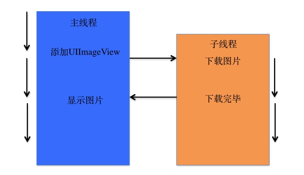

[线程之间的通信学习](https://www.cnblogs.com/wendingding/p/3805884.html)

### 线程锁
#### 线程安全
线程安全：线程安全就是多线程访问时，采用了加锁机制，当一个线程访问该类的某个数据时，进行保护，其他线程不能访问直到该线程读取完，其他线程才可使用。这样不会出现数据不一致或者数据污染。
线程不安全就是不提供数据访问保护，有可能出现多个线程先后更改数据造成所得到的数据是脏数据。
#### 锁
在计算机科学中，锁是一种同步机制，用于在存在多线程的环境中实施对资源的访问控制。

锁的作用：
    1.通俗来讲：就是为了防止在多线程的情况下对共享资源的脏读或者脏写。
    2.也可以理解为：执行多线程时用于强行限制资源访问的同步机制，即并发控制中保证互斥的需求。
    
#### iOS开发中常用的锁
- @synchronized
- NSLock 对象锁
- NSRecursiveLock 递归锁
- NSConditionLock 条件锁
- pthread_mutex 互斥锁（C语言）
- dispatch_semaphore 信号量
- OSSpinLock 自旋锁


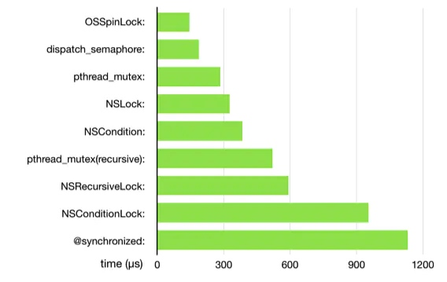
从上图可以看出，自旋锁的性能是最高的，但是自旋锁是不安全的，现在苹果已经暂停使用；而性能最低的是@synchronnized。
#### @synchronized
@synchronized其实是一个OC层面的锁，主要是通过牺牲性能换来语法上的简洁和可读性。
@synchronized是我们平常使用最多的但是性能最差的。

OC写法：
```Objective-c
@synchronized(self) {
    //需要执行的代码块
}
```
swift写法
```swift
objc_sync_enter(self)
//需要执行的代码块
objc_sync_exit(self)
```
代码示例：
```Objective-c
    //线程1
    dispatch_async(dispatch_get_global_queue(0, 0), ^{
        @synchronized(self) {
            NSLog(@"第一个线程同步操作开始");
            sleep(3);
            NSLog(@"第一个线程同步操作结束");
        }
    });
    //线程2
    dispatch_async(dispatch_get_global_queue(0, 0), ^{
        sleep(1);
        @synchronized(self) {
            NSLog(@"第二个线程同步操作");
        }
    });
```
结果：
> 2017-11-29 14:36:52.056457+0800 LockDemo[46145:1306472] 第一个线程同步操作开始
2017-11-29 14:36:55.056868+0800 LockDemo[46145:1306472] 第一个线程同步操作结束
2017-11-29 14:36:55.057261+0800 LockDemo[46145:1306473] 第二个线程同步操作


@synchronized(self)指令使用的self为该锁的唯一标识，只有当标识相同时，才为满足互斥，如果线程2中的self改成其他对象，线程2就不会被阻塞。
```Objective-c
    NSString *s = [NSString string];
    //线程1
    dispatch_async(dispatch_get_global_queue(0, 0), ^{
        @synchronized(self) {
            NSLog(@"第一个线程同步操作开始");
            sleep(3);
            NSLog(@"第一个线程同步操作结束");
        }
    });
    //线程2
    dispatch_async(dispatch_get_global_queue(0, 0), ^{
        sleep(1);
        @synchronized(s) {
            NSLog(@"第二个线程同步操作");
        }
    });
```
结果：
> 2017-11-29 14:43:54.930414+0800 LockDemo[46287:1312173] 第一个线程同步操作开始
2017-11-29 14:43:55.930761+0800 LockDemo[46287:1312158] 第二个线程同步操作
2017-11-29 14:43:57.932287+0800 LockDemo[46287:1312173] 第一个线程同步操作结束

- @synchronized指令实现锁的优点是我们不需要在代码中显示地创建锁对象，便可以实现锁的机制，但是在内部，@synchronized块会隐式的添加一个异常处理来保护代码，该处理会在异常抛出的时候自动的释放互斥锁。所以如果不想让隐式的异常处理带来额外的开销，可以考虑一下直接使用锁对象。

#### NSLock
NSLock：称为对象锁，它是对pthread_mutex（互斥锁）的进一步封装。
通过NSLocking协议定义了lock和unlock方法
```Objective-c
@protocol NSLocking

- (void)lock;
- (void)unlock;

@end
```
🌰
```Objective-c
- (void)nslockTest {
    //设置冰棍儿的数量为5
    _count = 5;
    
    //创建锁
    _lock = [[NSLock alloc] init];
    
    //线程1
    dispatch_async(dispatch_get_global_queue(0, 0), ^{
        [self saleIceCream];
    });
    
    //线程2
    dispatch_async(dispatch_get_global_queue(0, 0), ^{
        [self saleIceCream];
    });
}

- (void)saleIceCream
{
    while (1) {
        sleep(1);
        //加锁
        [_lock lock];
        if (_count > 0) {
            _count--;
            NSLog(@"剩余冰棍儿数= %ld, Thread - %@", _count, [NSThread currentThread]);
        } else {
            NSLog(@"冰棍儿卖光光  Thread - %@",[NSThread currentThread]);
            break;
        }
        //解锁
        [_lock unlock];
    }
}
```
加锁结果：
> 2017-11-29 16:21:29.728198+0800 LockDemo[55262:1411318] 剩余冰棍儿数= 4, Thread - <NSThread: 0x604000475dc0>{number = 3, name = (null)}
2017-11-29 16:21:29.728428+0800 LockDemo[55262:1411319] 剩余冰棍儿数= 3, Thread - <NSThread: 0x604000475e00>{number = 4, name = (null)}
2017-11-29 16:21:30.729009+0800 LockDemo[55262:1411318] 剩余冰棍儿数= 2, Thread - <NSThread: 0x604000475dc0>{number = 3, name = (null)}
2017-11-29 16:21:30.729378+0800 LockDemo[55262:1411319] 剩余冰棍儿数= 1, Thread - <NSThread: 0x604000475e00>{number = 4, name = (null)}
2017-11-29 16:21:31.733061+0800 LockDemo[55262:1411318] 剩余冰棍儿数= 0, Thread - <NSThread: 0x604000475dc0>{number = 3, name = (null)}
2017-11-29 16:21:31.733454+0800 LockDemo[55262:1411319] 冰棍儿卖光光  Thread - <NSThread: 0x604000475e00>{number = 4, name = (null)}


不加锁结果：
> 2017-11-29 16:23:38.702352+0800 LockDemo[55316:1412917] 剩余冰棍儿数= 3, Thread - <NSThread: 0x604000270b80>{number = 3, name = (null)}
2017-11-29 16:23:38.702352+0800 LockDemo[55316:1412919] 剩余冰棍儿数= 4, Thread - <NSThread: 0x604000271040>{number = 4, name = (null)}
2017-11-29 16:23:39.705096+0800 LockDemo[55316:1412919] 剩余冰棍儿数= 2, Thread - <NSThread: 0x604000271040>{number = 4, name = (null)}
2017-11-29 16:23:39.705099+0800 LockDemo[55316:1412917] 剩余冰棍儿数= 1, Thread - <NSThread: 0x604000270b80>{number = 3, name = (null)}
2017-11-29 16:23:40.709617+0800 LockDemo[55316:1412919] 剩余冰棍儿数= 0, Thread - <NSThread: 0x604000271040>{number = 4, name = (null)}
2017-11-29 16:23:40.709617+0800 LockDemo[55316:1412917] 冰棍儿卖光光  Thread - <NSThread: 0x604000270b80>{number = 3, name = (null)}
2017-11-29 16:23:41.714002+0800 LockDemo[55316:1412919] 冰棍儿卖光光  Thread - <NSThread: 0x604000271040>{number = 4, name = (null)}

- NSLock类还增加了tryLock和lockBeforeDate方法


```Objective-c 
- (BOOL)tryLock;
- (BOOL)lockBeforeDate:(NSDate *)limit;
```
- tryLock 试图加锁，如果加锁失败，它不会阻塞线程，相反，它只是返回NO
- lockBeforeData 试图加锁，但是如果锁没有在规定时间内获取，它会让线程从阻塞状态变成非阻塞状态

#### NSRecursiveLock递归锁
有时候“加锁代码”中存在递归调用，递归开始前加锁，递归调用开始后会重复执行此方法以至于反复执行加锁代码最终造成死锁。这时候，递归锁就能很好地解决这个问题。

死锁🌰
```Objective-c
    _lock = [[NSLock alloc]init];
    [_lock lock];
    NSLog(@"1");
    [_lock lock];
    NSLog(@"2");
```

输出结果
> 2021-07-22 16:31:55.697530+0800 SwiftToOCTest[8215:764485] 1

上面🌰很好的看出2是输出不了的。这是由于一开始加锁输出1之后，第二次加锁是对同一把锁进行加锁，但是发现这把锁已经加过锁了，于是线程进入了休眠，等待解锁。线程休眠无法继续往下执行，于是第二次再次调用lock方法时就已经出现了死锁的情况了。

而使用递归锁可以在一个线程中反复获取锁而不造成死锁，这个过程会记录获取锁和释放锁的次数，当两者平衡之后锁最终就会被释放。
```Objective-c
- (void)recursiveLockTest {
    //创建锁
    _recursiveLock = [[NSRecursiveLock alloc] init];
    
    dispatch_async(dispatch_get_global_queue(0, 0), ^{
        static void(^TestMethod)(int);
        TestMethod = ^(int value)
        {
            [_recursiveLock lock];
            if (value > 0)
            {
                [NSThread sleepForTimeInterval:1];
                value--;
                TestMethod(value);
            }
            [_recursiveLock unlock];
        };
        TestMethod(5);
        NSLog(@"结束");
    });
}
```
此时“结束”5秒后会被打印出来。

#### NSConditionLock条件锁
条件锁：一个线程获得了锁，其他线程就要等待，可用于多线程之间的任务等待调用，而且是线程安全的。

- [xxx lock]
   表示xxx期待获得锁，如果当时没有其他线程获得了锁（不需要判断内置的condition）就能获得锁，然后执行往下的代码。如果已有线程获得了锁（条件锁或者无条件锁），那么就要等待，直到其他线程解锁。
   
- [xxx lockWhenCondition:A条件]
   表示如果没有其他线程获得该锁，但是该锁内部的condition不等于A条件，它依然是不能获得该锁，仍要等待。如果内部的condition等于A条件，而且当前没有其他线程获得该锁，那么就进入往下的代码区。同时设置它获得该锁，其他线程都要等它的代码完成，直到解锁。
   
- [xxx unlockWithCondition:B条件]
   表示释放锁，同时将内部的condition设置为B条件
   
#### pthread_mutex
pthread_mutex是C语言定义下的多线程加锁方法，称为互斥锁，是Unix/Linux平台上提供的一套条件互斥锁的API。
使用pthread_mutex_init初始化锁，pthread_mutex_lock获取锁，pthread_mutex_unlock解锁，pthread_mutex_destroy销毁锁
```Objective-c
#import <pthread.h>
- (void)pthreadTest {
    __block pthread_mutex_t theLock;
    pthread_mutex_init(&theLock, NULL);
    
    dispatch_async(dispatch_get_global_queue(0, 0), ^{
        pthread_mutex_lock(&theLock);
        NSLog(@"第一个线程同步操作开始");
        sleep(3);
        NSLog(@"第一个线程同步操作结束");
        pthread_mutex_unlock(&theLock);
        
    });
    
    dispatch_async(dispatch_get_global_queue(0, 0), ^{
        sleep(1);
        pthread_mutex_lock(&theLock);
        NSLog(@"第二个线程同步操作");
        pthread_mutex_unlock(&theLock);
        
    });
}
```
输出结果：
> 2017-11-29 17:51:11.901064+0800 LockDemo[56729:1466788] 第一个线程同步操作开始
2017-11-29 17:51:14.904834+0800 LockDemo[56729:1466788] 第一个线程同步操作结束
2017-11-29 17:51:14.905195+0800 LockDemo[56729:1466789] 第二个线程同步操作

- pthread_mutex还可以创建条件锁，提供了和NSCondition一样的条件控制


```Objective-c
    // 初始化
    int pthread_cond_init (pthread_cond_t *cond, pthread_condattr_t *attr);
    // 等待（会阻塞）
    int pthread_cond_wait (pthread_cond_t *cond, pthread_mutex_t *mut);
    // 定时等待
    int pthread_cond_timedwait (pthread_cond_t *cond, pthread_mutex_t *mut, const struct timespec *abstime);
    // 唤醒
    int pthread_cond_signal (pthread_cond_t *cond);
    // 广播唤醒
    int pthread_cond_broadcast (pthread_cond_t *cond);
    // 销毁
    int pthread_cond_destroy (pthread_cond_t *cond);
```

pthread_mutex还提供了很多函数，有一套完整的API，非常底层，可以手动处理线程的各个状态的转换即管理生命周期，甚至可以实现一套自己的多线程。

#### dispatch_semaphore_t
dispatch_semaphore_t GCD中的信号量，也可以解决资源抢占问题，支持信号通知和信号等待。每当发送一个信号通知，则信号量+1；每当发送一个等待信号时信号量-1；如果信号量为0则信号会处于等待状态，直到信号量大于0开始执行。

api注释
```Objective-c
/*! 
 * @param value
 *信号量的起始值，当传入的值小于零时返回NULL
 * @result
 * 成功返回一个新的信号量，失败返回NULL
 */
dispatch_semaphore_t dispatch_semaphore_create(long value)

/*!
 * @discussion
 * 信号量减1，如果结果小于0，那么等待队列中信号增量到来直到timeout
 * @param dsema
 * 信号量
 * @param timeout
 * 等待时间
 * 类型为dispatch_time_t，这里有两个宏DISPATCH_TIME_NOW、DISPATCH_TIME_FOREVER
 * @result
 * 若等待成功返回0，timeout返回非0
 */
long dispatch_semaphore_wait(dispatch_semaphore_t dsema, dispatch_time_t timeout);

/*!
 * @discussion
 * 信号量加1，如果之前的信号量小于0，将唤醒一条等待线程
 * @param dsema 
 * 信号量
 * @result
 * 唤醒一条线程返回非0，否则返回0
 */
long dispatch_semaphore_signal(dispatch_semaphore_t dsema)
```
🌰
```Objective-c
- (void)semaphoreTest {
    // 创建信号量
    dispatch_semaphore_t semaphore = dispatch_semaphore_create(1);
    //线程1
    dispatch_async(dispatch_get_global_queue(0, 0), ^{
        dispatch_semaphore_wait(semaphore, DISPATCH_TIME_FOREVER);
        NSLog(@"任务1");
        sleep(10);
        dispatch_semaphore_signal(semaphore);
    });
    
    //线程2
    dispatch_async(dispatch_get_global_queue(0, 0), ^{
        sleep(1);
        dispatch_semaphore_wait(semaphore, DISPATCH_TIME_FOREVER);
        NSLog(@"任务2");
        dispatch_semaphore_signal(semaphore);
    });
}
```
执行结果：
> 2017-11-30 14:38:11.943521+0800 LockDemo[91493:2075379] 任务1
2017-11-30 14:38:21.946222+0800 LockDemo[91493:2075380] 任务2

#### OSSPinLock
使用：
```Objective-c
#import <libkern/OSAtomic.h>
__block OSSpinLock theLock = OS_SPINLOCK_INIT;
dispatch_async(dispatch_get_global_queue(DISPATCH_QUEUE_PRIORITY_DEFAULT, 0), ^{
    OSSpinLockLock(&theLock);
    NSLog(@"第一个线程同步操作开始");
    sleep(3);
    NSLog(@"第一个线程同步操作结束");
    OSSpinLockUnlock(&theLock);
});

dispatch_async(dispatch_get_global_queue(DISPATCH_QUEUE_PRIORITY_DEFAULT, 0), ^{
    OSSpinLockLock(&theLock);
    sleep(1);
    NSLog(@"第二个线程同步操作");
    OSSpinLockUnlock(&theLock);
});
```
执行结果：
> 2017-11-30 15:12:31.701180+0800 LockDemo[92422:2104479] 第一个线程同步操作开始
2017-11-30 15:12:39.705473+0800 LockDemo[92422:2104479] 第一个线程同步操作结束
2017-11-30 15:12:39.705820+0800 LockDemo[92422:2104478] 第二个线程同步操作开始


OSSPinLock称为自旋锁，性能最高的锁。但是它的缺点是当等待时会消耗大量的CPU资源，因此适用于时间较短的任务。但是最近已有博主说明OSSPinLink已经不再安全，苹果也建议暂停使用。

iOS 10之后，苹果给出了解决方案，就是用os_unfair_lock代替OSSPinLock
使用：
```Objective-c
#import <os/lock.h>
    __block os_unfair_lock  lock = OS_UNFAIR_LOCK_INIT;
    dispatch_async(dispatch_get_global_queue(0, 0), ^{
        os_unfair_lock_lock(&lock);
        NSLog(@"第一个线程同步操作开始");
        sleep(8);
        NSLog(@"第一个线程同步操作结束");
        os_unfair_lock_unlock(&lock);
    });
    
    dispatch_async(dispatch_get_global_queue(0, 0), ^{
        sleep(1);
        os_unfair_lock_lock(&lock);
        NSLog(@"第二个线程同步操作开始");
        os_unfair_lock_unlock(&lock);
    });
```
执行结果：
> 2017-11-30 15:12:31.701180+0800 LockDemo[92422:2104479] 第一个线程同步操作开始
2017-11-30 15:12:39.705473+0800 LockDemo[92422:2104479] 第一个线程同步操作结束
2017-11-30 15:12:39.705820+0800 LockDemo[92422:2104478] 第二个线程同步操作开始


#### 总结🌟
- @synchronized：锁里面是性能最低的，但是写法方便简洁，适用于线程不多、任务量不大的多线程加锁。
- NSLock：性能不算差。
- dispatch_semaphore_t：使用信号量来加锁，性能很高。
- NSConditionLock：多线程处理不同任务的通信建议使用。
- NSRecursiveLock：性能不错，适用于递归加锁的情况。
- pthread_mutex：C语言的底层api，性能高，复杂的多线程处理建议使用，也可以封装自己的多线程。
- OSSPinlockL：性能非常高，可惜不安全，可使用os_unfair_lock来代替。

## 架构
### 设计模式
#### MVC模式
MVC模式从应用层面进行分层开发，极大地优化了代码结构，而且简单容易上手。到目前为止，MVC仍然是非常好的架构模式。但是MVC模式也存在一定的弊端：随着项目需求的增加，业务逻辑、网络请求、代理方法等都往Contriller层里面塞，导致Controller层变得非常得臃肿，不利于维护，因此在MVC模式的基础上逐渐衍生出了MVP、MVVM等架构模式。

##### 传统的MVC设计模式
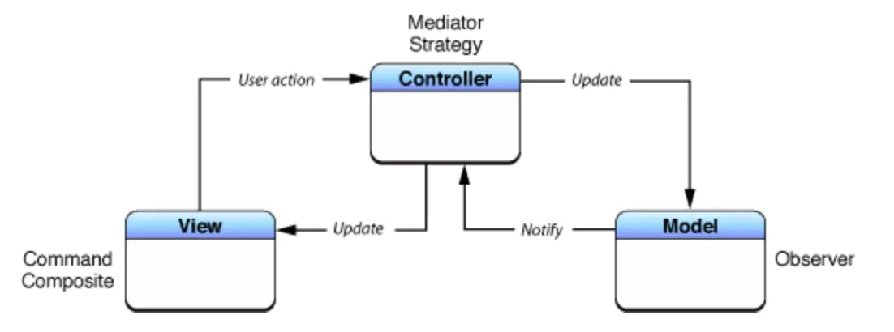
- M：Model数据层，负责网络数据的处理，数据持久化存储和读取等工作。
- V：View视图层，负责呈现从数据层传递的数据渲染工作，以及一部分用户交互工作。
- C：Controller控制层，负责连接Model层跟View层，响应View的时间和作为View的代理，以及界面跳转和生命周期的处理等任务。

##### 用户的交互逻辑
用户点击View视图 -> 视图响应事件 -> 通过代理传递事件到Controller -> 发起网络请求更新Model -> Model更新完毕通知Controller -> 更新View视图 -> 完成

可以看出，Controller完美地充当了Model跟View通信之间的媒介，View与Model是相互分离的，但是相当多的代码就会堆积在Controller层。

#### MVP模式
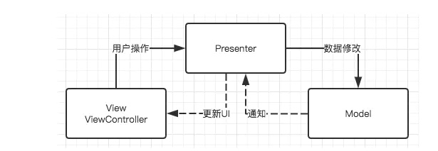
- M：Model数据层，负责网络数据的处理，数据持久化存储和读取等工作。
- V：View视图层，这里与MVC模式不同的是：View层同时包括UIView和UIViewController层，负责呈现从数据层传递的数据渲染工作，以及一部分的用户交互工作
- P：Presenter层。负责View数据所需要数据的获取，以及获取数据后更新视图。响应View的事件和作为View的代理。

可以看出MVP模式跟MVC模式是非常相似的，也是实现了View层和Model层的分离，而且将业务逻辑放在了Presenter层，分担了Controller的压力，视图展示所需要的数据从Presenter层获取，View交互更新的数据也通知Presenter层去发起网络请求更新Model。

##### 用户的交互逻辑
> 用户点击View视图 -> View视图响应事件 -> 传递事件到Presenter层 -> 发起网络请求更新Model -> Model更新完毕 -> 代理或通知Presenter层 -> 更新View视图

##### 存在的不足
MVP模式也是存在一定的弊端的。所有的用户操作和更新UI的回调都是要定义的（定义的协议、通知之类），随着交互越来越多，这些定义也是需要一大部分的代码的。而逻辑过于复杂的情况下，Presenter层也会变得很复杂。因此在MVC模式的基础上又衍生出了MVVM模式。

[MVP模式学习](https://www.jianshu.com/p/f592e8760776)

#### MVVM模式
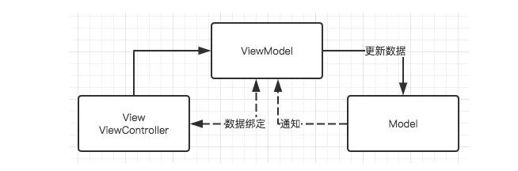
- M：Model数据层，负责网络数据的处理，数据持久化存储和读取等工作。
- V：View视图层，同时包括View层跟ViewController层，负责呈现充数据层传递的数据渲染工作，以及处理与用户的交互
- VM：ViewModel层，负责视图需要数据的获取，获取数据之后刷新视图。响应View的事件和作为View的代理等工作

通过架构图可以看出，MVVM模式跟MVP模式基本类似，主要区别是在MVP基础上加入了双向绑定机制。当被绑定对象某个值变化时，绑定对象会自动感知，无需被绑定对象主动通知绑定对象，这里可以用KVO或者RAC实现。

##### MVVM的职责划分
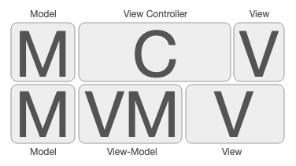

从上图可以看出：
    - V：View视图层，其实是指的是View层跟Controller层的一部分功能
    - VM：ViewModel层，抽离了一部分Controller层出来组装成了ViewModel层，但本质上ViewModel层也是可以理解为Model层
    - 而对于Controller层：只需要管理隶属于它的View视图以及关注使用来自ViewModel的数据配置，而对于网络请求、数据库操作之类的就可以交给ViewModel层去实现。

结合自己的理解🌟
- 首先页面的展示流程是要先请求网络数据，那么请求网络数据的工作就交给ViewModel层去实现
- ViewModel层请求完网络数据之后就将数据转换为Model层的数据类型
- ViewModel层提供一个数据转换接口给Model层，去配置View展示所需要的Model数据
- 而视图View层的数据配置就是来源于ViewModel层的数据
- 还有值得注意的是：MVVM的双向绑定机制：当与View视图进行交互时，对View视图的配置（比如展示的label）发生变化之后可以利用KVO等直接通知ViewModel数据的更改，而不用走代理或者走一个全局通知的方法。

[MVP、MVVM学习1](https://www.jianshu.com/p/f592e8760776)
[MVP、MVVM学习2](https://juejin.cn/post/6844903844934057992#heading-12)

#### KVC模式
 
##### KVC定义
KVC（Key-value-coding）键值编码，就是指在iOS的开发中，开议允许开发者通过Key名访问对象的属性，或者给对象的属性赋值，而不需要调用明确的存取方法，这样就可以在运行时动态地访问和修改对象的属性，而不是在编译时确定，这也是iOS开发中的黑魔法之一。很多高级的iOS开发技巧都是基于KVC实现的。

在实现了访问器方法的类中，使用点语法和KVC访问对象其实差别不大，二者可以混用。但是在没有访问方法的类中，点语法无法使用，这是KVC就有很大的优势了。

在OC中，所有继承了NSObject的类型，都能使用KVC，下面是KVC最为重要的四个方法：
```Objective-c
- (nullable id)valueForKey:(NSString *)key;                          //直接通过Key来取值

- (void)setValue:(nullable id)value forKey:(NSString *)key;          //通过Key来设值

- (nullable id)valueForKeyPath:(NSString *)keyPath;                  //通过KeyPath来取值

- (void)setValue:(nullable id)value forKeyPath:(NSString *)keyPath;  //通过KeyPath来设值
```

KVC中还有一些别的方法
```Objective-c
+ (BOOL)accessInstanceVariablesDirectly;
//默认返回YES，表示如果没有找到Set<Key>方法的话，会按照_key，_iskey，key，iskey的顺序搜索成员，设置成NO就不这样搜索

- (BOOL)validateValue:(inout id __nullable * __nonnull)ioValue forKey:(NSString *)inKey error:(out NSError **)outError;
//KVC提供属性值正确性验证的API，它可以用来检查set的值是否正确、为不正确的值做一个替换值或者拒绝设置新值并返回错误原因。

- (NSMutableArray *)mutableArrayValueForKey:(NSString *)key;
//这是集合操作的API，里面还有一系列这样的API，如果属性是一个NSMutableArray，那么可以用这个方法来返回。

- (nullable id)valueForUndefinedKey:(NSString *)key;
//如果Key不存在，且没有KVC无法搜索到任何和Key有关的字段或者属性，则会调用这个方法，默认是抛出异常。

- (void)setValue:(nullable id)value forUndefinedKey:(NSString *)key;
//和上一个方法一样，但这个方法是设值。

- (void)setNilValueForKey:(NSString *)key;
//如果你在SetValue方法时面给Value传nil，则会调用这个方法

- (NSDictionary<NSString *, id> *)dictionaryWithValuesForKeys:(NSArray<NSString *> *)keys;
//输入一组key,返回该组key对应的Value，再转成字典返回，用于将Model转到字典。
```

同时苹果对一些容器类比如NSArray或者NSSet等，KVC有着特殊的实现。
有序集合对应方法如下：
```Objective-c
-countOf<Key>//必须实现，对应于NSArray的基本方法count:
-objectIn<Key>AtIndex:

-<key>AtIndexes://这两个必须实现一个，对应于 NSArray 的方法 objectAtIndex: 和 objectsAtIndexes:

-get<Key>:range://不是必须实现的，但实现后可以提高性能，其对应于 NSArray 方法 getObjects:range:

-insertObject:in<Key>AtIndex:

-insert<Key>:atIndexes://两个必须实现一个，类似于 NSMutableArray 的方法 insertObject:atIndex: 和 insertObjects:atIndexes:

-removeObjectFrom<Key>AtIndex:

-remove<Key>AtIndexes://两个必须实现一个，类似于 NSMutableArray 的方法 removeObjectAtIndex: 和 removeObjectsAtIndexes:

-replaceObjectIn<Key>AtIndex:withObject:

-replace<Key>AtIndexes:with<Key>://可选的，如果在此类操作上有性能问题，就需要考虑实现之
```
对于无序集合对应方法如下：
```Objective-c
-countOf<Key>//必须实现，对应于NSArray的基本方法count:

-objectIn<Key>AtIndex:

-<key>AtIndexes://这两个必须实现一个，对应于 NSArray 的方法 objectAtIndex: 和 objectsAtIndexes:

-get<Key>:range://不是必须实现的，但实现后可以提高性能，其对应于 NSArray 方法 getObjects:range:

-insertObject:in<Key>AtIndex:

-insert<Key>:atIndexes://两个必须实现一个，类似于 NSMutableArray 的方法 insertObject:atIndex: 和 insertObjects:atIndexes:

-removeObjectFrom<Key>AtIndex:

-remove<Key>AtIndexes://两个必须实现一个，类似于 NSMutableArray 的方法 removeObjectAtIndex: 和 removeObjectsAtIndexes:

-replaceObjectIn<Key>AtIndex:withObject:

-replace<Key>AtIndexes:with<Key>://这两个都是可选的，如果在此类操作上有性能问题，就需要考虑实现之
```
##### KVC的应用
- KVC设值
- KVC取值
- KVC使用keyPath设值、取值
- KVC处理异常
- KVC处理数值和结构体类型属性
- KVC键值验证
- KVC处理集合
- KVC处理字典

##### KVC相关技术概述
###### KVC设值
当调用setValye:属性值 forKey:@"name" 方法时，底层的执行机制如下：
- 程序优先调用set<Key>:属性值方法，通过setter方法完成设置。注意这里的<Key>是指成员变量名
- 如果没有找到setName:方法，KVC机制首先会检查+ (BOOL)accessInstanceVariablesDirectly方法是否返回YES（默认是返回YES的），如果重写了此方法并让其返回NO的话，那么KVC机制找不到setName:方法时就会进一步执行setValue: forUndefineKey:方法（找不到Key时在此方法里默认会抛出异常）
- 如果该类没有set<Key>：方法，也没有_<key>成员变量，KVC机制会搜索_is<Key>的成员变量。
- 如果还找不到，KVC机制会继续搜索<key>,is<Key>的成员变量，再给它们赋值。
- 如果上述的方法或者成员变量都不存在，那么系统就会执行该对象的setValue: forUndefineKey：方法，默认是抛出异常
简单来说就是 如果没有找到set<Key>方法的话，会按照_key,_isKey,key,iskey的顺序搜索成员变量进行赋值操作。

###### KVC取值
当调用valueForKey:@"name"的代码时，底层的执行机制如下：
1.按先后顺序搜索getKey、key、isKey、_getKey、_key五个方法，若某一个方法被实现，取到的即是方法返回的值，后面的方法不再运行。如果是BOOL或者Int等值类型， 会将其包装成一个NSNumber对象。

2.若这五个方法都没有找到，则会调用+ (BOOL)accessInstanceVariablesDirectly方法判断是否允许取成员变量的值。

若返回NO，直接调用- (nullable id)valueForUndefinedKey:(NSString *)key方法，默认是奔溃。

若返回YES,会按先后顺序取_key、_isKey、 key、isKey的值。

3.返回YES时，_key、_isKey、 key、isKey的值都没取到，调用- (nullable id)valueForUndefinedKey:(NSString *)key方法。


###### KVC使用KeyPath
在开发过程中，一个类的成员变量有可能是自定义类或其他的复杂的数据类型，你可以通过KVC先获取该属性，然后再次利用KVC来获取这个自定义类的属性，但是这样是比较繁琐的，对此，KVC提供了一个解决方案，那就是键路径KeyPath。顾名思义，就是按照路径寻找Key。

- KVC对于KeyPath的搜索机制的第一步是先分离key，用小数点.来分割key，然后像普通key一样按照先前的介绍顺序搜索下去。（比如keyPath是 @"test.name",那么先分割KeyPath，先搜索test，然后再搜索name）

###### KVC处理异常
KVC中最常见的异常就是不小心使用了错误的key，或者在设置中不小心传递了nil的值，KVC中有专门的方法来处理这些异常。

###### KVC处理数值和结构体类型属性
在KVC定义的方法里，传入和传出的类型是id，这就说明对于一些Bool和int等值类型和一些CGSize和CGRect等结构体类型是要先进行类型转换，再能调用KVC的方法的。

###### KVC键值验证（Key-Value—Validation）
KVC提供了验证Key对应的Value是否可用的方法：
```Objective-c
- (BOOL)validateValue:(inoutid*)ioValue forKey:(NSString*)inKey error:(outNSError**)outError;
```
###### KVC处理集合
KVC同时还提供了很多复杂的函数，主要有下面这些：

简单集合运算符
简单集合运算符共有@avg，@count，@max，@min，@sum 5种，目前还不支持自定义类型

🌰
```Objective-c
#import <Foundation/Foundation.h>

@interface Book : NSObject
@property (nonatomic, copy)  NSString* name;
@property (nonatomic, assign)  CGFloat price;
@end

@implementation Book
@end


int main(int argc, const char * argv[]) {
    @autoreleasepool {
        
        Book *book1 = [Book new];
        book1.name = @"The Great Gastby";
        book1.price = 10;
        Book *book2 = [Book new];
        book2.name = @"Time History";
        book2.price = 20;
        Book *book3 = [Book new];
        book3.name = @"Wrong Hole";
        book3.price = 30;
        
        Book *book4 = [Book new];
        book4.name = @"Wrong Hole";
        book4.price = 40;
        
        NSArray* arrBooks = @[book1,book2,book3,book4];
        NSNumber* sum = [arrBooks valueForKeyPath:@"@sum.price"];
        NSLog(@"sum:%f",sum.floatValue);
        NSNumber* avg = [arrBooks valueForKeyPath:@"@avg.price"];
        NSLog(@"avg:%f",avg.floatValue);
        NSNumber* count = [arrBooks valueForKeyPath:@"@count"];
        NSLog(@"count:%f",count.floatValue);
        NSNumber* min = [arrBooks valueForKeyPath:@"@min.price"];
        NSLog(@"min:%f",min.floatValue);
        NSNumber* max = [arrBooks valueForKeyPath:@"@max.price"];
        NSLog(@"max:%f",max.floatValue);
        
    }
    return 0;
}
```

对象运算符
比集合运算符稍微复杂，能以数组的方式返回指定的内容，一共有两种：
- @distinctUnionOfObjects
- @unionOfObjects
它们的返回值都是NSArray，区别是前者返回的元素都是唯一的，是去重之后的结果；后者返回的元素是全集。

###### KVC处理字典
KVC里面有两个关于NSDictionary:的方法
```Objective-c
//输入一组key，返回这组key对应的属性，再组成一个字典
- (NSDictionary<NSString *, id> *)dictionaryWithValuesForKeys:(NSArray<NSString *> *)keys;
//修改Model中对应Key的值
- (void)setValuesForKeysWithDictionary:(NSDictionary<NSString *, id> *)keyedValues;
```

##### KVC使用
- KVC在iOS开发中是绝不可少的利器，这种基于运行时的编程方式极大地提高了灵活性，简化了代码，甚至实现了很多难以想象的功能，KVC也是许多iOS开发黑魔法的基础。
- 动态地取值和设值
- 用KVC来访问和修改私有变量
- Model和字典的转换
- 修改一些控件的内部属性
- 操作集合
- 用KVC实现高阶消息传递

[KVC学习](https://www.jianshu.com/p/b9f020a8b4c9)

#### KVO模式
##### KVO定义
KVO即Key-Value-Observing，即称为键值观察。它是一种观察者模式的衍生。其基本思想是：对目标对象的某属性添加观察，当该属性发生变化时，通过触发观察者对象实现的KVO接口方法，来自动地通知观察者。

简单来说KVO可以通过监听key，来获得value的变化，用来在对象之间监听状态变化。KVO的定义都是对NSObject的扩展来实现的，所有继承了NSObject的类型都能使用KVO。

##### KVO使用
注册与解除通知
```Objective-c
//要注意的是注册的通知，要在观察者被销毁之前将通知销毁
- (void)addObserver:(NSObject *)observer forKeyPath:(NSString *)keyPath options:(NSKeyValueObservingOptions)options context:(void *)context;
- (void)removeObserver:(NSObject *)observer forKeyPath:(NSString *)keyPath;

//observer:观察者，也就是KVO通知的订阅者。订阅者必须实现 
//observeValueForKeyPath:ofObject:change:context:方法
//keyPath：描述将要观察的属性，相对于被观察者。
//options：KVO的一些属性配置；有四个选项。
//context: 上下文，这个会传递到订阅着的函数中，用来区分消息，所以应当是不同的。

//options所包括的内容
NSKeyValueObservingOptionNew：change字典包括改变后的值
NSKeyValueObservingOptionOld:change字典包括改变前的值
NSKeyValueObservingOptionInitial:注册后立刻触发KVO通知
NSKeyValueObservingOptionPrior:值改变前是否也要通知（这个key决定了是否在改变前改变后通知两次）
```

处理变更通知
每当监听的keyPath的值发生变化了，就会在这个函数中回调
```Objective-c
- (void)observeValueForKeyPath:(NSString *)keyPath
                      ofObject:(id)object
                        change:(NSDictionary *)change
                       context:(void *)context
```
##### 手动KVO
KVO的实现，是对注册的KeyPath中自动实现了两个函数，在setter方法里自动调用
```Objective-c
- (void)willChangeValueForKey:(NSString *)key
- (void)didChangeValueForKey:(NSString *)key
```

手动KVO的话，就需要我们去关掉系统默认的KVO通知
```Objective-c
+ (BOOL) automaticallyNotifiesObserversForKey:(NSString *)key {
    if ([key isEqualToString:@"age"]) {
        return NO;
    }

    return [super automaticallyNotifiesObserversForKey:key];
}
```
然后还要在要监听的属性的setter方法里调用开启KVO通知的两个函数，这个当监听的属性值发生变化时，才会自动地去通知观察者
🌰
```Objective-c
- (void) setAge:(int)theAge
{   //对age成员变量开启了手动KVO通知
    [self willChangeValueForKey:@"age"];
    age = theAge;
    [self didChangeValueForKey:@"age"];
}
```

##### 键值观察依赖键
有时候一个属性的值依赖于另一对象中的一个或多个属性，如果这些属性中任一属性的值发生变化，被依赖的属性值也应当为其变更进行标记。因此，object引入了依赖键。

🌰
在这里，观察的是TargetWrapper类的infomation属性，该属性是依赖于Target类的age和grade属性。

在TargetWrapper中的依赖键属性的实现：
- 首先要手动实现属性information的setter和getter方法
- 其次，要实现keyPathsForValuesAffecting<key>(这里的key对应于属性information），也就是要实现keyPathsForValuesAffectingInformation方法或keyPathsForValuesAffectingValueForKey: 方法来告诉系统属性information依赖于哪些其他属性，这两个方法都返回一个key-path的集合。

在这里，information属性依赖于target的age和grade属性，target的age/grade属性发生变化，information的观察者都会收到通知。

##### KVO和线程
KVO的同步性非强强大，我们不应该在多个线程和队列之间使用KVO

##### KVO的实现
KVO是通过isa-swizzling实现的。
基本流程就是编译器自动为被观察对象创造一个派生类，并将被观察对象的isa指针指向这个派生类。如果用户注册了对此目标对象的某一个属性的观察，那么此派生类会重写这个方法，并在其中添加进行通知的代码。Objective-c在发送消息的时候，会通过isa指针找到当前对象所属的类对象，再通过类对象找到class_rw_t 结构体，里面保存着当前对象的实例方法，因此在向此对象发送消息的时候，实际上是发送到了派生类对象的方法。由于编译器对派生类的方法进行了重写，并添加了通知代码，因此会向注册的观察对象发送通知。注意的是派生类只是重写了注册了观察者的属性方法。

###### 重写了setter方法
- 重写被观察属性的setter方法
- 在setter方法里添加这两个方法的调用

```Objective-c
- (void)willChangeValueForKey:(NSString *)key;
- (void)didChangeValueForKey:(NSString *)key;
```

- 在didChangeValueForKey方法里调用通知观察者的方法

```Objective-c
- (void)observeValueForKeyPath:(nullable NSString *)keyPath
                      ofObject:(nullable id)object
                        change:(nullable NSDictionary<NSKeyValueChangeKey, id> *)change
                       context:(nullable void *)context;
```

###### 重写了class方法
修改了其中的isa指针的指向，但是class的返回值不会发生改变

###### 重写了dealloc方法
在移除KVO观察者后，对象的isa指针由指向派生类到指向原来所属的类

###### 重写了_isKVOA
这个私有方法是用来标示该类是一个KVO机制声称的类

###### 🌟
派生类一旦被创建，为了后续的重用，是一直存在内存中的，不会被销毁。

[KVO学习](https://www.jianshu.com/p/b9f020a8b4c9)

## 系统
### RunTime
#### 从Runtime开始理解从面向对象的类到面向过程的结构体
##### 什么是Runtime
- runtime就是运行时，在实际开发中使用runtime的场景并不多，但是了解runtime有助于我们更好地理解OC的原理，从而提高开发水平。
- 高级编程语言想要成为可执行文件需要先编译为汇编语言再转为机器语言，机器语言是计算机能够识别的唯一语言，但是OC并不能直接编译为汇编语言，而是要先转换为纯C语言再进行编译和汇编的操作，从OC到C语言的过渡就是由runtime来实现的。然而我们使用的OC是面向对象的开发，而C语言更多的是面向过程的开发，这就需要将面向对象的类转变为面向过程的结构体。

##### 深入理解instance、class object、metaclass
面向对象编程中，最终要的概念就是类，下面我们就从代码入手，看看OC是如何实现类的。
打开#import<objc/objc.h>文件，可以发现以下几行代码
```Objective-c
/// An opaque type that represents an Objective-C class.
typedef struct objc_class *Class;

/// Represents an instance of a class.
struct objc_object {
    Class isa  OBJC_ISA_AVAILABILITY;
};

/// A pointer to an instance of a class.
typedef struct objc_object *id;
```
- 通过上述代码我们可以发现我们创建的的对象其实是一个指向objc_object的结构体的指针，而我们常用的id也就是这个结构体的指针。
- 不管是Foundation框架中的类还是自定义的类，我们创建的类的实例最终都是获取一个结构体指针，这个结构体里只有一个成员变量就是Class类型的isa指针（比如对象str是NSString类型，那么Class就是代表NSString这个类）
- 而isa指针是指向这个实例所属的类（类对象）
- 而类对象其实是一个指向objec_class结构体的指针

objc_class结构体
- objc_class结构体里定义了很多变量，通过命名不难发现，结构体里保存了指向父类的指针、类的名字、版本、信息、实例大小、实例变量列表、方法列表、缓存、遵守的协议列表等。
- 可以看出类对象就是一个结构体，这里结构体里存放的数据称为元数据（metadata），类对象在编译期间产生用于创建实例对象，是一个单例。
- 类对象中的元数据存储的都是如何创建一个实例的相关信息，那么类对象和类方法应该从哪里创建呢？就是从isa指针指向的结构体里创建的，类对象的isa指针指向的我们称之为元类（metaclass），元类中保存了创建类对象和类方法所需的所有信息。

```Objective-c
文件objc/runtime.h中有如下定义:
struct objc_class {
    Class isa  OBJC_ISA_AVAILABILITY;

    Class super_class                                        
    const char *name                                         
    long version                                             
    long info                                                
    long instance_size                                       
    struct objc_ivar_list *ivars                             
    struct objc_method_list **methodLists                    
    struct objc_cache *cache                                 
    struct objc_protocol_list *protocols                     
}
/* Use `Class` instead of `struct objc_class *` */

文件objc/objc.h文件中有如下定义
/// An opaque type that represents an Objective-C class.
typedef struct objc_class *Class;

/// Represents an instance of a class.
struct objc_object {
    Class isa  OBJC_ISA_AVAILABILITY;
};

/// A pointer to an instance of a class.
typedef struct objc_object *id;
```
整个的结构图示：
 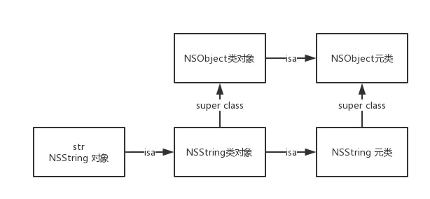

[runtime学习🔗](https://www.jianshu.com/p/17e158a666b1)

#### 从runtime开始深入理解OC的消息转发机制
##### msg_Send
我们知道在OC的实例对象中调用一个方法称作消息传递。比如下面代码：
```Objective-c
NSMutableString *str = [[NSMutableString alloc] initWithString: @"Jiaming Chen"];
[str appendString:@" is a good guy."];
```
上述代码中第二句str称为消息的接受者，appendString：称为选择子（selector），selector和参数共同构成了消息，所以可以理解为将增加一个字符串" is a good guy."的消息传递给了str

- OC中的消息传递采用动态绑定机制来决定具体调用哪个方法，OC的实例方法在转写为C语言后实际上就是一个函数，但是OC并不是在编译期决定调用哪个函数，而是在运行期决定的。因为编译期根本不能确定最终会调用哪个函数，这是由于运行期可以修改方法的实现。

🌰
```Objective-c
id num = @123;
//输出123
NSLog(@"%@", num);
//程序崩溃,报错[__NSCFNumber appendString:]: unrecognized selector sent to instance 0x7b27
[num appendString:@"Hello World"];
```
- 上述代码在编译器没有任何问题，因为id类型可以指向任何类型的实例对象，NSString有一个方法appendString:，在编译器不确定这个num到底具体指代什么类型的实例对象，并且在运行期还可以给NSNumber类型添加新的方法，因此编译器发现有appendString:的函数声明都不会报错，但如果在运行时在NSNumber类中找不到appendString:方法，就会报错，这也就是消息传递的强大之处和弊端，编译器无法检查到未定义的方法，运行期可以添加新的方法。

##### 依靠runtime将OC的方法转换为C语言的函数
```Objective-c
//🌰1
 Person *p = [Person alloc];
 //转换后的C语言函数
 Person *p = ((Person *(*)(id, SEL))(void *)objc_msgSend)((id)objc_getClass("Person"), sel_registerName("alloc"));
 //简化一下
 Person *p = objc_msgSend(objc_getClass("Person"), sel_registerName("alloc"));
 
 //上面的代码一共做了三件事
 //1.获取Person类
 //2.注册alloc方法
 //3.发送消息，将alloc消息发送给接收对象Person
 
 //🌰2
 p.name = @"Jiaming Chen";
 //转换后的C语言
  ((void (*)(id, SEL, NSString *))(void *)objc_msgSend)((id)p, sel_registerName("setName:"), (NSString *)&__NSConstantStringImpl__var_folders_1f_dz4kq57d4b19s4tfmds1mysh0000gn_T_main_f5b408_mi_1);
//简化一下
objc_msgSend(p, sel_registerName("setName:"), name);
//查找参数的位置
(NSString *)&__NSConstantStringImpl__var_folders_1f_dz4kq57d4b19s4tfmds1mysh0000gn_T_main_f5b408_mi_1)
```
综合上述代码，我们可以看出OC的runtime通过objc_msgSend函数将一个面向对象的消息传递转为了面向过程的函数调用，
- objc_msgSend函数根据消息的接受者和selector选择适当的方法来调用。

##### msgSend工作原理
- 实例对象调用方法时
- 首先通过对象的isa指针找到类对象objc_class
- 到类对象的方法缓存里查看是否有对应的方法
- 在类对象的结构体里，通过bits.data()方法找到class_rw_t结构体，在该结构体里查找方法列表method_array_t，method_array_t里保存的是method_list_t，method_list_t里是method_t
- method_t里保存了每个方法的信息，包括
    1.选择子
    2.方法类型
    3.方法实现imp

所以msgSend的工作原理可以理解为：为了匹配消息的接收者和选择子，首先通过isa指针定位到类对象objc_class，查找缓存里是否有对应的方法；如果找不到，那么通过调用bits.data()方法找到class_rw_t结构体，查找类对象的方法列表，如果找到对应的方法，则将方法加入到缓存里，然后通过imp进行调用；如果都找不到，那么就会沿着继承树往上搜索，如果都找不到，那么就会进行消息转发。

因此，我们可以看出，发送信息其实也是很复杂的，需要经过很多步骤，这带来的就是性能的损耗。因此，类对象也就是结构体object_class中有一个成员变量cache_t，这个缓存里缓存的正是搜索方法的匹配结果，这样在第二次以及以后的再次访问时就可以采用映射的方式直接找到相关实现的具体位置。

##### 三次消息寻找的机会
要注意：三次消息转发是会走继承树的，比如resolveInstanceMethod方法在子类没有实现，super类实现了也是会调用到的。
###### 第一次机会：所属类动态方法解析
- 如果沿着继承树都没有搜索到相关方法，那么就会向接受者所属的类进行一次请求，看是否能够动态的添加一个方法（这是一个类方法）

```Objective-c
+(BOOL)resolveInstanceMethod:(SEL)name
```
如果要实现动态地添加一个新方法，是要重写上面的方法的，然后在该方法里调用C语言的函数class_addMethod

🌰
```Objective-c
@interface Person : NSObject

@property (nonatomic, copy) NSString* name;
@property (nonatomic, assign) NSUInteger age;

@end

@implementation Person

@synthesize name = _name;
@synthesize age = _age;
//如果需要传参直接在参数列表后面添加就好了
void dynamicAdditionMethodIMP(id self, SEL _cmd) {
    NSLog(@"dynamicAdditionMethodIMP");
}

+ (BOOL)resolveInstanceMethod:(SEL)name {
    NSLog(@"resolveInstanceMethod: %@", NSStringFromSelector(name));
    if (name == @selector(appendString:)) {
        class_addMethod([self class], name, (IMP)dynamicAdditionMethodIMP, "v@:");
        return YES;
    }
    return [super resolveInstanceMethod:name];
}

+ (BOOL)resolveClassMethod:(SEL)name {
    NSLog(@"resolveClassMethod %@", NSStringFromSelector(name));
    return [super resolveClassMethod:name];
}

@end

int main(int argc, const char * argv[]) {
    @autoreleasepool {
        //这里一定要用id修饰p，否则编译的时候就会报错：说找不到appendString:方法
        id p = [[Person alloc] init];
        [p appendString:@""];
    }
    return 0;
}
```
###### 第二次机会：备援接收者
如果对象所属的类不能动态添加方法后，runtime会询问当前的接收者是否有其他对象可以处理这个未知的selector，相关的方法声明如下：
```Objective-c
- (id)forwardingTargetForSelector:(SEL)aSelector;
```

###### 第三次机会：消息重定向
当没有备援接收者时，就只剩下最后一次机会，那就是消息重定向。这个时候runtime会将未知消息的所有细节都封装为NSInvocation对象，然后调用下述方法：
```Objective-c
- (void)forwardInvocation: (NSInvocation*)invocation;
```
调用这个方法如果不能处理就会调用父类的相关方法，一直到NSObject的这个方法，如果NSObject都无法处理就会调用doesNotRecognizeSelector：方法抛出异常

##### 整个消息转发流程如下：
 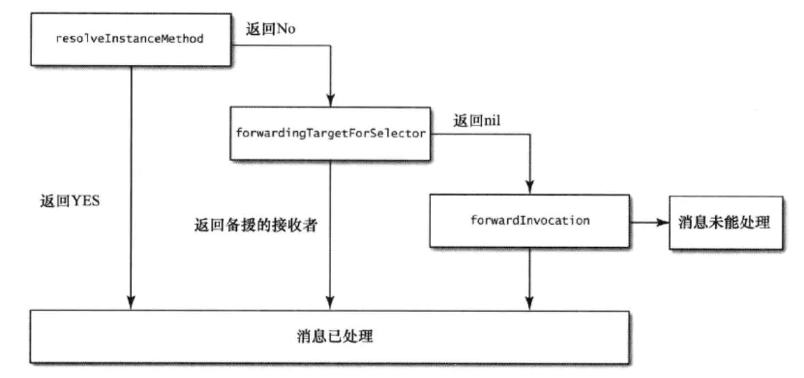

[runtime学习](https://www.jianshu.com/p/eac6ed137e06)

#### 从runtime开始实践Category添加属性与黑魔法method swizzling
##### 给分类添加关联对象Associated Object
如果我们想为系统的类添加一个方法可以采用分类的方式进行扩展，但是如果要添加一个属性，通常采用的方法就是继承，这样就比较繁琐了，如果不想去继承，那么就可以通过runtime来进行关联对象操作。

关于分类里为什么不能添加属性
- 分类的结构体里是没有保存成员变量的结构体的，而且方法可以运行时改变，但结构体不能运行时改变，类的内存大小在编译时是确定下来的，要想给分类添加一个属性，只能用关联对象的方式，而关联对象的本质是在类的定义之外为类增加额外的存储空间，是一层映射关系。

使用runtime的关联对象添加属性与我们自定义类时定义的属性其实是两个不同的概念，通过关联对象添加属性本质上是使用类别进行扩展，通过添加setter和getter方法从而在访问时可以使用点语法进行访问，在使用上与自定义类定义的属性没有区别。

关联对象具体使用到的C函数如下：
```Objective-c
//为一个实例对象添加一个关联对象，由于是C函数只能使用C字符串，这个key就是关联对象的名称，value为具体的关联对象的值，policy为关联对象策略，与我们自定义属性时设置的修饰符类似
void objc_setAssociatedObject(id object, const void *key, id value, objc_AssociationPolicy policy);
//通过key和实例对象获取关联对象的值
id objc_getAssociatedObject(id object, const void *key);
//删除实例对象的关联对象
void objc_removeAssociatedObjects(id object);
```
上面的三个方法分别为：设置关联对象，获取关联对象，删除关联对象。

而对于objc_AssociationPolicy，具体的定义如下：
```Objective-c
/**
 * Policies related to associative references.
 * These are options to objc_setAssociatedObject()
 */
typedef OBJC_ENUM(uintptr_t, objc_AssociationPolicy) {
    OBJC_ASSOCIATION_ASSIGN = 0,           /**< Specifies a weak reference to the associated object. */
    OBJC_ASSOCIATION_RETAIN_NONATOMIC = 1, /**< Specifies a strong reference to the associated object. 
                                            *   The association is not made atomically. */
    OBJC_ASSOCIATION_COPY_NONATOMIC = 3,   /**< Specifies that the associated object is copied. 
                                            *   The association is not made atomically. */
    OBJC_ASSOCIATION_RETAIN = 01401,       /**< Specifies a strong reference to the associated object.
                                            *   The association is made atomically. */
    OBJC_ASSOCIATION_COPY = 01403          /**< Specifies that the associated object is copied.
                                            *   The association is made atomically. */
};
```
这些关键词跟property的修饰符是很相似的。

举个🌰
```Objective-c
//给分类添加一个name的属性
#import "ViewController.h"

NS_ASSUME_NONNULL_BEGIN

@interface ViewController (Info)

@property (nonatomic, copy)NSString *name;

@end

NS_ASSUME_NONNULL_END

//使用关联对象来实现setter方法和getter方法
#import "ViewController+Info.h"
#import <objc/runtime.h>

@implementation ViewController (Info)

-(NSString *)name{
    return objc_getAssociatedObject(self, @"name");
}

-(void)setName:(NSString *)name{
    objc_setAssociatedObject(self, @"name", name,  OBJC_ASSOCIATION_COPY_NONATOMIC);
}

@end
```

##### 给对象添加关联对象
🌰
```Objective-c
    #import <objc/runtime.h> 
     
    static void *EOCMyAlertViewKey = "EOCMyAlertViewKey";  
     
    - (void)askUserAQuestion {  
        UIAlertView *alert = [[UIAlertViewalloc]  
                                 initWithTitle:@"Question"  
                                   message:@"What do you want to do?"  
                                      delegate:self  
                            cancelButtonTitle:@"Cancel"  
                            otherButtonTitles:@"Continue", nil];  
     
            void (^block)(NSInteger) = ^(NSInteger buttonIndex){  
              if (buttonIndex == 0) {  
                  [self doCancel];  
            } else {  
                [self doContinue];  
            }  
        };  
     
          objc_setAssociatedObject(alert,  
                                   EOCMyAlertViewKey,  
                                   block,  
                                   BJC_ASSOCIATION_COPY);  
     
          [alert show];  
    }  
     
    // UIAlertViewDelegate protocol method  
    - (void)alertView:(UIAlertView*)alertView  
            clickedButtonAtIndex:(NSInteger)buttonIndex  
    {  
        void (^block)(NSInteger) =  
            objc_getAssociatedObject(alertView, EOCMyAlertViewKey);  
        block(buttonIndex);  
    } 
    ```
    
##### 实例方法
```Objective-c
@interface Person : NSObject

@property (nonatomic, copy) NSString* name;
@property (nonatomic, assign) NSUInteger age;

- (instancetype)initWithName:(NSString*)name age:(NSUInteger)age;

- (void)showMyself;

- (void)helloWorld;

@end

@implementation Person

@synthesize name = _name;
@synthesize age = _age;

- (instancetype)initWithName:(NSString*)name age:(NSUInteger)age {
    if (self = [super init]) {
        self.name = name;
        self.age = age;
    }
    return self;
}

- (void)showMyself {
    NSLog(@"Hello World, My name is %@ I\'m %ld years old.", self.name, self.age);
}

- (void)helloWorld {
    NSLog(@"Hello World");
}

@end

int main(int argc, const char * argv[]) {
    @autoreleasepool {
        Person *p = [[Person alloc] initWithName:@"Jiaming Chen" age:22];
        [p showMyself];
        unsigned int count = 0;
        Method *methodList = class_copyMethodList([p class], &count);
        for (int i = 0; i < count; i++) {
            SEL s = method_getName(methodList[i]);
            NSLog(@"%@", NSStringFromSelector(s));
            if ([NSStringFromSelector(s) isEqualToString:@"helloWorld"]) {
                IMP imp = method_getImplementation(methodList[i]);
                imp();
            }
        }
    }
    return 0;
}
```
- MethodList里面存储的其实是类对象的方法列表，方法列表里面存储的是objc_method结构体，结构体里面有方法的名字，方法的具体实现，方法类型。

##### Method Swizzling
由于Foundation等框架都是闭源的，因此我们没有办法直接修改代码，通常情况下可以通过继承、类别、关联属性等手段添加属性或实例方法，但以上方式还是比较繁琐的，而接下来介绍的Method Swizzling是可以很方便地修改方法的实现。

Method Swizzling工作原理：
- 类对象的方法列表里存储的是每一个方法的结构体struct_objc_method
- 而在struct_objc_method里的成员变量imp是该方法的具体实现的函数入口
- 因此Method Swizzling的工作原理就是修改方法的imp指向，从而达到在闭源情况下修改函数的实现的目的

🌰
```Objective-c
int main(int argc, const char * argv[]) {
    @autoreleasepool {
        Person *p = [[Person alloc] initWithName:@"Jiaming Chen" age:22];
        Method method1 = class_getInstanceMethod([p class], @selector(helloWorld));
        Method method2 = class_getInstanceMethod([p class], @selector(showMyself));
        method_exchangeImplementations(method1, method2);
        
        [p showMyself];
        [p helloWorld];
    }
    return 0;
}
```
 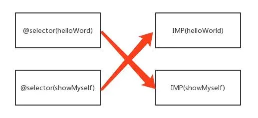

##### 注意🌟
- 我们一般会把实现方法交换的部分放在单例里，而且一般是在类的load方法里实现了方法交换。这样做的原因是：1.在类的load方法里实现，在mian函数之前就完成了方法交换。2.使用单例，这样可以保证方法只交换了一次。load方法是可以手动调用的，因此如果load被调用多次，没有实现单例，那么方法就会被多次交换。
- 当交换的两个方法不是在同一个类里面：比如将A类的a方法与B类的b方法进行imp交换。交换之后，当A的实例对象调用a方法其实是调用了B类的b方法，当B的实例对象调用了b方法其实是调用了A类的a方法；但是如果A的实例对象调用a方法，在执行b方法时，b方法里面有一条指令 ```objective -c [self b] ```那么，此时的self是A的实例对象，那么会存在类对象的方法列表里找不到b方法而发生crash。那么，解决办法就是：交换交换时，将要交换的方法添加到类对象的方法列表里，然后将a方法的imp替换为b的imp —— 调用class_replaceMethod方法。
- 当要交换的方法其实是没有实现的：函数只是单纯地声明了，没有实现，即没有imp；那么这种情况下，会出现递归调用出现死锁的情况。因为当在类对象的方法列表里添加了要交换的b方法后，将a方法的imp替换为b方法的imp，但是此时由于b的imp是不存在的，是nil，那么在class_replaceMethod方法调用时检测要imp为nil是直接return的，因此，就会出现递归调用，死锁。解决办法时：对要调换的方法先检测imp是否为nil，是的话手动添加一个不执行任何东西的imp，防止死锁；
- [三种特殊情况的学习🔗](https://www.jianshu.com/p/a6b951578140?utm_campaign=hugo&utm_medium=reader_share&utm_content=note&utm_source=weixin-friends)
[runtime学习](https://www.jianshu.com/p/e2c0c67d39ed)
    
### RunLoop
#### RunLoop概念
RunLoop顾名思义就叫做运行循环，是通过内部维护的事件循环来对事件/消息进行管理的一个对象。
它在程序运行时交替循环地做一些事，如果没有RunLoop，程序执行完毕就会立即退出，如果有RunLoop，程序会一直运行，并且随时响应用户的操作。在没有用户操作的时候就休眠，充分节省CPU资源，提高程序性能。

- 没有消息处理时，RunLoop休眠来避免资源占用，由用户态切换到内核态
> 系统中既有操作系统的程序，也有普通用户的程序。为了安全和稳定性，操作系统的程序不可以随便访问，这就是内核态。
> 内核态可以使用所有的硬件资源
> 用户态：不能直接使用系统资源，也不能改变CPU的工作状态，并且只能访问这个用户程序自己的存储空间。
- 有消息需要处理时，就会唤醒RunLoop，由内核态切换到用户态。

为什么main函数不会退出？
UIApplicationMain内部默认是开启了主线程的RunLoop，并执行了一段无限循环的代码。
UIApplicationMain函数一直没有返回，而是不断地接收处理消息以及等待休眠，所以运行程序之后会一直保持持续运行状态。

##### RunLoop的作用
1.保持程序的持续运行：iOS App启动时就会开启一个主线程，主线程默认开启RunLoop，保证主线程不会被销毁，也就保持了程序的持续运行。
2.处理App中各种事件，如触摸事件，定时器事件，Selector事件，网络请求，线程之间的通信，界面刷新，AutoreleasePool释放对象等
3.节省CPU资源，提高程序性能

##### RunLoop的数据结构
RunLoop相关的主要涉及五个类
- CFRunLoop：RunLoop对象
- CFRunLoopMode：运行模式
- CFRunLoopSource：输入源/事件源
- CFRunLoopTimer：定时源
- CFRunLoopObserver：观察者

1.CFRunLoop
RunLoop对象跟线程是一一对应的，主线程是默认开启RunLoop的，但是子线程默认是不会开启RunLoop的

2.CFRunLoopMode
由name，source0，source1，observers，times组成

3.CFRunLoopSource
分为Source0 和 Source1两种
- Source0
即非基于port的，也就是用户触发的事件以及PerformSelectors方法的调用。需要手动唤醒线程
- Source1
基于port的线程间的通信，能主动唤醒RunLoop

4.CFRunLoopTimer
基于时间的触发器，基本上可以说就是NSTimer，在预设的时间点唤醒RunLoop执行回调。因为它是基于RunLoop的，因此它是不准时的。（如果线程当前正在处理繁重的任务，就有可能导致Timer本次延时，或者少执行一次）

5.CFRunLoopObserver
监听相关的时间点：比如RunLoop启动，即将处理Timer事件，即将处理Source事件等

6.各数据结构之间的联系
RunLoop和线程是一一对应的，一个RunLoop可以对应多个Mode，一个Mode对应着Source0、Source1、Timer、Observer
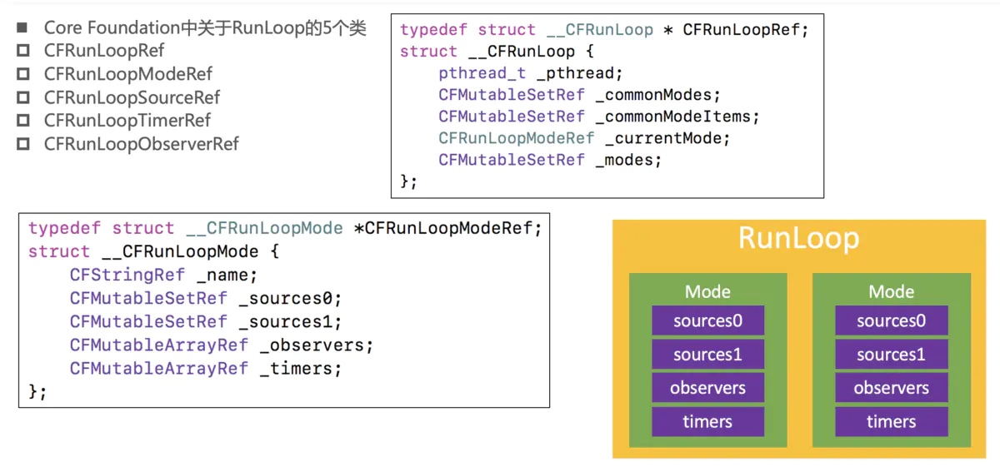

当RunLoop运行在Mode1上时，是无法接受处理Mode2或Mode3上的Source0、Source1、timer、Observer事件的，要先退出Loop，重新切换Mode才能处理别的Mode上的事件。

总共有五种Mode
- kCFRunLoopDefaultMode：默认模式，主线程是在这个运行模式下运行

- UITrackingRunLoopMode：跟踪用户交互事件（用于 ScrollView 追踪触摸滑动，保证界面滑动时不受其他Mode影响）

- UIInitializationRunLoopMode：在刚启动App时第进入的第一个 Mode，启动完成后就不再使用

- GSEventReceiveRunLoopMode：接受系统内部事件，通常用不到

- kCFRunLoopCommonModes：伪模式，不是一种真正的运行模式，是同步Source/Timer/Observer到多个Mode中的一种解决方案

##### RunLoop的实现机制
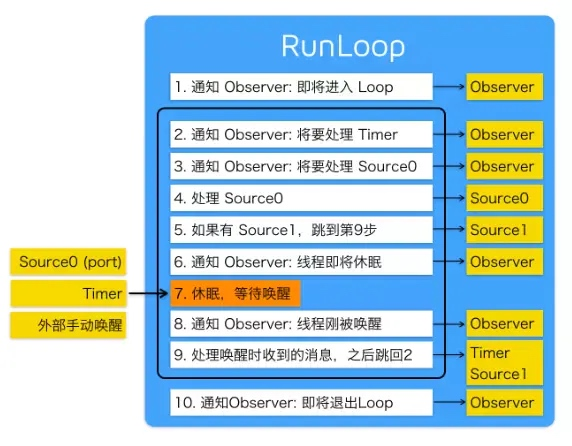

RunLoop最核心的事情是保证线程在没有消息的时候休眠，在有消息的时候唤醒线程，提高了程序的性能。

##### RunLoop与NSTimer
一个比较常见的问题，滑动tableView时，NSTimer还会不会生效？
默认情况下RunLoop是运行在kCFRunLoopDefaultMode下的，而当滑动tableView时，RunLoop切换到UITrackingRunLoopMode，而在UITrackingRunLoopMode模式下，就无法接受处理NSTimer的事件了。

解决办法就是将NSTimer同时添加到UITrackingRunLoopMode和kCFRunLoopDefaultMode下
而同时添加到多个Mode上就要用到NSRunLoopCommonModes了
```Objective-c
[[NSRunLoop currentRunLoop] addTimer:timer forMode:NSRunLoopCommonModes];
```
Timer被添加到多个Mode上，这样切换Mode时也不会影响Timer接收事件

##### RunLoop和线程
- RunLoop和线程是一一对应的，其映射关系是保存在一个全局的NSDictionary里的
- 自己创建的线程默认是不会开启RunLoop的

为子线程创建RunLoop的条件
- 调用[NSRunLoop currentRunLoop] 这个方法第一次调用时是会自动去创建一个RunLoop的
- 给RunLoop添加item（source或timer等）来维持事件循环
- 开启RunLoop

🌰
```Objective-c
 NSLog(@"1");

dispatch_async(dispatch_get_global_queue(0, 0), ^{
    
    NSLog(@"2");

    [self performSelector:@selector(test) withObject:nil afterDelay:10];
    
    NSLog(@"3");
});

NSLog(@"4");

- (void)test
{
    
    NSLog(@"5");
}
```
输出顺序是：1423
afterDelay默认是创建一个定时器，但是当前线程没有开启RunLoop，因此该定时器是不起作用的。

如果改成
```Objective-c
dispatch_async(dispatch_get_global_queue(0, 0), ^{
        
        NSLog(@"2");
        
        [[NSRunLoop currentRunLoop] run];
        
        [self performSelector:@selector(test) withObject:nil afterDelay:10];
  
        NSLog(@"3");
    });
```
这样test方法还是不会调用的，因此开启线程时，RunLoop里并没有item去维持事件循环，那么RunLoop还是会退出，定时器也是不起作用。

正确做法是：
```Objective-c
dispatch_async(dispatch_get_global_queue(0, 0), ^{
        
        NSLog(@"2");
        
        [self performSelector:@selector(test) withObject:nil afterDelay:10];
        
        [[NSRunLoop currentRunLoop] run];
  
        NSLog(@"3");
    });
```

## 证书与发布管理
### 签名原理
iOS的签名挺复杂的，涉及到很多东西，比如各种证书，Provisioning Profile，entitlements，CertificateSigningRequest，p12，AppID，概念一堆，也很容易出错。因此，接下来从原理出发，一步一步地去了解整个过程。

#### 目的
在iOS出来之前，在当时的主流系统（MAC/Windows/Linux）上开发和运行软件是不需要签名的，这样就会导致软件从哪里都可以下载，平台对第三方软件很难控制，盗版流行。因此，苹果希望解决这样的问题，在iOS平台对第三方App有绝对的控制权，一定要保证每一个安装到iOS上的App都是经过苹果官方允许的，那么是通过什么去保证的呢？那就是签名机制。

#### 非对称加密
在了解签名原理前，我们先了解一下非对称加密。
通常我们说的签名都是数字签名，数字签名是基于非对称加密算法实现的。对称加密是通过同一份密钥加密数据和解密数据，而非对称加密则有两份密钥，分别是公钥和私钥，用公钥进行加密，则要用私钥进行解密，用私钥进行加密，则要用公钥进行解密。

简单说一下常用的非对称加密算法RSA的数学原理，理解一下非对称加密是怎么做到的，为什么是安全的。
- 选两个质数p和q，p和q相乘得出一个大整数n
- 在1到n之间随便再选一个质数e
- 然后经过一系列数学公式，算出一个数字d，满足：
    - 通过n和e可以对一组数据进行一系列的数学运算之后，可以用n和d去对加密后的数据进行解密
    - 如果只知道n和e，要推出d，需要知道p和q，也就是说将n进行拆解。

上述的（n，e）这两个数据在一起就是公钥，而（n，d）这两个数据在一起就是私钥，用公钥去加密数据，用私钥去解密数据，反过来，则用私钥去加密数据，用公钥去解密数据。单纯地讲公钥（n，e）暴露出去，要推出私钥（n，d）是非常难的，需要将大整数n进行因式分解，目前因式分解只有暴力穷举，因此当n非常大时，拆分是非常难的，因此可以说非对称加密是很安全的。

#### 数字签名
数字签名的作用是我对某一份数据打个标记，表示我已经认可这份数据了，然后我发送给了其他人，其他人可以知道这份数据是经过我认证的。
有了上述的非对称加密算法，就可以实现数字签名这个需求：
  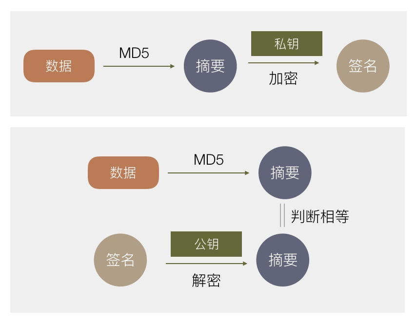
- 首先利用一种算法（这里的是MD5），将原始数据进行摘要
- 生成一份非对称加密的公钥和私钥，私钥自己留着，公钥发送给用户
- 对一份数据，算出摘要之后，用私钥进行加密，得到一份加密后的数据，称为原始数据的签名，然后将原始数据跟签名一起发送给用户
- 用户收到原始数据和签名之后，首先用公钥对签名进行解密，得到摘要，然后用相同的算法将原始数据进行摘要，然后比对这两份摘要看是否相等，相等则说明这两份数据在传送过程中没有被篡改过。

之所以第一步要计算摘要，是因此非对称加密的原理限制可加密的内容不能太大。

好了现在，我们已经了解到了非对称加密，以及怎么使用非对称加密对原始数据进行加密得到数字签名，接下来我们来了解一下苹果是怎么通过签名机制来保证每一个安装到iOS上的App都是经过苹果允许的。

#### 最简单的签名
要实现这个需求很简单，最直接的方式，苹果🍎官方生成一对公私钥，在iOS系统内置一个公钥，而私钥则保留在苹果后台，开发者上传App到AppStore时，苹果后台会用私钥对App数据进行签名，而用户下载App时，iOS系统会利用公钥去验证这个签名，若签名正确，这个App肯定是经过苹果后台认证的，并且没有被修改过的，也就达到了苹果的需求：保证安装的每一个App都是经过苹果官方允许的。
  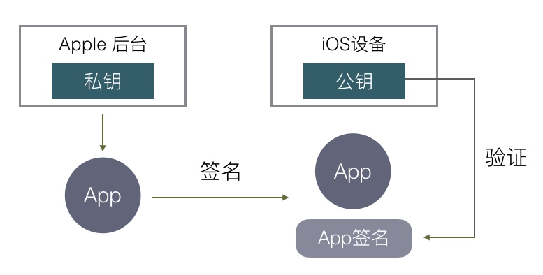
如果我们的iOS设备安装App只有从AppStore下载这一种方式之后，这件事就结束了，没有任何复杂的东西，就只有一个数字签名，非常的简单。

但实际上除了从AppStore下载，还有三种方式可以下载App
1.开发App时可以直接把开发中的应用安装到手机进行测试
2.In-House企业内部分发，可以直接安装企业证书签名后的App
3.AD-Hoc相当于企业分发的限制版，限制安装设备数量，比较少用

#### 新的需求
先看第一个，开发时安装App，它有两个需求：
    1.安装包不需要上传到苹果服务器，可以直接安装到手机上，如果你编译一个App到手机上要先将安装包传到苹果服务器签名，这显然是不能接受的
    2.苹果必须对这里的安装有控制权
        a.经过苹果允许才可以这样安装
        b.不能被滥用导致非开发App也能安装到手机上
        
为了实现上面这些需求，iOS签名复杂度也就开始增加了。
苹果这里给出的方案是使用双层签名，流程大概是这样的：
  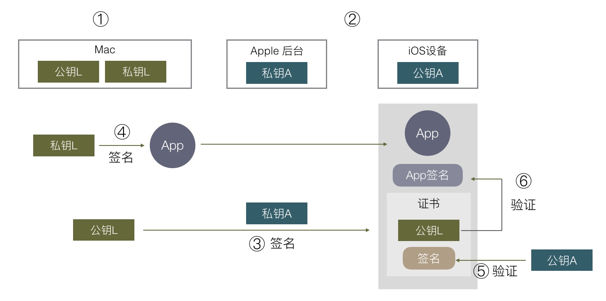
- 在开发者的Mac电脑上生成一对公私钥，这里称公钥L、私钥L
- 苹果有自己固定的一对公私钥，公钥内置在iOS系统中，私钥由苹果后台保存，这里称公钥A、私钥A
- 把公钥L传到苹果后台，用苹果后台的私钥A对公钥L进行签名，会得到一份包含公钥L和签名的数据，我们这里称为证书
- 在开发时，编译完一个App之后，用本地的私钥L对App进行签名，同时将上一步获取到的证书一起打包进App里，安装到手机上
- 在安装时，iOS系统会自动去获取该App的证书，用公钥A对证书的签名进行验证，验证完公钥L是经过苹果认证之后，拿公钥L去验证App签名，这就可以验证该App是否经过苹果官方允许的（这里只验证App是经过苹果官方允许的，不会去验证内容是否被篡改过，因为开发过程中App内容总是在改变，因此苹果不需要管这个）

#### 进一步需求
上述流程只是解决了上面的第一个需求，即验证App是经过苹果官方允许的，还没解决第二个被滥用的问题，怎么解决呢？苹果对此再加上了两个限制，一是在苹果后台注册过的设备才可以安装，二是限制签名只能针对某一个具体的App。

具体怎么加呢？在上述第三步中，苹果用私钥A签名我们本地的公钥L时，实际上除了前面公钥L时，还可以加上无限多的数据，这些数据都可以保证是经过苹果官方验证的，不可能被篡改的。
  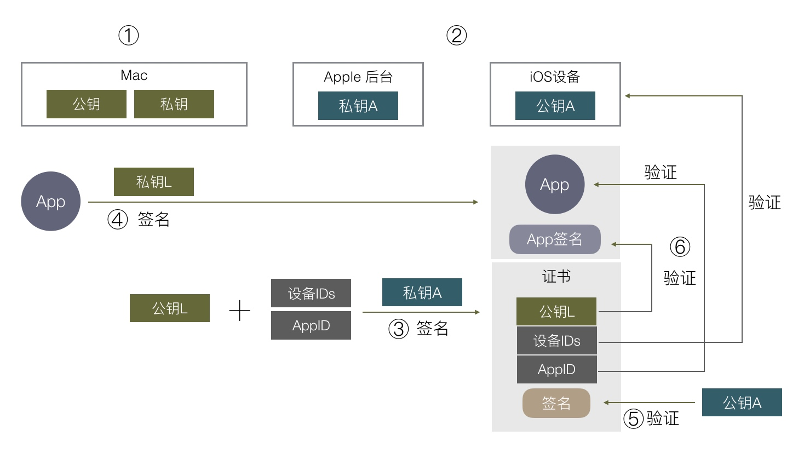
可以想到把允许安装的设备ID列表和App对应的AppID等数据，都在第三步这里跟公钥L及其签名一起组成证书，再用苹果内置的私钥A对这个证书签名，在最后验证时就可以拿到设备ID列表，去判断当前设备是否符合要求。根据数字签名的原理，只要数字签名通过验证，那么设备IDs/AppID/公钥L都是经过苹果认证的，无法被修改，苹果就可以限制可安装的设备和App，避免被滥用。

#### 最终流程
到这里这个证书已经变得非常复杂了，有很多额外的信息，实际上除了设备ID/AppID，还有其他信息也需要在这里用苹果签名，像这个App里的ICloud/push/后台运行等权限苹果都想控制，苹果把这些权限开关称为Entitlements，它也需要通过签名去授权。

实际上一个证书本来就有规定的格式规范，上面我们把各种额外的信息塞进证书其实是不合适的，于是苹果搞了另外的一个东西，叫做Provisioning Profile，一个Provisioning Profile就包含证书以及上面说的各种额外信息，以及所有信息的签名。

  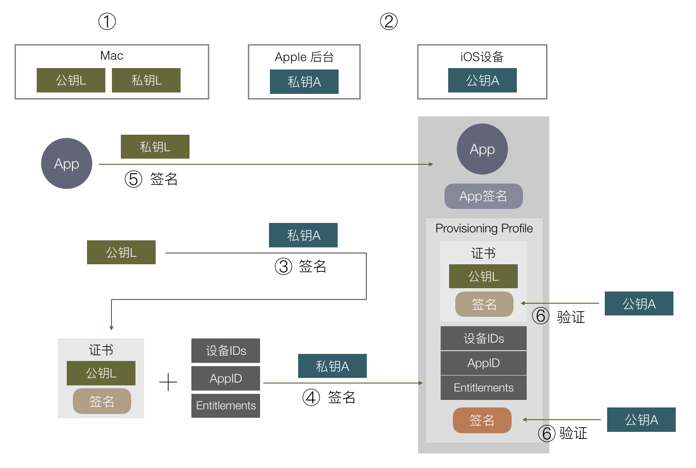
根据上图，我们重新列一下整个流程：
1.在开发者电脑生成一对公私钥，这里称公钥L，私钥L
2.苹果自己有固定的一对公私钥，这里称为公钥A，私钥A，公钥A内置在iOS系统中，私钥A由苹果后台管理
3.把公钥L传到苹果后台，苹果后台用私钥A对公钥L进行签名，得到一份数据包含公钥L及其签名，这里称这份数据为证书
4.在苹果后台申请AppID，配置好设备ID列表和App可使用的权限，再加上第三步得到的证书组成的数据用私钥A签名，把数据和签名一起组成Provisioning Profile文件，下载到开发者的本机
5.在开发时，编译完一个App后，用本地的私钥L对这个App签名，同时把第4步得到Provisioning Profile文件打包进App里，文件名为embedded.mobileprovision，把App安装到手机上
6.在安装时，iOS系统取得证书，通过系统内置的公钥A去验证embedded.mobileprovision里的签名是否正确
7.确保embedded.mobileprovision里的数据都是经过苹果授权之后，就可以取出里面的数据，做各种验证，包括用公钥L验证App签名，验证设备ID是否在ID列表上，AppID是否对应得上，权限开关是否跟App里的entitlements对应等。

#### 概念和操作
对于上面的概念。整合成操作如下：
1.第1步对应的是keychain里的“从证书颁发机构请求证书“，这就在Mac本地生成一对公私钥，保存的CertificateSigningRequest就是公钥，私钥保存在电脑里。
2.第2步是苹果处理的，不用管
3.第3步把对应的CertificateSigningRequest传到苹果后台生成证书，并下载到本地，此时本地有两个证书，第一个是第1步生成的，第二个是刚下载的。当在Xcode选择刚下载回来的证书时，实际上会自动到keychain里找到对应的私钥去签名，这里的私钥只有生成它的Mac电脑有，如果别的Mac也要编译签名这个App，那么就要讲私钥导出来给其他Mac使用。在keychain里导私钥，就会存成.12文件，其他Mac打开后就导入了这个私钥。
4.第4步是在苹果网上上操作，配置AppID/权限/设备ID等，最后下载成Provisioning Profile文件
5.第5步，Xcode会通过第3步下载回来的证书，在本地找到对应的私钥，用本地私钥对App进行签名，并把Provisioning Profile文件命名为embedded.mobileprovision一起打包进去。
6.第6-7步的打包和验证就是Xcode和iOS系统自动做的事。

总结一下概念：
- 证书：内容就是公钥或者私钥，由其他机构对其签名组成的数据包
- Entitlements：包含App权限开关列表
- CertificateSigningRequest：本地公钥
- p12：本地私钥，可以导入到其他电脑
- Provisioning Profile：包含了证书/Entitlements等数据的数据，由苹果后台私钥签名成的数据包

#### 其他发布方式
前面以开发包为例子说了签名和验证的流程，另外两种In-House企业签名和AD-Hoc流程也是差不多的，只是企业签名不限制安装的设备数，另外需要用户在iOS系统设置上手动点击信任这个企业才能通过验证。

而AppStore的签名验证方式有些不一样，前面我们说到最简单的签名方式，苹果在后台直接用私钥签名App就可以了，实际上苹果确实是这样做的，如果去下载一个AppStore的安装包，会发现它里面是没有embedded.mobileprovision文件的，也就是它安装和启动的流程是不依赖这个文件的，验证流程也就跟上述几种类型不一样。

据猜测，因为上传到AppStore的包苹果会重新对内容进行加密，原来的本地私钥签名已经没有用了，需要重新签名，从AppStore下载的包苹果也并不打算控制它的有效期，不需要内置一个embedded.mobileprovision去做校验，直接在苹果的后台用私钥重新签名，iOS安装时用本地公钥验证App签名就可以了。

那为什么发布到AppStore的包还是要跟开发版一样搞各种证书和Proviosioning Profile？猜测因为苹果想做统一管理，Provisioning Profile里包含一些权限控制，AppID的校验等，苹果不想在上传到AppStore包时重新用另一种协议做一遍这些验证，那倒不如统一将这些部分放到Provisioning Profile里，上传AppStore时只要用同样的流程验证这个Provisioning Profile是否合法就可以了。

所以App上传到AppStore后，就跟证书/Provisioning Profile无关了，无论他们是否过期或被废弃，都不会影响AppStore上的安装包。

[iOS签名学习](http://wereadteam.github.io/2017/03/13/Signature/)


## 优化
### App的启动优化
本文是利用二进制重排来实现App的启动优化。在了解二进制重排之前，先了解一下虚拟内存与物理内存。
** 虚拟内存与物理内存 **
- 起初，在还没出现虚拟内存时，进程的数据都是直接加载到内存里面的，这会出现安全问题以及效率问题。安全问题就是：进程通过偏移量可以获取到别的进程的数据；效率问题就是：把应用的数据一次性加载到内存里面，其实很多东西还没用上，没必要一开始就把全部加载进去。
- 虚拟内存的出现就可以大大解决上述两个问题。每个进程都会被分配一个虚拟的内存空间，进程就会以为自己有很大一段的内存空间，实际上这个内存地址就是一个虚拟地址，而这个虚拟地址通过映射表可以映射到物理内存上。
- 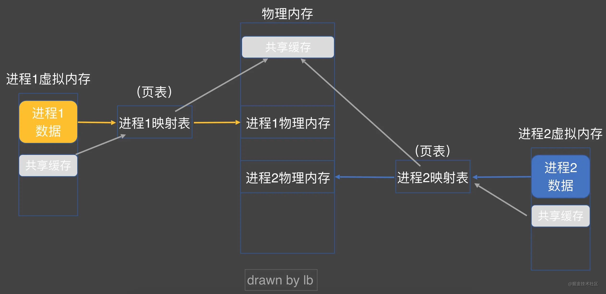
- 虚拟内存跟物理内存是通过映射表进行映射的，但映射并不是一一对应的，这样的话很浪费内存，实际上虚拟内存和物理内存都是分页的，映射是以页为单位的。
- 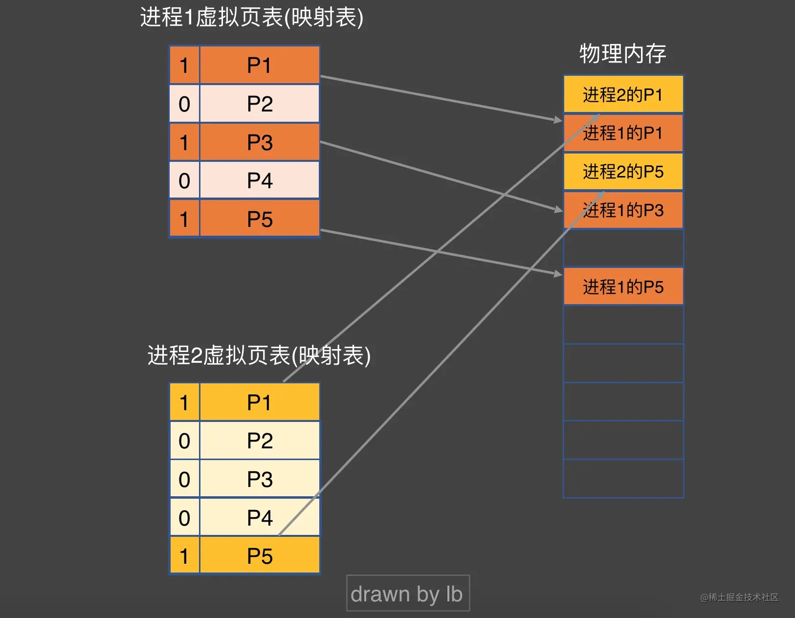
- 当应用被加载到内存中时，并不会将整个应用都加载进去，只是将用到的那部分加载进去。
- 当应用访问到某个地址时，映射表为0则表示还没加载进入内存的，系统就会立刻阻塞整个进程，触发缺页中断，将虚拟内存当前页加载进物理内存上。
- 当一个缺页中断被触发时，操作系统会从磁盘中重新读取这页数据进入物理内存，然后将映射表中虚拟内存指向对应的真实内存（如果此时真实内存满了，那么就会通过置换算法来将某一页数据替换掉）。

** 二进制重排 **
- 在了解缺页中断会阻塞进程后，我们就知道缺页中断（Page Fault）是相当影响性能的。
- 实际上在iOS系统中，对于生产环境的应用，当产生缺页中断进行重新加载时，iOS系统还会对其做一次签名验证，因此iOS生产环境的应用Page Fault所产生的耗时会更多。

** 二进制重排优化原理 **
假设在启动时期我们需要调用两个函数 method1 与 method4 . 函数编译在 mach-o 中的位置是根据 ld ( Xcode 的链接器) 的编译顺序并非调用顺序来的 . 因此很可能这两个函数分布在不同的内存页上 .
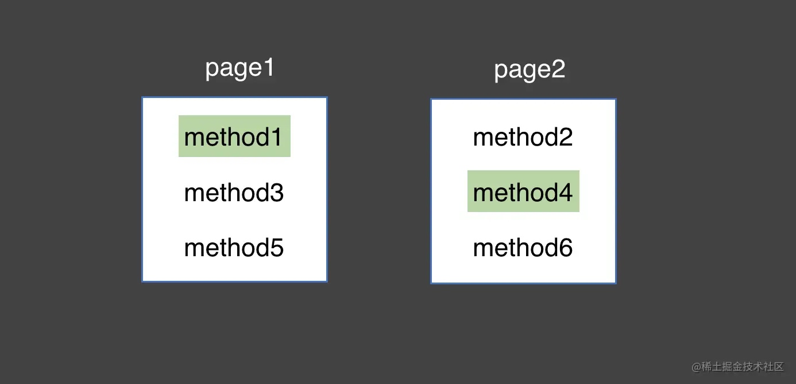
那么启动时 , page1 与 page2 则都需要从无到有加载到物理内存中 , 从而触发两次 page fault .
而二进制重排的做法就是将 method1 与 method4 放到一个内存页中 , 那么启动时则只需要加载 page1 即可 , 也就是只触发一次 page fault , 达到优化目的 .
实际项目中的做法是将启动时需要调用的函数放到一起  ( 比如 前10页中 )  以尽可能减少 page fault , 达到优化目的 . 而这个做法就叫做 : 二进制重排 .

- App在启动时：其实是在执行编译链接好的Mach-o文件。而Mach-o文件中的函数位置其实是编译顺序确定的而并非调用顺序，这就说明如果启动所需要的方法都排在了后面的页，那么就会触发很多次的Page Fault。而本文的思想就是将启动所需要的函数都放在了Mach-o文件的最前面，那么就会减少很多Page Fault的触发。

** 二进制重排的操作 **
- Xcode在编译链接时，会将工程里的所有文件合并成一个大的Mach-o文件，而Mach-o文件里的函数顺序是根据编译器的编译顺序来决定的。
- Xcode用的链接器叫做ld，ld有一个参数叫做order File，我们可以通过在Xcode里配置order File的路径，那么Xcode在编译链接时，就会去读取这个路径下的文件，然后根据文件中的符号顺序去生成对应的Mach-o文件。
- 二进制重排的重点就是在于：找到启动App时所需要的符号，然后将符号写进order File里，然后就交给Xcode去读取文件内容，生成对应的Mach-o文件。

** 查看工程运行的符号顺序 **
- 重排前后，我们需要查看自己的符号顺序有没有修改成功，那么这时候就要用到Link Map。
- Link Map是编译期间产生的产物，ld读取二进制文件的顺序默认是按照compile sources的顺序的，Link Map刚好记录了二进制文件的布局。
- 在工程文件中的Products - show in Finder，然后找出txt文件
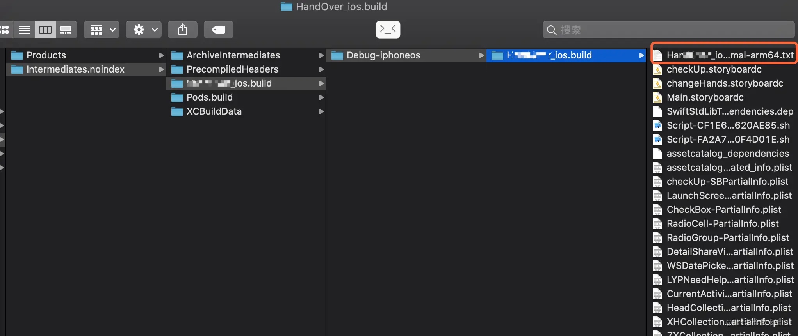
- 上述txt文件就是记录着所有符号的顺序, 在 # Symbols: 部分。可以看到 , 这个符号顺序明显是按照 Compile Sources 的文件顺序来排列的 .

** 获取启动加载所有函数的符号 **
- hook objc_MsgSend 可以扫描到oc以及swift @objc dynamic的方法，但是不完全。
- clang插桩 - 可以完美地拿到oc，c，swift中的所有方法。

静态clang插桩：
> 实际上就是在编译期对每一个函数内部二进制源数据添加hook代码来实现全局的方法hook效果。
> 在每一个函数开始后首先运行hook代码，我们知道，在函数里面跳转到子函数中时，会将下一条指令的位置记录在寄存器上面，当子函数执行完之后，就会去寄存器读取下一条指令的地址。
> 那么我们就可以在hook代码里面获取下一条指令的地址，然后根据这个地址获取当前函数的符号，这样我们就可以获取到启动App时所用到的全部符号了。
> 将收集到的符号记录下来，然后全部写在工程的order File文件上，其实到这，已经实现了二进制重排的效果了。

[学习入口1🔗](https://juejin.cn/post/6844904130406793224#heading-10)
[学习入口2🔗](https://www.jianshu.com/p/d724ebff917b)
[代码验证](/Users/macbookpro/SDAutolayoutLRN)

## Runtime对于类结构的优化
### 旧版的类结构
1.实例对象本质都是一个结构体objc_object,在结构体里面只有一个isa指针
```C
struct objc_object {
    Class _Nonnull isa  OBJC_ISA_AVAILABILITY;
};
```
2.isa指针指向实例对象所属的类对象objc_class，可以看出，类对象其实也是一个结构体struct。在objc_class里面主要包含了成员变量、方法列表以及协议列表，而属性则存储在old_class_ext结构体里。
```C
struct old_class_ext {
    uint32_t size;
    const uint8_t *weak_ivar_layout;
    struct old_property_list **propertyLists;
};
```
3.而类对象的isa指向了元类，元类跟类对象的结构体是类似的，包含了成员变量、类方法列表、以及协议列表，而属性应该也是存储在old_class_ext上。

### runtime优化后的类的结构
1.类的实例对象本质上是一个结构体objc_object，结构体里面是一个isa指针，指向它的类对象。

2.类对象本质上也是一个结构体objc_class，由于新版的objc_class是继承于objc_object的，所以类对象也是也是有一个isa指针的，指向元类，而元类的isa指针就会指向根元类。

3.objc_class主要包含8个字节的isa指针，8个字节的cache，16个字节的bits，获取class_rw_t结构体指针的方法，以及很多方法。
    - isa指针：指向类对象所属的元类
    - 结构体cache_t：结构体里面是方法的缓存；当查找一个对象的方法时，首先会通过isa指针找到它的类对象，然后通过字节偏移找到结构体cache_t，然后在cache里面查找是否有缓存；没有的话再通过字节偏移找到class_rw_t，再去查找此方法，当找到后，首先会将这个方法加入到缓存里面。
    - 结构体class_data_bits_t：bits的作用其实也可以看作是一个地址，通过调用bits.data()方法可以获取到class_rw_t结构体
```C
struct objc_class : objc_object {
    // Class ISA;
    Class superclass;
    cache_t cache;             // formerly cache pointer and vtable
    class_data_bits_t bits;    // class_rw_t * plus custom rr/alloc flags

    class_rw_t *data() const {
        return bits.data();
    }
}
```

4.结构体class_rw_t：结构体里面的主要属性如下
```C++
struct class_rw_t {
    // Be warned that Symbolication knows the layout of this structure.
    uint32_t flags;
    uint16_t witness;
#if SUPPORT_INDEXED_ISA
    uint16_t index;
#endif
//explicit_atomic相当于C++的atomic操作，为了保证线程安全
    explicit_atomic<uintptr_t> ro_or_rw_ext;
//firstSubclass和nextSiblingClass主要用于遍历当前使用的所有类
    Class firstSubclass;
    Class nextSiblingClass;
//PointerUnion 表明：ro_or_rw_ext_t 只能是class_rw_ext_t * 或者是 class_ro_t *类型的
    private:
    using ro_or_rw_ext_t = objc::PointerUnion<const class_ro_t *, class_rw_ext_t *>;
```

#### 成员变量ro_or_rw_ext
1.成员变量ro_or_rw_ext是一个原子类型数据，存储着class_rw_ext_t或class_ro_t指针。
2.结构体class_rw_t里的方法主要分为三类：
    1.对成员变量的一些操作，包括数据更新、清除操作
    2.对成员变量ro_or_rw_ext的创建、存、取操作；
        - 创建时会将class_ro_t中的方法、属性、协议列表都添加到class_rw_ext_t结构体对应的列表上
3.通过成员变量ro_or_rw_ext获取方法、属性、协议列表
    1.在取方法、属性、协议列表数据时，先获取成员变量ro_or_rw_ext，判断其类型是class_rw_ext_t还是class_ro_t，然后在对应的列表中取出数据。

### class_rw_ext_t
数据结构如下
```C
struct class_rw_ext_t {
    DECLARE_AUTHED_PTR_TEMPLATE(class_ro_t)
    class_ro_t_authed_ptr<const class_ro_t> ro;
    method_array_t methods;
    property_array_t properties;
    protocol_array_t protocols;
    char *demangledName;
    uint32_t version;
};
```
这里存储的数据有方法、属性、协议列表，是一些可动态变更的列表，以及指向class_ro_t的ro，没有额外的方法。

### class_ro_t
1.在objc源码中，我们可以发现结构体class_ro_t都是被** const **修饰符修饰的，这说明结构体class_ro_t是不可变的；
2.可以看出，结构体里面主要的成员变量有：方法列表、协议列表、属性列表以及成员变量。
3.class_ro_t 结构体其实是在编译链接期间就被创建出来了。ro表示是readonly，只是可读的，保持了类的原始信息。
4.class_rw_t 结构体是在初始化runtime后被创建出来的，class_rw_t是可读写的，可以对当前类动态添加属性、方法、协议，但其实大多数类用不到动态添加，并且class_ro_t已经有原始数据了，所以将class_rw_t中的这些数据放在了class_rw_ext_t结构体上，当该类没有动态添加方法、属性、协议时，class_rw_ext_t结构体就不会被创建，从而做到减少内存开销。
```C++
struct class_ro_t {
    uint32_t flags;
    uint32_t instanceStart;
    uint32_t instanceSize;
#ifdef __LP64__
    uint32_t reserved;
#endif

    const uint8_t * ivarLayout;
    
    const char * name;
    method_list_t * baseMethodList;
    protocol_list_t * baseProtocols;
    const ivar_list_t * ivars;

    const uint8_t * weakIvarLayout;
    property_list_t *baseProperties;
```

### 三者的关系 class_rw_t、class_ro_t、class_rw_ext_t
** 不使用class_rw_ext_t **
成员变量ro_or_rw_ext直接指向class_ro_t，可以减少class_rw_ext_t结构体的内存开销
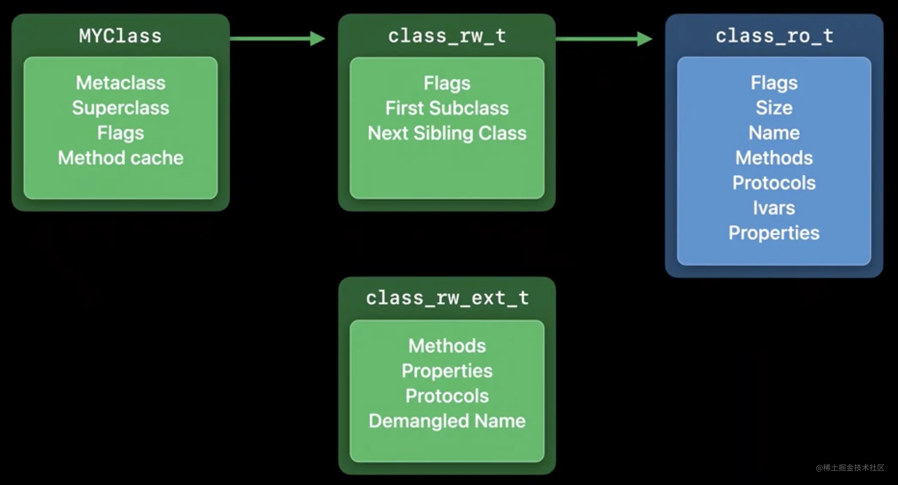

** 使用class_rw_ext_t **
class_rw_t成员变量ro_or_rw_ext指向class_rw_ext_t,class_rw_ext_t指向class_ro_t
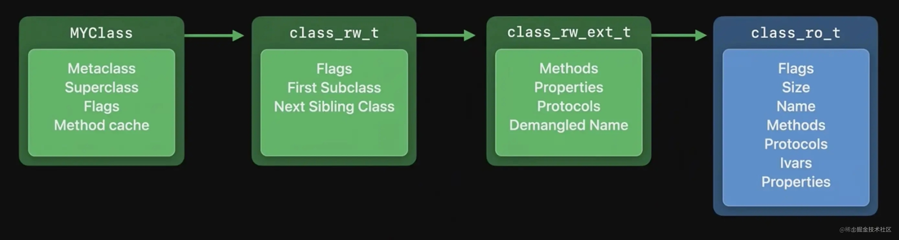

### class_rw_ext_t创建条件
class_rw_ext_t是通过extAllocIfNeeded()方法创建的。
- 动态添加属性
- 动态添加方法
- 动态添加协议
- 当前类存在类别
- 给类设置版本

### class_rw_ext_t 与 class_ro_t 数据差别
- 两个结构体的方法列表、属性列表以及协议列表的区别其实都是一样的。
- 在class_rw_ext_t结构体中方法列表使用的是method_array_t,这是继承了list_array_tt的数据，里面会存储method_list_t；而class_ro_t中存储方法列表使用的是method_list_t；这是一个普通数组，在通过class_rw_t::extAlloc创建class_rw_ext_t结构体时，会使用attachLists方法进行方法列表添加，此时会使用method_array_t中的list指针指向method_list_t，如果在进行方法添加（包括动态添加、类别方法）则会启用二维数组的方式进行存储。
- 当该类有分类，以及分类上有方法时，那么就会创建class_rw_ext_t结构体，在结构体的方法列表上添加分类的方法，然后再将class_ro_t中的方法列表复制过来，因此就会出现，当分类跟类有相同的方法时，会调用分类的方法。

[学习链接🔗1](https://juejin.cn/post/7013577397060501511)
[学习链接🔗2](https://juejin.cn/post/7011905166484078629/#heading-20)
[学习链接🔗3](https://www.jianshu.com/p/b876fbbfe8aa)
[学习链接🔗4](https://juejin.cn/post/6846687597478019079)

## 分类不能添加属性解析
分类是不可以添加属性的，可以添加方法。但是分类也可以通过关联对象来实现添加属性。
- 分类底层是一个结构体：struct category_t;结构体里包含分类的名字，所属的类，实例方法列表，类方法列表，协议，实例属性以及类属性。
- 虽然结构体里面是有属性的，但是我们在分类里用@property声明属性时，只是会将该属性添加到属性列表里，但是不会自动生成对应的setter方法、getter方法和带下划线的成员变量。

``` C++
struct category_t {
    const char *name;
    classref_t cls;
    struct method_list_t *instanceMethods;
    struct method_list_t *classMethods;
    struct protocol_list_t *protocols;
    struct property_list_t *instanceProperties;
    // Fields below this point are not always present on disk.
    struct property_list_t *_classProperties;

    method_list_t *methodsForMeta(bool isMeta) {
        if (isMeta) return classMethods;
        else return instanceMethods;
    }

    property_list_t *propertiesForMeta(bool isMeta, struct header_info *hi);
    
    protocol_list_t *protocolsForMeta(bool isMeta) {
        if (isMeta) return nullptr;
        else return protocols;
    }
};
```
### 分类加载到类
在编译时，分类和类的信息都会加载到结构体里面；在runtime初始化后，会将分类的信息加载到类的信息里面；以方法为例：分类方法列表里的方法会加载到类的方法列表里，会将类的方法列表数组进行扩容，将类的方法移数组的后面，将分类的方法添加到数组的前面。因此，当分类的方法跟类的方法同名时，是会首先调用分类的方法的。而如果多个分类有同名的方法，那么调用的会是最后一个加载的分类方法。

### 对于分类不能添加属性的看法
- @property声明 = setter方法 + getter方法 + 成员变量；当类被加载时，类的信息会存放在class_ro_t结构体上，该结构体是有方法列表，属性列表，协议列表以及成员变量列表，而且该结构体的信息是不可修改的，存放在内存的clean memory里的；当runtime初始化后，会初始化class_rw_t结构体，结构体里有一个指针指向class_ro_t，当有动态添加方法时，会创建class_rw_ext_t结构体，class_rw_ext_t结构体里同样有方法列表、属性列表以及协议列表，那么class_rw_t结构体指向class_rw_ext_t,class_rw_ext_t指向class_ro_t。
- 从上面可以得知，class_ro_t里的信息是不可修改的，而且成员变量列表只会存在于class_ro_t结构体里，那么成员变量列表是不可以动态添加的。因此，在编译时，类的内存布局已经确定好了（class_ro_t结构体不可再被修改）,分类添加属性会破坏到类的内存布局，因此分类是不可以添加属性的。
- 那分类为什么可以添加方法呢？因为分类的方法是添加在class_rw_ext_t结构体上的，该结构体是存放在dirty memory上的，不是在class_ro_t结构体上，是可以被修改的，因此分类是可以添加方法的。