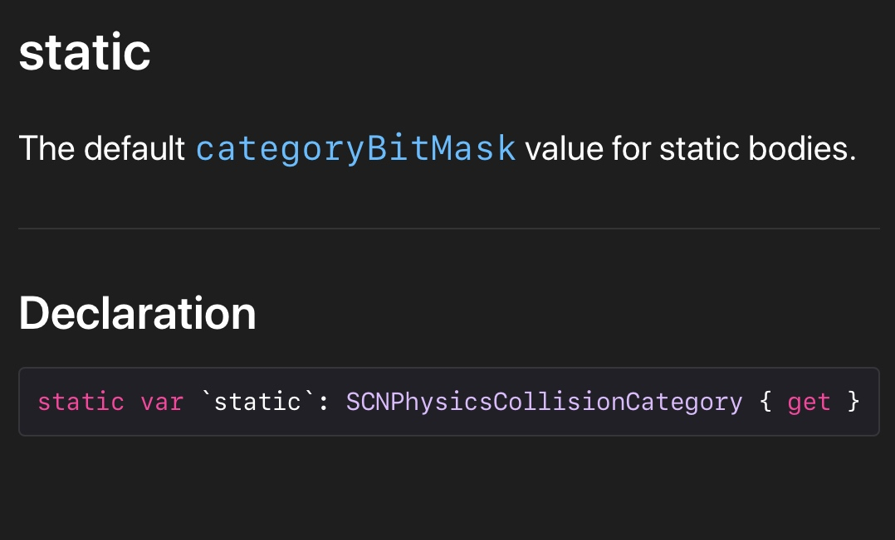

# swift学习
[TOC]
## as类型转换符
as类型转换符包括as，as？，as！
- as是向上转型

```swift
class Class {
    
}
class person:Class {
    
}
var test1:person = person()
let test2 = test1 as Class //将test1向上转换为Class类型然后赋值给了test2
```

- as？和 as！是向下类型转换：as？向下类型转换之后返回的是一个可选值，转型失败则会返回nil，而as！向下类型转换如果失败会直接crash

```swift
class Class {
    
}
class person:Class {
    
}
var test1:Class = person()
let test2 = test1 as? person
let test3 = test1 as! person
```

## ??符号
？？ 为swift的空合并运算符
a ?? b 
a要是可选项，b可以是可选项，也可以不是可选项
a 和 b 的存储类型要一样
当a为nil时，就会返回b
当a不为nil时，就会返回a
如果b不是可选项，返回a时会自动解包

## Foundation框架
swift新建的文件默认都导入了UIKit框架，而UIKit框架里导入了Foundation框架

## 关于import
在swift中是不需要import自己在工程中创建的文件的，相反如果import了自己创建的文件，就会提示报错。
而如果引入的是由cocoaPods导入的第三方库，那么就需要用到import，比如我导入了SDWebImage这个框架，那么如果在文件中用到，就要import SDWebImage。

## 实例方法和类方法
OC中有实例方法和类方法，swift中也有实例方法和类方法
OC中用+表示类方法，用-表示实例方法
swift中有class / static 来表示类方法
```swift
//用了class修饰fileExist标明fileExist是一个类方法
    class func fileExist(fileNmae: String) -> Bool {
        guard fileNmae.count != 0 else {
            return false
        }
        return FileManager.default.fileExists(atPath: fileNmae)
    }
```

## 懒加载
swift中的懒加载标志符为lazy，懒加载实际上执行的是一个闭包
swift中闭包的表达形式为
```swift
{ (parameters) -> return type in
    statements
}
```
懒加载🌰
```swift
//后面那部分其实相当是一个闭包
    lazy var session:URLSession = {
        let sessionConfiguration = URLSessionConfiguration.default
        let session:URLSession = URLSession(configuration: sessionConfiguration, delegate: self, delegateQueue: .main)
        return session
    }()
//将上述代码进行转换，可以明显看出其实懒加载执行的就是一个闭包
    let blk = { () -> URLSession in
        let sessionConfiguration = URLSessionConfiguration.default
        let session:URLSession = URLSession(configuration: sessionConfiguration, delegate:nil, delegateQueue: .main)
        return session
    }
    lazy var session = blk()
```

## @escaping
@escaping标记的闭包称为逃逸闭包，逃逸闭包的意思是在函数执行完之后再去调用这个闭包，比如一个函数的一个completionHandler参数是闭包，在OC中，是在函数结束之后调用这个闭包，而在swift中，出于性能的考虑，闭包的调用是在函数结束之后调用的（其实可以理解为将闭包放在一个异步线程下执行）

## throw
swift中有一些api是要求做好异常处理的，否则就会有以下警告
```swift
 Call can throw, but it is not marked with 'try' and the error is not handled
```
解决办法🌟
```swift
//将try放在有可能会抛出异常的api前面，比如下面代码中的attributesOfItem
//不能放在赋值语句前面，因为赋值语句没有规定要抛出异常
        do {
            let dict =  try  FileManager.default.attributesOfItem(atPath: filePath)
            return dict[FileAttributeKey.size] as! CLongLong
        } catch  {
            print(error)
        }
```

## isKind isMember
isKind 用来判断是不是当前指定类或者指定类的子类的对象
isMMember 用来判断是不是当前指定类的对象

## filter
swift中的过滤函数，可以将数组中的元素按照某种规则进行一次过滤。
```swift
func filter(_ isIncluded: (String) throws -> Bool) rethrows -> [String]
```
[filter学习](https://www.jianshu.com/p/1a4ad590a900)

## reduce 
reduce:对数组元素进行计算
```swift
//第一个参数是Result的初始值
//第二个参数是(Result, Int)中的Int表示数组元素
func reduce<Result>(_ initialResult: Result, _ nextPartialResult: (Result, Int) throws -> Result) rethrows -> Result
```
[reduce学习](https://www.jianshu.com/p/1a4ad590a900)
## $0 
swift自动为闭包提供参数名缩写功能，可以直接用$0,$1等来表示闭包中的第一个第二个参数，并且对应的参数类型会根据函数类型来进行判断。

## rethrows
这个函数的类型是 （）throws -> Void
```swift
func test() throws {
    
}
```
()throws -> Void 和 () -> Void 是两种不同的类型，但是()throws -> Void可以兼容() -> Void，带上throws标记只是表明可能抛出异常，有可能抛出异常的可能性为0（其实就相当于转化成了() -> Void类型）

execute函数里的参数colsure是throws -> Void类型的，在函数内部调用该闭包时前面要加上try关键字。而对于抛出异常，则有两种选择：第一是由方法亲自处理；第二是将异常继续向上抛出，由调用者考虑处理或继续抛出。

下面是采用了向上抛出的处理，因此函数execute带上了throws的标记
```swift
func execute(_ closure: () throws -> Void) throws {
    try closure()
}
```

由于execute(_ :) 有throws标记，调用它时也需要try关键字
```swift
do {
    try execute(dangerousFunc)
} catch {
    // ...
}
```

由于() throws -> Void可以兼容() -> Void的情况，因此当传入的参数闭包可以是不需要抛出异常的。
```swift
//这样的话明明传入的参数safeFunc不需要抛出异常，但还是做好了异常处理
func safeFunc() {
    // Do nothing
}

do {
    try execute(safeFunc)
} catch {
    // ...
}
```

那么解决办法是🌟 - 利用rethrows关键字
```swift
func execute(_ closure: () throws -> Void) rethrows {
    try closure()
}
```
我们可以直接调用，而不需要用 try，因为 Swift 知道你传入的是不带 throws 的闭包：
```swift
// * for dangerous func:
do {
    try execute(dangerousFunc)
} catch {
    // ...
}

// ......
// * for safe func
execute(safeFunc)
```
[rethrows学习](https://zhuanlan.zhihu.com/p/155855695)

## 将String转换为Array
```swift
var str = "12"
print(Array(str))
```

## String可以直接进行比较
```swift
var str = "12"
for i in str {
    if i > "1" {
        print(1)
    }
}
```

## switch的写法
```swift
var index = 0
switch index {
    case 0:
        print(1)
    default:
        print(2)
}
```

## 数组添加另一个数组
两种方法
1.result.append(contentsOf: array)
2.result += array

## 关于 == 和 === 
== 默认是比较两个对象的引用地址，不过具体还是要看对象所属的类遵循的Equatable协议的具体实现方法
=== 这是直接比较两个对象的引用地址，不看Equatable协议的具体实现

## static
看文档解释：static 是用来修饰静态实体的


## Array.reduce的高阶用法
```swift
var array = [1,2]
let str:String = array.reduce("") { (str, i) -> String in
    return str + String(i) //输出字符串"12"
}
```
文档解释
```swift
func reduce<Result>(Result, (Result, Element) -> Result) -> Result
//返回根据闭包限定的规则对数组元素进行组合的结果
Returns the result of combining the elements of the sequence using the given closure.
```

## 字典values转成数组的用法
Array(dict.values) - 转换后的数组元素的顺序是不确定的。

## 对于自定义类实现 == 函数
``` swift
    extension TreeNode:Equatable {
        public static func == (n1:TreeNode, n2:TreeNode) ->Bool {
            return n1 === n2
        }
    }
```

