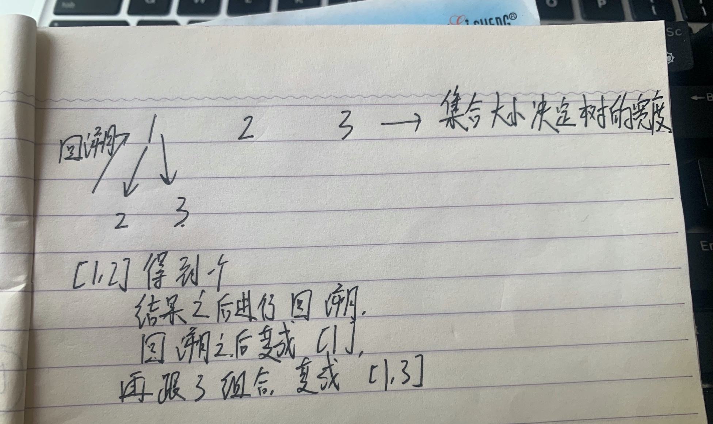
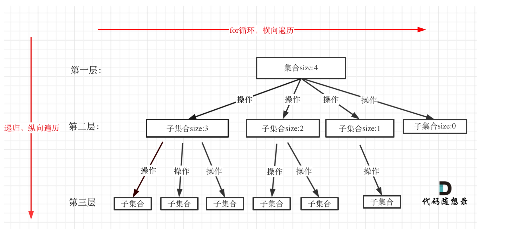
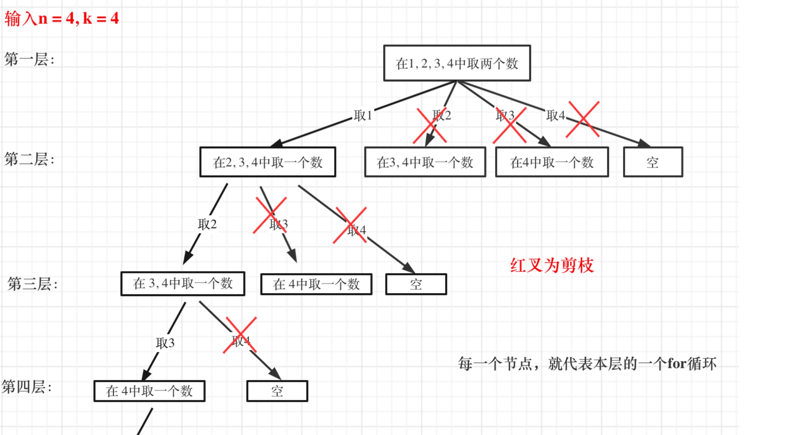
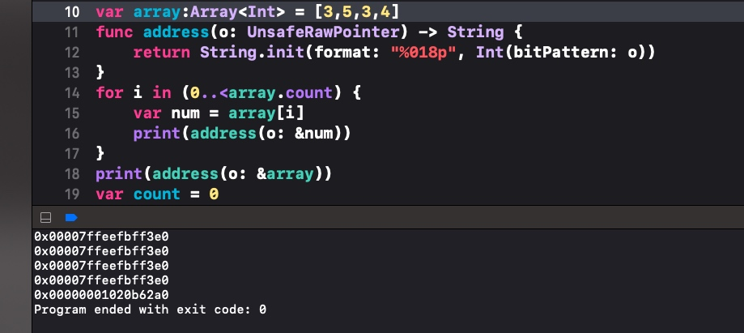
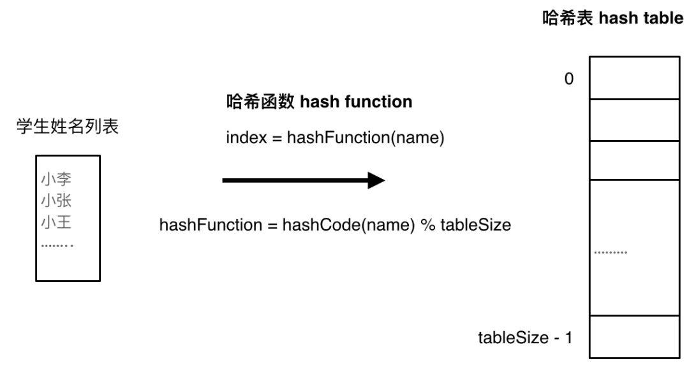
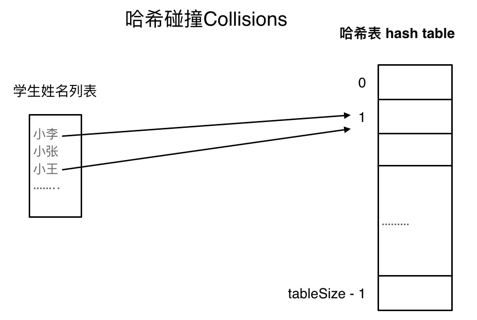
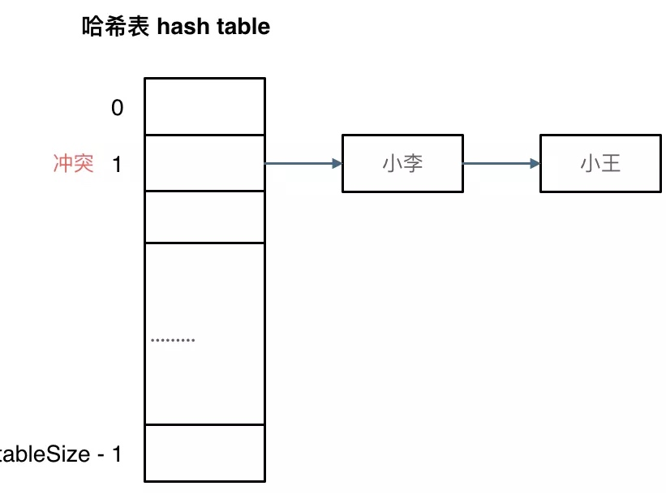
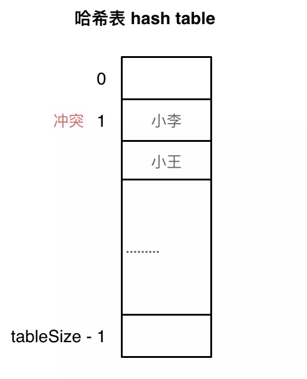

# 算法
[TOC]

## 整除
若整数b除以非零整数a，商为整数，余数为0，那么我们就可以称为b能被a整除（或说a整除b），b是被除数，a是除数。

## 动态规划
常见的问题有：
- 动规基础
- 背包问题
- 打家劫舍
- 股票问题
- 子序列问题

解题方法：
- dp数组以及下标的含义
- 递推公式
- dp数组如何初始化
- 遍历顺序
- 打印dp数组

[动态规划详细学习]([「代码随想录」动态规划专题精讲（v1.2）](media/16287800652806/%E3%80%8C%E4%BB%A3%E7%A0%81%E9%9A%8F%E6%83%B3%E5%BD%95%E3%80%8D%E5%8A%A8%E6%80%81%E8%A7%84%E5%88%92%E4%B8%93%E9%A2%98%E7%B2%BE%E8%AE%B2%EF%BC%88v1.2%EF%BC%89.pdf)

## 回溯法
回溯法也可以叫做回溯搜索法，它是一种搜索的方式。
回溯和递归是相辅相成的，回溯是递归的副产品，只要有递归就会有回溯。

回溯法其实是纯暴力搜索，它的本质是穷举，穷举所有可能，然后选出我们想要的答案，因此它并不是什么高效的算法。

那既然回溯法并不是高效的算法，那为什么还要使用它呢？

因为对于一些问题，能暴力解出来已经很不错了。

那是什么问题？只能暴力求解呢？
- 组合问题：N个数里面按一定规则找出k个数的集合
- 排列问题：N个数按一定规则全排列，有几种排列方式
- 切割问题：一个字符串按一定规则有几种切割方式
- 棋盘问题：N皇后，解数独等等
- 子集问题：一个N个数的集合里有多少符合条件的子集

那怎么理解回溯算法呢？
其实我们可以将回溯算法抽象地理解为树形结构，回溯法解决的都是在集合中递归查找子集，集合的大小就决定了树的宽度，而递归的深度就决定了树的高度。

递归是要有终止条件的，所以必然是一棵高度有限的N叉树。

举个🌰：
在组合问题中，在[1,2,3]集合中找出两个数的集合


回溯法的模版
在回溯算法中，一般命名的模版是backtracking

- 回溯算法的终止条件：
我们将回溯算法理解成了抽象的树形结构，那么算法的终止条件就应该是到达了树的叶子结点，将叶子结点的信息保存起来，结束本层递归。

- 回溯算法的遍历过程：
回溯算法一般是在集合中递归搜索中，集合的大小构成了树的宽度，递归的深度构成了树的高度。

伪代码：
```Objective-c
for (选择：本层集合中元素（树中节点孩⼦的数量就是集合的⼤⼩）) {
处理节点;
 backtracking(路径，选择列表); // 递归
回溯，撤销处理结果
}
```
for循环就是遍历集合区间，可以理解为一个节点有多少个子节点，就遍历多少次。
从图中可以看出，for循环可以理解为横向遍历，backtracking可以理解为纵向遍历，这样就把这棵树遍历完了，通常，搜索叶子节点就是找的其中一个结果了。

综上所述：
回溯算法的模版为：
```Objective-c
void backtracking(参数) {
 if (终⽌条件) {
存放结果;
 return;
 }
 for (选择：本层集合中元素（树中节点孩⼦的数量就是集合的⼤⼩）) {
处理节点;
 backtracking(路径，选择列表); // 递归
回溯，撤销处理结果
 }
}
```

尽管回溯法是暴力搜索，但是它也有可优化的空间，那就是对上述的算法进行剪枝优化。
举个🌰：
当n=4，k=4时，第二层的取2开始遍历是没有意义的，这种就需要去剪枝，从而达到优化的效果。


那么怎样去剪枝呢？
我们知道横向遍历的是树的宽度，这是有集合的个数决定的，也就是for循环里面的条件决定的。
因此，我们进行剪枝的操作是要在for循环里进行操作，去限制i可增的最大空间。
进一步解析：
要获取的结果的集合里元素的个数是k，而path数组保存的是已经获取到的元素
那么k-path.count就得出还要获取的元素个数A，
假如n=4，A=2，那么startIndex最多可以从3开始，那么startIndex <= (n-A+1)
```C
for (int i = startIndex; i <= n - (k - path.size()) + 1; i++) // i为本次搜索的起始位置
```
优化后整体代码如下：
```C++
private:
 vector<vector<int>> result;
 vector<int> path;
 void backtracking(int n, int k, int startIndex) {
 if (path.size() == k) {
 result.push_back(path);
 return;
 }
 for (int i = startIndex; i <= n - (k - path.size()) + 1; i++) { // 优化
的地⽅
 path.push_back(i); // 处理节点
 backtracking(n, k, i + 1);
 path.pop_back(); // 回溯，撤销处理的节点
 }
 }
```
[回溯算法学习]([「代码随想录」回溯算法精讲（v1.1）](media/16287800652806/%E3%80%8C%E4%BB%A3%E7%A0%81%E9%9A%8F%E6%83%B3%E5%BD%95%E3%80%8D%E5%9B%9E%E6%BA%AF%E7%AE%97%E6%B3%95%E7%B2%BE%E8%AE%B2%EF%BC%88v1.1%EF%BC%89.pdf)

## 数组
### 数组的简单了解
- 数组是存放在连续内存空间上的相同类型数据的集合
- 数组可以方便的通过下标索引的方式获取下标对应的数据
- 数组下标都是从0开始的
- 数组内存空间的地址是连续的
- swift上的数组底层实现其实是一个结构体对象，通过输出数组的地址以及数组元素的地址可以发现：数组中每个元素的地址都是一样的，而数组的地址跟数组首元素的地址是不一样的，那么我理解是：结构体里面是专门有一个容器专门存储数组元素的，而元素的地址其实就是该容器的地址


### 二分法
[704题目链接](https://leetcode-cn.com/problems/binary-search/)

这道题的前提是数组为有序数组，同时题目还强调数组中无重复元素，因为一旦有重复元素，使用二分查找法返回的元素下标可能不是唯一的，这些都是使用二分法的前提条件，当我们看到题目描述满足如上条件的时候，那就可以考虑一下是不是该用二分法。

二分查找涉及的很多的边界条件，逻辑比较简单，但就是写不好。例如到底是 while(left < right) 还是 while(left <= right)，到底是right = middle呢，还是要right = middle - 1呢？

我们在写二分法经常写乱，主要是因为对区间的定义没有想清楚，区间的定义就是不变量。要在二分查找的过程中，保持不变量。要在二分查找的过程中，保持不变量，就是在while寻找中每一次边界的处理都要坚持根据区间的定义来操作，这就是循环不变量规则。

写二分法，区间的定义一般分为两种，左闭右闭即[left,right],或者左闭右开即[left,right)。

下面将介绍两种不同的写法

第一种写法：
我们定义的target是在一个左闭右闭的区间里，也就是[left,right]（这个区间的定义是非常重要的）

区间的定义就决定了二分法的代码应该如何写，因为target定义在[left,right]区间，所以就有如下两个特点：
- while(left <= right)要使用<= ,因为区间是左闭右闭的，left == right是有意义的
- if (nums[middle] > target) right 要复制 middle - 1，因为当前这个nums[middle]一定不是target，那么接下来要查找的左区间结束下标位置就是middle - 1

第二种写法：
我们定义的target是在一个左闭右开的区间里，也就是[left,right)，那么二分法的边界处理方式则截然不同。
- while(left < right) 这里使用<，因为left == right在区间[left,right)是没有意义的
- if (nums[middle] > target) right 更新为 middle，因为当前nums[middle]不等于target，要在左区间继续寻找，而寻找的区间是左闭右开类型，所以right更新为middle，即：下一个查询区间不会去比较nums[middle]

#### 总结🌟
二分查找法是很基础的算法，前提条件是我们熟悉二分查找法。

二分查找法有两个前提条件
- 数组元素是有序的
- 数组里没有重复元素

二分查找法主要是对区间的定义要理解清楚。不同的区间定义对应不同的代码。

区间的定义就是不变量，在循环中坚持根据查找区间的定义来做边界处理，就是循环不变量规则。

## 链表
链表是一种通过指针串联在一起的线性结构。
通常链表分为三种类型
- 单链表
- 双链表：每一个节点有两个指针域，一个指向下一个节点，一个指向上一个节点。
- 循环链表

数组在内存中是连续分布的，但链表在内存中不是连续分布的，节点是散乱分布在内存中的某地址上的，分配的机制取决于操作系统的内存管理。

对于链表的题：操作方式一般有两种
- 直接使用原来的链表来进行操作
- 设置一个虚拟头节点再进行操作

## 哈希表
哈希表 - Hash table
** 哈希表是根据关键码的值而直接进行访问的数据结构 **
 举个例子：
 swift中的数组，字典和集合 其实都是哈表表的数据结构
 如果希望元素是有序的，而且可以重复添加的就使用数组
 而字典和集合都是无序的，如果要表示元素出现的次数那么就使用字典。
 
 ** 哈希函数 **
 哈希函数的作用是 将关键码映射到表上。
 比如下面的例子：将学生的名字直接映射到哈希表上。
 

** 哈希碰撞 **
在映射过程中，难免会出现哈希碰撞。
哈希碰撞可以理解为：两个或以上的元素同时映射到表中的同一项。


而解决哈希碰撞就有以下两种方法：
1.链表法
2.线性法

** 链表法 **


** 线形法 **
既然 表中待映射到的项已经被占有了，那么就寻找下一个空缺的位置去存放。


** 哈希结构的数组会比字典的速度快 **
数组是直接通过下标访问元素的，拿到下标 就已经知道内存位置 ，直接访问。
字典是通过关键码访问元素的，得知关键码之后，还要进行地址映射才能访问到表中的元素。
综上，数组的访问速度比字典的会更加的快。