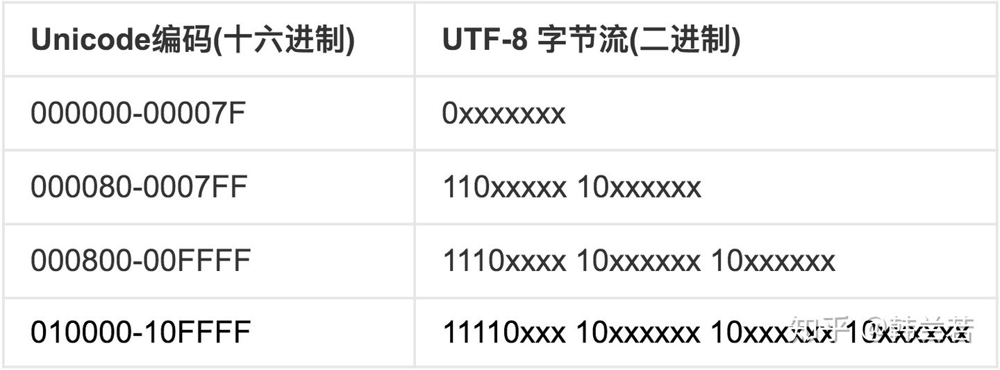

# 计算机基础知识
[TOC]

## arm架构和x86架构
ARM架构是一个32位的精简指令集处理器架构，其广泛地使用在许多嵌入式系统设计，由于节能的特点，ARM处理器非常适用于移动通讯领域，符合其主要设计目标为低耗电的特性。
所以，一句总结下来：ARM架构的最大特点就是节能，功耗低。

目前的PC架构绝大多数都是Intel的X86架构。x86架构是微处理器执行的计算机语言指令集。x86架构上有很多“桥”进行连接外设等，所有x86架构相对比与ARM架构的可扩展性会更好。

两者的区别🌟
1.性能方面
> x86架构的电脑一般比ARM结构的电脑在性能方面会更加优秀。x86架构的CPU一般都是在1G以上、双核、四核，而ARM方面：CPU一般是几百兆

2.扩展能力
> x86架构的电脑采用“桥”的方式与扩展设备如（硬盘等）进行连接，而且x86架构的出现事件已经近30年了，其配套扩展的设备种类多，价格也比较便宜
> ARM架构的电脑是通过**专用的数据接口**使CPU与数据存储设备进行连接，所以ARM的存储、内存等性能扩展难以进行，所以采用ARM架构的系统，一般不考虑扩展。基本奉行“够用就好”的原则。

3.操作系统的兼容性
> x86系统由微软及Intel构建的Wintel联盟一统天下，垄断了个人电脑操作系统近30年，形成了巨大的用户群，而且x86系统在硬件和软件开发方面已经形成统一的标准。
> ARM系统几乎都采用Linux的操作系统，与其他系统不能兼容，这也导致其应用软件不能方便移植，这一点严重制约了ARM系统的发展和应用。

4.软件开发的方便性及可使用工具的多样性
> x86架构推行之久，已经有很多配套使用的第三方软件可选择使用，而ARM架构由于硬件以及操作系统的制约，能配套使用的第三方软件相对来说就少很多

5.功耗
x86架构的电脑由于要适应各种应用的需求，因此它追求到的是“性能+速度”，因此x86架构的电脑开销就会变得非常得大，而ARM架构采用RISC流水线指令集，在完成综合性工作方面就处于劣势，而在一些任务相对固定的应用场合其优势就能发挥得淋漓尽致，因此ARM架构在功耗方面有着x86架构无可比拟的优势，也正是此，越来越多的智能手机、平板电脑在使用ARM架构。

而最新款的M1电脑就是ARM架构，也是这个架构的问题，M1电脑很多软件都不适配，而且会出现很多问题。

## 显卡的分类
显卡的主要作用是将CPU提供的指令和数据进行相应的处理转换成显示器能够接受的文字或者图像，因此显卡在图像渲染方面是有很大的作用的，而GPU是在显卡里面的。

目前显卡有三种类型：独显，核显，集显。
核显：显卡集成在CPU上，有两个核心，一个是cpu核心，一个是显卡核心，由于CPU本身地方小，还集成了一个显卡，因此性能相对来说会弱于独显。

独显：顾名思义：独立显卡。显卡独立于CPU，性能会更加强大。

集显：显卡集成在主板上。苹果最新推出的M1芯片的macBook，显卡就是集显，而且CPU和显卡都可以访问内存，这样就不同通过CPU读取内存的数据，再把数据送进显卡，速度会更加的块。

## CPU的速度
目前的双核、四核主要说的是CPU里的核心处理器的数量，但并不是说核心处理器越多，性能就会越好，比如四核的CPU不一定比双核的CPU要快，CPU的执行速度是由主频决定的，主频越高，执行的速度就会越快。

## git配置
git 有两种通信方式 ： https 和 ssh
https 一般是要做好网站证书的信任工作
ssh 就是要在自己电脑本地生成一对公私钥，公钥填进gitlab上，私钥保留在电脑本地，用于远程登录传递信息验证的。

## 生成可执行文件的四个步骤：
预处理 -> 编译 -> 汇编 -> 链接
- 预处理：将宏替换到对应的位置并删除宏定义，删除注释，条件优化等；将程序转换为预处理文件。
- 编译：将预处理后的程序转换为汇编代码。
- 汇编：将汇编代码转换为机器码。这一步叫产生目标文件，是二进制格式。
- 链接：将工程文件里面的其他目标文件链接起来，生成可执行文件。

## Unicode 和 UTF-8 的区别
在了解Unicode 和 UTF-8 的区别之前，先了解一些基础知识。
### 字符集
在计算机系统中，所有的数据都以二进制存储，所有的运算也以二进制表示，人类语言和符号也需要转化成二进制的形式，才能存储在计算机中，于是需要有一个从人类语言到二进制编码的映射表。这个映射表就叫做字符集。

### ASCII
最早的字符集叫 American Standard Code for Information Interchange（美国信息交换标准代码），简称 ASCII，由 American National Standard Institute（美国国家标准协会）制定。在ASCII 字符集中，字母 A 对应的字符编码是 65，转换成二进制是 0100 0001，由于二进制表示比较长，通常使用十六进制 41。

### GB2312、GBK
ASCII 字符集总共规定了 128 种字符规范，但是并没有涵盖西文字母之外的字符，当需要计算机显示存储中文的时候，就需要一种对中文进行编码的字符集，GB 2312 就是解决中文编码的字符集，由国家标准委员会发布。同时考虑到中文语境中往往也需要使用西文字母，GB 2312 也实现了对 ASCII 的向下兼容，原理是西文字母使用和 ASCII 中相同的代码，但是 GB 2312 只涵盖了 6000 多个汉字，还有很多没有包含在其中，所以又出现了 GBK 和 GB 18030，两种字符集都是在 GB 2312 的基础上进行了扩展。

### Unicode
可以看到，光是简体中文，就先后出现了至少三种字符集，繁体中文方面也有 BIG5 等字符集，几乎每种语言都需要有一个自己的字符集，每个字符集使用了自己的编码规则，往往互不兼容。同一个字符在不同字符集下的字符代码不同，这使得跨语言交流的过程中双方必须要使用相同的字符编码才能不出现乱码的情况。为了解决传统字符编码的局限性，Unicode 诞生了，Unicoide 的全称是 Universal Multiple-Octet Coded Character Set（通用多八位字符集，简称 UCS）。Unicode 在一个字符集中包含了世界上所有文字和符号，统一编码，来终结不同编码产生乱码的问题。

### 字符编码 UTF-8
Unicode 统一了所有字符的编码，是一个 Character Set，也就是字符集，字符集只是给所有的字符一个唯一编号，但是却没有规定如何存储，一个编号为 65 的字符，只需要一个字节就可以存下，但是编号 40657 的字符需要两个字节的空间才可以装下，而更靠后的字符可能会需要三个甚至四个字节的空间。

这时，用什么规则存储 Unicode 字符就成了关键，我们可以规定，一个字符使用四个字节存储，也就是 32 位，这样就能涵盖现有 Unicode 包含的所有字符，这种编码方式叫做 UTF-32（UTF 是 UCS Transformation Format 的缩写）。UTF-32 的规则虽然简单，但是缺陷也很明显，假设使用 UTF-32 和 ASCII 分别对一个只有西文字母的文档编码，前者需要花费的空间是后者的四倍（ASCII 每个字符只需要一个字节存储）。

在存储和网络传输中，通常使用更为节省空间的变长编码方式 UTF-8，UTF-8 代表 8 位一组表示 Unicode 字符的格式，使用 1 - 4 个字节来表示字符。

==所以，总的来说UTF-8是指可变长的编码格式==

UTF-8的特点是对不同范围的字符使用不同长度的编码。

上表表示如何从一个从Unicode 转化到UTF-8 , 对于前0x7F的字符，UTF-8编码和ASCII码是一一对应的。如果一个字符在000800-00FFFF 之间，那转化到UTF-8 需要用三字节模板，使用16个码位，每个x 就是一个码位。

比如『汉』这个字的Unicode编码是0x6C49。0x6C49在0x0800-0xFFFF之间，使用3字节模板：1110xxxx 10xxxxxx 10xxxxxx。将0x6C49写成二进制是：0110 1100 0100 1001， 用这个比特流依次代替模板中的x，得到：11100110 10110001 10001001。

[学习链接🔗](https://zhuanlan.zhihu.com/p/137875615)
[学习链接🔗](https://zhuanlan.zhihu.com/p/51828216)