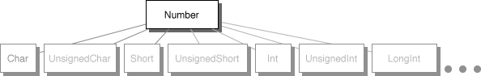
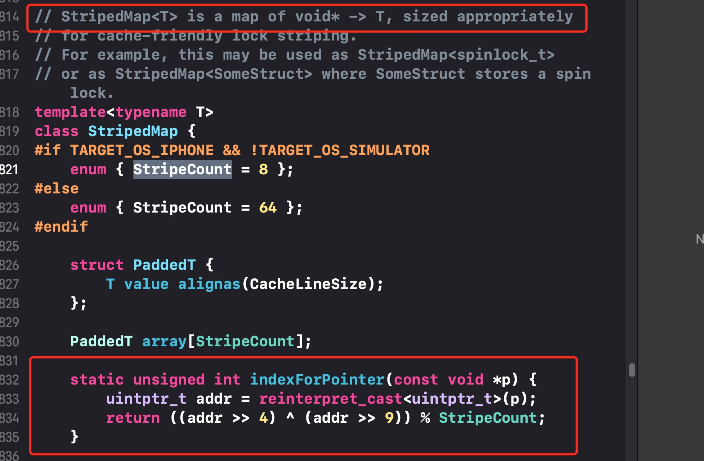
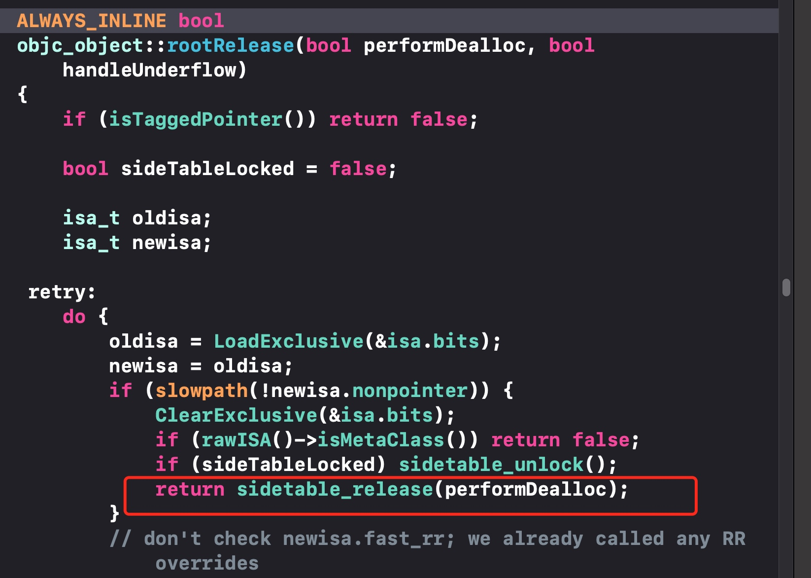

# OC知识点整理
[TOC]

## Foundation
### nil、NIL、NULL、NSNULL有什么区别
- nil是OC对象的空指针
- NIL是OC类的空指针
- NULL是C类型的空指针
- NSNULL是数值类的空对象

### 如何实现一个线程安全的 NSMutableArray?
NSMutableArray是线程不安全的，当有多个线程同时对数组进行访问和修改的时候可能会导致崩溃或数据错乱。那么为了实现一个线程安全的NSMutableArray，可以参考以下两个做法：
1. 线程锁：使用线程锁对数组进行读写时进行加锁
    1. 每对数组进行访问和操作都要进行加锁，加锁过于频繁。
2. 派发队列：每次对数组进行访问和修改操作都要进行加锁，加锁代码过于频繁，而且如果忘记加锁，可能会造成线程不安全问题。那么为了解决加锁代码频繁以及避免忘记加锁的问题，我们可以尝试在类的内部利用派发队列进行加锁。
    1. 由于NSMutableArray内部方法是闭源的，我们不能直接修改内部代码，那么我们可以新建一个类，向外部提供 NSMutableArray 实现的所有方法（在.h文件进行方法声明），而且在.m文件实现消息转发中的消息重定向方法。那么当调用某个方法，比如addObject，那么就会直接走到消息重定向，在里面利用派发队列进行加锁，重定向到NSMutableArray，那么这就可以避免了加锁频繁的问题了。
    2. 派发队列的实现细则：
        1. 创建一个自定义的并发队列或者串行队列
        2. 对于数组的没有返回值的方法，比如addObject方法等，在`dispatch_barrier_async`Block里进行重定向
        3. 对于数组有返回的方法，比如count等方法，在`dispatch_barrier_sync`Block里进行重定向
    3. 除了利用重定向外，还可以实现数组的每个方法，在方法的实现利用派发队列以及栅栏来实现线程安全
    [学习链接🔗1](https://juejin.cn/post/6844903555233480712#comment)
    [学习链接🔗2](https://www.jianshu.com/p/4195209e4d8e)
    
### atomic 修饰的属性是绝对安全的吗？为什么？
atomic修饰的属性不是绝对安全，atomic只是保证属性的存取方法是线程安全的，并不能保证整个对象是线程安全，当同时有多个线程调用对象的set和get方法，那么可能会出现数据错误的问题，或者有一个线程对属性进行了release，那么就有可能会出现crash。

### 关于isEqual与hash方法解析
#### isEqual方法
isEqual方法作用在于比较两个对象是否相等，它与==方法的区别在于：
1. 对于基本类型，==运算符比较的是值是否相等，对于对象类型，==运算符比较的是两个对象的内存地址是否一样
2. isEqual方法比较的是两个对象是否相等。具体到两个对象是否为同一类型，对象的每个属性是否也相等。

重写自己的isEqual方法
1. 利用==运算符判断是否为同一对象
2. 判断是否为同一个类型
3. 对每个属性分别比较值是否相同
4. 返回结果

举个栗子🌰
``` Objective-c
@interface Person : NSObject

@property (nonatomic, copy) NSString *name;
@property (nonatomic, strong) NSDate *birthday;

@end

- (BOOL)isEqual:(id)object {
    if (self == object) {
        return YES;
    }
    
    if (![object isKindOfClass:[Person class]]) {
        return NO;
    }
    
    return [self isEqualToPerson:(Person *)object];
}

- (BOOL)isEqualToPerson:(Person *)person {
    if (!person) {
        return NO;
    }
    
    BOOL haveEqualNames = (!self.name && !person.name) || [self.name isEqualToString:person.name];
    BOOL haveEqualBirthdays = (!self.birthday && !person.birthday) || [self.birthday isEqualToDate:person.birthday];
    
    return haveEqualNames && haveEqualBirthdays;
}
```

#### 关于hash方法
##### 为什么要有hash方法
这个问题要从Hash Table这种数据结构说起

首先我们看下如何在数组中查找某个成员
Step 1: 遍历数组中的成员
Step 2: 将取出的值与目标值比较, 如果相等, 则返回该成员
在数组未排序的情况下, 查找的时间复杂度是O(array_length)

为了提高查找的速度, Hash Table出现了
当成员被加入到Hash Table中时, 会给它分配一个hash值, 以标识该成员在集合中的位置
通过这个位置标识可以将查找的时间复杂度优化到O(1), 当然如果多个成员都是同一个位置标识, 那么查找就不能达到O(1)了

分配的这个hash值(即用于查找集合中成员的位置标识), 就是通过hash方法计算得来的, 且hash方法返回的hash值最好唯一

和数组相比, 基于hash值索引的Hash Table查找某个成员的过程就是
- Step 1: 通过hash值直接找到查找目标的位置
- Step 2: 如果目标位置上有多个相同hash值得成员, 此时再按照数组方式进行查找

##### hash方法的调用时机
基于hash值索引实现的数据结构有NSSet和NSDictionary等，当对象被添加到NSSet和设置为NSDictionary的key时会调用hash方法，为该对象分配一个hash值。
- NSSet添加新成员时, 需要根据hash值来快速查找成员, 以保证集合中是否已经存在该成员
- NSDictionary在查找key时, 也利用了key的hash值来提高查找的效率
- 注意⚠️：字典的`setValue forKey`方法是不会调用hash方法的，只有`setObject forKey`才会调用hash方法。


```Objective-c
//setObject方法的key为id 对象类型，因此要调用hash方法，根据它的hash值作为key；而且setObject方法的key是要遵守NSCopying协议的。
//setValue方法的key为NSString *类型，不会调用hash方法的，直接利用该值作为key
- (void)setObject:(ObjectType)anObject forKey:(KeyType <NSCopying>)aKey;
- (void)setValue:(nullable ObjectType)value forKey:(NSString *)key;
```

##### hash方法与判等的关系?
hash方法主要是用于在Hash Table查询成员用的, 那么和我们要讨论的isEqual()有什么关系呢?

为了优化判等的效率, 基于hash的NSSet和NSDictionary在判断成员是否相等时, 会这样做
- Step 1: 集成成员的hash值是否和目标hash值相等, 如果相同进入Step 2, 如果不等, 直接判断不相等
- Step 2: hash值相同(即Step 1)的情况下, 再进行对象判等, 作为判等的结果

##### 如何重写自己的hash方法?
很多人在iOS开发中, 都是这么重写hash方法的
``` Objective-c
- (NSUInteger)hash {
    return [super hash];
}
```
这样写有问题么? 带着这个问题, 我们先来看下[super hash]的值到底是什么
``` Objective-c
Person *person = [[Person alloc] init];
NSLog(@"person = %ld", (NSUInteger)person);
NSLog(@"[person1 getSuperHash] = %ld", [person getSuperHash]);
```
打印结果如下
``` Objective-c
person = 140643147498880
[person1 getSuperHash] = 140643147498880
```
由此可以看出, [super hash]返回的就是该对象的内存地址

联想到前面对hash值唯一性的要求, 使用对象的内存地址作为hash值不是很好么?

别急, 我们添加如下两个对象到NSSet中试试
``` Objective-c
Person *person1 = [Person personWithName:kName1 birthday:self.date1];
Person *person2 = [Person personWithName:kName1 birthday:self.date1];
NSLog(@"[person1 isEqual:person2] = %@", [person1 isEqual:person2] ? @"YES" : @"NO");

NSMutableSet *set = [NSMutableSet set];
[set addObject:person1];
[set addObject:person2];
NSLog(@"set count = %ld", set.count);
```
此时打印结果如下
``` Objective-c
[person1 isEqual:person2] = YES
set count = 2
```
isEqual相等的两个对象都加入到了NSSet中(set count = 2), 所以直接返回[super hash]是不正确的。简单来说，如果hash方法是返回对象的内存地址，那么set在判断时就会任务两个对象是不一样的，但实质上两个对象是相等的，因此hash方法直接返回对象的内存地址是不对的。

那么hash方法的最佳实践到底是什么呢?
In reality, a simple XOR over the hash values of critical properties is sufficient 99% of the time(对关键属性的hash值进行位或运算作为hash值)

举个🌰
```Objective-c
- (NSUInteger)hash {
    return [self.name hash] ^ [self.birthday hash];
}
```
[学习链接🔗](https://www.jianshu.com/p/915356e280fc)

### id 和 instanceType 有什么区别？
相同点
1. instancetype 和 id 都是万能指针，指向对象。
不同点：
1. id类型在编译的时候不会判断对象的真实类型；instanceType在编译的时候就会判断对象的真实类型。
2. id可以用来定义变量，可以作为函数的返回值，可以作为形参；instanceType只能用于作为返回值。

### self和super的区别
1. self调用自己方法，super调用父类方法
2. self是类，super是预编译指令
3. [self class] 和 [super class] 输出是一样的
4. self和super底层实现原理
    1. 当使用 self 调用方法时，会从当前类的方法列表中开始找，如果没有，就从父类中再找；而当使用 super 时，则从父类的方法列表中开始找，然后调用父类的这个方法
    2. 当使用 self 调用时，会使用 objc_msgSend 函数：`id objc_msgSend(id theReceiver, SEL theSelector, ...)`第一个参数是消息接收者，第二个参数是调用的具体类方法的 selector，后面是 selector 方法的可变参数。以 [self setName:] 为例，编译器会替换成调用 objc_msgSend 的函数调用，其中 theReceiver 是 self，theSelector 是 @selector(setName:)，这个 selector 是从当前 self 的 class 的方法列表开始找的 setName，当找到后把对应的 selector 传递过去。
    3. 当使用 super 调用时，会使用 objc_msgSendSuper 函数：`id objc_msgSendSuper(struct objc_super *super, SEL op, ...)`，第一个参数是个objc_super的结构体，第二个参数还是类似上面的类方法的selector

    
```C
struct objc_super {
	id receiver;
	Class superClass;
};
```
- objc中super是编译器标示符，并不像self一样是一个对象，(super是预编译指令)，遇到向super发的方法时会转译成objc_msgSendSuper(...)，而参数中的对象还是self，于是从父类开始沿继承链寻找- class这个方法，最后在NSObject中找到（若无override），此时，[self class]和[super class]已经等价了。
- super 的含义，消息转发会调用 objc_msgSendSuper， 就是 去父类的方法列表中找到 initWithFrame:这个方法，然后调用，调用的主体是 self。super 只是一个编译器的特殊字符，并不代表父类的一个实例化对象。这也就能明白为什么 调用 [super initWithFrame:frame]能得到本类的 实例化对象了，而不是父类的对象了。[self class] [super class]，class 这个方法都是 在 NSObject 对象中找到的，所以 都相当于 调用  [self class], 输入都是 一样的 SubView

### @synthesize和@dynamic分别有什么作用？
- @synthesize 的语义是如果你没有手动实现 setter 方法和 getter 方法，那么编译器会自动为你加上这两个方法。
- @dynamic 告诉编译器：属性的 setter 与 getter 方法由用户自己实现，不自动生成，而且不会自动创建对应的成员变量（当然对于 readonly 的属性只需提供 getter 即可）。假如一个属性被声明为 @dynamic var，然后你没有提供 @setter方法和 @getter 方法，编译的时候没问题，但是当程序运行到 instance.var = someVar，由于缺 setter 方法会导致程序崩溃；或者当运行到 someVar = var 时，由于缺 getter 方法同样会导致崩溃。编译时没问题，运行时才执行相应的方法，这就是所谓的动态绑定。

在@dynamic情况下实现存取方法
1. 接注释掉@dynamic name这行代码即可，由编译器自动添加。
2. 手动添加，由于@dynamic不能像@synthesize那样向实现文件(.m)提供实例变量，所以我们需要在类中显式提供实例变量。
3. 通过runtime机制在运行时添加属性的存取方法。

### 类族
类族是一种有用的设计模式，可以隐藏抽象基类背后的实现细节。系统中存在很多类族，比如UIButton,NSArray,NSString,NSNumber等。

如上图，NSNumber的范围很大，实际上NSNumber有很多隐藏的子类，但是我们通过NSNumber的numberWith方法创建得到的不是NSNumber的实例对象，而是其子类的对象，但是我们在使用的时候不需要知道这一点，只需要知道这是一个NSNumber对象即可。

使用类族的优点：
1. 可以隐藏抽象基类背后的复杂细节，
2. 程序员不需要记住各种类型的创建对象所需要的具体类,简化开发人员开发成本,提高开发效率。
3. 使用者只需调用基类简单的方法就可以返回不同的子类实例。
使用类族的缺点：
1. 类族的一个缺点也显现出来，那就是已有的类族不好扩展（比如你想NSNumber再多支持一种情况，这个恐怕很难。好在这些系统的类库已经将大部分可能都做进去了，考虑得比较完善，通常你只是去用就可以了。）

### struct和class的区别
- swift中，类是引用类型，结构体是值类型。值类型在传递和赋值时进行复制，而引用类型则只会共同指向一个内存地址。
- 引用类型比如类是在堆上的，而值类型比如结构体是在栈上的。相比于栈上的操作，堆上的操作更加复杂耗时，所以，苹果官方推荐使用结构体，这样可以提高App运行的效率。
- class的优点：
    - 可以继承，子类可以使用父类的特性和方法
    - 一个类可以被多次引用
- struct的优先：结构较小，适用于复制操作，相比于类被多次引用更加安全，无须担心内存泄漏或者多线程冲突问题。

## UIKit
### UIView 和 CALayer 是什么关系？
1. UIView 继承 UIResponder，而 UIResponder 是响应者对象，可以对iOS 中的事件响应及传递，CALayer 没有继承自 UIResponder，继承自NSObject，所以 CALayer 不具备响应处理事件的能力。CALayer 是 QuartzCore 中的类，是一个比较底层的用来绘制内容的类，用来绘制UI
2. UIView 对 CALayer 封装属性，对 UIView 设置 frame、center、bounds 等位置信息时，其实都是UIView 对 CALayer 进一层封装，使得我们可以很方便地设置控件的位置；例如圆角、阴影等属性， UIView 就没有进一步封装，所以我们还是需要去设置 Layer 的属性来实现功能。
3. UIView 是 CALayer 的代理，UIView 持有一个 CALayer 的属性，并且是该属性的代理，用来提供一些 CALayer 运行时需要的数据，例如动画和绘制。

### CALayer的代理CALayerDelegate
每个UIView都会持有一个CALayer的属性，CALayer里的CALayerDelegate协议代理是UIView。CALayerDelegate主要包含以下5个方法
```Objective-c
@protocol CALayerDelegate <NSObject>
@optional

// 告诉代理去执行展示过程
- (void)displayLayer:(CALayer *)layer;

//Tells the delegate to implement the display process using the layer's CGContextRef.
//告诉代理利用layer的CGContextRef去执行展示过程
- (void)drawLayer:(CALayer *)layer inContext:(CGContextRef)ctx;

//通知代理即将开始描绘
- (void)layerWillDraw:(CALayer *)layer
  API_AVAILABLE(macos(10.12), ios(10.0), watchos(3.0), tvos(10.0));

//告诉代理当前layer需要重新绘制会覆盖自定义子类的布局
- (void)layoutSublayersOfLayer:(CALayer *)layer;

//layer的属性发生变化时询问代理应该执行哪种action
//1.直接返回一个action - 即layer对于属性值的变化需要有什么动作
//2.返回nil，让layer去别的地方询问
//3.返回NSNull，即告诉layer不需要执行一个动作，搜索到此为止。
- (nullable id<CAAction>)actionForLayer:(CALayer *)layer forKey:(NSString *)event;

@end
```

### UIView绘制流程
1. UIView调用setNeedsDisplay,但是没立即进行视图的绘制工作;
2. UIView调用setNeedDisplay后,系统调用view对应layer的 setNeedsDisplay方法，给需要绘制的layer做个标记
3. 当前runloop即将结束的时候调用CALayer的display方法;
4. runloop即将结束, 开始视图的绘制流程;


如果layer的代理实现了displayLayer方法的话，那么就会调用代理的displayLayer方法，进入异步绘制过程。
> 异步绘制大概的实现为：创建一个backing store（位图），可以理解为在这个位图上面描绘数据，然后开启子线程在位图上描述数据，描绘数据完成后切换到主线程，将位图赋值给layer的content，等待GPU的渲染。

#### 系统绘制流程

1. CALayer内部创建一个backing store(CGContextRef)();
2. 判断layer是否有代理;
    1. 有代理:调用delegete的drawLayer:inContext, 然后在合适的实际回调代理, 在[UIView drawRect]中做一些绘制工作;
    2. `drawRect`方法：该方法具有重绘作用，重写该方法实现自定义的绘制过程。
        1. 在drawRect方法中获取上下文，然后就可以进行绘制工作。
    3. 没有代理:调用layer的drawInContext方法,
3. layer上传backingStore到GPU, 结束系统的绘制流程;
4. GPU 进行变换、合成、渲染。随后 GPU 会把渲染结果提交到帧缓冲区去，等待下一次 VSync 信号到来时显示到屏幕上。

#### 异步绘制
个人理解为:展示界面的过程中将创建上下文和控件的绘制工作放到子线程中, 子线程将那些工作完成渲染成图片后转回主线程然后将位图展示在界面上;
异步绘制的入口在[layer.delegate displayLayer], 异步绘制过程中代理负责生成对应的位图(bitmap);然后将bitmap赋值给layer.content属性展示;

#### 调用setNeedsDisplay不是立刻绘制的原因
Core Animation 在 RunLoop 中注册了一个 Observer 监听 BeforeWaiting(即将进入休眠) 和 Exit (即将退出Loop) 事件 。当在操作 UI 时，比如改变了 Frame、更新了 UIView/CALayer 的层次时，或者手动调用了 UIView/CALayer 的 setNeedsLayout/setNeedsDisplay方法后，这个 UIView/CALayer 就被标记为待处理，并被提交到一个全局的容器去。当Oberver监听的事件到来时，回调执行函数中会遍历该全局容器里所有待处理的UIView/CAlayer 以执行实际的绘制和调整，并更新 UI 界面。（监听事件到来时，就会调用[CALayer display]方法，然后根据判断是否有代理实现了`displayLayer`方法，有则进入到异步绘制流程，无则进入到系统绘制流程；接下来会创建一个图形上下文（CGContextRef），将要绘制的数据内容填充到图形上下文，然后将数据赋值给layer的content属性，等待GPU的渲染，GPU渲染完成之后会将数据填充到帧缓冲区，等到下一个垂直同步信号到来时，显示器就会扫描帧缓冲区的数据并将其显示出来）

[学习链接🔗1](http://www.cocoachina.com/articles/14549)
[学习链接🔗2](https://mp.weixin.qq.com/s?__biz=MjM5NTIyNTUyMQ==&mid=447105405&idx=1&sn=054dc54289a98e8a39f2b9386f4f620e&scene=23&srcid=0108RhyzhXk9wUwQvnW3cmZT#rd)
### Bounds 和 Frame 的区别?
1. Frame：该view在父视图坐标系统中的位置和大小
2. Bounds：该view在自身视图坐标系统中的位置和大小，改变Bounds的位置会影响子视图的位置，改变Bounds的大小会影响当前视图的大小
#### Frame的图文解析


#### Bounds的图文解析
设置view2的frame初始值为(0,0,30,30），在没修改view1的bounds时，view1的bounds为(0，0，300，300)，而view2的位置在确定时是参照view1的坐标系统。

- 当单纯修改view1的bounds位置为(10,10,300,300)，那么会变成，可以看到view2相比原来往左上角移动了
- 因为修改view1的bounds的位置，那么相当于修改自身的坐标系统，将坐标系统中左上角从（0，0）的位置修改为（10，10），那么相当于view1的原点往上角移动了，当view2添加到view1时，坐标原点在view1的左上角，因此view2也移动上去了。


- 当单纯修改bounds的大小时，可以发现，view2相对于view1的位置是没有改变的，因此可以得出修改bounds大小不会影响view本身的坐标系统。
- 修改bounds的大小，相当于修改了视图本身的大小，视图的中心点位置不会发生变化，相当于一种缩放的感觉，最后视图的frame位置和大小都发生了变化，


### 隐式动画
1. CALayer的属性值发生变化时，会触发动画展示从旧值到新值的变化，这叫做隐式动画。
2. UIView持有的CALayer的属性值发生变化时，是没有隐式动画的，因为CALayer属性值发生变化时，会通过代理方法`actionForLayer`，询问view是否动画改变，但是代理view返回的是null，即不需要执行一个动画。

### setNeedsDisplay 和 layoutIfNeeded 两者是什么关系？
UIView的setNeedsDisplay和setNeedsLayout两个方法都是异步执行的。而setNeedsDisplay会自动调用drawRect方法，这样可以拿到UIGraphicsGetCurrentContext进行绘制；而setNeedsLayout会默认调用layoutSubViews，给当前的视图做了标记；layoutIfNeeded 查找是否有标记，如果有标记及立刻刷新。

只有setNeedsLayout和layoutIfNeeded这二者合起来使用，才会起到立刻刷新的效果。
- setNeedsLayout方法是给当前视图添加标记
- layoutIfNeeded查看当前视图是否有标记，有则立即刷新

### 谈谈对UIResponder的理解
UIResponder类是专门用来响应用户的操作处理各种事件的，包括触摸事件(Touch Events)、运动事件(Motion Events)、远程控制事件(Remote Control Events)。我们知道UIApplication、UIView、UIViewController这几个类是直接继承自UIResponder，所以这些类都可以响应事件。当然我们自定义的继承自UIView的View以及自定义的继承自UIViewController的控制器都可以响应事件。

### loadView的作用？
loadView方法会在每次访问UIViewController的view(比如controller.view、self.view)而且view为nil时会被调用，此方法主要用来负责创建UIViewController的view(重写loadView方法，并且不需要调用[super loadView])

这里要提一下 [super loadView]，[super loadView]做了下面几件事。
1. 先判断UIViewController是否从StoryBoard中加载的，如果是从StoryBoard加载的UIViewController。那么它就会从StoryBoard当中加载的UIViewController的view，把它设置当前UIViewController的view。
2. 它会先去查找与UIViewController相关联的xib文件，通过加载xib文件来创建UIViewController的view，如果在初始化UIViewController指定了xib文件名，就会根据传入的xib文件名加载对应的xib文件，如果没有明显地传xib文件名，就会加载跟UIViewController同名的xib文件
3. 如果没有关联的xib文件，就会创建一个空白的UIView，赋值给UIViewController的view属性。

综上，在需要自定义UIViewController的view时，可以通过重写loadView方法且不需要调用[super loadView]方法。
重写loadView方法即创建我们自定义的类，那么就没有去调用[super loadView]

### 视图渲染框架
UIKit是常用的框架，显示、动画都通过CoreAnimation。CoreAnimation是核心动画，依赖于OpenGL ES做GPU渲染，CoreGraphics做CPU渲染；最底层的GraphicsHardWare是图形硬件。


在 VSync 信号到来后，系统图形服务会通过 CADisplayLink 等机制通知 App，App 主线程开始在 CPU 中计算显示内容，比如视图的创建、布局计算、图片解码、文本绘制等。随后 CPU 会将计算好的内容提交到 GPU 去，由 GPU 进行变换、合成、渲染。随后 GPU 会把渲染结果提交到帧缓冲区去，等待下一次 VSync 信号到来时显示到屏幕上。由于垂直同步的机制，如果在一个 VSync 时间内，CPU 或者 GPU 没有完成内容提交，则那一帧就会被丢弃，等待下一次机会再显示，而这时显示屏会保留之前的内容不变。这就是界面卡顿的原因。

### 使用 drawRect有什么影响？
1. drawRect 方法依赖 Core Graphics 框架来进行自定义的绘制,实现drawRect方法要创建一个寄宿图（backingstore - 图形上下文），这个寄宿图占用的内存是很大的（可以理解为绘制的图层的大小，具体到每个像素点的大小），而且要依赖CPU渲染，因此利用drawRect方法绘制图形会消耗CPU和内存资源。
2. 这个方法的调用机制也是非常特别. 当你调用 setNeedsDisplay 方法时, UIKit 将会把当前图层标记为 dirty,但还是会显示原来的内容,直到下一次的视图渲染周期,才会将标记为 dirty 的图层重新建立 Core Graphics 上下文,然后将内存中的数据恢复出来, 再使用 CGContextRef 进行绘制。
3. 使用drawRect方法绘制图形会大大消耗CPU和内存资源，因此，我们可以使用CAShapeLayer来替代drawRect实现图形的绘制。
    1. CAShapeLayer是CoreAnimation框架的，它是基于OpenGL ES做GPU渲染；CAShapeLayer绘制图形不需要像普通 Core Graphics 一样创建一个寄宿图形，所以无论有多大，都不会占用太多的内存，它将绘制的图形放进显存，交给GPU渲染。
    2. 渲染快速。CAShapeLayer 使用了硬件加速，绘制同一图形会比用 Core Graphics 快很多。

### keyWindow 和 delegate的window有何区别
delegate.window 程序启动时设置的window对象。

keyWindow 这个属性保存了[windows]数组中的[UIWindow]对象，该对象最近被发送了[makeKeyAndVisible]消息

一般情况下 delegate.window 和 keyWindow 是同一个对象，但不能保证keyWindow就是delegate.window，因为keyWindow会因为makeKeyAndVisible而变化，例如，程序中添加了一个悬浮窗口，这个时候keywindow就会变化。

### CADisplayLink
- CADisplayLink是一个定时器。我们在应用中创建一个新的 CADisplayLink 对象，把它添加到一个runloop中，并给它提供一个 target 和 selector 在屏幕刷新的时候调用。
- 一但 CADisplayLink 以特定的模式注册到runloop之后，每当屏幕需要刷新的时候，runloop就会调用CADisplayLink绑定的target上的selector，这时target可以读到 CADisplayLink 的每次调用的时间戳，用来准备下一帧显示需要的数据。例如一个视频应用使用时间戳来计算下一帧要显示的视频数据。在UI做动画的过程中，需要通过时间戳来计算UI对象在动画的下一帧要更新的大小等等。
- 在添加进runloop的时候我们应该选用高一些的优先级，来保证动画的平滑。可以设想一下，我们在动画的过程中，runloop被添加进来了一个高优先级的任务，那么，下一次的调用就会被暂停转而先去执行高优先级的任务，然后在接着执行CADisplayLink的调用，从而造成动画过程的卡顿，使动画不流畅。
- frameInterval属性是可读可写的NSInteger型值，标识间隔多少帧调用一次selector 方法，默认值是1，即每帧都调用一次。如果每帧都调用一次的话，对于iOS设备来说那刷新频率就是60HZ也就是每秒60次，如果将 frameInterval 设为2 那么就会两帧调用一次，也就是变成了每秒刷新30次。
- 我们通过pause属性开控制CADisplayLink的运行。当我们想结束一个CADisplayLink的时候，应该调用-(void)invalidate 从runloop中删除并删除之前绑定的 target跟selector
- 另外CADisplayLink 不能被继承。

#### CADisplayLink 与 NSTimer 有什么不同
- iOS设备的屏幕刷新频率是固定的，CADisplayLink在正常情况下会在每次刷新结束都被调用，精确度相当高。
- NSTimer的精确度就显得低了点，比如NSTimer的触发时间到的时候，runloop如果在阻塞状态，触发时间就会推迟到下一个runloop周期。并且 NSTimer新增了tolerance属性，让用户可以设置可以容忍的触发的时间的延迟范围。
- CADisplayLink使用场合相对专一，适合做UI的不停重绘，比如自定义动画引擎或者视频播放的渲染。NSTimer的使用范围要广泛的多，各种需要单次或者循环定时处理的任务都可以使用。在UI相关的动画或者显示内容使用 CADisplayLink比起用NSTimer的好处就是我们不需要在格外关心屏幕的刷新频率了，因为它本身就是跟屏幕刷新同步的。

## WebView
### 说一下 JS 和 OC 互相调用的几种方式？
一般都是在本地工程文件里新建了一个html文件，JS和OC互相调用其实就是当前webView展示的是html文件，在html文件里主动调用OC方法，或者利用OC调用了html文件的里js方法。

JS调用OC
- html文件内发出请求，在UIWebView的代理方法里对当前页面发出的url请求进行拦截。
- 在OC中获取当前JS的上下文 JSContext，在JS上下文里定义好JS执行的方法
- WKuserContentController 是WebKit框架里专门用来跟JS交互的类，调用这个类的`addScriptMessageHandler`方法，注册JS调用的方法，当JS调用了已经被注册的方法后，会在代理方法`- (void)userContentController:(WKUserContentController *)userContentController 
      didReceiveScriptMessage:(WKScriptMessage *)message;`里拦截到JS调用的方法

OC调用JS
- 利用webView来调用`- (NSString *)stringByEvaluatingJavaScriptFromString:(NSString *)script;`方法；script即要调用的js方法
- 利用JSContext 调用`- (JSValue *)evaluateScript:(NSString *)script;`方法来调用JS方法
- WKWebView主动调用`- (void)evaluateJavaScript:(NSString *)javaScriptString 
         completionHandler:(void (^)(id, NSError *error))completionHandler;`方法，其中的javaScriptString就是JS的方法。

[测试demo](/Users/macbookpro/Downloads/JS_OC-master )
[学习链接🔗1](https://cloud.tencent.com/developer/article/1192332)
[学习链接🔗2](https://blog.csdn.net/zjpjay/article/details/103310279)
[学习链接🔗3](https://cloud.tencent.com/developer/article/1144981)

### 在使用 WKWedView 时遇到过哪些问题
白屏问题，Cookie 问题，在WKWebView上直接使用NSURLProtocol无法拦截请求，在WKWebView 上通过loadRequ发起的post请求body数据被丢失，截屏问题等
- 白屏问题：
    - 首先我们要知道产生白屏的原因：WKWebView之所以有更低的内存占用，是因为它是一个多进程组件，Network Loading 以及 UI Rendering 在其它进程中执行（也就是说使用WKWebView总的内存占用不一定比UIWebView少，只是App Process Memory会减少）。在UIWebView上，当内存占用过大，当前APP会crash，而使用WKWebView，WebContent Process会crash，这个时候就产生了白屏。
- Cookie问题：
    - WKWebView会将cookie延迟存储进NSHTTPCookieStorage，但是WKWebView发起的请求不会自动带上NSHTTPCookieStorage中的cookie。

- 页面样式问题
    - 在 WKWebView 适配过程中，我们发现部分H5页面元素位置向下偏移或被拉伸变形，追踪后发现主要是H5页面高度值异常导致：

[学习链接🔗](https://www.jianshu.com/p/182092592d8b)


### UIWebView 与 WKWebView
UIWebView 是 iOS 2 中推出的网页容器，UIWebView是最占内存的控件；直到 iOS 8 以后，苹果推出了 WebKit 框架，其中 WKWebView 正式被推出来接替 UIWebView 的位置；iOS 12 中，苹果正式弃用 UIWebView，要求开发者用 WKWebView 全面替换 UIWebView。

UIWebView 特点：
1. 加载速度慢
2. 内存占用大，App停留在后台很容易被系统杀死
3. 原生容器完全不带进度条，需要自定义开发

WKWebView 特点
1. 在性能、稳定性、功能方面有很大提升（最直观的提升就是加载网页是占用的内存很少,测试加载不同网页其内存性能提升3倍到4倍,而且没有缓存）
2. 允许JavaScript的Nitro库加载并使用（UIWebView中限制）
3. 支持更多的 HTML5 特性
4. 与 Safari 具有相同的 JavaScript 引擎

## 内存管理
### 什么情况使用weak关键字，相比assign有什么不同？
什么情况下使用weak关键字
- 在 ARC 中，在有可能出现循环引用的时候，往往要通过让其中一端使用 weak 来解决，比如: delegate、block。
- 自身已经对它进行一次强引用,没有必要再强引用一次,此时也会使用 weak,自定义 IBOutlet 控件属性一般也使用 weak；当然，也可以使用strong。

相比于assign有什么相同点
- weak 此特质表明该属性定义了一种“非拥有关系” (nonowning relationship)。为这种属性设置新值时，设置方法既不保留新值，也不释放旧值。此特质同assign类似

相比于assign有什么不同
- weak、assign 修饰的属性指向一个对象时都不会增加对象的引用计数。然而在所指的对象被释放时，weak 属性值会被置为 nil，而 assign 属性不会。
- assign 可以用于 OC 对象以及基本类型，而 weak 必须用于 OC 对象。

### 如何让自己的类用copy修饰符？如何重写带copy关键字的setter？
若想令自己所写的对象具有拷贝功能，则需实现 NSCopying 协议。如果自定义的对象分为可变版本与不可变版本，那么就要同时实现 NSCopying 与 NSMutableCopying 协议。

具体步骤：
- 首先，自定义对象需要遵守NSCopying和NSMutableCopying协议
- 然后需要分别实现 copyWithZone 和 mutableCopyWithZone 方法
- 如果自定义对象里的属性也是自定义对象的，那么同样也要实现上述两步

注意：一提到让自己的类用 copy 修饰符，我们总是想覆写copy方法，其实真正需要实现的却是 “copyWithZone” 方法。

举个🌰
```Objective - c 
#import "person.h"

@interface person()<NSCopying, NSMutableCopying>

@end

@implementation person

- (nonnull id)copyWithZone:(nullable NSZone *)zone {
    NSLog(@"copy");
    person *test = [person allocWithZone:zone];
    test.name = [self.name copy];
    test.id = _id;
    return test;
}

- (nonnull id)mutableCopyWithZone:(nullable NSZone *)zone {
    NSLog(@"mutableCopy");
    person *test = [person allocWithZone:zone];
    test.name = [self.name mutableCopy];
    test.id = _id;
    return test;
}

@end
```

自定义对象的copy 和 mutableCopy方法都是深拷贝，而对象里的属性到底是浅拷贝还是深拷贝，主要取决于属性的类型以及调用的是copy方法还是mutableCopy方法，比如属性是NSString类型，调用了copy方法，那么就是浅拷贝。

copy方法和mutableCopy方法都不是遵守消息传递的，如果该类没有实现这两个方法，然后在外面调用了copy或者mutableCopy方法，就会崩溃。

重写带 copy 关键字的 setter，例如：
```Objective-c
- (void)setName:(NSString *)name {
    //[_name release];
    _name = [name copy];
}
```

### 深拷贝与浅拷贝
浅拷贝是指针拷贝，两个指针还是指向同一块内存地址。
深拷贝是内容拷贝，但是两个指针已经不是指向同一块内存地址。
所以：浅拷贝和深拷贝的区别在于拷贝后的指针指向的地址是否相同。

- copy方法:如果是非可扩展类的对象，则是浅拷贝，返回的是不可变对象。如果是可扩展类的对象，是深拷贝，返回的是不可变对象。
    - 对于可扩展类的对象，调用copy方法，得到的新对象的指针跟原对象的指针指向的不是同一块内存地址，说明是深拷贝；对于新对象执行append方法都是会报错的，说明新对象仍然是不可变对象
    - 开发者文档里面也有提到，copy方法，对于接收者，不管是调用对象是可变的还是不可变的，返回的结果都是不可变的。


- mutableCopy方法:无论是可扩展类的对象还是不可扩展类的对象，都是深拷贝，返回的都是可变对象。
- 容器类的对象不管是调用copy方法还是mutableCopy方法，容器内的对象都是浅拷贝。

```Objective - c
NSMutableArray *mutableArray = [[NSMutableArray alloc] initWithArray:array copyItems:YES];
NSMutableArray *mutableArray = [array mutableCopy];
```
上面两个方法是有区别的。
- 第一个方式是对数组的Items的拷贝，是浅拷贝 还是 深拷贝 主要是跟 数组对象的类型有关系，数组对象是不可变，那么就是浅拷贝，数组对象是可变，那么就是深拷贝，可以理解为对数组元素调用了copy方法。
- 第二个方式：数组元素的拷贝都是浅拷贝。

### @property的本质是什么？ivar、getter、setter是如何生成并添加到这个类中的
- @property 的本质是实例变量（ivar）+存取方法（access method ＝ getter + setter）,即 @property = ivar + getter + setter;
    - “属性” (property)作为 Objective-C 的一项特性，主要的作用就在于封装对象中的数据。 Objective-C 对象通常会把其所需要的数据保存为各种实例变量。实例变量一般通过“存取方法”(access method)来访问。其中，“获取方法” (getter)用于读取变量值，而“设置方法” (setter)用于写入变量值。
- ivar、getter、setter 是自动合成这个类中的
    - 完成属性定义后，编译器会自动编写访问这些属性所需的方法，此过程叫做“自动合成”(autosynthesis)。需要强调的是，这个过程由编译器在编译期执行，所以编辑器里看不到这些“合成方法”(synthesized method)的源代码。除了生成方法代码 getter、setter 之外，编译器还要自动向类中添加适当类型的实例变量，并且在属性名前面加下划线，以此作为实例变量的名字。在前例中，会生成两个实例变量，其名称分别为 _firstName 与 _lastName。也可以在类的实现代码里通过 @synthesize 语法来指定实例变量的名字。

### @protocol和category中如何使用@property
- 在 protocol 中使用 property 只会生成 setter 和 getter 方法声明,我们使用属性的目的,是希望遵守我协议的对象能实现该属性
- category 使用 @property 也是只会生成 setter 和 getter 方法的声明,如果我们真的需要给 category 增加属性的实现,需要借助于运行时的两个函数：objc_setAssociatedObject和objc_getAssociatedObject

### @autoreleasePool的数据结构
- 创建一个自动释放池，其实是在创建AutoreleasePoolPage结构体，创建释放池会往page里插入一个哨兵对象作为标记，而page之间是一个双向链表的结构，通过parent和child指针链接page。
- page里的next指针指向下一个可存放 autorelease 对象地址的位置，初始化指向 begin()

#### 详细结构
自动释放池的官方文档
> 官方文档
The Application Kit creates an autorelease pool on the main thread at the beginning of every cycle of the event loop, and drains it at the end, thereby releasing any autoreleased objects generated while processing an event. If you use the Application Kit, you therefore typically don’t have to create your own pools. If your application creates a lot of temporary autoreleased objects within the event loop, however, it may be beneficial to create “local” autorelease pools to help to minimize the peak memory footprint.
以上是苹果对自动释放池的一段介绍，其意思为：AppKit 和 UIKit 框架在事件循环(RunLoop)的每次循环开始时，在主线程创建一个自动释放池，并在每次循环结束时销毁它，在销毁时释放自动释放池中的所有autorelease对象。通常情况下我们不需要手动创建自动释放池，但是如果我们在循环中创建了很多临时的autorelease对象，则手动创建自动释放池来管理这些对象可以很大程度地减少内存峰值。

接下来进行自动释放池的原理分析
新建一个macOS文件，同时创建一个自动释放池
```Objective-c
int main(int argc, const char * argv[]) {
    @autoreleasepool {}
    return 0;
}
```
通过 Clang clang -rewrite-objc main.m 将以上代码转换为 C++ 代码。
```Objective-c
struct __AtAutoreleasePool {
    __AtAutoreleasePool() {
        atautoreleasepoolobj = objc_autoreleasePoolPush();
    }
    ~__AtAutoreleasePool() {
        objc_autoreleasePoolPop(atautoreleasepoolobj);
    }
    void * atautoreleasepoolobj;
};

int main(int argc, const char * argv[]) {
    /* @autoreleasepool */ 
    { __AtAutoreleasePool __autoreleasepool;  }
    return 0;
}
```
可以看到：
- @autoreleasepool底层是创建了一个__AtAutoreleasePool结构体对象；
- 在创建__AtAutoreleasePool结构体时会在构造函数中调用objc_autoreleasePoolPush()函数，并返回一个atautoreleasepoolobj(POOL_BOUNDARY存放的内存地址，下面会讲到)；
- 在释放__AtAutoreleasePool结构体时会在析构函数中调用objc_autoreleasePoolPop()函数，并将atautoreleasepoolobj传入。

#### AutoreleasePoolPage
下面我们进入Runtime objc4源码查看以上提到的两个函数的实现。
```Objective-c
// NSObject.mm
void * objc_autoreleasePoolPush(void)
{
    return AutoreleasePoolPage::push();
}

void objc_autoreleasePoolPop(void *ctxt)
{
    AutoreleasePoolPage::pop(ctxt);
}
```
可以得知，objc_autoreleasePoolPush()和objc_autoreleasePoolPop()两个函数其实是调用了AutoreleasePoolPage类的两个类方法push()和pop()。所以@autoreleasepool底层就是使用AutoreleasePoolPage类来实现的。

下面我们来看一下AutoreleasePoolPage类的定义：
```Objective-c
class AutoreleasePoolPage 
{
#   define EMPTY_POOL_PLACEHOLDER ((id*)1)  // EMPTY_POOL_PLACEHOLDER：表示一个空自动释放池的占位符
#   define POOL_BOUNDARY nil                // POOL_BOUNDARY：哨兵对象
    static pthread_key_t const key = AUTORELEASE_POOL_KEY;
    static uint8_t const SCRIBBLE = 0xA3;   // 用来标记已释放的对象
    static size_t const SIZE =              // 每个 Page 对象占用 4096 个字节内存
#if PROTECT_AUTORELEASEPOOL                 // PAGE_MAX_SIZE = 4096
        PAGE_MAX_SIZE;  // must be muliple of vm page size
#else
        PAGE_MAX_SIZE;  // size and alignment, power of 2
#endif
    static size_t const COUNT = SIZE / sizeof(id);  // Page 的个数

    magic_t const magic;                // 用来校验 Page 的结构是否完整
    id *next;                           // 指向下一个可存放 autorelease 对象地址的位置，初始化指向 begin()
    pthread_t const thread;             // 指向当前线程
    AutoreleasePoolPage * const parent; // 指向父结点，首结点的 parent 为 nil
    AutoreleasePoolPage *child;         // 指向子结点，尾结点的 child  为 nil
    uint32_t const depth;               // Page 的深度，从 0 开始递增
    uint32_t hiwat;
    ......
}
```
整个程序运行过程中，可能会有多个AutoreleasePoolPage对象。从它的定义可以得知：

- 自动释放池（即所有的AutoreleasePoolPage对象）是以栈为结点通过双向链表的形式组合而成；
- 自动释放池与线程一一对应；
- 每个AutoreleasePoolPage对象占用4096字节内存，其中56个字节用来存放它内部的成员变量，剩下的空间（4040个字节）用来存放autorelease对象的地址。

其内存分布图如下：

下面我们通过源码来分析push()、pop()以及autorelease方法的实现。

#### POOL_BOUNDARY
在分析这些方法之前，先介绍一下POOL_BOUNDARY。
- POOL_BOUNDARY的前世叫做POOL_SENTINEL，称为哨兵对象或者边界对象；
- POOL_BOUNDARY用来区分不同的自动释放池，以解决自动释放池嵌套的问题；
- 每当创建一个自动释放池，就会调用push()方法将一个POOL_BOUNDARY入栈，并返回其存放的内存地址；
- 当往自动释放池中添加autorelease对象时，将autorelease对象的内存地址入栈，它们前面至少有一个POOL_BOUNDARY；
- 当销毁一个自动释放池时，会调用pop()方法并传入一个POOL_BOUNDARY，会从自动释放池中最后一个对象开始，依次给它们发送release消息，直到遇到这个POOL_BOUNDARY.

#### push
```Objective-c
    static inline void *push() 
    {
        id *dest;
        if (DebugPoolAllocation) { // 出错时进入调试状态
            // Each autorelease pool starts on a new pool page.
            dest = autoreleaseNewPage(POOL_BOUNDARY);
        } else {
            dest = autoreleaseFast(POOL_BOUNDARY);  // 传入 POOL_BOUNDARY 哨兵对象
        }
        assert(dest == EMPTY_POOL_PLACEHOLDER || *dest == POOL_BOUNDARY);
        return dest;
    }
```
当创建一个自动释放池时，会调用push()方法。push()方法中调用了autoreleaseFast()方法并传入了POOL_BOUNDARY哨兵对象。

下面我们来看一下autoreleaseFast()方法的实现：
```Objective-c
    static inline id *autoreleaseFast(id obj)
    {
        AutoreleasePoolPage *page = hotPage();     // 新创建的未满的 Page
        if (page && !page->full()) {        // 如果当前 Page 存在且未满
            return page->add(obj);                 // 将 autorelease 对象入栈，即添加到当前 Page 中；
        } else if (page) {                  // 如果当前 Page 存在但已满
            return autoreleaseFullPage(obj, page); // 创建一个新的 Page，并将 autorelease 对象添加进去
        } else {                            // 如果当前 Page 不存在，即还没创建过 Page
            return autoreleaseNoPage(obj);         // 创建第一个 Page，并将 autorelease 对象添加进去
        }
    }
```
autoreleaseFast()中先是调用了hotPage()方法获得未满的Page，从AutoreleasePoolPage类的定义可知，每个Page的内存大小为4096个字节，每当Page满了的时候，就会创建一个新的Page。hotPage()方法就是用来获得这个新创建的未满的Page。

autoreleaseFast()在执行过程中有三种情况：

- ① 当前Page存在且未满时，通过page->add(obj)将autorelease对象入栈，即添加到当前Page中；
- ② 当前Page存在但已满时，通过autoreleaseFullPage(obj, page)创建一个新的Page，并将autorelease对象添加进去；
- ③ 当前Page不存在，即还没创建过Page，通过autoreleaseNoPage(obj)创建第一个Page，并将autorelease对象添加进去。

下面我们来看一下以上提到的三个方法的实现：
```OC
    id *add(id obj)
    {
        assert(!full());
        unprotect();
        id *ret = next;  // faster than `return next-1` because of aliasing
        *next++ = obj;
        protect();
        return ret;
    }
```
page->add(obj)其实就是将autorelease对象添加到Page中的next指针所指向的位置，并将next指针指向这个对象的下一个位置，然后将该对象的位置返回。
```OC
    static __attribute__((noinline))
    id *autoreleaseFullPage(id obj, AutoreleasePoolPage *page)
    {
        // The hot page is full. 
        // Step to the next non-full page, adding a new page if necessary.
        // Then add the object to that page.
        assert(page == hotPage());
        assert(page->full()  ||  DebugPoolAllocation);

        do {
            if (page->child) page = page->child;
            else page = new AutoreleasePoolPage(page);
        } while (page->full());

        setHotPage(page);
        return page->add(obj);
    }
```
autoreleaseFullPage()方法中通过while循环，通过Page的child指针找到最后一个Page。

- 如果最后一个Page未满，就通过page->add(obj)将autorelease对象添加到最后一个Page中；
- 如果最后一个Page已满，就创建一个新的Page并通过page->add(obj)将autorelease对象添加进去，并将该Page设置为hotPage

```OC
    static __attribute__((noinline))
    id *autoreleaseNoPage(id obj)
    {
        // "No page" could mean no pool has been pushed
        // or an empty placeholder pool has been pushed and has no contents yet
        assert(!hotPage());

        bool pushExtraBoundary = false;
        if (haveEmptyPoolPlaceholder()) {
            // We are pushing a second pool over the empty placeholder pool
            // or pushing the first object into the empty placeholder pool.
            // Before doing that, push a pool boundary on behalf of the pool 
            // that is currently represented by the empty placeholder.
            pushExtraBoundary = true;
        }
        else if (obj != POOL_BOUNDARY  &&  DebugMissingPools) {
            // We are pushing an object with no pool in place, 
            // and no-pool debugging was requested by environment.
            _objc_inform("MISSING POOLS: (%p) Object %p of class %s "
                         "autoreleased with no pool in place - "
                         "just leaking - break on "
                         "objc_autoreleaseNoPool() to debug", 
                         pthread_self(), (void*)obj, object_getClassName(obj));
            objc_autoreleaseNoPool(obj);
            return nil;
        }
        else if (obj == POOL_BOUNDARY  &&  !DebugPoolAllocation) {
            // We are pushing a pool with no pool in place,
            // and alloc-per-pool debugging was not requested.
            // Install and return the empty pool placeholder.
            return setEmptyPoolPlaceholder();
        }

        // We are pushing an object or a non-placeholder'd pool.

        // Install the first page.
        AutoreleasePoolPage *page = new AutoreleasePoolPage(nil);
        setHotPage(page);
        
        // Push a boundary on behalf of the previously-placeholder'd pool.
        if (pushExtraBoundary) {
            page->add(POOL_BOUNDARY);
        }
        
        // Push the requested object or pool.
        return page->add(obj);
    }
```
autoreleaseNoPage()方法中会创建第一个Page。该方法会判断是否有空的自动释放池存在，如果没有会通过setEmptyPoolPlaceholder()生成一个占位符，表示一个空的自动释放池。接着创建第一个Page，设置它为hotPage。最后将一个POOL_BOUNDARY添加进Page中，并返回POOL_BOUNDARY的下一个位置。

小结： 以上就是push操作的实现，往自动释放池中添加一个POOL_BOUNDARY，并返回它存放的内存地址。接着每有一个对象调用autorelease方法，会将它的内存地址添加进自动释放池中。

#### autorelease
```OC
    static inline id autorelease(id obj)
    {
        assert(obj);
        assert(!obj->isTaggedPointer());
        id *dest __unused = autoreleaseFast(obj);
        assert(!dest  ||  dest == EMPTY_POOL_PLACEHOLDER  ||  *dest == obj);
        return obj;
    }
```
可以看到，调用了autorelease方法的对象，也是通过以上解析的autoreleaseFast()方法添加进Page中。

#### pop
```OC
    static inline void pop(void *token) 
    {
        AutoreleasePoolPage *page;
        id *stop;

        if (token == (void*)EMPTY_POOL_PLACEHOLDER) {
            // Popping the top-level placeholder pool.
            if (hotPage()) {
                // Pool was used. Pop its contents normally.
                // Pool pages remain allocated for re-use as usual.
                pop(coldPage()->begin());
            } else {
                // Pool was never used. Clear the placeholder.
                setHotPage(nil);
            }
            return;
        }

        page = pageForPointer(token);
        stop = (id *)token;
        if (*stop != POOL_BOUNDARY) {
            if (stop == page->begin()  &&  !page->parent) {
                // Start of coldest page may correctly not be POOL_BOUNDARY:
                // 1. top-level pool is popped, leaving the cold page in place
                // 2. an object is autoreleased with no pool
            } else {
                // Error. For bincompat purposes this is not 
                // fatal in executables built with old SDKs.
                return badPop(token);
            }
        }

        if (PrintPoolHiwat) printHiwat();

        page->releaseUntil(stop);

        // memory: delete empty children
        if (DebugPoolAllocation  &&  page->empty()) {
            // special case: delete everything during page-per-pool debugging
            AutoreleasePoolPage *parent = page->parent;
            page->kill();
            setHotPage(parent);
        } else if (DebugMissingPools  &&  page->empty()  &&  !page->parent) {
            // special case: delete everything for pop(top) 
            // when debugging missing autorelease pools
            page->kill();
            setHotPage(nil);
        } 
        else if (page->child) {
            // hysteresis: keep one empty child if page is more than half full
            if (page->lessThanHalfFull()) {
                page->child->kill();
            }
            else if (page->child->child) {
                page->child->child->kill();
            }
        }
    }
```
pop()方法的传参token即为POOL_BOUNDARY对应在Page中的地址。当销毁自动释放池时，会调用pop()方法将自动释放池中的autorelease对象全部释放（实际上是从自动释放池的中的最后一个入栈的autorelease对象开始，依次给它们发送一条release消息，直到遇到这个POOL_BOUNDARY）。pop()方法的执行过程如下：

- ① 判断token是不是EMPTY_POOL_PLACEHOLDER，是的话就清空这个自动释放池；
- ② 如果不是的话，就通过pageForPointer(token)拿到token所在的Page（自动释放池的首个Page）；
- ③ 通过page->releaseUntil(stop)将自动释放池中的autorelease对象全部释放，传参stop即为POOL_BOUNDARY的地址；
- ④ 判断当前Page是否有子Page，有的话就销毁。
pop()方法中释放autorelease对象的过程在releaseUntil()方法中，下面来看一下这个方法的实现：

```OC
  void releaseUntil(id *stop) 
    {
        // Not recursive: we don't want to blow out the stack 
        // if a thread accumulates a stupendous amount of garbage
        
        while (this->next != stop) {
            // Restart from hotPage() every time, in case -release 
            // autoreleased more objects
            AutoreleasePoolPage *page = hotPage();

            // fixme I think this `while` can be `if`, but I can't prove it
            while (page->empty()) {
                page = page->parent;
                setHotPage(page);
            }

            page->unprotect();
            id obj = *--page->next;  // next指针是指向最后一个对象的后一个位置，所以需要先减1
            memset((void*)page->next, SCRIBBLE, sizeof(*page->next));
            page->protect();

            if (obj != POOL_BOUNDARY) {
                objc_release(obj);
            }
        }

        setHotPage(this);

#if DEBUG
        // we expect any children to be completely empty
        for (AutoreleasePoolPage *page = child; page; page = page->child) {
            assert(page->empty());
        }
#endif
    }
    ```
releaseUntil()方法其实就是通过一个while循环，从最后一个入栈的autorelease对象开始，依次给它们发送一条release消息，直到遇到这个POOL_BOUNDARY。

#### AutoreleasePoolPage()
我们来看一下创建一个Page的过程。AutoreleasePoolPage()方法的参数为parentPage，新创建的Page的depth加一，next指针的初始位置指向begin，将新创建的Page的parent指针指向parentPage。将parentPage的child指针指向自己，这就形成了双向链表的结构。
```OC
    AutoreleasePoolPage(AutoreleasePoolPage *newParent) 
        : magic(), next(begin()), thread(pthread_self()),
          parent(newParent), child(nil), 
          depth(parent ? 1+parent->depth : 0), 
          hiwat(parent ? parent->hiwat : 0)
    { 
        if (parent) {
            parent->check();
            assert(!parent->child);
            parent->unprotect();
            parent->child = this;
            parent->protect();
        }
        protect();
    }
```

#### autorelease对象的释放时机
那么在iOS工程中，方法里的autorelease对象是什么时候释放的呢？有系统干预释放和手动干预释放两种情况。
- 系统干预释放是不指定@autoreleasepool，所有autorelease对象都由主线程的RunLoop创建的@autoreleasepool来管理。
- 手动干预释放就是将autorelease对象添加进我们手动创建的@autoreleasepool中。

##### 系统干预释放
> 如果你的程序使用了AppKit或UIKit框架，那么主线程的RunLoop就会在每次事件循环迭代中创建并处理@autoreleasepool。也就是说，应用程序所有autorelease对象的都是由RunLoop创建的@autoreleasepool来管理。而main()函数中的@autoreleasepool只是负责管理它的作用域中的autorelease对象。

iOS在主线程的RunLoop中注册了两个Observer
- 第1个Observer监听了kCFRunLoopEntry事件，会调用objc_autoreleasePoolPush()；
- 第2个Observer
    - ① 监听了kCFRunLoopBeforeWaiting事件，会调用objc_autoreleasePoolPop()、objc_autoreleasePoolPush()；
    - ② 监听了kCFRunLoopBeforeExit事件，会调用objc_autoreleasePoolPop()。

所以，在iOS工程中系统干预释放的autorelease对象的释放时机是由RunLoop控制的，会在当前RunLoop每次循环结束时释放。
- kCFRunLoopEntry：在即将进入RunLoop时，会自动创建了一个__AtAutoreleasePool结构体对象，并调用objc_autoreleasePoolPush()函数。
- kCFRunLoopBeforeWaiting：在RunLoop即将休眠时，会自动销毁一个__AtAutoreleasePool对象，调用objc_autoreleasePoolPop()。然后创建一个新的__AtAutoreleasePool对象，并调用objc_autoreleasePoolPush()。
- kCFRunLoopBeforeExit，在即将退出RunLoop时，会自动销毁最后一个创建的__AtAutoreleasePool对象，并调用objc_autoreleasePoolPop()。

##### 手动干预释放
可以看到，添加进手动指定的@autoreleasepool中的autorelease对象，在@autoreleasepool大括号结束时就会释放，不受RunLoop控制。

[学习链接🔗](https://cloud.tencent.com/developer/article/1615642)

### BAD_ACCESS在什么情况下出现？
- 访问了野指针；比如对一个已经释放的对象执行了 release，访问已经释放对象的成员变量或者发消息。
- 死循环

### 使用CADisplayLink、NSTimer有什么注意点？
我们使用NSTimer或者CADisplayLink，如果不加处理直接使用系统提供的API方法，就有可能出现循环引用问题
可以使用NSProxy或者为CADisplayLink、NSTimer添加block方法解决循环引用

问题分析：
1. 控制器strong引用一个NSTimer对象，那么timer在addtarget的时候就会对self进行强引用，那么就会出现循环引用问题。
2. 如果控制器weak引用一个NSTimer对象，这样虽然没有循环引用问题，但是会出现控制器一直得不到释放的问题。
    1. 主线程下创建一个NSTimer，默认是会将timer对象添加到Runloop的，那么Runloop会对timer对象有一个强引用，timer对象又强引用着控制器，Runloop是一直运行的，那么控制器是一直不会被释放的。

解决方案：
- 使用Block的形式对self进行弱化，而且离开当前页面时要将计数器置为nil。

```Objective-c
self.timer = [NSTimer scheduledTimerWithTimeInterval:1 repeats:YES block:^(NSTimer * _Nonnull timer) {
        NSLog(@"timer 执行");
    }];
```
- 使用NSProxy代理模式；创建一个类继承自NSProxy，而且weak持有target控制器（虽然用weak修饰，但是指向的内存地址即控制器的内存地址是有效的，因此，用weak修饰是有效的），当timer调用对应方法时，就通过代理进行方法重定向到target控制器

[学习链接🔗](https://juejin.cn/post/7010245818380714015)

### iOS内存分区情况
- 栈区（Stack）
    - 由编译器自动分配释放，存放函数的参数，局部变量的值等
    - 栈是向低地址扩展的数据结构，是一块连续的内存区域
- 堆区（Heap）
    - 由程序员分配释放
    - 是向高地址扩展的数据结构，是不连续的内存区域
- 全局区
    - 全局变量和静态变量的存储是放在一块的，初始化的全局变量和静态变量在一块区域，未初始化的全局变量和未初始化的静态变量在相邻的另一块区域
    - 程序结束后由系统释放
- 常量区
    - 常量字符串就是放在这里的
    - 程序结束后由系统释放
- 代码区
    - 存放函数体的二进制代码

- 栈：栈是向低地址扩展的数据结构，是一块连续的内存的区域。是栈顶的地址和栈的最大容量是系统预先规定好的，栈的大小是2M（也有的说是1M，总之是一个编译时就确定的常数 ) ,如果申请的空间超过栈的剩余空间时，将提示overflow。因此，能从栈获得的空间较小。

- 堆：堆是向高地址扩展的数据结构，是不连续的内存区域。这是由于系统是用链表来存储的空闲内存地址的，自然是不连续的，而链表的遍历方向是由低地址向高地址。堆的大小受限于计算机系统中有效的虚拟内存。由此可见，堆获得的空间比较灵活，也比较大。

### iOS内存管理方式
- Tagged Pointer（小对象）
    - Tagged Pointer 专门用来存储小的对象，例如 NSNumber 和 NSDate
    - Tagged Pointer 指针的值不再是地址了，而是真正的值。所以，实际上它不再是一个对象了，它只是一个披着对象皮的普通变量而已。所以，它的内存并不存储在堆中，也不需要 malloc 和 free
    - 在内存读取上有着 3 倍的效率，创建时比以前快 106 倍
    - objc_msgSend 能识别 Tagged Pointer，比如 NSNumber 的 intValue 方法，直接从指针提取数据
    - 使用 Tagged Pointer 后，指针内存储的数据变成了 Tag + Data，也就是将数据直接存储在了指针中

#### SideTables 与 SideTable 解析
> 源码解析 来自于 objc4-781。

SideTables 与 SideTable 是两种不同的数据结构。
##### SideTables
首先在源码中搜索SideTables，可以找到它的相关定义。
```C++
static objc::ExplicitInit<StripedMap<SideTable>> SideTablesMap;

static StripedMap<SideTable>& SideTables() {
    return SideTablesMap.get();
}
```
可以看出`SideTables`是`StripedMap<SideTable>`类型的数据结构；再在源码里搜索`StripedMap`，可以看到`StripedMap`是一个（void* -> T）类型的泛型映射表，在真机上StripeCount为8，而在其他平台上StripeCount为64；

那么可以得出
- `StripedMap`内部以数组的形式维护了一个长度为8的SideTable数组；
- 根据传入的对象的地址通过`indexForPointer`函数得出对应的哈希值，取出其所在的SideTable



##### SideTable
在源码里搜索`SideTable`
可以看到，`SideTable`里分别有三个成员变量
- spinlock_t slock 自旋锁，修改对象的引用计数以及weak表的时候会加锁防止多线程环境下出错。
- RefcountMap refcnts 引用计数表
- weak_table_t weak_table 弱引用表
```C++
struct SideTable {
    spinlock_t slock;
    RefcountMap refcnts;
    weak_table_t weak_table;

    SideTable() {
        memset(&weak_table, 0, sizeof(weak_table));
    }

    ~SideTable() {
        _objc_fatal("Do not delete SideTable.");
    }

    void lock() { slock.lock(); }
    void unlock() { slock.unlock(); }
    void forceReset() { slock.forceReset(); }

    // Address-ordered lock discipline for a pair of side tables.

    template<HaveOld, HaveNew>
    static void lockTwo(SideTable *lock1, SideTable *lock2);
    template<HaveOld, HaveNew>
    static void unlockTwo(SideTable *lock1, SideTable *lock2);
};
```

##### retain
在源码里搜索`retain`，一路jump，来到关键方法`objc_object::rootRetain`，我们发现`retain`方法最终调用的是`sidetable_retain()`方法


进入到`sidetable_retain()`方法，可以看到该方法的实现很简单。
1. 根据this，即对象的内存地址，访问到`SideTables`映射表维护的数组里的`SideTable`
2. 对`SideTable`进行操作时，先利用自旋锁上锁
3. 同样也是根据对象的内存地址从`SideTable`中取出引用计数表`refcntStorage`
4. `retain`操作即对数据`refcntStorage`进行加1
5. 解锁完成`retain`操作
```C++
id
objc_object::sidetable_retain()
{
#if SUPPORT_NONPOINTER_ISA
    ASSERT(!isa.nonpointer);
#endif
    SideTable& table = SideTables()[this];
    
    table.lock();
    size_t& refcntStorage = table.refcnts[this];
    if (! (refcntStorage & SIDE_TABLE_RC_PINNED)) {
        refcntStorage += SIDE_TABLE_RC_ONE;
    }
    table.unlock();

    return (id)this;
}
```

##### release
同样先在源码里搜索`release`，一路jump，最终找到关键方法`sidetable_release`

在关键方法`sidetable_release`里
可以发现，跟`retain`的操作是相似的。
1. 根据对象的内存地址从`SideTables`中找出对应的`SideTable`
2. 在`SideTable`里根据内存地址找到引用计数表
3. 根据对象的引用计数来判断该对象是否需要被释放
4. 若需要释放，则将`do_dealloc`设置为true，以及将引用计数与SIDE_TABLE_DEALLOCATING（为2），进行异或，其实得出的结果就是0
5. 若不需要释放，将引用计数 -1


[学习链接🔗1](https://www.jianshu.com/p/961efaef4610?utm_source=desktop&utm_medium=timeline)
[学习链接🔗2](https://www.jianshu.com/p/e0b03d2be843)

#### 弱引用weak 与 weak_table
> The weak table is a hash table governed by a single spin lock.
An allocated blob of memory, most often an object, but under GC any such allocation, may have its address stored in a __weak marked storage location through use of compiler generated write-barriers or hand coded uses of the register weak primitive. Associated with the registration can be a callback block for the case when one of the allocated chunks of memory is reclaimed.
The table is hashed on the address of the allocated memory. When __weak marked memory changes its reference, we count on the fact that we can still see its previous reference.
So, in the hash table, indexed by the weakly referenced item, is a list of all locations where this address is currently being stored.

以上是objc4-781版本中objc_weak.h头文件中对于weak表的定义。weak表是什么？回答这个问题我们需要联想到开发中常用的weak或者__weak修饰词。在开发中，通常在防止诸如delegate使用时的内存泄漏问题时，我们会在delegate属性定义的修饰词中使用weak来修饰它，这样子就能解决使用代理时循环引用导致内存泄漏的问题。或者，当我们有一个UI控件在交互中显示一次后就不再需要它时，我们也可以用weak来定义，这样在它被从图层上移除时就会自动置nil，减少了内存占用。但在这个机制的背后是怎样运作的，为什么被weak或者__weak修饰的对象可以自动置nil，这背后就是weak表在起作用。

通过上次对`SidesTables`的学习，可以知道在真机上`SidesTables`里面维护着一个长度为8的`SidesTable`数组，通过对象的内存地址得出对应的哈希值找出其所在的`SidesTable`，而`SidesTable`里有三个成员变量，分别是自旋锁、引用计数表、弱引用表，弱引用表就是现在要学习的`weak_table_t`

源码搜索`weak_table_t`
`weak_table_t`里有四个成员变量，分别是
- weak_entries ：这里是一个数组，维护着多个对象的弱引用入口
- num_entries：数组的大小
- mask：掩码，用来与对象的内存地址进行按位与找出弱引用的入口
- max_hash_displacement：应该计算偏移量有关
```C++
struct weak_table_t {
    weak_entry_t *weak_entries;
    size_t    num_entries;
    uintptr_t mask;
    uintptr_t max_hash_displacement;
};
```

再在源码里搜索`weak_entry_t`
除去一些方法，`weak_entry_t`结构体里主要保存以下信息
- referent：保存了对象objc_object，在寻找对象弱入口时会与该变量比对找出对应的weak_entry_t
- union：这是个联合体，联合体里面定义了两个结构体，联合体的存在说明两个结构体同一时间内只能有一个是有效的。

```C++
struct weak_entry_t {
    DisguisedPtr<objc_object> referent;
    union {
        struct {
            weak_referrer_t *referrers;
            uintptr_t        out_of_line_ness : 2;
            uintptr_t        num_refs : PTR_MINUS_2;
            uintptr_t        mask;
            uintptr_t        max_hash_displacement;
        };
        struct {
            // out_of_line_ness field is low bits of inline_referrers[1]
            weak_referrer_t  inline_referrers[WEAK_INLINE_COUNT];
        };
    };
}
```
联合体的两个结构体里都出现了`weak_referrer_t`，我们查看一下
`typedef DisguisedPtr<objc_object *> weak_referrer_t;`
说明`weak_referrer_t`是一个数组，数组的内容是`objc_object`

那么重新回顾上面的两个结构体
- 第一个结构体里的`weak_referrer_t *referrers`是一个二维数组，里面存放的是指向这个对象的弱引用
- 第二个结构体里的`weak_referrer_t  inline_referrers[WEAK_INLINE_COUNT];`是一个一维数组，里面同样也是存放指向这个对象的弱引用
- 两者的区别就是第一个结构体的容量更大
- 联合体的作用在于：先创建一个小容量的数组来存放弱引用指针，当容量超过指定大小，那么就会去初始化大容量的二维数组，之前的一维数组就无效了。

```C++
    union {
        struct {
            weak_referrer_t *referrers;
            uintptr_t        out_of_line_ness : 2;
            uintptr_t        num_refs : PTR_MINUS_2;
            uintptr_t        mask;
            uintptr_t        max_hash_displacement;
        };
        struct {
            // out_of_line_ness field is low bits of inline_referrers[1]
            weak_referrer_t  inline_referrers[WEAK_INLINE_COUNT];
        };
    };
```

##### weak对象插入
在`NSObject.mm`文件中我们可以找到`StoreWeak`方法的实现，`StoreWeak`方法由`objc_initweak`方法调用。我们直接在源码里定位到关键方法

可以看到，在`storeweak`方法中，`weak_register_no_lock`方法是关键的将弱引用添加到`weak table`中的方法，当然在这之前还有各种必要的加锁以及其他操作。

在`weak_register_no_lock`方法里我们直接定位将弱引用插入到`weak table`的操作；
可以发现，是根据对象的所在的weak_table 以及 对象调用`weak_entry_for_referent`方法来查找`weak table`里是否已经存在该对象的弱引用入口，存在的话，往这个入口插入新的弱引用。


至此，一个weak对象已经成功地加入到了`weak table`中。通过这个过程我们可以更清晰地了解到`weak table`运作的机制，也验证了`weak table`是以object为key，weak_entry_t为value的hash table这一事实。

##### 其他的相关方法
我们在weak_table_t结构体的定义下可以看到objc_weak.h向外暴露了四个接口，分别是向weak table注册插入对象、注销移除对象、查找弱引用对象是否已在表中、将所有该object的弱引用指针置nil。


##### 弱引用置nil
直奔关键方法
可以看见，在weak table 里 找到对象的弱引用入口，遍历保存弱引用的数组，将弱引用全部置为nil，最后将弱引用入口从weak table 中删除。


##### __weak
利用__weak修饰对象obj时，就会调用前面说到的`objc_initWeak`方法进而调用`storeWeak`方法，为obj对象创建一个weak_entry，添加一个弱引用，指向obj对象
```Objective-c
        NSObject *obj = [[NSObject alloc]init];
        id __weak obj1 = obj;
```

要注意的是
- __weak修饰符适用于Block，当Block引用了外部变量时，会检查变量的修饰符，如果是__weak，那么会对它进行弱引用，默认是强引用。
- 在NSTimer初始化时，如果对addtarget参数进行弱化，其实是无效的，NSTimer不会检查target的类型，默认是强引用。

### 循环引用
循环引用的实质：多个对象相互之间有强引用，不能释放让系统回收。

如何解决循环引用？
- 避免产生循环引用，通常是将 strong 引用改为 weak 引用。
- 在合适时机去手动断开循环引用。 通常我们使用第一种。

常见的循环引用
- 代理(delegate)循环引用属于相互循环引用
    - delegate 是iOS中开发中比较常遇到的循环引用，一般在声明delegate的时候都要使用弱引用 weak,或者assign,当然怎么选择使用assign还是weak，MRC的话只能用assign，在ARC的情况下最好使用weak，因为weak修饰的变量在释放后自动指向nil，防止野指针存在
- NSTimer循环引用属于相互循环使用
    - 在控制器内，创建NSTimer作为其属性，由于定时器创建后也会强引用该控制器对象，那么该对象和定时器就相互循环引用了。 如何解决呢？ 这里我们可以使用手动断开循环引用： 如果是不重复定时器，在回调方法里将定时器invalidate并置为nil即可。 如果是重复定时器，在合适的位置将其invalidate并置为nil即可
- block循环引用
    - 由于block会对block中的对象进行持有操作,就相当于持有了其中的对象，而如果此时block中的对象又持有了该block，则会造成循环引用。 解决方案就是使用__weak修饰self即可
    - 并不是所有block都会造成循环引用。 只有被强引用了的block才会产生循环引用 而比如dispatch_async(dispatch_get_main_queue(), ^{}),[UIView animateWithDuration:1 animations:^{}]这些系统方法等 或者block并不是其属性而是临时变量,即栈block
    - 还有一种场景，在block执行开始时self对象还未被释放，而执行过程中，self被释放了，由于是用weak修饰的，那么weakSelf也被释放了，此时在block里访问weakSelf时，就可能会发生错误(向nil对象发消息并不会崩溃，但也没任何效果)。 对于这种场景，应该在block中对 对象使用__strong修饰，使得在block期间对 对象持有，block执行结束后，解除其持有。

## 消息传递的方式
### KVC实现原理
KVC，键-值编码，使用字符串直接访问对象的属性。
当调用setValye:属性值 forKey:@"name" 方法时，底层的执行机制如下：
- 程序优先调用set<Key>:属性值方法，通过setter方法完成设置。注意这里的<Key>是指成员变量名
- 如果没有找到setName:方法，KVC机制首先会检查+ (BOOL)accessInstanceVariablesDirectly方法是否返回YES（默认是返回YES的），如果重写了此方法并让其返回NO的话，那么KVC机制找不到setName:方法时就会进一步执行setValue: forUndefineKey:方法（找不到Key时在此方法里默认会抛出异常）
- 如果该类没有set<Key>：方法，也没有_<key>成员变量，KVC机制会搜索_is<Key>的成员变量。
- 如果还找不到，KVC机制会继续搜索<key>,is<Key>的成员变量，再给它们赋值。
- 如果上述的方法或者成员变量都不存在，那么系统就会执行该对象的setValue: forUndefineKey：方法，默认是抛出异常
简单来说就是 如果没有找到set<Key>方法的话，会按照_key,_isKey,key,iskey的顺序搜索成员变量进行赋值操作。

KVC取值
当调用valueForKey:@"name"的代码时，底层的执行机制如下：
- 程序优先调用Key方法；如果是BOOL或者Int等值类型， 会将其包装成一个NSNumber对象。
- 若没有找到，则会调用+ (BOOL)accessInstanceVariablesDirectly方法判断是否允许取成员变量的值。
- 若返回NO，直接调用- (nullable id)valueForUndefinedKey:(NSString *)key方法，默认是奔溃。
- 若返回YES,会按先后顺序取_key、_isKey、 key、isKey的值。
- 返回YES时，_key、_isKey、 key、isKey的值都没取到，调用- (nullable id)valueForUndefinedKey:(NSString *)key方法。

### KVO的实现原理
KVO是通过isa-swizzling实现的。
基本流程就是编译器自动为被观察对象创造一个派生类，并将被观察对象的isa指针指向这个派生类。如果用户注册了对此目标对象的某一个属性的观察，那么此派生类会重写这个方法，并在其中添加进行通知的代码。Objective-c在发送消息的时候，会通过isa指针找到当前对象所属的类对象，再通过类对象找到class_rw_t 结构体，里面保存着当前对象的实例方法，因此在向此对象发送消息的时候，实际上是发送到了派生类对象的方法。由于编译器对派生类的方法进行了重写，并添加了通知代码，因此会向注册的观察对象发送通知。注意的是派生类只是重写了注册了观察者的属性方法。

- 当给A类添加KVO的时候，编译器会自动为A类闯将一个派生类，并让A类的isa指针指向派生类，重写class方法，方法实现仍然返回原类
- 当注册了对类的属性进行观察时，派生类就会重写这个属性的setter方法
- 在setter方法内部分别调用了willChangeValueForKey，给属性赋值，didChangeValueForKey三个方法，didChangeValueForKey方法李会调用通知观察者的方法observeValueForKeyPath，通知属性值发生了变化。
- 重写了dealloc方法；在移除KVO观察者后，对象的isa指针由指向派生类到指向原来所属的类
派生类一旦被创建，为了后续的重用，是一直存在内存中的，不会被销毁。

### 如何手动触发KVO方法
手动KVO的话，就需要我们去关掉系统默认的对于特定keyPath的KVO通知，比如关掉age属性的KVO通知
```Objective-c
+ (BOOL) automaticallyNotifiesObserversForKey:(NSString *)key {
    if ([key isEqualToString:@"age"]) {
        return NO;
    }
    return [super automaticallyNotifiesObserversForKey:key];
}
```
然后还要在要监听的属性的setter方法里手动调用willChangeValueForKey和didChangeValueForKey两个方法，当监听的属性值发生变化时，就会自动地去通知观察者
🌰
```Objective-c
- (void) setAge:(int)theAge
{   //对age成员变量开启了手动KVO通知
    [self willChangeValueForKey:@"age"];
    age = theAge;
    [self didChangeValueForKey:@"age"];
}
```

键值观察通知依赖于 NSObject 的两个方法: willChangeValueForKey: 和 didChangeValueForKey。在一个被观察属性发生改变之前， willChangeValueForKey: 一定会被调用，这就 会记录旧的值。而当改变发生后， didChangeValueForKey 会被调用，继而 observeValueForKey:ofObject:change:context: 也会被调用。如果可以手动实现这些调用，就可以实现“手动触发”了 有人可能会问只调用didChangeValueForKey方法可以触发KVO方法，其实是不能的，因为willChangeValueForKey: 记录旧的值，如果不记录旧的值，那就没有改变一说了

### 通知和代理有什么区别
- 通知是观察者模式，适合一对多的场景
- 代理模式适合一对一的反向传值
- 通知监听方法不能有返回值，代理实现的方法可以有返回值
- 通知的耦合度较低，发布通知时不需要知道监听者是谁，监听者只需要知道通知的名称即可实现监听。

### block和delegate的区别
- delegate运行成本低，block的运行成本高。
    - block出栈需要将使用的数据从栈内存拷贝到堆内存，如果是对象的话就是加计数，使用完或者block置nil后才消除。delegate只是保存了一个对象指针，直接回调，没有额外消耗。就像C的函数指针，只多做了一个查表动作。
- 有多个相关方法。假如每个方法都设置一个 block, 这样会更麻烦。而 delegate 让多个方法分成一组，只需要设置一次，就可以多次回调。当多于 3 个方法时就应该优先采用 delegate。当1，2个回调时，则使用block。
- delegate更安全些，比如: 避免循环引用。使用 block 时稍微不注意就形成循环引用，导致对象释放不了。这种循环引用，一旦出现就比较难检查出来。而 delegate 的方法是分离开的，并不会引用上下文，因此会更安全些。
- delegate回调返回的参数被限制在了 NS 类的范围内，数量也很有限；当对协议定义的方法返回Int，CGFloat等基础类型时，是会报错的。

### 为什么Block用copy关键字
Block在没有使用外部变量时，内存存在全局区，然而，当Block在使用外部变量的时候，内存是存在于栈区，当Block copy之后，是存在堆区的。存在于栈区的特点是对象随时有可能被销毁，一旦销毁在调用的时候，就会造成系统的崩溃。所以Block要用copy关键字。

## 数据存储
### iOS 开发中数据持久性有哪几种?
iOS本地数据保存有多种方式,比如NSUserDefaults、归档、文件保存、数据库、CoreData、KeyChain(钥匙串)等多种方式。其中KeyChain(钥匙串)是保存到沙盒范围以外的地方，也就是与沙盒无关。

### 关于keychain的小知识
Keychain Services 是 macOS 和 iOS 都提供一种安全的存储敏感信息的工具,比如,网络密码:用户访问服务器或者网站,通用密码:用来保存应用程序或者数据库密码.与此同时,用于认证的证书,密钥,和身份信息,也可以存储在Keychain中,Keychain Services 的安全机制保证了存储这些敏感信息不会被窃取。简单说来，Keychain 就是一个安全容器。

keychain是用SQLite进行存储的。用苹果的话来说是一个专业的数据库，加密我们保存的数据，可以通过metadata（attributes）进行高效的搜索。keychain适合保存一些比较小的数据量的数据，如果要保存大的数据，可以考虑文件的形式存储在磁盘上，在keychain里面保存解密这个文件的密钥。


如上图，每一个keyChain的组成如图,整体是一个字典结构.

- kSecClass key 定义属于哪一种类型的keyChain（通用密码、互联网密码、证书、密钥和身份）
- 不同的类型包含不同的Attributes,这些attributes定义了这个item的具体信息
- 每个item可以包含一个密码项来存储对应的密码

在macOS中，当keychain被锁的时候加密的item没办法访问，如果你想要该问被锁的item，就会弹出一个对话框，需要你输入对应keychain的密码。当然，没有密码的keychain你可以随时访问。但在iOS中，你只可以访问你自已的keychain items

#### keychain特点
- 数据并不存放在App的Sanbox中，即使删除了App，资料依然保存在keychain中。如果重新安装了app，还可以从keychain获取数据。
- keychain的数据可以通过group方式，让程序可以在App间共享。不过得要相同TeamID
- keychain的数据是经过加密的

#### 私有区和公共区
对于每一个应用来说，KeyChain都有两个访问区，私有区和公共区。私有区是一个sandbox，本程序存储的任何数据都对其他程序不可见，其他应用程序无法访问该区数据。如果要想将存储的内容放在公共区，实现多个应用程序间可以共同访问一些数据，则可以先声明公共区的名称，官方文档管这个名称叫“keychain access group”

#### 公共区的共享
在 iOS 3.0 之后，应用间共享 keychain 数据成为了一种可能。但这是被严格限制的,只有拥有相同 App ID 前缀的应用才有可能共享 keychai,并且各应用存储的 keychain item 都标记了相同的 kSecAccessGroup 字段值

1. 相同的Team ID
    1. 有相同的 Team ID这个是应用间共享 Keychain 数据的前提条件。一个 App ID 分两部分：
        1. Apple 为你生成的 Team ID
        2. 开发者注册的 Bundle ID
    2. 一个典型的 App ID 如：GPZ8FX842Q.com.apple.app, GPZ8FX842Q即为你的Team ID,是 Apple 为你生成的
    3. 一个开发者账号可以有不同的几个 Team ID。但 Apple 不会为不同的开发者生成一样的 Team ID。这样，不同的开发者账号发布的应用想共享 keychain 数据，在现在来看是无法实现的。而要做到 Keychain 数据共享，要求是同一个开发账号开发的，同时选择了相同的 Team ID

2. 打开Xcode里的Keychain Sharing权限，并配置好相关文件的权限
3. 配置好后，须用你正式的证书签名编译才可通过。否则xcode会弹框告诉你code signing有问题。所以，苹果限制了你只能同公司的产品共享KeyChain数据，别的公司访问不了你公司产品的KeyChain

[学习链接🔗](https://juejin.cn/post/6844903921765318669)

## 多线程
### iOS中的多线程
- 多线程的实现原理：事实上，同一时间内单核的CPU只能执行一个线程，多线程是CPU快速的在多个线程之间进行切换（调度），造成了多个线程同时执行的假象。
- 如果是多核CPU就真的可以同时处理多个线程了。
- 多线程的目的是为了同步完成多项任务，通过提高系统的资源利用率来提高系统的效率。
- 这里说的线程指的是内核级线程，用户级线程是用户层面的，不是CPU调度的基本单位。


### 多线程的优点和缺点
- 优点

能适当提高程序的执行效率

能适当提高资源利用率（CPU、内存利用率）

- 缺点:

开启线程需要占用一定的内存空间（默认情况下，主线程占用1M，子线程占用512KB），如果开启大量的线程，会占用大量的内存空间，降低程序的性能

线程越多，CPU在调度线程上的开销就越大

程序设计更加复杂：比如线程之间的通信、多线程的数据共享

### iOS中实现多线程的几种方案，各自有什么特点？
- NSThread： 使用面向对象，但是需要手动管理线程的生命周期
- GCD： 基于c语言的，充分利用了设备的多核，自动管理线程生命周期。比NSOperation效率更高。
- NSOperation： 基于GCD的进一步封装，更加面向对象，比GCD多了一些简单实用的功能。


GCD 和 NSOperation的区别主要表现在以下几方面:
1. GCD是一套 C 语言API,执行和操作简单高效，因此NSOperation底层也通过GCD实现，这是他们之间最本质的区别.因此如果希望自定义任务，建议使用NSOperation；
2. 依赖关系，NSOperation可以设置操作之间的依赖(可以跨队列设置)，GCD无法设置依赖关系，不过可以通过同步来实现这种效果；
3. KVO(键值对观察)，NSOperation容易判断操作当前的状态(是否执行，是否取消等)，对此GCD无法通过KVO进行判断；
4. 优先级，NSOperation可以设置自身的优先级，但是优先级高的不一定先执行，GCD只能设置队列的优先级，如果要区分block任务的优先级,需要很复杂的代码才能实现；
5. 继承，NSOperation是一个抽象类.实际开发中常用的是它的两个子类:NSInvocationOperation和NSBlockOperation，同样我们可以自定义NSOperation，GCD执行任务可以自由组装，没有继承那么高的代码复用度；
6. 效率，直接使用GCD效率确实会更高效，NSOperation会多一点开销，但是通过NSOperation可以获得依赖，优先级，继承，键值对观察这些优势，相对于多的那么一点开销确实很划算，鱼和熊掌不可得兼，取舍在于开发者自己；
7. 可以随时取消准备执行的任务(已经在执行的不能取消),GCD没法停止已经加入queue 的 block(虽然也能实现,但是需要很复杂的代码)

### 多个网络请求完成后执行下一步
- 使用GCD的dispatch_group_t
每次网络请求前先dispatch_group_enter,请求回调后再dispatch_group_leave，enter和leave必须配合使用，有几次enter就要有几次leave，否则group会一直存在。

- 使用GCD的信号量dispatch_semaphore_t
    - 全部任务执行完之后进行v操作
    - 下一步之前执行p操作

    
### 多个网络请求顺序执行后执行下一步
- 使用信号量semaphore
    - 在任务执行完成之前进行P操作阻塞，任务执行完之后进行V操作

### 异步操作两组数据时, 执行完第一组之后, 才能执行第二组
这里使用dispatch_barrier_async栅栏方法即可实现

### 多线程中的死锁

死锁是由于多个线程（进程）在执行过程中，因为争夺资源而造成的互相等待现象，你可以理解为卡主了。产生死锁的必要条件有四个：

- 互斥条件 ： 指进程对所分配到的资源进行排它性使用，即在一段时间内某资源只由一个进程占用。如果此时还有其它进程请求资源，则请求者只能等待，直至占有资源的进程用毕释放。

- 请求和保持条件 ： 指进程已经保持至少一个资源，但又提出了新的资源请求，而该资源已被其它进程占有，此时请求进程阻塞，但又对自己已获得的其它资源保持不放。

- 不可剥夺条件 ： 指进程已获得的资源，在未使用完之前，不能被剥夺，只能在使用完时由自己释放。

- 环路等待条件 ： 指在发生死锁时，必然存在一个进程——资源的环形链，即进程集合{P0，P1，P2，···，Pn}中的P0正在等待一个P1占用的资源；P1正在等待P2占用的资源，……，Pn正在等待已被P0占用的资源。
最常见的就是 同步函数 + 主队列 的组合，本质是队列阻塞。

### GCD执行原理
- GCD有一个底层线程池，这个池中存放的是一个个的线程。之所以称为“池”，很容易理解出这个“池”中的线程是可以重用的，当一段时间后这个线程没有被调用的话，这个线程就会被销毁。注意：开多少条线程是由底层线程池决定的（线程建议控制再3~5条），池是系统自动来维护，不需要我们程序员来维护，而我们程序员需要关心的是什么呢？我们只关心的是向队列中添加任务，队列调度即可。
- 如果队列中存放的是同步任务，则任务出队后，底层线程池中会提供一条线程供这个任务执行，任务执行完毕后这条线程再回到线程池。这样队列中的任务反复调度，因为是同步的，所以当我们用currentThread打印的时候，就是同一条线程。
- 如果队列中存放的是异步的任务，（注意异步可以开线程），当任务出队后，底层线程池会提供一个线程供任务执行，因为是异步执行，队列中的任务不需等待当前任务执行完毕就可以调度下一个任务，这时底层线程池中会再次提供一个线程供第二个任务执行，执行完毕后再回到底层线程池中。
- 这样就对线程完成一个复用，而不需要每一个任务执行都开启新的线程，也就从而节约的系统的开销，提高了效率。在iOS7.0的时候，使用GCD系统通常只能开5~8条线程，iOS8.0以后，系统可以开启很多条线程，但是实在开发应用中，建议开启线程条数：3~5条最为合理。

## 对于weak属性的理解
weak属性 - 我们理解为非拥有关系。为这种属性赋新值时，设置方法既不保留新值，也不释放旧值。

** 既不保留新值，也不释放旧值 **
可以理解为：self以weak指针指向对象，该对象的初始值是A，后重新赋值为了B，那么不保留新值时，对象不会强引用着B，不释放旧值的意思是：改对象被重新赋值为了B，对A是没有影响的，因为本身不存在引用，所以也就没有释放。

当我们从xib或者storyboard中拖出控件View到工程文件里，我们会发现这个View会被声明为weak属性。

** 声明为weak属性的view不是会立马被释放的吗？那为什么还是会声明为weak属性的呢？ **
当我们拖控件进入xib或者storyboard时，这时就相当于执行了addSubview这个方法，说明此控件已经成为了根view的子控件了，那么根view在管理子控件时，是将所有的子控件统一放进subViews数组里的，如下：

```Objective - c
@property(nonatomic,readonly,copy) NSArray<__kindof UIView *> *subviews;
```

subviews数组是声明为copy属性了，所以相当于根View对subviews有了一个强引用，因此拖出来的子控件view声明为weak属性是没有问题的。

** 既然这样，那么将拖出来的子控件属性改为strong吗？ **
答案是可以的，改为strong，相当于多了一个引用，引用计数从1变为2而已。

** 那weak属性是怎么实现的呢？ **
Runtime维护了一个weak表，用于存储指向某个对象的所有weak指针。weak表其实是一个哈希表，Key是所指对象的地址，Value是一个数组，存储的是weak指针的地址。（比如：A弱引用着B，那么在weak表里面，Key就是B的地址，Value就是包含A在内的地址数组）

** 实现原理可以概括为以下三步 **
1.初始化时，runtime会调用objc_initWeak函数，初始化一个新的weak指针指向对象的地址
2.添加引用时，objc_initWeak函数会调用objc_storeWeak()函数，objc_storeWeak()函数的作用是指针重定向，创建对应的弱引用表。（比如：先初始化一个weak变量A，这时objc_initWeak就是初始化一个weak指针指向A的地址，然后对象B捕获了A，相当于B弱引用了A，这是objc_initWeak就会调用objc_storeWeak()函数，改变weak指针的指向，变为从B指向A）
3.释放时，调用clearDeallocating函数。clearDeallocating函数首先会根据对象地址获取到weak表里的所有weak指针的数组，然后遍历这个数组把其中的数组都置为nil，最后还将这个表项从weak表中删除。

## @synthesize 和 @danamic 的区别
** @property **
@property 声明的属性 会自动生成 setter方法、getter方法、实例变量

** @synthesize **
@property声明的属性，我们可以重写它的setter方法或者getter方法，但是我们不能同时都重写他们的setter和getter方法
而如果将** @property **声明的属性加上** @synthesize **修饰，那么我们可以同时重学属性的setter方法和getter方法

** @dynamic **
在** @property ** 声明的属性下，再用** dynamic **修饰，这是在告诉编译器不需要帮此属性生成setter和getter方法，需要我们手动去实现，如果没有实现，在运行时是会崩溃的。而且** @dynamic **声明之后，不仅需要手动实现setter方法和getter方法，如果需要实例变量，也是需要我们自己去补全的。

## 动态绑定
在OC中动态绑定是用** Runtime ** 实现的。

我们知道在分类中是无法添加属性的，那如果我们不想继承这个类，但还想为这个类添加新属性的话，我们可以利用** Runtime ** 动态绑定来实现。

** Runtime的动态绑定 **
其实相当于重写属性的setter方法和getter方法
在setter方法里，调用objc_setAssociatedObject,
在getter方法里，调用objc_getAssociatedObject。
这两个方法是根据一个Key关键字去找到对应的数据的。

``` Objective - c
//ViewController+Objc.m文件
#import "ViewController+Objc.h"
#import <objc/runtime.h>

static NSString * const themeKey = @"theme_key";

@implementation ViewController (Objc)

- (NSString *)themeText {
    return (NSString *)objc_getAssociatedObject(self, &themeKey);
}

- (void)setThemeText:(NSString *)themeText {
    objc_setAssociatedObject(self, &themeKey, themeText, OBJC_ASSOCIATION_RETAIN_NONATOMIC);
}

@end
```

## Category、Extension和继承
** Category **
Category，术语称为类别，类别的用处还是很大的，主要总结为以下两点：
1.在一个类上新增方法，但是又不想继承这个类，那么就可以用到类别Category，类别允许我们在不继承类的情况下给该类新增方法，但是不可以新增属性。
2.如果想要复写原类中的一个方法，那么我们可以在类别中新增同名的方法，那么调用的时候只会调用类别实现的方法，类别的优先级是比原类要高的。

** Category 和 Extension 区别 **
1.形式上，Extension是匿名的Category
2.Extension里声明的方法需要在main implementation中实现，而Category中不作要求
3.Extension可以添加属性，Category上是不可以的
4.Category和原有类的耦合度更低一些，声明和实现都可以写在单独的文件里，但就是只能为已定义类增加Method，而不能加入实例变量
5.使用Extension可以更好的封装类，在.h文件中能看到的都是对外的接口，其余的实例变量和对内的@property等都可以写在Extension里，这样类的结构更加清晰。


##  为什么代理要用weak修饰，代理中的dataSource和delegate有什么区别，Block和代理有什么区别 
** 代理用weak修饰 **
这样做的话引用计数不会加一，可以避免循环引用进而发生内存泄露的问题。

** 代理中的dataSource和delegate有什么区别 **
两者都是代理，不同的是两者的职责不一样。dataSource是数据源，是要提供View展示所需要的数据的，而Delegate偏重于用户操作的回调。

** 什么时候用Block，什么时候用代理 **
Block相对于Delegate来说，代码更清晰易懂，直观明了，适用于回调较少的情况，而代理适用于方法较多，回调较多的情况。

## id 和 NSObject* 的区别

** 为什么id类型的对象在声明时不需要加 *，而类似于NSObject等的对象在声明时需要加上 **
- 这是因为id的本质是结构体指针，可以理解为已经内涵了 * 了，而OC中对象的本质是结构体，所以我们在声明时需要加上 *

** id 和 NSObject * 的区别到底在哪里？ **
1. OC中的基类除了NSObject，还有NSProxy虚类，因此id 包括的范围是比 NSObject * 更大的。
2. id声明的对象是动态数据类型，而NSObject * 声明的对象是静态数据类型。
    - id声明的变量在编译时不会做类型检查，而NSObject * 声明的对象在编译时会做类型检查
    - 静态类型在编译时就知道变量的类型了，那么在编译时，如果该对象调用了本不属于这个类以及父类的方法，那么就会直接报错。而id对象是动态类型，相对来说，在编译时由于无法确定变量的类型，那么尽管 声明对象的格式为 id obj = @123; 也不会将obj对象默认为NSNumber类型的，因此在编译时尽管调用了不属于NSNumber的方法，也是不会编译报错的，只有在运行时找不到这个方法，那么就会crash
[🔗](https://www.jianshu.com/p/c537db1f7cb5)

## 拓展 —— NSProxy
** NSProxy **
NSProxy 是一个虚类，它也是一个基类，遵守了NSObject协议。
```Objective - c 
@interface NSProxy <NSObject> {
    Class	isa;
}
```
而通过看文档，我们可以知道，NSProxy是一个抽象的超类，为充当其他对象或者不存在的对象的代理对象的定义API，通常，发送给代理的消息被转发到实际对象。


** NSProxy的用法 **
NSProxy实现了包括NSObject协议在内基类所需的基础方法，但是作为一个抽象类的基类，并没有提供初始化方法。它接收到任何自己没定义的方法都会产生一个异常。因此，作为NSProxy的子类，首先必须要提供初始化方法，其次还要实现** forwardInvocation： **方法和
** methodSignatureForSelector： **方法来处理自己没有实现的消息。这就是NSProxy的主要功能，负责把消息转发给真正的target代理类。NSProxy正是充当代理的作用。


** NSProxy的使用场景 **
1.多继承
> OC本身是不支持多继承的，多继承的意思是类C同时继承了类A、B，同时有类A、B的特性。

虚基类本身就是为了解决继承问题而生的，而OC的动态特性可以让我们用NSProxy来实现多继承；

2.解决NSTimer循环引用的问题
我们知道NSTimer在创建时是要传入一个target参数的，一般都是传入self，那么NSTimer会强引用着self，那如果self本身就强引用着NSTimer，那么就会出现循环引用的问题。
而我们在解决NSTimer循环引用的问题是将self弱化，那么NSTimer就不会强引用到self。

而现在我们在解决NSTimer循环引用问题时，可以有另一种方案，那就是利用NSProxy来实现，
NSProxy充当一个消息转发的功能，NSProxy持有一个weak的target，而NSProxy对象就是NSTimer持有的对象，当发送消息到NSProxy对象时，NSProxy对象就将此消息转发给target，解决了循环引用的问题。

** NSProxy 和 NSObject 的区别 **
虽然 NSProxy 和 NSObject 都定义了-forwardInvocation:和-methodSignatureForSelector:这两个方法，但是两者的内部实现是不一样的。

** 对于 NSObject 而言 **
接收到消息后先到自身的方法列表那里去找看是否找到，如果找不到，那么就沿着继承体系往上查找，如果还找不到，那么就先后经过 +resolveInstanceMethod:（看是否能动态地添加一个新方法），-forwardingTargetForSelector:（消息重定向），再到-methodSignatureForSelector:/-forwardInvocation:（进行消息转发）

** 对于 NSProxy 而言 **
接收到自身未定义的方法就会直接进行消息转发，先查询methodSignatureForSelector：，看是否得到有效的方法签名，如果有再到-forwardInvocation:进行消息转发。
相比来说，NSProxy 的 消息转发进行得会更加得快，这也体现了 NSProxy 作为代理的抽象基类的优势之处。

** 还有一个值得注意的区别是 **
对于以下三个方法：

- (BOOL)isKindOfClass:(Class)aClass;
- (BOOL)isMemberOfClass:(Class)aClass;
- (BOOL)respondsToSelector:(SEL)aSelector;

如果分别进行 NSProxy 和 NSObejct 的消息转发，我们可以发现，NSProxy是可以正常进行消息转发的，而对于 NSObject 来说，是默认没有走消息转发的，可以理解为 NSObject 只是看自己的方法列表里有没有对应的方法，有就return YES，没有就return NO，而不会走消息转发。

[文章学习🔗1](https://juejin.cn/post/6847902216209039367)
[文章学习🔗2](https://www.jianshu.com/p/b0f5fd3e4b7c)

## 消息处理之performSelector 与 直接调用方法 的区别
iOS中调用方法的方式有很多种，而其中的两种就是 performSelector 和 直接调用。

** 两者有区别吗 **
答案是有的。
performSelector：它可以对对象传递任何一个方法，而且不需要在编译的时候就已经声明了这些方法。因此，可以看出：performSelector 调用方法 与 直接调用 的区别在于 runtime的特性。
简单来说：就是[A performSelector:方法]，尽管这个方法在A中是还没有声明的，编译的时候也不会报错，直到运行时真的找不到这个方法，那么就可能会出现程序崩溃。
而直接调用方法，如果这个方法在调用类中并没有声明，那么就会有编译报错。

[学习🔗](https://www.jianshu.com/p/672c0d4f435a)

## NSMethodSignature
在 Runtime 消息传递的第三步中消息转发 调用到了两个方法：methodSignatureForSelector:/-forwardInvocation:，而在methodSignatureForSelector这个方法里是返回一个NSMethodSignature对象，** 记录着method的返回值、参数等类型信息，然后被包装成一个NSInvocation对象，作为forwardInvocation：方法的参数输入。*

NSMethodSignature 其实 就是作为 NSInvocation对象的中转站。
[学习🔗](https://www.jianshu.com/p/70a8b3f62107)

## 使用系统的Block，需不需要考虑循环引用的问题
在我们使用UIView的动画或者GCD时，都会接触到系统自带的Block，那我们是不需要考虑循环引用的问题的，因为在Block中捕获了self，但是self本身是没有持有该Block的，因此不会出现循环引用的问题。

## 内存的五大分区
bss段、数据段、代码区、栈区、堆区
1. bss段（bss segment）
    - bss段通常是指用来存放程序中未初始化的全局变量和静态变量的一块内存区域，比如Int a；那么a就会被放进bss段，而当a = 1；初始化之后，a就会从bss段转到数据段。
2. 数据段：
    - 通常用来存放已经初始化之后的全局变量 和 静态变量
3. 代码区：
    - 通常用来存放程序的可执行文件。由于程序的可执行文件是被频繁地访问到的，为了不用每次都拷贝到内存中，那么在程序运行之前就已经申请好了一份。
4. 栈区：
    - 通常是用来存放程序中临时创建的局部变量
5. 堆区：
    - 通常是用来存放进程运行中被动态分配的内存段，一般我们alloc之后的对象都是被分配到了堆区。

- 栈区分配地址是向低地址分配的，而堆区分配地址是向高地址分配的。一般栈区和堆区的地址空间为0x100 ～ 0x800

- 下面的变量str和array都是被分配在了栈上，变量str和array的地址是指向栈的。
- 而对应栈上的数据也是一个指针，str的是指向常量区的指针，array的是指向堆区的指针。
- 当变量要被回收的时候，栈中的str和array就会被系统自动释放掉，那么就没有指针指向常量区和堆区的数据了，编译器就会自动调用release方法来回收对象。
- release方法的操作：将该对象的引用计数 -1，然后判断该引用计数是否为0，为0的话就会调用对象的dealloc方法。
- dealloc方法的操作：清空引用计数、清空weak指针，删除关联对象。

``` Objective-c
int main(int argc, const char * argv[]) {
    @autoreleasepool {
        NSString *str = @"123";
        NSArray *array = @[@"asd",@"a"];
    return 0;
}
```
## static 关键字
** static 修饰局部变量 **
- static修饰的变量只会初始化一次，而且每次访问的内存地址都是一样的

```Objective -c
- (void)test {
    //每次调用test方法时，staticValue的内存地址都是一样的，只初始化一次
    NSInteger i = 0;
    i++;
    
    static NSInteger staticValue = 0;
    staticValue++;
    
    NSLog(@"i = %ld, s.value = %ld", (long)i, (long)staticValue);
}
```
- static修饰的局部变量只在作用域内有效，上段代码中的变量staticValue只在test这个函数里有效，在别处是无效的。

** static 修饰全局变量 **
- static 修饰全局变量时，作用域仅限于当前文件，外部类是无法访问到的，而没有static 修饰的全局变量，外部类是可以访问到的，只需利用extern关键字

** 总结 **
- static修饰局部变量时：该变量只会被初始化一次，而且作用域仅限于当前范围，但作用在于可以延长该变量的生命周期，一般等到程序运行结束才会被释放回收
- static修饰全局变量时：该变量作用仅限于当前文件，外部类是无法访问到的。

## Tagged Pointer
- 从苹果官方介绍来看， Tagged Pointer 被设计的目的是用来存储较小的对象，例如 NSNumber、NSDate、NSString 等；
- 从Tagged Pointer指针中已经可以确定对象的类、数据类型已经数据的值；
- Tagged Pointer只是一个伪指针


```Objective-c
NSNumber *number1 = @(1);   // number1: 0xb000000000000012
//b 是指 1011; 从左边起，第一个1其实就是标识位，1则标识为是Tagged Pointer指针，后面的011则表示NSNumber这个类，其他类则会有不同的标识，而最后面的12中的1则表示数值，2表示NSNumber里的数据类型，是short还是long等等
```
** Tagged Pointer的好处 **
- Tagged Pointer可以减少内存的开销以及提高效率；
- 减少内存开销：对于一个NSNumber的对象，** 在没有Tagged Pointer之前 **，内存分配是这样的：在栈分配了8字节，然后栈的数据其实也是一个指针，指向堆区，堆里面存的是isa指针以及对象的值，占16字节（isa指针8字节，对象的值也被分配了8字节 - iOS的内存对齐是16字节），那么总共就分配了24字节；** Tagged Pointer之后 **，对象其实就是一个伪指针，8字节里面已经包含了数据。
- 提高效率：objc_msgSend 执行前会先判断该对象是不是Tagged Pointer，是的话就直接返回；不是的话再进行消息发送机制。

[学习链接🔗](https://cloud.tencent.com/developer/news/717577)

## 线程安全
- 线程安全是多线程访问时，采用了加锁的机制。当一个线程访问某个类的数据时，其他线程不能访问直到该线程访问结束，其他线程才可访问。
- 线程不安全是多个线程同时访问和修改资源时，可能会出现数据错乱和数据安全问题，甚至会导致程序崩溃。

## 如何实现一个线程安全的NSMutableArray


