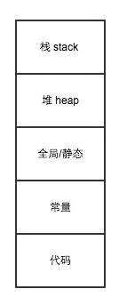

# OC知识点整理
[TOC]

## Foundation
### nil、NIL、NULL、NSNULL有什么区别
- nil是OC对象的空指针
- NIL是OC类的空指针
- NULL是C类型的空指针
- NSNULL是数值类的空对象

### 如何实现一个线程安全的 NSMutableArray?
NSMutableArray是线程不安全的，当有多个线程同时对数组进行访问和修改的时候可能会导致崩溃或数据错乱。那么为了实现一个线程安全的NSMutableArray，可以参考以下两个做法：
1. 线程锁：使用线程锁对数组进行读写时进行加锁
    1. 每对数组进行访问和操作都要进行加锁，加锁过于频繁。
2. 派发队列：每次对数组进行访问和修改操作都要进行加锁，加锁代码过于频繁，而且如果忘记加锁，可能会造成线程不安全问题。那么为了解决加锁代码频繁以及避免忘记加锁的问题，我们可以尝试在类的内部利用派发队列进行加锁。
    1. 由于NSMutableArray内部方法是闭源的，我们不能直接修改内部代码，那么我们可以新建一个类，向外部提供 NSMutableArray 实现的所有方法（在.h文件进行方法声明），而且在.m文件实现消息转发中的消息重定向方法。那么当调用某个方法，比如addObject，那么就会直接走到消息重定向，在里面利用派发队列进行加锁，重定向到NSMutableArray，那么这就可以避免了加锁频繁的问题了。
    2. 派发队列的实现细则：
        1. 创建一个自定义的并发队列或者串行队列
        2. 对于数组的没有返回值的方法，比如addObject方法等，在`dispatch_barrier_async`Block里进行重定向
        3. 对于数组有返回的方法，比如count等方法，在`dispatch_barrier_sync`Block里进行重定向
    3. 除了利用重定向外，还可以实现数组的每个方法，在方法的实现利用派发队列以及栅栏来实现线程安全
    [学习链接🔗1](https://juejin.cn/post/6844903555233480712#comment)
    [学习链接🔗2](https://www.jianshu.com/p/4195209e4d8e)
    
### atomic 修饰的属性是绝对安全的吗？为什么？
atomic修饰的属性不是绝对安全，atomic只是保证属性的存取方法是线程安全的，并不能保证整个对象是线程安全，当同时有多个线程调用对象的set和get方法，那么可能会出现数据错误的问题，或者有一个线程对属性进行了release，那么就有可能会出现crash。

### 关于isEqual与hash方法解析
#### isEqual方法
isEqual方法作用在于比较两个对象是否相等，它与==方法的区别在于：
1. 对于基本类型，==运算符比较的是值是否相等，对于对象类型，==运算符比较的是两个对象的内存地址是否一样
2. isEqual方法比较的是两个对象是否相等。具体到两个对象是否为同一类型，对象的每个属性是否也相等。

重写自己的isEqual方法
1. 利用==运算符判断是否为同一对象
2. 判断是否为同一个类型
3. 对每个属性分别比较值是否相同
4. 返回结果

举个栗子🌰
``` Objective-c
@interface Person : NSObject

@property (nonatomic, copy) NSString *name;
@property (nonatomic, strong) NSDate *birthday;

@end

- (BOOL)isEqual:(id)object {
    if (self == object) {
        return YES;
    }
    
    if (![object isKindOfClass:[Person class]]) {
        return NO;
    }
    
    return [self isEqualToPerson:(Person *)object];
}

- (BOOL)isEqualToPerson:(Person *)person {
    if (!person) {
        return NO;
    }
    
    BOOL haveEqualNames = (!self.name && !person.name) || [self.name isEqualToString:person.name];
    BOOL haveEqualBirthdays = (!self.birthday && !person.birthday) || [self.birthday isEqualToDate:person.birthday];
    
    return haveEqualNames && haveEqualBirthdays;
}
```

#### 关于hash方法
##### 为什么要有hash方法
这个问题要从Hash Table这种数据结构说起

首先我们看下如何在数组中查找某个成员
Step 1: 遍历数组中的成员
Step 2: 将取出的值与目标值比较, 如果相等, 则返回该成员
在数组未排序的情况下, 查找的时间复杂度是O(array_length)

为了提高查找的速度, Hash Table出现了
当成员被加入到Hash Table中时, 会给它分配一个hash值, 以标识该成员在集合中的位置
通过这个位置标识可以将查找的时间复杂度优化到O(1), 当然如果多个成员都是同一个位置标识, 那么查找就不能达到O(1)了

分配的这个hash值(即用于查找集合中成员的位置标识), 就是通过hash方法计算得来的, 且hash方法返回的hash值最好唯一

和数组相比, 基于hash值索引的Hash Table查找某个成员的过程就是
- Step 1: 通过hash值直接找到查找目标的位置
- Step 2: 如果目标位置上有多个相同hash值得成员, 此时再按照数组方式进行查找

##### hash方法的调用时机
基于hash值索引实现的数据结构有NSSet和NSDictionary等，当对象被添加到NSSet和设置为NSDictionary的key时会调用hash方法，为该对象分配一个hash值。
- NSSet添加新成员时, 需要根据hash值来快速查找成员, 以保证集合中是否已经存在该成员
- NSDictionary在查找key时, 也利用了key的hash值来提高查找的效率
- 注意⚠️：字典的`setValue forKey`方法是不会调用hash方法的，只有`setObject forKey`才会调用hash方法。


```Objective-c
//setObject方法的key为id 对象类型，因此要调用hash方法，根据它的hash值作为key；而且setObject方法的key是要遵守NSCopying协议的。
//setValue方法的key为NSString *类型，不会调用hash方法的，直接利用该值作为key
- (void)setObject:(ObjectType)anObject forKey:(KeyType <NSCopying>)aKey;
- (void)setValue:(nullable ObjectType)value forKey:(NSString *)key;
```

##### hash方法与判等的关系?
hash方法主要是用于在Hash Table查询成员用的, 那么和我们要讨论的isEqual()有什么关系呢?

为了优化判等的效率, 基于hash的NSSet和NSDictionary在判断成员是否相等时, 会这样做
- Step 1: 集成成员的hash值是否和目标hash值相等, 如果相同进入Step 2, 如果不等, 直接判断不相等
- Step 2: hash值相同(即Step 1)的情况下, 再进行对象判等, 作为判等的结果

##### 如何重写自己的hash方法?
很多人在iOS开发中, 都是这么重写hash方法的
``` Objective-c
- (NSUInteger)hash {
    return [super hash];
}
```
这样写有问题么? 带着这个问题, 我们先来看下[super hash]的值到底是什么
``` Objective-c
Person *person = [[Person alloc] init];
NSLog(@"person = %ld", (NSUInteger)person);
NSLog(@"[person1 getSuperHash] = %ld", [person getSuperHash]);
```
打印结果如下
``` Objective-c
person = 140643147498880
[person1 getSuperHash] = 140643147498880
```
由此可以看出, [super hash]返回的就是该对象的内存地址

联想到前面对hash值唯一性的要求, 使用对象的内存地址作为hash值不是很好么?

别急, 我们添加如下两个对象到NSSet中试试
``` Objective-c
Person *person1 = [Person personWithName:kName1 birthday:self.date1];
Person *person2 = [Person personWithName:kName1 birthday:self.date1];
NSLog(@"[person1 isEqual:person2] = %@", [person1 isEqual:person2] ? @"YES" : @"NO");

NSMutableSet *set = [NSMutableSet set];
[set addObject:person1];
[set addObject:person2];
NSLog(@"set count = %ld", set.count);
```
此时打印结果如下
``` Objective-c
[person1 isEqual:person2] = YES
set count = 2
```
isEqual相等的两个对象都加入到了NSSet中(set count = 2), 所以直接返回[super hash]是不正确的。简单来说，如果hash方法是返回对象的内存地址，那么set在判断时就会任务两个对象是不一样的，但实质上两个对象是相等的，因此hash方法直接返回对象的内存地址是不对的。

那么hash方法的最佳实践到底是什么呢?
In reality, a simple XOR over the hash values of critical properties is sufficient 99% of the time(对关键属性的hash值进行位或运算作为hash值)

举个🌰
```Objective-c
- (NSUInteger)hash {
    return [self.name hash] ^ [self.birthday hash];
}
```
[学习链接🔗](https://www.jianshu.com/p/915356e280fc)

### id 和 instanceType 有什么区别？
相同点
1. instancetype 和 id 都是万能指针，指向对象。
不同点：
1. id类型在编译的时候不会判断对象的真实类型；instanceType在编译的时候就会判断对象的真实类型。
2. id可以用来定义变量，可以作为函数的返回值，可以作为形参；instanceType只能用于作为返回值。

### self和super的区别
1. self调用自己方法，super调用父类方法
2. self是类，super是预编译指令
3. [self class] 和 [super class] 输出是一样的
4. self和super底层实现原理
    1. 当使用 self 调用方法时，会从当前类的方法列表中开始找，如果没有，就从父类中再找；而当使用 super 时，则从父类的方法列表中开始找，然后调用父类的这个方法
    2. 当使用 self 调用时，会使用 objc_msgSend 函数：`id objc_msgSend(id theReceiver, SEL theSelector, ...)`第一个参数是消息接收者，第二个参数是调用的具体类方法的 selector，后面是 selector 方法的可变参数。以 [self setName:] 为例，编译器会替换成调用 objc_msgSend 的函数调用，其中 theReceiver 是 self，theSelector 是 @selector(setName:)，这个 selector 是从当前 self 的 class 的方法列表开始找的 setName，当找到后把对应的 selector 传递过去。
    3. 当使用 super 调用时，会使用 objc_msgSendSuper 函数：`id objc_msgSendSuper(struct objc_super *super, SEL op, ...)`，第一个参数是个objc_super的结构体，第二个参数还是类似上面的类方法的selector

    
```C
struct objc_super {
	id receiver;
	Class superClass;
};
```
- objc中super是编译器标示符，并不像self一样是一个对象，(super是预编译指令)，遇到向super发的方法时会转译成objc_msgSendSuper(...)，而参数中的对象还是self，于是从父类开始沿继承链寻找- class这个方法，最后在NSObject中找到（若无override），此时，[self class]和[super class]已经等价了。
- super 的含义，消息转发会调用 objc_msgSendSuper， 就是 去父类的方法列表中找到 initWithFrame:这个方法，然后调用，调用的主体是 self。super 只是一个编译器的特殊字符，并不代表父类的一个实例化对象。这也就能明白为什么 调用 [super initWithFrame:frame]能得到本类的 实例化对象了，而不是父类的对象了。[self class] [super class]，class 这个方法都是 在 NSObject 对象中找到的，所以 都相当于 调用  [self class], 输入都是 一样的 SubView

### @synthesize和@dynamic分别有什么作用？
- @synthesize 的语义是如果你没有手动实现 setter 方法和 getter 方法，那么编译器会自动为你加上这两个方法。
- @dynamic 告诉编译器：属性的 setter 与 getter 方法由用户自己实现，不自动生成，而且不会自动创建对应的成员变量（当然对于 readonly 的属性只需提供 getter 即可）。假如一个属性被声明为 @dynamic var，然后你没有提供 @setter方法和 @getter 方法，编译的时候没问题，但是当程序运行到 instance.var = someVar，由于缺 setter 方法会导致程序崩溃；或者当运行到 someVar = var 时，由于缺 getter 方法同样会导致崩溃。编译时没问题，运行时才执行相应的方法，这就是所谓的动态绑定。

在@dynamic情况下实现存取方法
1. 接注释掉@dynamic name这行代码即可，由编译器自动添加。
2. 手动添加，由于@dynamic不能像@synthesize那样向实现文件(.m)提供实例变量，所以我们需要在类中显式提供实例变量。
3. 通过runtime机制在运行时添加属性的存取方法。

### 类族
类族是一种有用的设计模式，可以隐藏抽象基类背后的实现细节。系统中存在很多类族，比如UIButton,NSArray,NSString,NSNumber等。

如上图，NSNumber的范围很大，实际上NSNumber有很多隐藏的子类，但是我们通过NSNumber的numberWith方法创建得到的不是NSNumber的实例对象，而是其子类的对象，但是我们在使用的时候不需要知道这一点，只需要知道这是一个NSNumber对象即可。

使用类族的优点：
1. 可以隐藏抽象基类背后的复杂细节，
2. 程序员不需要记住各种类型的创建对象所需要的具体类,简化开发人员开发成本,提高开发效率。
3. 使用者只需调用基类简单的方法就可以返回不同的子类实例。
使用类族的缺点：
1. 类族的一个缺点也显现出来，那就是已有的类族不好扩展（比如你想NSNumber再多支持一种情况，这个恐怕很难。好在这些系统的类库已经将大部分可能都做进去了，考虑得比较完善，通常你只是去用就可以了。）

### struct和class的区别
- swift中，类是引用类型，结构体是值类型。值类型在传递和赋值时进行复制，而引用类型则只会共同指向一个内存地址。
- 引用类型比如类是在堆上的，而值类型比如结构体是在栈上的。相比于栈上的操作，堆上的操作更加复杂耗时，所以，苹果官方推荐使用结构体，这样可以提高App运行的效率。
- class的优点：
    - 可以继承，子类可以使用父类的特性和方法
    - 一个类可以被多次引用
- struct的优先：结构较小，适用于复制操作，相比于类被多次引用更加安全，无须担心内存泄漏或者多线程冲突问题。

## UIKit
### UIView 和 CALayer 是什么关系？
1. UIView 继承 UIResponder，而 UIResponder 是响应者对象，可以对iOS 中的事件响应及传递，CALayer 没有继承自 UIResponder，继承自NSObject，所以 CALayer 不具备响应处理事件的能力。CALayer 是 QuartzCore 中的类，是一个比较底层的用来绘制内容的类，用来绘制UI
2. UIView 对 CALayer 封装属性，对 UIView 设置 frame、center、bounds 等位置信息时，其实都是UIView 对 CALayer 进一层封装，使得我们可以很方便地设置控件的位置；例如圆角、阴影等属性， UIView 就没有进一步封装，所以我们还是需要去设置 Layer 的属性来实现功能。
3. UIView 是 CALayer 的代理，UIView 持有一个 CALayer 的属性，并且是该属性的代理，用来提供一些 CALayer 运行时需要的数据，例如动画和绘制。

### CALayer的代理CALayerDelegate
每个UIView都会持有一个CALayer的属性，CALayer里的CALayerDelegate协议代理是UIView。CALayerDelegate主要包含以下5个方法
```Objective-c
@protocol CALayerDelegate <NSObject>
@optional

// 告诉代理去执行展示过程
- (void)displayLayer:(CALayer *)layer;

//Tells the delegate to implement the display process using the layer's CGContextRef.
//告诉代理利用layer的CGContextRef去执行展示过程
- (void)drawLayer:(CALayer *)layer inContext:(CGContextRef)ctx;

//通知代理即将开始描绘
- (void)layerWillDraw:(CALayer *)layer
  API_AVAILABLE(macos(10.12), ios(10.0), watchos(3.0), tvos(10.0));

//告诉代理当前layer需要重新绘制会覆盖自定义子类的布局
- (void)layoutSublayersOfLayer:(CALayer *)layer;

//layer的属性发生变化时询问代理应该执行哪种action
//1.直接返回一个action - 即layer对于属性值的变化需要有什么动作
//2.返回nil，让layer去别的地方询问
//3.返回NSNull，即告诉layer不需要执行一个动作，搜索到此为止。
- (nullable id<CAAction>)actionForLayer:(CALayer *)layer forKey:(NSString *)event;

@end
```

### UIView绘制流程
1. UIView调用setNeedsDisplay,但是没立即进行视图的绘制工作;
2. UIView调用setNeedDisplay后,系统调用view对应layer的 setNeedsDisplay方法，给需要绘制的layer做个标记
3. 当前runloop即将结束的时候调用CALayer的display方法;
4. runloop即将结束, 开始视图的绘制流程;


如果layer的代理实现了displayLayer方法的话，那么就会调用代理的displayLayer方法，进入异步绘制过程。
> 异步绘制大概的实现为：创建一个backing store（位图），可以理解为在这个位图上面描绘数据，然后开启子线程在位图上描述数据，描绘数据完成后切换到主线程，将位图赋值给layer的content，等待GPU的渲染。

#### 系统绘制流程

1. CALayer内部创建一个backing store(CGContextRef)();
2. 判断layer是否有代理;
    1. 有代理:调用delegete的drawLayer:inContext, 然后在合适的实际回调代理, 在[UIView drawRect]中做一些绘制工作;
    2. `drawRect`方法：该方法具有重绘作用，重写该方法实现自定义的绘制过程。
        1. 在drawRect方法中获取上下文，然后就可以进行绘制工作。
    3. 没有代理:调用layer的drawInContext方法,
3. layer上传backingStore到GPU, 结束系统的绘制流程;
4. GPU 进行变换、合成、渲染。随后 GPU 会把渲染结果提交到帧缓冲区去，等待下一次 VSync 信号到来时显示到屏幕上。

#### 异步绘制
个人理解为:展示界面的过程中将创建上下文和控件的绘制工作放到子线程中, 子线程将那些工作完成渲染成图片后转回主线程然后将位图展示在界面上;
异步绘制的入口在[layer.delegate displayLayer], 异步绘制过程中代理负责生成对应的位图(bitmap);然后将bitmap赋值给layer.content属性展示;

#### 调用setNeedsDisplay不是立刻绘制的原因
Core Animation 在 RunLoop 中注册了一个 Observer 监听 BeforeWaiting(即将进入休眠) 和 Exit (即将退出Loop) 事件 。当在操作 UI 时，比如改变了 Frame、更新了 UIView/CALayer 的层次时，或者手动调用了 UIView/CALayer 的 setNeedsLayout/setNeedsDisplay方法后，这个 UIView/CALayer 就被标记为待处理，并被提交到一个全局的容器去。当Oberver监听的事件到来时，回调执行函数中会遍历该全局容器里所有待处理的UIView/CAlayer 以执行实际的绘制和调整，并更新 UI 界面。（监听事件到来时，就会调用[CALayer display]方法，然后根据判断是否有代理实现了`displayLayer`方法，有则进入到异步绘制流程，无则进入到系统绘制流程；接下来会创建一个图形上下文（CGContextRef），将要绘制的数据内容填充到图形上下文，然后将数据赋值给layer的content属性，等待GPU的渲染，GPU渲染完成之后会将数据填充到帧缓冲区，等到下一个垂直同步信号到来时，显示器就会扫描帧缓冲区的数据并将其显示出来）

[学习链接🔗1](http://www.cocoachina.com/articles/14549)
[学习链接🔗2](https://mp.weixin.qq.com/s?__biz=MjM5NTIyNTUyMQ==&mid=447105405&idx=1&sn=054dc54289a98e8a39f2b9386f4f620e&scene=23&srcid=0108RhyzhXk9wUwQvnW3cmZT#rd)
### Bounds 和 Frame 的区别?
1. Frame：该view在父视图坐标系统中的位置和大小
2. Bounds：该view在自身视图坐标系统中的位置和大小，改变Bounds的位置会影响子视图的位置，改变Bounds的大小会影响当前视图的大小
#### Frame的图文解析


#### Bounds的图文解析
设置view2的frame初始值为(0,0,30,30），在没修改view1的bounds时，view1的bounds为(0，0，300，300)，而view2的位置在确定时是参照view1的坐标系统。

- 当单纯修改view1的bounds位置为(10,10,300,300)，那么会变成，可以看到view2相比原来往左上角移动了
- 因为修改view1的bounds的位置，那么相当于修改自身的坐标系统，将坐标系统中左上角从（0，0）的位置修改为（10，10），那么相当于view1的原点往上角移动了，当view2添加到view1时，坐标原点在view1的左上角，因此view2也移动上去了。


- 当单纯修改bounds的大小时，可以发现，view2相对于view1的位置是没有改变的，因此可以得出修改bounds大小不会影响view本身的坐标系统。
- 修改bounds的大小，相当于修改了视图本身的大小，视图的中心点位置不会发生变化，相当于一种缩放的感觉，最后视图的frame位置和大小都发生了变化，


### 隐式动画
1. CALayer的属性值发生变化时，会触发动画展示从旧值到新值的变化，这叫做隐式动画。
2. UIView持有的CALayer的属性值发生变化时，是没有隐式动画的，因为CALayer属性值发生变化时，会通过代理方法`actionForLayer`，询问view是否动画改变，但是代理view返回的是null，即不需要执行一个动画。

### setNeedsDisplay 和 layoutIfNeeded 两者是什么关系？
UIView的setNeedsDisplay和setNeedsLayout两个方法都是异步执行的。而setNeedsDisplay会自动调用drawRect方法，这样可以拿到UIGraphicsGetCurrentContext进行绘制；而setNeedsLayout会默认调用layoutSubViews，给当前的视图做了标记；layoutIfNeeded 查找是否有标记，如果有标记及立刻刷新。

只有setNeedsLayout和layoutIfNeeded这二者合起来使用，才会起到立刻刷新的效果。
- setNeedsLayout方法是给当前视图添加标记
- layoutIfNeeded查看当前视图是否有标记，有则立即刷新

### 谈谈对UIResponder的理解
UIResponder类是专门用来响应用户的操作处理各种事件的，包括触摸事件(Touch Events)、运动事件(Motion Events)、远程控制事件(Remote Control Events)。我们知道UIApplication、UIView、UIViewController这几个类是直接继承自UIResponder，所以这些类都可以响应事件。当然我们自定义的继承自UIView的View以及自定义的继承自UIViewController的控制器都可以响应事件。

### loadView的作用？
loadView方法会在每次访问UIViewController的view(比如controller.view、self.view)而且view为nil时会被调用，此方法主要用来负责创建UIViewController的view(重写loadView方法，并且不需要调用[super loadView])

这里要提一下 [super loadView]，[super loadView]做了下面几件事。
1. 先判断UIViewController是否从StoryBoard中加载的，如果是从StoryBoard加载的UIViewController。那么它就会从StoryBoard当中加载的UIViewController的view，把它设置当前UIViewController的view。
2. 它会先去查找与UIViewController相关联的xib文件，通过加载xib文件来创建UIViewController的view，如果在初始化UIViewController指定了xib文件名，就会根据传入的xib文件名加载对应的xib文件，如果没有明显地传xib文件名，就会加载跟UIViewController同名的xib文件
3. 如果没有关联的xib文件，就会创建一个空白的UIView，赋值给UIViewController的view属性。

综上，在需要自定义UIViewController的view时，可以通过重写loadView方法且不需要调用[super loadView]方法。
重写loadView方法即创建我们自定义的类，那么就没有去调用[super loadView]

### 视图渲染框架
UIKit是常用的框架，显示、动画都通过CoreAnimation。CoreAnimation是核心动画，依赖于OpenGL ES做GPU渲染，CoreGraphics做CPU渲染；最底层的GraphicsHardWare是图形硬件。


在 VSync 信号到来后，系统图形服务会通过 CADisplayLink 等机制通知 App，App 主线程开始在 CPU 中计算显示内容，比如视图的创建、布局计算、图片解码、文本绘制等。随后 CPU 会将计算好的内容提交到 GPU 去，由 GPU 进行变换、合成、渲染。随后 GPU 会把渲染结果提交到帧缓冲区去，等待下一次 VSync 信号到来时显示到屏幕上。由于垂直同步的机制，如果在一个 VSync 时间内，CPU 或者 GPU 没有完成内容提交，则那一帧就会被丢弃，等待下一次机会再显示，而这时显示屏会保留之前的内容不变。这就是界面卡顿的原因。

### 使用 drawRect有什么影响？
1. drawRect 方法依赖 Core Graphics 框架来进行自定义的绘制,实现drawRect方法要创建一个寄宿图（backingstore - 图形上下文），这个寄宿图占用的内存是很大的（可以理解为绘制的图层的大小，具体到每个像素点的大小），而且要依赖CPU渲染，因此利用drawRect方法绘制图形会消耗CPU和内存资源。
2. 这个方法的调用机制也是非常特别. 当你调用 setNeedsDisplay 方法时, UIKit 将会把当前图层标记为 dirty,但还是会显示原来的内容,直到下一次的视图渲染周期,才会将标记为 dirty 的图层重新建立 Core Graphics 上下文,然后将内存中的数据恢复出来, 再使用 CGContextRef 进行绘制。
3. 使用drawRect方法绘制图形会大大消耗CPU和内存资源，因此，我们可以使用CAShapeLayer来替代drawRect实现图形的绘制。
    1. CAShapeLayer是CoreAnimation框架的，它是基于OpenGL ES做GPU渲染；CAShapeLayer绘制图形不需要像普通 Core Graphics 一样创建一个寄宿图形，所以无论有多大，都不会占用太多的内存，它将绘制的图形放进显存，交给GPU渲染。
    2. 渲染快速。CAShapeLayer 使用了硬件加速，绘制同一图形会比用 Core Graphics 快很多。

### keyWindow 和 delegate的window有何区别
delegate.window 程序启动时设置的window对象。

keyWindow 这个属性保存了[windows]数组中的[UIWindow]对象，该对象最近被发送了[makeKeyAndVisible]消息

一般情况下 delegate.window 和 keyWindow 是同一个对象，但不能保证keyWindow就是delegate.window，因为keyWindow会因为makeKeyAndVisible而变化，例如，程序中添加了一个悬浮窗口，这个时候keywindow就会变化。

### CADisplayLink
- CADisplayLink是一个定时器。我们在应用中创建一个新的 CADisplayLink 对象，把它添加到一个runloop中，并给它提供一个 target 和 selector 在屏幕刷新的时候调用。
- 一但 CADisplayLink 以特定的模式注册到runloop之后，每当屏幕需要刷新的时候，runloop就会调用CADisplayLink绑定的target上的selector，这时target可以读到 CADisplayLink 的每次调用的时间戳，用来准备下一帧显示需要的数据。例如一个视频应用使用时间戳来计算下一帧要显示的视频数据。在UI做动画的过程中，需要通过时间戳来计算UI对象在动画的下一帧要更新的大小等等。
- 在添加进runloop的时候我们应该选用高一些的优先级，来保证动画的平滑。可以设想一下，我们在动画的过程中，runloop被添加进来了一个高优先级的任务，那么，下一次的调用就会被暂停转而先去执行高优先级的任务，然后在接着执行CADisplayLink的调用，从而造成动画过程的卡顿，使动画不流畅。
- frameInterval属性是可读可写的NSInteger型值，标识间隔多少帧调用一次selector 方法，默认值是1，即每帧都调用一次。如果每帧都调用一次的话，对于iOS设备来说那刷新频率就是60HZ也就是每秒60次，如果将 frameInterval 设为2 那么就会两帧调用一次，也就是变成了每秒刷新30次。
- 我们通过pause属性开控制CADisplayLink的运行。当我们想结束一个CADisplayLink的时候，应该调用-(void)invalidate 从runloop中删除并删除之前绑定的 target跟selector
- 另外CADisplayLink 不能被继承。

#### CADisplayLink 与 NSTimer 有什么不同
- iOS设备的屏幕刷新频率是固定的，CADisplayLink在正常情况下会在每次刷新结束都被调用，精确度相当高。
- NSTimer的精确度就显得低了点，比如NSTimer的触发时间到的时候，runloop如果在阻塞状态，触发时间就会推迟到下一个runloop周期。并且 NSTimer新增了tolerance属性，让用户可以设置可以容忍的触发的时间的延迟范围。
- CADisplayLink使用场合相对专一，适合做UI的不停重绘，比如自定义动画引擎或者视频播放的渲染。NSTimer的使用范围要广泛的多，各种需要单次或者循环定时处理的任务都可以使用。在UI相关的动画或者显示内容使用 CADisplayLink比起用NSTimer的好处就是我们不需要在格外关心屏幕的刷新频率了，因为它本身就是跟屏幕刷新同步的。

## WebView
### 说一下 JS 和 OC 互相调用的几种方式？
一般都是在本地工程文件里新建了一个html文件，JS和OC互相调用其实就是当前webView展示的是html文件，在html文件里主动调用OC方法，或者利用OC调用了html文件的里js方法。

JS调用OC
- html文件内发出请求，在UIWebView的代理方法里对当前页面发出的url请求进行拦截。
- 在OC中获取当前JS的上下文 JSContext，在JS上下文里定义好JS执行的方法
- WKuserContentController 是WebKit框架里专门用来跟JS交互的类，调用这个类的`addScriptMessageHandler`方法，注册JS调用的方法，当JS调用了已经被注册的方法后，会在代理方法`- (void)userContentController:(WKUserContentController *)userContentController 
      didReceiveScriptMessage:(WKScriptMessage *)message;`里拦截到JS调用的方法

OC调用JS
- 利用webView来调用`- (NSString *)stringByEvaluatingJavaScriptFromString:(NSString *)script;`方法；script即要调用的js方法
- 利用JSContext 调用`- (JSValue *)evaluateScript:(NSString *)script;`方法来调用JS方法
- WKWebView主动调用`- (void)evaluateJavaScript:(NSString *)javaScriptString 
         completionHandler:(void (^)(id, NSError *error))completionHandler;`方法，其中的javaScriptString就是JS的方法。

[测试demo](/Users/macbookpro/Downloads/JS_OC-master )
[学习链接🔗1](https://cloud.tencent.com/developer/article/1192332)
[学习链接🔗2](https://blog.csdn.net/zjpjay/article/details/103310279)
[学习链接🔗3](https://cloud.tencent.com/developer/article/1144981)

### 在使用 WKWedView 时遇到过哪些问题
白屏问题，Cookie 问题，在WKWebView上直接使用NSURLProtocol无法拦截请求，在WKWebView 上通过loadRequ发起的post请求body数据被丢失，截屏问题等
- 白屏问题：
    - 首先我们要知道产生白屏的原因：WKWebView之所以有更低的内存占用，是因为它是一个多进程组件，Network Loading 以及 UI Rendering 在其它进程中执行（也就是说使用WKWebView总的内存占用不一定比UIWebView少，只是App Process Memory会减少）。在UIWebView上，当内存占用过大，当前APP会crash，而使用WKWebView，WebContent Process会crash，这个时候就产生了白屏。
- Cookie问题：
    - WKWebView会将cookie延迟存储进NSHTTPCookieStorage，但是WKWebView发起的请求不会自动带上NSHTTPCookieStorage中的cookie。

- 页面样式问题
    - 在 WKWebView 适配过程中，我们发现部分H5页面元素位置向下偏移或被拉伸变形，追踪后发现主要是H5页面高度值异常导致：

[学习链接🔗](https://www.jianshu.com/p/182092592d8b)


### UIWebView 与 WKWebView
UIWebView 是 iOS 2 中推出的网页容器，UIWebView是最占内存的控件；直到 iOS 8 以后，苹果推出了 WebKit 框架，其中 WKWebView 正式被推出来接替 UIWebView 的位置；iOS 12 中，苹果正式弃用 UIWebView，要求开发者用 WKWebView 全面替换 UIWebView。

UIWebView 特点：
1. 加载速度慢
2. 内存占用大，App停留在后台很容易被系统杀死
3. 原生容器完全不带进度条，需要自定义开发

WKWebView 特点
1. 在性能、稳定性、功能方面有很大提升（最直观的提升就是加载网页是占用的内存很少,测试加载不同网页其内存性能提升3倍到4倍,而且没有缓存）
2. 允许JavaScript的Nitro库加载并使用（UIWebView中限制）
3. 支持更多的 HTML5 特性
4. 与 Safari 具有相同的 JavaScript 引擎


## 自定义对象怎么实现拷贝功能

** 自定义对象的copy、mutableCopy **
- 首先，自定义对象需要遵守NSCopying和NSMutableCopying协议
- 然后需要分别实现 copyWithZone 和 mutableCopyWithZone 方法
- 如果自定义对象里的属性也是自定义对象的，那么同样也要实现上述两步

```Objective - c 
#import "person.h"

@interface person()<NSCopying, NSMutableCopying>

@end

@implementation person

- (nonnull id)copyWithZone:(nullable NSZone *)zone {
    NSLog(@"copy");
    person *test = [person allocWithZone:zone];
    test.name = [self.name copy];
    test.id = _id;
    return test;
}

- (nonnull id)mutableCopyWithZone:(nullable NSZone *)zone {
    NSLog(@"mutableCopy");
    person *test = [person allocWithZone:zone];
    test.name = [self.name mutableCopy];
    test.id = _id;
    return test;
}

@end
```

** 注意 **
自定义对象的copy 和 mutableCopy方法都是深拷贝，而对象里的属性到底是浅拷贝还是参考白，主要取决于改属性的类型，已经调用的是copy方法还是mutableCopy方法，比如属性是NSString类型，调用了copy方法是，那么就是浅拷贝。

copy方法和mutableCopy方法都不是遵守消息传递的，如果该类没有实现这两个方法，然后在外面调用了copy或者mutableCopy方法，就会崩溃。

## 对于weak属性的理解
weak属性 - 我们理解为非拥有关系。为这种属性赋新值时，设置方法既不保留新值，也不释放旧值。

** 既不保留新值，也不释放旧值 **
可以理解为：self以weak指针指向对象，该对象的初始值是A，后重新赋值为了B，那么不保留新值时，对象不会强引用着B，不释放旧值的意思是：改对象被重新赋值为了B，对A是没有影响的，因为本身不存在引用，所以也就没有释放。

当我们从xib或者storyboard中拖出控件View到工程文件里，我们会发现这个View会被声明为weak属性。

** 声明为weak属性的view不是会立马被释放的吗？那为什么还是会声明为weak属性的呢？ **
当我们拖控件进入xib或者storyboard时，这时就相当于执行了addSubview这个方法，说明此控件已经成为了根view的子控件了，那么根view在管理子控件时，是将所有的子控件统一放进subViews数组里的，如下：

```Objective - c
@property(nonatomic,readonly,copy) NSArray<__kindof UIView *> *subviews;
```

subviews数组是声明为copy属性了，所以相当于根View对subviews有了一个强引用，因此拖出来的子控件view声明为weak属性是没有问题的。

** 既然这样，那么将拖出来的子控件属性改为strong吗？ **
答案是可以的，改为strong，相当于多了一个引用，引用计数从1变为2而已。

** 那weak属性是怎么实现的呢？ **
Runtime维护了一个weak表，用于存储指向某个对象的所有weak指针。weak表其实是一个哈希表，Key是所指对象的地址，Value是一个数组，存储的是weak指针的地址。（比如：A弱引用着B，那么在weak表里面，Key就是B的地址，Value就是包含A在内的地址数组）

** 实现原理可以概括为以下三步 **
1.初始化时，runtime会调用objc_initWeak函数，初始化一个新的weak指针指向对象的地址
2.添加引用时，objc_initWeak函数会调用objc_storeWeak()函数，objc_storeWeak()函数的作用是指针重定向，创建对应的弱引用表。（比如：先初始化一个weak变量A，这时objc_initWeak就是初始化一个weak指针指向A的地址，然后对象B捕获了A，相当于B弱引用了A，这是objc_initWeak就会调用objc_storeWeak()函数，改变weak指针的指向，变为从B指向A）
3.释放时，调用clearDeallocating函数。clearDeallocating函数首先会根据对象地址获取到weak表里的所有weak指针的数组，然后遍历这个数组把其中的数组都置为nil，最后还将这个表项从weak表中删除。

## @synthesize 和 @danamic 的区别
** @property **
@property 声明的属性 会自动生成 setter方法、getter方法、实例变量

** @synthesize **
@property声明的属性，我们可以重写它的setter方法或者getter方法，但是我们不能同时都重写他们的setter和getter方法
而如果将** @property **声明的属性加上** @synthesize **修饰，那么我们可以同时重学属性的setter方法和getter方法

** @dynamic **
在** @property ** 声明的属性下，再用** dynamic **修饰，这是在告诉编译器不需要帮此属性生成setter和getter方法，需要我们手动去实现，如果没有实现，在运行时是会崩溃的。而且** @dynamic **声明之后，不仅需要手动实现setter方法和getter方法，如果需要实例变量，也是需要我们自己去补全的。

## 动态绑定
在OC中动态绑定是用** Runtime ** 实现的。

我们知道在分类中是无法添加属性的，那如果我们不想继承这个类，但还想为这个类添加新属性的话，我们可以利用** Runtime ** 动态绑定来实现。

** Runtime的动态绑定 **
其实相当于重写属性的setter方法和getter方法
在setter方法里，调用objc_setAssociatedObject,
在getter方法里，调用objc_getAssociatedObject。
这两个方法是根据一个Key关键字去找到对应的数据的。

``` Objective - c
//ViewController+Objc.m文件
#import "ViewController+Objc.h"
#import <objc/runtime.h>

static NSString * const themeKey = @"theme_key";

@implementation ViewController (Objc)

- (NSString *)themeText {
    return (NSString *)objc_getAssociatedObject(self, &themeKey);
}

- (void)setThemeText:(NSString *)themeText {
    objc_setAssociatedObject(self, &themeKey, themeText, OBJC_ASSOCIATION_RETAIN_NONATOMIC);
}

@end
```

## Category、Extension和继承
** Category **
Category，术语称为类别，类别的用处还是很大的，主要总结为以下两点：
1.在一个类上新增方法，但是又不想继承这个类，那么就可以用到类别Category，类别允许我们在不继承类的情况下给该类新增方法，但是不可以新增属性。
2.如果想要复写原类中的一个方法，那么我们可以在类别中新增同名的方法，那么调用的时候只会调用类别实现的方法，类别的优先级是比原类要高的。

** Category 和 Extension 区别 **
1.形式上，Extension是匿名的Category
2.Extension里声明的方法需要在main implementation中实现，而Category中不作要求
3.Extension可以添加属性，Category上是不可以的
4.Category和原有类的耦合度更低一些，声明和实现都可以写在单独的文件里，但就是只能为已定义类增加Method，而不能加入实例变量
5.使用Extension可以更好的封装类，在.h文件中能看到的都是对外的接口，其余的实例变量和对内的@property等都可以写在Extension里，这样类的结构更加清晰。


##  为什么代理要用weak修饰，代理中的dataSource和delegate有什么区别，Block和代理有什么区别 
** 代理用weak修饰 **
这样做的话引用计数不会加一，可以避免循环引用进而发生内存泄露的问题。

** 代理中的dataSource和delegate有什么区别 **
两者都是代理，不同的是两者的职责不一样。dataSource是数据源，是要提供View展示所需要的数据的，而Delegate偏重于用户操作的回调。

** 什么时候用Block，什么时候用代理 **
Block相对于Delegate来说，代码更清晰易懂，直观明了，适用于回调较少的情况，而代理适用于方法较多，回调较多的情况。

## id 和 NSObject* 的区别

** 为什么id类型的对象在声明时不需要加 *，而类似于NSObject等的对象在声明时需要加上 **
- 这是因为id的本质是结构体指针，可以理解为已经内涵了 * 了，而OC中对象的本质是结构体，所以我们在声明时需要加上 *

** id 和 NSObject * 的区别到底在哪里？ **
1. OC中的基类除了NSObject，还有NSProxy虚类，因此id 包括的范围是比 NSObject * 更大的。
2. id声明的对象是动态数据类型，而NSObject * 声明的对象是静态数据类型。
    - id声明的变量在编译时不会做类型检查，而NSObject * 声明的对象在编译时会做类型检查
    - 静态类型在编译时就知道变量的类型了，那么在编译时，如果该对象调用了本不属于这个类以及父类的方法，那么就会直接报错。而id对象是动态类型，相对来说，在编译时由于无法确定变量的类型，那么尽管 声明对象的格式为 id obj = @123; 也不会将obj对象默认为NSNumber类型的，因此在编译时尽管调用了不属于NSNumber的方法，也是不会编译报错的，只有在运行时找不到这个方法，那么就会crash
[🔗](https://www.jianshu.com/p/c537db1f7cb5)

## 拓展 —— NSProxy
** NSProxy **
NSProxy 是一个虚类，它也是一个基类，遵守了NSObject协议。
```Objective - c 
@interface NSProxy <NSObject> {
    Class	isa;
}
```
而通过看文档，我们可以知道，NSProxy是一个抽象的超类，为充当其他对象或者不存在的对象的代理对象的定义API，通常，发送给代理的消息被转发到实际对象。


** NSProxy的用法 **
NSProxy实现了包括NSObject协议在内基类所需的基础方法，但是作为一个抽象类的基类，并没有提供初始化方法。它接收到任何自己没定义的方法都会产生一个异常。因此，作为NSProxy的子类，首先必须要提供初始化方法，其次还要实现** forwardInvocation： **方法和
** methodSignatureForSelector： **方法来处理自己没有实现的消息。这就是NSProxy的主要功能，负责把消息转发给真正的target代理类。NSProxy正是充当代理的作用。


** NSProxy的使用场景 **
1.多继承
> OC本身是不支持多继承的，多继承的意思是类C同时继承了类A、B，同时有类A、B的特性。

虚基类本身就是为了解决继承问题而生的，而OC的动态特性可以让我们用NSProxy来实现多继承；

2.解决NSTimer循环引用的问题
我们知道NSTimer在创建时是要传入一个target参数的，一般都是传入self，那么NSTimer会强引用着self，那如果self本身就强引用着NSTimer，那么就会出现循环引用的问题。
而我们在解决NSTimer循环引用的问题是将self弱化，那么NSTimer就不会强引用到self。

而现在我们在解决NSTimer循环引用问题时，可以有另一种方案，那就是利用NSProxy来实现，
NSProxy充当一个消息转发的功能，NSProxy持有一个weak的target，而NSProxy对象就是NSTimer持有的对象，当发送消息到NSProxy对象时，NSProxy对象就将此消息转发给target，解决了循环引用的问题。

** NSProxy 和 NSObject 的区别 **
虽然 NSProxy 和 NSObject 都定义了-forwardInvocation:和-methodSignatureForSelector:这两个方法，但是两者的内部实现是不一样的。

** 对于 NSObject 而言 **
接收到消息后先到自身的方法列表那里去找看是否找到，如果找不到，那么就沿着继承体系往上查找，如果还找不到，那么就先后经过 +resolveInstanceMethod:（看是否能动态地添加一个新方法），-forwardingTargetForSelector:（消息重定向），再到-methodSignatureForSelector:/-forwardInvocation:（进行消息转发）

** 对于 NSProxy 而言 **
接收到自身未定义的方法就会直接进行消息转发，先查询methodSignatureForSelector：，看是否得到有效的方法签名，如果有再到-forwardInvocation:进行消息转发。
相比来说，NSProxy 的 消息转发进行得会更加得快，这也体现了 NSProxy 作为代理的抽象基类的优势之处。

** 还有一个值得注意的区别是 **
对于以下三个方法：

- (BOOL)isKindOfClass:(Class)aClass;
- (BOOL)isMemberOfClass:(Class)aClass;
- (BOOL)respondsToSelector:(SEL)aSelector;

如果分别进行 NSProxy 和 NSObejct 的消息转发，我们可以发现，NSProxy是可以正常进行消息转发的，而对于 NSObject 来说，是默认没有走消息转发的，可以理解为 NSObject 只是看自己的方法列表里有没有对应的方法，有就return YES，没有就return NO，而不会走消息转发。

[文章学习🔗1](https://juejin.cn/post/6847902216209039367)
[文章学习🔗2](https://www.jianshu.com/p/b0f5fd3e4b7c)

## 消息处理之performSelector 与 直接调用方法 的区别
iOS中调用方法的方式有很多种，而其中的两种就是 performSelector 和 直接调用。

** 两者有区别吗 **
答案是有的。
performSelector：它可以对对象传递任何一个方法，而且不需要在编译的时候就已经声明了这些方法。因此，可以看出：performSelector 调用方法 与 直接调用 的区别在于 runtime的特性。
简单来说：就是[A performSelector:方法]，尽管这个方法在A中是还没有声明的，编译的时候也不会报错，直到运行时真的找不到这个方法，那么就可能会出现程序崩溃。
而直接调用方法，如果这个方法在调用类中并没有声明，那么就会有编译报错。

[学习🔗](https://www.jianshu.com/p/672c0d4f435a)

## NSMethodSignature
在 Runtime 消息传递的第三步中消息转发 调用到了两个方法：methodSignatureForSelector:/-forwardInvocation:，而在methodSignatureForSelector这个方法里是返回一个NSMethodSignature对象，** 记录着method的返回值、参数等类型信息，然后被包装成一个NSInvocation对象，作为forwardInvocation：方法的参数输入。*

NSMethodSignature 其实 就是作为 NSInvocation对象的中转站。
[学习🔗](https://www.jianshu.com/p/70a8b3f62107)

## 使用系统的Block，需不需要考虑循环引用的问题
在我们使用UIView的动画或者GCD时，都会接触到系统自带的Block，那我们是不需要考虑循环引用的问题的，因为在Block中捕获了self，但是self本身是没有持有该Block的，因此不会出现循环引用的问题。

## 内存的五大分区
bss段、数据段、代码区、栈区、堆区
1. bss段（bss segment）
    - bss段通常是指用来存放程序中未初始化的全局变量和静态变量的一块内存区域，比如Int a；那么a就会被放进bss段，而当a = 1；初始化之后，a就会从bss段转到数据段。
2. 数据段：
    - 通常用来存放已经初始化之后的全局变量 和 静态变量
3. 代码区：
    - 通常用来存放程序的可执行文件。由于程序的可执行文件是被频繁地访问到的，为了不用每次都拷贝到内存中，那么在程序运行之前就已经申请好了一份。
4. 栈区：
    - 通常是用来存放程序中临时创建的局部变量
5. 堆区：
    - 通常是用来存放进程运行中被动态分配的内存段，一般我们alloc之后的对象都是被分配到了堆区。

- 栈区分配地址是向低地址分配的，而堆区分配地址是向高地址分配的。一般栈区和堆区的地址空间为0x100 ～ 0x800

- 下面的变量str和array都是被分配在了栈上，变量str和array的地址是指向栈的。
- 而对应栈上的数据也是一个指针，str的是指向常量区的指针，array的是指向堆区的指针。
- 当变量要被回收的时候，栈中的str和array就会被系统自动释放掉，那么就没有指针指向常量区和堆区的数据了，编译器就会自动调用release方法来回收对象。
- release方法的操作：将该对象的引用计数 -1，然后判断该引用计数是否为0，为0的话就会调用对象的dealloc方法。
- dealloc方法的操作：清空引用计数、清空weak指针，删除关联对象。

``` Objective-c
int main(int argc, const char * argv[]) {
    @autoreleasepool {
        NSString *str = @"123";
        NSArray *array = @[@"asd",@"a"];
    return 0;
}
```
## static 关键字
** static 修饰局部变量 **
- static修饰的变量只会初始化一次，而且每次访问的内存地址都是一样的

```Objective -c
- (void)test {
    //每次调用test方法时，staticValue的内存地址都是一样的，只初始化一次
    NSInteger i = 0;
    i++;
    
    static NSInteger staticValue = 0;
    staticValue++;
    
    NSLog(@"i = %ld, s.value = %ld", (long)i, (long)staticValue);
}
```
- static修饰的局部变量只在作用域内有效，上段代码中的变量staticValue只在test这个函数里有效，在别处是无效的。

** static 修饰全局变量 **
- static 修饰全局变量时，作用域仅限于当前文件，外部类是无法访问到的，而没有static 修饰的全局变量，外部类是可以访问到的，只需利用extern关键字

** 总结 **
- static修饰局部变量时：该变量只会被初始化一次，而且作用域仅限于当前范围，但作用在于可以延长该变量的生命周期，一般等到程序运行结束才会被释放回收
- static修饰全局变量时：该变量作用仅限于当前文件，外部类是无法访问到的。

## Tagged Pointer
- 从苹果官方介绍来看， Tagged Pointer 被设计的目的是用来存储较小的对象，例如 NSNumber、NSDate、NSString 等；
- 从Tagged Pointer指针中已经可以确定对象的类、数据类型已经数据的值；
- Tagged Pointer只是一个伪指针


```Objective-c
NSNumber *number1 = @(1);   // number1: 0xb000000000000012
//b 是指 1011; 从左边起，第一个1其实就是标识位，1则标识为是Tagged Pointer指针，后面的011则表示NSNumber这个类，其他类则会有不同的标识，而最后面的12中的1则表示数值，2表示NSNumber里的数据类型，是short还是long等等
```
** Tagged Pointer的好处 **
- Tagged Pointer可以减少内存的开销以及提高效率；
- 减少内存开销：对于一个NSNumber的对象，** 在没有Tagged Pointer之前 **，内存分配是这样的：在栈分配了8字节，然后栈的数据其实也是一个指针，指向堆区，堆里面存的是isa指针以及对象的值，占16字节（isa指针8字节，对象的值也被分配了8字节 - iOS的内存对齐是16字节），那么总共就分配了24字节；** Tagged Pointer之后 **，对象其实就是一个伪指针，8字节里面已经包含了数据。
- 提高效率：objc_msgSend 执行前会先判断该对象是不是Tagged Pointer，是的话就直接返回；不是的话再进行消息发送机制。

[学习链接🔗](https://cloud.tencent.com/developer/news/717577)

## 线程安全
- 线程安全是多线程访问时，采用了加锁的机制。当一个线程访问某个类的数据时，其他线程不能访问直到该线程访问结束，其他线程才可访问。
- 线程不安全是多个线程同时访问和修改资源时，可能会出现数据错乱和数据安全问题，甚至会导致程序崩溃。

## 如何实现一个线程安全的NSMutableArray


