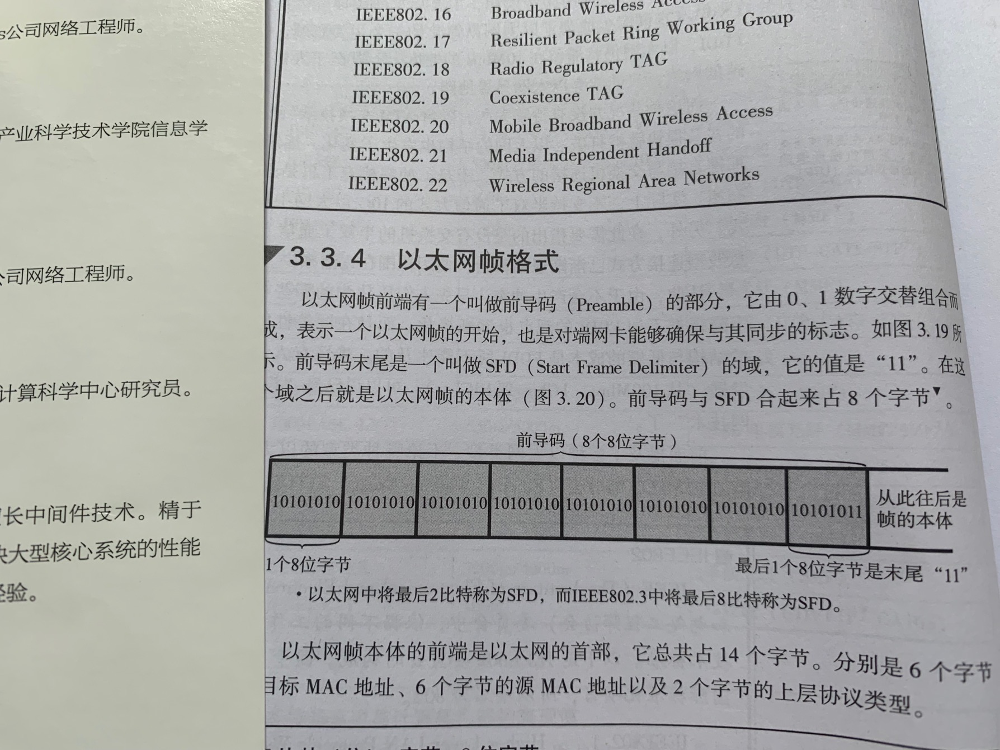
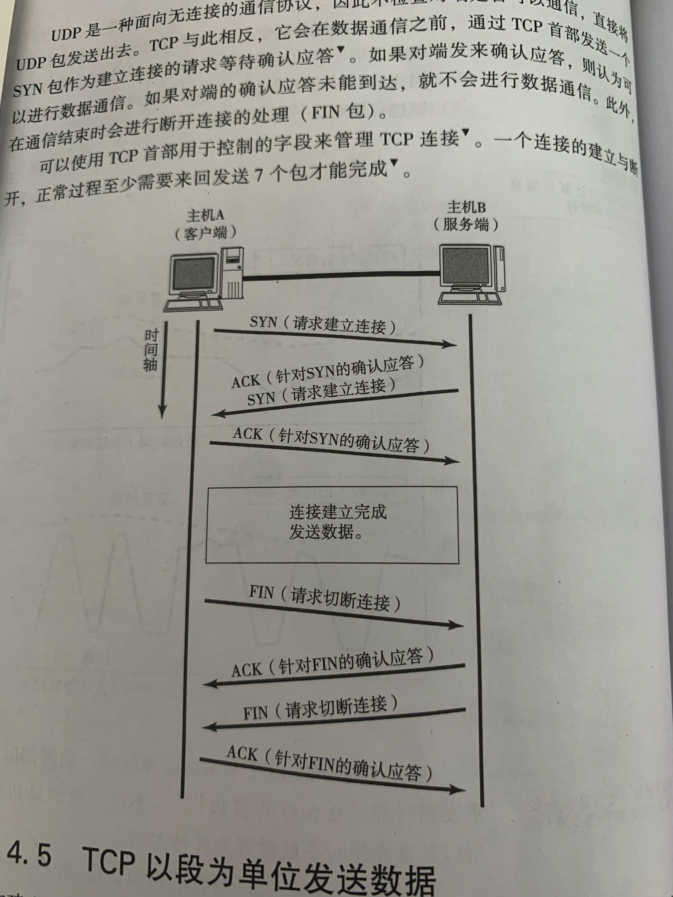
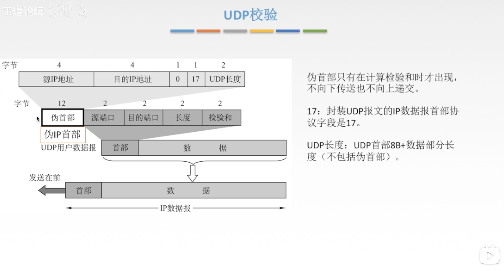
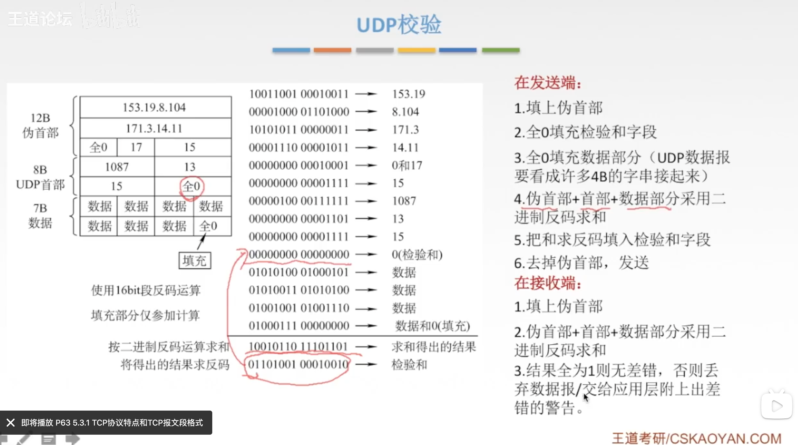
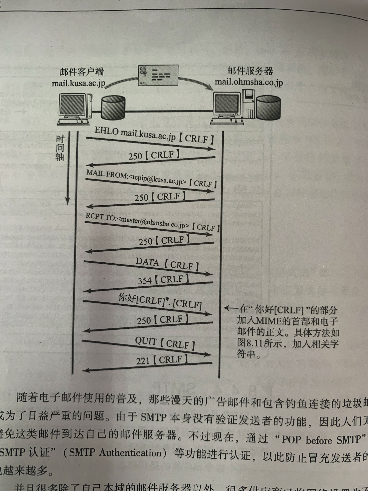

# 图解TCP/IP
[TOC]
## 网络基础知识
### 计算机网络的背景
计算机网络经历了从独立模式到网络互联的模式，再从计算机通信到信息通信的过渡。
- 独立模式：每台计算机都是独立的，各自处理自己专属的业务。
- 网络互联模式：计算机不再是相互独立的了，通过网络的方式，计算机可以处理不同的业务。
- 计算机通信：起初计算机的通信范围只是小范围的，无法了解超出范围之外的信息
- 信息通信：计算机通信的范围越来越广，只要联网，就可以了解到世界各地的信息。

### 计算机与网络发展的7个阶段
计算机与网络经历了7个阶段：批处理、分时系统、计算机之间的通信、计算机网络的产生、互联网的普及、以互联网技术为中心的时代、TCP/IP。
- 批处理：当时的计算机还没有普及，为了让更多人可以使用上计算机，出现了批处理系统：批处理系统是指：事先让人们将要运行的程序和数据装入卡带或磁带中，然后计算机通过一定的顺序从中读取数据。
- 分时系统：批处理系统的出现，让更多的人使用上了计算机，但是缺点就是：交互能力太差了，一个程序从放进卡带，到看到结果，要经历很长一段时间。因此，为了解决这个问题，就出现了分时系统：分时系统是指将CPU分成一个个的时间片，每个时间片执行不同的内容，交替进行、这样就会让用户感觉自己在独占这台计算机，而且交互性也大大提高了。
- 计算机之间的通信：在分时系统中，计算机与终端的通信是通过线路连接的，但这并不意味着计算机之间也已经相互连接了。当时的计算机如果想跟另一台计算机进行通信，那么就要将数据保存到磁带上，然后让另一台计算机去读取。
- 计算机网络的产生：为了解决计算机之前的通信局限性，计算机网络诞生了，不管是大型的超级计算机或主机到小型的个人电脑，已经可以相互通信了。这个阶段，除了网络的诞生，还有一个重要的发明是：窗口系统，窗口系统的出现，让用户可以同时打开多个程序。
- 互联网的普及：网络的出现，让计算机之间的通信成为了可能，但此时，也遇到了更大的难题：厂家怎么做到在保证自家产品的互联行的同时，还可以兼容其他厂商的产品，以及怎么做到降低计算机的规模以及生产成本。
- 以互联网技术为中心的时代：此时，已经打造出一个 不同计算机之间可以相互通信的低成本的网络环境了。但这个阶段的目标在于：以互联网为中心，不只是计算机，手机、电话等智能设备也可以相互通信。
- TCP/IP：互联那个是由许多独立发展的网络通信技术融合而成的，能够使它们之间不断融合并实现统一的正式TCP/IP技术。

### 协议
**  随处可见的协议 **
现在互联网中使用的网络体系结构是TCP/IP，TCP/IP是众多协议的集合，包括TCP、UDP、IP、SMTP、ICMP、HTTP等。

** 协议的重要性 **
简单来说，协议是计算机与计算机之间实现网络通信时需要事先达成的一种约定。协议好比人与人之间交流使用的语言，如果语言不通，那么两个人之间是无法完成正常交流的，计算机同样如此，只有遵守了相同的协议，计算机之间才会有正常通信的可能。

** 既然协议如此重要，那么计算机通信遵守的协议是由谁来制定的呢？ **

### 协议由谁规定
随着计算机重要性的不断提高，很多公司意识到了兼容性的重要性，尽管两台计算机在物理层面上实现了互联，但是由于遵守的协议不同，也是无法完成正常通信的。为了解决这个问题，ISO组织制定了一个国际标准ISO，ISO的出现让通信协议变得标准化，但是目前社会上遵守的大都是民间组织IETF的TCP/IP协议。

### 协议分层与OSI参考模型
** 协议的分层 **
在计算机网络体系结构中是分成了很多层，比如OSI参考模型，是将网络体系结构分成了7层，而每一层应该对应不同的协议，每个分层都接收由下层提供的服务，并且为上层提供制定的服务。

** OSI参考模型 **
OSI参考模型分成了7层：物理层、数据链路层、网络层、传输层、会话层、表示层、应用层。

** OSI参考模型中各个分层的作用 **
- 应用层：为应用程序提供服务并规定应用程序中通信相关的细节。包括文件传输、电子邮件、远程登录等协议。
- 表示层：将应用处理的信息转换为合适网络传输的格式，或将来自下一层的数据转换为上层能够处理的格式。因此它主要负责数据格式的转换。
- 会话层：负责会话的连接与断开。只是规定建立怎么样的连接、什么时候需要连接，连接多久，什么时候断开连接，而具体的连接是由传输层来实现的。
- 传输层：起着可靠传输的作用。只在通信双方节点上进行处理，而无需在路由器上处理。
- 网络层：将数据传输到目标地址。这一层的主要作用是：负责寻址和路由选择。
- 数据链路层：负责物理层面上互连的节点之间的通信传输。例如1个以太网相连的2个节点之间的通信。
- 物理层：负责将比特流转换为电信号，然后在链路上进行传输。

### OSI参考密性通信处理举例
** 接下来是举🌰来说明7层网络模型的功能 **

** 7层通信 **
假设使用主机A的用户A要给使用主机B的用户B发送信息。
发送方从第7层、第6层到第一层由上至下按顺序传输数据，而接收端则从第1层、第2层到第7层由下至上向每个上一级分层传输数据。每个分层上，在处理由上一层传过来的数据时可以附上当前分层的协议所必须的“首部”信息。然后接收端在接收数据时将数据“首部”与“内容”分离，再转发给上一层，并最终将发送端发送的数据恢复原状。

** 应用层 **
以邮件为🌰
发送邮件时，应用层会在要传送的数据的前端附加一个首部信息，该首部标明邮件的收件人以及内容，接收端接收后之后，分析数据首部与数据征文，拿到里面的信息。

** 表示层 **
如果用户A和用户B使用的邮件软件是一样的，那么是可以正常接收邮件的，但是如果用户A和用户B所使用的邮件软件是不一样的，那么就可能会出现用户A发出的邮件，用户B接收到之后看到的信息是乱码的。那表示层就是为了解决这个问题而出现的：表示层会将应用层传下来的数据进行数据格式转换，然后在数据的前端加上首部，标明转换的编码格式。当接收端接收数据之后根据编码格式转换成所用邮件的特定格式。

** 会话层 **
会话层相当于 对连接的管理层，比如发送端要发送5封邮件到接收端，那么会话层就会决定是以怎么样的顺序去发送这5封邮件，比如一次性发送5封邮件然后断开连接，或者发1封断一次等等，以及决定好什么时候开始连接，什么时候断开连接。

** 传输层 **
会话层只是对何时建立连接，建立怎样的连接，然后何时断开连接等问题进行管理，而真正起到实际传输数据功能的是 传输层 。

传输层的作用在于：进行建立连接和断开连接的处理，在两台主机上实现逻辑上的通信，而且传输层是要做到可靠传输的。

** 网络层 **
网络层的作用是：在网络互联的环境下，将数据从发送端发送到接收端，而定位到接收端是靠IP地址来实现的。

** 数据链路层 **
将来自网络层的数据加上包含MAC地址的首部进行数据的包装。MAC地址的作用在于在局域网内，根据MAC地址找到目标主机。

** 物理层 **
将数据的0、1信号转换为电信号，然后在物理线路上进行传播。

### 传输方式的分类
** 面向有连接型与面向无连接型 **
- 面向有连接型：在通信之前，先建立一条连接，通信完成之后，释放连接。
- 面向无连接型：不管接收端是否能确定收到数据，都直接发出数据。

** 电路交换和分组交换 **
- 电路交换：电路交换是建立在有线路连接的情况下，它是以交换机为中转站来转发数据的。两台主机要实现通信，那么必须要有一条电路相连，而且是独占整条线路的。
- 分组交换：电路交换的劣势在于：独占整条线路，利用率低，而且多台主机之间要进行通信的话线路复杂。而分组交换在于利用路由器为中转站来转发数据，将一个数据分成很多个分组，并标上所属的数据包以及分组号，然后传输到目的主机上。分组交换的优势在于：利用率高，多台主机可以共享一条线路，但会存在的问题是：可靠性会相对较低，可能会出现丢包等现象。

** 根据接收端数量分类 **
根据接收端数量分类：大概分为以下四种。
- 单播：简单来说就是1对1通信。
- 广播：对一个局域网内的计算机进行通信。
- 多播：对特定成员组的通信。比如参加同一个视频会议的群里的人就属于一种多播的情况。
- 任播：在特定的多台主机中选出一台作为接收端的一种通信方式。

### 地址
在通信传输中，发送方和接收方都被当作一个通信实体，他们都有一个地址信息来被标识出来。
而在TCP/IP网络体系结构中，有MAC地址、IP地址以及端口号。

** 地址的唯一性 **
地址在通信当中起着非常重要的作用，地址是直接标识一个通信主体的，为了让地址可以发挥出应有的作用，那么应该始终保持地址的唯一性。
那对于上述讲的广播和多播，这么多台主机当作目标主机，目标地址应该是怎样的呢？
- 对于广播：目标地址则是当前局域网的地址
- 对于多播：多台目标主机会被标上一个新的多播地址

** 地址的层次性 **
当通信主体不是很多时，通过唯一的地址可以定位到目标通信主体，但是如果通信主体的数量多了起来，每个通信主体都有自己特定的地址，那么当发送端转发信息时，需要在众多的地址中寻找出目标地址的路径，其实是会耗费很多时间的。

那么应该怎么做去让寻找目标地址的工作轻便起来呢？

答案就是将地址进行层次化分类，举个例子：电话号码也是有层次化的，国家区号、国内区号，通过一层又一层的区号来寻找出目标通信主体，而地址也是这样，通过分层来快速地定位到目标主体。

** IP地址有层次性，那MAC地址有层次性吗？ **
MAC地址是没有层次性的。在IP地址的作用下，已经可以定位当目标主机所在的局域网了，然后再通过MAC地址转发到目标主机。在局域网内的主机数已经很少了，再次分层其实会耗费更多的时间。
而且MAC地址由设备的制造厂商针对每块网卡进行分别指定的。人们可以通过制造商识别号、制造商内部产品编号以及产品通用编号来确保MAC地址的唯一性。这样看来，MAC地址是不可能分层次的，因为一个局域网内可能每台主机的制造商识别号都不一样，那就谈不来分层了。

MAC寻址中所参考的表叫做地址转发表，而IP寻址中所参考的表叫做路由控制表。MAC地址转发表中所记录的是实际的MAC地址本身，而路由表中记录的IP地址则是集中了之后的网络号。

### 网络的构成要素
搭建一套网络环境要涉及各种各样的电缆和网络设备。
搭建网络的主要设备及作用：
- 网卡：又称为网络适配器，使计算机联网的设备。
- 中继器/集线器：在物理层上延长网络的设备。
- 网桥/交换机：在数据链路层上延长网络的设备。
- 路由器：通过网络层转发分组数据的设备。
- 4 ～ 7层交换机：处理传输层以上各层网络传输的设备。
- 网关：转换协议的设备。

** 通信媒介与数据链路 **
计算机网络是指计算机与计算机之间相连的网络。计算机与计算机之间是通过电缆来连接的。而电缆分为很多种，在以太网内，用到的电缆主要有同轴电缆、双绞线电缆、光纤电缆。

** 传输速率 与 吞吐量 **
- 在数据传输过程中，两个设备之间数据流动的物理速度称为传输速率。传输速率也可看作为带宽，是指每秒传输多少数据，而不是单位数据流动的速度有多快。
- 吞吐量：在数据传输过程中，两个设备之间的传输速率实际上称为吞吐量。吞吐量不仅可以表明带宽、还可以衡量计算机CPU的处理速度、网络的拥堵情况等等。

** 网卡 **
任何一台计算机想要连接网络，都必须要使用网卡。网卡全称为网络接口卡（NIC），也称为网络适配器、网卡、LAN卡。
目前网卡上已经集成了连接到局域网的功能，有些计算机已经有内置的网卡，若没有内置的，那得将网卡插入拓展槽上。

** 中继器 与 集线器 **
1.中继器和集线器都是在物理层上对信号进一步扩大的设备。
2.信号在传输过程中会因为各种因素导致被减弱，这时候中继器/集线器就可以对减弱的信号进行放大，让它恢复成原来正常的信号。
3.中继器和集线器的区别在于：集线器其实是中继器的进一步拓展，中继器只有两个端口，而集线器是有多个端口的。
4.中继器和集线器一般是不可以连接两个传输速录不同的网段的。因为中继器和集线器只是简单地将信号重新放大，内部是没有缓存的，无法向网桥、交换机、路由器等内部是有缓存的。

** 网桥 与 交换机 **
1.网桥 与 交换机是数据链路层上连接两个网络的设备。
2.网桥的工作原理是：将收到的数据帧进行帧检验序列，检测要转发的数据帧是否有错，如果有错则丢弃，没错则继续转发。
3.网桥的工作原理和交换机的是类似的，二者的区别在于：
    1.网桥只有两个端口，而交换机是有多个端口的。
    2.交换机是具有存储转发的功能的，可以连接两个不同传输速率的网断。
    3.交换机是有自适应学习能力的。交换机转发数据帧靠的是自身学习得来的一个地址转发表，而网桥本身只有两个端口，从一个端口进入，数据自然是要从另一个端口出去的，不需要具备自适应学习能力。
    
** 路由器 / 3层交换机 **
1.路由器是连接网络与网络的设备，可以将分组报文发送到另一个目标路由器地址上。
2.路由器也是有存储转发功能的，可以连接两个不同的数据链路。

** 4 ～ 7 层交换机 **
在OSI参考模型中，4 ～ 7 层交换机主要处理从传输层到应用层的数据。
在使用过程中，4 ～ 7 层交换机主要用于充当负载均衡器的设备。举个🌰，对于并发访问量非常大的一个企业级的Web站点，使用一台服务器的话很难满足访问需求，那么一般是同时配有几个服务器的，而企业为了方便用户，一般只会提供一个URL供用户访问，当用户访问时，请求数据就会来到负载均衡器，然后负载均衡器就会自动调度服务器去返回数据。

** 网关 **
1.网关是OSI参考模型中负责将从传输层到应用层的数据进行转换和转发的设备。
2.网关负责协议的转换以及数据的转发。
3.举个🌰：
    在连接互联网的电脑发送一封邮件到手机上，两者在传输层到应用层可能会使用了不同的协议；我们知道，协议就好比人们交流的语言，语言不通，是无法正常交流的。那么，为了消除电脑和手机之间协议的差异，网关可以转换不同协议，然后将数据进行转换，那么电脑发出的邮件，手机也就可以正常阅读了。
4.在同一种类型的协议上转换数据的叫做应用网关。
    应用网关主要充当于代理服务器的身份。为了控制网络流量（负载均衡器）和安全考虑（不暴露出实际服务器的地址），有时会使用代理服务器，起到一种数据转发的功能。
    而防火墙，其实也是一种通过网关通信来提高安全性的产品。防火墙是为了在计算机内网、外网建立一个安全护罩，那么其实就是通过网关来转发数据。

## TCP/IP基础知识
** TCP/IP 被大力推广的原因 **
OSI协议 与 TCP/IP协议的区别在于：OSI协议是先有模型，然后才去投入实践当中，而TCP/IP是拟定一个草案，然后让很多设备去实践，不断修正最终得出的一个标准，所以相对来说，TCP/IP协议的实用性更高。

### TCP/IP协议分层模型
** TCP/IP 与 OSI 参考模型 **
两个模型的前四层的作用都是类似的，而TCP/IP的最后一层是应用层，对应着OSI参考模型中的应用层、表示层、会话层。

** 物理层 **
物理层是负责传输电信号的传输媒介。

** 数据链路层 **
将来自网络层的数据加以首部组装成帧，帧中的MAC地址可以标识数据链路中的目标主机。

** 网络层 **
网络层的主要协议是IP协议。IP协议的作用是将分组数据包转发到目的主机。
IP协议不具有重发机制，即使分组数据包未能到达目标主机也不会重发，因此，属于非可靠传输协议。
ICMP协议：IP数据包在传输过程中出现异常导致不能到达目标主机，那么就会发送一个ICMP包给发送端告诉它数据包不可达。此外，ICMP还可用来查询网络的健康状况。
ARP协议：将分组数据包中的IP地址转换为MAC地址。

** 传输层 **
传输层的主要功能就是能够让应用程序之间实现通信。计算机内部，由于窗口系统的出现，用户可以同时运行多个软件，为了在通信过程中区分不同的软件，那么就需要端口号来区分不同的程序。

- TCP协议：TCP是一种面向有连接的传输层协议。它可以保证两端通信主体之间的通信可达。此外，为了提高网络的利用率，TCP协议中定义了各种各样复杂的规范，因此不利于视频会议等场合使用。
- UDP协议：UDP跟TCP不同，UDP是面向无连接的传输层协议。UDP不会关注目标主机是否收到了传送过去的数据。

** 应用层 **
TCP/IP应用的架构大多数属于客户端/服务端类型。提供服务的程序叫服务端，接受服务的程序叫客户端。
浏览器与服务器之间通信所用的协议是HTTP。所传输数据的主要格式是HTML。

** 电子邮件 **
电子邮件其实就是在网络上发送信件。有了电子邮件，不管多远，只要连着互联网就可以相互发送邮件。发送电子邮件时用到的协议叫做SMTP协议。
最初，人们只能发送文本格式的电子邮件。然而现在，电子邮件的格式由MIME协议扩展以后，就可以发送声音、图像等各式各样的信息。

** 文件传输（FTP） **
文件传输是指将保存在其他计算机硬盘上的文件转移到本地的硬盘上，或将本地硬盘的文件传送到其他机器硬盘上的意思。
在FTP中进行文件传输时会建立两个TCP连接，分别是发出传输请求时所要用到的控制连接与实际传输数据时所要用到的数据连接。

** 远程登录（TELNET 与 SSH） **
远程登录是指登录到远程的计算机上，使那台计算机上的程序得以运行的一种功能。

** 网络管理（SNMP） **
在TCP/IP中进行网络管理时，采用SNMP协议。使用SNMP管理的主机、网桥、路由器等称作SNMP代理，而进行管理的那一段叫做管理器。
在SNMP的代理端，保存着网络接口的信息、通信数据量、异常数据量以及设备温度等信息。这些信息可以通过MIB访问。
一个网络范围越大，结构越复杂，就越需要对其进行有效的管理。而SNMP可以让管理员及时检查网络拥堵情况，及早发现故障，也可以为以后扩大网络收集必要的信息。

### TCP/IP分层模型与通信示例
本节介绍一下在使用TCP/IP时，从应用层到物理媒介为止的数据处理过程。
每个分层中，都会以上层传递下来的数据作为本层的内容，然后在内容上附加一个首部，该首部主要包含该层的协议信息。

** 发送数据包 **
举个🌰：假设使用计算机A的甲向使用计算机B的乙发送一封邮件；
1.应用程序的处理：
    首先将邮件的内容转换为通用的编码格式（表示层的作用），然后至于这封邮件什么时候开始发送取决于会话层的功能，有可能是甲点击发送就会发送，也有可能是几封邮件一起发送（会话层的作用），发送时将转换后的数据传送给传输层。
    
2.TCP模块的处理：
    TCP会根据应用的指示（会话层的管理作用），负责建立连接，发送数据以及断开连接。TCP将应用层传来的数据安全可靠地传输到目的端。
    为了实现TCP这个功能，TCP会在应用层传下来的数据上添加一个首部，该首部包含着源端口号（目的端返回信息时充当目的端口号）和目的端口号（为了标识对端上的应用程序）、序号（用来表示包中的数据是发送端整个数据中第几个字节的序列号）、检验和（TCP保证的是可靠传输，用来判断数据是否出错）。随后将附加了TCP首部的包发送给IP。
    
3.IP模块的处理 
    IP层将TCP层传来的包当作本层的数据内容，然后附加上一个包含本层协议信息的首部。该首部主要包含接收端IP地址以及发送端IP地址，还有一个类型信息用来判断其后面的数据是TCP还是UDP的信息。
    IP包生成之后，会根据路由控制表来决定接受该包的路由或主机，然后根据ARP协议，将下一个要到达的站点的MAC地址转换出来，传给数据链路层。
    
4.网络接口（以太网驱动）的处理
    IP包当作本层的数据，然后在IP包的基础上添加一个首部。该首部包含着接收端MAC地址、发送端MAC地址以及类型信息用来判断当前网络类型。然后将新包传给物理层进行传输。
    发送处理中的FCS由硬件计算，添加到包的最后。设置FCS的目的是为了判断数据包是否是由于噪声而被破坏。
    
** 总结数据包的信息组成 **
    数据包基本上都是在上一层传下的包为数据内容，然后附加上一个表示本层协议信息的首部，组成一个新的包。
    每层包大概包含两个信息：一个是发送端地址和接收端地址，另一个是上一层的协议类型信息。
    
** 数据包接收处理 **
1.网络接口（以太网驱动）的处理
    主机收到以太网包之后，首先先根据MAC地址来判断是不是发给自己的包，是的话就收下，不是的话就丢弃。
    收下这个包之后，再去看这个包的上一层的类型信息，如果是IP协议，那么就传给处理IP的子程序，如果是ARP，那么就传给处理ARP的子程序。如果收到一个无法识别的协议类型，那就丢弃数据。
    
2.IP模块的处理
    IP模块收到数据包之后，也是做类似的处理，先查看目的IP地址是不是和自己的IP地址匹配，匹配的话，那么就查看数据包的上一层协议的类型信息，看是TCP还是UDP，然后传给对应的子程序处理。如果当前接收数据包的是一个路由器，那么数据包的目的IP地址往往不是自己的IP地址，那么就会查看路由控制表来寻找下一步要转发的路由。
    
3.TCP模块的处理
    在TCP模块中，首先会计算一下校验和，看数据是否有出错，然后检查是否在按照序号接收数据，最后检查端口号，确定具体的应用程序。
    数据接收完毕后，接收端会发送一个“确认收到”的信号给发送端。如果这个回执信息未能到达发送端，那么发送端就会认为接收端没有接收到数据而一直反复重发。
    数据被完整接收之后，会传给由端口号识别的应用程序。
    
4.应用程序的处理
    接收端应用程序会直接收到发送端发来的数据，通过数据的类型转换，解析之后，接收端会得知该邮件的收件人是乙，如果接收端上没有乙的邮件信箱，那么主机B返回给发送端一个“无此收件地址”的报错信息。
    如果有，那么邮件就会被保存到本机的硬盘上，如果保存失败，也会给发送端发送一个”处理异常“的回执。
    
## 数据链路
### 数据链路的相关技术
** MAC地址 **
MAC地址用于识别在数据链路中互连的通信节点。在以太网或FDDI或无线LAN、蓝牙设备中都是使用相同规格的MAC地址。

MAC地址长48比特，主要有三部分组成。
    - 第1位：0表示单播地址，1表示多播地址；第2位：0表示全局地址，1表示本地地址
    - 第3 ～ 24位：厂商识别码
    - 第25 ～ 48位：厂商内识别码

准确来说，分配MAC地址时都是唯一的，但是也会有例外；比如：一台主机同时启动多个虚拟机时，由于这些虚拟机是公用硬件的，那么这些主机的MAC地址是由虚拟软件来分配的，因此可能会出现不唯一的情况。

** 共享介质型网络 **
从通信戒指的使用方法上看，网络可分为共享介质型和非共享介质型，

共享介质型指的是多个设备共享一个通信介质的一种网络。在这种方式下，设备之间使用同一个载波信道进行发送和接收。为此，一般采用半双工通信方式，并有必要对介质进行访问控制。

而共享介质型网络中有两种介质访问控制方式：一种是争用方式，另一种是令牌传递方式。

** 争用方式 **
争用方式指争夺获取数据传输的权力，也叫CSMA（载波监听多路访问）。这种方法通常令网络中的各个站采用先到先得的方式占用信道发送数据，如果多个站同时发送帧，则会产生冲突现象。也因此会导致网络拥堵与性能下降。

在一部分以太网中，采用了改良CSMA的另一种方式 - CSMA/CD（载波监听，冲突检测）。工作原理如下：
    1.如果载波信道是空闲的，那么任何站点都可以发送数据
    2.检查是否发生了冲突。一旦发生冲突时，放弃发送数据，同时立即释放载波信道。
    3.放弃发送以后，随机延时一段时间，再重新争用介质，重新发送帧。
    
而站点是如何做到监听到是否发生了冲突的呢？
站点是会一直检测是信道的电压，如果电压超过一定范围，就认为发生了冲突。接收端检测已收到的数据帧中的FSC，也会检测到包出了问题，自然会丢弃。

** 令牌传递方式 **
令牌传递方式是沿着令牌环发送一种叫做“令牌”的特殊报文，是控制传输的一种方式。只有获得令牌的站点才能发送数据。这种方式有两个特点：一是不会有冲突，二是每个站都有通过平等循环获得令牌的机会。

首先在令牌环中循环传递一个令牌报文，比如A站点想要发送数据，那么当令牌到达A站点时，A站点会修改令牌上的标志信息（标志为携带了数据，不是空闲状态），然后将令牌携带着要发送的数据组成一个新报文，传出去，当其他站点收到时，会检查是不是发送给自己，不是就继续传给下一个站点；是的话就将令牌的标志信息改为“已接收到数据”，然后继续传令牌出去，当站点A知道数据已被接收，那么就继续传递令牌。

** 非共享介质网络 **
在共享介质网络下是半双工通信，而在非共享介质网络下是全双工通信，对比之下，非共享介质网络的效率会更加的高。

网络中的每个站点直连交换机，当站点要发送数据帧时，该帧会直接转发到交换机，交换机根据自身维护的地址转发表将该帧转发出去。

** 根据MAC地址转发 **
以太网的交换机其实就是有多个端口的网桥。它们根据数据链路层中的每个帧的目标MAC地址，决定从哪个网络接口发送数据。这时所参考的是用来记录发送接口的表 - 地址转发表。

这种转发表的内容不需要使用者在每个终端端或交换机上手工设置，而是可以自动生成的。比如：站点A发送数据帧经过交换机时，交换机就会自动记录下站点A是从哪个端口进来的，然后就记录在表上。

交换机转发方式有两种，一种是直接转发，一种是存储转发。
- 存储转发是收到数据帧时，先检查帧尾部的FCS，如果数据没有错误然后再转发。
- 直接转发是收到数据帧时，直接查表转发。

** 环路检测技术 **
通过网桥连接网络时，很容易出现环路的情况。最坏的情况下，数据帧会在环路中一直反复转发，从而会导致网络瘫痪。那么，为了解决这两种问题，具有生成树和源路由两种方式。

** 生成树方式 **
以某一个网桥为构造树的根，并对每个端口设置权重。这一权重可以由网络管理员适当设置，指定优先使用哪些端口以及发生问题时该使用哪些端口。每个网桥隔1 ～ 10秒内会相互交换BPDU包，从而判断哪些端口使用哪些不使用，以消除环路。一旦发生故障，则自动切换通信线路，利用那些没有被使用的端口继续进行传输。

** 源路由法 **
该方式可以判断发送数据的源地址是通过哪个网桥实现传输的，并将帧写入RIF。网桥则根据这个RIF信息发送帧到目标地址。因此，即使网桥中出现了环路，数据帧也不会被反复转发。

** VLAN **
进行网络管理的时候，时常会遇到分散网络负载、变换部署网络设备的位置等情况，如果采用采用带有VLAN技术的网桥，就不用实际修改网络布线，只需修改网络的结构即可。
VLAN其实就是：交换机按照其端口号区分了多个网段，从而区分了广播数据传播的范围，减少了网络负载并提高了网络的安全性。通过给每个网段设置一个VLAN ID的标签进行唯一标识，交换机在传输帧时，会将该标签插入在数据帧的首部，根据这个标签来决定将数据帧发送给哪个网段。

### 以太网
** 以太网连接形式 **
在以太网普及之初，一般采用多个终端使用同一根同轴电缆的共享介质型连接方式。这种方式下很容易发生冲突，因此也衍生出了CSMA/CD 载波监听/碰撞检测的方式来减少冲突的发生。

而现在，随着互连设备的处理能力以及传输能力的提高，一般都采用终端与交换机之间独占电缆的方式实现以太网。这种方式下发生冲突的机率已经大大减少，几乎没有了。

** 以太网的帧格式 **
以太网前端有一个叫做前导码的部分，它由0、1数字交替组合而成，表示一个以太网帧的开始，也是对端网卡能够确保与其同步的标志。前导码末尾一个叫做SFD的域，它的值是“11”。在这个域之后就是以太网帧的本体。前导码与SFD合起来占8个字节。

以太网帧本体的前端是以太网的首部，它总共占14个字节。分别是6个字节的目的MAC地址，6个字节的源MAC地址，以及2个字节的类型信息。紧随帧头后面的是数据，一个数据帧所能容纳的最大数据范围是46 ～ 1500个字节。帧尾是一个叫做FCS（帧检验序列）的4个字节。
FCS中保存着整个帧除以多项式的余数。在接收端也用同样的方式来计算，如果得到的FCS的值相同，就判定所接收的帧没有差错。

而上一节中提到的VLAN，就会在以太网帧的首部添加一个VLAN的字段信息。

### 其他数据链路
** HDMI **
HDMI 意为高清晰度多媒体接口。它可以通过一条缆线实现图像和声音等数字信号的高品质传输。曾主要用于DVD/蓝光播放器、录像机、AV功效等设备与电视机、投影仪的连接，现在也逐渐开始用于计算机或平板电脑、数码相机与显示器的连接。

### 公共网络
公共网络有很多种，下面只讲述一种 - VPN
VPN，我们可以理解为虚拟专用网络，这种服务包括IP-VPN和广域以太网。
** IP - VPN **
意思就是在IP网络上建立VPN。
网络服务商提供一种在IP网络上使用MPLS技术构建VPN的服务。其中MPLS在IP包中附加一个叫做标签的信息进行传输控制。每个用户的标签信息不同，因此在通过MPLS网时，可以轻松地判断出目标地址。这样以来就可以将多个不同用户的VPN信息通过MPLS网加以区分。

** 广域以太网 **
服务商提供所提供的用于连接相距较远的地域的一种服务。IP-VPN是在IP层面的连接，广域以太网则是在作为数据链路层的以太网上利用VLAN（虚拟局域网）实现VPN的技术。
广域以太网以企业专门使用服务提供商构建的VLAN网络为主要形式。只要指定同一个VLAN，无论从哪里都能接入到同一个网络。

## IP协议
### IP即网际协议
TCP/IP的心脏是互联网层。这一层主要由IP和ICMP两个协议组成。
网络层的主要作用是“实现终端节点之间的通信”。这种终端节点之间的通信也叫“点对点通信”。
而网络层的下一层数据链路层的主要作用是在互连同一种数据链路的节点之间进行包传递。
准确来说，主机的定义应该是指“配置有IP地址，但是不进行路由控制的设备”，而既配置有IP地址，也进行路由控制的设备应该叫做路由器。

### IP基础知识
IP大致分为三大作用模块，它们是IP寻址、路由（最终节点为止的转发）以及IP分包与组包。

** IP地址属于网络层地址 **
IP地址属于网络层地址，是作为网络上的通信主机的标识符。而MAC地址是用来标识同一个数据链路中不同计算机的一种识别码。

** 路由控制 **
路由控制是指将分组数据发送到最终目标地址的功能，

** 发送数据至最终目标地址 **
Hop译为跳。它是指网络中的一个区间。IP包正是在网络中一个跳间被转发的。因此IP路由也叫做多跳路由。在每一个区间内决定着包在下一跳被转发的路径。

一跳：是指利用数据链路层以下分层的功能传输数据帧的一个区间。以太网等数据链路中使用MAC地址传输数据帧。此时的一跳是指从源MAC地址到目标MAC地址之间传输帧的区间。也就是说它是主机或路由器网卡不经其他路由器而能直接到达的相邻主机或路由器网卡之间的一个区间。

多跳路由：是指路由器或主机在转发IP数据包时只指定下一个路由器或主机，而不是将到最终目标地址为止的所有通路全都指定出来。（多跳路由其实就是在网络中经历多个一跳而到达目标主机的路由）

** 路由控制表 **
为了将数据包发给目标主机，所有主机都维护着一张路由控制表，该表记录着IP数据在下一步应该发往哪个路由器。IP包将根据这个路由表在各个数据链路上传输。

** 数据链路的抽象化 **
IP层的存在可以将数据链路抽象化，不论主机与哪种数据链路连接，其IP地址的形式是不会变的。以太网、无线局域网、PPP等，都不会改变IP地址的形式。
而对于不同的数据链路有个最大的区别，就是它们各自的最大传输单元（MTU）不同。以太网的MTU是1500个字节，在FDDI则是4352字节，而在传输过程中可能会出现传输比MTU还要打的数据包，那么为了解决这个问题，IP会进行分片处理，将较大的IP包分成多个较小的IP包。分片的包到了目标主机以后会被重新组合起来传给上一层。即从IP层来看，它完全可以忽略数据包在途中的各个数据链路上的MTU，而只需按照源地址发送的长度接收数据包。IP层就是以这种方式抽象化了数据链路层，使得从上层更不容易看到底层网络构造的细节。

** IP属于面向无连接型 **
IP面向无连接。即在发包之前，不需要建立与对端目标地址之间的连接。
IP采用面向无连接，主要原因有两点：一是为了简化，二是为了提速。面向连接比面向无连接处理相对复杂很多，甚至管理每个连接本身就是一个相当繁琐的事情，而且面向连接相比之下传输速度会更加地慢。而当需要有连接时，IP层的上一层会解决这个问题。

### IP地址的基础知识
** IP地址的表示 **
IP地址（IPv4地址）由32位正整数来表示。
实际上，IP地址并非根据主机数量来分配的，而是每一台主机上的每一块网卡（NIC）都得设置IP地址。

** IP地址由网络和主机两部分标识组成 **
IP地址是由网络标识和主机标识来组成的。网络标识在数据链路的每个段配置不同的值。网络标识必须保证连接的每个段的地址不相重复。而相同段内相连的主机必须有相同的网络地址。IP地址的主机标识则不允许在同一个网段内重复出现。

IP包被转发到途中某个路由器时，正是利用目标IP地址的网络标识。只需要网络标识，就可以得知目标主机是否在此网段上。

** IP地址的分类 **
起初，IP地址是分为了四类，有A类、B类、C类和D类。
- A类：前8位是网络号，第1位是0
- B类：前16位是网络号，前2位是10
- C类：前24位是网络号，前3位是110
- D类：前32位是网络号，前4位是1110。D类地址没有主机号，常被用于多播。

** 广播地址 **
广播地址用于在同一个链路中相互连接的主机之间发送数据包。将IP地址的主机号全部设置为1，就成了广播地址了。

广播分为两种：本地广播和直接广播。
- 在本网络内的广播叫做本地广播。那么这个广播地址的IP包是会被路由器屏蔽的，即是不会转发出去的。
- 在不同网络之间的广播叫做直接广播。

** IP多播 **
多播用于将包发送给特定组内的所有主机。
在多播技术出来之前，在实现上往往是通过复制1对1通信的数据，将其同时发送给多个主机的方式。还有一种实现方式是使用广播的方式，将数据包发给所有的终端主机，在IP的上一层再去判断当前数据包是不是自己需要的。上述两种实现方式，虽然从某种意义上说是实现了多播的需求，但是这种方式自然会大大增加网络的负担。

** IP多播与地址 **
多播使用D类地址。因此，如果从首位开始前4位是 1110，那么就可以认为是多播地址了。

** 子网掩码 **
直接使用A类或B类地址，由于同一个数据链路上可连接的主机数很多，往往很多情况下，都会剩下很多未用到的主机号，因此，分类的IP地址会造成一定的浪费。那么为了解决这个问题，出现了一种新的地址分配的方式：子网掩码。

子网掩码的出现让一个IP地址的网络号和主机号不再局限于地址的分类。引入子网之后，一个IP地址就有了两种识别码，一个是IP地址本身，另一个是表示网络部分的子网掩码。

** CIDR 与 VLSM **
子网与子网掩码的存在可以在IP地址分类的基础上再次进行分类，从而大大提高了地址分配的利用率，但是由于在IP地址分类中，A类地址的主机基数过于庞大，C类主机基数又过于少，因此很多组织都是使用B类地址，随着时间推移，B类地址已经不够分配了，而A类地址却剩下很多。为了解决这种情况，又出现了一种新的解决方式：CIDR地址分配方式。

CIDR：采用任意长度分割IP地址的网络标识和主机标识。也称为无分类地址编码。

在CIDR应用初期，网络内部采用固定长度的子网掩码机制。比如，公司定义各部分的网络号是25位，但是有些部分的主机基数很少，那么也会造成地址分配的浪费。为了解决这种情况，在CIDR的基础上又衍生出了一种新的机制 - VLSM（可变长子网掩码），这是一种可以随机修改组织内各个部门的子网掩码长度的机制。根据VLSM可以将网络地址划分为主机数为500时子网掩码长度为23，主机数为50个时子网掩码长度为26。

** 全局地址 与 私有地址 **
随着互联网的迅速普及，IP地址不足的问题日趋普著。如果一直按照现行的方法采用唯一地址的话，会有IP地址耗尽的危险。于是就出现了一种新技术。它不要求为每一台主机或路由器都分配一个固定的IP地址，而是在必要的时候只为相应数量的设备分配唯一的IP地址。

对于那些没有连接互联网的独立网络中的主机，其实是不需要为它们分配一个独立的IP地址的，只需保证在这个网络内的私有地址是唯一的就可以了。不过为了不让每个独立的网络各自随意地设置IP地址，就衍生出了私有网络的IP地址。
- 10.0.0.0 ~ 10.255.255.255 (10/8) A类
- 172.16.0.0 ～ 172.31.255.255 （172.16/12）B类
- 192.168.0.0 ～ 192.168.255.255 （192.168/16）C类
包含在上述范围之内的为私有IP地址，而除此之外的IP地址为全局IP地址。

私有IP地址是不能直接跟网络上的主机进行通信的，是要经过NAT地址转换，转换成该网络的一个用于外网通信的IP地址，然后才可以跟外网进行通信的。

全局地址基本上要在整个互联网范围内保持唯一，但私有地址不需要。只需要在同一个域里保证唯一即可。在不同的域里出现相同的私有IP不会影响使用。  

### 路由控制
发送数据包时使用的地址是网络层地址，即IP地址。然而仅仅有IP地址还不足以实现将数据包发送到对端目标地址，在数据发送过程中还需要做类似于“指明路由器或主机”的信息，以便真正发往目标地址。保存这种信息的就是路由控制表。

该路由控制表的形成方式有两种：一种是管理员手动设置，另一种是路由器与其他路由器相互交换信息时自动刷新。前者叫做静态路由控制，而后者叫做动态路由控制。为了让动态路由及时刷新路由表，在网络上互连的路由器之间必须设置好路由协议，保证正常读取路由控制信息。

** IP地址与路由控制 **
IP地址的网络地址部分用于进行路由控制。路由控制表中记录的是网络地址与下一步应该发往的路由器的地址。当收到数据包时，先确定该数据包的IP地址，然后再从路由控制表中找出与其网络地址对应的表项，然后根据表项将IP包转发到对应的下一跳路由器地址上。如果同时存在多跳记录，那就按照最长前缀原则，选择一个吻合位数最多的网络地址。

** 默认路由 **
默认路由一般标记为0.0.0.0/0或default，当在路由器的记录中找不到与之匹配的网络地址的，那么就会将该IP包发往默认路由指定的下一跳地址上。

** 主机路由 **
“IP地址/32”也被称为主机路由。这种情况是整个IP地址的所有位都将参与路由。进行主机路由，意味着基于主机上网卡上配置的IP地址本身，而不是基于该地址的网络地址部分进行路由。

** 环回地址 **
环回地址是在用一台计算机上的程序之间进行网络通信时所使用的一个默认地址。计算机使用一个特殊的IP地址127.0.0.1作为环回地址。与该地址具有相同意义的是一个叫做localhost的主机名。使用这个IP或主机名时，数据包不会流向网络。

** 路由控制表的聚合 **
对内即使有多个子网，对外仍呈现出同一个网络地址。这样能够更好地构建网络，而且可以大大减少路由控制表记录的数量。比如192.168.2.0/24 与 192.168.3.0/24 可以聚合成一个网络 192.168.2.0/23 。

### IP分割处理与再构成处理
** 数据链路不同，MTU则不同 **
每种数据链路的最大传输单元（MTU）都不尽相同。是因为每个不同类型的数据链路的使用目的不同。使用目的不同，可承载的MTU也就不同。IP层数据数据链路上一层，它必须不受限于不同数据链路的MTU大小，IP层抽象化了数据链路层。当IP包大于MTU的时候，就会对IP包进行分片处理，而接收端主机收到分片的IP包之后，会对数据进行重组。

** IP报文的分片与重组 **
主机是具备对IP包分片和重组的处理的，但是路由器只具备对IP包的分片处理，并不具备重组处理的。

当要传输一个4352字节的IP包时，由于以太网的MYU是1500字节，那么主机/路由器就会对此IP包进行分片处理，当下一个路由器接收到该IP包时，如果不用再分片，就可以直接转发，如果需要分片，那就在原来的基础上再次分片，直到到达目标主机时，会分片后的IP包进行重组。

途中经过的路由器不能对IP包进行重组是因为重组的操作会耗费一定的时间，经过多个路由器的传输，耗费的时间也就越来越大，而且在路由器上对IP包重组是没有必要的。

分片后的IP包上是有标识符的，IP包上有字段可以判断当前IP包是否分片了，分片的话还可以知道当前分片在整个数据包中的片偏移，还可以判断当前数据包是否已经是最后一个分片的数据包。

** 路径MTU发现 **
分片机制也有不足，分片的存在会加重路由器的处理负荷。比如发送端链路端MTU是4300字节，本来数据包是7000字节，那么就在发送端分片了一次，当到了路由器，MTU又变成了1500，那么就要在分片一次，直到到达目标主机，每一次转发都要进行分片，这样子，对路由器确实会增加了很多的负担。

那么为了减少路由器分片的负担，提出了路径MTU发现的方案。路径MTU发现：其实就是收集从发送端到目的端的数据链路的MTU，然后取最小的MTU在发送端对IP包进行分片，那么途径的路由器都不用对IP包进行再分片处理，减少了路由器的负担。

** 路径MTU在UDP下的实现 **
1.首先在发送端主机发送IP数据报时将其首部的分片禁止设置为1.根据这个标志位，当转发过程中路由器遇到需要分片的情况，那么就会将这个包丢弃，然后给发送端传回一个ICMP报文（里面有标明MTU的大小）
2.当发送端收到这个ICMP报文之后，下一次发送数据时就会根据这个MTU对数据报进行分片处理。如此反复，直到数据包被发送到目标主机为止没有再收到任何ICMP，就认为最后一次收到的ICMP所通知的MTU就是一个合适的MTU值。如果收到的MTU的值比较多时，最少可以缓存约10分钟，在这10分钟内使用刚刚求得的MTU，但过了这10分钟以后则重新根据链路上的MTU做一次路径MTU发现。
3.在UDP的情况下，如果需要进行分片处理，那么分片后的IP包中，只有一个是带有UDP头部的，其余是不带头部的，因此当数据包到达目标主机上时，会先将所有数据进行重组，然后才传给UDP层。

** 路径MTU在TCP下的实现 **
TCP与UDP的不同在于：TCP保证的是可靠传输，UDP是不可靠传输。
那么在实现中第一点都是类似的，IP包的首部都是设置了不可以分片的，当路由器需要分片时，就会将数据包丢弃，然后给发送端发送一个ICMP报文，里面标明了MTU的大小。重发数据包时就会根据这个MTU的大小对包进行分片。
当数据包都到达接收端时，由于每一个数据包都是自带TCP头部的，不像UDP只有一个数据包带有UDP头部，因此接收端收到数据包时，是直接上交到TCP层的，不需要等到全部到达了才可以传到上一层。

### IPv6
** IPv6的必要性 **
随着互联网的普及，IPv4地址即将耗尽，为了解决这个问题，IPv6的出现可以大大增加可分配的地址数目。IPv4的地址位数是32位，而IPv6的地址位数是128位，大大增加了可分配的地址数量。

** IPv6的特点 **
- IP地址的扩大与路由控制表的聚合
- 性能提升
    - 在IPv6中，简化了包的首部结构，减轻了路由器的负担，而且在IPv6中，分片只在发送端处理好，途中经过的路由器是不用进行分片处理的。
- 支持即插即用功能
    - 即使没有DHCP服务器也可以实现自动分配IP地址
- 采用认证与加密功能
    - 应对伪造IP地址的网络安全功能以及防止线路窃听的功能（IPsec）
- 多播、Mobile IP称为扩展功能
    - 这两个功能在IPv4中是难以应用的。

** IPv6中IP地址的标记方法 **
如果IPv6的地址像IPv4的地址一样用十进制数据表示的话，是16个数字的序列，这样会显得有些麻烦。因此，IPv6和IPv4的标记方法是有区别的。一般人们将128比特IP地址以每16比特为一组，每组用冒号（：）隔开进行标记。而且如果出现连续的0时还可以将这些0省略，并用两个冒号（：：）隔开。但是，一个IP地址中只允许出现一次两个连续的冒号。

** IPv6地址的结构 **
IPv6类似IPv4一样，也是通过IP地址的前几位标识IP地址的种类。
在IPv6中，有全局单播地址，链路本地单播地址、唯一本地地址等类型。
在IPv6的环境下，可以同时将这些IP地址全都配置在同一个NIC上，按需灵活使用。

** 全局单播地址 **
全局单播地址是指世界上唯一的一个地址，用于连接在网络上的通信主体之间的通信标识。

全局单播地址的格式为：网络标识（全局路由前缀（广域网络 - 可以理解为路由聚合 - 48位） + 子网ID（站点内部 - 16位） + 主机标识（64位）

一般主机标识为主机的MAC地址，但有时为了不希望对端知道，这时的主机标识可设置为一个与MAC地址没有关系的“临时地址”。这种临时地址通常随机产生，并会定期更新。

** 链路本地单播地址 **
链路本地单播地址用于在同一个数据链路下通信主机之间的标识符，
链路本地单播地址的格式为：网络号 + 主机号
其中64位的网络号组成格式为：1111111110（10比特） + 0（54个比特）
64的主机号的组成格式为：主机的MAC地址。

** 唯一本地地址 **
唯一本地地址是用于在不连接网络的私有网络下的通信地址。
在私有网络下，如果要跟外网通信，一般是会将私有地址通过NAT转换成可以与外网通信的地址（其实也属于全局单播地址）

唯一本地地址的组成格式也为 网络号 + 主机号
其中64位的网络号组成位：1111110（7比特） + 0 + 全局ID（40比特 - 随机的） + 子网ID（该域子网地址 - 16比特）
64位的主机号为：接口主机的ID

** IPv6分段处理 **
IPv6的分片处理只会在发送端主机上进行，路由器是不参与分片，这大大减少了路由器的负荷，提高网速。因此，在IPv6中，路径MTU的发现的功能必不可少。不过在IPv6的最小MTU是1280字节。因此在嵌入式系统中对于那些有一定系统资源限制的设备来说，通常不会进行路径MTU发现，而是在发送IP包时，直接以1280字节为单位分片发出。

### IPv4首部
通过IP进行通信时，需要在数据的前面加上IP首部信息。IP首部信息包含着IP协议的必要信息。

** IPv4数据报格式 **
首部结构有：版本号、首部长度、区分服务、总长度、标识、标志、偏偏生存时间、协议、首部校验和、源地址、目的地址、可选项、填充、数据部分。

** 版本 **
4个比特组成。表示标识IP首部的版本号。比如IPv4，那么版本就是4；IPv9，那么版本就是6。

** 首部长度 **
表示IP数据报首部的长度。

** 区分服务 **
用来表示服务质量。有优先度、最低延迟、最大吞吐、最大可靠性、最小代价、最大安全、未定义 8种类型的服务质量。
但是目前几乎所有的网络都无视这些字段。因为在符合质量要求的情况下按其要求发送本身的功能实现起来十分困难。

** 总长度 **
总长度表示IP首部加数据部分的长度。

** 标识 **
标识用于在进行分片重组时，标识一样的则可视为同一个数据包下的分片，根据标识跟片偏移将分片进行重组。

** 标志 **
标志 表示 包被分片的相关信息。有3位组成。
第一位：0；暂时没用上。
第二位：指是是否进行分片；1表示不允许分片，0表示可以分片。
第三位：包被分片的情况下，表示是否还有更多的包。1表示后面还有包，0表示已经是最后一个了。

** 片偏移 **
用来标识分片后的包在原数据包下的相对位置。

** 生存时间 **
生存时间即为 TTL；指的是该数据包可以中转多少个路由器。该数据包每经过一个路由器，那么TTL就会 -1，当TTL变为0时就会将包丢弃。

** 协议 **
表示的是IP层的上一层传输层所使用的协议类型。因为接收端在接收到数据包时，会一层一层往上传递数据，当来到IP层，通过首部信息可以知道上一层的协议类型，如果是TCP，那么就会将该包的数据部分交给TCP处理的子程序。

** 首部校验和 **
该字段只校验数据报的首部，不会校验数据部分。它主要用来确保IP数据报不被破坏。

** 源地址 **

** 目标地址 **

** 可选项 **
长度可变，通常只在进行实验或诊断时使用。该字段包含以下几点信息：
    - 安全级别
    - 源路径
    - 路径记录
    - 时间戳

** 填充 **
在有可选项的情况下，首部长度可能不是32比特的整数倍。那么填充的作用就在于将首部长度填充为32比特的整数倍。

** 数据部分 **

### IPv6首部格式
IPv6的IP数据首部格式相对于IPv4发生了巨大变化。
IPv6种为了减轻路由器的负担，省去了首部校验和字段。因此路由器不再需要计算校验和，从而提高了包的转发效率。
** IPv6的数据报格式 **
包括有版本、通信量类、流标号、有效载荷长度、下一个首部、跳数限制、源地址、目标地址、扩展首部、数据部分。

** 版本 **
跟IPv4首部格式中的版本号一样。在IPv6中版本号为6.

** 通信量类 **
相对于IPv4中的区分服务，不过区分服务本来在IPv4中已经没什么建树了，但是出于研究的目的还是将此字段保留下来。

** 流标号 **
用于服务质量控制。使用这个字段提供怎样的服务已成为未来研究的话题。

** 有效载荷长度 **
有效载荷长度指的是包的数据部分的长度。

** 下一个首部 **
相当于IPv4中的协议字段，一般表示上一层所使用的协议类型。不过在有IPv6扩展首部的情况下，该字段表示后面第一个扩展首部的协议类型。

** 跳数限制 **
相当于IPv4中的TTL，数据每经过一个路由器，跳数限制就会 -1，当变为0时，就会将这个包丢弃。

** 源地址 **

** 目标地址 **

** 分片信息 **
在IPv6中没有标识，标志以及片偏移字段，取而代之的是扩展首部。在需要对IP数据报进行分片时，可以使用扩展首部。比如当前IP数据报的下一个首部就是连接着下一个分片的首部，如此连接下去。

## IP协议相关技术
### DNS
我们平时在访问网站时都不是直接用IP地址的，都是直接搜索域名的。因为，搜索IP地址的话直接搜索一大串数字序列，不好记也不方便。

起初，TCP/IP给每一台主机都分配了一个主机识别码，当我们在浏览器上搜索这个主机标识码时，系统会自动将主机标识码转换为对应的IP地址。为了实现这个功能，主机上往往有一个叫做hosts的数据库文件。

这种带有主机识别码跟IP地址的映射表只存在了互联网信息中心上，而计算机需要定期地从上面将hosts文件下载下来，但是随着登记的数量越来越多，这种方案的可行性逐渐降低。

在这种情况下，就诞生了DNS域名解析系统。

** 域名 **
1.域名是一种可以识别主机名称和组织机构名称的一种具有分层的名称。
2.域名是由多个部分组合而成。有根域名、顶级域名、二级域名、三级域名等等。
3.比如：www.baidu.com. 最后一个.就是根域名，而com就是顶级域名，baidu就是二级域名，www就是三级域名。

** 域名服务器 **
域名服务器是指管理域名的主机和相应的软件，它可以管理所在分层的域的相关信息。
1.每个域的分层上都有各自对应的域名服务器
2.各层域名服务器都了解该层以下分层的所有域名服务器的IP地址
3.所有域名服务器都了解根域名服务器的IP地址。

** DNS查询 **
1.进行DNS查询的主机和软件都叫做DNS解析器。所以我们的主机其实也是一个DNS解析器。
2.当我们用域名去访问某一个网页时，首先会先向本地域名服务器查询，看是否有对应记录；没有的话本地域名服务器就会寻找根域名服务器的帮助，根域名服务器解析不出来，就会去寻找顶级域名服务器，顶级解析不了，那就去寻找权限域名服务器，直到解析出来之后就会返回给本地域名服务器，本地域名服务器就会将这个网站的IP地址返回给解析器，那么主机就会按照返回来的IP地址去通信。
3.解析器和域名服务器将最新了解到的信息会暂时保存在缓存里。这样，下一次查询时，就可以直接得知对应的IP地址，不需要经过层层解析。

### ARP
只要确定了IP地址，就可以向这个目标地址发送IP数据报。然而，在底层数据链路层，进行实际通信时却有必要了解每个IP地址所对应的MAC地址。

** ARP概要 **
ARP是一种地址转换协议。以目标IP地址为线索，用来定位下一个应该接收数据分包的网络设备对应的MAC地址。如果目标主机不再同一个数据链路上，可以通过ARP查找下一跳路由器的MAC地址。不过ARP只适用于IPv4，不能用于IPv6.IPv6中可以用ICMPv6替代ARP发送邻居探索消息。

** ARP的工作机制 **
1.ARP是借助ARP请求与ARP响应两种类型的包来获取MAC地址的。

2.比如主机A想要知道主机B的MAC地址，那么主机A就会广播一个ARP请求包，包的内容大概是：目标IP地址是b，请求获得对应的MAC地址；这个请求包就会在数据链路上广播起来；当主机B是在同一个数据链路下的，就会给主机A返回一个IP地址为b的MAC地址为B的响应包给主机A。这时主机A就知道主机B的MAC地址了。

3.那如果主机B跟主机A不在同一个数据链路下，那么ARP请求包当转发到路由器时，路由器会将目标IP地址与本网络的子网掩码进行按位与，如果不是目标主机不是本网络的，路由器就会返回一个ARP响应包给主机A，MAC地址就是路由器的MAC地址。

4.需要注意的是：路由器是不会转发ARP请求包的，所以ARP协议知识适用于局域网内的。

5.主机本身也会维护一张ARP表，每次进行查找MAC地址时，都会先去自身维护的一张ARP表上查找看是否有记录，如果有责直接用；没有的话就会将这个ARP表清空，然后发一个ARP请求包；每隔一段时间，主机自身维护的ARP表也会自动重置。

** RARP **
RARP 中的R 是 Reverse，意思就是将ARP反过来，将MAC地址转换为IP地址。

我们的个人电脑的IP地址可以通过管理员手动设置，不过很多情况下都是由DHCP自动分配的，但是比如打印机服务器等小型嵌入式设备接入到网络时是没有获取到IP地址的。这时设备插电启动时，就会广播一条信息去获取自己的IP地址，那么附近的RARP服务器就会将MAC地址对应的IP地址转发过去。

RARP服务器上的信息都是注册的设备的MAC地址与IP地址的记录。

### ICMP
** 辅助IP的ICMP **
1.ICMP的主要功能包括：确认包是否成功发送到目标主机、通知在发送过程中包被丢弃的原因、改善网络设置等。

2.比如主机A给主机B发送一个数据包，但是由于TTL限制，在到达路由器C时，包的TTL变为0了，那么路由器C就会将这个数据包丢弃，而且还会给主机A返回一个超时的额ICMP包给主机A，主机A收到之后，通信解析这个包，就知道数据包被丢弃的原因是因为超时了。

3.ICMP的消息大致可以分为两类：一类是通知出错原因的错误信息，另一类是用于诊断的查询消息。

** 主要的ICMP消息 **

** ICMP目标不可达消息 **
IP路由器无法将IP数据包发送到目标地址时，会给发送端发送一个目标不可达的ICMP消息，并在这个消息中显示不可达的原因。

** ICMP重定向消息 **
1.如果路由器发现发送端主机使用了次优的路径发送数据，那么它会返回一个ICMP重定向的消息给这个主机。在这个消息中包含了最合适的路由信息和源数据。
2.举个例子：主机A要跟主机C进行通信，但是主机A的路由控制表上没有主机C的网络信息的记录，那么主机A就会这个包发送给默认路由，到了默认路由，它发现主机A直接将这个包发送给路由器2会更好，那么默认路由就会给发送端返回一个ICMP重定向消息，里面告诉了主机A直接将包发送给路由器2，那么主机A就会在路由控制表中加入这项信息，然后重新把包发送出去。

** ICMP超时消息 **
1.IP包中有一个TTL字段，每经过一个路由器，该字段就会 -1，当变为0时，就会将这个包丢弃，然后路由器会给发送端主机返回一个ICMP超时报文。
2.设置该字段的主要目的是防止在传输过程中出现循环传输的状况。

** ICMP回送消息 **
用于进行通信的主机或路由器之间，判断所发送的数据包是否已经成功到达对端的一种消息。可以向对端主机发送回送请求的消息，也可以接收端主机发送回送应答消息。网络上最常用的ping命令就是利用这个消息实现的。

** 其他ICMP消息 **
** ICMP路由器探索消息 **
主要用于发现与自己相连网络中的路由器。当一台主机发出ICMP路由器请求时，路由器则返回ICMP路由器公告信息给主机。

** ICMPv6 **
1.IPv4中ICMP作为一个辅助作用支持IPv4.也就是说，在IPv4时起，即使没有ICMP，仍然可以实现IP通信。然而，在IPv6中，ICMP的作用被扩大，如果没有ICMPv6，IPv6就无法进行正常通信。

2.在IPv6中，从IP地址转换为MAC地址这种功能已经集合在ICMPv6的邻居探索消息上了。这种邻居探索消息融合了IPv4的ARP、ICMP的重定向以及ICMP路由器选择消息等功能于一体，甚至还提供自动设置IP地址的功能。

3.ICMPv6中将ICMP分为两类：一类是错误消息，另一类是信息消息。错误消息就是超时、包不可达、参数问题等，信息消息就是查询消息，以及邻居探索消息（IP地址转换为MAC地址、路由器探索等等）

4.ICMPv6相对于ICMP扩展了邻居探索消息。邻居探索消息一般用于查询MAC地址。当主机A要查询同一链路上的主机B的MAC地址时，就会多播一个邻居探索请求消息，当主机B收到后，就会给主机A返回一个邻居探索宣告消息。

5.相对于IPv4中的ARP协议，ICMPv6的邻居探索消息使用的是多播，它会过滤掉同一个数据链路下不支持IPv6的主机；而ARP协议采用的是广播，那么尽管不支持ARP的节点也会收到包，会造成一定的浪费。

6.IPv6实现了即插即用的功能，所以在没有DHCP服务器的环境下也能实现IP地址的自动获取。如果没有路由器的网络，就使用MAC地址作为链路本地单播地址；如果有路由器，那么久从路由器获得IPv6地址的前面部分，后面部分则由MAC地址进行设置。此时可以利用路由器请求消息和路由器宣告消息进行设置。

### DHCP
** DHCP实现即插即用 **
如果逐一为每一台主机设置IP地址是一件非常繁琐的事情。特别是在移动使用笔记本电脑、智能终端以及平板电脑等设备时，每移动到一个新的地方，都要重新设置IP地址。
于是，为了实现自动配置IP地址、统一管理IP地址分配，就产生了DHCP协议。有了DHCP，只要计算机连接到网络上，DHCP服务器就会给计算机分配一个唯一的IP地址，就可以进行TCP/IP通信。也就是说，DHCP让即插即用变得可能。而DHCP不仅适用于IPv4中，在IPv6中也可以使用。

** DHCP的工作机制 **
1.使用DHCP之前，首先要架设一台DHCP服务器（很多时候用该网段的路由器充当DHCP服务器）。然后将DHCP所要分配的IP地址设置到服务器上。此外，还需要将相应的子网掩码、路由控制信息以及DNS服务器的地址等设置到服务器上（如果路由器就充当了DHCP服务器，那么这些信息应该是不用再设置了）。

下面讲述一下从DHCP中获取IP地址的流程，主要分为两个阶段。

1.当移动设备到了某个地方时，会广播一个DHCP发现包，包的源地址是0.0.0.0，目标地址是255.255.255.255.因此该设备还没有被分配一个IP地址，因此源地址是未知的，而至于目标地址是255.255.255.255，因为移动设备刚到一个地方，对于DHCP服务器的IP地址自然也是未知的。

2.当该网段的DHCP服务器收到这个发现包之后，会给该移动设备发送一个DHCP提供包（这里是个单播，估计移动设备在发送发现包时会附带上了自己的MAC地址）；而这个发现包里其实就是DHCP服务器给移动设备提供的可以使用的网络设置。

3.移动设备收到这个DHCP提供包之后，还会再次广播一个DHCP请求包，去请求使用这个网络设置。至于这里还使用广播是因为：一个网段内可能不只是只有一台DHCP服务器的，毕竟如果只有一台，那么当这一台宕机了，那么这个网段内的计算机就很难跟外界通信了。

4.DHCP服务器收到这个请求包之后，会给移动设备返回一个DHCP提供包，这个提供包其实就是允许你使用这个网络配置。到此，DHCP的网络设置就结束了。

5.还要注意的是：为了检查所要分配的IP地址以及已经分配的IP地址是否可用，DHCP服务器和客户端必须具备以下功能那个：
    - DHCP服务器：
        在分配此IP地址前发送ICMP回请求包，确认没有回送应答。
    - DHCP客户端：
        在使用该IP地址前发送一个ARP请求包，确认没有返回应答。
        
对于这里为神了DHCP服务器使用的是ICMP包，而客户端使用的是ARP包，因为当前客户端的IP地址还没确定下来，而ICMP应答包是需要目标IP地址的，那自然是不能用了。而ARP包是根据MAC地址转发的，因此客户端使用的是ARP请求包。
        
** DHCP中继代理 **
家庭网络大多都只有一个以太网（无线LAN）的网段，与其连接的主机台数也不会太多。因此，只要有一台DHCP服务器就足以应付对IP地址分配的需求，而大多数情况下都由宽带路由器充当这个DHCP的角色。

相比之下，一个企业或学校等较大规模组织机构的网络环境当中，一般会有多个以太网网段。在这种情况下，若要针对每个网段都设置DHCP服务器会是一个庞大的工程。如果网络中有100个路由器，就要为100个路由器设置它们各自可分配IP地址的范围，这对于后期的维护是一个极其耗时和难于管理的工作。那么对于这种情况，往往需要将DHCP统一管理。具体实现方法可以使用DHCP中继代理来实现。有了DHCP中继代理以后，对不同网段的IP地址分配也可以由一个DHCP服务器统一进行管理和运维。

实现的大概流程为：
1.在每个网段架设一个DHCP中继代理
2.DHCP客户端会向DHCP中继代理广播一个DHCP发现包，DHCP中继代理收到这个包之后，再以单播的形式发送给DHCP服务器
3.DHCP服务器收到之后给中继代理返回一个DHCP提供包，DHCP中继代理将包转发给客户端
4.客户端收到之后再广播一个DHCP请求包，DHCP中继代理收到之后再以单播的形式转发给DHCP服务器，DHCP服务器再返回一个DHCP提供包，DHCP中继代理再转发给客户端
4.客户端收到之后，到此，就完成了客户端的网络设置了。

### NAT
** NAT定义 **
1.NAT - 网络地址转换器，是用于在本地网络中使用私有地址，在连接互联网时转而使用全局IP地址的技术。除转换IP地址外，还出现了可以转换TCP、UDP端口号的NAPT技术。

2.通常人们提到的NAT，多半是指NAPT。

3.NAT（NAPT）实际上是为正面临地址枯竭的IPv4而开发的技术。不过，在IPv6中为了提高网络安全也在使用NAT，在IPv4和IPv6之间的相互通信当中常常使用NAT-PT。

** NAT的工作机制 **
1，本地网络的主机如果想跟外网上的主机进行通信，首先会将本地网络的私有地址转换成全局IP地址，然后再进行通信。外网上的主机如果想跟本地网络上的主机进行通信也同样如此，通信时目标主机地址是全局IP地址，当到了NAT路由器上时，就会将这个全局IP地址转换为本地地址。

2.在NAT（NAPT）路由器的内部，有一张自动生成的用来转换地址的表。当第一次经过NAT路由器进行转换时，就会自动生成这个表。

3.当私有网络内的主机同时有多台跟外部进行通信时，仅仅转换IP地址，那么可能会出现路由器可分配的IP地址不够用。这时就会采用NAPT转换的方式来解决问题。

4.NAPT的方式：地址转换时连带着端口号，比如10.0.0.10:255 转换为全局地址为 202.244.174.37:1025，而10.0.0.11:1025 则转换为202.244.174.37:1026，两个本地地址都转换为同一个全局地址，但是端口号转成了不一样了，而且在NAT表上维护着这个地址转换的记录。当TCP上断开连接时，就会将这个记录删除掉。

** NAT-PT（NAPT-PT） **
现在很多互联网服务都基于IPv4.如果这些服务不能做到在IPv6中也能正常使用的话，搭建IPv6网络环境的优势就无从谈起了。

为了解决这个问题，就产生了NAT-PT（NAPT-PT）规范。NAT-PT是将IPv6的首部转换为IPv4的首部，那么只有IPv6地址的主机也就能与IPv4地址的其他主机进行通信了。

** NAT的潜在问题 **
由于NAT都是依赖于自己的转换表，那么很容易就会出现以下问题。
1.无法从NAT的外部直接向内部建立连接
2.转换表的生成和转换操作都带有一定的开销
3.通信过程中一旦NAT遇到一场需要重新启动时，所有的TCP连接都将被重置

### IP隧道
网络A、B都只支持IPv6.而网络C只支持IPv4，那么网络A想透过网络C跟网络B通信其实是不可行的。那么为了解决这种问题，IP隧道可以将IPv6的包加上一个IPv4的首部，然后在网络C上进行传输，当要传给网络B时，则将IPv4的首部拆掉，又变成一个IPv6的包。

### 其他IP相关技术
** IP多播相关技术 **
1.在多播通信中，确认接收端非常重要，否则会造成严重的资源浪费。

2.为了确认是否有接收端，要通过MLD（多播监听发现）实现。它是IPv4中的IGMP和IPv6中ICMPv6的重要功能之一。

3.IGMP（MLD）主要有两大作用：
    1.向路由器表明想要接收多播消息（并通知想要接收多播的地址）
    2.向交换集线器通知想要接收多播的地址
    
当主机A要接收某个多播消息时，那么它就会发送一个IGMP报文给路由器并且附上自己的IP地址，告诉路由器我要接收一个多播消息，那么路由器知道自己的网络内有要接收多播消息的，路由器就会告知其他的路由器。而且主机A也会发一个IGMP报文给自己所连接的交换机。
当从外部传进来的多播消息到达路由器时，路由器会根据一开始接收到的IGMP包得知目标地址，然后传给对应的子网，然后交给交换集线器之后，转发给对应的端口。

- 让路由器知道自己的网内有接收多播消息的原因是：路由器可以告诉别的路由器这里有接收多播消息的，不然不会传包过来
- 让交换集线器知道网段内有接收多播消息的原因是：交换集线器不会像广播一样往所有的端口都转发这个包，造成资源的浪费。

** IP任播 **
1.IP任播主用用于报警电话110与消防电话119系统。当人们拨打110或者119时，全国范围内有很多接收电话，毕竟每个地区都设置了110和119，那么当人们拨打时，它会自动拨打到离用户最近的接收电话。这其实就是IP任播的功能。

2.IP任播是指为那些提供同一种服务的服务器都配置同一个IP地址，并与最近的服务器进行通信的一种方式。它可适用于IPv4和IPv6.

3.IP任播机制虽然听起来很方便，实际上也有不少的限制。比如，它无法保证将第一个包和第二个包发送到同一个主机上。

** 显式拥塞通知 **
当发送网络拥塞时，发送端应该界山数据包的发送量。作为IP的上层协议，TCP虽然也能那个控制网络拥塞，不过它是通过数据包的实际损坏情况来判断是否发生拥塞的。然而这种方式并不能在数据包损坏之前减少数据包的发送量。

为了解决这种问题，人们在IP层新增了一种使用显式拥塞通知的机制。即发送端将数据包发送出去之后，如果数据包在传输过程中遇到了拥塞，那么会将数据包中某一个字段设置为发生了拥塞类型，当接收端收到这个数据包并解析时，就会知道网络出现了拥塞，那么接收端的TCP在回送收到应答时会告诉发送端当前网络出现了拥塞，应该减少发送的数量，调整一下发送窗口。

** Mobile IP **
1.与移动设备进行通信时，所连接的子网一旦发生变化，则无法通过TCP继续通信。这是因为TCP时面向连接的协议，自始至终都需要发送端和接收端主机的IP地址不发生变化。在UDP的情况下也是无法继续进行通信的。

2.为了解决上述情况，出现了移动IP技术。这种技术使得即使主机所连接的子网IP发生了变化，通过之前没变化之前的IP地址还是可以跟移动设备进行通信。

3.移动主机：是指那些即使移动了位置，IP地址仍不会变的设备。
4.归属网络：在设备没移动之前，所连接的网络叫做归属网络。
5.归属地址：设备在归属网络下的地址叫做归属地址。
6.移动地址：即使移动了也会被设置成所处子网中的IP地址。
7.归属代理：在归属网络下，可监控移动设备的位置，并转发数据包给移动主机。
8.外部代理：适用于支持移动主机的移动设备。所有需要接入网络的移动主机都需要它。

9.移动技术的实现大概流程为：
    1.设备A本身就有一个永久的IP地址（在归属网络中的IP地址）。
    2.当设备A出于归属网络中时，那么会通过路由器进行直接交付。
    3.当设备A不在归属网络中时；
        1.当设备A刚进入外部网络时，就会在外部代理上登记获得一个转交地址，离开时会将这个转交地址注销。
        2.外部代理会向归属代理登记转交地址。
        3.当外网主机跟设备A进行通信时，仍然以设备A的一开始的IP地址作为目标地址，当到达设备A的归属网络时，归属代理就会将这个数据包截获下来，并将这个数据包封装多一个首部，然后利用IP隧道传播到外部代理那，外部代理收到之后将新增的IP头删除掉，还原成原始数据交付给设备A。
        4.当设备A移动到另一个网络时，就会在先前外部代理上注销掉转交地址，然后在新外部代理上登记获得转交地址，然后新外部代理同样会发送消息给归属代理，覆盖掉之前的记录。
    4.设备A进行通信时，则直接发送数据包给目标主机，不需要走IP隧道到归属代理。

## TCP与UDP
### 传输层的作用
** 传输层定义 **
在IP首部中有那么一个字段标识了上一层的协议类型信息是TCP还是UDP，而在传输层上同样有一个字段标识了上一层应用层具体是哪一下应用，那么在传输层上这个标识的就是端口号。通过端口号可以定位到具体的应用程序。

** 通信处理 **
TCP/IP的众多应用协议大多以客户端/服务端的形式进行。服务端程序在UNIX系统当中叫做守护进程，HTTP的服务端程序是httpd（HTTP的守护进程）。在UNIX中不需要将这些守护进程逐个启动，而是启动一个可以代表它们接收客户端请求的inetd（互联网守护进程）服务程序即可。它是一个超级守护进程。该超级守护进程收到客户端请求以后会复刻新的进程并转换为httpd等各个守护进程。

确认一个请求究竟是发给哪个守护进程的，可以通过所收到数据包的目标端口号轻松识别。这些守护进程会继续对该连接上的通信传输进行处理。

** 两种传输层协议TCP和UDP **
- TCP：TCP是面向连接的、可靠的流协议。流就是指不间断的数据结构。TCP提供可靠传输，实行“顺序控制”或“重发控制”机制。此外还具备“流控制”、“拥塞控制”、提高网络利用率等功能。
- UDP：UDP是不具有可靠性的数据报协议/细微的处理它会交给上层的应用去完成。在UDP的情况下，可以确保发送消息的大小（发送端以UDP的形式发送数据报时，会额外发送一个表示消息长度的数据发送过去。

** TCP与UDP区分 **
虽然说TCP是可靠协议，但TCP并不是一定优于UDP的。UDP主要用于那些对高速传输和实时性有较高的通信或广播通信。比如电话通信，如果用的是TCP，若途中发生丢包等情况，那么重发丢的包，这样就更无法听清对方的声音了，反而如果使用UDP的话，尽管丢了一两个包，途中只是有一小段没听清，但大多数都是可以听见的。

### 端口号
** 端口号定义 **
数据链路和IP中的地址，分别是MAC地址和IP地址。前者用来识别同一数据链路上的不同主机，后者用来识别TCP/IP网络中互联的主机和路由器。在传输层中也有类似地址的概念，那就是端口号。端口号用来识别同一台计算机中进行通信的不同应用程序。因此，端口号也被称为程序地址。

** 通过IP地址、端口号、协议号进行通信识别 **
仅凭目标端口号识别某一个通信是远远不够的。
在TCP/IP网络中通常使用源IP地址、目标IP地址、源端口号、目标端口号以及协议号来识别一个通信。

** 端口号如何确定 **
在实际进行通信时，要事先确定端口号。确定端口号的方法分为两种：
1.标准既定的端口号
    这种方法叫做静态方法。它是指每个应用程序都有指定的端口号。像对于http，ssh，fth这些应用程序，操作系统是指定了固定的端口号的，这些端口号被称之为知名端口号。知名端口号一般由0到1023之间的数字分配而成。
    除了知名端口号，还有一些端口号也被证实注册。它们分配在1024到49151的数字之间。
    
2.时序分配法
    时序分配法其实也叫做动态分配法。在这种方法下，客户端应用程序可以完全不用自己设置端口号，而全权交给操作系统进行分配。操作系统可以为每个应用程序分配互不冲突的端口号。每当需要一个新的端口号时，就会在已分配端口号的基础上加1，这样，操作系统就可以动态地管理端口号了。
    
** 端口号与协议 **
端口号由其使用的传输层协议决定。因此，不同的传输协议可以使用相同的端口号。因此，尽管TCP和UDP都使用同一个端口号是互不影响的。

数据到达IP层后，会先检查IP首部的协议号，再传给相应协议的模块。如果是TCP则传给TCP模块，如果是UDP则传给UDP模块去做端口号的处理。

而对于那些知名端口号是与传输协议无关的，只要端口一致都将分配同一种程序进行处理。

### UDP
UDP不提供复杂的控制机制，利用IP提供面向无连接的通信服务。
由于UDP面向无连接，它可以随时发送数据。再加上UDP本身的处理即简单又高效，因此经常用于以下几个方面：
- 包总量较少的通信（DNS、SNMP等）
- 视频、音频等多媒体通信（即时通信）
- 限定于LAN等特定网络中的应用通信
- 广播通信（广播、多播）

### TCP
TCP通过检验和、序列号、确认应答、重发机制、连接管理以及窗口控制等机制实现可靠传输。

** 通过序列号与确认应答提高可靠性 **
- TCP在建立连接之后，会随机生成一个序列号（随机数），然后赋值给发送的第一个包的序列号，以后每一个包都在前一包的基础上对每一个字节加1处理。
- TCP对发送的每一个包都会标记一个序列号，比如将包A标记一个序列号1，而包的大小的是1000字节，那么当接收端收到之后会给发送端返回一个ACK 1001，表示前面的包已经确认收到了，希望收到1001序列号之后的包。
- 如果发送端发出的包在特定的之间内没有收到来自接收端的应答包，以及发送端在特定的时间内没有收到来自接收端的应答包，那么发送端都会视为发送包在发送过程中丢弃了，然后进行重发处理。
- 而如果接收端重复收到已经接收到的包，那么只能将重复的包丢弃，然后给发送端返回应答包。

** 重发超时如何确定 **
1.重发超时是指在重发数据之前，等待确认应答到来的那个特定时间间隔。为了确定一个较好的重发时间，TCP在每次发包之前就会计算往返时间（RTT）及其偏差。将这个往返时间和偏差相加，重发超时的时间就是比这个综合要稍大一点的值。

2.重发超时都是0.5秒的整数倍的。不过，由于最初的数据报还不知道往返时间，所以其重发超时一般设置为6秒左右。

3.数据被重发之后还是收不到确认应答，则进行再次发送。此时，等待确认应答的时间将会是以2倍、4倍的指数函数延长。

4.此外，数据不会被无限、反复地重发。达到一定重发次数之后，如果仍没有任何确认应答返回，就会判断为网络或对端主机发生了一场，强制关闭连接。并且通知应用通信异常强行终止。

** 连接管理 **
TCP的连接的建立与断开，正常过程至少需要来回7个包才能完成。
连接的建立过程：三次握手；
TCP中发送第一个SYN（连接建立包）的一方叫做客户端，接收的一方叫做接收端。
1.客户端先发送一个SYN包（连接请求报文段）
    SYN = 1，seq = x（seq是序列号 ，x为随机数），此时的TCP包是不带数据部分的
2.服务端收到之后为这个TCP连接分配缓存，并向客户端返回确认报文段，允许连接，然后再给客户端发送一个连接请求报文段。
    SYN = 1，seq = y，ACK = 1，ack = x + 1（确认建立连接之后，ACK始终为1，除非撤销连接）
3.客户端收到服务端的连接确认包之后，为它分配缓存，然后返回对服务端的连接请求的确认，这次包是可以携带数据的。
    SYN = 0，seq = x + 1，ACK = 1，ack = y + 1；
    连接已经建立起来了，所以SYN设置为0了。
    
连接的断开过程：四次挥手
假如是客户端主动终止连接；
1.客户端发送一个连接释放报文，停止发送数据，请求关闭TCP连接
    FIN = 1，seq = u
2.服务端收到之后会回送一个确认报文段，表示同意关闭，这是可以把未发送的数据发完。
    ACK = 1，seq = v，ack = u + 1
3.服务端发送完数据之后，就会给客户端发送一个连接释放报文段
    FIN = 1，seq = w，ACK = 1，ack = u + 1
4.客户端收到之后回送一个确认报文，表示知道可以关闭了。
    ACK = 1，seq = u + 1，ack = w + 1

** TCP以段为单位发送数据 **
1.在建立TCP连接时，也可以确定发送数据包的单位，我们也可以称其为“最大消息长度”（MSS）。最理想的情况是，最大消息长度正好是IP中不会被分片处理的最大数据长度。

2.TCP在传送大量数据时，是以MSS的大小将数据进行分割发送。进行重发时也是以MSS为单位。因此，如果在传输层就已经确定好了MSS，那么IP层就不需要对包进行分片处理，途中经过的路由器也不进行分片处理，那么这可以大大减少路由器的负荷。而且如果在IP层进行了分片，当到达接收端时，如果数据发生了错误，需要重传分片前的包或者是整个包。因此可靠传输是由TCP实现的，IP层只是尽最大努力交付。

3.MSS是在三次握手的时候，在两端主机之间被计算得出。两端的主机在发送建立连接的请求时，会在TCP的首部中写入MSS选项，告诉对方自己的接口能够适应的MSS的大小。然后会在两者之间选择一个较小的值投入使用。

** 利用窗口控制提高速度 **
TCP如果以1个段为单位，每发一个段进行一次确认应答的处理。这样做确实可以做到了可靠传输，但是包的往返时间越长通信性能越低。因此，为了解决这种情况，提高网络的吞吐量，利用窗口控制来提高速度。

实现的原理如下：
1.发送端会维持一个窗口，窗口的大小其实是由双方共同协议确定下来的。架设窗口的大小是6个报文段，那么发送方可以一次性将这6个报文段都发送出去，然后可以等待接收端返回的确认段，如果返回了ack 5，那说明前4个报文段都收到了，那么窗口就往前移4格，继续发送窗口内还没发送的报文段。

2.窗口里已经发送的报文段，但还没收到确认的，一般会在发送前拷贝多了一份放在了内存当中。因此，如果出现了丢包的情况，发送端会从缓存当中找出对应的包然后重新发出去。而对于那些已经收到确认段的包，就会将它们从内存中删除掉

** 窗口控制与重发机制 **
在重传机制当中有超时重传以及快重传。
- 快重传就是：当发送端同时收到3次相同的确认应答时，就会立马将对应的段重传。这就是快重传，快重传的效率会比超时重传的高得多。

举个🌰：
比如发送端的窗口大小是6个段，当时已经将6个段全部发出了，但是在发送途中2段发生了丢失，而别的段都已经正常接收了，那么接收端在每接收到一个新的段时还是会给发送端发送一个 ack 2，当发送端收到3次或者超时之后，就会将段2重传，而接收端收到之后会给发送端发送一个ack 7，表示之前的都收到了。

以上例子，就很好地体现出了窗口机制的好处：它可以让发送端同时发送多个段，提高网络的吞吐量，而且当出现丢包时，只需要传对应的包即可，接收端对于丢包后序的包还是正常接收，也不需要重传。

** 流控制 **
如果发送端单纯地依靠自己的实际情况发送数据，那么可能会出现接收端的缓存区已经满了，没有能力再接收包了，那么接收端只能把本应该要接收的包丢了。这样其实会造成网络资源的网络。

那么为了解决上述情况，TCP提供了一种新的机制，它可以让发送端根据接收端的实际接收能力来控制发送的数据量，这就是所谓的流控制。

举个例子：
比如发送端的窗口大小是3个段，而接收端窗口此时的缓存区可接收的段为2，那么当发送端发出了3个段之后，接收端由于只能接收2个段，那么就会给发送端返回ack 3 0（0表示缓存区为0），那么发送端就是当时接收端无法接收新的包，那么发送端就会等待接收端的通知。但是如果在超时重传的时间里没有收到通知包，那么发送端会以为接收端的通知包在途中丢了，那么会重新发送滴3个段给接收端（也可以叫做窗口探测段），然后根据接收端返回的段再判断是继续等待还是发送新的段。

** 拥塞控制 **
有了TCP的窗口控制，收发主机之间即使不再以一个数据段为单位发送确认应答，也能够连续发送大量数据包。然而，如果在通信刚开始时就发送大量数据，也可能会引发其他问题。

因为很多计算机共享一个网络，当同时很多计算机都发送很多包时，那么就很容易出现网络拥堵的情况。

那么为了解决这种问题，TCP就提供了一种新的机制 - 拥塞控制。

拥塞控制的实现大概如下：
1.当发送端第一次发送数据段时，拥塞窗口为1 - 慢启动，然后窗口大小以指数的形式增加。这里要指出的是，发送端的窗口大小是拥塞窗口和接收端通知的窗口的大小两者取小的。

2.当发生第一次网络拥堵时，记录当前的窗口大小的一半，设定为门限值。然后重新以窗口1开始发送数据段

3.当窗口大小到达门限值时，就开始以 +1的形式逐步增加窗口大小。当遇到超时重传时，窗口值重新设置为1，而门限值也设置为超时时的窗口大小的一半；但是如果遇到的是快重传，那么窗口大小不是调节为1而是调节为一半，以 +1的形式逐步增加。

对于为什么超时重传是设置窗口为1，而快重传设置窗口为一半；因为前者相对于后者网络拥堵情况更加明显。

### UDP首部的格式
UDP的首部包括源端口号、目标端口号、包长度和校验和。UDP的首部为8B。
- 源端口号2B，目标端口号2B，包长度2B，校验和2B
- 包长度保存了UDP首部的长度跟数据的长度之和
- 校验和
    校验和是为了校验包是否出错。
校验过程：
1.首先会在UDP包的首部前面添加一个伪首部，伪首部只有在计算校验和时才出现，不向下传送也不向上递交。
2.伪首部的格式为：源IP地址，目标IP地址，协议号，UDP长度，填充。
3.将伪首部设置好之后，将伪首部中的每个数据与UDP首部中的每个数据以及数据部分进行二进制反码求和，然后将得到的结果再反码，即得到了校验和。

当接收端收到之后，也是将伪首部跟首部跟数据部分进行二进制求和，如果得到的结果为全1，那么判定包没有发生错误。

UDP不是可靠传输，那么为什么还要进行校验呢？校验的话为什么要加一个伪首部呢？
- 在TCP/IP网络中，是通过源IP地址、目标IP地址、协议号、源端口号和目标端口号来确定一个通信的。因此进行校验是为了检验包是否出错以及IP地址跟端口号是否出错，如果这些出错了，那么这个包是无意义的。
- 加伪首部是因为确定一个通信不仅靠端口号，还要靠IP地址，因此需要加一个伪首部来进行校验。

### TCP首部格式
TCP首部相比UDP首部要复杂得多。
TCP首部有源端口号、目标端口号、序列号、确认应答号、数据偏移、保留、控制位、窗口大小、校验和、紧急指针、选项、填充、数据部分。
** 源端口号 **
字段16位

** 目标端口号 **
字段16位

** 序列号 **
指的是发送的数据段的序列号。
序列号不会从0或1开始，而是在建立连接时由计算机生成的随机数作为其初始值，通过SYN包传给接收端主机。然后再将每转发过去的字节数累加到初始值上表示数据的位置。

** 确认应答号 **
确认应答号表示下一次想要接收的数据的序列号。

** 数据偏移 **
该字段表示TCP所传输的数据部分应该从TCP包的哪个位开始计算，当然这也可以把它看作为TCP首部的长度。

** 保留 **
该字段主要是为了以后扩展时使用。

** 控制位 **
字段长8位。有8个控制字段。
- CWR：CWR标志与后面的ECE标志都用于IP首部的ECN字段。
- ECE：置为1时会通知通信对方，从对方到这边的网络有拥塞。
- URG：该位为1时，表示包中有需要紧急处理的数据。
- ACK：该位为1时，确认应答的字段变为有效。TCP除了最初建立连接时的SYN包之外该位都设置为1.
- PSH：该位为1时，表示需要将收到的数据立刻传给上层应用协议。该位为0时，则不需要立即传而是先进行缓存。
- RST：该位为1时表示TCP连接中出现了异常必须强制断开连接。
- SYN：该位为1时，表示连接请求报文。
- FIN：该位为1时，表示释放连接。

** 窗口大小 **
用于通知发送端当前接收端可以接收的缓存大小。

** 校验和 **
校验和跟UDP的区别不大，都是添加一个伪首部，然后对所有数据进行二进制反码求和，然后再取反码，即可得出校验和的值。当接收端收到之后，也会添加一个伪首部，然后对所有数据进行二进制反码求和，如果结果为全1，然后就是没有出错，否则判定为数据出错了。

** FCS 与 校验和 **
FCS是用于数据链路层上对噪声干扰引发数据帧的出错的检测。FCS是由帧头以及数据部分算出来的。
而校验和是一种进行路由器内存故障或者程序漏洞导致的数据是否被破坏的检查。

** 紧急指针 **
该字段长16位。只有在URG控制位为1时有效。紧急指针指出了紧急数据的末尾在报文段中的位置。比如是200，那么就是数据段的前200字节都是紧急数据。

** 选项 **
选项字段用于提高TCP的传输性能。比如类型3，MSS选项用于在建立连接时决定最大段长度的情况。

## 路由协议
### 路由控制的定义
互联网是由路由器连接的网络组合而成的。为了能让数据包正确到达目标主机，路由器必须在途中进行正确地转发。这种“正确的方向”转发数据所进行的处理就叫做路由控制或路由。

路由器根据路由控制表转发数据包。它根据所收到的数据包中目标主机的IP地址与路由控制表的比较得出下一个应该接收的路由器。因此，这个过程中路由控制表的记录一定要正确无误。但凡出现错误，数据包就有可能无法到达目标主机。

** 静态路由与动态路由 **
对于路由表的制作和管理，分为两种类型。静态型跟动态型。
- 静态型：是指管理员事先设置号路由器和主机中并将路由信息固定的一种方法。
- 动态型：路由器之间互相交换路由信息而维护的一张路由控制表。

### 路由控制范围
1.随着IP网络的发展，想要对所有网络统一管理是不可能的事。因此，人们根据路由控制的范围使用IGP和EGP两种类型的路由协议。
2.为了将网络进一步的管理，提出了AS（自治系统的方案），在一个自治系统内部使用统一的管理，然后在自治系统之间又采用另外的管理方案。
3.自治系统内部动态路由协议是内部网关协议，即IGP。而自治系统之间的路由控制采用的是外部网关协议，即EGP。
4.路由协议大致分为两大类。一类是外部网关协议EGP，一类是内部网关协议IGP。IP地址分为网络号和主机号，它们有各自的分工。EGP与IGP的关系与IP地址网络部分和主机部分的关系有相似之处。就像根据IP地址中的网络部分在网络之间进行路由选择、根据主机部分在链路内部进行主机识别一样，可以根据EGP在区域网络之间进行路由选择，根据IGP在区域网络内部进行主机识别。
5.IGP中还可以使用RIP、RIP2、OSPF等众多系诶呀。与之相对，EGP使用的是BGP协议。

### 路由算法 
路由控制有各种各样的算法，其中具有代表性的两种，是距离向量算法和链路状态算法。
** 距离向量算法 **
- 距离向量算法是指根据距离和方向决定目标网络或目标主机位置的一种方法。
- 距离指的是到达目标网络经过的路由器的个数。
- 路由器之间可以互换目标网络的方向及其距离的相关信息，并以这些信息为基础制作路由控制表。这种方法在处理上比较简单，不过由于只有距离和方向的信息，所以当网络构造变得分外复杂时，在获得稳定的路由信息之前需要消耗一定时间，也极易发生路由循环等问题。

** 链路状态算法 **
1.链路状态算法是路由器在了解网络整体连接状态的基础上生成路由控制表的一种方法。该方法中，每个路由器必须保持同样的信息才能进行正确的路由选择。
2.距离向量算法中每个路由器掌握的信息都不相同。通往每个网络所耗的距离（代价）也根据路由器的不同而不同。因此，该算法的一个缺点就是不太容易判断每个路由器上的信息是否正确。
3.而链路状态算法中所有路由器持有相同的信息。对于任何一台路由器，网络拓扑都完全一样。因此，只要某一台路由器与其他路由器保持同样的路由控制信息，就意味着该路由器上的路由信息是正确的。
4.为了实现链路状态算法的机制，链路状态算法付出的代价就是如何从网络代理获取路由信息表。这一过程相当复杂，特别是在一个规模巨大而又复杂的网络结构中，管理和处理代理信息需要高速CPU处理能力和大量的内存。
5.其实简单来说：链路状态算法下的路由控制表，其实就是一张网络拓扑结构。

### RIP
RIP是距离向量型的一种路由协议，广泛用于LAN。

** 广播路由控制信息 **
- RIP将路由控制信息定期（30秒一次）向全网广播，别的路由器收到广播信息之后，会去更新自己的路由控制表，然后还会将广播信息进一步传递。
- 但是如果一个路由器没有收到路由控制信息，连接就会被断开。不过，这有可能是由于丢包导致的，因此RIP规定等待5次，但是如果等了6次（180秒）仍未收到路由信息，那么会真正关闭连接，并更新自己的路由控制表上的信息。

** 根据距离向量确定路由 **
RIP基于距离向量算法决定路径。距离的单位为“跳数”。跳数是指所经过的路由器的个数。RIP希望尽可能少通过路由器将数据包转发包目标IP地址。路由器之间会交换路由信息，根据距离向量更新各自的距离向量表，再抽出较小的路由生成最终的路由控制表。

** RIP中路由变更时的处理 **
RIP的基本行为可归纳为如下两点：
- 将自己所知道的路由信息定期进行广播
- 一旦认为网络被断开，数据将无法流过此路由器，其他路由器也就可以得网络已经断开。

但对于上面两种行为是存在一些问题的：
比如路由器A转发路由信息：路由器A到达网络1的距离是1，然后该消息传到了路由器B，那么路由器就转发：路由器B到达网络1的距离是2，转发给了它的邻居A和C，两者收到之后分别更新自己的路由信息。当网络1与路由器A断开连接时，这是路由器1已经察觉到了，但是当路由器A收到了来自路由器B的消息：到达网络1的距离是2，那么路由器A就会误以为通过路由器B会到达网络1，那么这时候就会出现循环。

像上述收到自己发出去的消息，这个问题被称为无限计数。为了解决这个问题可以采取以下两种方法：
- 一是最长距离不超过16.由此即使发生无限计数的问题，也可以从时间上进行控制
- 二是规定路由器不再把所收到的路由消息原路返还给发送端。这也被称作水平分割。

然而上面两个方法其实也还不能很好地解决问题，比如链路上出现了环路，那么上述两种方法，还是需要很长时间才能产生正确的路由信息。
为了尽可能解决这个问题，让出现故障的信息早点广播出去，人们提出了“毒性逆转”和“触发更新”两种方法。
- 毒性逆转：当网络中发生链路被断开的时候，不是不再发送这个消息，而是将这个无法通信的消息传播出去。即发送一个距离为16的消息。
- 触发更新：是指当路由信息发生变化时，不等待30秒而是立刻发送出去的一种方法。有了这两种方法，在链路不通时，可以迅速传送消息以使路由信息尽快收敛。

然而，纵然使用了到现在为止所介绍的方法，在一个具有众多环路的复杂的网络环境中，路由信息想要达到一个稳定的状态是需要花一段时间的。为了解决这个问题，必须明确地掌握网络结构，在了解究竟哪个链路段考后再进行路由控制非常重要。为此，可以采用OSPF。

### OSPF
1.OSPF是一种基于链路状态型路由协议。由于采用链路状态类型，所以即使网络中有环路，也能够进行稳定的路由控制。

2.OSPF是链路状态型路由器。路由器之间交换链路状态生成网络拓扑信息，然后再根据这个拓扑信息生成路由控制表。RIP的路由选择，要求途中所经过的路由器个数越少越好。与之相比，OSPF可以给每条链路赋予一个权重（代价），并始终选择一个权重最小的路径作为最终路由。

** OSPF基础知识 **
1.在相对简单的网络结构中，路由器交换路由信息时会转发给自己接口上所连接的路由器上
2.在比较复杂的网络上，就不需要在所有相邻路由器之间都进行控制信息的交换，而是确定一个指定路由器，并以它为中心交换路由信息即可。
3.RIP路由器之间交换路由信息，即使网络状态比较稳定，没有什么变化，都会定期交换路由信息，造成网络资源的浪费。而OSPF是在有网络状态发生了变化的情况下，才会发送一个更新信息给相邻路由器。
4.OSPF中有5种类型的包
    1.问候包（HELLO） - 确认相邻路由器是否可达
    2.数据库描述：链路状态数据库的摘要信息
    3.链路状态请求包：请求从数据库中获取链路状态信息
    4.链路状态更新包：更新链路状态数据库中的链路状态信息
    5.链路状态确认应答包：链路状态信息更新的更新应答。
    
4.大概的工作流程：
    1.路由器会给相邻路由器发送一个问候包，确认相邻路由器是否可达
    2.如果可达，那么会设置到相邻路由器的代价
    3.根据自己的链路状态数据库生成一个数据库描述包发送给相邻路由器
    4.相邻路由器收到之后，会查看这个包，看是否需要更新自己的数据库，如果需要，那么就会发送一个链路状态请求包；不需要则不用管
    5.路由器收到链路状态请求包之后，会发送一个链路状态更新包
    6.更新完毕之后，会回送一个链路状态确认应答包。

当路由器的链路状态信息发生变化时：
    1.给相邻路由器发送一个链路状态更新包
    2.其他路由器更新完毕之后，返回一个链路状态确认应答包
    3.路由器会根据Dijkstra算法更新到其他路由器的最小代价。
    
5.LAN中每10秒发送一个HELLO包。如果没有HELLO包到达，则进行连接是否断开的判断。具体为：允许空等3次，直到第4次时仍没有任何反馈就认为连接已经断开。之后在进行连接端口或恢复连接操作时，由于链路状态发生了变化，路由器会发送一个链路状态更新包通知其他路由器网络状态的变化。

6.链路状态更新包所要传达的消息大致分为两类：一类是网络LSA，另一个是路由器LSA。
- 网络LSA：以网络为中心生成的信息，表示这个网络都与哪些路由器想连接
- 路由器LSA：以路由器为中心生成的信息，表示这个路由器与哪些网络相连接。

7.路由器里面其实维护着一个邻居表，里面记录所有建立了邻居关系的路由器，包括相关描述和邻居状态。会定期的相互发送HELLO包来维护。若在一定的周期内没有收到来自邻居的HELLO包，那么会认为邻居断开连接了，那么就会将它从邻居表中删除，并且更新自己的链路状态数据库，而且还会广播一个链路状态更新分组给邻居。

** 将区域分层化进行细分管理 **
1.链路状态型路由协议的潜在问题在于：当网络规模越来越大时，表示链路状态的拓扑数据库变得越来越大，路由控制信息的计算也就越困难。OSPF为了减少计算负荷，引入了区域的概念。

2.区域是指将连接在一起的网络和主机划分成小组，使一个自治系统内可以拥有多个区域。不过具有多个区域的自治系统必须要有一个主干区域，并且所有其他区域都与这个主干区域相连接。

3.边界路由器：连接区域与主干区域的路由器
  内部路由器：区域内部的路由器
  主干路由器：只与主干区域内连接的路由器
  AS边界路由器：与外部连接的路由器
  
4.每个区域内的路由器都持有本区域网络拓扑的数据库。而关于区域之外的路径信息，只能从区域边界路由器哪里获知它们的距离。区域边界路由器也不会讲区域内的链路状态信息全部原样发送给其他区域，只会发送自己到达这些路由器的距离信息，内部路由器所持有的网络拓扑数据库就会明显变小。

5.内部路由器会持有本区域的链路状态信息，而边界路由器会将到达区域内的路由器的距离信息转发给其他区域边界路由器（只是告诉别的路由器，我管理的区域范围内有哪些路由器）。

### BGP
1.BGP - 边界网关协议，用于连接不同自治系统AS的一种协议。它属于外部网关协议。

2.BGP的路由控制表记录的是网络地址、下一站的路由器地址，以及到达目标网络所经过的AS序列。

3.有了AS的域后，AS的代表可以决定AS内部的网络运行和相关决策。与其他AS相连的时候，可以像一位外交官一样签署合约再进行连接。

4.BGP中数据包送达目标网络时，会生成一个中途经过所有AS的编号列表。这个表格也叫做AS路径信息访问列表。BGP代表在跟别的代表交流信息时，其实就是在交流AS路径信息访问列表，然后根据这个访问列表来更新自己的路由控制表。

## 应用协议
### 应用层协议概要
1.利用网络的应用程序有很多，包括Web浏览器、电子邮件、远程登录、文件传输、网络管理等。能够让这些应用进行特定通信处理的正是应用协议。
2.网络应用由不同的用户和软件供应商开发而成。为了实现网络应用的功能，在应用 之间进行通信时将其连接的网络协议是非常重要的。设计师和开发人员根据所开发模块的功能和目的，利用现有的应用协议，也可以自己定义一个新的应用协议。
3.应用可以直接享用传输层以下的基础部分。因为开发者只要关心选用哪种应用协议、如何开发即可，而不必担心应用中的数据该以何种方式发送到目标主机等问题，这也是得益于网络层的功劳。

### 远程登录
1.远程登录是为了实现TSS环境（分时系统），是将主机和终端的关系应用到计算机网络上的一个结果。
2.实现从自己的本地计算机登录到网络另一端计算功能的应用就叫做远程登录。通过远程登录到通用计算机或UNIX工作站以后，不仅可以直接使用这些主机上的应用，还可以对这些计算机进行参数设置。远程登录主要使用TELNET和SSH两种协议。

** TELNET **
1.TELNET利用TCP的一条连接，通过这一条连接向主机发送文字命令并在主机上执行。本地用户好像直接与源端主机内部的Shell相连着似的，直接在本地进行操作。
> Shell：是操作系统提供给用户的、便于使用该系统中各种功能的一种用户接口。它可以解释用户从键盘或鼠标输入的内容，并让操作系统执行。UNIX中的sh、csh、bash属于这一个范畴。

2.TELNET可以分为两类基本服务。一是仿真终端功能，二是协商选项机制。

3.仿真终端功能：（大概流程）
    1.本地用户输入文字命令
    2.进行行模式或透明模式处理后将前一步中的命令传送给远端的telnetd守护进程
    3.向Shell发起文字命令
    4.解释从Shell收到的命令
    5.远端执行
    6.执行结果从Shell返回
    7.进行行模式或透明模式等处理后将结果返回给TELNET客户端
    8.根据本地的设置显示在屏幕上
    
TELNET是利用TCP的连接，然后登上服务端的用户名和密码就可以使用服务，明文传输，容易被盗取信息。

TELNET经常用于登录路由器或高性能交换机等网络设备进行相应的设置。

4.选项设置
    TELNET中除了处理用户所输入的文字外，还提供选项的交互和协商功能。比如TELNET中的行模式或透明模式两种模式的设置，也是通过TELNET客户端与TELNEY服务端之间的选项功能进行设置的。
    行模式：每从键盘输入一个换行，就将该行的数据作为1整行法发送给服务端
    透明模式：客户端每输入一个字符都要发送给服务端
    
** SSH **
1.SSH是加密的远程登录系统（对TCP连接的进一步加密）。使用SSH后可以加密通信内容。即使信息被窃听也无法破解所发送的密码、具体命令以及命令返回的结果是什么。
2.SSH的功能：
    1.远程登录
    2.可以使用更强的认证机制
    3.可以转发文件
    4.可以使用端口转发功能
3.端口转发是指将特定端口号所收到的消息转发到特定的IP地址和端口机制的一种机制。
4.远程登录时利用的SSH例子为：
    当我们推送文件到gitlab或者github时，如果利用的是SSH，那么我们一般都要在本地配置一对公私密钥，这是基与非对称算法的。然后我们把公匙配置到远端，当推送时，会自动用私钥去验证。
    
### 文件传输
1.FTP是在两个相连的计算机之间进行文件传输时使用的协议。FTP也需要在登录到对方的计算机后才能进行相应的操作。
2.工作机制：
    FTP使用两台TCP连接：一条用来控制，另一条用于数据的传输。

### 电子邮件
** 电子邮件的工作机制 **
1.提供电子邮件服务的协议叫做SMTP。SMTP为了实现高效发送邮件内容，在其传输层使用了TCP连接。

2.早期电子邮件是在发送端主机与接收端主机之间直接建立TCP连接进行邮件传输。发送人编写好邮件之后，其内容会保存在硬盘上。然后与对端主机建立TCP连接，将邮件发送到对端主机的硬盘。当发送结束后，再从本地硬盘中删除邮件。而在发送过程中一旦发现对端计算机没有插电等原因没有收到邮件时，发送端将等待一段时间后重发。

那么上述实现方式会存在一定的问题：就是如果对端主机一直没有插电，那么发送端会重发多次，这样会直接造成网络资源的浪费。

3.因此，为了解决上述问题，提高网络的效率。为此，在技术上改变了以往直接在发送端与接收端主机之间建立TCP连接的机制，而是引进了一种会一直连接着电源的邮件服务器。发送端和接收端通过邮件服务器进行收发邮件。接收端从邮件服务器接收邮件时使用POP3协议。

4.电子邮件的机制由3部分组成，分别是邮件地址、数据格式以及发送协议。

** 邮件地址 **
1.当发送端发送了邮件之后，邮件是会先到达附近的邮件服务器，然后邮件服务器会根据MX记录（Mail Exchange）将邮件转发到接收端附近的邮件服务器。
> 发送邮件的发送地址由DNS进行管理。DNS中注册有邮件地址以及作为发送地址时对应的邮件服务器的域名。

** MIME **
1.以前，互联网中的电子邮件只能处理文本格式的邮件。不过现在，电子邮件所能发送的数据类型已被扩展到MIME，可以发送静态图像、动画、声音、程序等各种形式的数据。

2.MIME基本上由首部和正文（数据）两部分组成。首部和征文的区分在于 空行；首部中可以指定正文的数据类型（文本或者图像等等）

** SMTP **
1.SMTP是发送电子邮件的协议。它
使用的是TCP的25号端口。SMTP建立一个TCP连接以后，在这个连接上进行控制和应答以及数据的发送。客户端以文本的形式发出请求，服务端则返回一个3位数字的应答。
2.每个指令和应答的最后都必须追加换行指令。

3.但是SMTP邮件协议有-个缺点就是：它本身没有验证发送者的功能，因此人们无法避免自己收到很多的广告邮件。

** POP **
1.上面提到的SMTP是发送邮件的协议。而POP是接收邮件的协议。个人电脑不可能长时间处于开机状态。只有用户在使用时才会开机。在这种情况下，人们希望一开机就能接收到邮件。然而SMTP没有这种处理机制。SMTP的不利之处在于它支持的是发送端主机的行为，而不是根据接收端的请求发送邮件。

2.发送端的邮件根据SMTP协议将被转发到一直处于插电状态的POP服务器。客户端再根据POP协议从POP服务器接收对方发来的邮件。在这个过程中，为了防止他人盗窃邮件内容，还要进行用户验证。验证用户名和密码。

3.POP与SMTP一样，也是在客户端与服务器之间通过建立一个TCP连接完成相应操作。

** IMAP **
1.IMAP与POP类似，也是接收电子邮件的协议。在POP中邮件由客户端进行管理，在IMAP中邮件则由服务器进行管理。

2.使用IMAP时，可以不必从服务器上下载所有的邮件也可以阅读。由于IMAP是在服务端处理MIME信息，所以它可以实现当某一封邮件含有10个附件时“只下载其中第7个附件”的功能。这在带宽较窄的线路上起着非常重要的作用。而且IMAP在服务器上对“已读/未读”信息和邮件分类进行管理，因此，即使在不同的计算机上打开邮箱，也能保持同步。

3.POP协议与IMAP协议的最明显的区别在于：POP服务器将邮件传送给客户端之后，就会删除相应的记录。那么当在别的设备上想要查看此邮件，只能在当初下载邮件的设备上转发过来；而IMAP服务器将邮件传送给客户端后，当使用另一个设备时，可以通过登录邮箱验证用户名和密码之后，就可以查看邮件，不需要设备之间的转发。

### WWW
** 互联网的蓬勃发展 **
- 万维网（WWW）是指将互联网上的信息以超文本的形式展现的系统。（超文本用以显示文本和与文本相关的内容）
- 可以显示WWW信息的客户端软件叫做Web浏览器。

** WWW基本概念 **
- WWW中定义了3个重要的概念，它们分别是访问信息的手段与位置（URI）、信息的表现形式（HTML）以及信息转发（HTTP）等操作。

** URI **
- URI是Uniform Resource Identifier的缩写，用于标识资源。URI是一种可以用于WWW之外的高效的识别码，它被用于主页地址、电子邮件、电话号码等各种组合中。
- URL常被人们用来表示互联网中资源（文件）的具体位置。但是URI不局限于标识互联网资源，它可以作为所有资源的识别码。
- URI所表示的组合叫方案（Scheme）。在众多URI的Scheme中WWW主要用http和https表示Web页的位置和访问Web页的方法。

** HTML **
- HTML是记述Web页的一种语言（数据格式）。它可以指定浏览器中显示的文字、文字的大小和颜色。此外，不仅可以对图像或动画进行相关设置，还可以设置音频内容。
- HTML具有纯文本的功能。在页面中不仅可以为文字或图像附加链接，当用户点击那些链接时还可以呈现该链接所指示的内容，因此它可以将整个网络中任何一个WWW服务器中的信息以链接的方式展现。
- HTML可以说是WWW通用的数据表现协议。

** HTTP **
- 当用户在浏览器的地址栏输入所要访问Web页的URI以后，HTTP的处理即将开始。HTTP中默认使用80端口。它的工作机制，首先是客户端向服务器的80端口建立一个TCP连接，然后在这个TCP连接上进行请求和应答以及数据报文的发送。

** javaScript、CGI、Cookie **
- javaScript：HTML是一种标记语言，不是编程语言，是网页制作所必备的。而javaScript是一种脚本语言（编程语言）。HTML在网页上提供静态内容，javaScript向静态网页添加动态动能。javaScript可以内嵌在HTML中，让展示的网页更具备动态的功能。
- CGI：CGI是Web服务器调用外部程序时所适应的综艺汇总服务端应用的规范。
    - 一般的Web通信中，只是按照客户端请求将保存在Web服务器硬盘中的数据转发而已。这种情况下客户端每次获取到的信息都是同样的内容（静态的）。而引入了CGI之后，客户端请求会触发Web服务器端运行另一个程序，客户端所输入的数据也会传给这个外部程序，该程序运行结束后会将生成的HTML和其他数据再返回给客户端。
    - 利用CGI可以针对用户的操作返回给客户端有各种各样的变化。论坛和往上购物系统中经常使用CGI调用外部程序或访问数据库
- Cookie：Web应用为了获取用户信息使用一个叫做Cookie的机制。Web服务器用Cookie在客户端保存信息（用户名和登录名等信息）。Cookie常被用于保存登录信息或网络购物中放入购物车的商品信息。

## 网络安全
网络安全的种类有很多；
- 防火墙：使用NAT其实也起到了防火墙的作用
- 专门过滤特定数据包的包过滤防火墙
- 建立TCP连接只能从内网发起，外网不能直接发起与内网的通信
- 上面都是在连接时做防御，而IDS（入侵检测系统）会一直检测网络，监控网络上流动的所有数据包。

### 加密技术基础
- 对称加密：一个密钥加密之后，用同样的密钥进行解密
- 公钥加密：可以理解为非对称加密；公钥加密，私钥解密。

### 安全协议
- 对网络上传输的数据包进行进一步加密，尽管数据包被盗取，也无法解析数据包的内容。常见的数据包加密方法为IPsec（Internet Protocol Security - 互联网安全协议）。
- IPsec工作机制为：在IP首部的后面追加“封装安全有效载荷”和“认证首部”，从而对此后的数据进行加密。在发包的时候附加上述首部，可以在收包时根据首部对数据进行解密，恢复成原始数据。由此，加密后的数据不再被轻易破解，即使在途中被篡改，也能够被及时检测。
- Web中可以通过TLS/SSL对HTTP通信进行加密。使用TLS/SSL的HTTP通信叫做HTTPS通信。
- HTTPS加密流程：
大概的流程为:
1.服务器运营人员会将服务端的公钥传送到数字证书认证机构
2.数字证书认证机构会用自己的私钥对服务端的公钥进行数字签名，生成数字证书（证书里面包含服务端的公钥以及对应的数字签名）
3.服务端将证书发送给客户端
4.客户端使用的浏览器上本身已经携带数字证书认证机构的私钥了
5.客户端会用数字证书认证机构的私钥对证书进行解密，得到服务端的公钥
6.那么客户端就可以使用服务端的公钥对报文进行加密
 - 客户端会生成自己的密钥，用服务端的公钥对新生成的密钥进行加密
7.服务端用私钥进行解密，那么就会得到客户端生成的密钥，此后的通信中就是使用此密钥借助共享密钥加密方式来实现通信。

 