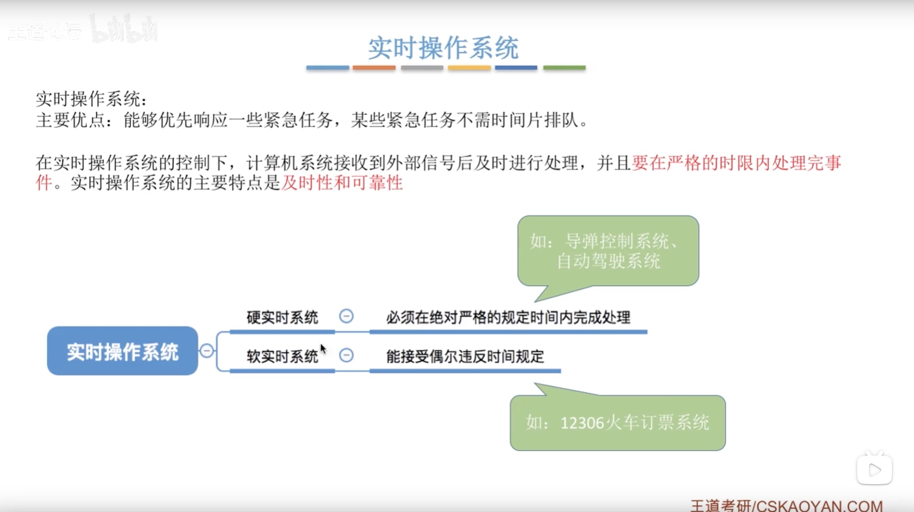
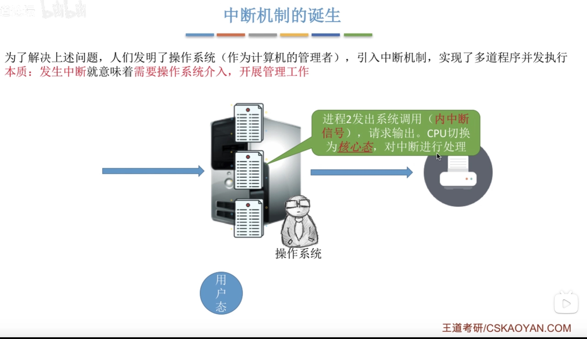
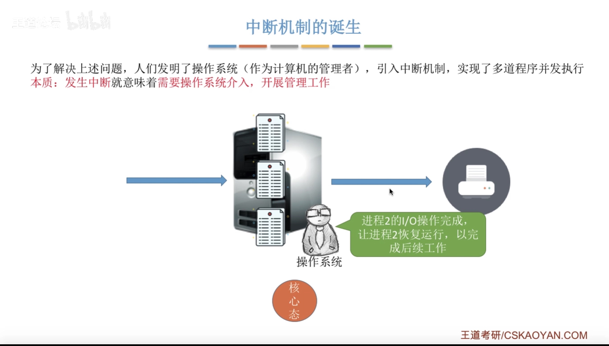
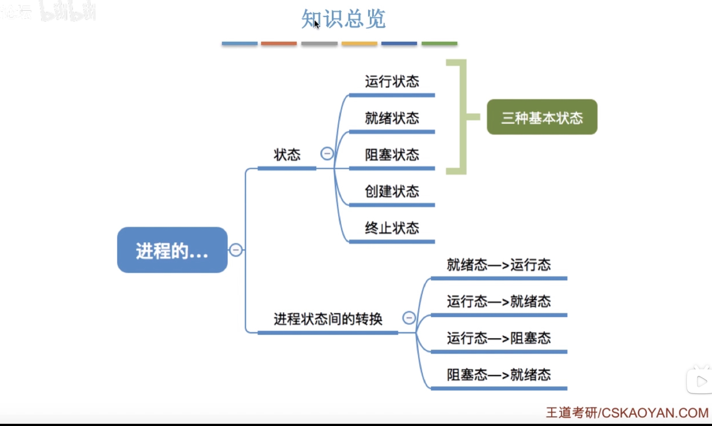

# 操作系统（王道）1
[TOC]
## 操作系统的概念、功能和目标

- 用户接口：“用户和操作系统之间的接口”，用户通过输入指令，OS返回结果给用户。
- 程序接口：”程序和操作系统之间的接口“，供程序员在编程时使用，通过这个接口，可在程序执行时访问系统资源以及获得OS服务。
- 在计算机系统中通常运行着两种程序：系统程序和用户程序；为了保证系统程序不被用户程序破坏，计算机设置了两种状态：内核态和用户态。
    - 内核态：操作系统在系统态运行，运行的指令称为特权指令，其对内存空间的访问范围没有限制，可以访问用户存储空间和系统存储空间，如启动各种外部设备、转换执行状态等，特权指令只允许操作系统执行，不允许应用程序使用。
    - 用户态：应用程序只能在用户态运行，应用程序一般使用的都是非特权指令，不能对系统中的硬件和软件直接访问，对内存的访问也仅限用户空间。在实际运行中，处理机会在系统态和用户态切换。

## 操作系统的特征

## 操作系统的发展与分类

1.用户将程序事先输入在纸带上，然后将纸带放进纸带机里面，纸带机就会将数据读取到计算机里，计算机处理完成之后，就会将结果输出到纸带机上，输出纸带                2.用户占用全机：是指用户将纸带放进纸带机，到输出纸带，都是一个用户占有
3.人机矛盾是指：纸带的输入速度过于慢，计算机处理速度过于快

## 操作系统的运行机制和体系结构

## 中断和异常 

- 当CPU收到计时部件发出的中断信号，那么CPU就会知道当前时间片结束了，要切换到下一个时间片了。此时会从用户态切换到核心态，交给操作系统管理。

- 进程2完成之后，输出结果需要调用到I/O设备；由于调度I/O设备是属于特权指令，因此需要从用户态切换到核心态。

- CPU收到中断信号后，就意味着需要操作系统介入，开展管理工作，CPU会从用户态切换到核心态，然后把CPU的使用权限交给操作系统，操作系统的内核开始对中断信号进行处理；操作系统发现刚才的中断信号是时间片到了，操作系统就负责将进程1切换到进程2运行，在完成一系列管理工作后，操作系统会将CPU的使用权交还给用户进程。

## 系统调用

- 用户态情况下只能执行非特权指令
- 核心态情况下既能执行非特权指令，也能执行特权指令。但是陷入指令是只能在用户态下执行的。

## 进程的定义、组成、组织方式、特征

- 程序段里面存放的是程序的指令序列。

## 进程的状态与转换

- 进程处于创建态
- 

- 进程处于终止态
- 

## 进程控制

## 进程通信

## 线程概念和多线程模型

## 处理机调度的概念、层次

## 进程调度的时机、切换与过程调度方式

