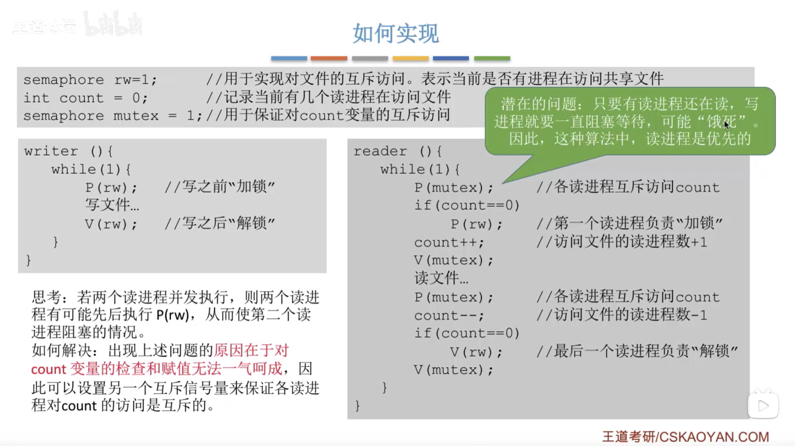
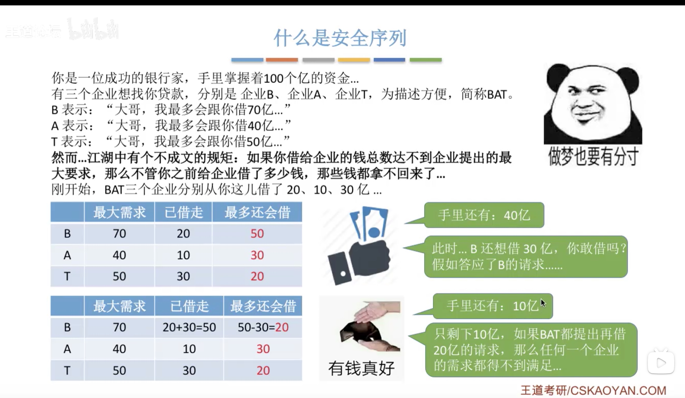
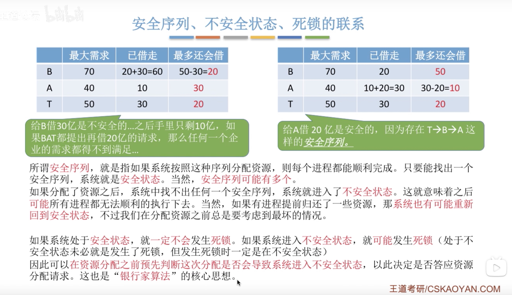

# 操作系统（王道）3
[TOC]
## 信号量机制

 

## 用信号量实现进程互斥、进程同步、进程的前驱关系

## 生产者-消费者问题

## 多生产者-多消费者问题

## 吸烟者问题

## 读者-写者问题

 

## 哲学家进餐问题

## 管程

## 死锁的概念

 

## 死锁的处理策略 - 预防死锁

## 死锁的处理策略 - 避免死锁

## 死锁的处理策略 - 检测和解除

