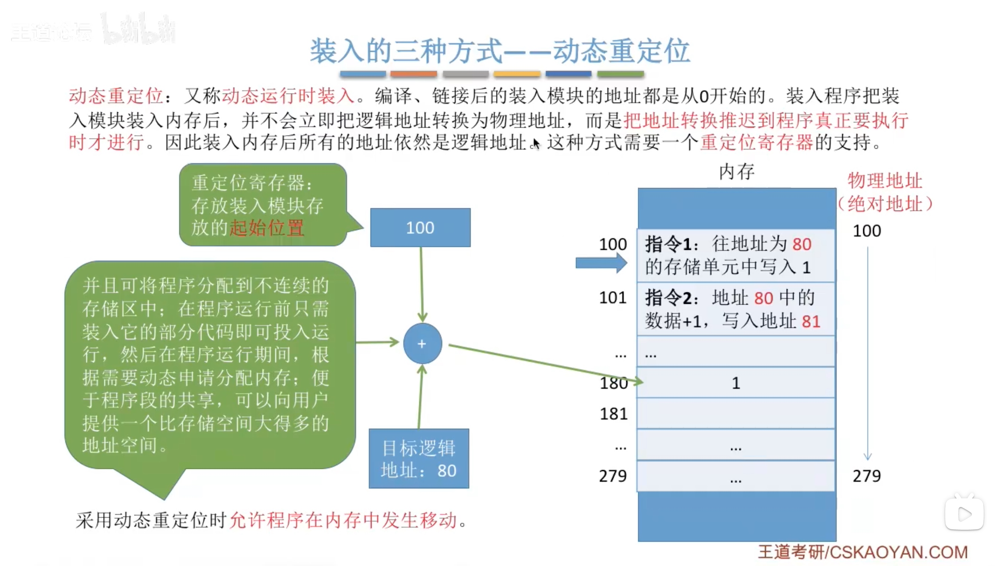
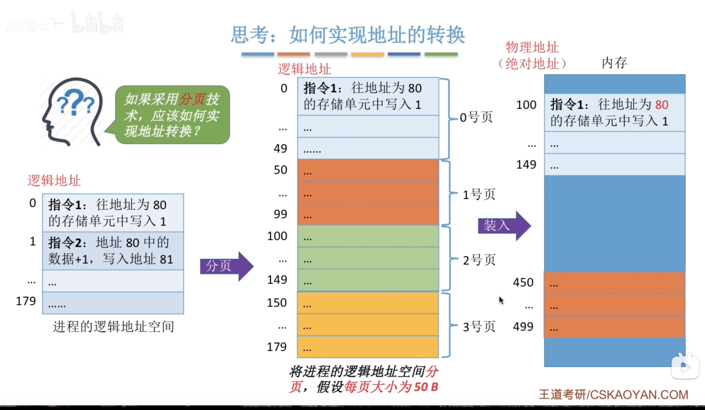

# 操作系统（王道）4
[TOC]
## 内存的基础知识

- CPU能够识别机器指令，从机器指令中CPU知道接下来要做什么事情
- 机器指令上有操作码，通过解析操作码，CPU就知道当前操作是数据传送还是加法等操作

 

## 内存管理的概念

## 覆盖与交换

## 连续分配管理方式

## 动态分区分配算法

## 基本分页存储管理的基本概念

## 基本地址变换机构

## 具有快表的地址变换机构

