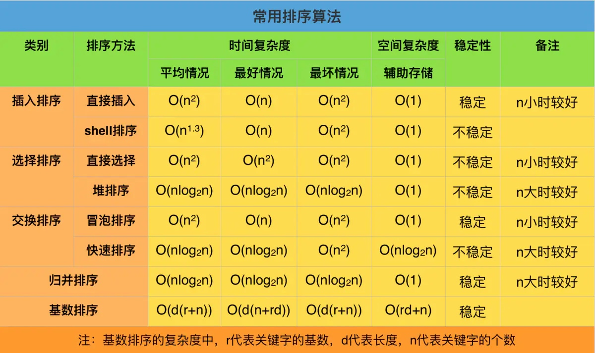

# 算法学习
[TOC]
## 基本的排序算法
### 排序的基本概念
#### 排序
排序，就是使一串记录，按照其中的某个或某些关键字的大小，递增或递减的排列起来的操作。

#### 稳定性
假定在待排序的记录序列中，存在多个具有相同的关键字的记录，若经过排序，这些记录的相对次序保持不变，即在原序列中，r[i]=r[j]，且r[i]在r[j]之前，而在排序后的序列中，r[i]仍在r[j]之前，则称这种排 序算法是稳定的；否则称为不稳定的。

#### 内部排序
数据元素全部放在内存中的排序。

#### 外部排序
外部排序指的是大文件的排序，即待排序的记录存储在外存储器上，待排序的文件无法一次装入内存，需要在内存和外部存储器之间进行多次数据交换，以达到排序整个文件的目的。

### 基本排序算法的时间、空间复杂度、稳定性



### 选择排序
选择排序就是第一次从数组的第一个到最后一个找出最小的，然后将第一个替换掉，第二次从数组的第二个到最后一个找出第二小的，也替换掉，直到全部替换完毕。
```swift
//选择排序
func selectSort(_ nums: inout [Int]) {
    guard nums.count > 1 else {
        return
    }
    for i in 0..<nums.count {
        for j in i+1..<nums.count {
            if nums[j] < nums[i] {
                let temp = nums[i]
                nums[i] = nums[j]
                nums[j] = temp
            }
        }
    }
}
```

### 冒泡排序
冒泡排序就是先从数组的第一个开始遍历，两两交换，将最大的交换到数组的最后一位，第二次，则将第二大的交换到倒数第二位，直到交换完毕。
该算法是稳定的，而且最优情况下是本来就已经排序好的，时间复杂度为O(n)，平均时间复杂度为O(n^2)。
```swift
//冒泡排序
func bubble(_ nums:inout [Int]) {
    guard nums.count > 1 else {
        return
    }
    var count = nums.count - 1
    var flag = false
    while count > 0 {
        for i in 0..<count {
            if nums[i] > nums[i+1] {
                let temp = nums[i]
                nums[i] = nums[i+1]
                nums[i+1] = temp
                flag = true
            }
        }
        if flag == false {
            return
        }
        count -= 1
    }
}
```
### 插入排序
插入排序是指将需要排序的元素插入到已经排序好的数组里，对于数组的第一个元素算作为一个已经排序好的数组，所以我们从第二个元素开始，和之前的元素进行对比进行插入即可。
该算法的平均复杂度为O(n^2)
```swift
//插入排序
func insertSort(_ nums:inout [Int]) {
    guard nums.count > 1 else {
        return
    }
    for i in 1..<nums.count {
        for j in 0..<i {
            if nums[j] > nums[i] {
                let temp = nums[j]
                nums[j] = nums[i]
                nums[i] = temp
            }
        }
    }
}
```

### 归并排序
归并排序是将数组按照等分不断分解，最后分成只有一个元素的数组，然后数组合并之后排序成有序的整体数组。
归并排序的平均时间复杂度为O(nlogn),算法是稳定的。
```swift
//归并排序
func mergeSort(_ nums: [Int]) -> [Int]{
    guard nums.count > 1 else {
        return nums
    }
    let mid = nums.count / 2
    let leftArray:[Int] = mergeSort(Array(nums[0..<mid]))
    let rightArray:[Int] = mergeSort(Array(nums[mid..<nums.count]))
    return merge(leftArray, rightArray)
}
func merge(_ leftArray:[Int], _ rightArray:[Int]) -> [Int] {
    var targetArray:[Int] = []
    var leftIndex:Int = 0
    var rightIndex:Int = 0
    while leftIndex < leftArray.count && rightIndex < rightArray.count {
        if leftArray[leftIndex] < rightArray[rightIndex] {
            targetArray.append(leftArray[leftIndex])
            leftIndex += 1
        }else {
            targetArray.append(rightArray[rightIndex])
            rightIndex += 1
        }
    }
    if leftIndex == leftArray.count && rightIndex < rightArray.count {
        for i in rightIndex..<rightArray.count {
            targetArray.append(rightArray[i])
        }
    }
    if rightIndex == rightArray.count && leftIndex < leftArray.count {
        for i in leftIndex..<leftArray.count {
            targetArray.append(leftArray[i])
        }
    }
    return targetArray
}
```

### 快速排序
1. 数组中选择一个元素作为“基准”，通常选取最后一个元素
2. 将数组中比基准小的元素全部移到基准的左边，将比基准大的元素全部移到基准的右边
3. 对基准两边的两个子集，不断重复第一步和第二步，直到所有子集只剩下一个元素为止。
快速排序的平均时间复杂度为O(nlogn)

```swift
//快速排序
func quickSort(_ nums:inout [Int], _ start:Int, _ end:Int) {
    guard start <= end else {
        return
    }
    let index:Int = partition(&nums, start, end)
    quickSort(&nums, 0, index - 1)
    quickSort(&nums, start + 1, end)
}
func partition(_ nums:inout [Int], _ start:Int, _ end:Int) -> Int {
    //以数组的第一个元素为基准
    var l = start
    var r = end
    let val = nums[start]
    while l <  r {
        //将比基准小的元素调整到数组的前面
        while l < r && nums[r] >= val {
            r -= 1
        }
        nums[l] = nums[r]
        while l < r && nums[l] <= val {
            l += 1
        }
        nums[r] = nums[l]
    }
    nums[l] = val
    return l
}
```

### 希尔排序
希尔排序其实是插入排序的变种，是插入排序的一种更高效的排序方法；
基本思想是：先将整个待排序的记录序列分割成为若干子序列分别进行直接插入排序，待整个序列中的记录“基本有序”时，再对全体记录进行依次直接插入排序。
希尔排序的平均复杂度为O(n^1.3)
```swift
//希尔排序
func shellSort(_ nums:inout [Int]) {
    guard nums.count > 1 else {
        return
    }
    var d = nums.count / 2
    while d > 0 {
        for i in d..<nums.count {
            //对前面元素进行插入排序
            var j = i - d
            let n = nums[i]
            while j >= 0 && nums[j] > n{
                nums[j+d] = nums[j]
                j = j - d
            }
            nums[j+d] = n
        }
        d = d / 2
    }
}
```

### 堆排序
堆排序的思想是：将数组元素建大顶堆，建好之后将堆顶元素与数组最后一个元素交换位置，再重新建堆，直到排序完毕。
堆排序的平均复杂度为O(nlogn)，该算法是不稳定的。
```swift
////堆排序
func heapSort(_ nums:inout [Int], _ length:Int) {
    guard nums.count > 1 && length > 1  else {
        return
    }
    let count = length/2 - 1
    for i in (0...count).reversed() {
        var swapIndex = i
        let leftIndex = i * 2 + 1
        let rightIndex = i * 2 + 2
        if leftIndex < length {
            if nums[leftIndex] > nums[i] {
                swapIndex = leftIndex
            }
        }
        if rightIndex < length {
            if nums[rightIndex] > nums[i] && nums[rightIndex] > nums[leftIndex]{
                swapIndex = rightIndex
            }
        }
        if swapIndex != i {
            let temp = nums[i]
            nums[i] = nums[swapIndex]
            nums[swapIndex] = temp
        }
    }
    let temp = nums[0]
    nums[0] = nums[length - 1]
    nums[length - 1] = temp
    heapSort(&nums, length - 1)
}
```

### 基数排序
基数排序也称为桶排序；
算法思想：先判断数组是否存在负数，存在的话数组每个元素加上最小的负数的绝对值；然后找出数组中最大的数，得出最大数的位数；然后从低位到高位的顺序比较数组中每个元素对应位的大小，按照顺序放进0～9的桶里，排序完毕后，再把桶的元素集合到一个数组上；最后再判断是否原数组是否存在负数，是的话数组每个元素加上最小的负数。
该算法的平均时间复杂度为O(nlogn)，而且是稳定的。
```swift
//基数排序 （桶排序）
func bucketSort(_ nums:inout [Int]) {
    guard nums.count > 1 else {
        return
    }
    //判断数组里是否有负数，有的话全部加上最小的负数
    let minN = nums.min()!
    if minN < 0 {
        for i in 0..<nums.count {
            nums[i] -= minN
        }
    }
    let n = nums.max()!
    let maxLength = digit(n)
    for i in 0..<maxLength {
        baseSort(&nums, i+1)
    }
    if minN < 0 {
        for i in 0..<nums.count {
            nums[i] += minN
        }
    }
}

func baseSort(_ nums:inout [Int], _ n:Int) {
    var bucket:[[Int]] = Array.init(repeating: [], count: 10)
    for i in 0..<nums.count {
        let element = nums[i]
        let d = digit(element) //得出当前数值的位数
        if n > d {
            bucket[0].append(element)
        }else {
            let val = digitVal(element, index: n)
            bucket[val].append(element)
        }
    }
    nums.removeAll()
    for i in 0..<bucket.count {
        nums += bucket[i]
    }
}

//返回数值num的位数
func digit(_ num:Int) -> Int {
    var n = num
    var maxLength = 0
    while n != 0 {
        n = n / 10
        maxLength += 1
    }
    return maxLength
}

//返回数值num在index位的数值
func digitVal(_ num:Int, index:Int) -> Int {
    var count = 0
    var n = num
    while n != 0 {
        let result = n % 10
        count += 1
        n = n / 10
        if count == index {
            return result
        }
    }
    return 1
}
```