# 计网面试整理
[TOC]
## HTTP常见面试题


### HTTP基本知识
#### HTTP基本概念
HTTP是超文本传输协议。超文本传输协议可以分成三部分来理解：协议、传输、超文本。
- 协议：针对协议，我们可以这么理解HTTP：HTTP是一个用在计算机世界里的协议。它使用计算机能够理解的语言确立了一种计算机之间交流通信的规范，以及相关的各种控制和错误处理方式。
- 传输：针对传输，我们理解HTTP是一个在计算机世界里专门用来在两点之间传输数据的约定和规范。
- 超文本：HTTP传输的内容是超文本。超文本是文字、图片、视频等的混合体，最关键有超链接，能从一个超文本条环到另外一个超文本。HTML就是最常见的超文本，它本身只是纯文字文件，但在标签的修饰之下，再经过浏览器的解释，呈现出来的一个文字、有画面的网页。
那么，综合来说，HTTP是一个在计算机世界里专门在两点之间传输文字、图片、音频、视频等超文本数据的约定和规范。

#### HTTP常见的状态码
HTTP常见的状态码有五种类型。
- 以1开头的：1开头的状态码主要表示当前报文正在被处理。
- 以2开头的：2开头的状态码主要表示报文已经收到并被正确处理；其中常见的有 200状态码是常见的成功状态码，表示一切正常；204状态码也是常见的成功状态码，与200状态码基本相同，但是响应没有主体数据；206状态码也是成功状态码，这是应用于HTTP分块下载或断点续传，表示响应返回的主体数据并不是资源的全部，而是其中的一部分。
- 以3开头的：3开头的状态码表示客户端请求的资源发生了变化，需要客户端用新的URI重新发送请求获取资源，也就是重定向。其中常见的状态码有 301状态码表示永久重定向，说明请求的资源已经不存在了，需要改用新的URI再次访问；302状态码表示临时重定向，说明请求的资源还在，但暂时需要用另一个URI来访问。301和302都会在响应头里使用字段Location，指明后续要跳转的URI，浏览会自动重定向到新的URI；304状态码表示资源未修改、更新。
- 以4开头的：4开头的状态码表示客户端发送的报文有误，服务器无法正确处理。其中常见的状态码有 400状态码表示客户端的请求报文有语法错误；403状态码表示服务器禁止访问资源，并不是客户端的请求出错；404状态码表示请求的资源在服务器上不存在或找不到。
- 以5开头的：5开头的状态码表示客户端请求报文正确，但是服务器处理时内部发生了错误，属于服务器端的错误码；其中常见的状态码有：500状态码：服务器处理时发生了错误，但是具体是什么错误并不知道；501状态码表示客户端请求的功能还不支持；502状态码表示服务器作为网关或代理时返回的错误码，表示服务器自身工作正常，访问后端服务器发生了错误；503状态码表示服务器当前很忙，暂时无法响应。

#### HTTP常见字段
- Host字段：客户端发送请求时，用来指定服务器的域名。有了Host字段，就可以将请求发往同一台服务器上的不同网站。
- Content-Length字段：服务器在返回数据时，会有Content-Length字段，表明本次返回的数据长度。
- Connection 字段：“Connection 字段最常用于客户端要求服务器使用 TCP 持久连接，以便其他请求复用。
- “Content-Type 字段”：“Content-Type 字段用于服务器回应时，告诉客户端，本次数据是什么格式。”
- Accept: */*：“上面代码中，客户端声明自己可以接受任何格式的数据。”
- “Content-Encoding 字段”：“Content-Encoding 字段说明数据的压缩方法。表示服务器返回的数据使用了什么压缩格式”
- User-Agent（简称UA）：是一种向访问网站提供你所使用的浏览器类型以及版本、语言、渲染引擎、加密等级、操作系统以及版本等信息的标识。[进一步了解的🔗](https://www.jianshu.com/p/da6a44d0791e)

#### 常见的应用层协议
1. DNS协议：用于实现域名到IP地址映射的网络服务。
2. 文件传输协议FTP：用于实现交互式文件传输功能。
    1. FTP是一种文件传输协议，它支持两种模式：一种方式叫做 Standard (也就是 Active,主动模式),一种是 Passive (也就是 PASV,被动模式)。 Standard 模式是 FTP 的客户端发送 PORT 命令到 FTP 服务器。Passive 模式是 FTP 的客户端发送 PASV 命令到 FTP 服务器。两种方式中数据和控制链路都是分开传输的，惟一的区别在于主动模式由服务器端发起数据链路的链接请求，而被动模式由客户端发起数据链路的链接请求。
    2. FTP 通信过程中它的控制链路和数据链路不是在同一个端口进行通信的，而是在两个不同的 端口独立进行通信。首先由客户端向服务器发起控制链接的请求，当和服务器建立控制链接成功之后，在主动模式下客户端将会发一个端口号给服务器，告诉当前这次传输服务器所使用的数据传输端口，服务器收到这个信息后就向客户端发起数据链接请求，成功后进行当前这次的数据传输。在当前传输完成之后，该数据链路就被拆除了，如果客户端进行一次新的传输，则向服务器发送一个新的端口号，重新建立链接。在整个过程中，控制链路的链接一直都存在，直到 FTP 的整个通信过程结束，而数据链路每一次传输就需要建立一次新的链接。
    3. 在主动模式下是由服务器发起的数据链路请求，那么有可能会出现连接被客户端的防火墙阻止，那么为了解决这种问题，衍生出了被动模式。
    4. 被动模式下，客户端会在本地打开两个随机的非系统端口N和N+1，第一个端口连接服务器上的21端口，然后客户端会发送PASV命令，告诉服务端我这边是被动模式，那么服务端就会打开一个随机的非系统端口P返回给客户端作为PASV命令的响应，那么客户端就会启动从端口N+1到P的链接请求。
    5. 服务端一般会以端口20作为数据端口，以端口21作为命令端口。在被动模式下，数据端口可能不是端口20，随机的。
3. 简单邮件传送协议(Simple Mail Transfer Protocol, SMTP)：用于实现电子邮箱传送功能
    1. SMTP是一种提供可靠且有效电子邮件传输的协议。SMTP 是建模在 FTP 文件传输服务上的一种邮件服务，SMTP 服务器在默认端口 25 上监听客户请求，主要用于传输系统之间的邮件信息。
    2. 交互过程：首先客户端向服务器的 SMTP 服务端口发起请求，通过三次握手建立链接。然后服务器返回 220 的状态码告诉客户端当前已经准备好服务，客户端收到该状态码后向服务器发出 HELO 或者 EHLO 的命令告诉服务器该客户端需要的服务类型，其中 HELO 是默认的 SMTP 服务，EHLO 要求除了默认的服务之 外还要支持扩展服务。当服务器告诉客户端它所支持的服务之后，双方用命令字和状态码进行交互。
4. 超文本传输协议(HyperText Transfer Protocol，HTTP)：用于实现WWW服务。
    1. 是一个属于应用层的面向对象的协议，它是基于 TCP(Transfer Control Protocol, 传输控制协议)的可靠传输，采用的是客户端/服务器的工作模式。在 HTTP 通信过程中，首先由客户端向服务器发起建立链接的请求，通过 TCP三次握手来完成，然后客户端向服务器发出请求，告诉服务器想得到的信息。服务器通过响应返回客户端需要的信息。最后通过 TCP 四次握手关闭链接，从而完成一次基本的通信过程。
5. 简单网络管理协议(simple Network Management Protocol，SNMP)：用于管理与监视网络设备。
    1. 简单网络管理协议（SNMP）是TCP／IP协议簇的一个应用层协议，工作在UDP 161端口，用于监控目标设备的操作系统、硬件设备、服务应用、软硬件配置、网络协议状态、设备性能及资源利用率、设备报错事件信息、应用程序状态等软硬件信息。
    2. SNMP的通信字符串主要包含两类命令：GET命令，SET命令。
        1. GET命令从设备读取数据，这些数据通常是操作参数，例如连接状态、接口名称等。
        2. SET命令允许设置设备的某些参数，这类功能一般有限制，例如关闭某个网络接口、修改路由器参数等功能。
6. 远程登录协议(Telnet)：用于实现远程登录功能。
    1. Telnet协议是TCP/IP协议族中的一员，是Internet远程登录服务的标准协议和主要方式。它为用户提供了在本地计算机上完成远程主机工作的能力。在终端使用者的电脑上使用telnet程序，用它连接到服务器。终端使用者可以在telnet程序中输入命令，这些命令会在服务器上运行，就像直接在服务器的控制台上输入一样。可以在本地就能控制服务器。要开始一个telnet会话，必须输入用户名和密码来登录服务器。Telnet是常用的远程控制Web服务器的方法。

### HTTP请求报文
HTTP建立在 TCP/IP 协议之上的应用层规范。规范把 HTTP 请求分为三个部分：状态行、请求头、消息主体。

HTTP 定义了与服务器交互的不同方法，最基本的方法有4种，分别是GET，POST，PUT，DELETE。URL全称是资源描述符，我们可以这样认为：一个URL地址，它用于描述一个网络上的资源，而 HTTP 中的GET，POST，PUT，DELETE就对应着对这个资源的查，增，改，删4个操作。
1. GET 用于信息获取，而且应该是安全的 和 幂等的。
    1. 所谓安全的意味着该操作用于获取信息而非修改信息。换句话说，GET 请求一般不应产生副作用。就是说，它仅仅是获取资源信息，就像数据库查询一样，不会修改，增加数据，不会影响资源的状态。
    2. 幂等的意味着对同一 URL 的多个请求应该返回同样的结果。
2. POST 表示可能修改变服务器上的资源的请求。

#### POST提交数据的方式
HTTP 协议中规定 POST 提交的数据必须在 body 部分中，但是协议中没有规定数据使用哪种编码方式或者数据格式。实际上，开发者完全可以自己决定消息主体的格式，只要最后发送的 HTTP 请求满足上面的格式就可以。

但是，数据发送出去，还要服务端解析成功才有意义。一般服务端语言如 PHP、Python 等，以及它们的 framework，都内置了自动解析常见数据格式的功能。服务端通常是根据请求头（headers）中的 Content-Type 字段来获知请求中的消息主体是用何种方式编码，再对主体进行解析。所以说到 POST 提交数据方案，包含了 Content-Type 和消息主体编码方式两部分。

- application/x-www-form-urlencoded
    - 这是最常见的 POST 数据提交方式。
- multipart/form-data
直接来看一个请求示例：

```C
POST http://www.example.com HTTP/1.1
Content-Type:multipart/form-data; boundary=----WebKitFormBoundaryrGKCBY7qhFd3TrwA

------WebKitFormBoundaryrGKCBY7qhFd3TrwA
Content-Disposition: form-data; name="text"

title
------WebKitFormBoundaryrGKCBY7qhFd3TrwA
Content-Disposition: form-data; name="file"; filename="chrome.png"
Content-Type: image/png

PNG ... content of chrome.png ...
------WebKitFormBoundaryrGKCBY7qhFd3TrwA--
```
这个例子稍微复杂点。首先生成了一个 boundary 用于分割不同的字段，为了避免与正文内容重复，boundary 很长很复杂。然后 Content-Type 里指明了数据是以 multipart/form-data 来编码，本次请求的 boundary 是什么内容。消息主体里按照字段个数又分为多个结构类似的部分，每部分都是以 --boundary 开始，紧接着是内容描述信息，然后是回车，最后是字段具体内容（文本或二进制）。如果传输的是文件，还要包含文件名和文件类型信息。消息主体最后以 --boundary-- 标示结束。

### 响应报文
HTTP 响应与 HTTP 请求相似，HTTP响应也由3个部分构成，分别是：
- 状态行
- 响应头(Response Header)
- 响应正文

### 条件GET
HTTP 条件 GET 是 HTTP 协议为了减少不必要的带宽浪费，提出的一种方案。
1. HTTP 条件 GET 使用的时机？
客户端之前已经访问过某网站，并打算再次访问该网站。

2. HTTP 条件 GET 使用的方法？
客户端向服务器发送一个包询问是否在上一次访问网站的时间后是否更改了页面，如果服务器没有更新，显然不需要把整个网页传给客户端，客户端只要使用本地缓存即可，如果服务器对照客户端给出的时间已经更新了客户端请求的网页，则发送这个更新了的网页给用户。

下面是一个具体的发送接受报文示例：

客户端发送请求：

```C
 GET / HTTP/1.1  
 Host: www.sina.com.cn:80  
 If-Modified-Since:Thu, 4 Feb 2010 20:39:13 GMT  
 Connection: Close  
```

第一次请求时，服务器端返回请求数据，之后的请求，服务器根据请求中的 If-Modified-Since 字段判断响应文件没有更新，如果没有更新，服务器返回一个 304 Not Modified响应，告诉浏览器请求的资源在浏览器上没有更新，可以使用已缓存的上次获取的文件。

```C
 HTTP/1.0 304 Not Modified  
 Date: Thu, 04 Feb 2010 12:38:41 GMT  
 Content-Type: text/html  
 Expires: Thu, 04 Feb 2010 12:39:41 GMT  
 Last-Modified: Thu, 04 Feb 2010 12:29:04 GMT  
 Age: 28  
 X-Cache: HIT from sy32-21.sina.com.cn  
 Connection: close 
```
 
 如果服务器端资源已经更新的话，就返回正常的响应。

### 持久连接
我们知道 HTTP 协议采用“请求-应答”模式，当使用普通模式，即非 Keep-Alive 模式时，每个请求/应答客户和服务器都要新建一个连接，完成之后立即断开连接（HTTP 协议为无连接的协议）；当使用 Keep-Alive 模式（又称持久连接、连接重用）时，Keep-Alive 功能使客户端到服务器端的连接持续有效，当出现对服务器的后继请求时，Keep-Alive 功能避免了建立或者重新建立连接。

在 HTTP 1.1 版本中，默认情况下所有连接都被保持，如果加入 "Connection: close" 才关闭。目前大部分浏览器都使用 HTTP 1.1 协议，也就是说默认都会发起 Keep-Alive 的连接请求了，所以是否能完成一个完整的 Keep-Alive 连接就看服务器设置情况。

由于 HTTP 1.0 没有官方的 Keep-Alive 规范，并且也已经基本被淘汰，以下讨论均是针对 HTTP 1.1 标准中的 Keep-Alive 展开的。

- HTTP Keep-Alive ==简单说就是保持当前的TCP连接，避免了重新建立连接。==
- HTTP 长连接不可能一直保持，例如 Keep-Alive: timeout=5, max=100，表示这个TCP通道可以保持5秒，max=100，表示这个长连接最多接收100次请求就断开。
- HTTP 是一个无状态协议，这意味着每个请求都是独立的，Keep-Alive 没能改变这个结果。另外，Keep-Alive也不能保证客户端和服务器之间的连接一定是活跃的，在 HTTP1.1 版本中也如此。==唯一能保证的就是当连接被关闭时你能得到一个通知==，所以不应该让程序依赖于 Keep-Alive 的保持连接特性，否则会有意想不到的后果。
- 使用长连接之后，客户端、服务端怎么知道本次传输结束呢？两部分：==1. 判断传输数据是否达到了Content-Length 指示的大小；2. 动态生成的文件没有 Content-Length ，它是分块传输（chunked），这时候就要根据 chunked 编码来判断，chunked 编码的数据在最后有一个空 chunked 块，表明本次传输数据结束。==

### Transfer-Encoding
Transfer-Encoding 是一个用来标示 HTTP 报文传输格式的头部值。尽管这个取值理论上可以有很多，但是当前的 HTTP 规范里实际上只定义了一种传输取值——chunked。

如果一个HTTP消息（请求消息或应答消息）的Transfer-Encoding消息头的值为chunked，那么，消息体由数量未定的块组成，并以最后一个大小为0的块为结束。

每一个非空的块都以该块包含数据的字节数（字节数以十六进制表示）开始，跟随一个CRLF （回车及换行），然后是数据本身，最后块CRLF结束。在一些实现中，块大小和CRLF之间填充有白空格（0x20）。

最后一块是单行，由块大小（0），一些可选的填充白空格，以及CRLF。最后一块不再包含任何数据，但是可以发送可选的尾部，包括消息头字段。消息最后以CRLF结尾。

一个示例响应如下：
```C
HTTP/1.1 200 OK
Content-Type: text/plain
Transfer-Encoding: chunked

25
This is the data in the first chunk

1A
and this is the second one
0
```

- chunked 和 multipart 两个名词在意义上有类似的地方，不过在 HTTP 协议当中这两个概念则不是一个类别的。==multipart 是一种 Content-Type，标示 HTTP 报文内容的类型，而 chunked 是一种传输格式，标示报头将以何种方式进行传输。==
- ==chunked 传输不能事先知道内容的长度，只能靠最后的空 chunk 块来判断，因此对于下载请求来说，是没有办法实现进度的。==在浏览器和下载工具中，偶尔我们也会看到有些文件是看不到下载进度的，即采用 chunked 方式进行下载。
- ==chunked 的优势在于，服务器端可以边生成内容边发送，无需事先生成全部的内容。==HTTP/2 不支持 Transfer-Encoding: chunked，因为 HTTP/2 有自己的 streaming 传输方式

### HTTP Pipelining（HTTP 管线化）
默认情况下 HTTP 协议中每个传输层连接只能承载一个 HTTP 请求和响应，浏览器会在收到上一个请求的响应之后，再发送下一个请求。在使用持久连接的情况下，某个连接上消息的传递类似于请求1 -> 响应1 -> 请求2 -> 响应2 -> 请求3 -> 响应3。

==HTTP Pipelining（管线化）是将多个 HTTP 请求整批提交的技术，在传送过程中不需等待服务端的回应。==使用 HTTP Pipelining 技术之后，某个连接上的消息变成了类似这样请求1 -> 请求2 -> 请求3 -> 响应1 -> 响应2 -> 响应3。
注意下面几点：
- 管线化机制通过持久连接（persistent connection）完成，仅 HTTP/1.1 支持此技术（HTTP/1.0不支持）
- 只有 GET 和 HEAD 请求可以进行管线化，而 POST 则有所限制
- 初次创建连接时不应启动管线机制，因为对方（服务器）不一定支持 HTTP/1.1 版本的协议
- 管线化不会影响响应到来的顺序，如上面的例子所示，响应返回的顺序并未改变；客户端可以一次性发送多个请求，但是服务端在处理请求时只能按顺序处理，因此有可能会出现队头阻塞的情况
- HTTP /1.1 要求服务器端支持管线化，但并不要求服务器端也对响应进行管线化处理，只是要求对于管线化的请求不失败即可
- 由于上面提到的服务器端问题，开启管线化很可能并不会带来大幅度的性能提升，而且很多服务器端和代理程序对管线化的支持并不好，因此现代浏览器如 Chrome 和 Firefox 默认并未开启管线化支持

### 会话跟踪
什么是会话？
客户端打开与服务器的连接发出请求到服务器响应客户端请求的全过程称之为会话。

什么是会话跟踪？
会话跟踪指的是对同一个用户对服务器的连续的请求和接受响应的监视。

为什么需要会话跟踪？
浏览器与服务器之间的通信是通过HTTP协议进行通信的，而HTTP协议是”无状态”的协议，它不能保存客户的信息，即一次响应完成之后连接就断开了，下一次的请求需要重新连接，这样就需要判断是否是同一个用户，所以才有会话跟踪技术来实现这种要求。

会话跟踪常用的方法: 
- URL 重写
URL(统一资源定位符)是Web上特定页面的地址，URL重写的技术就是在URL结尾添加一个附加数据以标识该会话,把会话ID通过URL的信息传递过去，以便在服务器端进行识别不同的用户。
- 隐藏表单域
将会话ID添加到HTML表单元素中提交到服务器，此表单元素并不在客户端显示
- Cookie
Cookie 是Web 服务器发送给客户端的一小段信息，客户端请求时可以读取该信息发送到服务器端，进而进行用户的识别。对于客户端的每次请求，服务器都会将 Cookie 发送到客户端,在客户端可以进行保存,以便下次使用。

客户端可以采用两种方式来保存这个 Cookie 对象，一种方式是保存在客户端内存中，称为临时 Cookie，浏览器关闭后这个 Cookie 对象将消失。另外一种方式是保存在客户机的磁盘上，称为永久 Cookie。以后客户端只要访问该网站，就会将这个 Cookie 再次发送到服务器上，前提是这个 Cookie 在有效期内，这样就实现了对客户的跟踪。

Cookie 是可以被客户端禁用的。

- Session
每一个用户都有一个不同的 session，各个用户之间是不能共享的，是每个用户所独享的，在 session 中可以存放信息。

在服务器端会创建一个 session 对象，产生一个 sessionID 来标识这个 session 对象，然后将这个 sessionID 放入到 Cookie 中发送到客户端，下一次访问时，sessionID 会发送到服务器，在服务器端进行识别不同的用户。

Session 的实现依赖于 Cookie，如果 Cookie 被禁用，那么 session 也将失效。


### GET和POST的区别
- “Get 方法的含义是请求从服务器获取资源，这个资源可以是静态的文本、页面、图片视频等。”“POST 方法则是相反操作，它向 URI 指定的资源提交数据，数据就放在报文的 body 里。”
- “ GET 方法就是安全且幂等的，因为它是「只读」操作，无论操作多少次，服务器上的数据都是安全的，且每次的结果都是相同的。POST 因为是「新增或提交数据」的操作，会修改服务器上的资源，所以是不安全的，且多次提交数据就会创建多个资源，所以不是幂等的。”
- GET会被浏览器缓存，而且参数会被保留在浏览器历史中；POST不会被浏览器缓存，参数也不会被保存在浏览器历史中
- 当发送数据时，GET方法向URL中添加数据，而URL的长度一般是受到限制的，因此会限制数据长度；POST发送数据时，不会在URL里添加数据，因此对数据长度没有限制。（HTTP协议中对URL的长度是没有限制，一般是浏览器和服务器会对URL长度进行限制）
- POST的安全性更高，因为参数没有暴露在URL中，而且参数没有被保存在浏览器历史或者Web服务器日志中
- POST在真正发送数据之前会先将请求头发送到服务器进行确认，服务器确认之后才开始真正发送数据；而GET会直接将数据发送过去。
- POST不能管道化传输

> “在 HTTP 协议里，所谓的「安全」是指请求方法不会「破坏」服务器上的资源。
> 所谓的「幂等」，意思是多次执行相同的操作，结果都是「相同」的。”

### HTTP特性
#### 优点
“HTTP 最凸出的优点是「简单、灵活和易于扩展、应用广泛和跨平台」。”
1. 简单
    1. “HTTP 基本的报文格式就是 header + body，头部信息也是 key-value 简单文本的形式，易于理解，降低了学习和使用的门槛。”
2. “灵活和易于扩展”
    1. “HTTP协议里的各类请求方法、URI/URL、状态码、头字段等每个组成要求都没有被固定死，都允许开发人员自定义和扩充。” 
    2. “同时 HTTP 由于是工作在应用层（ OSI 第七层），则它下层可以随意变化。HTTPS 也就是在 HTTP 与 TCP 层之间增加了 SSL/TLS 安全传输层，HTTP/3 甚至把 TCP 层换成了基于 UDP 的 QUIC。”
3. “应用广泛和跨平台”
    1. “互联网发展至今，HTTP 的应用范围非常的广泛，从台式机的浏览器到手机上的各种 APP，从看新闻、刷贴吧到购物、理财、吃鸡，HTTP 的应用遍地开花，同时天然具有跨平台的优越性。”
#### 缺点
“HTTP 协议里有优缺点一体的双刃剑，分别是「无状态、明文传输」，同时还有一大缺点「不安全」。”   
1. “无状态双刃剑”
    1. “无状态的好处，因为服务器不会去记忆 HTTP 的状态，所以不需要额外的资源来记录状态信息，这能减轻服务器的负担，能够把更多的 CPU 和内存用来对外提供服务。”
    2. “无状态的坏处，既然服务器没有记忆能力，它在完成有关联性的操作时会非常麻烦。”“例如登录->添加购物车->下单->结算->支付，这系列操作都要知道用户的身份才行。但服务器不知道这些请求是有关联的，每次都要问一遍身份信息。”
    3. “对于无状态的问题，解法方案有很多种，其中比较简单的方式用 Cookie 技术。Cookie 通过在请求和响应报文中写入 Cookie 信息来控制客户端的状态。”
2. 明文传输双刃剑
    1. “明文意味着在传输过程中的信息，是可方便阅读的，通过浏览器的 F12 控制台或 Wireshark 抓包都可以直接肉眼查看，为我们调试工作带了极大的便利性。”
    2. “但是这正是这样，HTTP 的所有信息都暴露在了光天化日下，相当于信息裸奔。在传输的漫长的过程中，信息的内容都毫无隐私可言，很容易就能被窃取，如果里面有你的账号密码信息，那你号没了。”
3. 不安全 “HTTP 比较严重的缺点就是不安全：”
    1. “通信使用明文（不加密），内容可能会被窃听。比如，账号信息容易泄漏，那你号没了。”
    2. “不验证通信方的身份，因此有可能遭遇伪装。比如，访问假的淘宝、拼多多，那你钱没了。”
    3. “无法证明报文的完整性，所以有可能已遭篡改。比如，网页上植入垃圾广告，视觉污染，眼没了。”
“HTTP 的安全问题，可以用 HTTPS 的方式解决，也就是通过引入 SSL/TLS 层，使得在安全上达到了极致。”

#### HTTP/1.1性能如何
“HTTP 协议是基于 TCP/IP，并且使用了「请求 - 应答」的通信模式，所以性能的关键就在这两点里。”
1. 长连接
    1. “早期 HTTP/1.0 性能上的一个很大的问题，那就是每发起一个请求，都要新建一次 TCP 连接（三次握手），而且是串行请求，做了无谓的 TCP 连接建立和断开，增加了通信开销。”
    2. “为了解决上述 TCP 连接问题，HTTP/1.1 提出了长连接的通信方式，也叫持久连接。这种方式的好处在于减少了 TCP 连接的重复建立和断开所造成的额外开销，减轻了服务器端的负载。”
    3. “持久连接的特点是，只要任意一端没有明确提出断开连接，则保持 TCP 连接状态。”
2. 管道网络传输：“HTTP/1.1 采用了长连接的方式，这使得管道（pipeline）网络传输成为了可能。”
    1. “即可在同一个 TCP 连接里面，客户端可以发起多个请求，只要第一个请求发出去了，不必等其回来，就可以发第二个请求出去，可以减少整体的响应时间。”
    2. “举例来说，客户端需要请求两个资源。以前的做法是，在同一个TCP连接里面，先发送 A 请求，然后等待服务器做出回应，收到后再发出 B 请求。管道机制则是允许浏览器同时发出 A 请求和 B 请求。”
    3. “但是服务器还是按照顺序，先回应 A 请求，完成后再回应 B 请求。要是前面的回应特别慢，后面就会有许多请求排队等着。这称为「队头堵塞”
3. 队头阻塞：“请求 - 应答」的模式加剧了 HTTP 的性能问题。” 
    1. “因为当顺序发送的请求序列中的一个请求因为某种原因被阻塞时，在后面排队的所有请求也一同被阻塞了，会招致客户端一直请求不到数据，这也就是「队头阻塞」。”

### HTTP与HTTPS
#### HTTP与HTTPS有哪些区别
1. “HTTP 是超文本传输协议，信息是明文传输，存在安全风险的问题。HTTPS 则解决 HTTP 不安全的缺陷，在 TCP 和 HTTP 网络层之间加入了 SSL/TLS 安全协议，使得报文能够加密传输。
2. HTTP 连接建立相对简单， TCP 三次握手之后便可进行 HTTP 的报文传输。而 HTTPS 在 TCP 三次握手之后，还需进行 SSL/TLS 的握手过程，才可进入加密报文传输。
3. HTTP 的端口号是 80，HTTPS 的端口号是 443。
4. HTTPS 协议需要向 CA（证书权威机构）申请数字证书，来保证服务器的身份是可信的。”

#### HTTP安全上存在三个风险，以及HTTPS的改善
1. “窃听风险，比如通信链路上可以获取通信内容，用户号容易没。
2. 篡改风险，比如强制植入垃圾广告，视觉污染，用户眼容易瞎。
3. 冒充风险，比如冒充淘宝网站，用户钱容易没。”

“HTTPS 在 HTTP 与 TCP 层之间加入了 SSL/TLS 安全协议，可以很好的解决了上述的风险：”
1. “信息加密：交互信息无法被窃取，但你的号会因为「自身忘记」账号而没。
2. 校验机制：无法篡改通信内容，篡改了就不能正常显示，但百度「竞价排名」依然可以搜索垃圾广告。
3. 身份证书：证明淘宝是真的淘宝网，但你的钱还是会因为「剁手」而没。”

“HTTPS 是如何解决上面的三个风险的？”
1. “混合加密的方式实现信息的机密性，解决了窃听的风险。
2. 摘要算法的方式来实现完整性，它能够为数据生成独一无二的「指纹」，指纹用于校验数据的完整性，解决了篡改的风险。
3. 将服务器公钥放入到数字证书中，解决了冒充的风险。”

* 混合加密
    * “通过混合加密的方式可以保证信息的机密性，解决了窃听的风险。”
    * “HTTPS 采用的是对称加密和非对称加密结合的「混合加密」方式：”
        * “在通信建立前采用非对称加密的方式交换「会话秘钥」，后续就不再使用非对称加密。”
        * “在通信过程中全部使用对称加密的「会话秘钥」的方式加密明文数据。”

* “采用「混合加密」的方式的原因：”
    * “对称加密只使用一个密钥，运算速度快，密钥必须保密，无法做到安全的密钥交换。”
    * “非对称加密使用两个密钥：公钥和私钥，公钥可以任意分发而私钥保密，解决了密钥交换问题但速度慢。”

* 摘要算法
    * “摘要算法用来实现完整性，能够为数据生成独一无二的「指纹」，用于校验数据的完整性，解决了篡改的风险。”

    * “客户端在发送明文之前会通过摘要算法算出明文的「指纹」，发送的时候把「指纹 + 明文」一同加密成密文后，发送给服务器，服务器解密后，用相同的摘要算法算出发送过来的明文，通过比较客户端携带的「指纹」和当前算出的「指纹」做比较，若「指纹」相同，说明数据是完整的。”

* 数字证书
“客户端先向服务器端索要公钥，然后用公钥加密信息，服务器收到密文后，用自己的私钥解密。”
“这就存在些问题，如何保证公钥不被篡改和信任度？”
“所以这里就需要借助第三方权威机构 CA （数字证书认证机构），将服务器公钥放在数字证书（由数字证书认证机构颁发）中，只要证书是可信的，公钥就是可信的。”

“通过数字证书的方式保证服务器公钥的身份，解决冒充的风险。”

#### “HTTPS 是如何建立连接的？其间交互了什么？”
“SSL/TLS 协议基本流程：”
    1. “客户端向服务器索要并验证服务器的公钥。”
    2. “双方协商生产「会话秘钥」。”
    3. “双方采用「会话秘钥」进行加密通信。”

“前两步也就是 SSL/TLS 的建立过程，也就是握手阶段。

SSL/TLS 的「握手阶段」涉及四次通信，可见下图：”


“SSL/TLS 协议建立的详细流程：”
1. ClientHello
    1. “首先，由客户端向服务器发起加密通信请求，也就是 ClientHello 请求。”
    2. “在这一步，客户端主要向服务器发送以下信息：”
        1. “客户端支持的 SSL/TLS 协议版本，如 TLS 1.2 版本。”
        2. “客户端生产的随机数（Client Random），后面用于生产「会话秘钥」。”
        3. “客户端支持的密码套件列表，如 RSA 加密算法。”
2. SeverHello
    1. “服务器收到客户端请求后，向客户端发出响应，也就是 SeverHello。服务器回应的内容有如下内容：”
        1. “确认 SSL/ TLS 协议版本，如果浏览器不支持，则关闭加密通信。”
        2. “服务器生产的随机数（Server Random），后面用于生产「会话秘钥」。”
        3. “确认的密码套件列表，如 RSA 加密
        4. 算法。”
        5. “服务器的数字证书。”
        6. “最后服务器发送 Server Hello Done 报文通知客户端，最初阶段的 SSL 握手协商部分结束。”
3. 客户端回应
    1. “客户端收到服务器的回应之后，首先通过浏览器或者操作系统中的 CA 公钥，确认服务器的数字证书的真实性。”
    2. “如果证书没有问题，客户端会从数字证书中取出服务器的公钥，然后使用它加密报文，向服务器发送如下信息：”
        1. “一个随机数（pre-master key）。该随机数会被服务器公钥加密。”
        2. “加密通信算法改变通知，表示随后的信息都将用「会话秘钥」加密通信。”
        3. “客户端握手结束通知，表示客户端的握手阶段已经结束。这一项同时把之前所有内容的发生的数据做个摘要，用来供服务端校验。”
        4. “上面第一项的随机数是整个握手阶段的第三个随机数，这样服务器和客户端就同时有三个随机数，接着就用双方协商的加密算法，各自生成本次通信的「会话秘钥」。”
4. “服务器的最后回应”
    1. “服务器收到客户端的第三个随机数（pre-master key）之后，通过协商的加密算法，计算出本次通信的「会话秘钥」。然后，向客户端发生最后的信息：”
        1. “加密通信算法改变通知，表示随后的信息都将用「会话秘钥」加密通信。”
        2. “服务器握手结束通知，表示服务器的握手阶段已经结束。这一项同时把之前所有内容的发“生的数据做个摘要，用来供客户端校验。”
“至此，整个 SSL/TLS 的握手阶段全部结束。接下来，客户端与服务器进入加密通信，就完全是使用普通的 HTTP 协议，只不过用「会话秘钥」加密内容。”

### “HTTP/1.1、HTTP/2、HTTP/3 演变”
#### “说说 HTTP/1.1 相比 HTTP/1.0 提高了什么性能？”
“HTTP/1.1 相比 HTTP/1.0 性能上的改进：”
- “使用 TCP 长连接的方式改善了 HTTP/1.0 短连接造成的性能开销。”
- “支持管道（pipeline）网络传输，只要第一个请求发出去了，不必等其回来，就可以发第二个请求出去，可以减少整体的响应时间。”

#### HTTP1.1的性能瓶颈
- “请求 / 响应头部（Header）未经压缩就发送，首部信息越多延迟越大。只能压缩 Body 的部分；”
- “发送冗长的首部。每次互相发送相同的首部造成的浪费较多；”
- “服务器是按请求的顺序响应的，如果服务器响应慢，会招致客户端一直请求不到数据，也就是队头阻塞；”
- “没有请求优先级控制；”
- “请求只能从客户端开始，服务器只能被动响应。”

#### “ 对于HTTP/1.1 的性能瓶颈，HTTP/2 做了什么优化？”
“HTTP/2 协议是基于 HTTPS 的，所以 HTTP/2 的安全性也是有保障的。”
“那 HTTP/2 相比 HTTP/1.1 性能上的改进：”
1. 头部压缩
    1. “HTTP/2 会压缩头（Header）如果你同时发出多个请求，他们的头是一样的或是相似的，那么，协议会帮你消除重复的部分。”
    2. “这就是所谓的 HPACK 算法：在客户端和服务器同时维护一张头信息表来存储之前发送的键值对。当每次请求或响应只会写入头信息表里没有的键值对，并且会更新信息表。
2. 二进制格式
    1. “HTTP/2 不再像 HTTP/1.1 里的纯文本形式的报文，而是全面采用了二进制格式，头信息和数据体都是二进制，并且统称为帧（frame）：头信息帧和数据帧。”
    2. “这样虽然对人不友好，但是对计算机非常友好，因为计算机只懂二进制，那么收到报文后，无需再将明文的报文转成二进制，而是直接解析二进制报文，这增加了数据传输的效率。”
3. 数据流
    1. “HTTP/2 的数据包不是按顺序发送的，同一个连接里面连续的数据包，可能属于不同的回应。因此，必须要对数据包做标记，指出它属于哪个回应。”
    2. “每个请求或回应的所有数据包，称为一个数据流（Stream）。每个数据流都标记着一个独一无二的编号，其中规定客户端发出的数据流编号为奇数， 服务器发出的数据流编号为偶数”。
    3. “客户端还可以指定数据流的优先级。优先级高的请求，服务器就先响应该请求。”
4. 多路复用
    1. “HTTP/2 是可以在一个连接中并发多个请求或回应，并发的数量级相比于HTTP1.1更加地大，而不用按照顺序一一对应。”
    2. “移除了 HTTP/1.1 中的串行请求，不需要排队等待，也就不会再出现「队头阻塞」问题，降低了延迟，大幅度提高了连接的利用率。
    3. “举例来说，在一个 TCP 连接里，服务器收到了客户端 A 和 B 的两个请求，如果发现 A 处理过程非常耗时，于是就回应 A 请求已经处理好的部分，接着回应 B 请求，完成后，再回应 A 请求剩下的部分。”
5. 服务器推送
    1. “HTTP/2 还在一定程度上改善了传统的「请求 - 应答」工作模式，服务不再是被动地响应，也可以主动向客户端发送消息。”
    2. “举例来说，在浏览器刚请求 HTML 的时候，就提前把可能会用到的 JS、CSS 文件等静态资源主动发给客户端，减少延时的等待，也就是服务器推送（Server Push，也叫 Cache Push）。”

#### “HTTP/2 有哪些缺陷？HTTP/3 做了哪些优化？”
“HTTP/2 主要的问题在于，多个 HTTP 请求在复用一个 TCP 连接，下层的 TCP 协议是不知道有多少个 HTTP 请求的。所以一旦发生了丢包现象，就会触发 TCP 的重传机制，这样在一个 TCP 连接中的所有的 HTTP 请求都必须等待这个丢了的包被重传回去。”
- “HTTP/1.1 中的管道（ pipeline）传输中如果有一个请求阻塞了，那么队列后请求也统统被阻塞住了”
- “HTTP/2 多个请求复用一个TCP连接，一旦发生丢包，就会阻塞住所有的 HTTP 请求。”

“这都是基于 TCP 传输层的问题，所以 HTTP/3 把 HTTP 下层的 TCP 协议改成了 UDP！”
“UDP 发生是不管顺序，也不管丢包的，所以不会出现 HTTP/1.1 的队头阻塞 和 HTTP/2 的一个丢包阻塞全部HTTP请求问题。”
“大家都知道 UDP 是不可靠传输的，但基于 UDP 的 QUIC 协议 可以实现类似 TCP 的可靠性传输。”

- “QUIC 有自己的一套机制可以保证传输的可靠性的。当某个流发生丢包时，只会阻塞这“个流，其他流不会受到影响。”
- “TLS3 升级成了最新的 1.3 版本，头部压缩算法也升级成了 QPack。”
- “HTTPS 要建立一个连接，要花费 6 次交互，先是建立三次握手，然后是 TLS/1.3 的三次握手。QUIC 直接把以往的 TCP 和 TLS/1.3 的 6 次交互合并成了 3 次，减少了交互次数。”
“所以， QUIC 是一个在 UDP 之上的伪 TCP + TLS + HTTP/2 的多路复用的协议。

QUIC 是新协议，对于很多网络设备，根本不知道什么是 QUIC，只会当做 UDP，这样会出现新的问题。所以 HTTP/3 现在普及的进度非常的缓慢，不知道未来 UDP 是否能够逆袭 TCP。”

### Cookie 与 Session
#### 什么是Cookie
HTTP Cookie（也叫 Web Cookie或浏览器 Cookie）是服务器发送到用户浏览器并保存在本地的一小块数据，它会在浏览器下次向同一服务器再发起请求时被携带并发送到服务器上。通常，它用于告知服务端两个请求是否来自同一浏览器，如保持用户的登录状态。Cookie 使基于无状态的 HTTP 协议记录稳定的状态信息成为了可能。

Cookie 主要用于以下三个方面
- 会话状态管理（如用户登录状态、购物车、游戏分数或其它需要记录的信息）
- 个性化设置（如用户自定义设置、主题等）
- 浏览器行为跟踪（如跟踪分析用户行为等）

#### 什么是Session
Session 代表着服务器和客户端一次会话的过程。Session 对象存储特定用户会话所需的属性及配置信息。这样，当用户在应用程序的 Web 页之间跳转时，存储在 Session 对象中的变量将不会丢失，而是在整个用户会话中一直存在下去。当客户端关闭会话，或者 Session 超时失效时会话结束。

#### Cookie 和 Session 有什么不同？
- 作用范围不同，Cookie 保存在客户端（浏览器），Session 保存在服务器端。
- 存取方式的不同，Cookie 只能保存 ASCII，Session 可以存任意数据类型，一般情况下我们可以在 Session 中保持一些常用变量信息，比如说 UserId 等。
- 有效期不同，Cookie 可设置为长时间保持，比如我们经常使用的默认登录功能，Session 一般失效时间较短，客户端关闭或者 Session 超时都会失效。
- 隐私策略不同，Cookie 存储在客户端，比较容易遭到不法获取，早期有人将用户的登录名和密码存储在 Cookie 中导致信息被窃取；Session 存储在服务端，安全性相对 Cookie 要好一些。
- 存储大小不同， 单个 Cookie 保存的数据不能超过 4K，Session 可存储数据远高于 Cookie。

#### 为什么需要 Cookie 和 Session，他们有什么关联？
说起来为什么需要 Cookie ，这就需要从浏览器开始说起，我们都知道浏览器是没有状态的(HTTP 协议无状态)，这意味着浏览器并不知道是张三还是李四在和服务端打交道。这个时候就需要有一个机制来告诉服务端，本次操作用户是否登录，是哪个用户在执行的操作，那这套机制的实现就需要 Cookie 和 Session 的配合。

用户第一次请求服务器的时候，服务器根据用户提交的相关信息，创建创建对应的 Session ，请求返回时将此 Session 的唯一标识信息 SessionID 返回给浏览器，浏览器接收到服务器返回的 SessionID 信息后，会将此信息存入到 Cookie 中，同时 Cookie 记录此 SessionID 属于哪个域名。

当用户第二次访问服务器的时候，请求会自动判断此域名下是否存在 Cookie 信息，如果存在自动将 Cookie 信息也发送给服务端，服务端会从 Cookie 中获取 SessionID，再根据 SessionID 查找对应的 Session 信息，如果没有找到说明用户没有登录或者登录失效，如果找到 Session 证明用户已经登录可执行后面操作。

根据以上流程可知，SessionID 是连接 Cookie 和 Session 的一道桥梁，大部分系统也是根据此原理来验证用户登录状态。

#### 既然服务端是根据 Cookie 中的信息判断用户是否登录，那么如果浏览器中禁止了 Cookie，如何保障整个机制的正常运转。
第一种方案，每次请求中都携带一个 SessionID 的参数，也可以 Post 的方式提交，也可以在请求的地址后面拼接

第二种方案，Token 机制。Token 机制多用于 App 客户端和服务器交互的模式，也可以用于 Web 端做用户状态管理。

Token 的意思是“令牌”，是服务端生成的一串字符串，作为客户端进行请求的一个标识。Token 机制和 Cookie 和 Session 的使用机制比较类似。

当用户第一次登录后，服务器根据提交的用户信息生成一个 Token，响应时将 Token 返回给客户端，以后客户端只需带上这个 Token 前来请求数据即可，无需再次登录验证。


#### 如何考虑分布式 Session 问题？
在互联网公司为了可以支撑更大的流量，后端往往需要多台服务器共同来支撑前端用户请求，那如果用户在 A 服务器登录了，第二次请求跑到服务 B 就会出现登录失效问题。

分布式 Session 一般会有以下几种解决方案：
- Nginx ip_hash 策略，服务端使用 Nginx 代理，每个请求按访问 IP 的 hash 分配，这样来自同一 IP 固定访问一个后台服务器，避免了在服务器 A 创建 Session，第二次分发到服务器 B 的现象。（其实就是访问固定的服务器）
- Session 复制，任何一个服务器上的 Session 发生改变（增删改），该节点会把这个 Session 的所有内容序列化，然后广播给所有其它节点。
- 共享 Session，服务端无状态话，将用户的 Session 等信息使用缓存中间件来统一管理，保障分发到每一个服务器的响应结果都一致。

### DNS
#### 什么是DNS
DNS就是域名系统，是因特网中的一项核心服务，是用于实现域名和IP地址相互映射的一个分布式数据库，能够使用户更方便的访问互联网，而不用去记住能够被机器直接读取的IP数串。通过主机名，得到该主机名对应的IP地址的过程叫做域名解析（或主机名解析）。

#### 域名结构解析
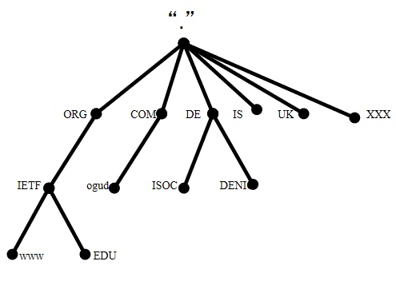
如上图所示，域名结构是树状结构，树的最顶端代表根服务器，根的下一层就是由我们所熟知的.com、.net、.cn等通用域和.cn、.uk等国家域组成，称为顶级域。网上注册的域名基本都是二级域名，比如http://baidu.com、http://taobao.com等等二级域名，它们基本上是归企业和运维人员管理。接下来是三级或者四级域名，这里不多赘述。总体概括来说域名是由整体到局部的机制结构。

#### DNS解析流程
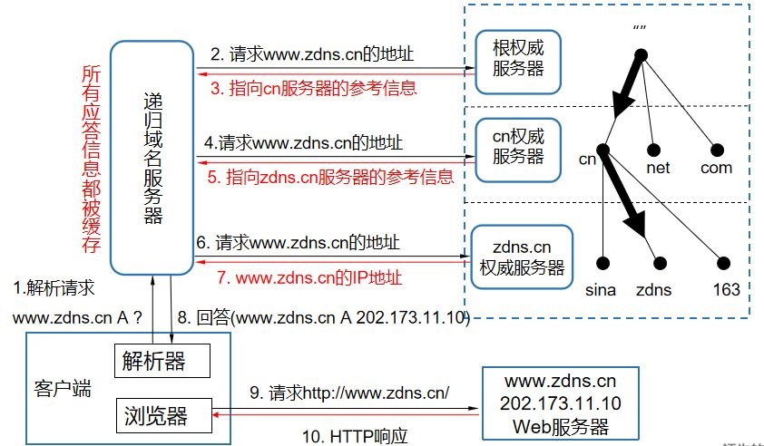
如上图所示，我们将详细阐述DNS解析流程。
1. 首先客户端位置是一台电脑或手机，在打开浏览器以后，比如输入http://www.zdns.cn的域名，它首先是由浏览器发起一个DNS解析请求，操作系统会先检查设备的hosts文件是否有这个网址的映射关系，有就直接调用，无则向本地域名服务器进行递归查询，如果本地缓存服务器中找不到结果，那么本地域名服务器就会开始迭代查询，则首先会向根服务器查询，根服务器里面记录的都是各个顶级域所在的服务器的位置，当向根请求http://www.zdns.cn的时候，根服务器就会返回.cn服务器的位置信息。
2. 服务器拿到.cn的权威服务器地址以后，就会寻问cn的权威服务器，知不知道http://www.zdns.cn的位置。这个时候cn权威服务器查找并返回http://zdns.cn服务器的地址。
3. 继续向http://zdns.cn的权威服务器去查询这个地址，由http://zdns.cn的服务器给出了地址：202.173.11.10
4. 最终才能进行http的链接，顺利访问网站。
5. 这里补充说明，一旦递归服务器拿到解析记录以后，就会在本地进行缓存，如果下次客户端再请求本地的递归域名服务器相同域名的时候，就不会再这样一层一层查了，因为本地服务器里面已经有缓存了，这个时候就直接把http://www.zdns.cn的A记录返回给客户端就可以了。
6. 上面解析整个DNS查询流程的是利用了递归查询，除了递归查询，还有一种查询方式叫做迭代查询。迭代查询与递归查询的区别在于：递归查询每次的查询结果都会返回给递归服务器，然后寻找下一个权威服务器，直到返回整个IP地址；而迭代查询是本地域名服务器直接向根域名服务器进行查询，根域名服务器返回查询结果后，再去二级域名服务器进行查询，直到查询完毕。
    1. 两者的区别在于：递归查询是将查询交给递归服务器，当查询完毕后，直接将结果返回给浏览器；迭代查询时本地域名服务器进行查询，根据每次的查询结果去查找下一个权威服务器。

#### DNS资源记录
浏览器查询域名对应的IP地址时，首先是会去到本地域名服务器查询是否有相关记录的，那么在本地域名服务器上，记录着一条条域名信息的映射关系，称为资源记录（RR）。
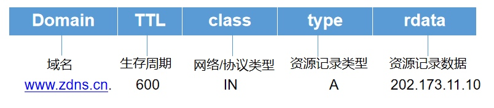
1. 域名
2. TTL，就是生存周期，是本地服务器会在缓存中保存该资源记录的时长。
3. 网络/协议类型，它的代表的标识是IN，IN就是internet，目前DNS系统主要支持的协议是IN。
4. type，就是资源记录类型，一般的网站都是都是A记录（IPv4的主机地址）。（AAAA为IPv6的标识）
5. data是资源记录数据，就是域名关联的信息数据。

#### DNS服务器的分类
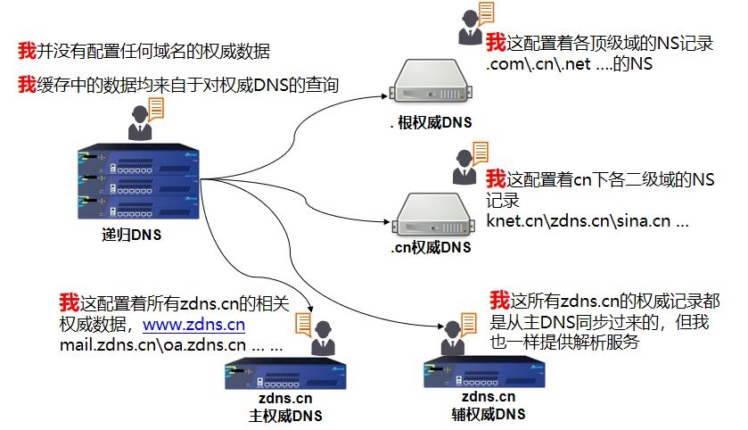
常见的DNS服务器就是两种：权威解析服务器和递归解析服务器。递归解析服务器也可以叫做localDNS。

##### 权威解析服务器
DNS权威服务器保存着域名空间中部分区域的数据。如果DNS服务器负责管辖一个或多个区域时，称此DNS服务器为这些区域的权威服务器。

根权威DNS或者二级权威服务器中的资源记录标记被指定为区域权威服务器的DNS服务器。通过资源记录中列出服务器，其他服务器就认为它是该区域的权威服务器。这意味着在 NS 资源记录中指定的任何服务器都被其他服务器当作权威的来源，并且能肯定应答区域内所含名称的查询。

##### 递归服务器
递归服务器在正常情况下，初始的时候里面没有任何域名解析数据，里面所有的域名解析数据都来自于它到权威解析服务器的查询结果，一旦查询完毕，递归服务器就会根据TTL时间在本地形成一条缓存记录，并为用户提供DNS解析的查询服务，这是递归服务器的功能。

#### DNS劫持
DNS（域名系统）劫持又叫域名劫持，指攻击者利用其他攻击手段，篡改了某个域名的解析结果，使得指向该域名的IP变成了另一个IP，导致对相应网址的访问被劫持到另一个不可达的或者假冒的网址，从而实现非法窃取用户信息或者破坏正常网络服务的目的。

由于域名劫持往往只能在特定的被劫持的网络范围内进行，==所以在此范围外的域名服务器（DNS）能够返回正常的IP地址，高级用户可以在网络设置把DNS指向这些正常的域名服务器以实现对网址的正常访问。== 所以域名劫持通常相伴的措施——封锁正常DNS的IP。==如果知道该域名的真实IP地址，则可以直接用此IP代替域名后进行访问。比如访问百度域名，可以把访问改为202.108.22.5，从而绕开域名劫持。==

要执行攻击，攻击者要么在用户的系统上安装恶意软件，要么通过利用已知漏洞或破解DNS通信来接管路由器。因此，用户将成为域欺骗或网络钓鱼的受害者。

##### DNS劫持的工作原理
您的DNS服务器由您的ISP（Internet服务提供商）拥有和控制，您的系统的DNS设置通常由您的ISP分配。当用户尝试访问网站时，请求被引用到他们系统的DNS设置，而DNS设置又将请求重定向到DNS服务器。DNS服务器扫描DNS请求，然后将用户定向到所请求的网站。

但是，当用户DNS设置因恶意软件或路由器入侵而受到威胁时，==用户发出的DNS请求将被重定向到由攻击者控制的流氓DNS服务器。==这个受攻击者控制的流氓服务器会将用户的请求转换为恶意网站。

##### DNS劫持的应对方法
- 修改路由器密码
- 手动修改DNS：将本地DNS设置为更加可靠的服务器

##### 怎么防止DNS劫持攻击？
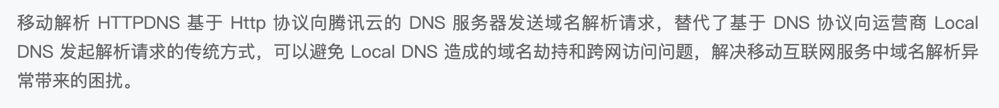

1. 使用HTTPDNS：不走传统的DNS解析，绕开本地的DNS服务器，而是基于HTTP协议的DNS服务器集群，当客户端需要DNS解析的时候，直接通过HTTP协议进行请求这个服务器集群。简单来说：就是给权威性的DNS服务器发起HTTP请求，让他们去解析，绕开本地DNS的解析。
2. 建议使用复杂的密码重置路由器的默认密码。
3. 使用DNS注册器时使用双因素身份验证，并修补路由器中存在的所有漏洞以避免危害。
4. 最好远离不受信任的网站，避免下载任何免费的东西。
5. 如果您已被感染，建议删除HOSTS文件的内容并重置Hosts File。
6. 为防止DNS劫持，始终建议使用良好的安全软件和防病毒程序，并确保定期更新软件。
7. 安全专家建议使用公共DNS服务器。
8. 最好定期检查您的DNS设置是否已修改，并确保您的DNS服务器是安全的。

[学习链接🔗](https://zhuanlan.zhihu.com/p/348711884)

#### ARP欺骗
先简单描述一下ARP协议：ARP协议翻译为地址转换协议，是用于局域网内的从IP地址到MAC地址的转换，工作在OSI模型中的数据链路层。
在以太网中，网络设备之间的通信是依靠MAC地址实现的，并非IP地址，那么就需要通过ARP协议将IP地址转换为MAC地址。
在查找MAC地址过程中，首先主机会查看自己的ARP缓存表，看是否有对应的记录，有的话直接使用；没有的话，那么就会在局域网内发出一个ARP请求包，询问这个IP地址对应的MAC地址是什么，当收到ARP响应包之后，会在ARP缓存表上记录下对应的记录。

从上面的描述中，可以知道，主机是通过收到ARP响应包，然后更新自己的ARP缓存表的。那么ARP欺骗的工作机制就是利用这个缺点实现的。

当主机收到ARP应答包之后，是不会去验证自己是否向对方主机发送过ARP请求包，主机会直接将这个包中返回的IP地址与MAC地址的对应关系保存在ARP缓存中，如果本身已经存在关系，那么原有的就会被替换掉。

那么攻击者为了拦截主机A与路由器之间的通信，就会伪造一个ARP响应包，包中的IP地址为路由器地址，MAC地址为攻击者设备的MAC地址，那么主机A收到应答包之后，会更新自己的ARP缓存表，当要发送信息到路由器时，就会发到了攻击者设备上，这就是ARP欺骗。

[学习链接🔗](https://www.jianshu.com/p/d6f84e2e88c6)

#### 公有云DNS
- 公有云：公有云通常指第三方提供商为用户提供的能够使用的云，公有云一般可通过 Internet 使用，可能是免费或成本低廉的，公有云的核心属性是共享资源服务。

### CSRF
跨站请求伪造（英语：Cross-site request forgery），也被称为 one-click attack 或者 session riding，通常缩写为 CSRF 或者 XSRF。这是一种利用网页对用户浏览器的信任，攻击者诱导用户点击非法的链接，让浏览器携带Cookie对攻击网站发起非用户本意的操作。

#### 攻击原理
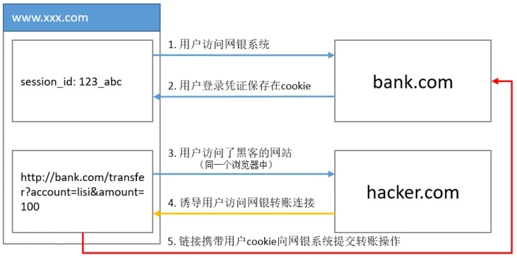
1. 首选用户通过浏览器访问网银系统
2. 用户在网银登录后，浏览器会把用户session_id保存在浏览器Cookie中
3. 此时用户在同一个浏览器中访问了第三方网站
4. 第三方网站诱导用户访问了网页转账的链接
5. 由于用户在网银系统已经登录了，浏览器访问网银转账链接时，会带上用户在网银的Cookie信息
6. 网银系统根据用户提交Cookie中的session_id，以为用户本人发起了转账操作，于是执行转账业务。
至此，在用户不知情的情况下，网银执行了转账业务，这就是跨站（第三方站点的发起请求）请求伪造（非用户发起的请求）的基本攻击原理。

#### 常见的攻击方式
- 第三方页面上构造一个链接，诱导用户点击触发请求
- 第三方页面上构造一个form表单，访问页面时，表单自动提交

#### 防范措施
根据CSRF攻击的特点，要成功攻击，必须满足几个条件。
- 用户在被攻击的系统中登录了。（相当于浏览器存储了Cookie）
- 用户在第三方系统触发了对被攻击系统的请求，而被攻击服务器无法识别此请求来源。

防范措施主要有：
1. 根据HTTP请求的头部字段referer信息，该字段保存着请求是从哪个网站发出的 - 但是有局限性：reterer字段信息是由浏览器提供的，因此如果浏览器存在漏洞，那么reterer字段信息是不可信的。
2. CSRF Token：
    1. 由于CSRF的本质是攻击者诱导用户点击攻击链接，浏览器携带Cookie对攻击网站发起请求。因此可以在访问敏感信息时，要求浏览器提供不保存在Cookie，并且攻击者无法伪造的数据作为校验，那么就可以有效地避免CSRF攻击了。
    2. Token的生成：浏览器要提供用户名以及密码，待服务器验证后，会生成一个随机数返回给浏览器，浏览器不能保存在Cookie中，当对敏感信息发起请求时，携带Token作为验证。
3. 用户操作限制 - 验证码机制
    1. 因为CSRF利用的网页对用户浏览器的信息，那么增加对用户的验证就可以避免这个问题
    2. 缺点就是影响用户体验
    
### XSS攻击
XSS（Cross Site Scripting，跨站脚本攻击）
跨站脚本攻击是指恶意攻击者往Web页面里插入恶意脚本代码，当用户浏览该页时，嵌入其中Web里面的脚本代码会被执行，从而达到恶意攻击用户的目的。其特点是不对服务器端造成任何伤害

举个例子：
在论坛网站上，攻击者发布了一项script代码的内容，如果服务端没有对用户的输入进行过滤，那么当其他用户访问该网页时，就会自动运行该脚本，那么用户就会被攻击了。

#### 防御XSS攻击
理论上，所有可输入的地方没有对输入数据进行处理的话，都会存在 XSS 漏洞，漏洞的危害取决于攻击代码的威力，攻击代码也不局限于 script。防御 XSS 攻击最简单直接的方法，就是过滤用户的输入。

如果不需要用户输入 HTML，可以直接对用户的输入进行 HTML escape 。下面一小段脚本：
```Html
  <script>window.location.href=”http://www.baidu.com”;</script>
```

经过 escape 之后就成了：
```Html
&lt;script&gt;window.location.href=&quot;http://www.baidu.com&quot;&lt;/script&gt;
```

它现在会像普通文本一样显示出来，变得无毒无害，不能执行了。

当我们需要用户输入 HTML 的时候，需要对用户输入的内容做更加小心细致的处理。仅仅粗暴地去掉 script 标签是没有用的，任何一个合法 HTML 标签都可以添加 onclick 一类的事件属性来执行 JavaScript。更好的方法可能是，==将用户的输入使用 HTML 解析库进行解析，获取其中的数据。然后根据用户原有的标签属性，重新构建 HTML 元素树。构建的过程中，所有的标签、属性都只从白名单中拿取。==


### 零碎的HTTP问题
#### “https和http相比，就是传输的内容多了对称加密，可以这么理解吗？”
1. “建立连接时候：https 比 http多了 TLS 的握手过程；”
2. “传输内容的时候：https 会把数据进行加密，通常是对称加密数据；”

#### “文中 TLS 和 SSL 没有做区分，这两个需要区分吗？”
“这两实际上是一个东西。

SSL 是洋文 “Secure Sockets Layer 的缩写，中文叫做「安全套接层」。它是在上世纪 90 年代中期，由网景公司设计的。

到了1999年，SSL 因为应用广泛，已经成为互联网上的事实标准。IETF 就在那年把 SSL 标准化。标准化之后的名称改为 TLS（是 “Transport Layer Security” 的缩写），中文叫做 「传输层安全协议」。

很多相关的文章都把这两者并列称呼（SSL/TLS），因为这两者可以视作同一个东西的不同阶段。”

### “为啥 ssl 的握手是 4 次？”
1. 客户端请求建立SSL连接，并向服务端发送一个随机数–Client random和客户端支持的加密方法，比如RSA公钥加密，以及支持的SSL/TLS的版本号，此时是明文传输。
2. 服务端回复一种客户端支持的加密方法、选择的SSL/TLS的版本号、一个随机数–Server random、授信的服务器证书和非对称加密的公钥。
3. 客户端收到服务端的响应后，验证服务端信息的正确性，并利用内置的CA公钥解密证书获得服务端的公钥，利用服务端的公钥对新生成的随机数进行加密，并且告诉服务端使用了加密算法，还把客户端之前发送的报文进行摘要发给服务端。
4. 服务端收到客户端的回复，利用私钥进行解密，同时利用三个随机数根据加密算法生成通信时加密使用的密钥，同时还要回复客户端当前密钥已经解出来了，并附上服务端之前报文的摘要。

此后的HTTP数据传输即通过对称加密方式进行加密传输。

#### 为什么要对URL进行编码
1. 对URL中的特殊字符进行转义。HTTP协议中参数的传输是"key=value"的格式，如果有多个参数的话就要用“&”字符对键值对进行分割，比“name1=value1&name2=value2”，但是如果参数值中就包含“=”或者“&”的特殊字符，那么服务器就有可能会解析错误，那么这种情况下需要对URL进行编码，在参数值的特殊字符之前加上“%”，这样，服务器就能正确识别出正确的URl了
2. URL是通过使用ASCII码字符集编写的，那么说明URL只能使用英文字母，阿拉伯数字和某些符号，不能中文以及其他符号；那么如果URL中存在ASCII字符集无法表示的符号，那么就需要编码来实现转换。
3. URL编码又称为百分号编码

### 中间人攻击的概念与防范
概念：
在密码学和计算机安全领域中，==中间人攻击（Man-in-the-middle attack，缩写：MITM）==是指攻击者与通讯的两端分别建立独立的联系，并交换其所收到的数据，使通讯的两端认为他们正在通过一个私密的连接与对方直接对话，但事实上整个会话都被攻击者完全控制。在中间人攻击中，攻击者可以拦截通讯双方的通话并插入新的内容。

防范：
中间人攻击在于通讯两端在通讯时没有验证双方的身份，通信的内容没有经过加密，而且没有保证数据在传输过程中没有被篡改。
上面出现的问题主要体验在基于HTTP协议的网络传输中，由于HTTP协议是明文传输的，不安全的，那么为了解决上述问题，可以采用HTTPS。

“HTTPS 是如何解决上面的三个风险的？”
1. “混合加密的方式实现信息的机密性，解决了窃听的风险。
2. 摘要算法的方式来实现完整性，它能够为数据生成独一无二的「指纹」，指纹用于校验数据的完整性，解决了篡改的风险。
3. CA证书的验证，可以有效地验证身份的正确性，解决了冒充的风险。”

#### 中间人攻击中的SSL劫持 与 SSL剥离（降级）
SSL劫持与SSL剥离都属于中间人攻击（MITM），因此中间人即攻击者都会与两端建立独立的连接，并为其交换数据，从而窥探两端传输的数据，以及插入新的内容等。

##### SSL劫持
SSL中间人劫持即攻击者首先通过==ARP欺骗、DNS劫持甚至是网关劫持等==，将客户端的访问重定向到攻击者的服务端上，让客户端与攻击者建立HTTPS连接（使用伪造证书），而攻击者再与服务端连接。

由于攻击者与客户端连接过程中使用的是伪造证书，因此客户端浏览器上会显示证书认证失败，但是如果用户还是点了继续访问，那么就会被劫持了，如果点了拒绝的话，是没有被劫持的。

伪造证书的大概流程为：客户端发起HTTPS连接时，攻击者会重定向到服务端，当服务端返回证书时，攻击者会将服务器的公钥替换成自己的公钥，伪造一个证书返回给客户端。

这种情况下，客户端在进行证书验证时是可以验证出来的，因为验证流程为：根据服务端证书上的发行者，一直寻找到内置的根证书，然后从根证书开始进行一层一层的验证，当在验证伪造证书时，上一层使用公钥对证书的签名进行解密，得出一个摘要，此时会对证书上的信息进行一个摘要，比对两个摘要是否一致，一致的话就验证成功，否则失败；那么伪造证书时，公钥是攻击者的，因此得出的摘要肯定是不匹配的。
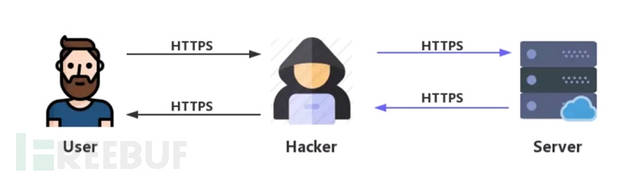

##### SSL剥离
SSL剥离也称为SSL降级，即将HTTPS的连接降级为HTTP连接，那么两端的信息都会暴露给了攻击者了。

该攻击方式主要利用用户并不是每次都直接在浏览器上输入https://xxx.xxx.com的链接来访问网站的，或者有些网站并非全网HTTPS，而是只在需要进行敏感数据传输时才使用到HTTPS的漏洞。

但是如果客户端直接访问HTTPS的URL，攻击者是没有办法直接进行降级的，因为HTTPS与HTTP虽然都是TCP链接，但是HTTPS在传输HTTP数据之前，需要再进行SSL握手，并协商得出密钥用来后续的加密，攻击者即使盗取了信息，但是也无法解密取到里面的数据。

中间人在劫持了客户端与服务端的HTTP会话之后，将HTTP页面中的https：//超链接都替换成了http：//的，用户在点击一些需要加密的超链接周，其实还是使用HTTP协议来进行反问的。这样，就算服务器对相应的URL只支持HTTPS连接，但是中间人一样可以和服务端建立HTTPS连接之后，将数据使用HTTP协议转发给客户端来完成会话劫持。
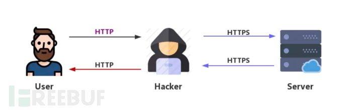

[学习链接🔗](https://jishuin.proginn.com/p/763bfbd63334)
[学习链接🔗](https://www.freebuf.com/column/205786.html)

#### HSTS
为了防止利用SSL剥离实施中间人攻击的情况，产生了一门新技术HSTS。
HSTS（HTTP Strict Transport Security）翻译为HTTP严格传输安全。这是一种网站用来声明她们只能使用安全连接（HSTS）的方法。如果一个网站声明了HSTS策略，浏览器必须拒绝所有的HTTP连接并阻止用户接受不安全的SSL证书。

##### HSTS工作机制
通常，在Web浏览器输入URL时，会跳过协议部分，那么浏览器会帮我们自动补全成http协议，那么就会发送一个http请求到目标网站，目标网站会返回301状态码将请求重定向到HTTPS站点。接下来浏览器使用HTTPS连接到目标网站，这是目标网站的HSTS安全策略开始奏效，返回的响应包中含有一个首部字段`Strict-Transport-Security: max-age=31536000; includeSubDomains; preload`来表示在max-age时间内访问网站都要使用HTTPS连接，而且本域名的子域名也是一样的。

在HSTS安全机制生效后，如果浏览器收到使用HTTP加载资源的请求，也会自动将他们转换成HTTPS连接，如果HTTPS不可用，就会立刻终止连接。
此外，如果网站的证书无效，通常来说，会询问你是否继续访问，但是在HSTS机制下，是不允许继续访问的，除非从浏览器的HSTS列表中删除该站点。
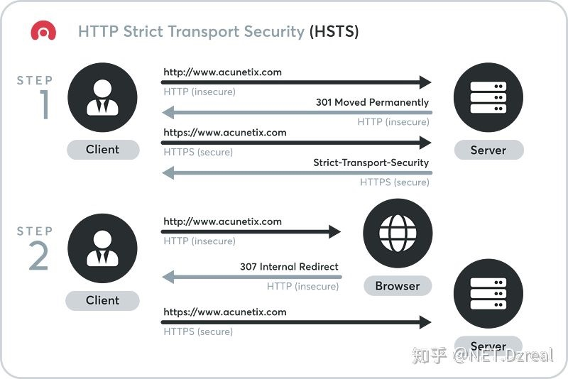

##### 但这也不是绝对安全
因为第一次访问目标网站时，是不受HSTS保护的。当用户输入的URL使用的HTTP协议，那么就会被网站重定向到HTTPS站点，然后服务器返回的第一个响应中才会声明HSTS机制。那说明如果在第一次HTTP访问时，就被攻击了，那么还是无法避免后面的信息内容被窥探的。

那么为了解决这个问题，有一个称为HSTS预加载列表的附加保护方法。浏览器不能访问或下载预加载列表，它作为硬编码资源和新的浏览器版本一起分发。这意味着站点会在预加载列表中保存很长的时间。

在浏览器发起请求前，会检查内部列表是否有该站点，有的话第一次访问就会采用HTTS连接，那么避免了首次连接的HTTP请求，让攻击者更难攻击。

##### 如何将域名添加到HSTS预加载列表
1. 首先确保网站有最新的证书以及最新的密码
2. 如果网站可以通过HTTP访问，可以将所有的请求重定向到HTTPS站点。
3. 确保域名内的子域名也满足上述两点要求。
4. 通过 HTTPS 服务返回 Strict-Transport-Security header ，带上 base domain 和 max-age ，max-age 至少为31536000 (1 年)，另外还有 includeSubDomains 指令和 preload 指令。
5. 访问 http://hstspreload.org ，并使用表格提交你的域名。如果符合条件，您的域名将被加入队列。


### QUIC
QUIC（Quick UDP Internet Connection）是谷歌制定的一种基于UDP的低时延的互联网传输层协议。主要存在于HTTP/3协议中。

我们先看看在HTTP/1.1以及HTTP/2中出现的问题。
- “HTTP/1.1 中的管道（ pipeline）传输中如果有一个请求阻塞了，那么队列后请求也统统被阻塞住了” —— 因为客户端发送请求是管道化传输的，但是服务端处理请求是按顺序处理的，因此当处理的请求需要很长时间，就会阻塞后面的请求。
- “HTTP/2 多个请求复用一个TCP连接，一旦发生丢包，就会阻塞住所有的 HTTP 请求。”

其实上面的问题都是基于TCP连接产生的，所以在HTTP/3中把HTTP下层的TCP改成了UDP。

“UDP 发生是不管顺序，也不管丢包的，所以不会出现 HTTP/1.1 的队头阻塞 和 HTTP/2 的一个丢包全部重传问题。”

“大家都知道 UDP 是不可靠传输的，但基于 UDP 的 QUIC 协议 可以实现类似 TCP 的可靠性传输。”但存在的问题就是为了确保数据传输的可靠性，应用层协议需要自己完成包传输情况的确认。

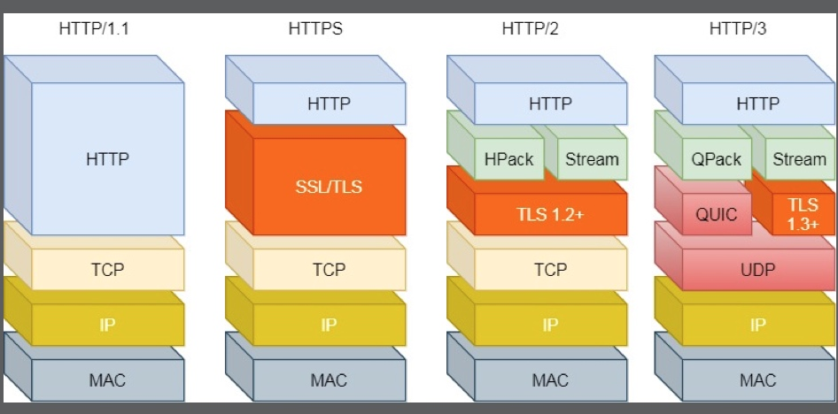
QUIC 其实就相当于了 HTTP2 + TLS + UDP

QUIC的特点：
- 不会出现HTTP/1.1中的队头阻塞以及HTTP/2中的丢包阻塞请求的问题
- 利用缓存，显著减少连接建立的时间
- 改善拥塞控制，拥塞控制从内核空间到用户空间；（QUIC在应用层即可实现不同的拥塞控制算法，不需要改操作系统和内核）
- “QUIC 有自己的一套机制可以保证传输的可靠性的。当某个流发生丢包时，只会阻塞这个流，其他流不会受到影响。”
- 对比于HTTPS建立连接需要3次握手，再需要TLS的握手，QUIC只需要3次握手，减少了交互的次数。

### 证书签发、信任过程以及证书信任链
#### 证书签发过程
- 申请者通过非对称加密算法（RSA）生成一对公钥和私钥，然后将签发证书所用到的身份信息连同公钥发送给证书认证机构（CA）
- CA验证了身份信息是无误之后，通过摘要算法（MD5，SHA）生成关于身份信息的摘要签名，然后把摘要签名以及使用的摘要算法用CA的私钥进行加密。

最后证书的组成为
1. 公钥
2. 证书拥有者身份信息
3. 数字证书认证机构（发行者）信息
4. 发行者对证书的数字签名
5. 有效期

#### 证书信任链
在证书的签发过程中，向CA申请证书是需要CA的私钥对整个证书的签名摘要进行非对称加密的，那么就是说证书是可以通过CA的公钥去解密得到证书的签名摘要的。
当我们再次使用相同的摘要算法（证书里面保存着）对整个证书进行签名，如果得到的签名和证书上的签名是一样的，那么就说明这个证书是可信任的。

- 在现代浏览器中，证书的信任过程是依赖证书信任链的。
- 操作系统会预先安装一些根证书，都是国际上很有权威的证书机构，而我们普通申请的ssl证书都是这个根证书的孙证书。根证书签发中间证书，中间证书签发根证书。
- 证书是以证书链的形式存在的，只有当整个证书链上的证书都是有效时，才会认定当前证书是有效的。
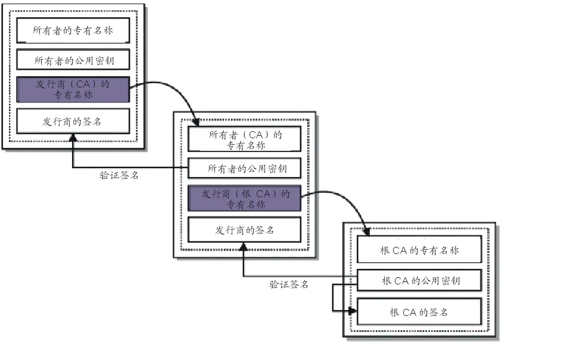
1. 客户端得到服务端返回的证书，通过读取证书信息得到服务端证书的发布机构。
2. 客户端就会根据证书的发布机构在证书信任链里层层寻找，一直到根证书，根证书已经是最权威的，采用的是自签名。
3. 利用根证书的公钥去解密验证上一层证书的合法性，验证合法之后再利用上一层的公钥去验证再上一层证书的合法性。
4. 最后验证服务端的证书是可信任的。
[学习链接🔗](https://www.nginx.cn/5559.html)

### 网站url书写格式
http://www.php.cn:80/mix/76.html?name=kelvin&password=123456#first

#### 协议部分
使用的协议一般为http或者https，格式为http：//，//为分割符

#### 域名部分
www.php.cn是域名，发送请求时，需要向DNS服务器解析IP。如果为了优化请求，可以直接用IP地址作为域名部分使用。

#### 端口部分
域名后的80表示端口号，端口号与域名之间以：作为分隔符，端口号在UrL中可以省略不写。

#### 虚拟目录部分
上文链接中的/mix/表示一个目录，目录是以/ / 两个/作为标识的。

#### 文件名部分
从域名最后一个/到？为止，是文件名部分；如果没有？，则是从域名最后一个/到#为止，是文件名部分；如果没有？和#，那么就是从域名的最后一个/从开始到结束，都是文件名部分。上文链接中的文件名为76.html

#### 锚部分
从#开始到最后，都是锚部分。上文链接中的锚部分为first。

#### 参数部分
从？开始到#为止之间的部分都是参数部分。如果有多个参数，各个参数之间用&作为分隔符。


### HTTP、TCP、UDP、IP三层协议中，接收端如何判断数据已经接收完毕
- HTTP
HTTP报文的首部字段中有content-Length表示数据的长度，接收端可以依照这个字段信息来判断接收的数据是否完全。
但是如果在分块传输的情况下，报文的字段信息中是没有content-Length的，因为分块传输的情况下是无法得知最终的长度是多少的。那么就要依靠接收端收到最后一个长度为0的分块，那么就代表接收完毕。

- TCP
TCP提供是基于连接的可靠传输，发送端要基于接收端回复的确认才会不断往下发送数据，那么当接收端请求下一个数据包却迟迟没有回应时，那么就可以判断接收完毕了；而且在大多数情况下，发送端将数据发送完毕后，会发送中断连接请求，那么这时接收端就知道数据已经接收完毕了。

- UDP
UDP包的首部字段中有一个包长度的字段，根据此字段信息来判断包是否接收完整。

- IP
IP协议是无连接协议，不需要考虑对方是否接收完毕。但是如果IP数据报被分片了，那么只有一个分片中的“是否还有分片”值为0，其他均为1，可以通过此信息来判断是否已经接收全部分片。

### DDos
分布式拒绝服务攻击（英文为Distributed Denial of Service，简称为DDos）是指处于不同位置上的多个攻击者同时向一个或多个目标发送攻击，或者一个攻击者控制了不同位置的多台机器并利用这些机器对受害者实施攻击。由于攻击的出发点是分布在不同地方的，这类攻击称为分布式拒绝服务攻击，其中TCP上的洪泛SYN攻击就属于DDos攻击。

### CDN
CDN（Content Distribution Network），中文名为内容分发网络，CDN主要用于网络加速。

#### 为什么要有网络加速
当访问远距离上的服务器时，会存在比较大的延迟，那么用户体验就会变得很差。
而CDN的出现就是为了减少这种网络延迟。

#### 什么是CDN
CDN 的最核心原则是“就近访问”，如果用户能够在本地几十公里的距离之内获取到数据，那么时延就基本上变成 0 了。

所以 CDN 投入了大笔资金，在全国、乃至全球的各个大枢纽城市都建立了机房，部署了大量拥有高存储高带宽的节点，构建了一个专用网络。这个网络是跨运营商、跨地域的，虽然内部也划分成多个小网络，但它们之间用高速专有线路连接，是真正的“信息高速公路”，基本上可以认为不存在网络拥堵。

有了这个高速的专用网之后，CDN 就要“分发”源站的“内容”了，把源站的内容逐级缓存到网络的每一个节点上。

于是，用户在上网的时候就不直接访问源站，而是访问离他“最近的”一个 CDN 节点，术语叫“边缘节点”（edge node），其实就是缓存了源站内容的代理服务器，这样一来就省去了“长途跋涉”的时间成本，实现了“网络加速”。

#### CDN 都能加速什么样的“内容”呢？
在 CDN 领域里，“内容”其实就是 HTTP 协议里的“资源”，比如超文本、图片、视频、应用程序安装包等等。

资源按照是否可缓存又分为“静态资源”和“动态资源”。所谓的“静态资源”是指数据内容“静态不变”，任何时候来访问都是一样的，比如图片、音频。所谓的“动态资源”是指数据内容是“动态变化”的，也就是由后台服务计算生成的，每次访问都不一样，比如商品的库存、微博的粉丝数等。

很显然，只有静态资源才能够被缓存加速、就近访问，而动态资源只能由源站实时生成，即使缓存了也没有意义。不过，如果动态资源指定了“Cache-Control”，允许缓存短暂的时间，那它在这段时间里也就变成了“静态资源”，可以被 CDN 缓存加速。

#### CDN的运行机制
我们再来看看 CDN 是具体怎么运行的，它有两个关键组成部分：全局负载均衡和缓存系统，对应的是 DNS 和 缓存代理技术。

全局负载均衡（Global Sever Load Balance）一般简称为 GSLB，它是 CDN 的“大脑”，主要的职责是当用户接入网络的时候在 CDN 专网中挑选出一个“最佳”节点提供服务，解决的是用户如何找到“最近的”边缘节点，对整个 CDN 网络进行“负载均衡”。
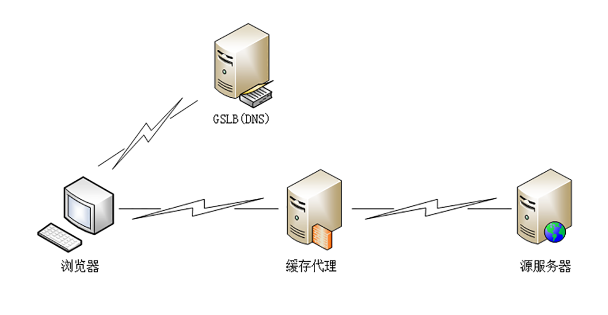
原来没有 CDN 的时候，权威 DNS 返回的是网站自己服务器的实际 IP 地址，浏览器收到 DNS 解析结果后直连网站。

但加入 CDN 后就不一样了，权威 DNS 返回的不是 IP 地址，而是一个 CNAME( Canonical Name ) 别名记录，指向的就是 CDN 的 GSLB。它有点像是 HTTP/2 里“Alt-Svc”的意思，告诉外面：“我这里暂时没法给你真正的地址，你去另外一个地方再查查看吧。”

因为没拿到 IP 地址，于是本地 DNS 就会向 GSLB 再发起请求，这样就进入了 CDN 的全局负载均衡系统，开始“智能调度”，主要的依据有这么几个：
- 看用户的 IP 地址，查表得知地理位置，找相对最近的边缘节点；
- 看用户所在的运营商网络，找相同网络的边缘节点；
- 检查边缘节点的负载情况，找负载较轻的节点；
- 其他，比如节点的“健康状况”、服务能力、带宽、响应时间等。

GSLB 把这些因素综合起来，用一个复杂的算法，最后找出一台“最合适”的边缘节点，把这个节点的 IP 地址返回给用户，用户就可以“就近”访问 CDN 的缓存代理了。

#### CDN 的缓存代理
但互联网上的资源是无穷无尽的，不管 CDN 厂商有多大的实力，也不可能把所有资源都缓存起来。所以，缓存系统只能有选择地缓存那些最常用的那些资源。

这里就有两个 CDN 的关键概念：“命中”和“回源”。

“命中”就是指用户访问的资源恰好在缓存系统里，可以直接返回给用户；“回源”则正相反，缓存里没有，必须用代理的方式回源站取。

相应地，也就有了两个衡量 CDN 服务质量的指标：“命中率”和“回源率”。命中率就是命中次数与所有访问次数之比，回源率是回源次数与所有访问次数之比。显然，好的 CDN 应该是命中率越高越好，回源率越低越好。现在的商业 CDN 命中率都在 90% 以上，相当于把源站的服务能力放大了 10 倍以上。

怎么样才能尽可能地提高命中率、降低回源率呢？

首先，最基本的方式就是在存储系统上下功夫，硬件用高速 CPU、大内存、万兆网卡，再搭配 TB 级别的硬盘和快速的 SSD。软件方面则不断“求新求变”，各种新的存储软件都会拿来尝试，比如 Memcache、Redis、Ceph，尽可能地高效利用存储，存下更多的内容。

其次，缓存系统也可以划分出层次，分成一级缓存节点和二级缓存节点。一级缓存配置高一些，直连源站，二级缓存配置低一些，直连用户。回源的时候二级缓存只找一级缓存，一级缓存没有才回源站，这样最终“扇入度”就缩小了，可以有效地减少真正的回源。

第三个就是使用高性能的缓存服务。

## TCP常见面试问题
### 三次握手过程理解
第一次握手：建立连接时，客户端发送syn包（syn=x）到服务器，并进入SYN_SENT状态，等待服务器确认；SYN：同步序列编号（Synchronize Sequence Numbers）。

第二次握手：服务器收到syn包，必须确认客户的SYN（ack=x+1），同时自己也发送一个SYN包（syn=y），即SYN+ACK包，此时服务器进入SYN_RECV状态；

第三次握手：客户端收到服务器的SYN+ACK包，向服务器发送确认包ACK(ack=y+1），此包发送完毕，客户端和服务器进入ESTABLISHED（TCP连接成功）状态，完成三次握手。

第三次握手的时候已经可以携带数据了。

三次的原因是：可以确保客户端和服务端的发送和接收功能都是正常的。

### 四次挥手过程理解 
1）客户端进程发出连接释放报文，并且停止发送数据。设置报文的控制位FIN=1，其序列号为seq=u（等于前面客户端最后传送过去的包的最后一个字节序号加1），此时，客户端进入FIN-WAIT-1（终止等待1）状态。 
2）服务器收到连接释放报文，发出确认报文，ACK=1，ack=u+1，并且带上自己的序列号seq=v，此时，服务端就进入了CLOSE-WAIT（关闭等待）状态。TCP服务器通知高层的应用进程，客户端向服务器的方向就释放了，这时候处于半关闭状态，即客户端已经没有数据要发送了，但是服务器若发送数据，客户端依然要接受。这个状态还要持续一段时间，也就是整个CLOSE-WAIT状态持续的时间。
3）客户端收到服务器的确认请求后，此时，客户端就进入FIN-WAIT-2（终止等待2）状态，等待服务器发送连接释放报文（在这之前还需要接受服务器发送的最后的数据）。
4）服务器将最后的数据发送完毕后，就向客户端发送连接释放报文，FIN=1，ack=u+1，由于在半关闭状态，服务器很可能又发送了一些数据，假定此时的序列号为seq=w，此时，服务器就进入了LAST-ACK（最后确认）状态，等待客户端的确认。
5）客户端收到服务器的连接释放报文后，必须发出确认，ACK=1，ack=w+1，而自己的序列号是seq=u+1，此时，客户端就进入了TIME-WAIT（时间等待）状态。注意此时TCP连接还没有释放，必须经过2MSL（最长报文段寿命）的时间后，进入CLOSED状态。
6）服务器只要收到了客户端发出的确认，立即进入CLOSED状态。同样，撤销TCB后，就结束了这次的TCP连接。可以看到，服务器结束TCP连接的时间要比客户端早一些。

### 为什么连接的时候是三次握手，关闭的时候却是四次挥手？
连接时当Server端收到Client端的SYN连接请求报文后，可以直接发送SYN+ACK报文。其中ACK报文是用来应答的，SYN报文是用来同步的。但是关闭连接时，当Server端收到FIN报文时，很可能并不会立即关闭SOCKET，所以只能先回复一个ACK报文，告诉Client端，"你发的FIN报文我收到了"。只有等到我Server端所有的报文都发送完了，我才能发送FIN报文，因此不能一起发送。故需要四步握手。
（程序实现的时候ACK包其实是自动回的）

### 为什么TIME_WAIT状态需要经过2MSL(最大报文段生存时间)才能返回到CLOSE状态？
虽然按道理，四个报文都发送完毕，我们可以直接进入CLOSE状态了，但是我们必须假象网络是不可靠的，有可以最后一个ACK丢失。所以TIME_WAIT状态就是用来重发可能丢失的ACK报文。在Client发送出最后的ACK回复，但该ACK可能丢失。Server如果没有收到ACK，将不断重复发送FIN片段。所以Client不能立即关闭，它必须确认Server接收到了该ACK。Client会在发送出ACK之后进入到TIME_WAIT状态。Client会设置一个计时器，等待2MSL的时间。如果在该时间内再次收到FIN，那么Client会重发ACK并再次等待2MSL。所谓的2MSL是两倍的MSL(Maximum Segment Lifetime)。MSL指一个片段在网络中最大的存活时间，2MSL就是一个发送和一个回复所需的最大时间。如果直到2MSL，Client都没有再次收到FIN，那么Client推断ACK已经被成功接收，则结束TCP连接。

### 如果已经建立了连接，但是客户端突然出现故障了怎么办？
TCP还设有一个保活计时器，显然，客户端如果出现故障，服务器不能一直等下去，白白浪费资源。服务器每收到一次客户端的请求后都会重新复位这个计时器，时间通常是设置为2小时，若两小时还没有收到客户端的任何数据，服务器就会发送一个探测报文段，以后每隔75秒钟发送一次。若一连发送10个探测报文仍然没反应，服务器就认为客户端出了故障，接着就关闭连接。


### TCP和UDP的头部列举
UDP的首部包括源端口号、目标端口号、包长度和校验和。UDP的首部为8B。
- 源端口号2B，目标端口号2B，包长度2B，校验和2B
- 包长度保存了UDP首部的长度跟数据的长度之和
- 校验和
    校验和是为了校验包是否出错。
    
TCP首部相比UDP首部要复杂得多。
TCP首部有源端口号、目标端口号、序列号、确认应答号、数据偏移、保留、控制位、窗口大小、校验和、紧急指针、选项、填充、数据部分。

- 源端口号
    - 字段16位
- 目标端口号
    - 字段16位
- 序列号
    - 指的是发送的数据段的序列号。
    - 序列号不会从0或1开始，而是在建立连接时由计算机生成的随机数作为其初始值，通过SYN包传给接收端主机；
    - 连接建立之后序列号为客户端/服务端最后传送去对方的包的最后的字节序号加1为待发送出去的包的序列号
- 确认应答号 
    - 确认应答号表示下一次想要接收的数据的序列号。
- 数据偏移
    - 该字段表示TCP所传输的数据部分应该从TCP包的哪个位开始计算，当然这也可以把它看作为TCP首部的长度。
- 保留 
    - 该字段主要是为了以后扩展时使用。
- 控制位
    - 字段长8位。有8个控制字段。
        - CWR：CWR标志与后面的ECE标志都用于IP首部的ECN字段。
        - ECE：置为1时会通知通信对方，从对方到这边的网络有拥塞。
        - URG：该位为1时，表示包中有需要紧急处理的数据。
        - ACK：该位为1时，确认应答的字段变为有效。TCP除了最初建立连接时的SYN包之外该位都设置为1.
        - PSH：该位为1时，表示需要将收到的数据立刻传给上层应用协议。该位为0时，则不需要立即传而是先进行缓存。
        - RST：该位为1时表示TCP连接中出现了异常必须强制断开连接。
        - SYN：该位为1时，表示连接请求报文。
        - FIN：该位为1时，表示释放连接。
- 窗口大小
    - 用于通知发送端当前接收端可以接收的缓存大小。
- 校验和
    - 校验和跟UDP的区别不大，都是添加一个伪首部，然后对所有数据进行二进制反码求和，然后再取反码，即可得出校验和的值。当接收端收到之后，也会添加一个伪首部，然后对所有数据进行二进制反码求和，如果结果为全1，然后就是没有出错，否则判定为数据出错了。

- FCS 与 校验和
    - FCS是用于数据链路层上对噪声干扰引发数据帧的出错的检测。FCS是由帧头以及数据部分算出来的。
    - 校验和是一种进行路由器内存故障或者程序漏洞导致的数据是否被破坏的检查。
- 紧急指针
    - 该字段长16位。只有在URG控制位为1时有效。紧急指针指出了紧急数据的末尾在报文段中的位置。比如是200，那么就是数据段的前200字节都是紧急数据。

- 选项
    - 选项字段用于提高TCP的传输性能。比如类型3，MSS选项用于在建立连接时决定最大段长度的情况。

#### MSS的协商
在进行TCP三次握手连接之后，就可以进行数据的传送，这就说明MSS的协商应该是在三次握手过程中协商完毕的。

大概的流程为：
客户端发送第一个控制位SYN = 1 的连接请求包时，会在选项里标明MSS的值，服务端收到之后，会根据自己端口的MSS设置，在回复的SYN/ACK包中也标明了MSS的大小，那么客户端收到之后，会取两个MSS值中的小值，然后就会进行数据的传送了。

### UDP不是可靠传输，那么为什么还要进行校验呢？校验的话为什么要加一个伪首部呢？
- 在TCP/IP网络中，是通过源IP地址、目标IP地址、协议号、源端口号和目标端口号来确定一个通信的。因此进行校验是为了检验包是否出错以及IP地址跟端口号是否出错，如果这些出错了，那么这个包是无意义的。
- 加伪首部是因为确定一个通信不仅靠端口号，还要靠IP地址，因此需要加一个伪首部来进行校验。


### 什么是SYN攻击
SYN攻击利用TCP协议缺陷，通过发送大量的半连接请求，耗费CPU和内存资源。

SYN攻击原理与实现
- TCP三次握手的第二次握手时服务器接收到连接请求时（seq = 1），将此信息加入未连接队列，并发送请求包给客户（syn=k,ack=j+1），此时进入SYN_RECV状态。当服务器未收到客户端的确认包时，重发请求包，一直到超时（一般IP地址都是伪造的）或半连接数量超过半连接队列的最大值时，将此条目从未连接队列删除。
- SYN攻击利用TCP协议三次握手的原理，大量发送伪造源IP的SYN包也就是伪造第一次握手数据包，服务器每接收到一个SYN包就会为这个连接信息分配核心内存并放入半连接队列，如果短时间内接收到的SYN太多，半连接队列就会溢出，操作系统会把一些连接信息丢弃造成不能连接，当攻击的SYN包超过半连接队列的最大值时，正常的客户发送SYN数据包请求连接就有可能会被服务器丢弃。目标系统运行缓慢，严重者引起网络堵塞甚至系统瘫痪。每种操作系统半连接队列大小（Backlog参数）不一样所以抵御SYN攻击的能力也不一样。

#### 如何检测 SYN 攻击？
当在服务器上看到大量的半连接状态时，而且IP地址是随机的，那么基本上可以断定这是一次SYN攻击。

#### 如何防御 SYN 攻击？
SYN攻击不能完全被阻止，因为攻击者就是利用了TCP协议的缺陷，除非将TCP协议重新设计。我们所做的是尽可能的减轻SYN攻击的危害，常见的防御 SYN 攻击的方法有如下几种：
- 缩短超时时间
- 增大半连接队列的最大容量
- 过滤网关保护，将随机的IP地址过滤掉
- SYN cookies技术


### 滑动窗口
- TCP是请求-应答的模式，因此，每发送一个数据，都要进行一次确认应答。当上一个数据包收到了应答了， 才能发送下一个。这种方式的缺点是效率比较低的。
- 为解决这个问题，TCP 引入了窗口这个概念。即使在往返时间较长的情况下，它也不会降低网络通信的效率。
- 那么有了窗口，就可以指定窗口大小，窗口大小就是指无需等待确认应答，而可以继续发送数据的最大值。
- 窗口大小是由接收方的可接收窗口大小以及拥塞窗口大小决定的，取两者中的小值；TCP报文段首部有一个字段窗口大小，是专门用来让接收端告诉发送端目前我可以接收的窗口大小的。
- 滑动窗口根据遵守的协议不同可以分为三类：停止等待、后退N帧以及选择重传，它们之间的区别就在于发送窗口和接收窗口的大小不一样。
    - 停止等待：发送窗口和接收窗口都为1，这就相当于传统的请求-应答模式，当一个报文段发送出去收到了应答才能发送下一个。
    - 后退N帧：发送窗口>1，接收窗口=1；发送端可以同时发送多个报文段，但是如果发生错误，那么就需要重发该报文段以及后面的n个报文段
    - 选择重传：发送窗口>1，接收窗口>1；发送端可以同时发送多个报文段，当出现错误时，只需要重发出现错误的那个报文段。

### 内核缓冲区与滑动窗口
对于发送者来说，应用程序将数据拷贝到各自的TCP发送缓冲区内（也就是发送滑动窗口内），然后系统将TCP发送缓冲区的数据拷贝到内核发送缓冲区内，然后内核将内核缓冲区内的数据经过网卡发送出去。
对于接收者也是同理的。

TCP的发送/接收缓冲区（也就是发送/接收滑动窗口），是针对某一个具体的TCP连接来说的，每一个TCP连接都会有相应的滑动窗口，但是内核的发送/接收缓冲区是针对整个系统的，里面存放着整个系统所有的TCP连接的接收/发送的数据。

### 拥塞控制
拥塞控制主要控制发送端的窗口大小。
1. 发送端的窗口大小一开始设置为1，接着窗口大小以指数的形式增加；
2. 当第一次发生网络拥堵时，就会将当前窗口大小的一半设置为门限值，然后重新以窗口大小为1发送报文段，窗口大小的增长还是以指数的形式增加。
3. 当窗口大小到达门限值时，开始以加1的形式慢慢增大窗口；如果发生超时重传，那么会将窗口大小重新设置为1，门限值也设置为峰值的一半；如果发生的是快重传，那么窗口大小设置为峰值的一半，然后以加1的形式慢慢增大窗口。
4. 对于超时重传和快重传，窗口大小的调节是不一样的。这是因为，超时重传的网络环境比快重传要拥堵得多。
5. 这里要指出的是发送端的窗口大小取决于拥塞窗口大小和接收端窗口大小的小值。

### 流量控制
什么是流量控制？流量控制的目的？
如果发送者发送数据过快，接收者来不及接收，那么就会有分组丢失。为了避免分组丢失，控制发送者的发送速度，使得接收者来得及接收，这就是流量控制。流量控制根本目的是防止分组丢失，它是构成TCP可靠性的一方面。

如何实现流量控制？
由滑动窗口协议（连续ARQ协议 - 其实可以理解为回退N帧）实现。滑动窗口协议既保证了分组无差错、有序接收，也实现了流量控制。主要的方式就是接收方返回的 ACK 中会包含自己的接收窗口的大小，并且利用大小来控制发送方的数据发送。

流量控制引发的死锁？怎么避免死锁的发生？
当发送者收到了一个窗口为0的应答，发送者便停止发送，等待接收者的下一个应答。但是如果这个窗口不为0的应答在传输过程丢失，发送者一直等待下去，而接收者以为发送者已经收到该应答，等待接收新数据，这样双方就相互等待，从而产生死锁。
为了避免流量控制引发的死锁，TCP使用了持续计时器。每当发送者收到一个零窗口的应答后就启动该计时器。时间一到便主动发送报文询问接收者的窗口大小。若接收者仍然返回零窗口，则重置该计时器继续等待；若窗口不为0，则表示应答报文丢失了，此时重置发送窗口后开始发送，这样就避免了死锁的产生。

### 拥塞控制和流量控制的区别
拥塞控制：拥塞控制是作用于网络的，它是防止过多的数据注入到网络中，避免出现网络负载过大的情况；常用的方法就是：（ 1 ）慢开始、拥塞避免（ 2 ）快重传、快恢复。
流量控制：流量控制是作用于接收者的，它是控制发送者的发送速度从而使接收者来得及接收，防止分组丢失的。

### TCP和UDP的区别及应用场景
- 在一个TCP连接中，仅有两方进行通信。广播和多播不能用于TCP
- 由于UDP是不用建立连接的，因此UDP可以适用于广播和多播
- UDP是不用建立连接的，但是UDP包中有一个包长度字段来供对方判断接收到的包是否完整。


TCP/IP 中有两个具有代表性的传输层协议，分别是 TCP 和 UDP
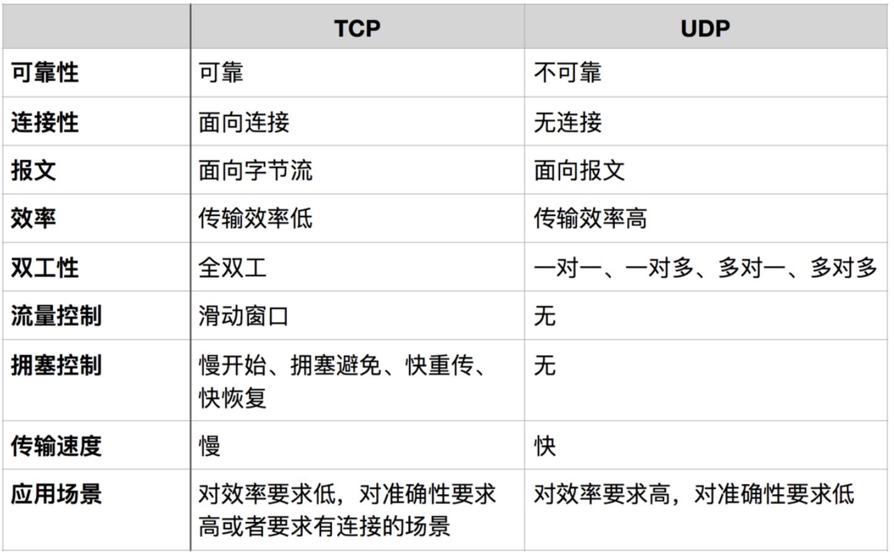

TCP
TCP 是面向连接的、可靠的流协议。流就是指不间断的数据结构，当应用程序采用 TCP 发送消息时，虽然可以保证发送的顺序，但还是犹如没有任何间隔的数据流发送给接收端。TCP是面向面向字节流，虽然应用程序和TCP的交互是一次一个数据块（大小不等），但TCP把应用程序看成是一连串的无结构的字节流。TCP有一个缓冲，当应用程序传送的数据块太长，TCP就可以把它划分短一些再传送。

TCP 为提供可靠性传输，实行“顺序控制”或“重发控制”机制。此外还具备“流控制（流量控制）”、“拥塞控制”、提高网络利用率等众多功能。

TCP有以下特点：

TCP充分地实现了数据传输时各种控制功能，可以进行丢包时的重发控制，还可以对次序乱掉的分包进行顺序控制。而这些在 UDP 中都没有。
此外，TCP 作为一种面向有连接的协议，只有在确认通信对端存在时才会发送数据，从而可以控制通信流量的浪费。
根据 TCP 的这些机制，在 IP 这种无连接的网络上也能够实现高可靠性的通信（ 主要通过检验和、序列号、确认应答、重发控制、连接管理以及窗口控制等机制实现）。

UDP
UDP 是面向报文的，所谓面向报文，是指面向报文的传输方式是应用层交给UDP多长的报文，UDP就照样发送，即一次发送一个报文。因此，应用程序必须选择合适大小的报文。若报文太长，则IP层需要分片，降低效率。

UDP 是不具有可靠性的数据报协议，细微的处理它会交给上层的应用去完成。在 UDP 的情况下，虽然可以确保发送消息的大小，却不能保证消息一定会到达。因此，应用有时会根据自己的需要进行重发处理。

UDP有以下特点：

UDP 不提供复杂的控制机制，利用 IP 提供面向无连接的通信服务。
传输途中出现丢包，UDP 也不负责重发。
当包的到达顺序出现乱序时，UDP没有纠正的功能。
并且它是将应用程序发来的数据在收到的那一刻，立即按照原样发送到网络上的一种机制。即使是出现网络拥堵的情况，UDP 也无法进行流量控制等避免网络拥塞行为。
如果需要以上的细节控制，不得不交由采用 UDP 的应用程序去处理。
UDP 常用于以下几个方面：
1.包总量较少的通信（DNS、SNMP等）；
2.视频、音频等多媒体通信（即时通信）；
3.限定于 LAN 等特定网络中的应用通信；
4.广播通信（广播、多播）。

UDP 和 TCP 的应用
 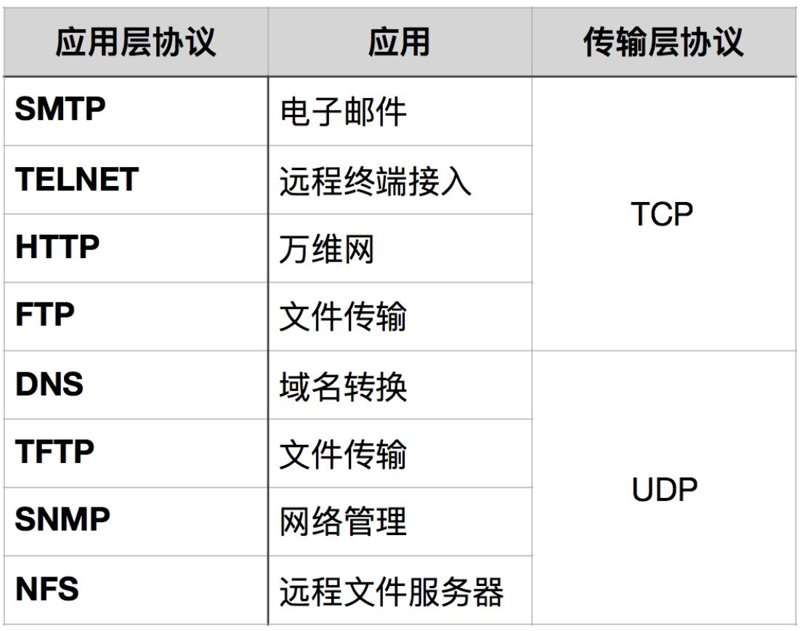

### TCP的可靠性传输是如何保证的
TCP主要提供了检验和、序列号/确认应答、超时重传、最大消息长度、滑动窗口控制等方法实现了可靠性传输。
[详细链接](https://zhuanlan.zhihu.com/p/112317245)

### TCP KeepAlive
KeepAlive：翻译为持久连接，这个字段信息主要用于在HTTP协议中，当在HTTP报文中出现了connection：KeepAlive字段时，说明建立的是持久连接，直到某一方发出的报文中含有connection：close字段时，才会去释放连接。

在持久连接的情况下，并不是每时每刻都在发送数据的。当连接的某一方出现死机、异常重启等各种意外时，另一方是不知道的，而且没有发送出connection：close字段，说明尽管这个连接已经废弃了，但是还一直占用资源，长时间积累会出现很多废弃的连接，那么就会很大程度上造成资源的浪费。

那么为了解决上述的问题，可以在传输层利用TCP KeepAlive机制来实现。

TCP KeepAlive的基本原理是：隔一段时间给连接对端发送一个探测包，如果收到对方回应的ACK，则判断连接还是存活的，在超过一定重试次数之后还是没有收到对方的回应，那么就会丢弃此TCP连接。

但是上述方式还是会有一定的局限性，首先TCP KeepAlive的基本实现就是发送探测包到对端，那么会给网络带来额外的开销，而且TCP KeepAlive可以判断连接的存活但不一定保证连接是可用的，比如在对端CPU进程占用达到100%，已经卡死不能响应请求了，此时TCP KeepAlive依然会认为此连接是存活的。

## 零碎的方面
### 网关和网桥的区别
网桥是在数据链路层上实现信息转换的设备，只是简单地传达信息。
网关又称为网间连接器、协议转换器。网关在网络层以上实现网络互联，是复杂的网络设备。网关既可以用于广域网互连、也可以用于局域网互连。网关是一种充当转换重任的计算机设备，使用在不同的通信协议、数据格式或语言、甚至体系结构完全不同的两种系统之间，网关是一个翻译器。

## IP层
### IP协议简介
IP协议位于TCP/IP协议的第三层 -- 网络层。与传输层协议相比，网络层的责任是提供点到点（hop by hop）的服务，而传输层（TCP/UDP）则提供端到端（end to end）的服务

### 广播与多播
广播与多播仅用于UDP（TCP是面向连接的）
- 广播：一共有四种广播的地址
    - 受限的广播：受限的广播地址为255.255.255.255。该地址用于主机配置过程中IP数据报的目的地址，在任何情况下，router不转发目的地址为255.255.255.255的数据报，这样的数据报仅出现在本地网络中。
    - 指向网络的广播：指向网络的广播地址是主机号为全1的地址。A类网络广播地址为netid.255.255.255，其中netid为A类网络的网络号。
    - 指向子网的广播：指向子网的广播地址为主机号为全1且有特定子网号的地址。作为子网直接广播地址的IP地址需要了解子网的掩码。例如，router收到128.1.2.255的数据报，当B类网路128.1的子网掩码为255.255.255.0时，该地址就是指向子网的广播地址；但是如果子网掩码为255.255.254.0，该地址就不是指向子网的广播地址。
    - 指向所有子网的广播：指向所有子网的广播也需要了解目的网络的子网掩码，以便与指向网络的广播地址区分开来。指向所有子网的广播地址的子网号和主机号为全1.例如，如果子网掩码为255.255.255.0，那么128.1.255.255就是一个指向所有子网的广播地址。
- 多播：
    - 多播又叫组播，使用D类地址，D类地址分配的28bit均用作多播组号而不再表示其他。
多播的工作原理：将主机上的网卡设置为多播传送工作模式，那么主机的驱动程序中既可以接收以多播传送地址为目标地址和以网卡本身地址作为目标地址的数据帧，而没有将网卡设置为多播传送工作模式的主机是会自动过滤掉目标地址为多播地址的数据帧的，而对于数据帧的目标地址筛选工作是由硬件实现的，效率比较高，当硬件无法识别时，就会交给软件去筛选。

多播的特点：
- 允许发送者发送单一的数据包到多个接收者
- 可以大大的节省网络带宽，因为无论有多少个目标地址，在整个网络上的任何一条链路上都是传送单一的数据包
多播数据包在传送过程中，若本网络内有主机要接收一个多播的数据包，那么它会通知本网络的路由器，路由器收到这个多播的数据包时，会复制一份传递下去，而不是多整个网络上有多少个目标主机就一次性发送多少个数据包。

### BGP
BGP即为边界网关协议。


### ARP
ARP即地址转换协议，将IP地址转换为MAC地址，然后在数据链路上根据MAC地址进行数据帧的传送。
要注意的是，ARP地址转换协议只是局限于局域网的，说明路由器是不会转发ARP协议包的。

当要查看IP地址对应的MAC地址时，首先会查看本机上的ARP缓存表看是否有对应的记录，没有的话，主机就会在本网络上发送一个ARP请求包，里面的内容是“请问这个IP地址对应的MAC地址是什么”，当目标接收到这个数据包之后，就会给主机返回一个ARP应答包，里面的内容是“IP地址对应的MAC地址是这个”，当主机收到ARP应答包时，就会将IP地址与MAC地址的映射关系存进ARP缓存表里面。