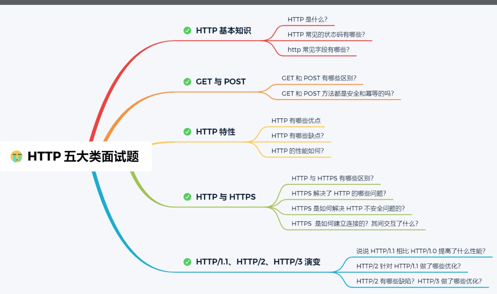
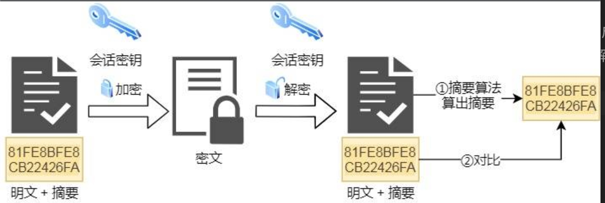
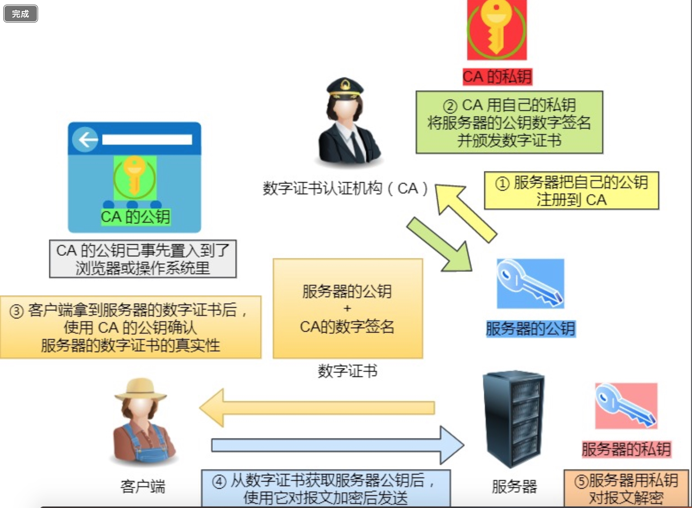
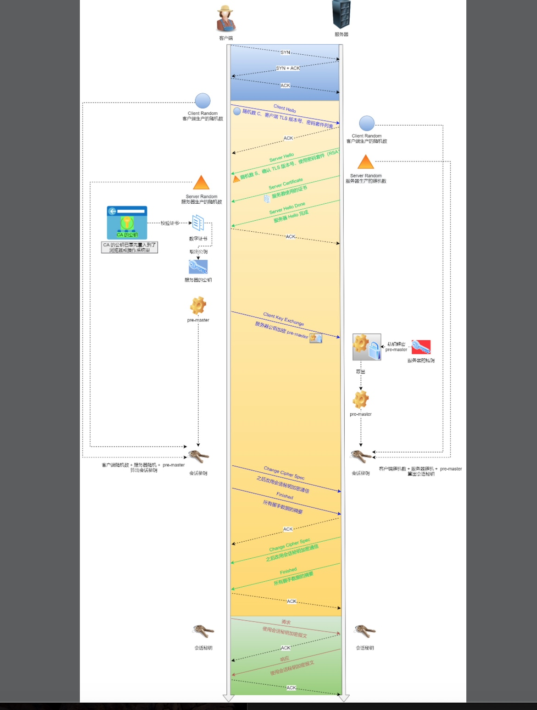

# 计网面试整理
[TOC]
## HTTP常见面试题

### HTTP基本知识
#### HTTP基本概念
HTTP是超文本传输协议。超文本传输协议可以分成三部分来理解：协议、传输、超文本。
- 协议：针对协议，我们可以这么理解HTTP：HTTP是一个用在计算机世界里的协议。它使用计算机能够理解的语言确立了一种计算机之间交流通信的规范，以及相关的各种控制和错误处理方式。
- 传输：针对传输，我们理解HTTP是一个在计算机世界里专门用来在两点之间传输数据的约定和规范。
- 超文本：HTTP传输的内容是超文本。超文本是文字、图片、视频等的混合体，最关键有超链接，能从一个超文本条环到另外一个超文本。HTML就是最常见的超文本，它本身只是纯文字文件，但在标签的修饰之下，再经过浏览器的解释，呈现出来的一个文字、有画面的网页。
那么，综合来说，HTTP是一个在计算机世界里专门在两点之间传输文字、图片、音频、视频等超文本数据的约定和规范。

#### HTTP常见的状态码
HTTP常见的状态码有五种类型。
- 以1开头的：1开头的状态码主要表示当前报文正在被处理。
- 以2开头的：2开头的状态码主要表示报文已经收到并被正确处理；其中常见的有 200状态码是常见的成功状态码，表示一切正常；204状态码也是常见的成功状态码，与200状态码基本相同，但是响应没有主体数据；206状态码也是成功状态码，这是应用于HTTP分块下载或断点续传，表示响应返回的主体数据并不是资源的全部，而是其中的一部分。
- 以3开头的：3开头的状态码表示客户端请求的资源发生了变化，需要客户端用新的URI重新发送请求获取资源，也就是重定向。其中常见的状态码有 301状态码表示永久重定向，说明请求的资源已经不存在了，需要改用新的URI再次访问；302状态码表示临时重定向，说明请求的资源还在，但暂时需要用另一个URI来访问。301和302都会在响应头里使用字段Location，指明后续要跳转的URI，浏览会自动重定向到新的URI；304状态码表示资源未修改、更新。
- 以4开头的：4开头的状态码表示客户端发送的报文有误，服务器无法正确处理。其中常见的状态码有 400状态码表示客户端的请求报文有语法错误；403状态码表示服务器禁止访问资源，并不是客户端的请求出错；404状态码表示请求的资源在服务器上不存在或找不到。
- 以5开头的：5开头的状态码表示客户端请求报文正确，但是服务器处理时内部发生了错误，属于服务器端的错误码；其中常见的状态码有：500状态码：服务器处理时发生了错误，但是具体是什么错误并不知道；501状态码表示客户端请求的功能还不支持；502状态码表示服务器作为网关或代理时返回的错误码，表示服务器自身工作正常，访问后端服务器发生了错误；503状态码表示服务器当前很忙，暂时无法响应。

#### HTTP常见字段
- Host字段：客户端发送请求时，用来指定服务器的域名。有了Host字段，就可以将请求发往同一台服务器上的不同网站。
- Content-Length字段：服务器在返回数据时，会有Content-Length字段，表明本次返回的数据长度。
- Connection 字段：“Connection 字段最常用于客户端要求服务器使用 TCP 持久连接，以便其他请求复用。
- “Content-Type 字段”：“Content-Type 字段用于服务器回应时，告诉客户端，本次数据是什么格式。”
- Accept: */*：“上面代码中，客户端声明自己可以接受任何格式的数据。”
- “Content-Encoding 字段”：“Content-Encoding 字段说明数据的压缩方法。表示服务器返回的数据使用了什么压缩格式”

### GET和POST的区别
- “Get 方法的含义是请求从服务器获取资源，这个资源可以是静态的文本、页面、图片视频等。”“POST 方法则是相反操作，它向 URI 指定的资源提交数据，数据就放在报文的 body 里。”
- “ GET 方法就是安全且幂等的，因为它是「只读」操作，无论操作多少次，服务器上的数据都是安全的，且每次的结果都是相同的。POST 因为是「新增或提交数据」的操作，会修改服务器上的资源，所以是不安全的，且多次提交数据就会创建多个资源，所以不是幂等的。”

> “在 HTTP 协议里，所谓的「安全」是指请求方法不会「破坏」服务器上的资源。
> 所谓的「幂等」，意思是多次执行相同的操作，结果都是「相同」的。”

### HTTP特性
#### 优点
“HTTP 最凸出的优点是「简单、灵活和易于扩展、应用广泛和跨平台」。”
1. 简单
    1. “HTTP 基本的报文格式就是 header + body，头部信息也是 key-value 简单文本的形式，易于理解，降低了学习和使用的门槛。”
2. “灵活和易于扩展”
    1. “HTTP协议里的各类请求方法、URI/URL、状态码、头字段等每个组成要求都没有被固定死，都允许开发人员自定义和扩充。” 
    2. “同时 HTTP 由于是工作在应用层（ OSI 第七层），则它下层可以随意变化。HTTPS 也就是在 HTTP 与 TCP 层之间增加了 SSL/TLS 安全传输层，HTTP/3 甚至把 TCP 层换成了基于 UDP 的 QUIC。”
3. “应用广泛和跨平台”
    1. “互联网发展至今，HTTP 的应用范围非常的广泛，从台式机的浏览器到手机上的各种 APP，从看新闻、刷贴吧到购物、理财、吃鸡，HTTP 的应用遍地开花，同时天然具有跨平台的优越性。”
#### 缺点
“HTTP 协议里有优缺点一体的双刃剑，分别是「无状态、明文传输」，同时还有一大缺点「不安全」。”   
1. “无状态双刃剑”
    1. “无状态的好处，因为服务器不会去记忆 HTTP 的状态，所以不需要额外的资源来记录状态信息，这能减轻服务器的负担，能够把更多的 CPU 和内存用来对外提供服务。”
    2. “无状态的坏处，既然服务器没有记忆能力，它在完成有关联性的操作时会非常麻烦。”“例如登录->添加购物车->下单->结算->支付，这系列操作都要知道用户的身份才行。但服务器不知道这些请求是有关联的，每次都要问一遍身份信息。”
    3. “对于无状态的问题，解法方案有很多种，其中比较简单的方式用 Cookie 技术。Cookie 通过在请求和响应报文中写入 Cookie 信息来控制客户端的状态。”
2. 明文传输双刃剑
    1. “明文意味着在传输过程中的信息，是可方便阅读的，通过浏览器的 F12 控制台或 Wireshark 抓包都可以直接肉眼查看，为我们调试工作带了极大的便利性。”
    2. “但是这正是这样，HTTP 的所有信息都暴露在了光天化日下，相当于信息裸奔。在传输的漫长的过程中，信息的内容都毫无隐私可言，很容易就能被窃取，如果里面有你的账号密码信息，那你号没了。”
3. 不安全 “HTTP 比较严重的缺点就是不安全：”
    1. “通信使用明文（不加密），内容可能会被窃听。比如，账号信息容易泄漏，那你号没了。”
    2. “不验证通信方的身份，因此有可能遭遇伪装。比如，访问假的淘宝、拼多多，那你钱没了。”
    3. “无法证明报文的完整性，所以有可能已遭篡改。比如，网页上植入垃圾广告，视觉污染，眼没了。”
“HTTP 的安全问题，可以用 HTTPS 的方式解决，也就是通过引入 SSL/TLS 层，使得在安全上达到了极致。”

#### HTTP/1.1性能如何
“HTTP 协议是基于 TCP/IP，并且使用了「请求 - 应答」的通信模式，所以性能的关键就在这两点里。”
1. 长连接
    1. “早期 HTTP/1.0 性能上的一个很大的问题，那就是每发起一个请求，都要新建一次 TCP 连接（三次握手），而且是串行请求，做了无谓的 TCP 连接建立和断开，增加了通信开销。”
    2. “为了解决上述 TCP 连接问题，HTTP/1.1 提出了长连接的通信方式，也叫持久连接。这种方式的好处在于减少了 TCP 连接的重复建立和断开所造成的额外开销，减轻了服务器端的负载。”
    3. “持久连接的特点是，只要任意一端没有明确提出断开连接，则保持 TCP 连接状态。”
2. 管道网络传输：“HTTP/1.1 采用了长连接的方式，这使得管道（pipeline）网络传输成为了可能。”
    1. “即可在同一个 TCP 连接里面，客户端可以发起多个请求，只要第一个请求发出去了，不必等其回来，就可以发第二个请求出去，可以减少整体的响应时间。”
    2. “举例来说，客户端需要请求两个资源。以前的做法是，在同一个TCP连接里面，先发送 A 请求，然后等待服务器做出回应，收到后再发出 B 请求。管道机制则是允许浏览器同时发出 A 请求和 B 请求。”
    3. “但是服务器还是按照顺序，先回应 A 请求，完成后再回应 B 请求。要是前面的回应特别慢，后面就会有许多请求排队等着。这称为「队头堵塞”
3. 队头阻塞：“请求 - 应答」的模式加剧了 HTTP 的性能问题。” 
    1. “因为当顺序发送的请求序列中的一个请求因为某种原因被阻塞时，在后面排队的所有请求也一同被阻塞了，会招致客户端一直请求不到数据，这也就是「队头阻塞」。”

### HTTP与HTTPS
#### HTTP与HTTPS有哪些区别
1. “HTTP 是超文本传输协议，信息是明文传输，存在安全风险的问题。HTTPS 则解决 HTTP 不安全的缺陷，在 TCP 和 HTTP 网络层之间加入了 SSL/TLS 安全协议，使得报文能够加密传输。
2. HTTP 连接建立相对简单， TCP 三次握手之后便可进行 HTTP 的报文传输。而 HTTPS 在 TCP 三次握手之后，还需进行 SSL/TLS 的握手过程，才可进入加密报文传输。
3. HTTP 的端口号是 80，HTTPS 的端口号是 443。
4. HTTPS 协议需要向 CA（证书权威机构）申请数字证书，来保证服务器的身份是可信的。”

#### HTTP安全上存在三个风险，以及HTTPS的改善
1. “窃听风险，比如通信链路上可以获取通信内容，用户号容易没。
2. 篡改风险，比如强制植入垃圾广告，视觉污染，用户眼容易瞎。
3. 冒充风险，比如冒充淘宝网站，用户钱容易没。”

“HTTPS 在 HTTP 与 TCP 层之间加入了 SSL/TLS 安全协议，可以很好的解决了上述的风险：”
1. “信息加密：交互信息无法被窃取，但你的号会因为「自身忘记」账号而没。
2. 校验机制：无法篡改通信内容，篡改了就不能正常显示，但百度「竞价排名」依然可以搜索垃圾广告。
3. 身份证书：证明淘宝是真的淘宝网，但你的钱还是会因为「剁手」而没。”

“HTTPS 是如何解决上面的三个风险的？”
1. “混合加密的方式实现信息的机密性，解决了窃听的风险。
2. 摘要算法的方式来实现完整性，它能够为数据生成独一无二的「指纹」，指纹用于校验数据的完整性，解决了篡改的风险。
3. 将服务器公钥放入到数字证书中，解决了冒充的风险。”

* 混合加密
    * “通过混合加密的方式可以保证信息的机密性，解决了窃听的风险。”
    * “HTTPS 采用的是对称加密和非对称加密结合的「混合加密」方式：”
        * “在通信建立前采用非对称加密的方式交换「会话秘钥」，后续就不再使用非对称加密。”
        * “在通信过程中全部使用对称加密的「会话秘钥」的方式加密明文数据。”

* “采用「混合加密」的方式的原因：”
    * “对称加密只使用一个密钥，运算速度快，密钥必须保密，无法做到安全的密钥交换。”
    * “非对称加密使用两个密钥：公钥和私钥，公钥可以任意分发而私钥保密，解决了密钥交换问题但速度慢。”

* 摘要算法
    * “摘要算法用来实现完整性，能够为数据生成独一无二的「指纹」，用于校验数据的完整性，解决了篡改的风险。”
    
    * “客户端在发送明文之前会通过摘要算法算出明文的「指纹」，发送的时候把「指纹 + 明文」一同加密成密文后，发送给服务器，服务器解密后，用相同的摘要算法算出发送过来的明文，通过比较客户端携带的「指纹」和当前算出的「指纹」做比较，若「指纹」相同，说明数据是完整的。”

* 数字证书
“客户端先向服务器端索要公钥，然后用公钥加密信息，服务器收到密文后，用自己的私钥解密。”
“这就存在些问题，如何保证公钥不被篡改和信任度？”
“所以这里就需要借助第三方权威机构 CA （数字证书认证机构），将服务器公钥放在数字证书（由数字证书认证机构颁发）中，只要证书是可信的，公钥就是可信的。”

“通过数字证书的方式保证服务器公钥的身份，解决冒充的风险。”

#### “HTTPS 是如何建立连接的？其间交互了什么？”
“SSL/TLS 协议基本流程：”
    1. “客户端向服务器索要并验证服务器的公钥。”
    2. “双方协商生产「会话秘钥」。”
    3. “双方采用「会话秘钥」进行加密通信。”

“前两步也就是 SSL/TLS 的建立过程，也就是握手阶段。

SSL/TLS 的「握手阶段」涉及四次通信，可见下图：”

“SSL/TLS 协议建立的详细流程：”
1. ClientHello
    1. “首先，由客户端向服务器发起加密通信请求，也就是 ClientHello 请求。”
    2. “在这一步，客户端主要向服务器发送以下信息：”
        1. “客户端支持的 SSL/TLS 协议版本，如 TLS 1.2 版本。”
        2. “客户端生产的随机数（Client Random），后面用于生产「会话秘钥」。”
        3. “客户端支持的密码套件列表，如 RSA 加密算法。”
2. SeverHello
    1. “服务器收到客户端请求后，向客户端发出响应，也就是 SeverHello。服务器回应的内容有如下内容：”
        1. “确认 SSL/ TLS 协议版本，如果浏览器不支持，则关闭加密通信。”
        2. “服务器生产的随机数（Server Random），后面用于生产「会话秘钥」。”
        3. “确认的密码套件列表，如 RSA 加密算法。”
        4. “服务器的数字证书。”
        5. “最后服务器发送 Server Hello Done 报文通知客户端，最初阶段的 SSL 握手协商部分结束。”
3. 客户端回应
    1. “客户端收到服务器的回应之后，首先通过浏览器或者操作系统中的 CA 公钥，确认服务器的数字证书的真实性。”
    2. “如果证书没有问题，客户端会从数字证书中取出服务器的公钥，然后使用它加密报文，向服务器发送如下信息：”
        1. “一个随机数（pre-master key）。该随机数会被服务器公钥加密。”
        2. “加密通信算法改变通知，表示随后的信息都将用「会话秘钥」加密通信。”
        3. “客户端握手结束通知，表示客户端的握手阶段已经结束。这一项同时把之前所有内容的发生的数据做个摘要，用来供服务端校验。”
        4. “上面第一项的随机数是整个握手阶段的第三个随机数，这样服务器和客户端就同时有三个随机数，接着就用双方协商的加密算法，各自生成本次通信的「会话秘钥」。”
4. “服务器的最后回应”
    1. “服务器收到客户端的第三个随机数（pre-master key）之后，通过协商的加密算法，计算出本次通信的「会话秘钥」。然后，向客户端发生最后的信息：”
        1. “加密通信算法改变通知，表示随后的信息都将用「会话秘钥」加密通信。”
        2. “服务器握手结束通知，表示服务器的握手阶段已经结束。这一项同时把之前所有内容的发“生的数据做个摘要，用来供客户端校验。”
“至此，整个 SSL/TLS 的握手阶段全部结束。接下来，客户端与服务器进入加密通信，就完全是使用普通的 HTTP 协议，只不过用「会话秘钥」加密内容。”

### “HTTP/1.1、HTTP/2、HTTP/3 演变”
#### “说说 HTTP/1.1 相比 HTTP/1.0 提高了什么性能？”
“HTTP/1.1 相比 HTTP/1.0 性能上的改进：”
- “使用 TCP 长连接的方式改善了 HTTP/1.0 短连接造成的性能开销。”
- “支持管道（pipeline）网络传输，只要第一个请求发出去了，不必等其回来，就可以发第二个请求出去，可以减少整体的响应时间。”

#### HTTP1.1的性能瓶颈
- “请求 / 响应头部（Header）未经压缩就发送，首部信息越多延迟越大。只能压缩 Body 的部分；”
- “发送冗长的首部。每次互相发送相同的首部造成的浪费较多；”
- “服务器是按请求的顺序响应的，如果服务器响应慢，会招致客户端一直请求不到数据，也就是队头阻塞；”
- “没有请求优先级控制；”
- “请求只能从客户端开始，服务器只能被动响应。”

#### “ 对于HTTP/1.1 的性能瓶颈，HTTP/2 做了什么优化？”
“HTTP/2 协议是基于 HTTPS 的，所以 HTTP/2 的安全性也是有保障的。”
“那 HTTP/2 相比 HTTP/1.1 性能上的改进：”
1. 头部压缩
    1. “HTTP/2 会压缩头（Header）如果你同时发出多个请求，他们的头是一样的或是相似的，那么，协议会帮你消除重复的部分。”
    2. “这就是所谓的 HPACK 算法：在客户端和服务器同时维护一张头信息表来存储之前发送的键值对。当每次请求或响应只会写入头信息表里没有的键值对，并且会更新信息表。
2. 二进制格式
    1. “HTTP/2 不再像 HTTP/1.1 里的纯文本形式的报文，而是全面采用了二进制格式，头信息和数据体都是二进制，并且统称为帧（frame）：头信息帧和数据帧。”
    2. “这样虽然对人不友好，但是对计算机非常友好，因为计算机只懂二进制，那么收到报文后，无需再将明文的报文转成二进制，而是直接解析二进制报文，这增加了数据传输的效率。”
3. 数据流
    1. “HTTP/2 的数据包不是按顺序发送的，同一个连接里面连续的数据包，可能属于不同的回应。因此，必须要对数据包做标记，指出它属于哪个回应。”
    2. “每个请求或回应的所有数据包，称为一个数据流（Stream）。每个数据流都标记着一个独一无二的编号，其中规定客户端发出的数据流编号为奇数， 服务器发出的数据流编号为偶数”。
    3. “客户端还可以指定数据流的优先级。优先级高的请求，服务器就先响应该请求。”
4. 多路复用
    1. “HTTP/2 是可以在一个连接中并发多个请求或回应，而不用按照顺序一一对应。”
    2. “移除了 HTTP/1.1 中的串行请求，不需要排队等待，也就不会再出现「队头阻塞」问题，降低了延迟，大幅度提高了连接的利用率。
    3. “举例来说，在一个 TCP 连接里，服务器收到了客户端 A 和 B 的两个请求，如果发现 A 处理过程非常耗时，于是就回应 A 请求已经处理好的部分，接着回应 B 请求，完成后，再回应 A 请求剩下的部分。”
5. 服务器推送
    1. “HTTP/2 还在一定程度上改善了传统的「请求 - 应答」工作模式，服务不再是被动地响应，也可以主动向客户端发送消息。”
    2. “举例来说，在浏览器刚请求 HTML 的时候，就提前把可能会用到的 JS、CSS 文件等静态资源主动发给客户端，减少延时的等待，也就是服务器推送（Server Push，也叫 Cache Push）。”

#### “HTTP/2 有哪些缺陷？HTTP/3 做了哪些优化？”
“HTTP/2 主要的问题在于，多个 HTTP 请求在复用一个 TCP 连接，下层的 TCP 协议是不知道有多少个 HTTP 请求的。所以一旦发生了丢包现象，就会触发 TCP 的重传机制，这样在一个 TCP 连接中的所有的 HTTP 请求都必须等待这个丢了的包被重传回去。”
- “HTTP/1.1 中的管道（ pipeline）传输中如果有一个请求阻塞了，那么队列后请求也统统被阻塞住了”
- “HTTP/2 多个请求复用一个TCP连接，一旦发生丢包，就会阻塞住所有的 HTTP 请求。”

“这都是基于 TCP 传输层的问题，所以 HTTP/3 把 HTTP 下层的 TCP 协议改成了 UDP！”
“UDP 发生是不管顺序，也不管丢包的，所以不会出现 HTTP/1.1 的队头阻塞 和 HTTP/2 的一个丢包阻塞全部HTTP请求问题。”
“大家都知道 UDP 是不可靠传输的，但基于 UDP 的 QUIC 协议 可以实现类似 TCP 的可靠性传输。”

- “QUIC 有自己的一套机制可以保证传输的可靠性的。当某个流发生丢包时，只会阻塞这“个流，其他流不会受到影响。”
- “TLS3 升级成了最新的 1.3 版本，头部压缩算法也升级成了 QPack。”
- “HTTPS 要建立一个连接，要花费 6 次交互，先是建立三次握手，然后是 TLS/1.3 的三次握手。QUIC 直接把以往的 TCP 和 TLS/1.3 的 6 次交互合并成了 3 次，减少了交互次数。”
“所以， QUIC 是一个在 UDP 之上的伪 TCP + TLS + HTTP/2 的多路复用的协议。

QUIC 是新协议，对于很多网络设备，根本不知道什么是 QUIC，只会当做 UDP，这样会出现新的问题。所以 HTTP/3 现在普及的进度非常的缓慢，不知道未来 UDP 是否能够逆袭 TCP。”

#### 零碎的HTTP问题
##### “https和http相比，就是传输的内容多了对称加密，可以这么理解吗？”
1. “建立连接时候：https 比 http多了 TLS 的握手过程；”
2. “传输内容的时候：https 会把数据进行加密，通常是对称加密数据；”

##### “文中 TLS 和 SSL 没有做区分，这两个需要区分吗？”
“这两实际上是一个东西。

SSL 是洋文 “Secure Sockets Layer 的缩写，中文叫做「安全套接层」。它是在上世纪 90 年代中期，由网景公司设计的。

到了1999年，SSL 因为应用广泛，已经成为互联网上的事实标准。IETF 就在那年把 SSL 标准化。标准化之后的名称改为 TLS（是 “Transport Layer Security” 的缩写），中文叫做 「传输层安全协议」。

很多相关的文章都把这两者并列称呼（SSL/TLS），因为这两者可以视作同一个东西的不同阶段。”

#### “为啥 ssl 的握手是 4 次？”
1. 客户端请求建立SSL链接，并向服务端发送一个随机数–Client random和客户端支持的加密方法，比如RSA公钥加密，以及支持的SSL/TLS的版本号，此时是明文传输。
2. 服务端回复一种客户端支持的加密方法、选择的SSL/TLS的版本号、一个随机数–Server random、授信的服务器证书和非对称加密的公钥。
3. 客户端收到服务端的响应后，验证服务端信息的正确性，并利用内置的CA公钥解密证书获得服务端的公钥，利用服务端的公钥对新生成的随机数进行加密，并且告诉服务端使用了加密算法，还把客户端之前发送的报文进行摘要发给服务端。
4. 服务端收到客户端的回复，利用私钥进行解密，同时利用三个随机数根据加密算法生成通信时加密使用的密钥，同时还要回复客户端当前密钥已经解出来了，并附上服务端之前报文的摘要。

此后的HTTP数据传输即通过对称加密方式进行加密传输。

## TCP常见面试问题
### 三次握手过程理解
第一次握手：建立连接时，客户端发送syn包（syn=x）到服务器，并进入SYN_SENT状态，等待服务器确认；SYN：同步序列编号（Synchronize Sequence Numbers）。

第二次握手：服务器收到syn包，必须确认客户的SYN（ack=x+1），同时自己也发送一个SYN包（syn=y），即SYN+ACK包，此时服务器进入SYN_RECV状态；

第三次握手：客户端收到服务器的SYN+ACK包，向服务器发送确认包ACK(ack=y+1），此包发送完毕，客户端和服务器进入ESTABLISHED（TCP连接成功）状态，完成三次握手。

第三次握手的时候已经可以携带数据了。

三次的原因是：可以确保客户端和服务端的发送和接收功能都是正常的。

### 四次挥手过程理解 
1）客户端进程发出连接释放报文，并且停止发送数据。设置报文的控制位FIN=1，其序列号为seq=u（等于前面客户端最后传送过去的包的最后一个字节序号加1），此时，客户端进入FIN-WAIT-1（终止等待1）状态。 
2）服务器收到连接释放报文，发出确认报文，ACK=1，ack=u+1，并且带上自己的序列号seq=v，此时，服务端就进入了CLOSE-WAIT（关闭等待）状态。TCP服务器通知高层的应用进程，客户端向服务器的方向就释放了，这时候处于半关闭状态，即客户端已经没有数据要发送了，但是服务器若发送数据，客户端依然要接受。这个状态还要持续一段时间，也就是整个CLOSE-WAIT状态持续的时间。
3）客户端收到服务器的确认请求后，此时，客户端就进入FIN-WAIT-2（终止等待2）状态，等待服务器发送连接释放报文（在这之前还需要接受服务器发送的最后的数据）。
4）服务器将最后的数据发送完毕后，就向客户端发送连接释放报文，FIN=1，ack=u+1，由于在半关闭状态，服务器很可能又发送了一些数据，假定此时的序列号为seq=w，此时，服务器就进入了LAST-ACK（最后确认）状态，等待客户端的确认。
5）客户端收到服务器的连接释放报文后，必须发出确认，ACK=1，ack=w+1，而自己的序列号是seq=u+1，此时，客户端就进入了TIME-WAIT（时间等待）状态。注意此时TCP连接还没有释放，必须经过2MSL（最长报文段寿命）的时间后，进入CLOSED状态。
6）服务器只要收到了客户端发出的确认，立即进入CLOSED状态。同样，撤销TCB后，就结束了这次的TCP连接。可以看到，服务器结束TCP连接的时间要比客户端早一些。

### 为什么连接的时候是三次握手，关闭的时候却是四次握手？
连接时当Server端收到Client端的SYN连接请求报文后，可以直接发送SYN+ACK报文。其中ACK报文是用来应答的，SYN报文是用来同步的。但是关闭连接时，当Server端收到FIN报文时，很可能并不会立即关闭SOCKET，所以只能先回复一个ACK报文，告诉Client端，"你发的FIN报文我收到了"。只有等到我Server端所有的报文都发送完了，我才能发送FIN报文，因此不能一起发送。故需要四步握手。
（程序实现的时候ACK包其实是自动回的）

### 为什么TIME_WAIT状态需要经过2MSL(最大报文段生存时间)才能返回到CLOSE状态？
虽然按道理，四个报文都发送完毕，我们可以直接进入CLOSE状态了，但是我们必须假象网络是不可靠的，有可以最后一个ACK丢失。所以TIME_WAIT状态就是用来重发可能丢失的ACK报文。在Client发送出最后的ACK回复，但该ACK可能丢失。Server如果没有收到ACK，将不断重复发送FIN片段。所以Client不能立即关闭，它必须确认Server接收到了该ACK。Client会在发送出ACK之后进入到TIME_WAIT状态。Client会设置一个计时器，等待2MSL的时间。如果在该时间内再次收到FIN，那么Client会重发ACK并再次等待2MSL。所谓的2MSL是两倍的MSL(Maximum Segment Lifetime)。MSL指一个片段在网络中最大的存活时间，2MSL就是一个发送和一个回复所需的最大时间。如果直到2MSL，Client都没有再次收到FIN，那么Client推断ACK已经被成功接收，则结束TCP连接。

### 如果已经建立了连接，但是客户端突然出现故障了怎么办？
TCP还设有一个保活计时器，显然，客户端如果出现故障，服务器不能一直等下去，白白浪费资源。服务器每收到一次客户端的请求后都会重新复位这个计时器，时间通常是设置为2小时，若两小时还没有收到客户端的任何数据，服务器就会发送一个探测报文段，以后每隔75秒钟发送一次。若一连发送10个探测报文仍然没反应，服务器就认为客户端出了故障，接着就关闭连接。

### TCP和UDP的头部列举
UDP的首部包括源端口号、目标端口号、包长度和校验和。UDP的首部为8B。
- 源端口号2B，目标端口号2B，包长度2B，校验和2B
- 包长度保存了UDP首部的长度跟数据的长度之和
- 校验和
    校验和是为了校验包是否出错。
    
TCP首部相比UDP首部要复杂得多。
TCP首部有源端口号、目标端口号、序列号、确认应答号、数据偏移、保留、控制位、窗口大小、校验和、紧急指针、选项、填充、数据部分。

- 源端口号
    - 字段16位
- 目标端口号
    - 字段16位
- 序列号
    - 指的是发送的数据段的序列号。
    - 序列号不会从0或1开始，而是在建立连接时由计算机生成的随机数作为其初始值，通过SYN包传给接收端主机；
    - 连接建立之后序列号为客户端/服务端最后传送去对方的包的最后的字节序号加1为待发送出去的包的序列号
- 确认应答号 
    - 确认应答号表示下一次想要接收的数据的序列号。
- 数据偏移
    - 该字段表示TCP所传输的数据部分应该从TCP包的哪个位开始计算，当然这也可以把它看作为TCP首部的长度。
- 保留 
    - 该字段主要是为了以后扩展时使用。
- 控制位
    - 字段长8位。有8个控制字段。
        - CWR：CWR标志与后面的ECE标志都用于IP首部的ECN字段。
        - ECE：置为1时会通知通信对方，从对方到这边的网络有拥塞。
        - URG：该位为1时，表示包中有需要紧急处理的数据。
        - ACK：该位为1时，确认应答的字段变为有效。TCP除了最初建立连接时的SYN包之外该位都设置为1.
        - PSH：该位为1时，表示需要将收到的数据立刻传给上层应用协议。该位为0时，则不需要立即传而是先进行缓存。
        - RST：该位为1时表示TCP连接中出现了异常必须强制断开连接。
        - SYN：该位为1时，表示连接请求报文。
        - FIN：该位为1时，表示释放连接。
- 窗口大小
    - 用于通知发送端当前接收端可以接收的缓存大小。
- 校验和
    - 校验和跟UDP的区别不大，都是添加一个伪首部，然后对所有数据进行二进制反码求和，然后再取反码，即可得出校验和的值。当接收端收到之后，也会添加一个伪首部，然后对所有数据进行二进制反码求和，如果结果为全1，然后就是没有出错，否则判定为数据出错了。

- FCS 与 校验和
    - FCS是用于数据链路层上对噪声干扰引发数据帧的出错的检测。FCS是由帧头以及数据部分算出来的。
    - 校验和是一种进行路由器内存故障或者程序漏洞导致的数据是否被破坏的检查。
- 紧急指针
    - 该字段长16位。只有在URG控制位为1时有效。紧急指针指出了紧急数据的末尾在报文段中的位置。比如是200，那么就是数据段的前200字节都是紧急数据。

- 选项
    - 选项字段用于提高TCP的传输性能。比如类型3，MSS选项用于在建立连接时决定最大段长度的情况。

### UDP不是可靠传输，那么为什么还要进行校验呢？校验的话为什么要加一个伪首部呢？
- 在TCP/IP网络中，是通过源IP地址、目标IP地址、协议号、源端口号和目标端口号来确定一个通信的。因此进行校验是为了检验包是否出错以及IP地址跟端口号是否出错，如果这些出错了，那么这个包是无意义的。
- 加伪首部是因为确定一个通信不仅靠端口号，还要靠IP地址，因此需要加一个伪首部来进行校验。

### 什么是SYN攻击
SYN攻击利用TCP协议缺陷，通过发送大量的半连接请求，耗费CPU和内存资源。

SYN攻击原理与实现
- TCP三次握手的第二次握手时服务器接收到连接请求（syn= j），将此信息加入未连接队列，并发送请求包给客户（syn=k,ack=j+1），此时进入SYN_RECV状态。当服务器未收到客户端的确认包时，重发请求包，一直到超时或半连接数量超过半连接队列的最大值时，将此条目从未连接队列删除。
- SYN攻击利用TCP协议三次握手的原理，大量发送伪造源IP的SYN包也就是伪造第一次握手数据包，服务器每接收到一个SYN包就会为这个连接信息分配核心内存并放入半连接队列，如果短时间内接收到的SYN太多，半连接队列就会溢出，操作系统会把一些连接信息丢弃造成不能连接，当攻击的SYN包超过半连接队列的最大值时，正常的客户发送SYN数据包请求连接就有可能会被服务器丢弃。目标系统运行缓慢，严重者引起网络堵塞甚至系统瘫痪。每种操作系统半连接队列大小（Backlog参数）不一样所以抵御SYN攻击的能力也不一样。

### 滑动窗口
- TCP是请求-应答的模式，因此，每发送一个数据，都要进行一次确认应答。当上一个数据包收到了应答了， 才能发送下一个。这种方式的缺点是效率比较低的。
- 为解决这个问题，TCP 引入了窗口这个概念。即使在往返时间较长的情况下，它也不会降低网络通信的效率。
- 那么有了窗口，就可以指定窗口大小，窗口大小就是指无需等待确认应答，而可以继续发送数据的最大值。
- 窗口大小是由接收方的可接收窗口大小以及拥塞窗口大小决定的，取两者中的小值；TCP报文段首部有一个字段窗口大小，是专门用来让接收端告诉发送端目前我可以接收的窗口大小的。
- 滑动窗口根据遵守的协议不同可以分为三类：停止等待、后退N帧以及选择重传，它们之间的区别就在于发送窗口和接收窗口的大小不一样。
    - 停止等待：发送窗口和接收窗口都为1，这就相当于传统的请求-应答模式，当一个报文段发送出去收到了应答才能发送下一个。
    - 后退N帧：发送窗口>1，接收窗口=1；发送端可以同时发送多个报文段，但是如果发生错误，那么就需要重发该报文段以及后面的n个报文段
    - 选择重传：发送窗口>1，接收窗口>1；发送端可以同时发送多个报文段，当出现错误时，只需要重发出现错误的那个报文段。

    ### 拥塞控制
拥塞控制主要控制发送端的窗口大小。
1. 发送端的窗口大小一开始设置为1，接着窗口大小以指数的形式增加；这里要指出的是发送端的窗口大小取决于拥塞窗口大小和接收端窗口大小的小值。
2. 当第一次发生网络拥堵时，就会将当前窗口大小的一半设置为门限值，然后重新以窗口大小为1发送报文段，窗口大小的增长还是以指数的形式增加。
3. 当窗口大小到达门限值时，开始以加1的形式慢慢增大窗口；如果发生超时重传，那么会将窗口大小重新设置为1，门限值也设置为峰值的一半；如果发生的是快重传，那么窗口大小设置为峰值的一半，然后以加1的形式慢慢增大窗口。
4. 对于超时重传和快重传，窗口大小的调节是不一样的。这是因为，超时重传的网络环境比快重传要拥堵得多。
