# 操作系统面试题整理
[TOC]
## 什么是操作系统？
1. 操作系统（OS）是是系统最基本最核心的软件，属于系统软件
2. 操作系统本质上是运行在计算机的软件程序，它控制和管理整个计算机的硬件和软件资源，合理的组织、调度计算机的工作与资源的分配
3. 操作系统的存在屏蔽了硬件层面的复杂性，向用户和应用程序提供了命令接口和程序接口

## 讲一讲用户态和系统态
- 在用户态下，CPU处于非特权模式，只能执行非特权指令，比如加减乘除这些简单指令；还有用户态运行下的程序可以访问的资源受到限制，只能访问自己程序下的数据
- 在系统态下，CPU处于特权模式，既能执行特权指令，也能执行非特权指令，特权指令是指用户不能直接调用的指令，比如I/O指令，内存清零等指令；在系统态下运行的程序访问资源不受到限制。
- 我们运行的程序基本上都在用户态运行，如果需要调用系统级别的子功能（如文件管理，进程控制，内存管理等）则需要切换到系统态，进行系统调用。通过系统调用，向操作系统提出请求，由其代为完成。

## 讲一讲系统调用
系统调用是操作系统提供给应用程序的接口，应用程序可以通过系统调用（程序接口）请求获得操作系统的服务；系统调用会使处理器从用户态切换到内核态。
按照系统调用的功能分类，可以分为
1. 设备管理：设备的请求或释放，如视频电话启动摄像头；
2. 文件管理：文件的修改、创建、删除等；
3. 进程控制：进程的创建、撤销、阻塞、唤醒等；
4. 进程通信：完成进程间的消息或信号传递；
5. 内存管理：内存分配（malloc 函数）、回收（free）、地址转换（将逻辑地址转化为物理地址等）

## 程序、进程、线程的基本概念
- 程序：
    - 程序是含有指令和数据的文件，被存储在磁盘或其他的数据存储设备中，也就是说程序是静态的代码。
- 进程
    - 在多道程序环境下，允许多个程序并发执行，此时它们将失去封闭性，并具有间断性及不可再现性的特征。为此引入了进程(Process) 的概念，以便更好地描述和控制程序的并发执行，实现操作系统的并发性和共享性（最基本的两个特性）。
    - 为了使参与并发执行的程序（含数据）能独立地运行，必须为之配置一个专门的数据结构，称为进程控制块(Process Control Block, PCB) 。系统利用PCB 来描述进程的基本情况和运行状态，进而控制和管理进程。
    - 相应地，由程序段、相关数据段和PCB三部分构成了进程映像（进程实体）。所谓创建进程，实质上是创建进程映像中的PCB; 而撤销进程，实质上是撤销进程的PCB 。值得注意的是，进程映像是静态的，进程则是动态的。
    - 引入进程实体的概念后，我们可以把传统操作系统中的进程定义为： “进程是进程实体的运行过程是系统进行资源分配的基本单位。
- 线程
    - 引入进程的目的是为了更好地使多道程序并发执行，提高资源利用率和系统吞吐量；而引入线程的目的则是为了减小程序在并发执行时所付出的时空开销，提高操作系统的并发性能。
    - 线程最直接的理解就是“轻量级进程”，它是一个基本的CPU执行单元，也是程序执行流的最小单元，由线程ID 、程序计数器、寄存器集合和堆栈组成。线程是进程中的一个实体，是被系统独立调度和分派的基本单位，线程自己不拥有系统资源，只拥有一点儿在运行中必不可少的资源，但它可与同属一个进程的其他线程共享进程所拥有的全部资源。一个线程可以创建和撤销另一个线程，同一进程中的多个线程之间可以并发执行。由于线程之间的相互制约，致使线程在运行中呈现出间断性。线程也有就绪、阻塞和运行三种基本状态。

### 程序和进程比较
1. 程序是永存的(除非删除)；进程是暂时的，是程序在数据集上的一次执行，有创建有撤销，存在是暂时的；
2. 程序是静态的观念，进程是动态的观念；
3. 进程具有并发性，而程序没有；
4. 进程是竞争计算机资源的基本单位，程序不是。
5. 进程和程序不是一一对应的： 一个程序可对应多个进程即多个进程可执行同一程序； 一个进程同一时间内执行一个程序。
    1. 在Windows下，浏览器一般是一个页面对应一个进程，所以可以理解为一个程序可以对应多个进程。

### 为什么要引入进程
在多道程序同时运行的背景下，进程之间需要共享系统资源，因此会导致各程序在执行过程中出现相互制约的关系，程序的执行会表现出间断性的特征。这些特征都是在程序的执行过程中发生的，是动态的过程，而传统的程序本身是一组指令的集合，是一个静态的概念，无法描述程序在内存中的执行情况，即我们无法从程序的字面上看出它何时执行、何时停顿，也无法看出它与其他执行程序的关系，因此，程序这个静态概念已不能如实反映程序并发执行过程的特征。为了深刻描述程序动态执行过程的性质乃至更好地支持和管理多道程序的并发执行，人们引入了进程的概念。

### 进程是如何解决问题的？
进程把能够识别程序运行态的一些变量存放在PCB中，通过这些变量系统能够更好地了解进程的状况，并在适当时进行进程的切换，以避免一些资源的浪费，甚至划分为更小的调度单位线程来提高系统的并发度。

### 线程与进程的比较
1. 调度。在传统的操作系统中，拥有资源和独立调度的基本单位都是进程。在引入线程的操作系统中，线程是独立调度的基本单位，进程是拥有资源的基本单位。在同一进程中，线程的切换不会引起进程切换。在不同进程中进行线程切换，如从一个进程内的线程切换到另一个进程中的线程时，会引起进程切换。
2. 拥有资源。不论是传统操作系统还是设有线程的操作系统，进程都是拥有资源的基本单位，而线程不拥有系统资源（也有一点儿必不可少的资源），但线程可以访问其隶属进程的系统资源。要知道，若线程也是拥有资源的单位，则切换线程就需要较大的时空开销，线程这个概念的提出就没有意义。
3. 并发性。在引入线程的操作系统中，不仅进程之间可以并发执行，而且多个线程之间也可以并发执行，从而使操作系统具有更好的并发性，提高了系统的吞吐量。
4. 系统开销。由于创建或撤销进程时，系统都要为之分配或回收资源，如内存空间、I/0 设备等，因此操作系统所付出的开销远大于创建或撤销线程时的开销。类似地，在进行进程切换时，涉及当前执行进程CPU 环境的保存及新调度到进程CPU 环境的设置，而线程切换时只需保存和设置少量寄存器内容，开销很小。此外，由于同一进程内的多个线程共享进程的地址空间，因此这些线程之间的同步与通信非常容易实现，甚至无须操作系统的干预。
5. 地址空间和其他资源（如打开的文件）。进程的地址空间之间互相独立，同一进程的各线程间共享进程的资源，某进程内的线程对于其他进程不可见。
6. 通信方面。进程间通信(IPC) 需要进程同步和互斥手段的辅助，以保证数据的一致性，而线程间可以直接读／写进程数据段（如全局变量）来进行通信。

### 为什么要引入线程？
进程存在着很多缺陷，主要集中在两点：
 (1)进程只能在同一时间干一件事情，如果想同时干两件事或多件事情，进程就无能为力了。 
 (2)进程在执行的过程中如果由于某种原因阻塞了，例如等待输入，整个进程就会挂起，其他与输入无关的工作也必须等待输入结束后才能顺序执行。 
 为了解决上述两点缺陷，引入了线程这个概念。
 
 引入进程的目的是为了更好地使多道程序并发执行，提高资源利用率和系统吞吐量；而引入线程的目的则是为了减小程序在并发执行时所付出的时空开销，提高操作系统的并发性能。
    
### 进程和线程内存地址空间的区别
进程被创建时就会被分配一定的内存空间，所以说进程是有自己独立的地址空间的，而一个进程一般有一个或多个线程，线程是共享进程的地址空间的。

### 线程同步机制
两个或以上的线程并发执行时，可能会访问到共享的关键资源，那么，线程同步就是为了避免关键资源的使用冲突。
实现线程同步有三种方式
- 互斥锁：同一时刻只允许一个线程执行一个关键部分的代码；线程执行关键代码之前先上锁，执行完之后解锁，那么其他线程才有机会执行关键代码。
- 信号量：采用记录型信号量机制；同一时间内可以允许一个或多个线程同时访问共享资源，信号量的大小是可同时访问的资源数的大小；线程访问资源前，先对信号量进行p操作，若此时信号量>=0，那么允许访问，若<0，那么该线程就会加入到阻塞队列中，等待唤醒；访问资源后，对信号量进行V操作。
- 事件：通过通知操作的方式，来实现多线程的同步；当事件触发之后，那么处于等待状态下的线程就会被唤醒，等待被调度。

### 进程的状态
进程的状态主要分为：创建态、就绪态、运行态、阻塞态、撤销态、挂起态、挂起态又分为就绪挂起和阻塞挂起。

### 进程间通信
进程同步与进程通信很容易混淆，它们的区别在于：
- 进程同步：控制多个进程按一定顺序执行；
- 进程通信：进程间传输信息。
进程通信是一种手段，而进程同步是一种目的。也可以说，为了能够达到进程同步的目的，需要让进程进行通信，传输一些进程同步所需要的信息。

每个进程各自有不同的用户地址空间,任何一个进程的全局变量在另一个进程中都看不到，所以进程之间要交换数据必须通过内核,在内核中开辟一块缓冲区,进程A把数据从用户空间拷到内核缓冲区,进程B再从内核缓冲区把数据读走,内核提供的这种机制称为进程间通信。

#### 管道
1. 父进程创建管道，得到两个文件描述符指向管道的两端（读写描述符）
2. 父进程fork出子进程，子进程也有两个文件描述符指向同一个管道。
3. 父进程关闭fd[0],子进程关闭fd[1]，即⽗进程关闭管道读端,⼦进程关闭管道写端（因为管道只支持单向通信）。⽗进程可以往管道⾥写,⼦进程可以从管道⾥读,管道是⽤环形队列实现的,数据从写端流⼊从读端流出,这样就实现了进程间通信。

但是管道有以下限制：
1. 只支持半双工通信（单向交替传输）；
2. 只能在父子进程或者兄弟进程中使用。

#### FIFO
也称为命名管道，去除了管道只能在父子进程中使用的限制。
FIFO 常用于客户-服务器应用程序中，FIFO 用作汇聚点，在客户进程和服务器进程之间传递数据。
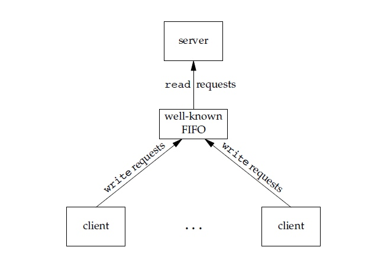

#### 消息队列
消息队列是消息的链接表，存放在内核中并由消息队列标识符标识。
用户可以从消息队列中读取数据和添加消息，其中发送进程添加消息到队列的末尾，接收进程在队列的头部接收消息，消息一旦被接收，就会从队列中删除。和FIFO有点类似，但是它可以实现消息的随机查询，比FIFO具有更大的优势，FIFO只能默认地接收。

#### 信号量
它是一个计数器，用于为多个进程提供对共享数据对象的访问。

#### 共享存储
共享内存就是允许两个或多个进程共享一定的存储区。就如同 malloc() 函数向不同进程返回了指向同一个物理内存区域的指针。当一个进程改变了这块地址中的内容的时候，其它进程都会察觉到这个更改。因为数据不需要在客户机和服务器端之间复制，数据直接写到内存，不用若干次数据拷贝，所以这是最快的一种IPC。
需要使用信号量用来同步对共享存储的访问。
多个进程可以将同一个文件映射到它们的地址空间从而实现共享内存。另外共享内存不是使用文件，而是使用内存的匿名段。

#### 套接字
套接字组成为 IP地址 + 端口号
与其它通信机制不同的是，它可用于不同机器间的进程通信。

## 线程间的通信
- 如果是同一进程下的线程，那么可以通过修改数据段的变量来实现线程通信
- 如果是不同进程下的线程
    - 可以通过消息发送来实现通信，每一个线程都拥有自己的消息队列，因此可以通过消息发送来实现通信
    - 可以通过事件实现线程间通信，线程监视着事件，当事件就绪时就执行对事件的操作。

### 抢占式进程调度和进程优先级
#### 早期的批处理系统
早期的批处理系统主要有三种进程调度算法，分别是先来先服务FCFS，短作业/进程优先 SJF/SPF，高响应比优先算法HRRN

先来先服务—FCFS
非抢占时的调度算法

短作业优先—SJF / 短进程优先—SPF
该算法分为抢占式和非抢占式
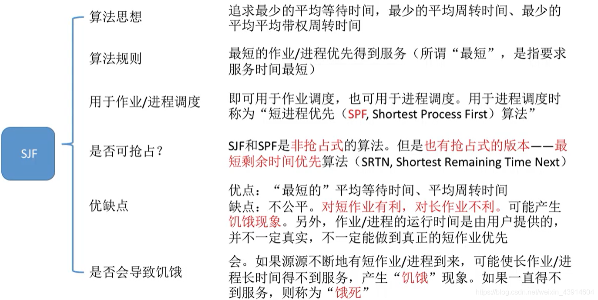

高响应比优先—HRRN
非抢占式的调度算法，该算法综合考虑了进程的服务时间以及等待时间
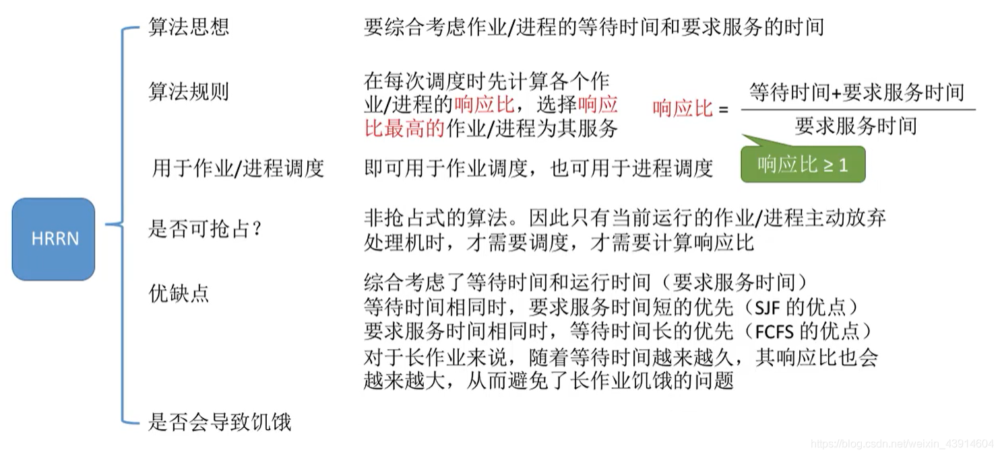

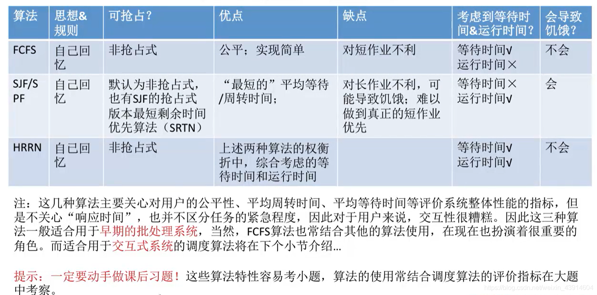

#### 适用于交互系统的调度算法
在交互系统中，主要有三种进程调度算法，分别是时间片轮转（RR）算法、优先级调度算法、多级反馈队列调度算法。

时间片轮转 RR
该算法属于抢占式的调度算法
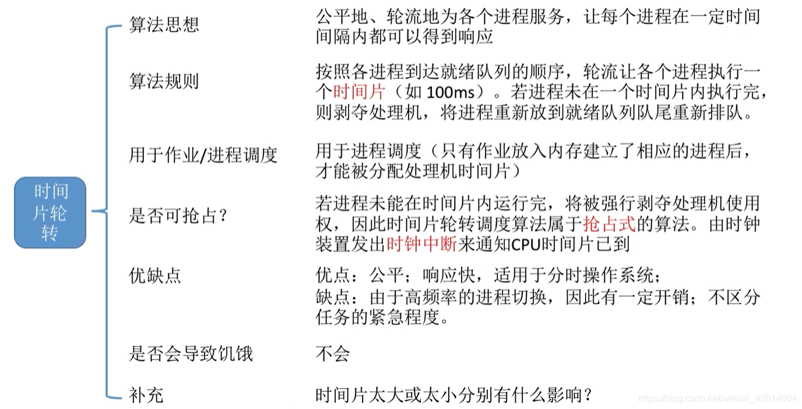

优先级调度算法
该算法分为抢占式以及非抢占式；非抢占式只能等待进程主动放弃处理机，而抢占式需要在就绪队列发生变化时，检测是否需要抢占。
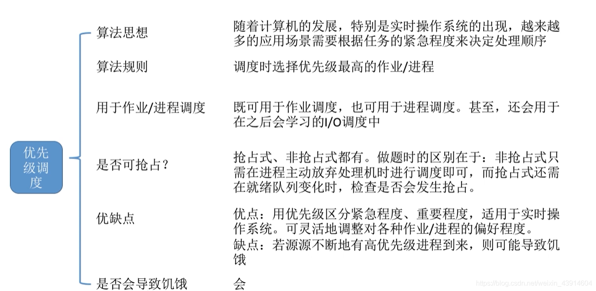

对于进程的优先级

多级反馈队列调度算法
结合了时间片以及优先级的抢占式调度算法。
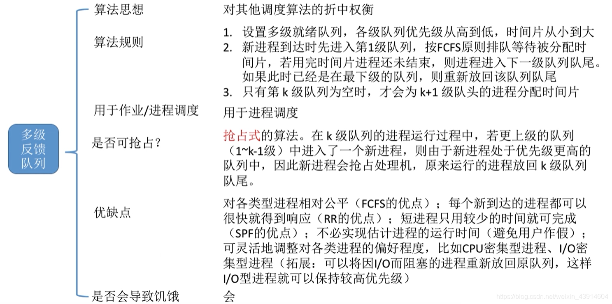

三种算法的对比

#### 进程优先级
对于进程优先级的设置一般遵循三个规则
- 系统级进程 > 用户级进程
- I/O型进程 > 计算型进程
- 交互进程（前台进程） > 非交互进程（后台进程）

### 僵尸进程与孤儿进程
先了解一些基本概念
我们知道在unix/linux中，正常情况下，子进程是通过父进程创建的，子进程再创建新的进程。子进程的结束和父进程的运行是一个异步过程,即父进程永远无法预测子进程 到底什么时候结束。 当一个进程完成它的工作终止之后，它的父进程需要调用wait()或者waitpid()系统调用取得子进程的终止状态，以及让系统去回收子进程资源。

　　==孤儿进程：一个父进程退出，而它的一个或多个子进程还在运行，那么那些子进程将成为孤儿进程。孤儿进程将被init进程(进程号为1)所收养，并由init进程对它们完成状态收集工作。==

　　==僵尸进程：一个进程使用fork创建子进程，如果子进程退出，而父进程并没有调用wait或waitpid获取子进程的状态信息，那么子进程的进程描述符仍然保存在系统中。这种进程称之为僵尸进程。==

#### 危害
僵尸进程：
unix提供了一种机制可以保证只要父进程想知道子进程结束时的状态信息， 就可以得到。这种机制就是: ==在每个进程退出的时候,内核释放该进程所有的资源,包括打开的文件,占用的内存等。 但是仍然为其保留一定的信息(包括进程号the process ID,退出状态the termination status of the process,运行时间the amount of CPU time taken by the process等)。直到父进程通过wait / waitpid来取时才释放==。 但这样就导致了问题，==如果进程不调用wait / waitpid的话， 那么保留的那段信息就不会释放，其进程号就会一直被占用，但是系统所能使用的进程号是有限的，如果大量的产生僵死进程，将因为没有可用的进程号而导致系统不能产生新的进程。==此即为僵尸进程的危害，应当避免。

孤儿进程：
孤儿进程是没有父进程的进程，孤儿进程这个重任就落到了init进程身上，init进程就好像是一个民政局，专门负责处理孤儿进程的善后工作。==每当出现一个孤儿进程的时候，内核就把孤儿进程的父进程设置为init，而init进程会循环地wait()它的已经退出的子进程。==这样，当一个孤儿进程凄凉地结束了其生命周期的时候，init进程就会代表党和政府出面处理它的一切善后工作。==因此孤儿进程并不会有什么危害。==

### 什么是IO多路复用？
IO多路复用是一种同步IO模型，实现一个线程可以监视多个文件句柄（文件句柄相当于文件的唯一标识符，当执行了系统调用语句后，会返回一个文件句柄）；一旦某个文件句柄就绪，就能够通知应用程序进行相应的读写操作；没有文件句柄就绪时会阻塞应用程序，交出cpu。多路是指网络连接，复用指的是同一个线程。
简单来说，就是多个IO操作共用一个线程。

## 原子操作原理
原子是指不能被进一步分割的最小粒子，而原子操作指的是不可被中断的一个或一系列操作。在多处理器上实现原子操作主要有两种实现。
1. 使用总线锁保证原子性
    1. 总线锁就是使用处理器提供的一个LOCK #信号，当一个处理器在总线上输出此信号时，其他处理器的请求将被阻塞住，那么该处理器可以独占共享内存。
2. 使用缓存锁保证原子性
    1. 因为在同一时刻，我们只需要保证对某个内存地址的操作是原子性即可，但是总线锁把CPU和内存之间的通信锁住了，这会造成在锁定期间，其他处理器不能操作其他内存地址的数据，所以总线锁定的开销比较大。
    2. 由于频繁使用的内存会缓存在处理器的高速缓存里，那么原子操作就可以直接在处理器内部缓存中进行，并不需要声明总线锁。
    3. 缓存锁是基于缓存一致性的，缓存一致性是指当某块CPU对缓存中的数据进行操作了之后，就会通知其他CPU放弃储存在它们内部的缓存，需要从主存中重新读取。
    4. 但是缓存锁有局限性：
        1. 当操作的数据不能被缓存在处理器内部，或操作的数据跨越多个缓存行（缓存行是缓存的最小存储单位），则处理器会调用总线锁
        2. 有些处理器不支持缓存锁。

        
## 临界区、互斥量、信号量、自旋锁和事件的区别和联系以及使用场景
进程或线程同步互斥的控制方法：
1. 临界区：通过对多线程的串行化来访问公共资源或一段代码，速度快，适合控制数据访问。
2. 互斥量：为协调共同对一个共享资源的单独访问而设计的，互斥对象只有一个。 
3. 信号量：为控制一个具有有限数量用户资源而设计，只能在进程上下文中使用，适合长时间访问共享资源的情况 
4. 自旋锁：适合短时间访问共享资源的情况，如果锁被长时间持有，等待线程会消耗大量资源 
5. 事件：用来通知线程有一些事件已发生，从而启动后继任务的开始。

==临界区==
1. 保证在某一时刻只有一个线程能访问关键数据的简便办法。在任意时刻只允许一个线程对共享资源进行访问。如果有多个线程试图同时访问同一临界区，那么在有一个线程进入后其他所有试图访问此临界区的线程将被挂起，并一直持续到进入临界区的线程离开。临界区在被释放后，其他线程可以继续抢占，并以此达到用原子方式操作共享资源的目的。
2. 在使用临界区时，一般不允许其运行时间过长，只要进入临界区的线程还没有离开，其他所有试图进入此临界区的线程都会被挂起而进入到等待状态，并会在一定程度上影响程序的运行性能。尤其需要注意的是不要将等待用户输入或是其他一些外界干预的操作包含到临界区。如果进入了临界区却一直没有释放，同样也会引起其他线程的长时间等待。虽然临界区同步速度很快，但却==只能用来同步本进程内的线程，而不可用来同步多个进程中的线程==。

==互斥量==
1. 和临界区有些相似，只有拥有互斥对象(即互斥量)的线程才具有访问共享资源的权限，由于互斥量只有一个，因此就决定了任何情况下此共享资源都不会同时被多个线程所访问。当占据资源的线程在任务处理完任务后应释放占有的的互斥量，以便其他线程在获得该互斥对象后得以访问资源。
2. 使用互斥不仅仅能够在同一应用程序不同线程中实现资源的安全共享，而且可以在不同应用程序的线程之间实现对资源的安全共享。 ==互斥量可以跨越进程使用。所以创建互斥量需要的资源更多，所以如果只为了在进程内部是用的话使用临界区会带来速度上的优势并能够减少资源占用量。==

==信号量==
1. 信号量对线程的同步方式与前面几种方法不同，信号允许多个线程同时使用共享资源，这与操作系统中的PV操作相同。它指出了同时访问共享资源的线程最大数目。它允许多个线程在同一时刻访问同一资源，但是需要限制在同一时刻访问此资源的最大线程数目。
2. 创建信号量时即要同时指出允许的最大资源计数和当前可用资源计数。一般是将当前可用资源计数设置为最大资源计数，每增加一个线程对共享资源的访问，当前可用资源计数就会减1，只要当前可用资源计数是大于0的，就可以发出信号量信号。但是当前可用计数减小到0时则说明当前占用资源的线程数已经达到了所允许的最大数目， 不能在允许其他线程的进入，此时的信号量信号将无法发出。
3. 线程在处理完共享资源后，应在离开的同时将当前可用资源计数加1。在任何时候当前可用资源计数决不可能大于最大资源计数。 
P操作申请资源： 
　　（1）S减1； 
　　（2）若S减1后仍大于等于零，则进程继续执行； 
　　（3）若S减1后小于零，则该进程被阻塞后进入与该信号相对应的队列中，然后转入进程调度。 
V操作释放资源： 
　　（1）S加1； 
　　（2）若相加结果大于零，则进程继续执行； 
　　（3）若相加结果小于等于零，则从该信号的等待队列中唤醒一个等待进程，然后再返回原进程继续执行或转入进程调度。 

==自旋锁==
自旋锁的目的是为了保护共享资源，实现线程同步。自旋锁区别于其他锁的地方在于若某线程在未获得锁时将不断的询问（判断）自旋锁保持者是否释放了锁（获取锁操作将自旋在那里，不断地申请获取，直到自旋锁保持者释放了锁），因此比较适用于保持锁时间比较短的情况（CPU一直在空转）。需要注意的是：一个锁只能有一个保持着。 

==事件==
事件对象也可以通过通知操作的方式来保持线程的同步。并且可以实现不同进程中的线程同步操作。

## 读写锁的实现
如果是同一进程里的不同线程共享读写锁，那么读写锁变量的维护在进程内部即可。如果是不同进程的共享读写锁，那么读写锁变量是维护在共享存储区。

读写锁的分配规则：
1. 只要没有线程占用写锁，那么任意数目的线程都可以持有这个读锁。
2. 要没有线程占用读写锁，那么才能为一个线程分配写锁。
读锁相当于共享锁，写锁相当于独占锁。

==分析进程关系==
主要有两个进程：读进程和写进程；
进程间的互斥关系：写进程与写进程互斥、读进程与写进程互斥。
读进程之间不互斥，可以共同访问。

==具体实现==
- 读进程优先
设置一个读写信号量A，初值为1；初始化count变量来记录读进程的个数；还要设置一个用于修改count变量时使用的信号量。
实现思路：
1. 读进程和写进程在读写之前都要先p读写信号量，这样就可以实现写进程之间互斥、读进程和写进程之间互斥的效果。
2. 为了实现读进程之间互不影响，共享访问，那么就要维护一个count变量用于记录当前的读进程个数，当count为0即第一个读进程到来时才对读写信号量进行p操作，后面的就不需要进行p操作了，从而实现了读进程之间的共享。
3. 由于存在对变量count的修改，那么还要维护一个锁来实现同一时间内只能有一个读进程可以修改到count变量
4. 当写进程写完之后要对读写信号量进行V操作，当最后一个读进程读完之后也要对读写信号量进行V操作，那么这样就会存在当读进程源源不断进来，写进程就无法进行，展现出了读进程优先的效果
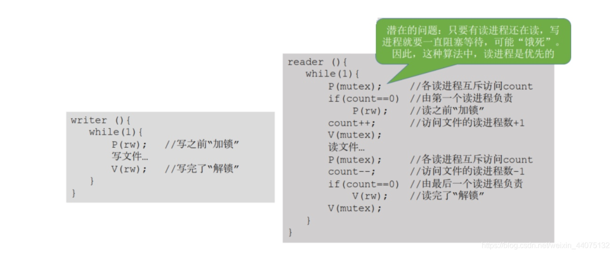

- 读写公平
由于上一个对读写锁的实现，是倾向于读进程的，那么就有可能会导致写进程一直处于饥饿的状态，为了解决这种问题，可以增加一个信号量用于实现写进程优先。

增加一个信号量用于尽管当前有多个读进程等待执行，但是由于这个信号量的存在，后续的读进程无法加入队列中，只能等待写进程执行完之后，后续的读进程才能加入队列中。
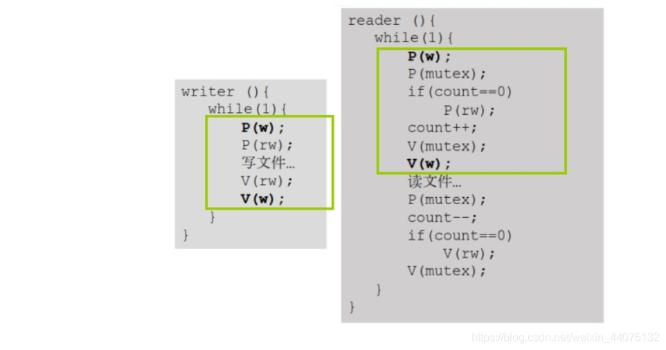

## 设计线程池
线程的创建和销毁的开销是很大的，会分配一下必要的资源，将其加入调度队列由操作系统调度。而线程池的目的就是减少线程的频繁创建和销毁，内部维护一定合理数量的线程，当有任务到来时，就分配线程执行，执行完成之后将线程重新调入到线程池完成复用。

==线程池设计的基本思想==
线程池的基本思想为：生产者-消费者模型；
一个简单的线程池至少包含以下组成部分：
- 线程池管理器：用于创建并管理线程池
- 线程队列：线程池中的线程
- 任务队列：存放待处理的任务

==线程池的工作流程==
1. 初始化线程池，包括初始化线程池管理器、线程队列以及任务队列
2. 有任务时向任务队列中添加任务，并通知线程池管理器
3. 线程池管理器收到通知后，尝试从线程队列中分配空闲的线程去执行该任务，若线程都处于处理状态，那么只能等到其中一个线程空闲了才可以处理该任务
4. 等待任务队列的任务执行完成
5. 执行完成之后关闭线程池。

## 静态链接、动态链接
- 静态链接
将工程项目里的每个源文件经过编译器编译汇编得到的目标文件进行链接，从而形成一个可执行文件，这就是静态链接。
在链接过程中，链接器的主要有两个任务
1. 符号解析：每个符号对应一个函数、一个全局变量或一个静态变量，符号解析的目的就是将每个符号解析以及符号引用关联起来。
2. 重定位：链接器通过每个符号定义与一个内存位置关联起来，然后修改所有对这些符号的引用，使得它们指向那个内存地址。
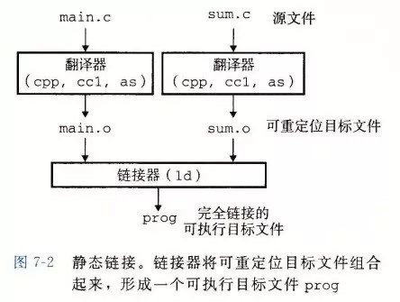

静态链接和动态链接两者最大的区别就在于链接的时机不一样，静态链接是在形成可执行文件之前的，而动态链接的进行是在程序运行时的。

- 动态链接
动态链接的出现主要是为了解决静态链接的局限性；
静态链接会存在更新困难以及浪费内存空间的不足。
1. 当有多个源文件里存在共同的静态库，那么就会有多个目标文件对这个静态库进行链接，每个链接都会拷贝一个副本，那么就会大大浪费存储空间。
2. 当静态库要更新时，那么整个程序都要重新进行链接

动态链接的基本思想是把程序按照模块拆分成多个相对独立部分，在程序运行时才将它们链接在一起形成一个完整的程序，而不像静态链接在运行前就把所有的程序模块链接成一个单独的可执行文件。

## 死锁
### 死锁、饥饿、死循环的区别

### 死锁产生的四个必要条件

### 什么时候会发生死锁？
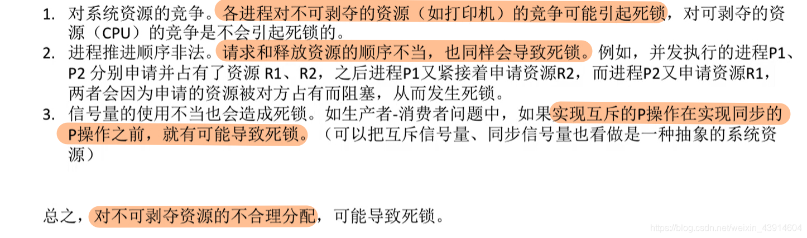

### 死锁的处理策略

#### 预防死锁
① 破坏互斥条件

② 破坏不可剥夺条件
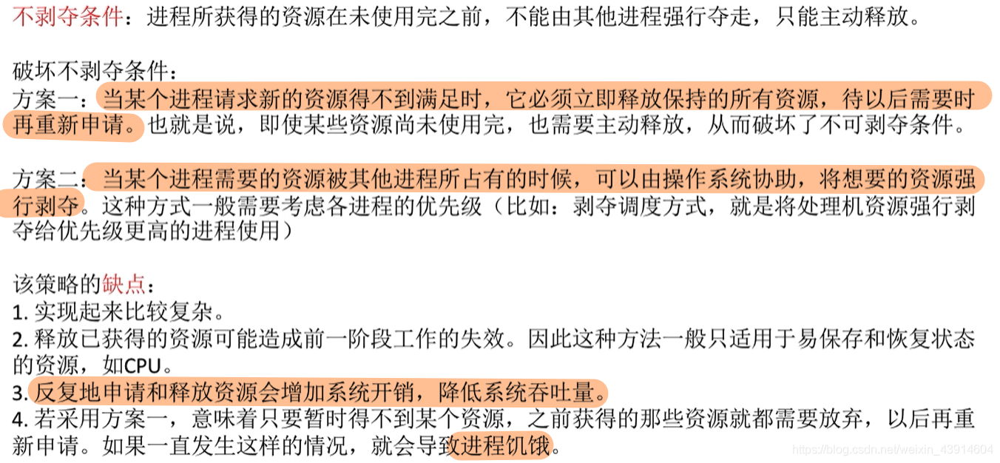
③ 破坏请求和保持条件
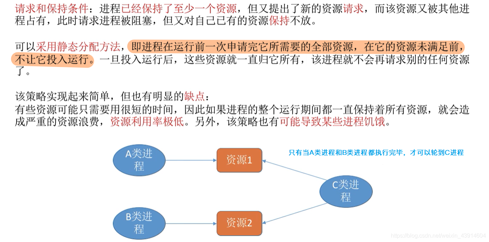
④ 破坏循环等待条件
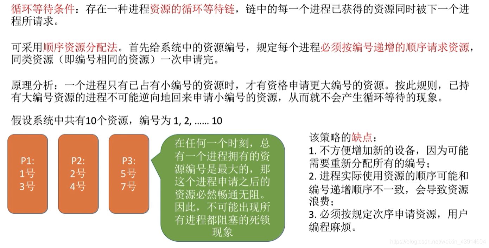

#### 避免死锁
系统在分配资源时利用银行家算法来决定是否允许将资源分配出去。
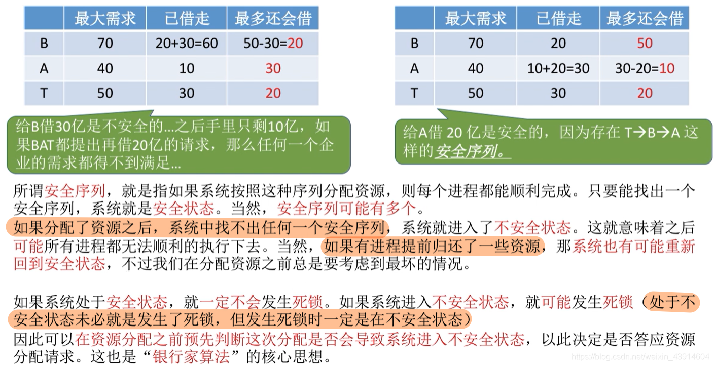

#### 死锁的检测和解除

① 死锁的检测
利用资源分配图来进行死锁的检测；
在资源分配图中，如果可以消除图中的所有分配资源的边，那么证明无死锁发生。
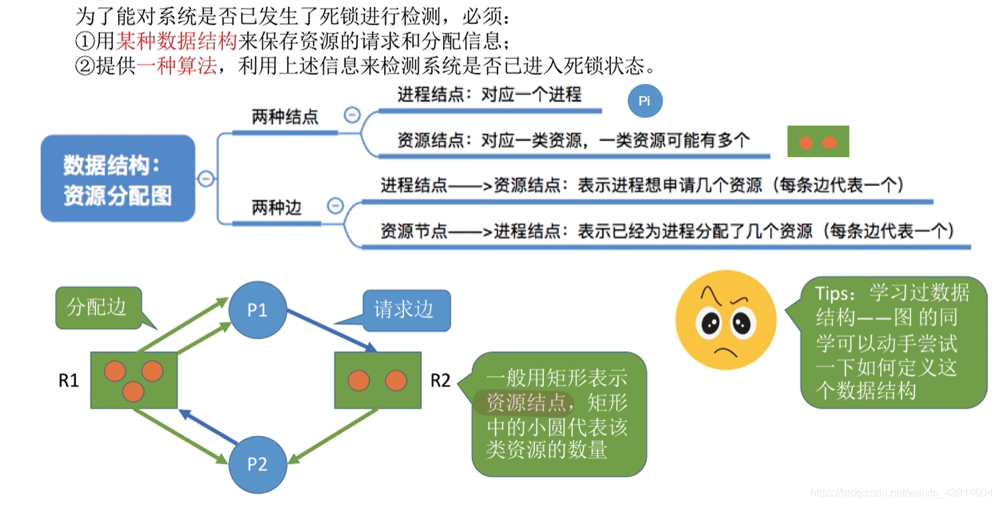

② 死锁的解除
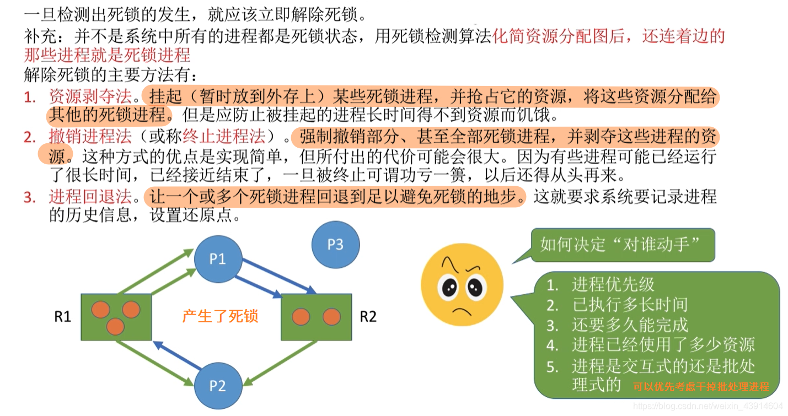

## 内存管理
### 堆&栈
栈区（stack）—— 由操作系统自动分配和释放，主要用于存放函数参数值，局部变量等。其操作方式类似于数据结构中的栈。 
堆区（heap）—— 一般由程序员动态分配和释放，若程序员不主动释放，则程序结束后由操作系统回收。注意，它与数据结构中的堆是不同的，分配方式类似于链表。 
- 数据结构中的堆：是用数组实现的二叉树，内部是没有父指针或者子指针的。堆根据“堆属性”来进行排序。“堆属性”决定了树中结点的位置。
- “堆属性”：其实就是我们熟悉的小顶堆或者大顶堆。

#### 申请方式对比
栈stack：
由系统自动分配。例如，声明在函数中一个局部变量，即int b，系统自动在栈中为变量b开辟空间。

堆heap：
需要程序员自己申请，并指明大小。
在C中使用malloc函数，如p1 = (char *)malloc(10)

在C++中用new运算符，如p2 = new char[10]

但是p1、p2本身是在栈中的。

#### 申请后系统响应
栈stack：
只要栈的剩余空间大于所申请空间，系统将为程序提供内存，否则将返回异常提示栈溢出。

堆heap：
操作系统持有空闲分区链表来管理空闲的内存块，当系统收到程序的申请时，会遍历该链表，寻找第一个空间大于所申请空间的内存块节点，然后将该节点从空闲节点链表中删除，并将该节点的空间分配给程序。另外，对于大多数系统，会在这块内存空间中的首地址处记录本次分配的大小，这样，代码中的delete语句才能正确的释放内存空间。另外，由于找到的空闲内存块节点的大小不一定正好等于申请的大小，系统会自动的将多余的那部分重新放入空闲链表中。

#### 申请大小的限制
栈stack：
在Windows下，栈是向低地址扩展的数据结构，是一块连续的内存的区域。也就是说，栈顶的地址和栈的最大容量是系统预先规定好的。在Windows下，栈的大小是2M（也有的说是1M，总之是一个编译时就确定的常数），如果申请的空间超过栈的剩余空间时，将提示内存溢出。因此，能从栈获得的空间较小。
因此，当同一时间内需要将大量的数据存在栈里，有可能会导致栈溢出，那么可以适当将一些数据分配到堆或者是全局区，堆区和全局区的容量相对栈区来说是大很多的。

堆heap：
堆是向高地址扩展的数据结构，是不连续的内存区域。这是由于系统是用链表来存储空闲内存地址的，自然是不连续的，而链表的遍历方向是由低地址向高地址。堆的大小受限于计算机系统中有效的虚拟内存。由此可见，堆获得的空间比较灵活，也比较大。

#### 申请效率对比
栈由系统自动分配，速度较快，但程序员是无法控制的。

堆是由new/malloc进行内存分配，一般速度比较慢，且容易产生内存碎片，不过用起来最方便，速度快，也最灵活。

#### 存储内容对比
栈stack：
在函数调用时，第一个进栈的是主函数中后的下一条指令（函数调用语句的下一条可执行语句）的地址，然后是函数的各个参数，在大多数的C编译器中，参数是由右往左入栈的，然后是函数中的局部变量。注意静态变量是不入栈的。当本次函数调用结束后，局部变量先出栈，然后是参数，最后栈顶指针指向最开始存的地 址，也就是主函数中的下一条指令，程序由该点继续运行。

堆heap：
一般是在堆的头部用一个字节存放堆的大小，堆中的具体内容由程序员安排。

### 虚拟内存（Virt）&常驻内存（Resident）&共享内存（Shared）
#### 虚拟内存（Virt）
虚拟内存是操作系统内核为了对进程地址空间进行管理而设计的一个逻辑意义上的内存空间概念。我们程序中的指针其实都是这个虚拟内存空间上的地址，直到程序运行起来之后，操作系统会给进程分配一个页映射表，页映射表上存储着进程的虚拟内存空间到物理内存之间的映射，当CPU访问进程的虚拟内存地址时，就会从页映射表上查处对应的物理内存地址，这样才能访问到数据。

##### 虚拟内存下的页面置换算法
##### 最佳置换算法OPT
优先淘汰在接下来时间里最长时间内不被使用到的页面。
这个置换算法是缺页率最小的，但基本上是实现不了的。比如在应用程序下，系统是无法预知下一步调用的是哪个函数的。

##### 先进先出算法FIFO
优先淘汰最先进入内存的页面，实现简单，但是性能很差。

##### 最近最久未使用算法LRU
优先淘汰最近最久未访问的页面。
在内存里会维护一张双向链表，当一个页面被访问时，就会被移到链头，这样就可以保证在链尾的页面都是最近最久未被使用的页面。
这种算法，每次都要更新链表，代价很高。

##### 时钟算法Clock 
优先淘汰指针指向的页面以及后续页面中最近没有被访问的页面。
在内存中会有一个循环链表将页面链接起来，每个页面都会有一个访问状态位，当被访问时就会被置1，同时链表上还有一个指针，当指针指向的页面访问位为0时，就会被置换，为1时就会将访问位置0，然后指针指向下一个页面。

##### 改进的时钟算法 NRU - 最近未使用算法
时钟算法只是考虑了页面最近有没有被访问，而改进后的时钟算法同时考虑了访问和修改。
当访问位与修改位设置为R，W，值为1代表被访问或者修改了
在时钟算法的基础上，当要进行页面置换时
1. 第一次扫描优先寻找（0，0）的页面
2. 第二次扫描优先寻找（0，1）的页面，并会将扫描过的页面的访问位置0
3. 第三次扫描优先寻找（0，0）的页面
4. 第四次扫描优先寻找（0，1）的页面。
总的来说，就是优先选择没有被访问，没被修改的页面，然后是没被访问，但被修改的页面，接着是被访问了，但是没被修改的页面，最后就是既被访问，又被修改的页面。

#### 常驻内存（Resident）/ 驻留内存
驻留内存，即驻留在物理内存上的虚拟内存。一个进程有多少个虚拟内存被映射到物理内存上，那么就会有多少个驻留内存。

#### 共享内存（Shared）
共享内存指的是被多个虚拟内存同时映射到的物理内存。
共享内存主要存在于：
1. 程序对于动态库的映射，程序中可能有多个文件共同引用了某个动态库，而动态库只会在物理内存上保存一份，那么就会出现多个文件同时引用这块物理内存。
2. 用于进程之间的通信：进程之间的通信可通过共享内存实现通信。

### 匿名映射和文件映射
mmap是一种内存映射文件的方法，即将一个文件或者其他对象映射到进程的地址空间，实现文件磁盘地址和进程虚拟地址空间中的一一对应关系。实现这样的映射关系后，当有两个或以上的进程映射了同一个文件，那么就相当于实现了进程间的通信。

文件映射的关键在于：两个或以上的进程都持有同一文件的文件话柄，从而实现进程之间的通信。
匿名映射：即没有映射到对应的文件；这种映射主要用于父进程与子进程之间的通信；父进程在调用mmap()后，再调用fork()创建出子进程，那么子进程就会继承父进程的资源，那么子进程也会获取到匿名映射后的地址，从而实现父进程和子进程之间的通信。

#### mmap
##### 传统IO
基于传统的IO方式，底层实际上通过调用`read()`和`write()`来实现。
通过`read()`把数据从硬盘读取到内核缓冲区，再复制到用户缓冲区；然后再通过`write()`写入到`socket`缓冲区，最后写入网卡设备。

整个过程发生了4次用户态和内核态的上下文切换和4次拷贝，具体流程如下：
1. 用户进程通过read()方法向操作系统发起调用，此时上下文从用户态转向内核态
2. DMA控制器把数据从硬盘中拷贝到读缓冲区
3. CPU把读缓冲区数据拷贝到应用缓冲区，上下文从内核态转为用户态，read()返回
4. 用户进程通过write()方法发起调用，上下文从用户态转为内核态
5. CPU将应用缓冲区中数据拷贝到socket缓冲区
6. DMA控制器把数据从socket缓冲区拷贝到网卡，上下文从内核态切换回用户态，write()返回

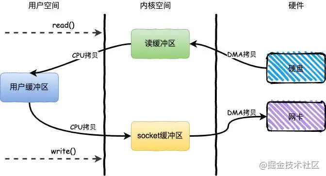

##### DMA拷贝
因为对于一个IO操作而言，都是通过CPU发出对应的指令来完成，但是相比CPU来说，IO的速度太慢了，CPU有大量的时间处于等待IO的状态。
因此就产生了DMA（Direct Memory Access）直接内存访问技术，本质上来说他就是一块主板上独立的芯片，通过它来进行内存和IO设备的数据传输，从而减少CPU的等待时间。
但是无论谁来拷贝，频繁的拷贝耗时也是对性能的影响。

##### 零拷贝
零拷贝技术是指计算机执行操作时，CPU不需要先将数据从某处内存复制到另一个特定区域，这种技术通常用于通过网络传输文件时节省CPU周期和内存带宽。

##### 内存映射mmap技术
mmap主要实现方式是将读缓冲区的地址和用户缓冲区的地址进行映射，内核缓冲区和应用缓冲区共享，从而减少了从读缓冲区到用户缓冲区的一次CPU拷贝。
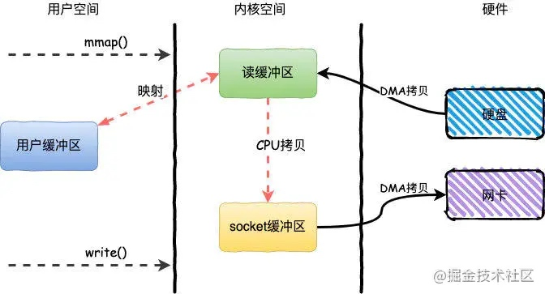

整个过程发生了4次用户态和内核态的上下文切换和3次拷贝，具体流程如下：
1. 用户进程通过mmap()方法向操作系统发起调用，上下文从用户态转向内核态
2. DMA控制器把数据从硬盘中拷贝到读缓冲区
3. 上下文从内核态转为用户态，mmap调用返回
4. 用户进程通过write()方法发起调用，上下文从用户态转为内核态
5. CPU将读缓冲区中数据拷贝到socket缓冲区
6. DMA控制器把数据从socket缓冲区拷贝到网卡，上下文从内核态切换回用户态，write()返回

### Free & Available
`free`是真正尚未被使用的物理内存数量。
`available`是应用程序认为可用内存数量，一般`available = free + buffer + cache `

### Buffer & Cache
`Buffer`即为缓冲，`Cache`即为缓存。
硬件存在制作工艺上的差别，当两种硬件进行交互的时候，肯定会存在速度上的差异，因此，为了减少两者因速度差异引发的矛盾，引入`Buffer`和`Cache`。

`Cache`
- 当存取速度快的设备要从存取速度慢的设备 取一个文件，那么速度快的就要等速度慢的传输完才能接收到文件，由于速度的差异导致速度快的设备都等更多的时间；那么`Cache`的出现就是为了减少设备间速度上的差异，设备间发送文件先将文件发送到`Cache`上，`Cache`在发送给对方的同时也缓存了一份，下次有需要到就直接发送，不需要等另一方存进来。

`Buffer`
- 当存取速度快的设备要发送文件要存取速度慢的设备上，如果直接发送过去，存取速度慢的是来不及接收的，那么为了解决这种问题，在两者之间增加一个`Buffer`即缓冲区，存取速度快的设备先发送数据到缓冲区里，而存取速度慢的再从缓冲区里慢慢取出数据。
- 这里的缓冲区两边端口的存取速率其实不一样的，靠近速度快的那一边速度快，靠近速度慢的那一边速度相对较慢，几乎是跟相邻的设备速度匹配的。

### 内存的分配与回收
内存的分配有连续管理分配以及非连续管理分配两种方式。
连续管理分配：给程序分配连续的内存。
- 单一连续分配：只能在单用户、单进程的操作系统中使用、分配过程就是将内存分为了系统区和用户区，用户区存在用户进程。
- 固定分区分配：内存空间被划分为若干个固定大小的区域，每个分区存放整个程序，内部维护一个分区说明表来实现分区的分配和回收
- 动态分区分配：根据进程实际需要，动态分配内存空间；内部维护空闲分区表或者空闲分区链来记录内存分区的使用情况。

动态分区分配的四种算法：
- 首次适应算法：每次从低地址开始找，直到找到第一个容量大小符合条件的。
- 最佳适应算法
- 最坏适应算法
- 邻近适应算法

内存回收时，相邻的空闲分区要合并，并更新空闲分区表/链。
每种情况的回收过程：空闲分区链
- 回收区在空闲区下边：不需要新建空闲链表节点，只需要将相邻分区的容量扩大
- 回收区在空闲区上边：将回收区与空闲区合并，并更新节点地址
- 回收区位于两个空闲区中间：三个空闲区进行合并，合并为地址为最前面的空闲区的地址
- 单独的回收区：为回收区创建新的空闲节点，并插入到相应的空闲分区链表中。

而在非连续分配管理方案中有：
- 基本分页存储管理
- 基本分段存储管理
- 段页式存储管理

基本分页存储管理：
- 把进程分页，各个页面可以离散地放到各个内存块中，页面的大小一般跟内存块的大小是一样的。
- 一个进程对应一张页表，进程的每一页对应一个页表项，页表记录进程页面和实际存放的内存块之间的对应关系。

基本分段存储管理：
- 按照程序自身的逻辑关系划分若干个段，每个段在内存中占据连续空间，但各段之间可以不相邻。
- 一个进程对应一张段表，每个段对应一个段表项，段表项由段号、段长、基址组成。

分页和分段的区别在于：
- 分页对用户不可见，分段对用户可见
- 分段更容易实现信息的共享和保护

段页式存储管理
段页式存储管理其实就是综合了页式管理和段式管理。
分页管理：不访问按照逻辑模块实现信息的共享和保护。
分段管理：如果段长过大，要为其分配很大的连续内存空间，不方便管理。

- 先按照程序自身的逻辑关系划分为若干个段，再将各段分为大小相等的页面
- 那么就同时需要有段表和页表进行管理了
    - 每个段对应一个段表项，由段号、页表长度、页表存放地址组成
    - 每个页对应一个页表项，由页号、页面存放的内存块号组成。

为了减少每次访存带来的开销，在查询时引入了快表（TLB）。
快表（TLB）是一种高速缓冲存储器，是一种访问速度比内存快很多的高速缓冲存储器，用来存放先前访问过的若干页表/段表项，以加速地址变换的过程。与此对应，内存中的页表/段表称为慢表。
快表里面主要存储页号、内存块号。

快表的进一步理解：快表TLB其实就是一种高速缓冲存储器，里面存储的是当前进程页号与内存块号的映射关系，当发生了进程调度之后，那么快表TLB就会更新为新的进程的映射关系。如果是多核的情况下，应该是每个处理器都会有对应的快表即高速缓冲，因为多核的情况下即表示可以并行多个进程，那么就得需要多个快表来支持。

引入快表之后，地址变换就变为：
1. 根据逻辑地址得出页号，页内地址
2. 将页号与快表中的所有页号进行比对，若命中，则直接访问对应的物理地址
3. 若不命中，则需要访问内存中的页表，找到对应的页表项，才能转换出真实的物理地址，在这过程中，还会将对应的页表项同步到快表中。
4. 那么快表命中，则只需要一次访存即可；快表不命中，那么就需要两次访存，第一次访问页表，第二次访问物理地址。

### 虚拟地址和物理地址的翻译（MMU & TLB）
#### MMU
MMU是Memory Management Unit的缩写，中文名是内存管理单元。它是一种负责处理中央处理器（CPU）的内存访问请求的计算机硬件。它的功能包括虚拟地址到物理地址的转换、内存保护、中央处理器高速缓存的控制。

#### 面试答这个
当处理器访问到虚拟地址时，会将虚拟地址送往MMU，MMU获取虚拟地址中的虚拟页号，然后将虚拟页号送往TLB中，如果命中就返回，不命中的话，MMU就会查页表寄存器中的值，然后结合虚拟页面算出对应的页表项地址，这样就查询到了虚拟页号对应的物理页号，然后根据物理页号和页内地址就可以得到虚拟地址对应的物理地址。

#### 当CPU第一次访问虚拟地址时
由于是第一次，虚拟地址所在的虚拟页不在内存中，虚拟页表项也不在TLB中，因此需要执行的步骤比较多。
1. 处理器将虚拟地址(VA)送往MMU(内存管理单元)
2. MMU获取虚拟地址中的虚拟页号(VPN)，然后将虚拟页号发送给TLB(翻译后备缓冲器),TLB根据虚拟页号从TLB映射表中查询PTE(页表项即Page Table Entry)。
3. TLB(翻译后备缓冲器)将查询结果返回给MMU(内存管理单元)
4. MMU(内存管理单元)分析查询结果是否有PTE(页表项)，发现PTE为空，没有命中,因此MMU根据页表基址寄存器(PTBR)中的页表起始地址加上虚拟页号(VPN)，得出虚拟页页表项的物理地址PTEA（即Page Table Entry Address），然后将这个物理地址送往高速缓冲(L1)。
5. 高速缓冲(L1)根据PTEA查询内部的缓冲映射表，发现没有找到PTEA映射的内容即PTE（页表项），然后向内存请求PTEA下的内容。
6. 内存将PTEA（物理地址）下的内容PTE（页表项），发送给高速缓冲(L1)，高速缓冲(L1)建立了PTEA和PTE的映射关系。
7. 高速缓冲(L1)再次根据PTEA查询内部的缓冲映射表，这次找到了，然后将PTE发送给TLB。
8. TLB收到了PTE后，建立了虚拟页号(VPN)和PTE（物理地址）的映射（8），然后将PTE发送给MMU。
9. MMU收到了PTE后，检查PTE的有效位，看看虚拟页是否在内存中。
10. MMU检查PTE后，发现虚拟页不在内存中，因此发送缺页中断给CPU，CPU开始执行缺页中断处理程序。
11. 缺页中断处理程序根据页面置换算法，选择出一个已经缓冲的虚拟页作为牺牲页（如果这个虚拟页发生了变化，则更新到磁盘中），将这个牺牲页的PTE的有效位设置为0，表明这个牺牲页不在内存了。
12. 缺页中断处理程序将缺少的页，从磁盘换入到空闲的物理内存中，设置缺少的虚拟页的PTE的有效位为1，更新物理号。
13. 缺页中断处理程序执行完毕，跳转到发生缺页的指令处，然后CPU重新执行该指令，重新发出虚拟地址到MMU,跳到了1，开启下一个循环。

#### 当CPU第二次访问同一个虚拟地址时
虚拟地址所在的虚拟页已经内存中，虚拟页表项(PTE)也在TLB中了，因此需要执行的步骤少了很多
1. 处理器将虚拟地址(VA)送往MMU(内存管理单元)
2. MMU获取虚拟地址中的虚拟页号(VPN)，然后将虚拟页号发送给TLB(翻译后备缓冲器),TLB根据虚拟页号从TLB映射表中查询PTE(页表项即Page Table Entry)。
3. TLB(翻译后备缓冲器)将查询结果返回给MMU(内存管理单元)
4. 4.MMU(内存管理单元)分析查询结果是否有PTE(页表项)，发现PTE有值，命中了，然后检查PTE的有效位，发现有效位是1，因此不缺页，根据PTE中的物理号加上虚拟地址中的(VPO)计算出指令或者数据的物理地址PA,将PA发送到高速缓冲(L1)
5. 高速缓冲(L1)根据PA查询内部的缓冲映射表，发现没有找到PA映射的内容即指令或者数据，然后向内存请求PA下的内容。
6. 内存将PA下的内容，发送给高速缓冲(L1)，高速缓冲(L1)建立了PA和内容的映射关系。
7. 高速缓冲(L1)再次根据PA查询内部的缓冲映射表，这次找到了，然后将代码或者指令发送到数据总线，CPU收到数据总线的数据后，感叹道，终于拿到数据了。

当CPU第三次访问同一个虚拟地址时，与第二次不同的是，因为虚拟地址对应的物理地址的数据，已经映射到高速缓冲(L1),所以不再从内存中查询。

#### 当CPU第三次访问同一个虚拟地址时
当CPU第三次访问同一个虚拟地址时，与第二次不同的是，因为虚拟地址对应的物理地址的数据，已经映射到高速缓冲(L1),所以不再从内存中查询。

### Drop Cache以后可用内存不再增加的原因
- `free`是真正尚未被使用的物理内存数量。
- `available`是应用程序认为可用内存数量，一般`available = free + buffer + cache `
- 因此本身可用内存已经是包含了cache了，因此手动释放之后，可用内存还是不会再增加了。

### 内存碎片 & 内存整理
内存碎片分为 内部碎片 和 外部碎片。
1. 内部碎片：已经被分配出去的内存空间大于请求所需的内存空间，不能被利用的空间就是内存碎片。
2. 外部碎片：还没有分配出去的内存空间，但是大小小于请求需要的而无法分配出去的内存空闲块。

碎片整理：
通过调整进程占用的分区位置来减少或避免分区碎片。
1. 紧凑技术通过移动分配给进程的内存分区，以合并外部碎片。紧凑的条件是：所有的应用程序都可以动态重定位。
2. 分区对换：通过抢占并回收处于等待状态进程的分区，以增大可用内存空间。 —— 将那么阻塞状态的进程的分区调换出外存来换取更大的内存空间。

    